# خواننده تلگرام

<!-- TOP_NAV START -->

<a href="https://github.com/morii86/aio-downloader/blob/main/telegram/content/archive_1.md" style="display:inline-block; padding:6px 12px; margin:0 4px; background-color:#2ea44f; color:white; text-decoration:none; border-radius:4px; font-weight:bold;">صفحه بعد</a>

<!-- TOP_NAV END -->

<!-- MSG START -->

---
📅 بروزرسانی: 1405/02/22 21:23
---

## VahidOOnLine — post 239754

  

بلومبرگ گزارش داد امارات متحده عربی از زمان آغاز کارزار آمریکا و اسرائیل علیه جمهوری اسلامی در اسفند ماه، بیش از یک‌بار ایران را هدف حمله قرار داده است.بلومبرگ به نقل از «افراد مطلع» نوشت این حملات هم پیش از برقراری آتش‌بس و هم پس از آن انجام شده است.

براساس این گزارش، در طول جنگ، همکاری میان امارات متحده عربی و اسرائیل شامل تبادل اطلاعات، شناسایی و رهگیری موشک‌ها و پهپادهای ایرانی و همچنین انتخاب اهداف در ایران بوده است.
‌🏁 🇬🇧 IranintlTV

🤖 @VahidOOnLine

## VahidOOnLine — post 239753

  <a href="telegram/content/VahidOOnLine_239753_1778608432.mp4" target="_blank">🎬 Download video</a>

جان هیلی، وزیر دفاع بریتانیا، اعلام کرد لندن جنگنده، پهپاد و یک ناو جنگی را به مأموریت چندملیتی حفاظت از تردد کشتی‌ها در تنگه هرمز اعزام خواهد کرد.

هیلی این خبر را پس از نشست مشترک با وزرای دفاع ۴۰ کشور اعلام کرد؛ نشستی که با هدف جلب حمایت برای مأموریت تحت رهبری بریتانیا جهت تأمین امنیت کشتیرانی در تنگه هرمز برگزار شد.

بریتانیا می‌گوید این مأموریت در واکنش به محاصره تنگه هرمز از سوی جمهوری اسلامی انجام می‌شود.
‌🏁 🇬🇧 ManotoTV

🤖 @VahidOOnLine

## VahidOOnLine — post 239752

  

هاکان فیدان، وزیر خارجه ترکیه، در گفت‌وگو با الجزیره گفت اولویت اصلی آنکارا حفظ آتش‌بس میان واشینگتن و تهران است و تاکید کرد فوری‌ترین نگرانی ترکیه تداوم این آتش‌بس است، زیرا در حال حاضر این موضوع بیشترین اهمیت را دارد.

وزیر خارجه ترکیه افزود هیچ‌کس خواهان بازگشت به جنگ نیست، چرا که اقتصاد جهانی و امنیت انرژی جهان همین حالا نیز به اندازه کافی آسیب دیده است.

هاکان فیدان همچنین گفت ترکیه و دیگر کشورهای منطقه از جمله قطر برای حمایت از پاکستان به‌عنوان میانجی اصلی همکاری می‌کنند و در روند میانجی‌گری، زمانی که کار به بن‌بست می‌رسد، دشوارترین بخش یافتن ایده‌های خلاقانه است؛ گاهی طرفین و حتی خود میانجی نیز قادر به ارائه چنین ایده‌هایی نیستند.
‌🏁 🇬🇧 IranintlTV

🤖 @VahidOOnLine

## VahidOOnLine — post 239751

♦️ژنرال دن کین، رئیس ستاد مشترک نیروهای مسلح آمریکا، روز سه‌شنبه ۲۲ اردیبهشت‌ماه در جلسه استماع بودجه در کنگره گفت ایران قطعا فشار ناشی از محاصره و تحریم‌ها را احساس می‌کند.

او افزود این فشار تنها به محاصره محدود نمی‌شود و ادامه تحریم‌هایی که وزارت خزانه‌داری و دیگر نهادهای آمریکایی اعمال کرده‌اند نیز بخشی از آن است. دن کین همچنین تاکید کرد آمریکا همچنان «مجموعه‌ای از گزینه‌های نظامی» را در اختیار دارد.
‌🇸🇦 Indypersian

🤖 @VahidOOnLine

## VahidOOnLine — post 239750

  

دادگاه کیفری عالی بحرین سه نفر از جمله یک زن را به اتهام «همکاری» با جمهوری اسلامی به حبس ابد محکوم کرد.
دادستان‌ها اعلام کردند این زن در «ارتباط» با سپاه پاسداران بوده و قصد داشته «اقدامات تروریستی خصمانه» در بحرین انجام دهد.
در پرونده‌های جداگانه، ۱۰ نفر دیگر به اتهام «حمایت و تایید حملات تروریستی جمهوری اسلامی علیه بحرین»، انتشار اطلاعات ممنوع و عکسبرداری از اماکن ممنوعه، به احکام حبس تا ۱۰ سال محکوم شدند.

پیش‌تر نیز وزارت کشور بحرین اعلام کرد دستگاه‌های امنیتی این کشور یک تشکیلات مرتبط با سپاه پاسداران و تفکر «ولایت فقیه» را شناسایی کرده‌اند و ۴۱ نفر از اعضای آن را بازداشت کرده‌اند.
‌🏁 🇬🇧 IranintlTV

🤖 @VahidOOnLine

## VahidOOnLine — post 239749

  

♦️ دیک دوربین، سناتور دموکرات ایالت ایلینوی، روز سه‌شنبه ۲۲ اردیبهشت، در جلسه کمیته تخصیص بودجه سنا از ژنرال دن کین، رئیس ستاد مشترک ارتش آمریکا، پرسید که ایران چگونه همچنان توانایی متوقف کردن تردد کشتی‌ها در تنگه هرمز را دارد؟

ژنرال کین در پاسخ به اعضای این کمیته گفت: «اوضاع در آنجا پیچیده است؛ قایق‌های کوچک متعدد و توانمندی‌های دیگری در منطقه حضور دارند. بخشی از این مشکل به ترددکنندگان تجاری برمی‌گردد، اما ریشه اصلی مسئله به همان مشکل همیشگی، یعنی گروگان گرفته شدن اقتصاد جهانی توسط ایران از طریق این تنگه مربوط می‌شود.»

او در ادامه افزود: «من آن‌ها را تشویق می‌کنم که درباره اقدامات بعدی خود خردمندانه فکر کنند و از این فرصت برای بازگشایی تنگه استفاده نمایند؛ این انتخابی است که آن‌ها باید انجام دهند.»
‌🇸🇦 Indypersian

🤖 @VahidOOnLine

## VahidOOnLine — post 239748

  <a href="telegram/content/VahidOOnLine_239748_1778608435.mp4" target="_blank">🎬 Download video</a>

سازمان جهانی بهداشت هشدار داد شمار موارد ابتلا به هانتاویروس، پس از شیوع این ویروس در یک کشتی گردشگری در اقیانوس اطلس، احتمالاً افزایش پیدا خواهد کرد.
تدروس آدهانوم، مدیرکل سازمان جهانی بهداشت، اعلام کرد تاکنون ۹ مورد ابتلای قطعی و دو مورد مشکوک ثبت شده و انتظار می‌رود افراد بیشتری نیز به ویروس مبتلا شده باشند. با این حال او تأکید کرد خطر شیوع گسترده جهانی همچنان «پایین» ارزیابی می‌شود.
شیوع بیماری در کشتی «ام‌وی هوندیوس» آغاز شد؛ جایی که سه مسافر، شامل یک زوج هلندی و یک زن آلمانی، جان خود را از دست دادند. این کشتی در حال سفر ۳۵ روزه در اقیانوس اطلس بود.
هانتاویروس معمولاً از طریق ادرار، بزاق یا فضولات جوندگان منتقل می‌شود. گونه «آندِس» تنها نوع شناخته‌شده‌ای است که می‌تواند از انسان به انسان منتقل شود.
در پی این بحران، صدها مسافر و خدمه در کشورهای مختلف تحت قرنطینه یا مراقبت پزشکی قرار گرفته‌اند. مقام‌های بهداشتی در اروپا و آمریکا نیز در حال ردیابی تماس‌های مرتبط با مبتلایان هستند.
‌🏁 🇬🇧 ManotoTV

🤖 @VahidOOnLine

## VahidOOnLine — post 239747

  

♦️ پیت هگست، وزیر دفاع ایالات متحده، روز سه‌شنبه ۲۲ اردیبهشت، به قانون‌گذاران اعلام کرد که در سفر قریب‌الوقوع دونالد ترامپ به چین، او را همراهی خواهد کرد؛ سفری که در میانه ابهامات شدید پیرامون پایداری آتش‌بس با ایران صورت می‌گیرد.

هگست در پاسخ به پرسشی درباره وضعیت فروش تسلیحات به تایوان گفت: «رئیس‌جمهور در آستانه سفر است و من همراه ایشان خواهم بود؛ تمامی تصمیمات مربوط به این موضوع توسط خود ایشان اتخاذ خواهد شد.» انتظار می‌رود ترامپ بعدازظهر امروز واشنگتن را به مقصد پکن ترک کند.

سفیر ایران در چین روز سه‌شنبه اظهار داشت که پکن می‌تواند «نیروی مهمی برای کاهش تنش‌ها» میان واشنگتن و تهران باشد. با این حال، دونالد ترامپ روز دوشنبه با انتقاد شدید از وضعیت فعلی، آتش‌بس با ایران را «بسیار ضعیف» توصیف کرد و گفت که این توافق «تنها با کمک دستگاه زنده است». هگست نیز تاکید کرد که ارتش آمریکا آماده است تا در صورت صدور فرمان، عملیات نظامی علیه جمهوری اسلامی را بلافاصله از سر بگیرد.
‌🇸🇦 Indypersian

🤖 @VahidOOnLine

## VahidOOnLine — post 239746

  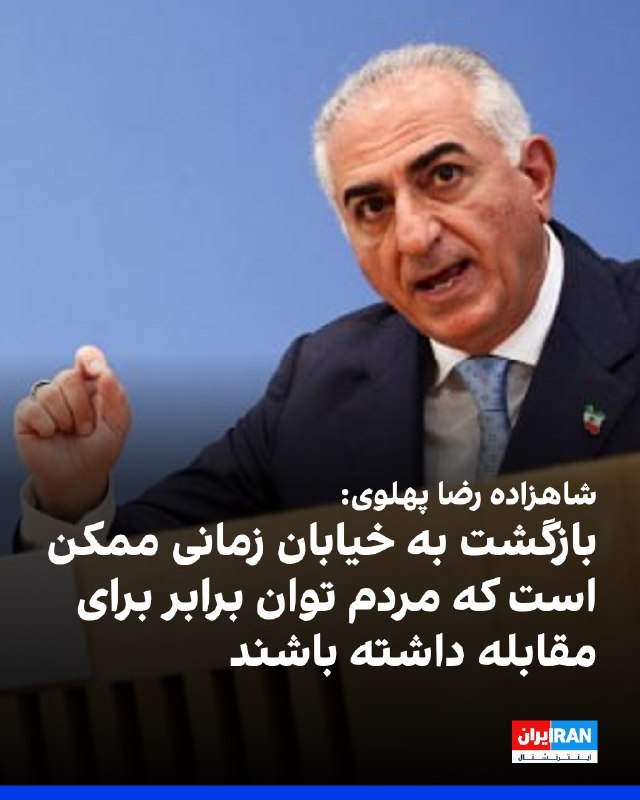

شاهزاده رضا پهلوی در نشست امنیتی سالانه پولیتیکو گفت: «ما فقط زمانی می‌توانیم مردم را به بازگشت به خیابان‌ها فرا بخوانیم که آن‌ها از سطحی از برابری در توان مقابله برخوردار باشند؛ نه زمانی که رژیم بتواند اوباش و نیروهای سرکوبگرش را برای کشتن مردم در خیابان‌ها اعزام کند.»

او ادامه داد: «اما برای رسیدن به آن نقطه، باید پیام روشنی وجود داشته باشد. باید راهبردی شفاف برای پایان دادن به این رژیم وجود داشته باشد؛ فراخوانی روشن برای قیام مردم، و همچنین پیامی برای نیروهای نظامی و امنیتی از حکومت جدا شوند و به مردم بپیوندند. همه این‌ها باید در قالب یک راهبرد منسجم هماهنگ شود.»
‌🏁 🇬🇧 IranintlTV

🤖 @VahidOOnLine

## VahidOOnLine — post 239745

  <a href="telegram/content/VahidOOnLine_239745_1778608437.mp4" target="_blank">🎬 Download video</a>

♦️پیت هگست، وزیر جنگ آمریکا، روز سه‌شنبه ۲۲ اردیبهشت‌ماه در جلسه استماع کنگره آمریکا گفت ایالات متحده در هر شرایطی برای پیروزی می‌جنگد؛ از جمله برای اطمینان از اینکه ایران هرگز به سلاح هسته‌ای دست پیدا نکند.

او این اظهارات را در ادامه مواضع دولت دونالد ترامپ درباره برنامه هسته‌ای جمهوری اسلامی مطرح کرد.
‌🇸🇦 Indypersian

🤖 @VahidOOnLine

## VahidOOnLine — post 239744

  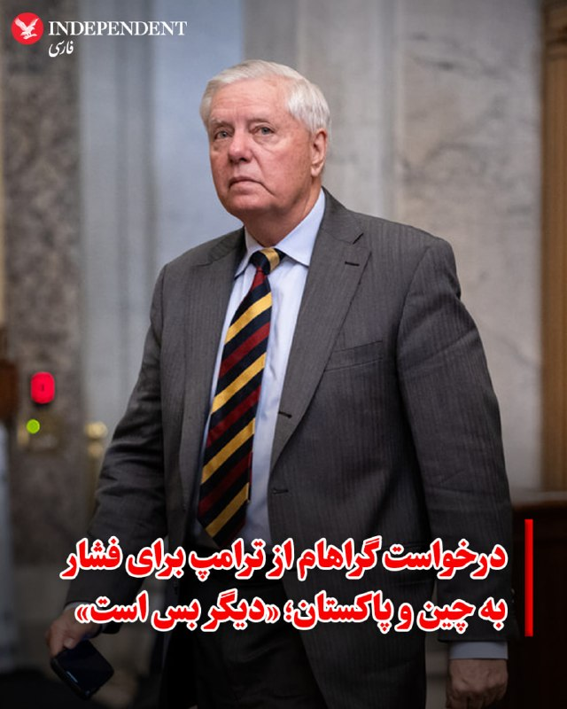

♦️ لیندزی گراهام، سناتور جمهوری‌خواه و از حامیان سرسخت سیاست‌های جنگی دولت ترامپ، روز سه‌شنبه ۲۲ اردیبهشت، از رئیس‌جمهوری آمریکا خواست تا در سفر به چین، موضعی قاطع در برابر پکن اتخاذ کند. گراهام طی یک جلسه استماع در سنا تاکید کرد که شی جین‌پینگ در حال حمایت هم‌زمان از روسیه و جمهوری اسلامی است.

این سناتور کارولینای جنوبی با انتقاد از نقش چین در خرید مقادیر کلان نفت از ایران و روسیه، نسبت به عملکرد پاکستان نیز ابراز نارضایتی کرد. او با استناد به گزارش «سی‌بی‌اس نیوز» یادآوری کرد که اسلام‌آباد به هواپیماهای نظامی ایران اجازه داده است در فرودگاه‌های این کشور مستقر شوند.

وزارت امور خارجه پاکستان با رد قاطعانه این ادعا، اعلام کرد که حضور هواپیماهای ایرانی و آمریکایی در خاک این کشور صرفا جهت تسهیل تردد تیم‌های دیپلماتیک و اداری مربوط به «مذاکرات اسلام‌آباد» پس از برقراری آتش‌بس بوده است. مقامات پاکستانی تاکید کردند که این پروازها هیچ ارتباطی با ترتیبات نظامی یا پشتیبانی جنگی ندارند. با این حال، گراهام هشدار داد که واشنگتن باید فشار بر متحدان و شرکای تجاری جمهوری اسلامی را به شدت افزایش دهد.
‌🇸🇦 Indypersian

🤖 @VahidOOnLine

## VahidOOnLine — post 239743

  <a href="telegram/content/VahidOOnLine_239743_1778608439.mp4" target="_blank">🎬 Download video</a>

مقام‌های آمریکایی اعلام کردند نیروهای این کشور مانع عبور یک نفتکش با پرچم جمهوری مالت از تنگه هرمز شده‌اند.
سخنگوی ستاد فرماندهی مرکزی آمریکا سنتکام؛ به الجزیره گفت نفتکش «آگیوس فانوریوس» به‌دلیل نقض محاصره دریایی، اجازه عبور پیدا نکرده است. به گفته او، این کشتی حامل نفت ایران نبوده است.
مقام‌های آمریکایی همچنین اعلام کردند چند نفتکش دیگر نیز به‌دلیل نقض تحریم‌ها و محاصره اعمال‌شده علیه بنادر ایران، متوقف شده‌اند.
‌🏁 🇬🇧 ManotoTV

🤖 @VahidOOnLine

## VahidOOnLine — post 239742

  <a href="telegram/content/VahidOOnLine_239742_1778608440.mp4" target="_blank">🎬 Download video</a>

«اینترنت را قطع کردند تا صدای مردم خاموش شود.»
‌🏁 🇬🇧 ManotoTV

🤖 @VahidOOnLine

## VahidOOnLine — post 239741

  

شاهزاده رضا پهلوی در نشست امنیتی سالانه پولیتیکو گفت سیاست مماشات با رژیم جمهوری اسلامی که راهبرد بسیاری از دولت‌ها بود، شکست خورده است.
او افزود اکنون که با یک «جانور زخمی» روبه‌رو هستیم، این فرصتی است که نباید از دست برود، بلکه باید کار را یک‌بار برای همیشه تمام کرد؛ موضوعی که نه‌تنها میلیون‌ها ایرانی، بلکه بسیاری از کشورهای منطقه نیز انتظار آن را دارند.

شاهزاده رضا پهلوی درباره جنگ علیه جمهوری اسلامی نیز گفت مردم به‌اندازه کافی هوشمند هستند که تفاوت میان حمله به یک ملت و حمله به یک رژیم را تشخیص دهند و آن کارزار، حمله‌ای علیه ملت ایران نبود، بلکه علیه رژیم بود.
‌🏁 🇬🇧 IranintlTV

🤖 @VahidOOnLine

## VahidOOnLine — post 239740

♦️مایک هاکبی، سفیر آمریکا در اسرائیل، روز سه‌شنبه ۲۲ اردیبهشت در یک کنفرانس در دانشگاه تل‌آویو گفت اسرائیل سامانه گنبد آهنین و نیروهایی برای راه‌اندازی آن به امارات متحده عربی فرستاده است. او افزود این اقدام در چارچوب روابط «فوق‌العاده» میان اسرائیل و امارات متحده عربی و بر پایه توافق‌های ابراهیم انجام شده است.

هاکبی با اشاره به پیامدهای توافق‌های ابراهیم برای امارات گفت: «فقط نگاهی به مزایای آن بیندازید. اسرائیل همین حالا سامانه‌های گنبد آهنین و نیروهایی را برای کمک به بهره‌برداری از آن‌ها برایشان فرستاده است.»

امارات متحده عربی در چارچوب توافق‌های ابراهیم که در سال ۲۰۲۰ با میانجی‌گری آمریکا انجام شد، اسرائیل را به رسمیت شناخت. پیش‌تر فایننشال تایمز گزارش داده بود اسرائیل برای کمک به دفاع از امارات، سامانه شناسایی سبک «اسپکترو» و سامانه پدافند موشکی را همراه با ده‌ها نیروی نظامی به این کشور فرستاده است؛ اقدامی که یکی از نخستین نمونه‌های بزرگ همکاری دفاعی میان دو طرف به‌شمار می‌رود.
‌🇸🇦 Indypersian

🤖 @VahidOOnLine

## VahidOOnLine — post 239739

  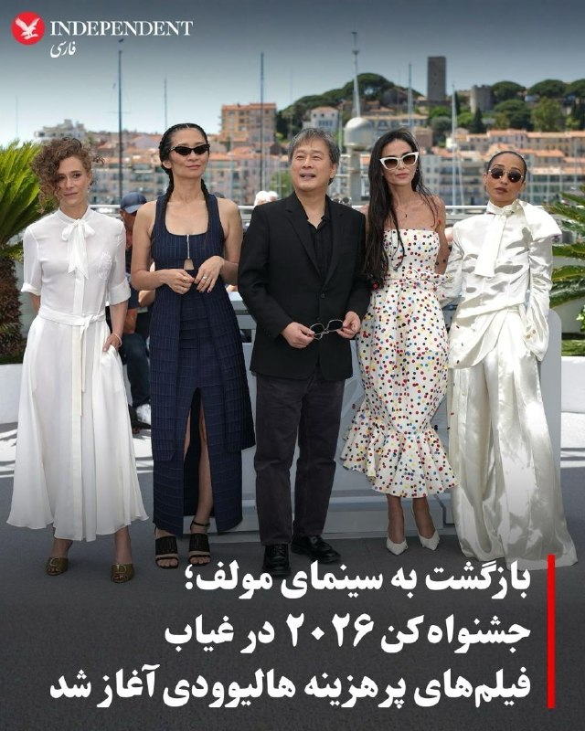

♦️اصغر فرهادی با فیلم تازه‌اش «داستان‌های موازی» امسال به جشنواره فیلم کن ۲۰۲۶ بازمی‌گردد؛ جشنواره‌ای که برخلاف سال‌های گذشته، این بار بیش از آنکه در اختیار ستاره‌ها و فیلم های پرخرج هالیوودی باشد، به سینمای مؤلف و فیلمسازان بین‌المللی تعلق دارد.
کن که از دهه‌ها پیش به‌عنوان مهم‌ترین جشنواره سینمایی جهان و ویترین اروپایی هالیوود شناخته می‌شد، امسال بدون فیلم‌های بزرگ استودیویی آمریکا برگزار می‌شود. در سال‌های اخیر، فیلم‌هایی مانند «تاپ گان: ماوریک»، «ماموریت غیرممکن»، «الویس» و «ایندیانا جونز» در کن رونمایی شده بودند، اما در دوره ۲۰۲۶ هیچ نام بزرگ هالیوودی در بخش مسابقه یا افتتاحیه حضور ندارد.
تنها دو فیلم آمریکایی برای نخل طلا رقابت می‌کنند: «مردی که دوستش دارم» ساخته ایرا ساکس با بازی رامی مالک و ربکا هال و «ببر کاغذی» ساخته جیمز گری با حضور آدام درایور و اسکارلت جوهانسون.
در مقابل، بخش مسابقه امسال مملو از نام‌های مهم سینمای مؤلف جهان است. پدرو آلمودوار با فیلم «کریسمس تلخ» بازگشته، لازلو نمش فیلم «مولن» را ارائه کرده و آندری زویاگینتسف، فیلمساز تبعیدی روس، «مینوتور» را به کن آورده است.
ریاست هیئت داوران دوره هفتادونهم جشنواره بر عهده پارک چان ووک، کارگردان سرشناس کره‌ای، است. اعضای هیئت داوران نیز دمی مور، روث نگا، لورا واندل، کلوئی ژائو، دیگو سسپدس، ایزاک دو بانکوله، پل لاورتی و استلان اسکارشگورد هستند. برندگان نهایی جشنواره و نخل طلای کن در مراسم اختتامیه ۲۳ مه اعلام خواهند شد.
‌🇸🇦 Indypersian

🤖 @VahidOOnLine

## VahidOOnLine — post 239738

  

♦️ اسحاق دار، وزیر امور خارجه پاکستان و وانگ یی، همتای چینی او، روز سه‌شنبه ۲۲ اردیبهشت، در تماسی تلفنی درباره تحولات منطقه و تلاش‌های میانجی‌گرانه اسلام‌آباد برای پایان دادن به درگیری‌های ایران گفتگو کردند.

وزارت امور خارجه پاکستان در بیانیه‌ای اعلام کرد که هر دو طرف بر اهمیت تداوم آتش‌بس پایدار و تضمین تردد عادی از تنگه هرمز تاکید کردند. این گفتگو در آستانه دیدار سرنوشت‌ساز دونالد ترامپ و شی جین‌پینگ، رئیس‌جمهوری چین، انجام شد که قرار است اواخر هفته جاری در پکن برگزار شود. چین و پاکستان در این رایزنی، هماهنگی برای کاهش تنش‌های منطقه‌ای را مورد توجه قرار دادند.
‌🇸🇦 Indypersian

🤖 @VahidOOnLine

## VahidOOnLine — post 239737

  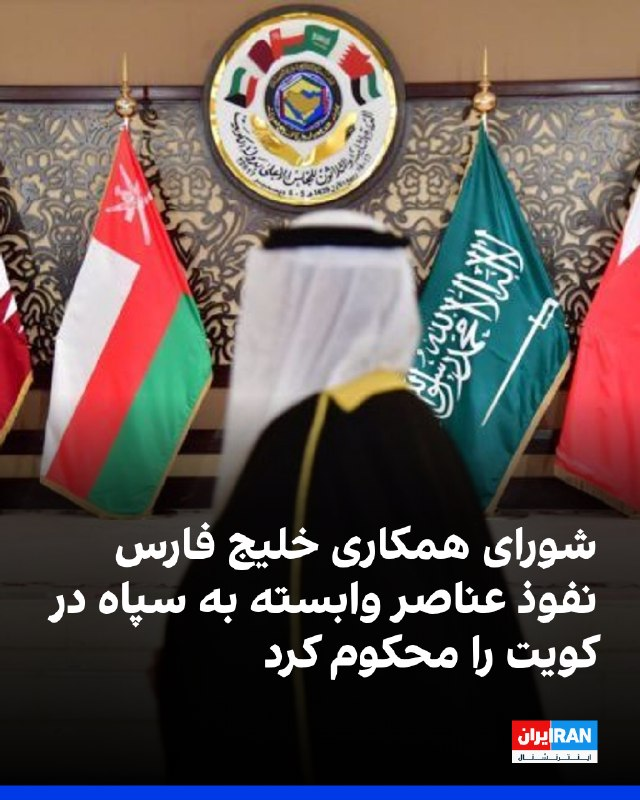

دبیرکل شورای همکاری خلیج فارس اعلام کرد که نفوذ عناصر وابسته به سپاه پاسداران و برنامه‌ریزی آن‌ها برای اقدامات «خصمانه» را به‌شدت محکوم می‌کند.

دبیرکل شورای همکاری خلیج‌ فارس افزود از هر اقدامی که کویت برای حفظ امنیت و ثبات خود اتخاذ کند، حمایت می‌کند.

‌پیش‌تر نیز وزارت خارجه کویت اعلام کرد که سفیر جمهوری اسلامی را در پی نفوذ یک گروه وابسته به سپاه پاسداران به جزیره بوییان احضار کرده است.
‌🏁 🇬🇧 IranintlTV

🤖 @VahidOOnLine

## VahidOOnLine — post 239736

  

شهروندان در پیام‌هایی به ایران اینترنشنال می‌گویند که بدون رضایت و اطلاع و حتی هیچگونه اقدامی از سوی آن‌ها، نهادهای جمهوری اسلامی نام و مشخصات و تلفن همراه آن‌ها را برای ثبت‌نام در کارزار حکومتی «جان‌فدا» استفاده کرده‌اند.

طبق این پیام‌ها، حکومت پیامک‌هایی به شهروندان فرستاده و بدون اینکه بدانند، به آن‌ها گفته شده که در کارزار «جان‌فدا» ثبت‌نام شده‌اند.

طی روزهای گذشته، رسانه‌های حکومتی نوشتند که بیش از ۳۱ میلیون نفر در این کارزار ثبت‌نام کرده‌اند. این عدد و آمار از سوی شهروندان و ناظران با سوال مواجه شد. شهروندان در حالی که همچنان ده‌ها روز است که از دسترسی به اینترنت محروم‌اند، در پیام‌های خود به ایران اینترنشنال نوشته‌اند اگر حکومت ۳۱ میلیون جان‌فدا و حامی دارد، چرا اینترنت و دسترسی به آن را در کشور باز نمی‌کند.
‌🏁 🇬🇧 IranintlTV

🤖 @VahidOOnLine

## VahidOOnLine — post 239735

  <a href="telegram/content/VahidOOnLine_239735_1778608446.mp4" target="_blank">🎬 Download video</a>

شورای همکاری خلیج فارس ورود نیروهایی از سپاه پاسداران به جزیره بوبیان کویت را محکوم کرد.

جاسم البدیوی، دبیرکل شورای همکاری خلیج فارس، گفت: «نفوذ عناصر سپاه پاسداران به جزیره بوبیان کویت و برنامه‌ریزی آن‌ها برای اقدامات خصمانه را محکوم می‌کنیم.»

او همچنین تأکید کرد شورای همکاری خلیج فارس از کویت در همه اقداماتی که برای حفظ امنیت و ثبات خود انجام دهد، حمایت می‌کند.
‌🏁 🇬🇧 ManotoTV

🤖 @VahidOOnLine

## mwarmonitor — post 8988

  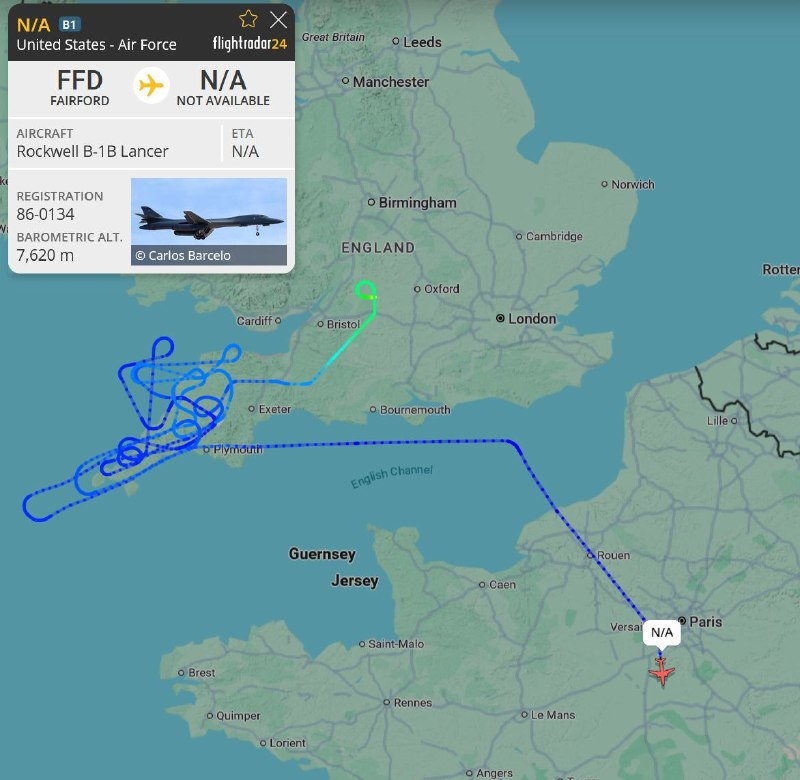

✈️🇺🇸«نیروی هوایی ایالات متحده آمریکا (USAF) ✈️۱ فروند هواپیمای بمب‌افکن استراتژیک Rockwell B-1B Lancer AE6C05 86-0134 - ZENER 01 🔹 بعدازظهر امروز بر فراز جنوب غرب انگلستان از پایگاه RAF Fairford در حال عملیات بوده است. دو هواپیمای سوخت‌رسان KC-135 با شناسه‌های…

## mwarmonitor — post 8987

🇮🇱مقام‌های امنیتی اسرائیل به همتایان آمریکایی خود گفته‌اند که «در آستانه ازسرگیری درگیری‌ها در غزه هستند»، در حالی که تنش‌ها بر سر امتناع حماس از خلع سلاح یا واگذاری کنترل افزایش یافته است — به گزارش کان نیوز.

این گزارش می‌گوید گروه حماس با تهدید مسلحانه پیمانکاران محلی در غزه، آن‌ها را از مشارکت در کارهای ساختمانی یک شهر فلسطینی برنامه‌ریزی‌شده در رفح که با تأمین مالی امارات متحده عربی انجام می‌شود، منع کرده است. این پروژه با هماهنگی اسرائیل و یک ساختار فرماندهی تحت رهبری آمریکا در حال پیگیری بوده است.

@mwarmonitor

## mwarmonitor — post 8986

🇬🇧بریتانیا روز سه‌شنبه متعهد شد در صورت برقراری یک آتش‌بس پایدار در خاورمیانه، برای حفاظت از تنگه هرمز شناورهای خودران در اختیار قرار دهد.

🇬🇧بریتانیا پیشنهاد داده است شناورهای سطحی بدون سرنشین (USV) را به یک مأموریت چندملیتی به رهبری بریتانیا و فرانسه ارائه کند تا در صورت برقراری آتش‌بس پایدار، امنیت کشتیرانی بین‌المللی را تضمین کند.

🇬🇧این پیشنهاد علاوه بر سامانه‌های خودکار مین‌روبی نیروی دریایی سلطنتی بریتانیا و همچنین استقرار پیش‌دستانه ناوشکن پدافند هوایی کلاس Daring یعنی HMS Dragon است.

🇬🇧این مأموریت‌ها با هدف افزایش اطمینان برای کشتیرانی بین‌المللی در منطقه و به‌ویژه در Strait of Hormuz انجام می‌شود.

@mwarmonitor

## mwarmonitor — post 8985

🇮🇷ایران اعلام کرد تا زمانی که این شروط برآورده نشود، با ایالات متحده درباره مسئله هسته‌ای گفت‌وگو نخواهد کرد — الجزیره 📌پایان جنگ در «همه جبهه‌ها» 📌لغو کامل تمامی تحریم‌ها 📌آزادسازی دارایی‌های مسدودشده ایران 📌پرداخت غرامت‌های جنگی 📌به‌رسمیت شناختن حق…

## mwarmonitor — post 8983

🇮🇷ایران اعلام کرد تا زمانی که این شروط برآورده نشود، با ایالات متحده درباره مسئله هسته‌ای گفت‌وگو نخواهد کرد — الجزیره

📌پایان جنگ در «همه جبهه‌ها»

📌لغو کامل تمامی تحریم‌ها

📌آزادسازی دارایی‌های مسدودشده ایران

📌پرداخت غرامت‌های جنگی

📌به‌رسمیت شناختن حق حاکمیت ایران بر تنگه هرمز

@mwarmonitor

## mwarmonitor — post 8982

🇦🇹اتریش امروز دو فروند جنگنده Eurofighter Typhoon را برای شناسایی و رهگیری دو فروند هواپیمای PC-12 نیروی هوایی ایالات متحده که بدون مجوز وارد حریم هوایی این کشور شده بودند، به پرواز درآورد.
✈️گزارش‌ها حاکی است که هواپیماهای United States Air Force پس از رهگیری، تغییر مسیر داده و در مونیخ فرود آمدند.

@mwarmonitor

## mwarmonitor — post 8981

🔴«گروهی از مردان که به اتهام تلاش برای ورود به کشور از طریق دریا بازداشت شده بودند، در جریان بازجویی اعتراف کردند که عضو سپاه پاسداران انقلاب اسلامی ایران هستند، به گفته وزارت کشور کویت.» @mwarmonitor

## mwarmonitor — post 8979

  <a href="telegram/content/mwarmonitor_8979_1778608447.mp4" target="_blank">🎬 Download video</a>

✈️۱۵ فروند هواپیمای کوچک آمریکایی 🇺🇸 (احتمالاً F-16) که دیروز وارد شده‌اند در عربستان سعودی 🇸🇦، در اپرون (محوطه پارکینگ) آمریکایی پایگاه Prince Sultan Air Base (PSAB) در مختصات زیر مشاهده شدند:
24.0637, 47.5684

📌این موضوع تأیید می‌کند که محدودیت‌های عملیاتی عربستان علیه پروژه آمریکایی Project Freedom برداشته شده است.

✈️گفته می‌شود ۵۳ فروند جنگنده F-16 در پایگاه PSAB مستقر هستند.

@mwarmonitor

## mwarmonitor — post 8978

🔸سناتور گراهام: ژنرال کِین، آیا شما از گزارش‌هایی مبنی بر اینکه پاکستان اجازه می‌دهد از پایگاه‌هایش برای استقرار هواپیماهای ایرانی استفاده شود، اطلاعی دارید؟
🔹ژنرال کِین: قربان، من یک گزارش در این باره دیده‌ام.
🔸سناتور گراهام: خب، آیا این گزارش دقیق است؟
🔹ژنرال کِین: قربان، فکر می‌کنم با توجه به مسائل طبقه‌بندی شده مختلفی که دیده‌ام...
🔸سناتور گراهام (میان کلام او): اجازه دهید فقط این را بگویم؛ اگر این گزارش دقیق باشد، با نقش پاکستان به عنوان یک میانجی صلح در تضاد است، قبول دارید؟
🔹ژنرال کِین: قربان، من تمایلی ندارم بر اساس مذاکرات جاری و نقش پاکستان در این زمینه اظهار نظر کنم.
🔸سناتور گراهام: ممنون. آقای وزیر هِگسِت، اگر یک میانجی اجازه دهد هواپیماهای شناسایی ایران در پایگاه‌های هوایی پاکستان مستقر شوند، به نظر شما این با میانجی‌گری منصفانه همخوانی دارد؟
🔹وزیر هِگسِت: مجدداً عرض می‌کنم، من نمی‌خواهم در میانه این مذاکرات وارد شوم. من خواهان حداکثر اثربخشی برای...
🔸سناتور گراهام (با تندی): اما من می‌خواهم! من می‌خواهم وسط این مذاکرات باشم. من به اندازه یک پرتاب دست هم به پاکستان اعتماد ندارم. اگر آن‌ها واقعاً هواپیماهای ایرانی را برای محافظت از دارایی‌های نظامی ایران در پایگاه‌های خود مستقر کرده‌اند، به من می‌گوید که شاید باید به دنبال شخص دیگری برای میانجی‌گری باشیم. تعجبی ندارد که این مذاکرات لعنتی به هیچ‌جا نمی‌رسد.

@mwarmonitor

## mwarmonitor — post 8977

  <a href="telegram/content/mwarmonitor_8977_1778608449.mp4" target="_blank">🎬 Download video</a>

🔴سناتور لیندسی گراهام ؛ اگر این گزارش‌ها درست باشد، مستلزم بازنگری کامل در نقشی است که پاکستان به‌عنوان میانجی میان ایران، ایالات متحده و سایر طرف‌ها ایفا می‌کند. ‼️با توجه به برخی اظهارات پیشین مقام‌های دفاعی پاکستان علیه اسرائیل، اگر این موضوع صحت داشته…

## mwarmonitor — post 8976

  

🔴پنتاگون اعلام کرد یک زیردریایی هسته‌ایِ نیروی دریایی آمریکا در جبل‌الطارق مستقر شده است؛ اقدامی که به‌ندرت درباره محل حضور یکی از محرمانه‌ترین تسلیحات آمریکا به‌صورت علنی اعلام می‌شود. این خبر یک روز پس از آن منتشر شد که رئیس‌جمهور ترامپ به‌طور قاطع آخرین…

## mwarmonitor — post 8975

  

✈️🇺🇸«نیروی هوایی ایالات متحده آمریکا (USAF)

✈️۱ فروند هواپیمای بمب‌افکن استراتژیک Rockwell B-1B Lancer
AE6C05 86-0134 - ZENER 01

🔹 بعدازظهر امروز بر فراز جنوب غرب انگلستان از پایگاه RAF Fairford در حال عملیات بوده است. دو هواپیمای سوخت‌رسان KC-135 با شناسه‌های GOLD 65/66 از پایگاه هوایی رامشتاین بدون سیگنال Mode-S برای دیدار با ZENER 01 پرواز کرده‌اند.

@mwarmonitor

## pm_afshaa — post 90638

🔴سناتور لیندسی گراهام: من به هیچ وجه به پاکستان اعتماد ندارم؛ اونا هیچ صلاحیتی برای میانجیگری ندارن. اونا اصلاً منصف نیستن

💧 Rainbet.com the #1 Non-KYC Crypto Casino & Sportsbook @rainbetcom

😁 @Pm_Afshaa

## pm_afshaa — post 90637

  <a href="telegram/content/pm_afshaa_90637_1778608453.webm" target="_blank">🎬 Download video</a>

🔴کانال 12 اسرائیل:
انتظار میره که ترامپ بعد از بازگشتش از چین در پایان هفته، تصمیمات نهایی و جدیش رو درباره ایران بگیره.

💧 Rainbet.com the #1 Non-KYC Crypto Casino & Sportsbook @rainbetcom

😁 @Pm_Afshaa

## pm_afshaa — post 90636

  <a href="telegram/content/pm_afshaa_90636_1778608453.webm" target="_blank">🎬 Download video</a>

🔴لیست کامل مدیران شرکت‌های بزرگ آمریکایی که ترامپ رو در سفر به چین همراهی خواهند کرد :

💧 Rainbet.com the #1 Non-KYC Crypto Casino & Sportsbook @rainbetcom

😁 @Pm_Afshaa

## pm_afshaa — post 90635

  <a href="telegram/content/pm_afshaa_90635_1778608454.webm" target="_blank">🎬 Download video</a>

🔴تصاویر ماهواره‌ای از حضور بی‌سابقه بیش از 53 جنگنده آمریکایی در پایگاه هوایی سلطان عربستان خبر میده.

💧 Rainbet.com the #1 Non-KYC Crypto Casino & Sportsbook @rainbetcom

😁 @Pm_Afshaa

## pm_afshaa — post 90634

  <a href="telegram/content/pm_afshaa_90634_1778608455.webm" target="_blank">🎬 Download video</a>

🔴تسنیم: به دیوان داوری لاهه علیه آمریکا شکایت کردیم؛ تجاوز نظامی به تاسیسات هسته‌ای، اعمال تحریم‌های اقتصادی و تهدید به توسل به زور از موضوعات این شکایته.

💧 Rainbet.com the #1 Non-KYC Crypto Casino & Sportsbook @rainbetcom

😁 @Pm_Afshaa

## pm_afshaa — post 90633

  <a href="telegram/content/pm_afshaa_90633_1778608455.webm" target="_blank">🎬 Download video</a>

🔴یک مقام ارشد پنتاگون: جنگ ایران تاکنون 29 میلیارد دلار برای آمریکا هزینه داشته.

💧 Rainbet.com the #1 Non-KYC Crypto Casino & Sportsbook @rainbetcom

😁 @Pm_Afshaa

## DEJradio — post 4594

  <a href="telegram/content/DEJradio_4594_1778608456.webm" target="_blank">🎬 Download video</a>

ب
🔺📷 ررسی‌ها نشان می‌دهد نرگس افشردی شاغل در دانشگاه هاروارد، برادرزاده محمد باقری (محمدحسین افشردی)، رئیس پیشین ستاد کل نیروهای مسلح جمهوری اسلامی، است که در خرداد ۱۴۰۴ در پی حمله هوایی اسرائیل کشته شد.

کاربران در شبکه‌های اجتماعی که سوابق نرگس افشردی را بررسی کرده‌اند می‌گویند او در حالی خارج از ایران در رفاه زندگی می‌کند که اگر یکی از بستگان دور یک گروهبان در خارج از کشور مقیم باشد هیچگونه انتصابی به او نمی‌دهند اما بسیاری از اقوام و خویشاوندان درجه یک فرماندهان ارشد نظام و مقامات سیاسی و امنیتی خارج از ایران سکونت دارند.

نرگس افشردی فرزند حسن باقری (غلامحسین افشردی)، از فرماندهان سپاه پاسداران در دوران جنگ ایران و عراق، می‌باشد.
همسر او، محسن گودرزی استاد مطالعات اسلامی در دانشگاه «هاروارد» است و خود نرگس نیز به‌عنوان پژوهشگر حوزه روان‌شناسی در همین دانشگاه فعالیت می‌کند.

این موضوع بار دیگر بحث قدیمی درباره تفاوت سبک زندگی و محل اقامت فرزندان و نزدیکان برخی مسئولان جمهوری اسلامی با شرایط عمومی مردم ایران را در فضای مجازی پررنگ کرده است.

#IRGCterrorists #جمهوری_اسلامی
@DEJradio

## mamlekate — post 103515

  

💥 دعوت به همکاری با خبرگزاری هرانا

خبرگزاری هرانا، با بیش از دو دهه سابقه در حوزه گزارشگری و مستندسازی حقوق بشر، در راستای توسعه فعالیت‌های خود از علاقه‌مندان واجد شرایط برای همکاری دعوت می‌کند.

هرانا در این مرحله بیش از آن‌که به دنبال افراد با سابقه حرفه‌ای باشد، به دنبال افرادی متعهد، دقیق و آموزش‌پذیر است؛ کسانی که دغدغه واقعی حقوق بشر دارند و مایل‌اند در یک چارچوب حرفه‌ای، مهارت‌های خود را توسعه دهند.

زمینه‌های همکاری شامل:
گزارشگری، ویراستاری، ترجمه، مدیریت شبکه‌های اجتماعی و سایر حوزه‌های مرتبط

ویژگی‌های مورد انتظار:

* تسلط کافی به زبان فارسی (خواندن و نوشتن)
* دقت، مسئولیت‌پذیری و توانایی یادگیری مستمر
* علاقه و حساسیت نسبت به موضوعات حقوق بشر
* آمادگی برای فعالیت در چارچوب‌های سازمان‌یافته و حرفه‌ای

❗️ توجه: این فرصت همکاری فقط شامل کسانی است که به زبان فارسی مسلط و ساکن یکی از کشورهای "ترکیه، قبرس شمالی، هندوستان، مصر، قرقیزستان، ازبکستان، کلمبیا، پاراگوئه، قزاقستان، سریلانکا، بلغارستان و رومانی" هستند.

همکاری با هرانا فرصتی است برای کسب تجربه عملی در حوزه مستندسازی و فعالیت‌های حقوق بشری در یک نهاد با سابقه و ساختار حرفه‌ای.

📎 برای ثبت درخواست همکاری، لطفا فرم زیر را تکمیل کنید:
https://hra.news/4cBjHqs

📩 در صورت بروز مشکل در تکمیل فرم، می‌توانید رزومه و اطلاعات تماس خود را به آدرس زیر ارسال نمایید:
info@hra-news.org

↘️
@hranews_bot تماس ✉️ -  @Hranews  کانال هرانا 🆑

## kianmeli1 — post 87370

‏🔴یک مقام ارشد پنتاگون سه‌شنبه اعلام کرد که جنگ آمریکا در ایران تاکنون ۲۹ میلیارد دلار هزینه داشته است؛ رقمی که نسبت به برآورد ارائه‌شده در اواخر ماه گذشته، چهار میلیارد دلار افزایش یافته است
https://t.me/kianmeli1

## kianmeli1 — post 87369

‏🔴وزارت دفاع بریتانیا با انتشار بیانیه‌ای اعلام کرد این کشور تجهیزات خودکار مین‌یابی و سامانه‌های پیشرفته مقابله با پهپادها را به همراه جنگنده‌های تایفون و ناو «اچ‌ام‌اس دراگون» در قالب یک ماموریت دفاعی آینده برای تامین آزادی کشتیرانی در تنگه هرمز مستقر خواهد کرد
https://t.me/kianmeli1

## kianmeli1 — post 87368

‏🔴بلومبرگ گزارش داد امارات متحده عربی از زمان آغاز کارزار آمریکا و اسرائیل علیه تهران در ماه فوریه، بیش از یک‌بار به ایران حمله کرده است. به گفته این رسانه آمریکایی و به نقل از «افراد مطلع»، امارات متحده عربی این حملات را هم پیش از آتش‌بس و هم پس از آن انجام داده است
https://t.me/kianmeli1

## kianmeli1 — post 87367

  <a href="telegram/content/kianmeli1_87367_1778608457.mp4" target="_blank">🎬 Download video</a>

🔴زلنسکی: به تأسیسات گازی روسیه در فاصله ۱۵۰۰ کیلومتری حمله کردیم

ولودیمیر زلنسکی، رئیس‌جمهور اوکراین، حمله به یک تأسیسات صنعت گاز در منطقه اورنبورگ روسیه را تأیید کرد.

این هدف در فاصله بیش از ۱۵۰۰ کیلومتری مرز اوکراین قرار دارد.

به گفته زلنسکی، این عملیات پاسخی به حملات اخیر روسیه با پهپادهای شاهد و بمب‌های سرشی بوده است.

او تأکید کرد که کی‌اف به فشار بر روسیه ادامه می‌دهد تا آن را «به سمت دیپلماسی و صلح» سوق دهد. برخی رسانه‌ها از این اقدام با عنوان «تحریم‌های دوربرد» یاد کرده‌اند.
https://t.me/kianmeli1

## kianmeli1 — post 87366

  <a href="telegram/content/kianmeli1_87366_1778608460.mp4" target="_blank">🎬 Download video</a>

🔴سربازان روسی در حال استفاده از پهپاد رهگیر «یولکا» (Yolka) علیه پهپادهای اوکراینی هستند که براحتی با لانچر بسیار کوچک دستی به سرعت پرتاب میشود
https://t.me/kianmeli1

## kianmeli1 — post 87365

  

🔴ایران قبل از برآورده شدن این شرایط، در مورد مسئله هسته‌ای با آمریکا مذاکره نخواهد کرد.

• پایان جنگ در همه جبهه‌ها
• لغو همه تحریم‌ها
• آزادسازی دارایی‌های مسدود شده ایران
• پرداخت غرامت جنگ
• به رسمیت شناختن حق حاکمیت ایران بر تنگه هرمز
https://t.me/kianmeli1

## kianmeli1 — post 87364

  <a href="telegram/content/kianmeli1_87364_1778608462.mp4" target="_blank">🎬 Download video</a>

‏🔴سپاه پاسداران رزمایشی برای ورود قریب‌الوقوع به جنگ زمینی برگزار کرد
https://t.me/kianmeli1

## kianmeli1 — post 87363

  <a href="telegram/content/kianmeli1_87363_1778608465.mp4" target="_blank">🎬 Download video</a>

🔴تصاویر ماهواره‌ای جدید منتشر شده از پایگاه هوایی پرنس سلطان در عربستان سعودی نشان می‌دهد که تعداد زیادی هواپیما (به احتمال زیاد از نوع F-16) در این پایگاه مستقر شده‌اند. به نظر می‌رسد عربستان سعودی محدودیت‌های خود را علیه «پروژه آزادی» مرتبط با دونالد ترامپ برداشته است و حداقل ۵۳ فروند جنگنده F-16 در این پایگاه حضور دارند.
https://t.me/kianmeli1

## IranIntlTV — post 336858

  

🔻تیم ملی فوتبال در پی انزوای جمهوری اسلامی و انصراف همه حریفان تدارکاتی، برای سومین بار با خودش بازی کرد؛ دیداری که به طور مستقیم از صدا و سیمای جمهوری اسلامی پخش شد، وی‌ای‌آر داشت و البته بدون حضور تماشاگران عادی در ورزشگاه پاس قوامین، وابسته به نیروی انتظامی، برگزار شد.

🔹این بازی که در جریان اردوی بازیکنان شاغل در لیگ برتر برگزار شد، با حضور دو تیم قرمز و سفید انجام گرفت و تیم سفید با نتیجه ۴ بر یک تیم قرمز را شکست داد.

علی علیپور، دانیال ایری (دو بار) و آریا یوسفی برای تیم سفید و امیرحسین حسین‌زاده برای تیم قرمز گل زدند.

🔹تیم ملی قرار بود پیش از جام جهانی با تیم‌های ملی پرتغال،‌ اسپانیا،‌ مقدونیه و آنگولا بازی‌های تدارکاتی داشته باشد که همگی از دیدار با ایران منصرف شدند.

🔹امیر قلعه‌نویی، سرمربی تیم ملی، پیش‌تردرباره لغو بازی‌های تدارکاتی گفت: «بازی‌های تدارکاتی هماهنگ شده بود و قرارداد بستند؛ ولی در دقیقه ۹۰ کنسل شد.»

🔹تیم ملی قرار است به زودی در ترکیه اردوی آماده‌سازی خود را برپا کند. فدراسیون فوتبال گفته در جریان این اردو با تیم ملی گامبیا بازی خواهد کرد.

@iranintltvsport

## IranIntlTV — post 336857

  

بلومبرگ گزارش داد امارات متحده عربی از زمان آغاز کارزار آمریکا و اسرائیل علیه جمهوری اسلامی در اسفند ماه، بیش از یک‌بار ایران را هدف حمله قرار داده است.
بلومبرگ به نقل از «افراد مطلع» نوشت این حملات هم پیش از برقراری آتش‌بس و هم پس از آن انجام شده است.

براساس این گزارش، در طول جنگ، همکاری میان امارات متحده عربی و اسرائیل شامل تبادل اطلاعات، شناسایی و رهگیری موشک‌ها و پهپادهای ایرانی و همچنین انتخاب اهداف در ایران بوده است.
https://iranintl.com/202605123603

## IranIntlTV — post 336856

  <a href="telegram/content/IranIntlTV_336856_1778608467.mp4" target="_blank">🎬 Download video</a>

وال‌استریت ژورنال گزارش داد ابوظبی به اهدافی داخل ایران حمله کرده است و واشینگتن به‌طور غیرعلنی از مشارکت امارات و هر کشور حاشیه خلیح فارس که مایل به ورود به درگیری باشد، استقبال کرده است.

ارزیابی فرزین ندیمی، پژوهشگر ارشد امور دفاعی و امنیتی در موسسه واشینگتن
@iranintltv

## IranIntlTV — post 336855

  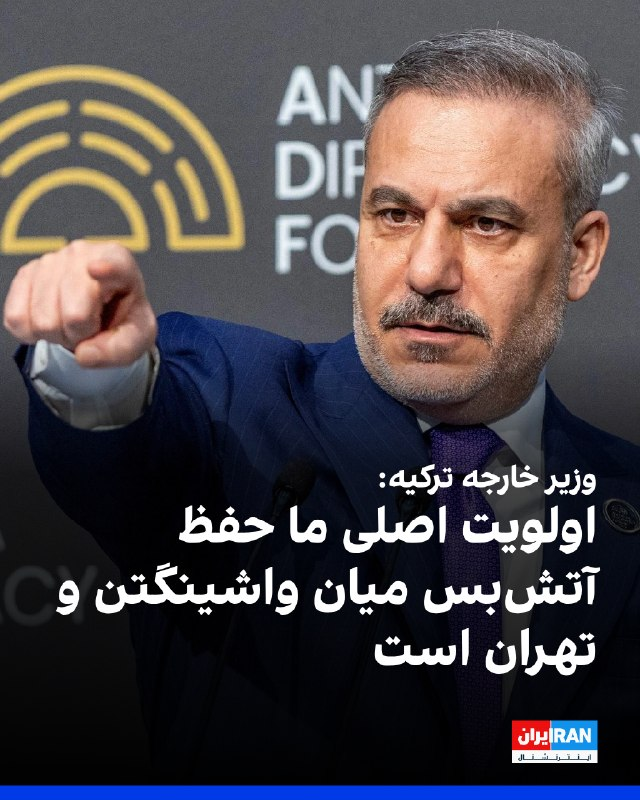

هاکان فیدان، وزیر خارجه ترکیه، در گفت‌وگو با الجزیره گفت اولویت اصلی آنکارا حفظ آتش‌بس میان واشینگتن و تهران است و تاکید کرد فوری‌ترین نگرانی ترکیه تداوم این آتش‌بس است، زیرا در حال حاضر این موضوع بیشترین اهمیت را دارد.

وزیر خارجه ترکیه افزود هیچ‌کس خواهان بازگشت به جنگ نیست، چرا که اقتصاد جهانی و امنیت انرژی جهان همین حالا نیز به اندازه کافی آسیب دیده است.

هاکان فیدان همچنین گفت ترکیه و دیگر کشورهای منطقه از جمله قطر برای حمایت از پاکستان به‌عنوان میانجی اصلی همکاری می‌کنند و در روند میانجی‌گری، زمانی که کار به بن‌بست می‌رسد، دشوارترین بخش یافتن ایده‌های خلاقانه است؛ گاهی طرفین و حتی خود میانجی نیز قادر به ارائه چنین ایده‌هایی نیستند.
https://iranintl.com/202605122251

## IranIntlTV — post 336854

  

هزینه‌ای که جمهوری اسلامی به مردم ایران تحمیل کرده، فقط در اقتصاد خلاصه نمی‌شود؛ از سفره‌های کوچک‌تر تا اینترنت طبقاتی، از اعدام و زندان تا ترس، ناامیدی و خشم فروخورده‌ای که هر روز بزرگ‌تر می‌شود.
مردم تا کی تاب می‌آورند؟
آیا ایران به نقطهٔ انفجار رسیده است؟
خشم انباشتهٔ مردم چه زمانی فوران خواهد کرد؟

امشب در «برنامه با کامبیز حسینی» دربارهٔ هزینه‌های ۴۷ سال حاکمیت جمهوری اسلامی و آیندهٔ ایران حرف می‌زنیم.

«برنامه» صدای شماست.

اگر در ایران به اینترنت دسترسی دارید، بیایید و مشاهدات خود را از جنگ بگویید. ما شما را، بدون نوبت، مستقیم از ایران روی خط می‌آوریم.
بیایید و روایت خود را برای همیشه ثبت کنید.
تاریخ با صدای شما نوشته می‌شود.

برای شرکت در برنامه، همین حالا در واتس‌اپ پیام بدهید:
۰۰۴۴۷۵۲۲۱۱۰۱۱۰
۰۰۴۴۷۵۴۴۱۱۰۱۱۰
۰۰۴۴۷۵۱۱۱۰۲۵۵۳

«برنامه با کامبیز حسینی»
«یک ایران صدای شما را می‌شنود»

@iranintltv

## IranIntlTV — post 336853

  <a href="telegram/content/IranIntlTV_336853_1778608471.mp4" target="_blank">🎬 Download video</a>

در حالی‌ که گزارش‌ها از جدی‌تر شدن بررسی گزینه‌های نظامی جدید آمریکا علیه جمهوری اسلامی خبر می‌دهند، دونالد ترامپ گفت منتظر فروپاشی اقتصادی ایران در اثر محاصره دریایی است.

گفت‌وگو با فرشته پزشک، کارشناس روابط بین‌الملل
@iranintltv

## IranIntlTV — post 336852

  

دادگاه کیفری عالی بحرین سه نفر از جمله یک زن را به اتهام «همکاری» با جمهوری اسلامی به حبس ابد محکوم کرد.
دادستان‌ها اعلام کردند این زن در «ارتباط» با سپاه پاسداران بوده و قصد داشته «اقدامات تروریستی خصمانه» در بحرین انجام دهد.
در پرونده‌های جداگانه، ۱۰ نفر دیگر به اتهام «حمایت و تایید حملات تروریستی جمهوری اسلامی علیه بحرین»، انتشار اطلاعات ممنوع و عکسبرداری از اماکن ممنوعه، به احکام حبس تا ۱۰ سال محکوم شدند.

پیش‌تر نیز وزارت کشور بحرین اعلام کرد دستگاه‌های امنیتی این کشور یک تشکیلات مرتبط با سپاه پاسداران و تفکر «ولایت فقیه» را شناسایی کرده‌اند و ۴۱ نفر از اعضای آن را بازداشت کرده‌اند.
https://iranintl.com/202605122799

## IranIntlTV — post 336849

  

شاهزاده رضا پهلوی در نشست امنیتی سالانه پولیتیکو گفت: «ما فقط زمانی می‌توانیم مردم را به بازگشت به خیابان‌ها فرا بخوانیم که آن‌ها از سطحی از برابری در توان مقابله برخوردار باشند؛ نه زمانی که رژیم بتواند اوباش و نیروهای سرکوبگرش را برای کشتن مردم در خیابان‌ها اعزام کند.»

او ادامه داد: «اما برای رسیدن به آن نقطه، باید پیام روشنی وجود داشته باشد. باید راهبردی شفاف برای پایان دادن به این رژیم وجود داشته باشد؛ فراخوانی روشن برای قیام مردم، و همچنین پیامی برای نیروهای نظامی و امنیتی از حکومت جدا شوند و به مردم بپیوندند. همه این‌ها باید در قالب یک راهبرد منسجم هماهنگ شود.»
https://iranintl.com/202605123516

## IranIntlTV — post 336848

  <a href="https://t.me/IranintlTV/336848" target="_blank">📎 Download file</a>

🎧نسخه صوتی اخبار شبانگاهی | سه‌شنبه ۲۲ اردیبهشت
@iranintlTV

## IranIntlTV — post 336847

  <a href="telegram/content/IranIntlTV_336847_1778608475.mp4" target="_blank">🎬 Download video</a>

تیتراول با نیوشا صارمی، سه‌شنبه ۲۲ اردیبهشت
@iranintltv

## IranIntlTV — post 336846

  <a href="telegram/content/IranIntlTV_336846_1778608477.mp4" target="_blank">🎬 Download video</a>

تیتراول با نیوشا صارمی، سه‌شنبه ۲۲ اردیبهشت
@iranintltv

## IranIntlTV — post 336845

  

شاهزاده رضا پهلوی در نشست امنیتی سالانه پولیتیکو گفت سیاست مماشات با رژیم جمهوری اسلامی که راهبرد بسیاری از دولت‌ها بود، شکست خورده است.
او افزود اکنون که با یک «جانور زخمی» روبه‌رو هستیم، این فرصتی است که نباید از دست برود، بلکه باید کار را یک‌بار برای همیشه تمام کرد؛ موضوعی که نه‌تنها میلیون‌ها ایرانی، بلکه بسیاری از کشورهای منطقه نیز انتظار آن را دارند.

شاهزاده رضا پهلوی درباره جنگ علیه جمهوری اسلامی نیز گفت مردم به‌اندازه کافی هوشمند هستند که تفاوت میان حمله به یک ملت و حمله به یک رژیم را تشخیص دهند و آن کارزار، حمله‌ای علیه ملت ایران نبود، بلکه علیه رژیم بود.
https://iranintl.com/202605128673

## IranIntlTV — post 336844

  

دبیرکل شورای همکاری خلیج فارس اعلام کرد که نفوذ عناصر وابسته به سپاه پاسداران و برنامه‌ریزی آن‌ها برای اقدامات «خصمانه» را به‌شدت محکوم می‌کند.

دبیرکل شورای همکاری خلیج‌ فارس افزود از هر اقدامی که کویت برای حفظ امنیت و ثبات خود اتخاذ کند، حمایت می‌کند.

‌پیش‌تر نیز وزارت خارجه کویت اعلام کرد که سفیر جمهوری اسلامی را در پی نفوذ یک گروه وابسته به سپاه پاسداران به جزیره بوییان احضار کرده است.
https://iranintl.com/202605128445

## IranIntlTV — post 336843

  <a href="telegram/content/IranIntlTV_336843_1778608480.mp4" target="_blank">🎬 Download video</a>

با ادامه نارضایتی ترامپ از پاسخ تهران، ارم‌نیوز به نقل از منابع آمریکایی خبر داد واشینگتن به دنبال حمله به باقیمانده مراکز هسته‌ای ایران است تا قواعد جدیدی را به تهران تحمیل کند. سی‌ان‌ان هم خبر داد ترامپ در حال بررسی حمله به ایران پس از سفر به چین است.

گزارشی از مجتبا پورمحسن
@iranintltv

## IranIntlTV — post 336842

  

شهروندان در پیام‌هایی به ایران اینترنشنال می‌گویند که بدون رضایت و اطلاع و حتی هیچگونه اقدامی از سوی آن‌ها، نهادهای جمهوری اسلامی نام و مشخصات و تلفن همراه آن‌ها را برای ثبت‌نام در کارزار حکومتی «جان‌فدا» استفاده کرده‌اند.

طبق این پیام‌ها، حکومت پیامک‌هایی به شهروندان فرستاده و بدون اینکه بدانند، به آن‌ها گفته شده که در کارزار «جان‌فدا» ثبت‌نام شده‌اند.

طی روزهای گذشته، رسانه‌های حکومتی نوشتند که بیش از ۳۱ میلیون نفر در این کارزار ثبت‌نام کرده‌اند. این عدد و آمار از سوی شهروندان و ناظران با سوال مواجه شد. شهروندان در حالی که همچنان ده‌ها روز است که از دسترسی به اینترنت محروم‌اند، در پیام‌های خود به ایران اینترنشنال نوشته‌اند اگر حکومت ۳۱ میلیون جان‌فدا و حامی دارد، چرا اینترنت و دسترسی به آن را در کشور باز نمی‌کند.
https://iranintl.com/202605129601

## IranIntlTV — post 336841

  <a href="telegram/content/IranIntlTV_336841_1778608483.mp4" target="_blank">🎬 Download video</a>

ستاد فرماندهی مرکزی آمریکا، سنتکام، اعلام کرد ناو هواپیمابر آبراهام لینکلن به عملیات خود در دریای عرب، از جمله اجرای محاصره دریایی علیه جمهوری اسلامی، ادامه می‌دهد و تاکنون یک کشتی تجاری را وادار به تغییر مسیر کرده است.
جزییات بیشتر با مرضیه حسینی، خبرنگار ایران‌اینترنشنال
@iranintltv

## IranIntlTV — post 336840

  <a href="telegram/content/IranIntlTV_336840_1778608485.mp4" target="_blank">🎬 Download video</a>

روزنامه وال‌استریت ژورنال گزارش داد جمهوری اسلامی در آستانه سفر دونالد ترامپ به چین، از طریق سفیر خود در پکن در تلاش است پیامی را به واشینگتن منتقل کند.
سمیرا قرایی، خبرنگار ایران‌اینترنشنال، گزارش می‌دهد
@iranintltv

## Shin_Persian — post 5970

  

Shin ✓ @hey_itsmyturn
Tue, 12 May 2026 17:49:19 UTC

𝕏 · @shin_persian

## Shin_Persian — post 5969

Shin ✓ @hey_itsmyturn
Tue, 12 May 2026 17:45:43 UTC

Lancer on the move

فارسی

لنسر در حال حرکت

𝕏 · @shin_persian

## ManotoTV — post 105363

  <a href="telegram/content/ManotoTV_105363_1778608488.mp4" target="_blank">🎬 Download video</a>

جان هیلی، وزیر دفاع بریتانیا، اعلام کرد لندن جنگنده، پهپاد و یک ناو جنگی را به مأموریت چندملیتی حفاظت از تردد کشتی‌ها در تنگه هرمز اعزام خواهد کرد.

هیلی این خبر را پس از نشست مشترک با وزرای دفاع ۴۰ کشور اعلام کرد؛ نشستی که با هدف جلب حمایت برای مأموریت تحت رهبری بریتانیا جهت تأمین امنیت کشتیرانی در تنگه هرمز برگزار شد.

بریتانیا می‌گوید این مأموریت در واکنش به محاصره تنگه هرمز از سوی جمهوری اسلامی انجام می‌شود.

## ManotoTV — post 105362

  <a href="telegram/content/ManotoTV_105362_1778608489.mp4" target="_blank">🎬 Download video</a>

سازمان جهانی بهداشت هشدار داد شمار موارد ابتلا به هانتاویروس، پس از شیوع این ویروس در یک کشتی گردشگری در اقیانوس اطلس، احتمالاً افزایش پیدا خواهد کرد.
تدروس آدهانوم، مدیرکل سازمان جهانی بهداشت، اعلام کرد تاکنون ۹ مورد ابتلای قطعی و دو مورد مشکوک ثبت شده و انتظار می‌رود افراد بیشتری نیز به ویروس مبتلا شده باشند. با این حال او تأکید کرد خطر شیوع گسترده جهانی همچنان «پایین» ارزیابی می‌شود.
شیوع بیماری در کشتی «ام‌وی هوندیوس» آغاز شد؛ جایی که سه مسافر، شامل یک زوج هلندی و یک زن آلمانی، جان خود را از دست دادند. این کشتی در حال سفر ۳۵ روزه در اقیانوس اطلس بود.
هانتاویروس معمولاً از طریق ادرار، بزاق یا فضولات جوندگان منتقل می‌شود. گونه «آندِس» تنها نوع شناخته‌شده‌ای است که می‌تواند از انسان به انسان منتقل شود.
در پی این بحران، صدها مسافر و خدمه در کشورهای مختلف تحت قرنطینه یا مراقبت پزشکی قرار گرفته‌اند. مقام‌های بهداشتی در اروپا و آمریکا نیز در حال ردیابی تماس‌های مرتبط با مبتلایان هستند.

## ManotoTV — post 105361

  <a href="telegram/content/ManotoTV_105361_1778608490.mp4" target="_blank">🎬 Download video</a>

مقام‌های آمریکایی اعلام کردند نیروهای این کشور مانع عبور یک نفتکش با پرچم جمهوری مالت از تنگه هرمز شده‌اند.
سخنگوی ستاد فرماندهی مرکزی آمریکا سنتکام؛ به الجزیره گفت نفتکش «آگیوس فانوریوس» به‌دلیل نقض محاصره دریایی، اجازه عبور پیدا نکرده است. به گفته او، این کشتی حامل نفت ایران نبوده است.
مقام‌های آمریکایی همچنین اعلام کردند چند نفتکش دیگر نیز به‌دلیل نقض تحریم‌ها و محاصره اعمال‌شده علیه بنادر ایران، متوقف شده‌اند.

## ManotoTV — post 105360

  <a href="telegram/content/ManotoTV_105360_1778608490.mp4" target="_blank">🎬 Download video</a>

«اینترنت را قطع کردند تا صدای مردم خاموش شود.»

## ManotoTV — post 105359

  <a href="telegram/content/ManotoTV_105359_1778608492.mp4" target="_blank">🎬 Download video</a>

شورای همکاری خلیج فارس ورود نیروهایی از سپاه پاسداران به جزیره بوبیان کویت را محکوم کرد.

جاسم البدیوی، دبیرکل شورای همکاری خلیج فارس، گفت: «نفوذ عناصر سپاه پاسداران به جزیره بوبیان کویت و برنامه‌ریزی آن‌ها برای اقدامات خصمانه را محکوم می‌کنیم.»

او همچنین تأکید کرد شورای همکاری خلیج فارس از کویت در همه اقداماتی که برای حفظ امنیت و ثبات خود انجام دهد، حمایت می‌کند.

## ManotoTV — post 105358

  <a href="telegram/content/ManotoTV_105358_1778608493.mp4" target="_blank">🎬 Download video</a>

وزارت خارجه کویت اعلام کرد در پی آنچه «نفوذ» اعضای مسلح وابسته به سپاه پاسداران خوانده شده، سفیر جمهوری‌اسلامی در این کشور را احضار و یادداشت اعتراضی رسمی به او تحویل داده است.
به گفته مقام‌های کویتی، چهار عضو منتسب به سپاه قصد داشتند از راه دریا وارد کویت شوند و «اقدامات خصمانه» انجام دهند. وزارت کشور کویت اعلام کرد در درگیری با نیروهای امنیتی، یک نیروی کویتی زخمی شده و دو نفر از متهمان نیز فرار کرده‌اند.
معاون وزیر خارجه کویت این اقدام را «نقض آشکار حاکمیت کویت» و مغایر با قوانین بین‌المللی و منشور سازمان ملل توصیف کرد و از تهران خواست فوراً چنین اقداماتی را متوقف کند.

## ManotoTV — post 105357

  <a href="telegram/content/ManotoTV_105357_1778608494.mp4" target="_blank">🎬 Download video</a>

تورم در آمریکا افزایش یافته و طبق آمار رسمی اداره آمار کار آمریکا، این افزایش عمدتا به عوامل مرتبط با جنگ ایران مربوط می‌شود.
شاخص قیمت مصرف‌کننده در ماه آوریل به ۳.۸ درصد رسید؛ در حالی‌ که این رقم در ماه مارس ۳.۳ درصد بود. افزایش قیمت بنزین از مهم‌ترین دلایل این رشد اعلام شده است.
این آمار نشان می‌دهد بالا رفتن قیمت نفت، که ناشی از اختلال مؤثر در تردد از تنگه هرمز بوده، باعث افزایش بیشتر قیمت‌ها شده است.
بر اساس این گزارش، افزایش هزینه انرژی و سوخت اصلی‌ترین عامل رشد ۰.۵ واحد درصدی تورم بوده است.
تحلیلگران می‌گویند این وضعیت علاوه بر فشار بر مصرف‌کنندگان آمریکایی و اقتصاد آمریکا، ممکن است یک پیامد سیاسی هم داشته باشد؛ چرا که فشار اقتصادی بر رأی‌دهندگان می‌تواند دونالد ترامپ را به بازگشت به میز مذاکره سوق دهد.

## FarsiVOA — post 217554

پیت هگست، وزیر جنگ آمریکا، و ژنرال دن کین، رئیس ستاد مشترک نیروهای مسلح آمریکا، روز سه‌شنبه ۲۲ اردیبهشت با حضور در جلسه کمیته فرعی تخصیص بودجه مجلس نمایندگان از عملکرد دولت ترامپ در عملیات نظامی علیه رژیم ایران دفاع کردند. بخش‌هایی از این نشست با ترجمه همزمان پژواک کیومرثی از صدای آمریکا پخش شد.

## FarsiVOA — post 217553

پیت هگست، وزیر جنگ آمریکا، و ژنرال دن کین، رئیس ستاد مشترک نیروهای مسلح آمریکا، روز سه‌شنبه ۲۲ اردیبهشت با حضور در جلسه کمیته فرعی تخصیص بودجه مجلس نمایندگان از عملکرد دولت ترامپ در عملیات نظامی علیه رژیم ایران دفاع کردند. بخش‌هایی از این نشست با ترجمه همزمان پژواک کیومرثی از صدای آمریکا پخش شد.

## FarsiVOA — post 217552

پیت هگست، وزیر جنگ آمریکا، و ژنرال دن کین، رئیس ستاد مشترک نیروهای مسلح آمریکا، روز سه‌شنبه ۲۲ اردیبهشت با حضور در جلسه کمیته فرعی تخصیص بودجه مجلس نمایندگان از عملکرد دولت ترامپ در عملیات نظامی علیه رژیم ایران دفاع کردند. بخش‌هایی از این نشست با ترجمه همزمان پژواک کیومرثی از صدای آمریکا پخش شد.

## FarsiVOA — post 217551

پیت هگست، وزیر جنگ آمریکا، و ژنرال دن کین، رئیس ستاد مشترک نیروهای مسلح ایالات متحده، روز سه‌شنبه ۲۲ اردیبهشت با حضور در جلسه کمیته فرعی تخصیص بودجه مجلس نمایندگان آمریکا از عملکرد دولت ترامپ در عملیات نظامی علیه رژیم ایران دفاع کردند.

## FarsiVOA — post 217550

🔺تعیین پاداش ۱۵ میلیون دلاری برای اطلاعات منجر به مختل شدن سازوکارهای مالی سپاه

▪️آمریکا با انتشار بیانیه‌ای از تعیین جایزه‌ای ۱۵ میلیون دلاری برای مقابله با فعالیت‌های مخرب سپاه خبر داد.

⬇️ بیشتر بخوانید:

https://ir.voanews.com/a/irgc-information-15-million-bonus/8149215.html/?nocach=1

## FarsiVOA — post 217549

پیت هگست: برای همه سناریوهای تداوم مقابله با جمهوری اسلامی آمادگی داریم

## FarsiVOA — post 217548

گفتگو با جمشید اسدی، اقتصاددان و کارشناس اقتصاد دیجیتالی، درباره چشم‌انداز بازار ارز در ایران و تداوم روند فزاینده قیمت دلار

## FarsiVOA — post 217547

گفت‌و‌گو با یاسین اهوازی، کارشناس مسائل خاورمیانه، درباره چرایی و عواقب انتقال هواپیماهای نظامی جمهوری اسلامی به فرودگاه‌های پاکستان

## FarsiVOA — post 217546

  <a href="telegram/content/FarsiVOA_217546_1778608495.mp4" target="_blank">🎬 Download video</a>

فرماندهی مرکزی ایالات متحده، سنتکام، اعلام کرد هزاران نیروی نظامی آمریکا مستقر در خاورمیانه در سال ۲۰۲۶ به دلیل عملکرد برجسته خود مورد تقدیر قرار گرفته‌اند.

به گفته سنتکام، این تقدیرها شامل اعطای مدال، ارتقای درجه، و واگذاری مسئولیت‌های جدید فرماندهی بوده است.

سنتکام تاکید کرد موفقیت عملیات این فرماندهی به تلاش سربازان، ملوانان، تفنگداران دریایی، نیروهای هوایی، گارد ملی و گارد ساحلی آمریکا وابسته است.

@FarsiVOA

## FarsiVOA — post 217545

فشارها برای کنار رفتن کی‌یر استارمر هر ساعت بیشتر می‌شود؛ ۸۴ نماینده حزب کارگر خواهان استعفا یا اعلام زمان خروج او شده‌اند، اما هنوز روند رسمی رقابت رهبری آغاز نشده است.

## FarsiVOA — post 217544

🔺وزیر جنگ: ما در حال پیروزی در جنگ با رژیم ایران هستیم؛ آنها در استفاده از استراتژی کره‌شمالی شکست خوردند

▪️پیت هگست، وزیر جنگ آمریکا، و ژنرال دن کین، رئیس ستاد مشترک نیروهای مسلح ایالات متحده، روز سه‌شنبه ۲۲ اردیبهشت با حضور در جلسه کمیته فرعی تخصیص بودجه مجلس نمایندگان آمریکا از عملکرد دولت ترامپ در عملیات نظامی علیه رژیم ایران دفاع کردند.

⬇️ بیشتر بخوانید:

https://ir.voanews.com/a/iran-us-war-hegseth-caine-testimony-pete-epic-fury/8149212.html/?nocach=1

## FarsiVOA — post 217543

سفرهای محرمانه قاآنی و هشدار آمریکا؛ عراق وارد مرحله‌ای سرنوشت‌ساز شد

## DW_Farsi — post 124624

🔶 بیش از ۱۱۰ برنده جایزه نوبل خواستار آزادی نرگس محمدی شدند

بیش از ۱۱۰ برنده جایزه نوبل خواستار آزادی فوری و بی قید و شرط نرگس محمدی، فعال زندانی حقوق بشر و برنده جایزه نوبل صلح، و رفع اتهام از او شدند.

این درخواست در پی افزایش نگرانی از وخامت سریع وضعیت جسمانی نرگس محمدی و انتقال او از زندان زنجان به بیمارستانی در تهران مطرح شده است.

در بیانیه‌ای که امروز سه‌شنبه ۱۲ مه (۲۲ اردیبهشت) منتشر شد، ۱۱۲ برنده جایزه نوبل از مقام‌های جمهوری اسلامی و جامعه جهانی خواستند تا "بی‌درنگ" برای آزادی نرگس محمدی و تضمین دسترسی مداوم او به درمان پزشکی اقدام کنند.

نرگس محمدی که در سال ۲۰۲۳ به دلیل دهه‌ها فعالیت در دفاع از حقوق زنان در ایران برنده جایزه نوبل صلح شده بود، یکشنبه گذشته ۲۰ اردیبهشت، به دلیل وضعیت بحرانی جسمانی‌اش جهت درمان تخصصی با آمبولانس به بیمارستان پارس تهران منتقل شد.

@dw_farsi

## DW_Farsi — post 124623

  

🔶 معاون نیروی دریایی سپاه: محدوده تنگه هرمز برای ما بزرگ‌تر شده است

محمد اکبرزاده، معاون سیاسی نیروی دریایی سپاه پاسداران انقلاب اسلامی، در گفت‌وگویی در تلویزیون جمهوری اسلامی مدعی شد که در جریان تحولات جنگ و محاصره دریایی، تنگه هرمز برای حکومت ایران "بزرگ‌تر شده و به یک منطقه وسیع عملیاتی تبدیل شده است."

اکبرزاده با بیان این ادعا که در گذشته، "تنگه هرمز یک گستره محدود در اطراف جزایری مانند هرمز و هنگام تعریف می‌شد"، گفت: «اکنون در چارچوب طرح جدید، محدوده تنگه هرمز به‌طور قابل توجهی گسترش یافته و از سواحل جاسک و سیری تا فراتر از جزایر بزرگ، به‌عنوان یک پهنه راهبردی تعریف شده است.»

معاون سیاسی نیروی دریایی سپاه پاسداران با اشاره به تحولات دهه‌های اخیر این منطقه و نیز در جریان جنگ هشت ساله ایران و عراق، با اشاره به ابعاد ژئوپلیتیکی تنگه هرمز، مدعی شد: «اگر بخواهیم جغرافیای این منطقه را توضیح دهیم، باید به این نکته توجه کنیم که نگاه جمهوری اسلامی ایران به تنگه هرمز، صرفاً یک نگاه محدود جغرافیایی نبوده، بلکه نگاهی راهبردی و متفاوت است.»

اکبرزاده با بیان این ادعا که "این رویکرد ناشی از سیاست تنش‌زدایی و تامین امنیت بوده است"، گفت: «ما به‌دنبال آرامش و امنیت در منطقه بودیم، اما امروز شرایط متفاوت شده و سیاست‌های جدیدی در قبال تنگه هرمز در حال اعمال است که دنیا نتایج آن را خواهد دید.»

با تشدید حملات امریکا و اسرائیل به ایران، سپاه پاسداران اقدام به بستن تنگه هرمز کرد. این اقدام با اعتراضات شدید بین‌المللی روبرو شد چرا که این باریکه یک آبراه بین‌المللی است و بر اساس قوانین بین‌الملل ایران اجازه بستن آن را ندارد.

در حال حاضر این موضوع به یکی از موضوعات اصلی مورد مناقشه میان ایران و آمریکا تبدیل شده است.

@dw_farsi

## DW_Farsi — post 124622

  

🔶 کویت ۴ عضو سپاه را بازداشت کرد

خبرگزاری دولتی کویت (KUNA) گزارش داد که این کشور، چهار عضو سپاه پاسداران انقلاب اسلامی را که گفته می‌شود تلاش داشتند برای "انجام اقدامات خصمانه" وارد این کشور عربی حاشیه خلیج فارس شوند، بازداشت کرده است.

بر اساس این گزارش، این چهار نفر روز اول مه (۱۱ اردیبهشت) با یک قایق ماهیگیری تلاش کردند وارد کویت شوند و در جریان آن، با نیروهای نظامی کویت درگیر شدند که در نتیجه، یک سرباز کویتی زخمی شد.

این نخستین تلاش شناخته‌شده حکومت ایران برای نفوذ نظامی به یکی از کشورهای همسایه خود در ارتباط با جنگ اخیر به شمار می‌رود. خبرگزاری دولتی کویت، نام چهار فرد بازداشت‌شده، از جمله درجه‌های نظامی آن‌ها را نیز منتشر کرده است.

در همین راستا وزارت کشور کویت اعلام کرد این چهار نفر اعتراف کرده‌اند که از سوی سپاه پاسداران ماموریت داشتندبه جزیره بوبیان، یکی از مراکز مهم تجاری و لجستیکی، نفوذ کنند تا "ماموریتی شامل انجام اقدامات خصمانه علیه کویت" را اجرا کنند. بوبیان بزرگ‌ترین جزیره کشور کویت و دومین جزیره بزرگ در خلیج فارس پس از قشم است.

@dw_farsi

## DW_Farsi — post 124617

🔶 از کلاس درس تا چوبه دار؛ سرکوب نسل جوان در ایران

🔺 گزارشی از آتفه چهارمحالیان

در ماه‌های اخیر، پس از وقایع دی‌ماه ۱۴۰۴ و هم‌زمان با جنگ ایران با آمریکا و اسرائیل و تشدید فضای امنیتی در خیابان‌ها و دانشگاه‌ها، بار دیگر نوجوانان و جوانان ایران به یکی از هدف‌های اصلی سرکوب جمهوری اسلامی بدل شده‌اند.

موج تازه بازداشت‌ها، پرونده‌سازی‌های امنیتی و اعدام‌ها نشان می‌دهد حاکمیت در مواجهه با بحران‌های سیاسی و نظامی، بار دیگر به سراغ نسلی رفته که در سال‌های اخیر به یکی از فعال‌ترین نیروهای اعتراض تبدیل شده است؛ نسلی که حکومت، صدا، شیوه زیست و خواست‌های او را در تعارض با نظم سیاسی می‌بیند.

سازمان ملل اعلام کرده است که از آغاز جنگ اخیر تاکنون بیش از چهار هزار نفر در ایران با اتهام‌های امنیتی بازداشت شده‌اند و نهادهای حقوق بشری گزارش داده‌اند نوجوانان و جوانان نیز در میان بازداشت‌شدگان قرار داشته‌اند. گزارش‌های منتشرشده از شکنجه، ناپدیدسازی‌های قهری، اعترافات اجباری، مرگ در بازداشت و محاکمه‌های شتاب‌زده، تصویری از سرکوب نسلی ارائه می‌دهد که جمهوری اسلامی آن را بیش از هر زمان دیگری خارج از کنترل خود می‌بیند.

در ماه‌های گذشته چندین نوجوان و جوان معترض در معرض اجرای حکم اعدام قرار گرفتند؛ پرونده‌هایی که به گفته نهادهای حقوق بشری بر پایه اعترافات ناشی از شکنجه شکل گرفته‌اند.

📌 برای دسترسی کامل به گزارش به وبسایت دویچه‌وله فارسی مراجعه کنید.

@dw_farsi

## DW_Farsi — post 124616

  

🔶 ترامپ: ایران غنی‌سازی اورانیوم را "صددرصد" متوقف خواهد کرد

دونالد ترامپ، رئیس ‌جمهور ایالات متحده آمریکا در یک مصاحبه با شبکه WABC گفت اطمینان دارد که ایران غنی‌سازی اورانیوم را متوقف خواهد کرد و هرگونه تلاش برای ساخت سلاح هسته‌ای را کنار می‌گذارد.

اظهارات ترامپ در شرایطی بیان می‌شود که مذاکرات میان آمریکا و جمهوری اسلامی همچنان در بن‌بست قرار دارد.

ترامپ در این مصاحبه در پاسخ به این پرسش که آیا به باور او می‌توان مانع غنی‌سازی اورانیوم و ساخت بمب از سوی جمهوری اسلامی شد، گفت: «صد درصد آن‌ها متوقف خواهند شد.»

ترامپ همچنین گفت که مستقیما با مقام‌های حکومت ایران در جریان مذاکرات در ارتباط بوده است. رئیس جمهور آمریکا افزود: «من با آن‌ها سروکار دارم. و آن‌ها گفتند که ما غبار را [از آن‌ها] خواهیم گرفت. من به آن غبار هسته‌ای می‌گویم، چون اسم مناسبی است و ما آن را خواهیم گرفت.»

منظور ترامپ از "غبار هسته‌ای" ۴۰۰ کیلوگرم اورانیوم با غنای بیش از ۶۰ درصد است که یکی از موارد مناقشه اصلی میان ایران و آمریکاست.

ترامپ در عین حال با اشاره به این که "ایالات متحده نیازی ندارد برای دستیابی به توافق عجله کند" گفت: «ما قرار نیست برای هیچ‌چیز عجله کنیم، ما [اهرم] محاصره را در اختیار داریم.»رئیس‌ جمهور آمریکا همزمان روز سه‌شنبه با انتشار پستی در شبکه "تروث سوشال"، دو تصویر گرافیکی را به اشتراک گذاشت که در آن‌ها، حمله به پهپادها و قایق‌های موسوم به قایق تندروی سپاه نشان داده شده‌اند.

@dw_farsi

## Persian_Trend_Official — post 13996

  <a href="telegram/content/Persian_Trend_Official_13996_1778608498.webm" target="_blank">🎬 Download video</a>

⭕️ شاهزاده رضا پهلوی: به جای توافق با رژیم، بهتر است یک‌بار برای همیشه از شر آن خلاص شوید. جهان امروز در برابر چنین انتخابی قرار دارد.

📝 Nick

📌 @persian_trend_official
پرشین ترند | متفاوت‌ترین کانال نظامی

## Persian_Trend_Official — post 13995

  <a href="telegram/content/Persian_Trend_Official_13995_1778608498.mp4" target="_blank">🎬 Download video</a>

⭕️ خوش‌چشم، کارشناس ارشد صداوسیما:

این دفعه جنگ بشه اصلا مهم نیست ساختمون اینتل تو اسرائیل چند طبقه زیر زمینه، کل دیتاسنترهای اینتل میخوره، پروژه مشترک گوگل و آمازونم که میخوره، بقیشم هرچی هست میخوره.

📝 Nick

📌 @persian_trend_official
پرشین ترند | متفاوت‌ترین کانال نظامی

## Persian_Trend_Official — post 13994

  <a href="telegram/content/Persian_Trend_Official_13994_1778608501.mp4" target="_blank">🎬 Download video</a>

⭕️ سناتور گراهام: اگر میانجی (پاکستان) اجازه می‌دهد هواپیماهای شناسایی در پایگاه‌های هوایی پاکستان پارک شوند، فکر می‌کنید این با نقش میانجی منصفانه سازگار است؟

وزیر جنگ هگسث: من نمی‌خواهم وسط این مذاکرات قرار بگیرم.

سناتور گراهام: خب، من می‌خواهم وسط این مذاکرات قرار بگیرم. من به پاکستان به اندازه‌ای که بتوانم آنها را پرتاب کنم اعتماد ندارم.

اگر واقعاً هواپیماهای ایرانی در پایگاه‌های پاکستانی برای محافظت از دارایی‌های نظامی ایران پارک شده‌اند، این به من می‌گوید که شاید باید به دنبال شخص دیگری برای میانجیگری باشیم. جای تعجب نیست که این لعنتی به جایی نمی‌رسد.

📝 Nick

📌 @persian_trend_official
پرشین ترند | متفاوت‌ترین کانال نظامی

## Persian_Trend_Official — post 13993

https://youtube.com/live/rrGzLhyQoaY?feature=share

## Persian_Trend_Official — post 13992

❤️ اگر از مخاطبان پرشین ترند هستید و تلگرام پرمیوم دارید،
با بوست کردن کانال کمک بزرگی به رشد و دیده‌شدن بیشتر پرشین ترند می‌کنید.
این بوست‌ها باعث می‌شود امکانات بیشتری برای انتشار محتوا، استوری و قابلیت‌های ویژه کانال فعال شود و در شرایط فعلی، به ادامه پوشش سریع و تحلیل‌های روزانه کمک زیادی می‌کند.
🙏 اگر مایل بودید، از طریق لینک زیر کانال را بوست کنید:
https://t.me/boost/persian_trend_official
📌 @persian_trend_official
پرشین ترند | متفاوت‌ترین کانال نظامی

## Persian_Trend_Official — post 13991

لایو امشب ساعت 21 به وقت تهران شروع میشه

## RadioFarda — post 157103

🔸داده‌های کشتیرانی بورس لندن، ال‌اس‌ای‌جی، نشان می‌دهد که دومین نفتکش گاز طبیعی مایع (ال‌ان‌جی) متعلق به قطر روز سه‌شنبه با موفقیت از تنگه هرمز عبور کرده است. 🔸این اتفاق چند روز پس از آن رخ داده که نخستین محموله از این نوع، با مشارکت ایران و پاکستان، از این…

## RadioFarda — post 157102

  

🔸داده‌های کشتیرانی بورس لندن، ال‌اس‌ای‌جی، نشان می‌دهد که دومین نفتکش گاز طبیعی مایع (ال‌ان‌جی) متعلق به قطر روز سه‌شنبه با موفقیت از تنگه هرمز عبور کرده است.

🔸این اتفاق چند روز پس از آن رخ داده که نخستین محموله از این نوع، با مشارکت ایران و پاکستان، از این آبراه عبور کرده بود.

🔸بر اساس داده‌های ال‌اس‌ای‌جی، کشتی «میهزم» با ظرفیت ۱۷۴ هزار متر مکعب، روز دوشنبه بندر رأس لفان را ترک و روز سه‌شنبه از تنگه هرمز عبور کرد و به‌سوی بندر قاسم پاکستان رفت؛ جایی که انتظار می‌رود اواخر همان روز به آن برسد. این دومین عبور موفق یک نفتکش گاز طبیعی مایع قطری از هرمز از زمان آغاز جنگ ایران است.

🔸روز شنبه، نفتکش«الخریطیات» عبور از تنگه هرمز را از طریق مسیر شمالی مورد تأیید ایران آغاز کرد و روز یکشنبه موفق شد از این آبراه عبور کند. طبق داده‌های بورس لندن، این کشتی اکنون در نزدیکی بندر قاسم لنگر انداخته است.

@RadioFarda

## RadioFarda — post 157101

تشدید فشار بر نخست‌وزیر بریتانیا برای کناره‌گیری؛ استارمر می‌گوید قصد استعفا ندارد

🔸شکست سنگین حزب کارگر بریتانیا در انتخابات شوراهای محلی انگلستان و پارلمان‌های اسکاتلند و ولز، کابوسی را برای نخست‌وزیر بریتانیا رقم زده که گویی پایانی ندارد.

🔸صبح روز سه‌شنبه ۲۲ اردیبهشت‌ماه، کی‌یر استارمر در حالی در خانۀ شماره ۱۰ داونینگ‌‌استریت میزبان اعضای کابینه‌اش بود که می‌دانست دست‌کم ۸۰ تن از نمایندگان حزب کارگر، یعنی تقریباً یکی از هر پنچ نماینده این حزب در پارلمان، خواستار کناره‌گیری او از مقام صدارت شده‌اند؛ یا بلافاصله و یا بر اساس یک برنامۀ زمانبندی مشخص.

🔸در حالی‌که قرار است چارلز سوم پادشاه بریتانیا، روز چهارشنبه در مراسم سنتی افتتاح پارلمان، سخنرانی و برنامه‌های دولت کی‌یر استارمر برای یک‌سال آینده را اعلام کند، مشخص نیست چقدر از عمر این دولت باقی مانده باشد.

🔸پیش از ظهر سه‌شنبه کی‌یر استارمر در جلسۀ کابینه، تأکید کرد که کناره‌گیری نخواهد کرد و قصد دارد به رغم «۴۸ ساعت ناخوشایند گذشته»، رهبری کشور و تلاش برای اجرای برنامه‌های دولت کارگری را ادامه دهد.

🔸این وکیل حقوق بشر که کمتر از دو سال از نخست‌وزیری‌اش می‌گذرد، در جلسۀ کابینه تکرار کرد که گرچه مسئولیت شکست سنگین حزبش در انتخابات آخر هفتۀ قبل را می‌پذیرد، هنوز دلیل قاطعی برای کناره‌گیری نمی‌بیند.

🔸در این جلسه چندین تن از معاونان وزرا و اعضای ارشد کابینه بر ادامۀ حمایت از کی‌یر استارمر تأکید کردند.

🔸با وجود این دقایقی پس از پایان جلسه کابینه، جِس فیلیپس و الکس دیویس-جونز، دو معاون وزیر با انتشار مطالبی در شبکۀ ایکس از کناره‌گیری خود از مقام دولتی خبر دادند. پیش از این دو، میاتا فَنبوله، معاون وزیر در امور جوامع و اقلیت‌ها هم از تصمیمش برای کناره‌گیری از دولت خبر داده بود. اقدامی که با کناره‌گیری ربیر احمد معاون وزیر بهداشت دنبال شد.

🔸در همین حال همراهی شعبانه محمود وزیر کشور کابینۀ کی‌یر استارمر با نمایندگانی که خواهان کناره‌گیری نخست‌وزیر شده‌اند، می‌تواند برای رهبر حزب گران تمام شود.

🔸به گفتۀ منابع نزدیک به داونینگ استریت، انتظار می‌رود در ساعات آینده تعداد بیشتری از اعضای دولت از کناره‌گیری خود خبر داده و خواهان تغییر در رأس حزب کارگر شوند.

🔸گزارش کامل را در وب‌سایت رادیوفردا بخوانید.

@RadioFarda

## RadioFarda — post 157100

  

🔸الناز محمدی، روزنامه‌نگار ایرانی و دبیر گروه اجتماعی روزنامه «هم‌میهن»، در فهرست نامزدهای جایزه آزادی مطبوعات سازمان گزارشگران بدون مرز قرار گرفت.

🔸گزارشگران بدون مرز اعلام کرده است که الناز محمدی در بخش «شجاعت» نامزد این جایزه شده؛ بخشی که به روزنامه‌نگاران و رسانه‌هایی تعلق می‌گیرد که در شرایطی دشوار و با وجود خطر برای امنیت و آزادی‌شان به فعالیت ادامه داده‌اند.

🔸در توضیح این نامزدی آمده است که او پس از اعتراضات «زن، زندگی، آزادی» و پوشش پیامدهای اجتماعی آن، در سال ۲۰۲۳ بازداشت و به سه سال زندان محکوم شد. گزارشگران بدون مرز همچنین به فشارهای قضایی، زندان و محرومیت شغلی علیه او اشاره کرده است.

🔸مراسم اعلام برندگان جوایز آزادی مطبوعات سال ۲۰۲۶ روز ۱۱ خرداد در شهر مارسی فرانسه و همزمان با کنگره جهانی رسانه برگزار خواهد شد.

@RadioFarda

## RadioFarda — post 157099

  <a href="https://t.me/radiofarda/157099" target="_blank">📎 Download file</a>

📻بشنوید: ایستگاه ۱۹ با رادیوفردا، ۲۲ اردیبهشت ۱۴۰۵

@RadioFarda

## RadioFarda — post 157098

🔸دونالد ترامپ، رئیس‌جمهور آمریکا، روز سه‌شنبه گفت که «۱۰۰ درصد» اطمینان دارد که ایران غنی‌سازی اورانیوم را متوقف خواهد کرد و ذخیره اورانیوم خود را به آمریکا تحویل خواهد داد. 🔸او در گفت‌وگو با برنامه رادیویی سید رازنبرگ اعلام کرد که ایرانی‌ها متعهد شده‌اند…

## RadioFarda — post 157097

  

🔸دونالد ترامپ، رئیس‌جمهور آمریکا، روز سه‌شنبه گفت که «۱۰۰ درصد» اطمینان دارد که ایران غنی‌سازی اورانیوم را متوقف خواهد کرد و ذخیره اورانیوم خود را به آمریکا تحویل خواهد داد.

🔸او در گفت‌وگو با برنامه رادیویی سید رازنبرگ اعلام کرد که ایرانی‌ها متعهد شده‌اند غنی‌سازی اورانیوم را متوقف کنند: «آن‌ها قرار است متوقف شوند، و به من گفتند که «غبار» را به ما خواهند داد.»

🔸«غبار» اصطلاحی است که ترامپ به دفعات برای اشاره به اورانیوم غنی‌شده بعد از حملات آمریکا در اول تیر ماه سال گذشته به تأسیسات هسته‌ای ایران در جریان جنگ ۱۲ روزه به کار می‌برد.

🔸رئیس‌جمهور آمریکا در بخش دیگری از این گفت‌وگوی رادیویی گفت: «ما لازم نیست برای هیچ‌چیز عجله کنیم. ما یک محاصره داریم که هیچ پولی برای آن‌ها باقی نمی‌گذارد. مسئله خیلی ساده است: ما نمی‌توانیم اجازه دهیم آن‌ها سلاح هسته‌ای داشته باشند، چون از آن استفاده خواهند کرد.»

@RadioFarda

## IranianMinds — post 20020

  <a href="telegram/content/IranianMinds_20020_1778608506.mp4" target="_blank">🎬 Download video</a>

عرفان شکورزاده 💔

@IranianMinds

## IranianMinds — post 20019

  

🔴 به گزارش بلومبرگ، امارات قبل و بعد از آتش‌بس ۸ آوریل، حملات تلافی‌جویانه‌ای علیه ایران انجام داد.

یکی از این حملات با اسرائیل هماهنگ شد، در پاسخ به حمله ایران به تأسیسات پتروشیمی بروجۀ امارات در ماه گذشته.

@IranianMinds

## IranianMinds — post 20018

  

🔴 سی‌ ان‌ ان به نقل از تصاویر ماهواره‌ای:

نشت عظیم نفت در نزدیکی جزیره خارک ایران ادامه دارد

@IranianMinds

## IranianMinds — post 20017

  

🔴 سناتور لیندزی گراهام به وزیر جنگ:

اگر میانجی (پاکستان) اجازه می‌دهد هواپیماهای شناسایی در پایگاه‌های هوایی پاکستان پارک شوند، آیا فکر می‌کنید این با نقش یک میانجی منصفانه سازگار است؟

وزیر جنگ پیت هگزت : من نمی‌خواهم وسط این مذاکرات قرار بگیرم.

سناتور گراهام: خب، من می‌خواهم وسط این مذاکرات باشم. من به پاکستان حتی به اندازه‌ای که بتوانم آن را پرتاب کنم هم اعتماد ندارم.

اگر واقعاً هواپیماهای ایرانی در پایگاه‌های پاکستان برای حفاظت از دارایی‌های نظامی ایران پارک شده باشند، این به من می‌گوید که شاید باید دنبال شخص دیگری برای میانجیگری باشیم. عجیب نیست که این قضیه هیچ‌جا نمی‌رسد

@IranianMinds

## IranianMinds — post 20016

  

شما فک کن گوشی که کلا قیمتش هزار دلاره رو‌ تو ایران به شما میدن سه هزار دلار !!

@IranianMinds

## IranianMinds — post 20015

💙 خان وی‌پی‌ان 
⚡️ سرعت بالا 
🛡 پینگ و پایداری عالی 
🔐 مناسب تلگرام، اینستا، یوتیوب، گیم و استریم 
💸 قیمت اقتصادی با پلن‌های متنوع 
🎁 تست ۵۰ مگ فقط ۷۵ تومن 
🛎 کانال: https://t.me/+qNjExGEJztE2OGI0 
🤖 ربات خرید: @Xan_vpn_bot

## IranianMinds — post 20014

🔴 ترامپ:

چین قدرتمنده، اما ما از نظر نظامی قوی تریم.

@IranianMinds

## IranianMinds — post 20013

  <a href="telegram/content/IranianMinds_20013_1778608511.mp4" target="_blank">🎬 Download video</a>

🔴 پیت هگزت درباره ایران:

ما برنامه‌ای برای تشدید اوضاع داریم، در صورت لزوم.

و همچنین ما برنامه‌ای برای عقب‌نشینی داریم، در صورت لزوم.

@IranianMinds

## IranianMinds — post 20012

  

🔴 علیرضا دبیر :

بمولا تو جنگ بالای ۱۰۰ تا موشک‌ زدن سمت من ولی من هیچیم‌ نشد ، آرزوم‌ بود شهید شم ولی خب سالم‌ موندم

@IranianMinds

## BBCPersian — post 280864

  <a href="telegram/content/BBCPersian_280864_1778608514.mp4" target="_blank">🎬 Download video</a>

بیش از ۷۰ روز است که اینترنت جهانی در ایران قطع شده و هزینه‌های بسیاری بر اقتصاد اشخاص و کشور بر جا گذاشته است. در روزهای اخیر صداهای بیشتر از کاربران اینترنت در ایران شنیده می‌شود و به نظر می‌رسد تعداد بیشتری توانسته‌اند به اینترنت جهانی وصل شوند.

تعدادی از کاربران با پرداخت مبلغ «۴۰ هزار تومان به ازای هر گیگ» از اپراتور‌ها خدمات اینترنتی ایران موسوم به «اینترنت پرو» خریده‌اند و تعدادی با فیلترشکن‌های گران‌تر به اینترنت جهانی وصل شده‌اند.

حدود چهار ماه است که دسترسی کاربرانی که در ایران هستند به اینترنت جهانی بسیار دشوار شده است. پس از اعتراضات دی ۱۴۰۴ و سپس جنگ آمریکا و اسرائیل با ایران، دسترسی به اینترنت جهانی به طور کامل قطع شد. اما تعداد اندکی افراد دارای سیم‌کارت بااصطلاح «سفید» به اینترنت دسترسی داشته‌اند.

📷Getty Images
EPA/Shutterstock
https://bbc.in/49rKNBi
https://bbc.in/4uIjf2M

## BBCPersian — post 280863

🔻‌محمدرضا شهبازی، مجری برنامه پاورقی شبکه ۲ تلویزیون دولتی ایران که به عنوان یک چهره حامی حکومت شناخته می‌شود، در واکنش به مقایسه وضعیت اینترنت در ایران و آزمایش اینترنت ۵جی در افغانستان و شروع استفاده از کردیت کارت‌های بین‌المللی در سوریه گفت: «اگر این چیزها…

## BBCPersian — post 280862

🔻‌محمدرضا شهبازی، مجری برنامه پاورقی شبکه ۲ تلویزیون دولتی ایران که به عنوان یک چهره حامی حکومت شناخته می‌شود، در واکنش به مقایسه وضعیت اینترنت در ایران و آزمایش اینترنت ۵جی در افغانستان و شروع استفاده از کردیت کارت‌های بین‌المللی در سوریه گفت: «اگر این چیزها اینقدر مهم است بروید همانجا (سوریه و افغانستان) زندگی کنید.»

 مجری برنامه پاورقی با خواندن یک توییت از پوریا زراعتی، مجری تلویزیون اینترنشنال که شرایط اینترنت در ایران را با افغانستان و سوریه مقایسه کرده بود و همچنین اشاره به یک پست از یک کانال تلگرامی که اشاره مشابهی به اینترنت در ایران داشت، گفت: «بروید سوریه با کردیت کارت از آمازون چسب پهن بخرید و زمان بمباران شیشه‌هایتان را چسب بزنید.»

@BBCPersian

## BBCPersian — post 280861

🔻مخالفت دوباره حزب‌الله با هرگونه مذاکره مستقیم لبنان با اسرائیل

در آستانه دور جدید مذاکرات اسرائیل و دولت لبنان، حزب‌الله یک بار دیگر خواستار خودداری از هرگونه مذاکره مستقیم با اسرائیل شد.

نعیم قاسم، دبیرکل حزب‌الله، هشدار داد که هرگونه مذاکره مستقیم فقط به نفع اسرائیل خواهد بود.

او همچنین تاکید کرد که موضوع سلاح‌های حزب‌الله «یک امر داخلی است و در مذاکرات با دشمن جایی ندارد.»

نعیم قاسم در پیام صوتی خود خطاب به نیروهای حزب‌الله گفت که «مقاومت» هرگز تسلیم فشار آمریکا و اسرائیل نخواهد شد و قول داد که میدان نبرد برای اسرائیل به «جهنم» تبدیل شود.

دبیرکل حزب‌الله در بخشی دیگر از سخنانش از توجه ایران به لبنان و مردمش قدردانی کرد و گفت: «توافق ایران و آمریکا که شامل پایان تجاوز به لبنان می‌شود، تقریبا محکم‌ترین سند برای توقف این تجاوز است.»

با این حال او افزود که مسئولیت مذاکره برای تامین اهداف ملی لبنان همچنان بر عهده مقام‌های لبنان است و قول داد که همکاری کند.

دور سوم مذاکرات لبنان و اسرائیل قرار است روزهای پنجشنبه و جمعه این هفته برگزار شود.

باوجود ادامه آتش‌بس با ایران، تبادل آتش میان حزب‌الله لبنان و اسرائیل همچنان ادامه داشته است.

آمریکا و اسرائیل از دولت لبنان می‌خواهند که حزب‌الله را خلع سلاح کند اما حزب‌الله می‌گوید تسلیم نخواهد شد.

@BBCPersian

## BBCPersian — post 280860

🔻ثبت بالاترین نرخ تورم آمریکا در سه سال اخیر در پی افزایش قیمت سوخت

نرخ تورم در آمریکا به بالاترین حد خود در سه سال اخیر رسید و دلیل اصلی آن هم گرانی انرژی ناشی از جنگ با ایران عنوان شده است.

افزایش ۱۸ درصدی قیمت سوخت در ماه گذشته در کنار گرانتر شدن هزینه‌های خوراک، مسکن، پوشاک و مسافرت‌های هوایی، شاخص قیمت مصرف‌کننده را بالا برد و نرخ تورم در دوازده منتهی به آوریل را به ۳/۸ درصد رساند. این رقم در ماه قبل از آن ۳/۳ درصد بود.

اداره آمار کار آمریکا اعلام کرده است که تقریبا نیمی از افزایش قیمت‌ها در ماه آوریل متاثر از بالا رفتن هزینه‌های انرژی بوده است.

جنگ آمریکا و اسرائیل با ایران و بسته شدن تنگه هرمز، باعث جهش قیمت نفت و گرانی شدید بنزین در آمریکا شد.

بنابر اعلام انجمن خودروسازان آمریکا، قیمت متوسط یک گالن بنزین بدون سرب اکنون ۴ و نیم دلار است که بالاترین قیمت آن از ژوئیه ۲۰۲۲ میلادی است.

افزایش نرخ تورم در ماه آوریل، احتمال کاهش نرخ بهره بانکی در سال جاری را به طور فزاینده‌ای کاهش می‌دهد.
@BBCPersian

## BBCPersian — post 280859

  

🔻دادگاه عالی کیفری بحرین امروز دو نفر را برای «همکاری و ارتباط با سپاه پاسداران تروریستی ایران» به حبس ابد محکوم کرد.

به گزارش رسانه‌های بحرین، یکی از این دو فرد زن است.

آنها متهم به «اقدامات خصمانه و تروریستی» علیه پادشاهی بحرین بودند. دادگاه علاوه بر دستور ضبط اشیاء توقیف‌شده، آنها را ۱۰ هزار دینار بحرین (۲۶۵۲۵ دلار) جریمه کرد.

اداره کل تحقیقات کیفری و علوم جرم‌شناسی بحرین گفت که سرویس‌های اطلاعاتی ایران و سپاه پاسداران،به «رهبران برخی گروه‌های تروریستی مستقر در جمهوری اسلامی ایران» پول داده‌ و آنها را مامور کرده بودند تا چندین مرکز حیاتی را در بحرین زیر نظر بگیرند. هدف از این اقدام، «آماده‌سازی برای هدف قرار دادن این مراکز و اجرای عملیات‌های تروریستی» بود تا امنیت و ثبات پادشاهی بحرین را مختل کنند.

علاوه بر این، دادستانی جرایم تروریستی بحرین گفت که دادگاه عالی کیفری در جلسه امروز، در ۹ پرونده مربوط به افراد متهم به «حمایت و تایید حملات تروریستی ایران علیه پادشاهی بحرین، انتشار اطلاعات حیاتی ممنوعه و تصویربرداری از مکان‌های محدودشده» حکم صادر کرد.

مطلب کامل:

https://bbc.in/4d49cPM
📷Getty
@BBCPersian

## BBCPersian — post 280858

  

🔻بحران در دولت بریتانیا با استعفای سه عضو پایین‌رتبه کابینه امروز ادامه یافت.

بیش از ۸۴ نماینده حزب کارگر در پارلمان از کی‌یر استارمر خواسته‌اند که برای کناره‌گیری از نخست‌وزیری یک جدول زمانی اعلام کند.

پس از آنکه دیروز آقای استارمر گفت که اشتباهات را می‌پذیرد اما به کارش ادامه می‌دهد، بعضی از اعضای دولت از او حمایت کردند و گفتند اکنون زمان مناسبی برای به چالش کشیدن او به‌عنوان رهبر حزب نیست اما شمار فزاینده‌ای هم می‌گویند که کار دولت با ادامه نخست‌وزیری آقای استارمر ممکن نیست.

گمانه‌زنی‌ها درباره آینده سیاسی نخست‌وزیر بریتانیا از زمان انتخابات محلی پنجشنبه (۷ مه) شدت گرفته است؛ انتخاباتی که حزب کارگر، به رهبری کی‌یر استارمر، نزدیک به ۱۵۰۰ کرسی شوراهای محلی در انگلستان را از دست داد، در اسکاتلند هم عقب‌تر نشست، در ولز نیز پس از ۲۷ سال در صدر، به رتبه سوم سقوط کرد.

این شکست سنگین انتخاباتی باعث شد تعدادی از نمایندگان حزب کارگر خواستار کناره‌گیری یا تعیین زمانی برای آن شوند. برای به چالش کشیدن رهبر حزب، رای ۸۱ نماینده حزب کارگر لازم است.

مطلب کامل:
https://bbc.in/3Po91FI
📷Getty Images
@BBCPersian

## BBCPersian — post 280857

  <a href="https://t.me/bbcpersian/280857" target="_blank">📎 Download file</a>

کِلسی داونپورت: ایران تا سلاح اتمی، فقط یک تصمیم سیاسی فاصله دارد_ گفت‌وگوی ویژه
کِلسی داونپورت، از چهره‌های شناخته‌شده در حوزهٔ منع گسترش سلاح‌های هسته‌ای و مدیر سیاست‌گذاری عدم‌اشاعه در انجمن کنترل تسلیحات در آمریکا، یکی از دقیق‌ترین و صریح‌ترین تحلیلگران دربارهٔ برنامه هسته‌ای ایران است. او سال‌هاست تحولات مربوط به ایران، آمریکا و آژانس بین‌المللی انرژی اتمی را دنبال می‌کند و از منتقدان جدی سیاست‌های دولت ترامپ در این پرونده است.
در گفت‌وگویی با فرناز قاضی‌زاده، خانم داونپورت با جزئیات توضیح می‌دهد که چرا حملات اخیر به تأسیسات هسته‌ای ایران نه‌تنها این برنامه را نابود نکرده، بلکه ممکن است انگیزهٔ سیاسی ایران برای حرکت به سمت سلاح را افزایش داده باشد. او می‌گوید تا زمانی که ذخایر اورانیوم غنی‌شدهٔ ایران باقی است و آژانس دسترسی لازم برای بررسی این برنامه را ندارد، در صورت تصمیم سیاسی برای ساخت سلاح، ایران از دانش و امکانات لازم برخوردار است.
@BBCPersian

## Dirty_Kids — post 389332

  <a href="telegram/content/Dirty_Kids_389332_1778608517.mp4" target="_blank">🎬 Download video</a>

طرف با AI, بازی تاج و تخت رو اونجوری که دلش خنک میشده درست کرده

@Dirty_Kids 👻

## Dirty_Kids — post 389331

  

داداش تو اسلحه دست نگیر همینجوریش کلی استرس داریم.

@Dirty_Kids 👻

## Dirty_Kids — post 389330

  <a href="telegram/content/Dirty_Kids_389330_1778608520.mp4" target="_blank">🎬 Download video</a>

تراپی

اگر از تماشای آن لذت بردید، آن را برای دوستانتان ارسال کنید تا آنها نیز از آن لذت ببرند. 😃♥️

@Dirty_Kids 👻

## Dirty_Kids — post 389329

  <a href="telegram/content/Dirty_Kids_389329_1778608521.mp4" target="_blank">🎬 Download video</a>

هر جا هستی خواستم بگم دمت گرم ، اینجا‌ عرزشی میسوزونیم‌‌😂✌️

@Dirty_Kids 👻

## Dirty_Kids — post 389328

✖️ سایت بین المللی bet120x 
✖️  
👍دارای مجوز رسمی Gambling Judge سوئد
👍       
💳شارژ حساب از طریق ارز و یووچر و پرمیوم ووچر 
💳تسویه حساب دلاری سریع 💊بیمه شرط میکس 
⚠️فروش شرط 
🔔ویرایش شرط                    
3️⃣
2️⃣ 
🎁20%هدیه واریز از طریق ارز و ووچر ┅━━━━━━━━━━━…

## Dirty_Kids — post 389327

  

✖️ سایت بین المللی bet120x 
✖️

 
👍دارای مجوز رسمی Gambling Judge سوئد
👍
     

💳شارژ حساب از طریق ارز و یووچر و پرمیوم ووچر

💳تسویه حساب دلاری سریع
💊بیمه شرط میکس

⚠️فروش شرط

🔔ویرایش شرط                    
3️⃣
2️⃣

🎁20%هدیه واریز از طریق ارز و ووچر
┅━━━━━━━━━━━

🎁 10%برگشت باخت به صورت روزانه

🎁 10%برگشت باخت به صورت هفتگی

🎁10%برگشت باخت به صورت ماهانه

💻ادرس ورود به سایت:
https://bet120x.com/fa/?btag=971470
➖➖➖➖➖
   
👈 آموزش واریز و برداشت دلاری
👉

🔪کانال اطلاع رسانی:
👇

✈️https://t.me/+1Wv5nGY_a54xNzlk

## Dirty_Kids — post 389326

  

پلن نتانیاهو برای احمد وحیدی:

@Dirty_Kids 👻

## Dirty_Kids — post 389324

یه سر تیز رفتم اینستاگرام و واقعا ارزششو داشت جیغ میزنم از میزان جذابیت دو عزیز

@Dirty_Kids 👻

## Dirty_Kids — post 389323

‏این bdsm و این کسشرا چیه یاد گرفتین دختر مردمو می‌بندین به داربست کتک متک میزنین، کسخلید؟
بیفت پاهاشو بوس کن بگو خدیاشکرت، موجود به اون نازی و لطیفی.

@Dirty_Kids 👻

## Dirty_Kids — post 389322

  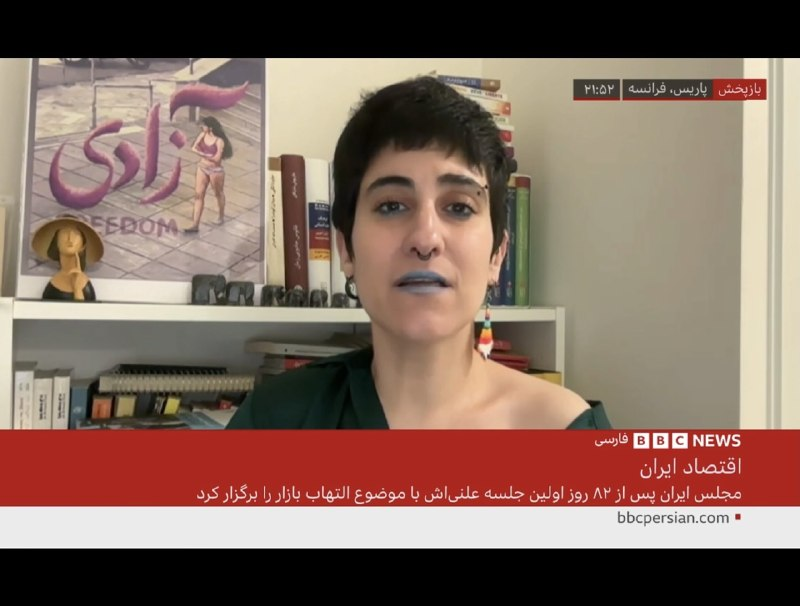

بی‌بی‌سی اینارو از کجا پیدا میکنه؟

@Dirty_Kids 👻

## Dirty_Kids — post 389321

  

🌪وقتی اینترنت طوفانیه... کافیه بادبان ها رو بکشی تا

⚫️با بالاترین کیفیت ممکن
⚡️ 

⚫️100 هزار تومان شارژ هدیه 
🎁

⚫️پایین ترین قیمت گیگی 250
🌐 

⚫️و ارائه پورسانت %10 در ازای هر معرفی
💼

بتونی یه اتصال پایدار با پشتیبانی 24 ساعته داشته باشی
🚀

بادبان راهتو باز می‌کنه
⛵️

🛡@BadBan_VPN | کانال 

🤖@BadBan_VPNBot | ربات 

📞@BadBan_VPNSupport | پشتیبانی

## Hranews — post 112911

معوقات مزدی کارگران داروگر تهران و ثبت نام گسترده برای بیمه بیکاری

❗️
❗️
❗️
❗️
❗️ – #کارگران شرکت داروگر تهران از تاخیر بیش از پنج ماهه در پرداخت دستمزد و تعویق در واریز حق بیمه خود خبر دادند. همچنین، نماینده مشهد در مجلس اعلام کرد که از ابتدای جنگ اخیر، ۲۰۵ هزار نفر برای دریافت بیمه بیکاری ثبت نام کرده‌اند.

ادامه مطلب

↘️
@hranews_bot تماس ✉️ -  @Hranews  کانال هرانا 🆑

## Hranews — post 112910

  

معاون توسعه کارآفرینی و اشتغال وزیر کار، اعلام کرد که #قطع_اینترنت و توقف فروش اینترنتی، مهم‌ترین مشکل مشاغل خانگی در ماه‌های اخیر بوده است. مالک حسینی، در نشست روز ملی مشاغل خانگی گفت که همزمان با محدودیت‌های اینترنتی و توقف نمایشگاه‌های فصلی، بسیاری از فعالان این حوزه امکان فروش محصولات خود را از دست داده‌اند. وی با اشاره به اینکه حدود ۸۰٪ مشاغل خانگی را زنان تشکیل می‌دهند، اظهار داشت که بخش عمده این افراد از خانوارهای کم‌درآمد هستند.

صبح امروز، نت‌بلاکس، نهاد ناظر بر اختلالات #اینترنت در جهان، اعلام کرد که قطع گسترده اینترنت در ایران وارد هفتاد و چهارمین روز خود شده و از مرز ۱۷۵۲ ساعت گذشته است.

↘️
@hranews_bot تماس ✉️ - @Hranews کانال هرانا 🆑

## Hranews — post 112909

  

انجمن قلم (پن) آمریکا در گزارش سالانه «شاخص آزادی نوشتن» اعلام کرده است که ایران با ۵۳ نویسنده زندانی، پس از چین در رتبه دوم جهان از نظر شمار #نویسندگان در بند قرار گرفته است. بر اساس این گزارش، طی سال گذشته شدیدترین موج بازداشت نویسندگان در ایران ثبت شده و با ۱۷ مورد بازداشت جدید، شمار نویسندگان زندانی بار دیگر به سطح دوران اعتراض‌های «زن، زندگی، آزادی» در سال ۱۴۰۱ نزدیک شده است. این گزارش همچنین به تشدید سرکوب‌ها در ایران پس از جنگ ۱۲ روزه میان ایران و اسرائیل اشاره دارد و آن را عامل گسترش فضای امنیتی در کشور دانسته است.

کارین دویچ کارلکار، مدیر برنامه «نویسندگان در معرض خطر» در انجمن قلم، در این رابطه گفته است: «مقام‌های جمهوری اسلامی ایران به‌دلیل کارزار بی‌رحمانه‌شان علیه صداهای مستقل بیش از همه جلب توجه می‌کنند. شاعران، مترجمان، پژوهشگران، ترانه‌سرایان، دیدگاه‌نویسان، مدافعان حقوق بشر و ستون‌نویسان همگی در زندان‌های ایران گرفتار می‌شوند، در حالی که حکومت تلاش دارد بحث، انتقاد و مخالفت را خاموش کند.»

↘️
@hranews_bot تماس ✉️ - @Hranews کانال هرانا 🆑

## Hranews — post 112908

  

عدم رسیدگی پزشکی؛ گزارش جدید از وضعیت محشر پرندین، نوکیش مسیحی در زندان اوین

❗️
❗️
❗️
❗️
❗️– محشر (محترم) پرندین، نوکیش مسیحی محبوس در زندان اوین، با وجود ابتلا به بیماری قلبی و همچنین دو تومور در ناحیه زیر گلو و مجاورت مخچه، از رسیدگی تخصصی پزشکی و اعزام به مراکز درمانی خارج از زندان محروم مانده است.

به گزارش خبرگزاری هرانا، ارگان خبری مجموعه فعالان حقوق بشر در ایران، محشر (محترم) پرندین، نوکیش مسیحی محبوس در #زندان_اوین از رسیدگی درمانی محروم مانده است.

یک منبع مطلع از وضعیت جسمانی این نوکیش مسیحی، ضمن تایید این خبر به هرانا گفت: “محشر پرندین از بیماری حاد قلبی و همچنین دو تومور در ناحیه زیر گلو و مجاورت مخچه رنج می‌برد. بنا بر تشخیص پزشک زندان، وضعیت جسمی وی نگران‌کننده بوده و این تومورها نیازمند جراحی فوری هستند. با این حال، وی تاکنون از اعزام به مراکز درمانی تخصصی محروم مانده است.”
به گفته یک منبع مطلع، تومور قرارگرفته در مجاورت مخچه بر وضعیت جسمانی خانم پرندین اثر گذاشته و موجب اختلال در تعادل، حرکت و تکلم او شده است؛ به‌طوری که گفتار وی با مکث‌های محسوس همراه است.

ادامه مطلب

#محشر_پرندین
#محترم_پرندین

↘️
@hranews_bot تماس ✉️ -  @Hranews  کانال هرانا 🆑

## manototv — post 105363

  <a href="telegram/content/manototv_105363_1778608527.mp4" target="_blank">🎬 Download video</a>

جان هیلی، وزیر دفاع بریتانیا، اعلام کرد لندن جنگنده، پهپاد و یک ناو جنگی را به مأموریت چندملیتی حفاظت از تردد کشتی‌ها در تنگه هرمز اعزام خواهد کرد.

هیلی این خبر را پس از نشست مشترک با وزرای دفاع ۴۰ کشور اعلام کرد؛ نشستی که با هدف جلب حمایت برای مأموریت تحت رهبری بریتانیا جهت تأمین امنیت کشتیرانی در تنگه هرمز برگزار شد.

بریتانیا می‌گوید این مأموریت در واکنش به محاصره تنگه هرمز از سوی جمهوری اسلامی انجام می‌شود.

## manototv — post 105362

  <a href="telegram/content/manototv_105362_1778608528.mp4" target="_blank">🎬 Download video</a>

سازمان جهانی بهداشت هشدار داد شمار موارد ابتلا به هانتاویروس، پس از شیوع این ویروس در یک کشتی گردشگری در اقیانوس اطلس، احتمالاً افزایش پیدا خواهد کرد.
تدروس آدهانوم، مدیرکل سازمان جهانی بهداشت، اعلام کرد تاکنون ۹ مورد ابتلای قطعی و دو مورد مشکوک ثبت شده و انتظار می‌رود افراد بیشتری نیز به ویروس مبتلا شده باشند. با این حال او تأکید کرد خطر شیوع گسترده جهانی همچنان «پایین» ارزیابی می‌شود.
شیوع بیماری در کشتی «ام‌وی هوندیوس» آغاز شد؛ جایی که سه مسافر، شامل یک زوج هلندی و یک زن آلمانی، جان خود را از دست دادند. این کشتی در حال سفر ۳۵ روزه در اقیانوس اطلس بود.
هانتاویروس معمولاً از طریق ادرار، بزاق یا فضولات جوندگان منتقل می‌شود. گونه «آندِس» تنها نوع شناخته‌شده‌ای است که می‌تواند از انسان به انسان منتقل شود.
در پی این بحران، صدها مسافر و خدمه در کشورهای مختلف تحت قرنطینه یا مراقبت پزشکی قرار گرفته‌اند. مقام‌های بهداشتی در اروپا و آمریکا نیز در حال ردیابی تماس‌های مرتبط با مبتلایان هستند.

## manototv — post 105361

  <a href="telegram/content/manototv_105361_1778608528.mp4" target="_blank">🎬 Download video</a>

مقام‌های آمریکایی اعلام کردند نیروهای این کشور مانع عبور یک نفتکش با پرچم جمهوری مالت از تنگه هرمز شده‌اند.
سخنگوی ستاد فرماندهی مرکزی آمریکا سنتکام؛ به الجزیره گفت نفتکش «آگیوس فانوریوس» به‌دلیل نقض محاصره دریایی، اجازه عبور پیدا نکرده است. به گفته او، این کشتی حامل نفت ایران نبوده است.
مقام‌های آمریکایی همچنین اعلام کردند چند نفتکش دیگر نیز به‌دلیل نقض تحریم‌ها و محاصره اعمال‌شده علیه بنادر ایران، متوقف شده‌اند.

## manototv — post 105360

  <a href="telegram/content/manototv_105360_1778608529.mp4" target="_blank">🎬 Download video</a>

«اینترنت را قطع کردند تا صدای مردم خاموش شود.»

## manototv — post 105359

  <a href="telegram/content/manototv_105359_1778608532.mp4" target="_blank">🎬 Download video</a>

شورای همکاری خلیج فارس ورود نیروهایی از سپاه پاسداران به جزیره بوبیان کویت را محکوم کرد.

جاسم البدیوی، دبیرکل شورای همکاری خلیج فارس، گفت: «نفوذ عناصر سپاه پاسداران به جزیره بوبیان کویت و برنامه‌ریزی آن‌ها برای اقدامات خصمانه را محکوم می‌کنیم.»

او همچنین تأکید کرد شورای همکاری خلیج فارس از کویت در همه اقداماتی که برای حفظ امنیت و ثبات خود انجام دهد، حمایت می‌کند.

## manototv — post 105358

  <a href="telegram/content/manototv_105358_1778608532.mp4" target="_blank">🎬 Download video</a>

وزارت خارجه کویت اعلام کرد در پی آنچه «نفوذ» اعضای مسلح وابسته به سپاه پاسداران خوانده شده، سفیر جمهوری‌اسلامی در این کشور را احضار و یادداشت اعتراضی رسمی به او تحویل داده است.
به گفته مقام‌های کویتی، چهار عضو منتسب به سپاه قصد داشتند از راه دریا وارد کویت شوند و «اقدامات خصمانه» انجام دهند. وزارت کشور کویت اعلام کرد در درگیری با نیروهای امنیتی، یک نیروی کویتی زخمی شده و دو نفر از متهمان نیز فرار کرده‌اند.
معاون وزیر خارجه کویت این اقدام را «نقض آشکار حاکمیت کویت» و مغایر با قوانین بین‌المللی و منشور سازمان ملل توصیف کرد و از تهران خواست فوراً چنین اقداماتی را متوقف کند.

## manototv — post 105357

  <a href="telegram/content/manototv_105357_1778608533.mp4" target="_blank">🎬 Download video</a>

تورم در آمریکا افزایش یافته و طبق آمار رسمی اداره آمار کار آمریکا، این افزایش عمدتا به عوامل مرتبط با جنگ ایران مربوط می‌شود.
شاخص قیمت مصرف‌کننده در ماه آوریل به ۳.۸ درصد رسید؛ در حالی‌ که این رقم در ماه مارس ۳.۳ درصد بود. افزایش قیمت بنزین از مهم‌ترین دلایل این رشد اعلام شده است.
این آمار نشان می‌دهد بالا رفتن قیمت نفت، که ناشی از اختلال مؤثر در تردد از تنگه هرمز بوده، باعث افزایش بیشتر قیمت‌ها شده است.
بر اساس این گزارش، افزایش هزینه انرژی و سوخت اصلی‌ترین عامل رشد ۰.۵ واحد درصدی تورم بوده است.
تحلیلگران می‌گویند این وضعیت علاوه بر فشار بر مصرف‌کنندگان آمریکایی و اقتصاد آمریکا، ممکن است یک پیامد سیاسی هم داشته باشد؛ چرا که فشار اقتصادی بر رأی‌دهندگان می‌تواند دونالد ترامپ را به بازگشت به میز مذاکره سوق دهد.

## alonews — post 119544

  <a href="telegram/content/alonews_119544_1778608534.webm" target="_blank">🎬 Download video</a>

👈پاپ لئو چهاردهم: مسیحیان و مسلمانان، بی‌تفاوتی را به همبستگی تبدیل کنند

✅ @AloNews خبر جنگ

## alonews — post 119543

  <a href="telegram/content/alonews_119543_1778608534.webm" target="_blank">🎬 Download video</a>

👈سفیر ایران در چین: آمریکا نمی‌تواند مواضع چین درباره ایران را تغییر دهد

✅ @AloNews خبر جنگ

## alonews — post 119542

  <a href="telegram/content/alonews_119542_1778608534.mp4" target="_blank">🎬 Download video</a>

👈خوش‌چشم کارشناس ارشد صداوسیما:
این دفعه جنگ بشه اصلا مهم نیست ساختمون اینتل تو اسرائیل چند طبقه زیر زمینه، کل دیتاسنترهای اینتل میخوره، پروژه مشترک گوگل و آمازونم که میخوره، بقیشم هرچی هست میخوره

✅ @AloNews خبر جنگ

## alonews — post 119541

  <a href="telegram/content/alonews_119541_1778608536.webm" target="_blank">🎬 Download video</a>

👈وزارت دفاع عراق: هیچ‌گونه فعالیت یا تأسیسات نظامی ناشناس در صحرای نجف وجود ندارد

✅ @AloNews خبر جنگ

## alonews — post 119540

  <a href="telegram/content/alonews_119540_1778608537.webm" target="_blank">🎬 Download video</a>

👈تصاویر ماهواره‌ای نشان می‌دهد یک فروند نفتکش ایرانی در ۱۰ می در جزیره خارک در حال بارگیری نفت ایران بوده است که نشان از تداوم بارگیری نفت خام در جزیره خارک دارد.این نفتکش بدون مشکل بارگیری کرد

✅ @AloNews خبر جنگ

## alonews — post 119539

  <a href="telegram/content/alonews_119539_1778608537.webm" target="_blank">🎬 Download video</a>

👈کاظم غریب‌آبادی، معاون وزیر خارجه، در شبکه ایکس نوشت: صلح واقعی با ادبیات تحقیر، تهدید و امتیازگیری اجباری ساخته نمی‌شود.

✅ @AloNews خبر جنگ

## alonews — post 119538

  <a href="telegram/content/alonews_119538_1778608537.mp4" target="_blank">🎬 Download video</a>

👈وزارت دفاع روسیه فیلمی منتشر کرده است که آزمایش موفقیت‌آمیز سامانه موشکی جدید هسته‌ای‌پرتاب روسیه به نام «سرمات» را نشان می‌دهد

✅ @AloNews خبر جنگ

## alonews — post 119537

  <a href="telegram/content/alonews_119537_1778608539.webm" target="_blank">🎬 Download video</a>

👈بلومبرگ: نیروگاه اصلی گاز طبیعی که سوخت مورد نیاز امارات متحده عربی را تأمین می‌کند، سال آینده به ظرفیت کامل بازخواهد گشت که این موضوع نشان‌دهنده زمان طولانی بازیابی برای برخی از حیاتی‌ترین زیرساخت‌های منطقه در پی جنگ اخیر است.

✅ @AloNews خبر جنگ

## alonews — post 119536

  <a href="telegram/content/alonews_119536_1778608539.webm" target="_blank">🎬 Download video</a>

👈بیانیه دولت بریتانیا: ما پهپادها، جت‌های جنگنده و یک ناو جنگی را به ماموریت چندملیتی برای تأمین امنیت تنگه هرمز اعزام خواهیم کرد

🔴کمک ما شامل تجهیزات مین‌یاب خودکار، جت‌های جنگنده تایفون و یک کشتی جنگی خواهد بود.

✅ @AloNews خبر جنگ

## alonews — post 119535

  <a href="telegram/content/alonews_119535_1778608540.webm" target="_blank">🎬 Download video</a>

👈سی‌ان‌ان : کشتی روسی حامل راکتورهای هسته‌ای زیردریایی به کره شمالی تو شرایط مرموزی غرق شده !

✅ @AloNews خبر جنگ

## alonews — post 119534

  <a href="telegram/content/alonews_119534_1778608540.webm" target="_blank">🎬 Download video</a>

👈الجزیره: رهبر ایران ۵ شرط را برای آمریکا پیش از ورود به مذاکره در مورد بحث هسته ای تعیین کرده است:

🔴 پایان دادن به جنگ در همه جبهه‌ها

🔴 رفع همه تحریم‌ها

🔴آزادسازی دارایی‌های مسدود شده

🔴 جبران خسارات و زیان‌های جنگ

🔴 به رسمیت شناختن حق حاکمیت ایران بر تنگه هرمز

✅ @AloNews خبر جنگ

## alonews — post 119533

  <a href="telegram/content/alonews_119533_1778608540.webm" target="_blank">🎬 Download video</a>

👈بلومبرگ: امارات دو بار با هماهنگی اسرائیل به ایران حمله کرده؛ یک‌بار به یک تأسیسات پتروشیمی در عسلویه و بار دیگر به پالایشگاهی در جزیره لاوان.

✅ @AloNews خبر جنگ

## alonews — post 119532

  <a href="telegram/content/alonews_119532_1778608540.webm" target="_blank">🎬 Download video</a>

👈طبق گزارش WSJ، گوگل در حال مذاکره با اسپیس‌ایکس برای توافق پرتاب موشک است که به برنامه‌های گوگل برای توسعه مراکز داده مداری در فضا مرتبط است

✅ @AloNews خبر جنگ

## alonews — post 119531

  <a href="telegram/content/alonews_119531_1778608541.mp4" target="_blank">🎬 Download video</a>

👈سناتور گراهام: اگر میانجی (پاکستان) اجازه می‌دهد هواپیماهای شناسایی در پایگاه‌های هوایی پاکستان پارک شوند، فکر می‌کنید این با نقش میانجی منصفانه سازگار است؟

🔴وزیر جنگ هگستث: من نمی‌خواهم وسط این مذاکرات قرار بگیرم.

🔴سناتور گراهام: خب، من می‌خواهم وسط این مذاکرات قرار بگیرم. من به پاکستان به اندازه‌ای که بتوانم آنها را پرتاب کنم اعتماد ندارم.

🔴اگر واقعاً هواپیماهای ایرانی در پایگاه‌های پاکستانی برای محافظت از دارایی‌های نظامی ایران پارک شده‌اند، این به من می‌گوید که شاید باید به دنبال شخص دیگری برای میانجیگری باشیم. جای تعجب نیست که این لعنتی به جایی نمی‌رسد.

✅ @AloNews خبر جنگ

## alonews — post 119529

  <a href="telegram/content/alonews_119529_1778608543.mp4" target="_blank">🎬 Download video</a>

👈سربازان روسی در حال استفاده از پهپاد رهگیر «یولکا» (Yolka) علیه پهپادهای اوکراینی هستند که براحتی با لانچر بسیار کوچک دستی به سرعت پرتاب میشود

✅ @AloNews خبر جنگ

## alonews — post 119528

  <a href="telegram/content/alonews_119528_1778608546.webm" target="_blank">🎬 Download video</a>

👈وزارت انرژی آمریکا ادعا کرد تصور می‌کند که تنگه هرمز تا اواخر ماه مه میلادی (۱۹ روز دیگر) بسته خواهد ماند.

✅ @AloNews خبر جنگ

## alonews — post 119527

  <a href="telegram/content/alonews_119527_1778608546.webm" target="_blank">🎬 Download video</a>

🔴فوری / سی‌ان‌ان: ترامپ جدی‌تر از گذشته به از سرگیری جنگ فکر می‌کند

✅ @AloNews خبر جنگ

## alonews — post 119526

  <a href="telegram/content/alonews_119526_1778608546.webm" target="_blank">🎬 Download video</a>

👈فهرست کامل مدیران شرکت‌های بزرگ آمریکایی که دونالد ترامپ را در سفر به چین همراهی خواهند کرد.

✅ @AloNews خبر جنگ

## alonews — post 119525

  <a href="telegram/content/alonews_119525_1778608546.mp4" target="_blank">🎬 Download video</a>

👈نماینده کنگره : دولت بررسی کرده که از کنگره مجوز استفاده از نیروی نظامی بگیره؟

🔴 پیت هگست : نظر ما اینه که اگه رئیس‌جمهور تصمیم بگیره دوباره شروع کنه، ما طبق اصل ۲ قانون اساسی همه اختیارات لازم رو داریم برای انجامش

✅ @AloNews خبر جنگ

---
📅 بروزرسانی: 1405/02/22 19:11
---

## VahidOOnLine — post 239729

  <a href="telegram/content/VahidOOnLine_239729_1778600506.mp4" target="_blank">🎬 Download video</a>

یک شهروند در پیامی به ایران اینترنشنال با اشاره به هشدار ترامپ درباره حمله و بردن ایران به «عصر حجر» گفت که جمهوری اسلامی با قطع اینترنت این کار را کرد و نه ترامپ. پیام این مخاطب و تصویر این پست با هوش مصنوعی خوانده و ساخته شده است.
‌🏁 🇬🇧 IranintlTV

🤖 @VahidOOnLine

## VahidOOnLine — post 239728

  

♦️ستاد فرماندهی ارتش ایالات متحده آمریکا، سنتکام، روز سه‌شنبه ۲۲ اردیبهشت در شبکه اجتماعی اکس با انتشار عکسی از ناو هواپیمابر آبراهام لینکلن نوشت نیروهای این فرماندهی ۶۵ کشتی تجاری را تغییر مسیر داده و چهار کشتی را از کار انداخته‌اند.

سنتکام همچنین اعلام کرد ناو هواپیمابر آبراهام لینکلن به عملیات خود در دریای عرب، از جمله اجرای محاصره دریایی آمریکا علیه ایران، ادامه می‌دهد.
‌🇸🇦 Indypersian

🤖 @VahidOOnLine

## VahidOOnLine — post 239727

  

وزارت خارجه کویت اعلام کرد که سفیر جمهوری اسلامی را در پی نفوذ یک گروه وابسته به سپاه پاسداران به جزیره بوییان احضار کرده است.

وزارت کشور کویت اعلام کرد چهار نفری که به‌صورت غیرقانونی از راه دریا وارد این کشور شده بودند، در جریان بازجویی به عضویت در سپاه پاسداران انقلاب اسلامی اعتراف کردند.
در بیانیه این وزارتخانه آمده است این افراد اعتراف کردند مامور شده بودند با استفاده از یک قایق ماهیگیری که به‌طور ویژه برای اجرای اقدامات خصمانه علیه کویت اجاره شده بود، به جزیره بوبیان نفوذ کنند.
بر اساس این بیانیه، این افراد با نیروهای مسلح کویت درگیر شدند که در نتیجه آن یکی از نیروهای کویتی زخمی شد و دو نفر از عناصر نفوذی گریختند.
‌🏁 🇬🇧 IranintlTV

🤖 @VahidOOnLine

## VahidOOnLine — post 239726

  

♦️ خواجه محمد آصف، وزیر دفاع پاکستان، از احتمال گسترش پیمان دفاعی مشترک این کشور با عربستان سعودی و پیوستن ترکیه و قطر به عنوان شرکای جدید خبر داد. به گفته او، سازوکار حضور این اعضای جدید تا حد زیادی نهایی شده و هدف آن شکل‌گیری یک ائتلاف قدرتمند دفاعی و اقتصادی در منطقه است.

وزیر دفاع پاکستان تاکید کرد که چنین ائتلافی می‌تواند وابستگی به قدرت‌های فرامنطقه‌ای را به حداقل رسانده و صلح و ثبات را در منطقه تقویت کند. آصف تصریح کرد: «این پیمان علیه هیچ کشوری نیست، اما تاثیری حیاتی در محافظت از صلح ایفا خواهد کرد.»

پاکستان و عربستان سعودی در سپتامبر ۲۰۲۵ پیمانی را امضا کردند که طبق آن، حمله به هر یک از دو کشور، حمله به طرف دیگر تلقی می‌شود. پیوستن ترکیه و قطر به این پیمان، می‌تواند منجر به تشکیل یک «برادری بین‌المللی» با توان نظامی و اقتصادی بالا شود که معادلات امنیتی منطقه را تغییر خواهد داد.
‌🇸🇦 Indypersian

🤖 @VahidOOnLine

## VahidOOnLine — post 239725

  

پیت هگست، وزیر جنگ آمریکا، سه‌شنبه در کنگره این کشور درباره جنگ علیه جمهوری اسلامی اعلام کرد که ارتش ایالات متحده برنامه‌ای برای خروج نیروها از منطقه خاورمیانه دارد، اما در عین حال برای تشدید درگیری یا جابه‌جایی تجهیزات در صورت لزوم نیز برنامه‌ریزی کرده است.
او افزود: «ما دقیقا می‌دانیم چه چیزی در اختیار داریم. هر آنچه نیاز داریم به اندازه کافی داریم.»
او گفت به صنایع دفاعی گفته شده است که «بیشتر و سریع‌تر تولید کنند»، و در عین حال ظرفیت ناکافی مجتمع‌های صنعتی-نظامی را ناشی از دولت‌های پیشین و کمک‌های آمریکا به اوکراین در جنگش با روسیه دانست.
‌🏁 🇬🇧 IranintlTV

🤖 @VahidOOnLine

## VahidOOnLine — post 239724

  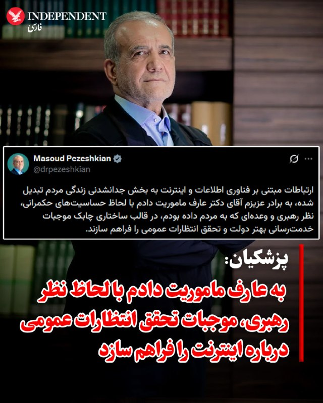

♦️ مسعود پزشکیان، رئیس جمهوری اسلامی، روز سه‌شنبه ۲۲ اردیبهشت، در حالی که ۷۴ روز از قطع کامل اینترنت و ارتباطات مردم ایران با خارج از کشور گذشته، با انتشار پیامی در شبکه اجتماعی ایکس اعلام کرد که محمدرضا عارف، معاون رئیس‌جمهوری اسلامی را مامور کرده که با در نظر گرفتن «حساسیت‌های حکمرانی و نظر رهبری»، در قالب «ساختاری چابک»، موجبات خدمت‌رسانی بهتر دولت و تحقق انتظارات عمومی را فراهم کند.

پزشکیان توضیح نداد که ساختار چابک مورد نظر او، شامل وصل کامل اینترنت و ارتباطات می‌شود یا قصد دارد خدمات الکترونیکی دولت را روی شبکه ملی اینترنت (نسخه محدود داخلی) گسترده‌تر کند.
‌🇸🇦 Indypersian

🤖 @VahidOOnLine

## VahidOOnLine — post 239722

  <a href="telegram/content/VahidOOnLine_239722_1778600511.mp4" target="_blank">🎬 Download video</a>

دونالد ترامپ، رئیس‌جمهور آمریکا، با وجود توقف مذاکرات با جمهوری‌اسلامی، در یک گفتگو، اعلام کرده تهران صددرصد غنی‌سازی اورانیوم و هرگونه تلاش برای ساخت سلاح هسته‌ای را متوقف خواهد کرد.
ترامپ در گفت‌وگو با رادیوی WABC گفت شخصاً با مقام‌های جمهوری‌اسلامی در تماس بوده و افزود: «آن‌ها گفتند ما غبار هسته‌ای را تحویل خواهیم گرفت.»
او همچنین تأکید کرد آمریکا برای رسیدن به توافق عجله‌ای ندارد و گفت: «ما محاصره را در اختیار داریم.»
‌🏁 🇬🇧 ManotoTV

🤖 @VahidOOnLine

## VahidOOnLine — post 239720

  <a href="telegram/content/VahidOOnLine_239720_1778600511.mp4" target="_blank">🎬 Download video</a>

در جلسه استماع کنگره آمریکا، مقام‌های ارشد پنتاگون اعلام کردند هزینه تسلیحات و تجهیزات مصرف‌شده آمریکا در جنگ با ایران تاکنون به حدود ۲۴ میلیارد دلار رسیده است.
پیت هگست، وزیر دفاع آمریکا، به همراه رئیس ستاد مشترک ارتش و مقام مالی وزارت جنگ در این جلسه حضور داشتند. به گفته جولز هرست، این رقم شامل مهمات، موشک‌ها و سایر تجهیزات نظامی استفاده‌شده در جنگ است.
پنتاگون ماه گذشته نیز اعلام کرده بود مجموع هزینه‌های جنگ با ایران تاکنون به ۲۹ میلیارد دلار رسیده است.
‌🏁 🇬🇧 ManotoTV

🤖 @VahidOOnLine

## VahidOOnLine — post 239719

  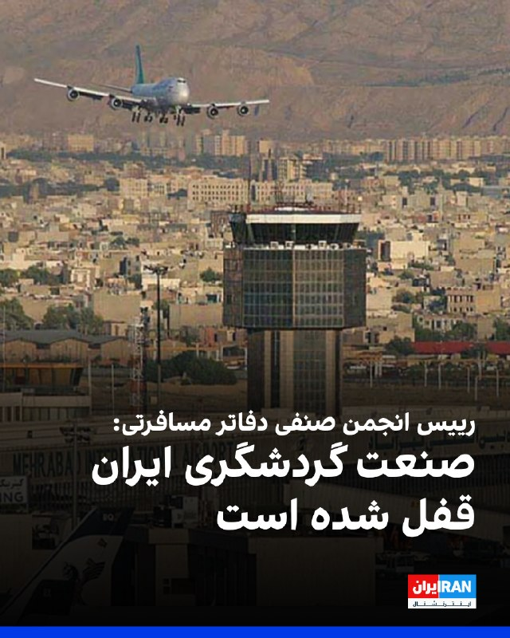

حرمت‌الله رفیعی، رییس انجمن صنفی دفاتر خدمات مسافرتی، گفت: «دفاتر مسافرتی پس از ماه‌ها رکود، جنگ، بی‌ثباتی اقتصادی و اختلال اینترنت، دیگر توان تاب‌آوری ندارند و در صورت ادامه شرایط فعلی، بخش مهمی از نیروی انسانی متخصص این صنعت از بین خواهد رفت.»

او افزود: «در شرایطی که عملا کسب‌وکاری وجود ندارد، فشارهای مالیاتی و بیمه‌ای همچنان ادامه دارد و صنعت گردشگری ایران قفل شده است.»

رفیعی اضافه کرد: «بسیاری از کارکنان آموزش‌دیده دفاتر مسافرتی که سال‌ها برای آموزش آن‌ها هزینه شده است، به دلیل نبود درآمد، جذب مشاغلی مثل آرایشگری و فعالیت‌های غیرمرتبط شده‌اند.»
‌🏁 🇬🇧 IranintlTV

🤖 @VahidOOnLine

## VahidOOnLine — post 239718

  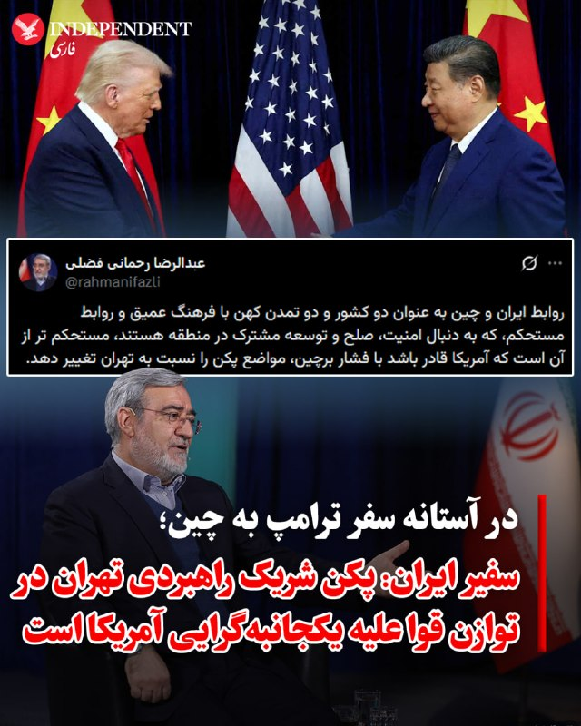

♦️ عبدالرضا رحمانی‌فضلی، سفیر جمهوری اسلامی در چین، روز سه‌شنبه ۲۲ اردیبهشت، در گفتگو با خبرگزاری ایرنا و در آستانه سفر دونالد ترامپ به پکن، بر استحکام پیوندهای راهبردی میان تهران و پکن تاکید کرد. او تصریح کرد که چین برای ایران تنها یک شریک اقتصادی یا خریدار انرژی نیست، بلکه بخشی کلیدی از «توازن سیاسی» جمهوری اسلامی در مقابله با فشارها، تهدیدها و یکجانبه‌گرایی قدرت‌های خارجی محسوب می‌شود.

سفیر ایران در پکن همچنین در حساب کاربری خود در شبکه اجتماعی ایکس، روابط دو کشور را ریشه‌دار در تمدن و فرهنگ کهن توصیف کرد و نوشت: «روابط ایران و چین مستحکم‌تر از آن است که آمریکا قادر باشد با فشار بر پکن، مواضع این کشور را نسبت به تهران تغییر دهد.»

به گفته رحمانی‌فضلی، سفر اخیر عباس عراقچی، وزیر امور خارجه جمهوری اسلامی به چین، نشان‌دهنده تلاش فعالانه تهران برای بازسازی جایگاه دیپلماتیک خود پس از درگیری‌های اخیر با ایالات متحده و اسرائیل است. او تاکید کرد که ایران به جای واکنش‌های صرفا نظامی، به دنبال تثبیت موقعیت خود از طریق ائتلاف‌های راهبردی با قدرت‌های منطقه‌ای و جهانی برای تامین امنیت و توسعه مشترک است.
‌🇸🇦 Indypersian

🤖 @VahidOOnLine

## VahidOOnLine — post 239717

  <a href="telegram/content/VahidOOnLine_239717_1778600513.mp4" target="_blank">🎬 Download video</a>

♦️دونالد ترامپ در آستانه سفر به چین، در گفتگو با برنامه پادکست «سید و دوستان در صبح» سید روزنبرگ گفت محاصره ایران ادامه دارد و تهران به منابع مالی دسترسی ندارد. او همچنین گفت نیروی دریایی و نیروی هوایی ایران نابود شده‌اند و افزود: «فقط مسئله زمان است.»

ترامپ افزود آمریکا اجازه نخواهد داد ایران به سلاح هسته‌ای دست پیدا کند، چون به گفته او، جمهوری اسلامی از آن استفاده خواهد کرد. رئیس‌جمهوری آمریکا همچنین گفت اگر ایران به سلاح هسته‌ای دست پیدا کند، «فاجعه‌ای باورنکردنی» رخ خواهد داد.
‌🇸🇦 Indypersian

🤖 @VahidOOnLine

## VahidOOnLine — post 239716

  

دونالد ترامپ گفت حکومت ایران با انزاویی روبه‌روست که آن را از منابع درآمدش محروم می‌کند و انتظار می‌رود اقتصاد ایران زیر فشارهای ناشی از محاصره بندرها دچار فروپاشی شود.

او افزود: «این درگیری بدون نیاز به شتاب‌زدگی حل‌وفصل خواهد شد و جمهوری اسلامی با انزوایی روبه‌رو است که آن را از منابع درآمدی محروم می‌کند.»

دونالد ترامپ درباره اورانیوم غنی‌شده در ایران گفت مقام‌های جمهوری اسلامی به او گفته‌اند قرار است آنچه او «گردوغبار هسته‌ای» می‌نامد در اختیار آمریکا قرار گیرد، اما بعدا نظرشان را تغییر داده‌اند. او تاکید کرد در نهایت این مواد را به دست خواهند آورد و موضوع را جمع‌وجور می‌کنند.
‌🏁 🇬🇧 IranintlTV

🤖 @VahidOOnLine

## VahidOOnLine — post 239715

  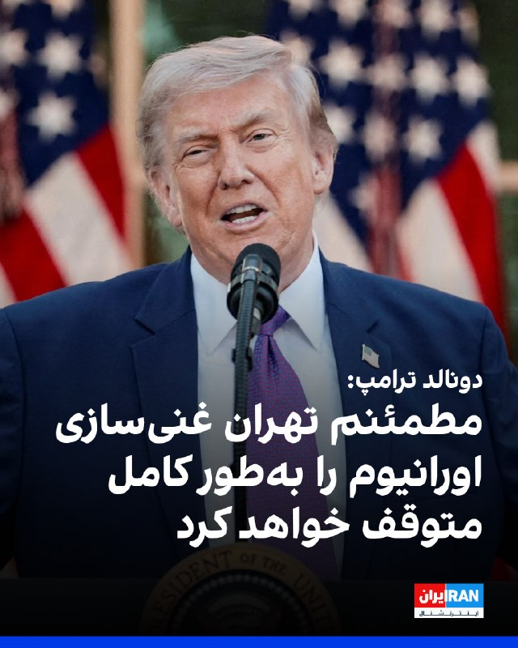

دونالد ترامپ در گفت‌وگو با برنامه رادیویی «سید رازبرگ» گفت: انتظار داریم اقتصاد ایران زیر فشارهای ناشی از محاصره بنادرش فرو بپاشد.
او افزود این درگیری بدون نیاز به شتاب‌زدگی حل‌وفصل خواهد شد و جمهوری اسلامی با انزوایی روبه‌رو است که آن را از منابع درآمدی محروم می‌کند.
ترامپ گفت ایالات متحده در حال انجام ارتباطات مستقیم با مقام‌های تهران است و برای رسیدن به توافق عجله‌ای ندارد و او اطمینان دارد که تهران غنی‌سازی اورانیوم را به‌طور کامل متوقف خواهد کرد.
‌🏁 🇬🇧 IranintlTV

🤖 @VahidOOnLine

## VahidOOnLine — post 239714

  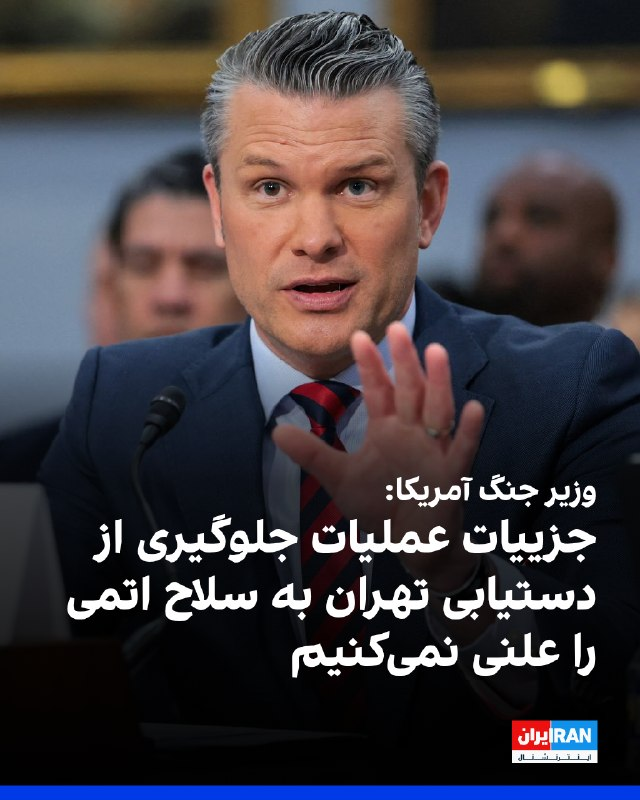

پیت هگست، وزیر جنگ آمریکا، گفت که این کشور برای تشدید، عقب‌نشینی یا جابه‌جایی نیروها برنامه‌ریزی کرده است، اما جزئیات ماموریت جلوگیری از دستیابی جمهوری اسلامی به بمب هسته‌ای را علنی نمی‌کند.
پیش‌تر اکسیوس به نقل از سه منبع آمریکایی گزارش داد که دونالد ترامپ روز دوشنبه با تیم امنیت ملی خود دیدار می‌کند تا درباره مسیر پیش رو در جنگ با جمهوری اسلامی، از جمله احتمال ازسرگیری اقدام نظامی، گفت‌وگو کند.
‌🏁 🇬🇧 IranintlTV

🤖 @VahidOOnLine

## VahidOOnLine — post 239713

  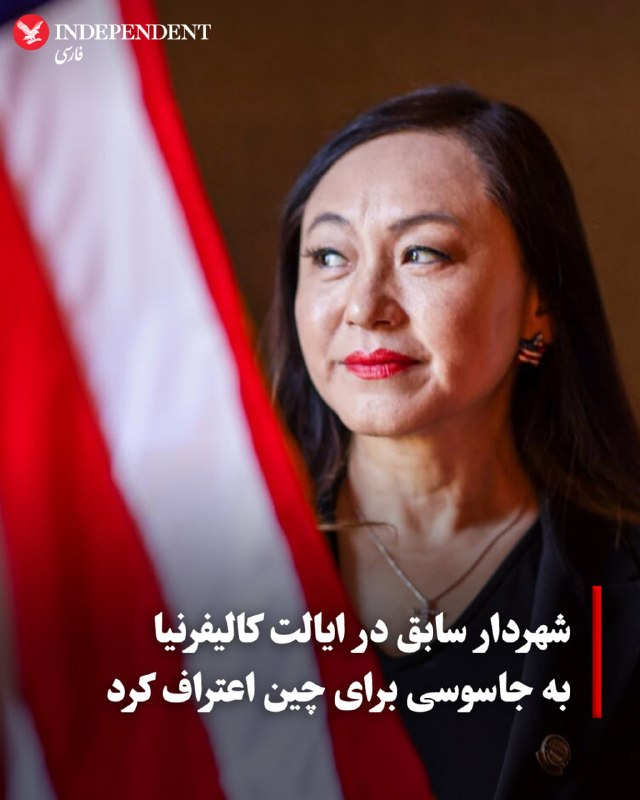

♦️ آیلین وانگ، شهردار سابق شهر آرکادیا در ایالت کالیفرنیا، به اتهام فعالیت غیرقانونی به عنوان عامل دولت چین (PRC) و انتشار پروپاگاندای پکن در خاک آمریکا، گناهکار شناخته شد.

بر اساس بیانیه وزارت دادگستری ایالات متحده، وانگ اعتراف کرده است که بین سال‌های ۲۰۲۰ تا ۲۰۲۲ تحت «هدایت و کنترل» مقامات چینی فعالیت کرده است. او متهم است که پیش از ورود به شورای شهر، با همکاری یک عامل محکوم‌شده چینی، وب‌سایتی را تحت پوشش یک رسانه محلی چینی-آمریکایی مدیریت می‌کرد که مستقیما محتوای ارسالی از سوی مقامات حزب کمونیست چین را منتشر می‌کرد.

دادستان‌ها اعلام کردند که وانگ حتی با چهره‌های مرتبط با دستگاه اطلاعاتی چین نیز در ارتباط بوده تا پیام‌های مورد نظر وزارت امور خارجه این کشور را توزیع کند. وانگ اکنون با خطر ۱۰ سال حبس در زندان فدرال و جریمه‌ای معادل ۲۵۰ هزار دلار روبرو است.

مقامات شهر آرکادیا با تاکید بر استعفای او، خاطرنشان کردند که این اقدامات مربوط به رفتارهای شخصی او بوده و تاثیری بر عملیات جاری شهرداری نداشته است. وزارت دادگستری این پرونده را «نقض جدی اعتماد عمومی» توصیف کرده است.
‌🇸🇦 Indypersian

🤖 @VahidOOnLine

## VahidOOnLine — post 239712

  <a href="telegram/content/VahidOOnLine_239712_1778600516.mp4" target="_blank">🎬 Download video</a>

♦️ خبرگزاری ایرنا روز سه‌شنبه ۲۲ اردیبهشت‌ماه گزارش داد آندریاس کراویک، معاون وزیر خارجه نروژ، که برای رایزنی با مقام‌های جمهوری اسلامی به تهران سفر کرده است، عصر سه‌شنبه با عباس عراقچی، وزیر خارجه جمهوری اسلامی، دیدار کرد.

جزئیاتی درباره محورهای این دیدار منتشر نشده است.
‌🇸🇦 Indypersian

🤖 @VahidOOnLine

## VahidOOnLine — post 239711

  <a href="telegram/content/VahidOOnLine_239711_1778600517.mp4" target="_blank">🎬 Download video</a>

ابراهیم رضایی، سخنگوی کمیسیون امنیت ملی و سیاست خارجی مجلس شورای اسلامی در شبکه اکس تهدید کرده، غنی سازی ۹۰ درصد به عنوان یکی از گزینه‌های جمهوری‌اسلامی در صورت حمله مجدد، بررسی می‌شود.
‌🏁 🇬🇧 ManotoTV

🤖 @VahidOOnLine

## VahidOOnLine — post 239710

  <a href="telegram/content/VahidOOnLine_239710_1778600517.mp4" target="_blank">🎬 Download video</a>

متاثر از پیچیده‌تر شدن سرنوشت مذاکرات جمهوری‌اسلامی و آمریکا، قیمت جهانی نفت، بیش از ۳ درصد افزایش یافت.
بهای نفت برنت به حدود ۱۰۸ دلار و نفت وست‌تگزاس آمریکا به بیش از ۱۰۱ دلار در هر بشکه رسید. تحلیلگران می‌گویند رد پیشنهادهای دو طرف، نگرانی‌ها درباره اختلال در عرضه نفت را دوباره افزایش داده است.
مدیرعامل آرامکوی عربستان هشدار داد هرگونه اختلال در صادرات نفت از تنگه هرمز می‌تواند بازگشت ثبات به بازار را تا سال ۲۰۲۷ به تعویق بیندازد.
کارشناسان همچنین گفته‌اند در صورت توافق واقعی میان تهران و واشنگتن، قیمت نفت ممکن است ۸ تا ۱۲ دلار کاهش پیدا کند، اما تشدید تنش‌ها می‌تواند قیمت نفت برنت را دوباره به بالای ۱۱۵ دلار برساند.
‌🏁 🇬🇧 ManotoTV

🤖 @VahidOOnLine

## VahidOOnLine — post 239709

  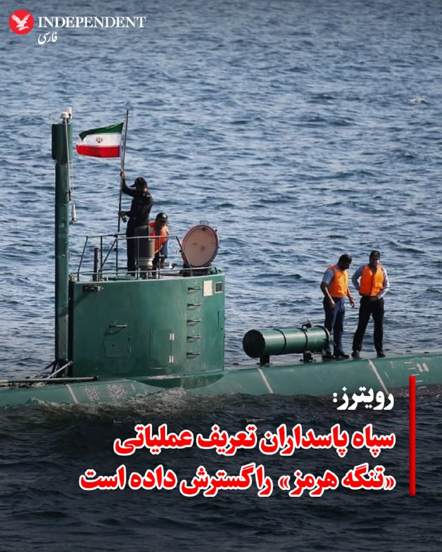

♦️ طبق گزارش خبرگزاری رویترز، یک مقام ارشد نیروی دریایی سپاه پاسداران انقلاب اسلامی اعلام کرد که ایران تعریف خود از تنگه هرمز را به یک «منطقه عملیاتی وسیع»، بسیار گسترده‌تر از دوران پیش از جنگ، تغییر داده است.

خبرگزاری دولتی فارس روز سه‌شنبه ۲۲ اردیبهشت، به نقل از محمد اکبرزاده، معاون سیاسی نیروی دریایی سپاه، گزارش داد که این تنگه دیگر تنها به عنوان یک آبراه باریک در اطراف چند جزیره شناخته نمی‌شود، بلکه دامنه و اهمیت نظامی آن به شدت افزایش یافته است.

اکبرزاده در این باره گفت: «در گذشته، تنگه هرمز به عنوان منطقه‌ای محدود در اطراف جزایری نظیر هرمز و هنگام تعریف می‌شد، اما امروز این دیدگاه تغییر کرده است.»

مقامات رسمی ایران هنوز به درخواست رویترز برای توضیح بیشتر در این زمینه پاسخی نداده‌اند.
‌🇸🇦 Indypersian

🤖 @VahidOOnLine

## VahidOOnLine — post 239708

  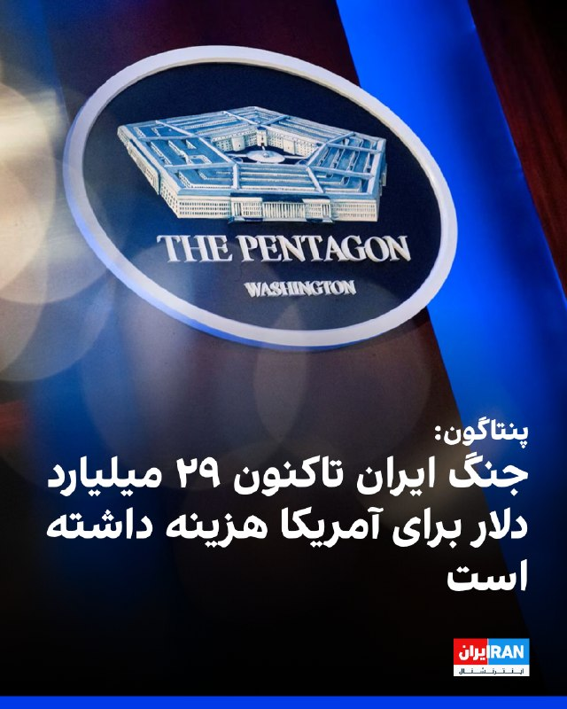

یک مقام ارشد پنتاگون سه‌شنبه اعلام کرد که جنگ آمریکا در ایران تاکنون ۲۹ میلیارد دلار هزینه داشته است؛ رقمی که نسبت به برآورد ارائه‌شده در اواخر ماه گذشته، چهار میلیارد دلار افزایش یافته است.

او افزود که این هزینه شامل تعمیر و جایگزینی به‌روزشده تجهیزات و هزینه‌های عملیاتی است.
‌🏁 🇬🇧 IranintlTV

🤖 @VahidOOnLine

## mwarmonitor — post 8973

🔴«ترامپ که از بن‌بست در مذاکرات ناراضی است، اکنون با جدیت بیشتری به ازسرگیری عملیات نظامی در ایران فکر می‌کند، هرچند به گفته منابع، تصمیم مهمی پیش از سفر او به چین بعید است گرفته شود.» CNN

@mwarmonitor

## mwarmonitor — post 8972

🇮🇷«ایران به‌طور قابل توجهی تعریف خود از تنگه هرمز را گسترش داده و اکنون منطقه‌ای بسیار بزرگ‌تر از قبل از جنگ را ادعا می‌کند. یک مقام نیروی دریایی سپاه پاسداران هشدار داده است که ایران «اجازه هیچ‌گونه تعرض به آب‌ها و منافع خود را نخواهد داد» - وال‌استریت ژورنال»

@mwarmonitor

## mwarmonitor — post 8971

🚢غول حمل‌ونقل دریایی مِرسک (Maersk)، دومین شرکت بزرگ کانتینری جهان، اعلام کرده است که همچنان از عبور از تنگه هرمز خودداری می‌کند.

@mwarmonitor

## pm_afshaa — post 90632

شهبازی مجری کونیه صداوسیما:
اگه خیلی به اینترنت علاقه دارید برید سوریه و افغانستان و عراق زندگی کنید

💧 Rainbet.com the #1 Non-KYC Crypto Casino & Sportsbook @rainbetcom

😁 @Pm_Afshaa

## pm_afshaa — post 90631

  <a href="telegram/content/pm_afshaa_90631_1778600519.webm" target="_blank">🎬 Download video</a>

🔴نفتکش حامل نفت عراق به دلیل اینکه چند روز پیش با اجازه ایران از تنگه هرمز عبور کرده بود، امروز توسط نیروی دریایی آمریکا بازگردانده شد.

💧 Rainbet.com the #1 Non-KYC Crypto Casino & Sportsbook @rainbetcom

😁 @Pm_Afshaa

## pm_afshaa — post 90630

سخنگوی دولت: تا سایه‌ جنگ دور نشه اینترنت وصل نمیشه، وقتی دور شد به تدریج وصل میشه

💧 Rainbet.com the #1 Non-KYC Crypto Casino & Sportsbook @rainbetcom

😁 @Pm_Afshaa

## pm_afshaa — post 90629

  <a href="telegram/content/pm_afshaa_90629_1778600519.webm" target="_blank">🎬 Download video</a>

🔴دونالد ترامپ: چین قوی است، اما ما قوی‌تر از چین هستیم. ما از نظر نظامی قوی تر از هر کشور دیگری هستیم.

این رو در مورد ونزوئلا دیدید. این برای اکثر کشورهای دیگر کار سختی بود. ما این کار رو در یک روز انجام دادیم.
نگاهی به ایران بندازید، آنها چیز های بزرگی داشتن و همه چیز از بین رفته.

💧Rainbet.com the #1 Non-KYC Crypto Casino & Sportsbook @rainbetcom

😁 @Pm_Afshaa

## pm_afshaa — post 90628

  <a href="telegram/content/pm_afshaa_90628_1778600520.webm" target="_blank">🎬 Download video</a>

🔴ترامپ: من رابطه خیلی خوبی با بی‌بی نتانیاهو دارم. ما واقعاً مثل دو شریک واقعی کنار هم بودیم؛ اگه ما دوتا نبودیم، اسرائیلی هم وجود نداشت؛ مخصوصاً بدون من قطعاً چنین چیزی ممکن نبود.

💧 Rainbet.com the #1 Non-KYC Crypto Casino & Sportsbook @rainbetcom

😁 @Pm_Afshaa

## pm_afshaa — post 90627

  <a href="telegram/content/pm_afshaa_90627_1778600520.webm" target="_blank">🎬 Download video</a>

🔴ترامپ: آمریکا در تماس مستقیم با مقامات ایرانی است و عجله‌ای برای رسیدن به توافق نداریم!

💧 Rainbet.com the #1 Non-KYC Crypto Casino & Sportsbook @rainbetcom

😁 @Pm_Afshaa

## pm_afshaa — post 90626

  <a href="telegram/content/pm_afshaa_90626_1778600521.mp4" target="_blank">🎬 Download video</a>

🔴دونالد ترامپ: ما لازم نیست عجله کنیم، ما یک محاصره داریم که بهشون اجازه نمیده پولی داشته باشن.

این یه چیز بسیار سادست؛ ما نمیتونیم بهشون اجازه بدیم سلاح هسته‌ای داشته باشن چون صدرصد ازش استفاده میکنن.

ایرانی‌ها به من گفتن غبار هسته‌ای مال تو میشه، اما بعد نظرشون عوض شد.

ما 100 درصد گرد و غبار هسته‌ای و همه چیز رو به دست خواهیم آورد.

💧 Rainbet.com the #1 Non-KYC Crypto Casino & Sportsbook @rainbetcom

😁 @Pm_Afshaa

## pm_afshaa — post 90625

  <a href="telegram/content/pm_afshaa_90625_1778600522.webm" target="_blank">🎬 Download video</a>

🔴هگست، وزیر جنگ آمریکا:
ما مهمات و قابلیت‌های کافی برای تضمین دستیابی به آنچه میخوایم در ایران به دست بیاریم، داریم. وزارت جنگ در آمادگی کامله و در صورت لزوم آماده اقدام علیه ایرانه.

💧 Rainbet.com the #1 Non-KYC Crypto Casino & Sportsbook @rainbetcom

😁 @Pm_Afshaa

## pm_afshaa — post 90624

  <a href="telegram/content/pm_afshaa_90624_1778600522.webm" target="_blank">🎬 Download video</a>

🔴هگست، وزیر جنگ آمریکا:
به دلیل حساسیت عملیاتی که رئیس‌جمهور ترامپ بر عهده داره و همچنین برای اطمینان از عدم دستیابی ایران به بمب هسته‌ای، گام بعدی خود علیه این کشور رو فاش نخواهیم کرد.

💧 Rainbet.com the #1 Non-KYC Crypto Casino & Sportsbook @rainbetcom

😁 @Pm_Afshaa

## pm_afshaa — post 90623

  <a href="telegram/content/pm_afshaa_90623_1778600523.webm" target="_blank">🎬 Download video</a>

🔴ترامپ با انتشار این پست از اوباما، بایدن و پلوسی نوشت: دموکرات‌ها عاشق فاضلاب هستن.

💧 Rainbet.com the #1 Non-KYC Crypto Casino & Sportsbook @rainbetcom

😁 @Pm_Afshaa

## pm_afshaa — post 90622

🔴پیت هگست : اگه لازم باشه، برای تشدید درگیری با ایران یه برنامه داریم

💧 Rainbet.com the #1 Non-KYC Crypto Casino & Sportsbook @rainbetcom

😁 @Pm_Afshaa

## pm_afshaa — post 90621

وزارت خارجه کویت: ما از ایران می‌خواهیم که فوراً و بدون قید و شرط اقدامات غیرقانونی و خصمانه خود را که امنیت منطقه را تهدید می‌کند، متوقف کند

💧 Rainbet.com the #1 Non-KYC Crypto Casino & Sportsbook @rainbetcom

😁 @Pm_Afshaa

## pm_afshaa — post 90620

🔴فیدان : به خاطر جهان، تنگه هرمز باید باز شود

💧 Rainbet.com the #1 Non-KYC Crypto Casino & Sportsbook @rainbetcom

😁 @Pm_Afshaa

## iaghapour — post 2602

🚀 آپدیت بزرگ و انقلابی پنل 3x-ui (نسخه‌های 3.0.0 و 3.0.1)

بالاخره یکی از مهم‌ترین آپدیت‌های پنل محبوب 3x-ui منتشر شد! در این نسخه‌ها شاهد بازنویسی کامل رابط کاربری، اضافه شدن قابلیت‌های مدیریتی کلان و بهبودهای چشمگیر امنیتی هستیم.

🌐 ۱. بازنویسی کامل و سریع‌تر شدن پنل (مهاجرت به Vue 3) رابط کاربری از پایه بازنویسی شده است! این یعنی سرعت لود بسیار بالاتر، طراحی مدرن‌تر، صفحه لاگین جدید و بهبود چشمگیر تم دارک.

⚡️ ۲. آمار زنده و در لحظه: با جایگزینی سیستم قدیمی با WebSocket، از این پس تمام آمارهای داشبورد، مصرف حجم کلاینت‌ها و وضعیت سرور به صورت «زنده» آپدیت می‌شوند و دیگر نیازی به رفرش کردن صفحه نیست!

🌍 ۳. مدیریت چند سروره (Multi-Node Deployment) - 🌟 ویژگی طلایی یکی از مورد انتظارترین قابلیت‌ها اضافه شد! حالا می‌توانید از طریق یک پنل مرکزی (Manager)، کانفیگ‌ها و اینباندها را روی چندین سرور دیگر (Remote Nodes) مستقر و مدیریت کنید.

📱 ۴. رابط کاربری کاملاً سازگار با موبایل: داشبورد، لیست کلاینت‌ها و بخش لاگ‌ها حالا به صورت "کارتی" و کاملاً بهینه برای نمایشگرهای موبایل طراحی شده‌اند تا مدیریت پنل با گوشی بسیار راحت‌تر شود.

⚙️ ۵. خداحافظی با کدهای JSON و تنظیمات آسان‌تر فرم‌های ساخت کانفیگ (Inbounds) کاملاً ساختاریافته و گرافیکی شده‌اند. دیگر برای تنظیمات پایه نیازی به دستکاری JSON خام نیست (البته تب Advanced برای حرفه‌ای‌ها همچنان وجود دارد). همچنین مدیریت DNSها بسیار پیشرفته‌تر شده است.

👥 ۶. مدیریت گروهی کلاینت‌ها (Bulk Actions) امکان انتخاب گروهی کلاینت‌ها برای حذف یا اعمال تغییرات اضافه شده که کار ادمین‌ها را بسیار راحت می‌کند.

🛠 ۷. امکانات جدید Xray و Outboundها اضافه شدن پروتکل Loopback، دکمه Test All برای تست همزمان همه Outboundها و ارائه گزارش دقیق از تایم‌اوت‌ها، و همچنین خاموش شدن امن هسته Xray.

🔒 ۸. ارتقاء امنیت و نصب راحت‌تر ➖ اضافه شدن سیستم امنیتی CSRF Protection برای جلوگیری از حملات. ➖ اضافه شدن گزینه skip-SSL در اسکریپت نصب (بسیار کاربردی برای کسانی که از ریورس‌پروکسی یا تانل استفاده می‌کنند و نیازی به سرتیفیکیت روی خود سرور ندارند). ➖ اضافه شدن صفحه مستندات API (API Docs) در داخل خود پنل برای برنامه‌نویسان.

و بسیاری از تغییرات دیگه که میتونید در این لینک مطالعه کنید.

💡 نکته: برای تجربه این تغییرات فوق‌العاده، پیشنهاد می‌شود هرچه سریع‌تر پنل خود را آپدیت کنید. (توصیه همیشگی: قبل از آپدیت بکاپ فراموش نشود!)

✍🏻 با تشکر از ثنایی عزیز.

🆔 @iaghapour

## DEJradio — post 4593

  <a href="telegram/content/DEJradio_4593_1778600523.webm" target="_blank">🎬 Download video</a>

🤡
🔺 یک سرگرد نیروی انتظامی با ابعاد چاق و بدفرم در تجمعات شبانه طرفداران حکومت خطاب به سلطنت‌طلب‌ها می‌گوید، مجتبی را تنها نمی‌گذاریم!

این در حالی‌ست که مجتبی خامنه‌ای وضعیت نامشخص دارد و اصلا معلوم نیست توان حرکت یا تصمیم‌گیری دارد یاصرفا یک جسم بی‌تحرک در خدمت سرداران است.

#موشتبا #جمهوری_اسلامی
@DEJradio

## DEJradio — post 4592

  <a href="telegram/content/DEJradio_4592_1778600524.mp4" target="_blank">🎬 Download video</a>

🚨
🔸 شکستن تابوی سکوت

*غنچه استوارنیا

#تابوشکنی #جمهوری_اسلامی
@DEJradio

## DEJradio — post 4591

  <a href="telegram/content/DEJradio_4591_1778600526.mp4" target="_blank">🎬 Download video</a>

🚨
🔸 افزایش شمار اعدام‌ها در جمهوری اسلامی؛ انتقام نظام از شهروندان؟

گفت‌وگو با سامان گنجی، زندانی سابق کهریزک

شمار اعدام‌ها در جمهوری اسلامی همچنان رو به افزایش است. اغلب این زندانیان به «ارتباط و همکاری با اسرائیل» و «محاربه» متهم شده‌اند. سامان گنجی، زندانی سیاسی جان‌به‌دربرده از کهریزک در سال ۱۳۸۸، در گفت‌وگو با «دژ» درباره هدف جمهوری اسلامی از اجرای فزاینده احکام اعدام در ایران توضیح می‌دهد.

#اعدام #جمهوری_اسلامی
@DEJradio

## mamlekate — post 103514

  

📞 الو یه سری قایق های تیز رو مال مردم جنوب هست که سالهاست دارن از خصب عمان کالا میارن (قایق های شوتی) توی این هفته گذشته تا الان دارم که پیام مینویسم پهپادهای آمریکایی چندتا از این قایق‌ها رو زدند ۱۰ تا ۱۲ نفر تلفات دادند. هر قایق دونفر سرنشین دارند یک ناخدا یک ملوان. این آگهی مربوط به یکی از این قایق‌هاست.

آمریکایی ها فکر می‌کنند اینا مال نیروی دریایی هستش. جمهوری اسلامی هم مهم نیست براش خوشحالم میشه تلفات غیرنظامی بره بالا.

@mamlekate

## mamlekate — post 103513

  

📞 تهران بالاتر از چهارراه ولیعصر ۲۲ اردیبهشت ساعت ۱۲ نفربر نوپو گذاشتن. قبلا هم بوده البته چون بخاطر جنگ هنوز جایی برای پارکشون ندارن. دکوراسیون شهر تهران شدن.

@mamlekate

## VahidOnline — post 75432

  

دونالد ترامپ در گفت‌وگو با برنامه رادیویی «سید رازبرگ» گفت: انتظار داریم اقتصاد ایران زیر فشارهای ناشی از محاصره بنادرش فرو بپاشد.
او افزود این درگیری بدون نیاز به شتاب‌زدگی حل‌وفصل خواهد شد و جمهوری اسلامی با انزوایی روبه‌رو است که آن را از منابع درآمدی محروم می‌کند.
ترامپ گفت ایالات متحده در حال انجام ارتباطات مستقیم با مقام‌های تهران است و برای رسیدن به توافق عجله‌ای ندارد و او اطمینان دارد که تهران غنی‌سازی اورانیوم را به‌طور کامل متوقف خواهد کرد.
@VahidOOnLine
دونالد ترامپ گفت حکومت ایران با انزاویی روبه‌روست که آن را از منابع درآمدش محروم می‌کند و انتظار می‌رود اقتصاد ایران زیر فشارهای ناشی از محاصره بندرها دچار فروپاشی شود.
او افزود: «این درگیری بدون نیاز به شتاب‌زدگی حل‌وفصل خواهد شد و جمهوری اسلامی با انزوایی روبه‌رو است که آن را از منابع درآمدی محروم می‌کند.»
دونالد ترامپ درباره اورانیوم غنی‌شده در ایران گفت مقام‌های جمهوری اسلامی به او گفته‌اند قرار است آنچه او «گردوغبار هسته‌ای» می‌نامد در اختیار آمریکا قرار گیرد، اما بعدا نظرشان را تغییر داده‌اند. او تاکید کرد در نهایت این مواد را به دست خواهند آورد و موضوع را جمع‌وجور می‌کنند.
@VahidOOnLine

📡 @VahidOnline

## VahidOnline — post 75431

  

یک مقام ارشد پنتاگون روز سه‌شنبه ۲۲ اردیبهشت اعلام کرد که جنگ ایالات متحده با ایران تاکنون ۲۹ میلیارد دلار هزینه داشته است، رقمی که نسبت به برآورد ارائه‌شده در اواخر ماه گذشته، چهار میلیارد دلار افزایش نشان می‌دهد.

به گزارش خبرگزاری رویترز، در حالی که تنها شش ماه تا انتخابات میان‌دوره‌ای کنگره آمریکا باقی مانده است، دموکرات‌ها در نظرسنجی‌های عمومی موقعیت بهتری پیدا کرده‌اند و تلاش می‌کنند این جنگ را به مسائل مربوط به هزینه‌های زندگی پیوند بزنند.
@VahidHeadline

📡 @VahidOnline

## VahidOnline — post 75430

  

دونالد ترامپ، رییس‌جمهوری آمریکا، روز سه‌شنبه در تروث سوشال دو تصویر گرافیکی منتشر کرد که صحنه‌هایی از حمله به پهپادها و قایق‌های جمهوری اسلامی را نشان می‌دهد.

در یکی از این تصاویر، یک ناو آمریکایی با استفاده از سلاح لیزری یک پهپاد جمهوری اسلامی را هدف قرار داده و نابود می‌کند. در تصویر دیگر، یک پهپاد آمریکایی دو قایق جمهوری اسلامی را هدف قرار داده و منهدم می‌کند.
@VahidOOnLine

📡 @VahidOnline

## VahidOnline — post 75429

  <a href="telegram/content/VahidOnline_75429_1778600529.mp4" target="_blank">🎬 Download video</a>

نشست خبری سخنگوی دولت مسعود پزشکیان روز سه‌شنبه ۲۲ اردیبهشت به دلیل وضعیت اینترنت به بگومگوی خبرنگاران با فاطمه مهاجرانی منجر شد.
سخنگوی دولت تاکید کرد که «اینترنت پرو» با مصوبه شورای عالی امنیت ملی که ریاست آن را مسعود پزشکیان بر عهده دارد،‌ مورد استفاده قرار می‌گیرد.
او در عین حال تاکید کرد که این اینترنت ویژه کسب و کارها است. [در حالیکه خیلی از مردم بدون کسب و کار هم پیامک گرفتند بیاید پرو بخرید]
@VahidHeadline
فاطمه مهاجرانی گفت با توجه به وضعیت جنگی، فعلا اینترنت عمومی وصل نخواهد شد.
مهاجرانی در پاسخ به پرسش‌های متعدد خبرنگاران درباره وضعیت اینترنت و به‌ویژه «اینترنت پرو» گفت ما در وضعیت جنگی هستیم. رئیس جمهوری به‌عنوان رئیس شورای عالی امنیت ملی پیگیر حقوق مردم است اما وضعیت جنگی است و بعد از پایان شرایط ویژه، اینترنت به‌حالت قبل بازخواهد گشت.»
پس از این سخنان، چند خبرنگار تلاش کردند تا با یادآوری تعهدات دولت پیگیر وضعیت وصل اینترنت شوند. مهاجرانی خطاب به آن‌ها گفت: «وقتی رئیس جمهوری آمریکا می‌گوید آتش‌بس به تنفس مصنوعی وصل است، انتظار شما چیست؟»
@VahidOOnLine
فاطمه مهاجرانی، سخنگوی دولت جمهوری اسلامی، با اشاره به قطعی طولانی‌مدت اینترنت در ایران گفت اینترنت حق مردم است و عصبانیت مردم کاملا درست است. اما در ادامه تاکید کرد: «عامل این عصبانیت دشمنانی هستند که باعث می‌شوند فضای امنیتی ما مخدوش شود.»
او افزود: «رسانه‌ها کمک کنند که این ادبیات را جا بیندازند. دولت طرفدار دسترسی آزاد است.»
@VahidOOnLine

📡 @VahidOnline

## VahidOnline — post 75428

  

قوه قضائیه از اجرای حکم اعدام یک زندانی دیگر به نام عبدالجلیل شه‌بخش در بامداد سه‌شنبه ۲۲ اردیبهشت خبر داد.

ارگان رسمی نهاد قضایی ایران، شه‌بخش را «تروریست آموزش‌دیده» گروه «انصارالفرقان» معرفی کرده است.

از زمان حملات آمریکا و اسرائیل به ایران، جمهوری اسلامی اجرای احکام اعدام را افزایش داده است و در برخی روزها چند نفر را اعدام کرده است.
@VahidHeadline

📡 @VahidOnline

## IranIntlTV — post 336839

  <a href="telegram/content/IranIntlTV_336839_1778600530.mp4" target="_blank">🎬 Download video</a>

یک شهروند در پیامی به ایران اینترنشنال با اشاره به هشدار ترامپ درباره حمله و بردن ایران به «عصر حجر» گفت که جمهوری اسلامی با قطع اینترنت این کار را کرد و نه ترامپ. پیام این مخاطب و تصویر این پست با هوش مصنوعی خوانده و ساخته شده است.

## IranIntlTV — post 336838

  

وزارت خارجه کویت اعلام کرد که سفیر جمهوری اسلامی را در پی نفوذ یک گروه وابسته به سپاه پاسداران به جزیره بوییان احضار کرده است.

وزارت کشور کویت اعلام کرد چهار نفری که به‌صورت غیرقانونی از راه دریا وارد این کشور شده بودند، در جریان بازجویی به عضویت در سپاه پاسداران انقلاب اسلامی اعتراف کردند.
در بیانیه این وزارتخانه آمده است این افراد اعتراف کردند مامور شده بودند با استفاده از یک قایق ماهیگیری که به‌طور ویژه برای اجرای اقدامات خصمانه علیه کویت اجاره شده بود، به جزیره بوبیان نفوذ کنند.
بر اساس این بیانیه، این افراد با نیروهای مسلح کویت درگیر شدند که در نتیجه آن یکی از نیروهای کویتی زخمی شد و دو نفر از عناصر نفوذی گریختند.
https://iranintl.com/202605121020

## IranIntlTV — post 336837

  <a href="telegram/content/IranIntlTV_336837_1778600532.mp4" target="_blank">🎬 Download video</a>

بررسی‌های ایران‌اینترنشنال نشان می‌دهد سپاه پاسداران انقلاب اسلامی برای دور زدن تحریم‌های آمریکا، از صرافی‌های ترکیه و هواپیماهای خصوصی استفاده می‌کند. این اقدامات پس از آن صورت گرفت که مسیرهای پیشین تامین ارز جمهوری اسلامی در امارات متحده عربی قطع شده است.
جزییات بیشتر با آرش آزرمی، دبیر بخش اقتصادی ایران‌اینترنشنال
@iranintltv

## IranIntlTV — post 336836

  

پیت هگست، وزیر جنگ آمریکا، سه‌شنبه در کنگره این کشور درباره جنگ علیه جمهوری اسلامی اعلام کرد که ارتش ایالات متحده برنامه‌ای برای خروج نیروها از منطقه خاورمیانه دارد، اما در عین حال برای تشدید درگیری یا جابه‌جایی تجهیزات در صورت لزوم نیز برنامه‌ریزی کرده است.
او افزود: «ما دقیقا می‌دانیم چه چیزی در اختیار داریم. هر آنچه نیاز داریم به اندازه کافی داریم.»
او گفت به صنایع دفاعی گفته شده است که «بیشتر و سریع‌تر تولید کنند»، و در عین حال ظرفیت ناکافی مجتمع‌های صنعتی-نظامی را ناشی از دولت‌های پیشین و کمک‌های آمریکا به اوکراین در جنگش با روسیه دانست.
https://iranintl.com/202605122781

## IranIntlTV — post 336835

  <a href="telegram/content/IranIntlTV_336835_1778600535.mp4" target="_blank">🎬 Download video</a>

دونالد ترامپ، رییس‌جمهوری آمریکا، اعلام کرد اطمینان دارد جمهوری اسلامی غنی‌سازی اورانیوم را به‌طور کامل متوقف خواهد کرد. او همچنین گفت آمریکا برای رسیدن به توافق عجله‌ای ندارد، زیرا جمهوری اسلامی از بخش مهمی از درآمدهایش محروم شده است.
گفت‌وگو با شایان سمیعی، کارشناس امنیت ملی
@iranintltv

## IranIntlTV — post 336834

🔻پالایشگاه‌های «مستقل» چینی چگونه به بقای اقتصادی جمهوری اسلامی کمک می‌کنند؟

سی‌ان‌ان گزارش داد یک شبکه پنهان نفتی در چین سال‌هاست میلیاردها دلار به اقتصاد ایران تزریق کرده و اکنون نیز هم‌زمان با تشدید فشارهای آمریکا، به بقای مالی جمهوری اسلامی کمک می‌کند.

در استان شاندونگ چین و مناطق پیرامونی آن، بنادر، خطوط انتقال و پالایشگاه‌های موسوم به «تی‌پات» نقش کلیدی در این چرخه ایفا می‌کنند.

این پالایشگاه‌های کوچک و مستقل که با مجوز دولت چین فعالیت دارند، به‌صورت غیرعلنی نفت خام تحریم‌شده ایران را به فرآورده‌هایی مانند بنزین، گازوئیل و محصولات پتروشیمی تبدیل می‌کنند تا نیاز دومین اقتصاد بزرگ جهان تامین شود.

سی‌ان‌ان با اشاره به سفر قریب‌الوقوع دونالد ترامپ به چین نوشت هم‌زمان با تشدید تنش‌ها بر سر تجارت نفت ایران، پکن در موقعیتی پیچیده قرار گرفته است؛ از یک سو به دنبال برقراری رابطه‌ای باثبات با واشینگتن است و از سوی دیگر، همکاری‌های اقتصادی و دیپلماتیک نزدیک خود با تهران را ادامه می‌دهد.

در آستانه این سفر، وزارت خزانه‌داری آمریکا ۱۲ فرد و نهاد را به اتهام نقش‌آفرینی در تسهیل فروش و انتقال نفت ایران به چین تحریم کرد.

اسکات بسنت، وزیر خزانه‌داری آمریکا، به‌تازگی چین را متهم کرده است که با خرید انرژی از ایران، به تامین مالی «شبکه‌های تروریستی» جمهوری اسلامی کمک می‌کند.

۲۱ اردیبهشت، روزنامه فایننشال‌تایمز گزارش داد ترامپ در سفر به پکن خواستار کاهش حمایت چین از حکومت ایران خواهد شد.
تشدید فشارهای آمریکا بر شرکت‌های چینی

ایالات متحده حدود یک سال پیش، شرکت «هِبِی شینهای» چین را به خرید محموله‌های نفتی مرتبط با نیروهای مسلح جمهوری اسلامی متهم کرد. واشینگتن همچنین اعلام کرد این شرکت صدها میلیون دلار نفت خام را از طریق نفتکش‌های موسوم به «ناوگان سایه» وارد کرده است.

«هِبِی شینهای» اکنون به فهرست رو‌ به‌ گسترش تحریم‌های آمریکا علیه شرکت‌های فعال در تجارت نفت ایران اضافه شده است.

از سال گذشته تاکنون، چهار پالایشگاه دیگر در چین نیز در فهرست تحریم‌های واشینگتن قرار گرفته‌اند؛ تاسیساتی که اغلب در یک منطقه ساحلی و قطب مهم انرژی چین، در فاصله‌ای نزدیک به یکدیگر قرار دارند.

صنعت پالایش نفت در استان شاندونگ که دهه‌ها پیش با تکیه بر میدان‌های نفتی شِنگلی در دلتای رود زرد شکل گرفت، اکنون به واردات گسترده نفت خام وابسته شده و حدود ۲۰ درصد از نفت مصرفی چین را فرآوری می‌کند.

به گفته تحلیلگران، بخش قابل‌توجهی از نفت خام وارداتی این صنعت را محموله‌های تحت تحریم تشکیل می‌دهد.
اریکا داونز، پژوهشگر ارشد مرکز سیاست جهانی انرژی در دانشگاه کلمبیا، گفت: «اینها پالایشگاه‌های کوچکی هستند که با حاشیه سود اندک فعالیت می‌کنند. تخفیف‌هایی که طی سال‌های گذشته برای خرید نفت خام ونزوئلا، روسیه و ایران دریافت کرده‌اند، به بقای آنها کمک کرده است.»

با این حال، تحریم‌های آمریکا تنها به شرکت‌های کوچک چینی محدود نمی‌شوند. واشینگتن پیش‌تر شرکت پتروشیمی «هنگلی» را تحریم کرد، پالایشگاهی بسیار بزرگ‌تر در شهر بندری دالیان. این اقدام نشان می‌دهد ایالات متحده آماده است بازیگران بزرگ‌تر این صنعت را نیز هدف قرار دهد.

چین در آمار رسمی گمرکی خود واردات نفت خام ایران را ثبت نمی‌کند و منشا این محموله‌ها نیز در مسیر تجارت پنهان می‌شود.

با این حال، پکن تحریم‌های آمریکا را به رسمیت نمی‌شناسد و به شرکت‌های داخلی دستور داده است از تبعیت از تحریم‌های واشینگتن علیه پالایشگاه‌ها خودداری کنند.
نقش پالایشگاه‌های تی‌پات در تامین انرژی چین

سی‌ان‌ان‌ در ادامه نوشت ساختار صنعت نفت چین به شرکت‌های مستقل و پالایشگاه‌های موسوم به «تی‌پات» اجازه می‌دهد ریسک خرید نفت تحریمی را بپذیرند و با وجود تحریم‌های آمریکا، به فعالیت‌های عمدتا داخلی خود ادامه دهند.

این در حالی است که به گفته داونز، شرکت‌های بزرگ دولتی انرژی چین به‌دلیل پیوند گسترده با نظام مالی بین‌المللی، عموما از تحریم‌ها تبعیت می‌کنند.

با تداوم بحران جهانی نفت ناشی از جنگ ایران، نقش پالایشگاه‌های مستقل چین در تامین امنیت انرژی این کشور پررنگ‌تر شده است. این روند در شرایطی شدت گرفته که آمریکا با اعمال محاصره دریایی، در تلاش است از خروج نفتکش‌های حامل نفت ایران جلوگیری کند.
🔗ادامه این گزارش را اینجا بخوانید
@iranintltv

## IranIntlTV — post 336833

  <a href="telegram/content/IranIntlTV_336833_1778600536.mp4" target="_blank">🎬 Download video</a>

بازیکنان تیم ملی فوتبال ایران در مسیر آماده‌سازی برای جام جهانی ۲۰۲۶، برای سومین بار در دیداری درون‌تیمی به مصاف هم رفتند. این مسابقه در شرایطی برگزار شد که چند حریف تدارکاتی از بازی با شاگردان امیر قلعه‌نویی انصراف داده‌اند.
گفت‌وگو با محمد تقوی، عضو تحریریه ایران‌اینترنشنال
@iranintltv

## IranIntlTV — post 336832

  

حرمت‌الله رفیعی، رییس انجمن صنفی دفاتر خدمات مسافرتی، گفت: «دفاتر مسافرتی پس از ماه‌ها رکود، جنگ، بی‌ثباتی اقتصادی و اختلال اینترنت، دیگر توان تاب‌آوری ندارند و در صورت ادامه شرایط فعلی، بخش مهمی از نیروی انسانی متخصص این صنعت از بین خواهد رفت.»

او افزود: «در شرایطی که عملا کسب‌وکاری وجود ندارد، فشارهای مالیاتی و بیمه‌ای همچنان ادامه دارد و صنعت گردشگری ایران قفل شده است.»

رفیعی اضافه کرد: «بسیاری از کارکنان آموزش‌دیده دفاتر مسافرتی که سال‌ها برای آموزش آن‌ها هزینه شده است، به دلیل نبود درآمد، جذب مشاغلی مثل آرایشگری و فعالیت‌های غیرمرتبط شده‌اند.»
https://iranintl.com/202605126945

## IranIntlTV — post 336831

  <a href="telegram/content/IranIntlTV_336831_1778600538.mp4" target="_blank">🎬 Download video</a>

ویدیویی از یک ربات غول‌پیکر سرنشین‌دار که قابلیت تغییر شکل دارد، در شبکه‌های اجتماعی مورد توجه قرار گرفته است. این ربات با الهام از آثار علمی‌تخیلی طراحی شده و می‌تواند در حالت‌های مختلف تغییر وضعیت دهد. هدایت این سازه پیشرفته از داخل کابین توسط یک اپراتور انجام می‌شود.
این ربات که با نام GD01 معرفی شده، ساخت چین است و توسط شرکت Unitree Robotics توسعه یافته است.
@iranintltv

## IranIntlTV — post 336830

  <a href="telegram/content/IranIntlTV_336830_1778600539.mp4" target="_blank">🎬 Download video</a>

سرخط خبرهای سه‌شنبه ۲۲ اردیبهشت
@iranintltv

## IranIntlTV — post 336829

  <a href="telegram/content/IranIntlTV_336829_1778600540.mp4" target="_blank">🎬 Download video</a>

ادامه جنگ ایران و بن‌بست در مذاکرات تهران و واشینگتن، نگرانی‌ها درباره پیامدهای اقتصادی این بحران در آلمان را افزایش داده است. گزارش‌ها نشان می‌دهد حدود دو سوم شهروندان آلمانی به دلیل افزایش قیمت انرژی، مصرف برق، گرمایش و استفاده از خودرو را کاهش داده‌اند.
علی حسن‌پور، خبرنگار ایران‌اینترنشنال، گزارش می‌دهد
@iranintltv

## IranIntlTV — post 336828

  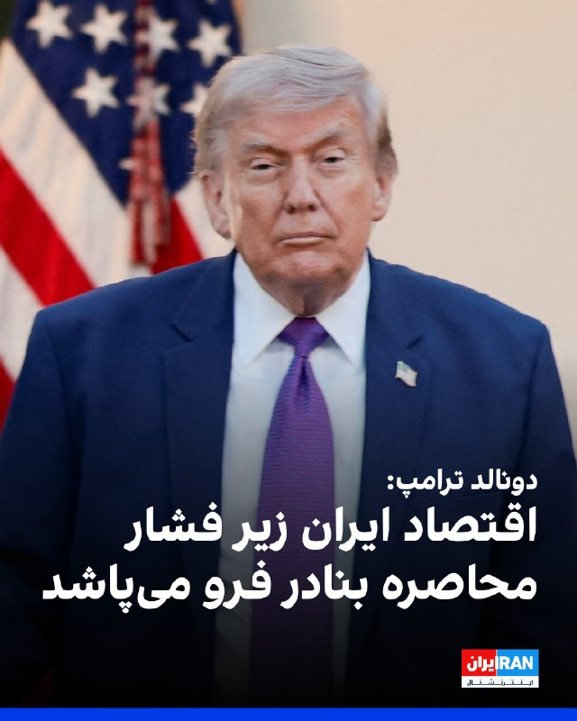

دونالد ترامپ گفت حکومت ایران با انزاویی روبه‌روست که آن را از منابع درآمدش محروم می‌کند و انتظار می‌رود اقتصاد ایران زیر فشارهای ناشی از محاصره بندرها دچار فروپاشی شود.

او افزود: «این درگیری بدون نیاز به شتاب‌زدگی حل‌وفصل خواهد شد و جمهوری اسلامی با انزوایی روبه‌رو است که آن را از منابع درآمدی محروم می‌کند.»

دونالد ترامپ درباره اورانیوم غنی‌شده در ایران گفت مقام‌های جمهوری اسلامی به او گفته‌اند قرار است آنچه او «گردوغبار هسته‌ای» می‌نامد در اختیار آمریکا قرار گیرد، اما بعدا نظرشان را تغییر داده‌اند. او تاکید کرد در نهایت این مواد را به دست خواهند آورد و موضوع را جمع‌وجور می‌کنند.
https://iranintl.com/202605128362

## IranIntlTV — post 336827

  <a href="https://t.me/IranintlTV/336827" target="_blank">📎 Download file</a>

🎧نسخه صوتی دومینو: ایرانیان در میانه اعدام و جنگ
@iranintlTV

## IranIntlTV — post 336826

  

دونالد ترامپ در گفت‌وگو با برنامه رادیویی «سید رازبرگ» گفت: انتظار داریم اقتصاد ایران زیر فشارهای ناشی از محاصره بنادرش فرو بپاشد.
او افزود این درگیری بدون نیاز به شتاب‌زدگی حل‌وفصل خواهد شد و جمهوری اسلامی با انزوایی روبه‌رو است که آن را از منابع درآمدی محروم می‌کند.
ترامپ گفت ایالات متحده در حال انجام ارتباطات مستقیم با مقام‌های تهران است و برای رسیدن به توافق عجله‌ای ندارد و او اطمینان دارد که تهران غنی‌سازی اورانیوم را به‌طور کامل متوقف خواهد کرد.
https://iranintl.com/202605127397

## IranIntlTV — post 336825

  <a href="telegram/content/IranIntlTV_336825_1778600543.mp4" target="_blank">🎬 Download video</a>

ناتو از ابتکار فرانسه و بریتانیا برای گردهمایی بیش از ۴۰ کشور به‌منظور آماده‌سازی فعالیت‌ها در نزدیکی تنگه هرمز استقبال کرد. مارک روته گفت این اقدامات نه در داخل تنگه، بلکه در اطراف آن انجام خواهد شد و اروپایی‌ها در حال پاسخ به درخواست رییس‌جمهوری آمریکا هستند.
گفت‌وگو با علی صدرزاده، تحلیل‌گر مسایل خاورمیانه
@iranintltv

## IranIntlTV — post 336824

🔻ترامپ و سفر چین؛ دیپلماسی در سایه بحران

🖋تحلیل - نعیمه دوستدار

مذاکره نیست و ما اینه که پیام کتبی دریافت شد، این به معنی مذاکره نیست و ما تا الان که دارم با شما صحبت می‌کنم هنوز جوابی ندادیم داریم بررسی می‌کنیم، ممکنه مثلا جوابی رو بدیم اما تا الان، علیرغم ادعایی که شده ایران مثلا موافقت کرده درباره هسته‌ای اینجور، درباره هرمز اینجور چنین چیزی نیست. حتی یک خبری هم داشتیم که منابع آگاه تکذیب کردن خبر عکسیس رو بله یعنی پیامی از طریق واسطه پاکستانی آمریکایی‌ها دادن به ما و ما الان در حال بررسی هستیم اینه که پیام کتبی دریافت شد، این به معنی مذاکرات نیست.

قرار است دونالد ترامپ در نخستین سفر یک رییس‌جمهوری آمریکا به چین در نزدیک به یک دهه گذشته، چهارشنبه ۲۳ اردیبهشت وارد پکن شود. شی جین‌پینگ، رییس‌جمهوری چین، میزبان ترامپ خواهد بود. این سفر در سایه «جنگ ایران» و بحران تنگه هرمز، جنگ تعرفه‌‌ها و تنش بر سر تایوان، انجام می‌شود.

ترامپ سال‌هاست تمرکز ویژه‌ای بر چین دارد. او که دست‌کم از اوایل دهه ۲۰۱۰ استدلال می‌کرد پکن از طریق تجارت «در حال سوءاستفاده» از ایالات متحده است، در دوره نخست ریاست‌جمهوری خود جنگ تجاری گسترده‌ای را آغاز کرد، بر صدها میلیارد دلار از واردات چین تعرفه وضع کرد و نهادهای دولتی آمریکا را به سمت برخورد با پکن به‌عنوان یک «رقیب راهبردی» سوق داد.

این دوره با تشدید مکرر تعرفه‌ها و شکل‌گیری چارچوبی وسیع‌تر از «رقابت» در حوزه‌های نظامی، فناوری و اقتصادی همراه بود.

در دوره دوم ریاست‌جمهوری او، روابط دو کشور میان تقابل و همکاری تاکتیکی در نوسان بوده است. ترامپ دوباره فشار تعرفه‌ای را آغاز کرد و در مقطعی برخی تعرفه‌ها را تا ۱۴۰ درصد افزایش داد. اقدامی که با واکنش تلافی‌جویانه چین روبه‌رو شد.

هنگامی که این سیاست نتوانست امتیازهای عمده‌ای از پکن بگیرد، ترامپ لحن خود را تغییر داد و بر شراکت «جی۲» (Group of Two) تاکید کرد، شخصا به تمجید از شی پرداخت و در نشست اکتبر ۲۰۲۵ در بوسان با یک آتش‌بس یک‌ساله در جنگ تجاری موافقت کرد.

در این مرحله، او نگرانی‌های مربوط به حقوق بشر در سین‌کیانگ، هنگ‌کنگ و تبت را کم‌اهمیت جلوه داد و در عین حال، با وجود تایید فروش تسلیحات به تایوان، لحن خود را درباره این جزیره نیز تعدیل کرد تا از تحریک بیش از حد پکن جلوگیری کند.

سفر روسای‌جمهوری آمریکا به چین

سفر روسای‌جمهوری آمریکا به چین از دهه ۱۹۷۰ به یکی از ابزارهای مهم دیپلماتیک تبدیل شده است.

سفر ریچارد نیکسون در سال ۱۹۷۲ نمونه کلاسیک این روند به شمار می‌رود. رویدادی که به احیای روابط دو کشور پس از دهه‌ها خصومت دوران جنگ سرد کمک کرد و به صدور «بیانیه شانگهای» انجامید.

جرالد فورد در سال ۱۹۷۵ به چین رفت و تعهدات آمریکا در چارچوب آن توافق را تایید کرد.

پس از برقراری کامل روابط دیپلماتیک در سال ۱۹۷۹، روسای‌جمهوری بعدی آمریکا از سفر به چین برای مدیریت همکاری‌ها و بحران‌ها استفاده کردند.

رونالد ریگان در سال ۱۹۸۴ راهی چین شد و ضمن امضای بیانیه‌ای دیگر، بر توسعه روابطی «سازنده» تاکید کرد؛ هر‌چند همچنان از کمونیسم انتقاد می‌کرد.

جورج اچ دبلیو بوش در سال ۱۹۸۹ به چین سفر کرد و بر سیاست «چین واحد» تاکید داشت.

بیل کلینتون در سفر سال ۱۹۹۸ خود، در سخنرانی‌هایی در شهرهای مختلف چین از جمله پکن، بر تعامل، تجارت و حقوق بشر تمرکز کرد.

جورج بوش پسر و باراک اوباما چندین بار به چین سفر کردند. سفرهایی که اغلب با موضوعات اقتصادی، گفت‌وگوهای امنیتی و رویدادهای مهمی مانند المپیک ۲۰۰۸ پکن و نشست آپک ۲۰۱۴ پیوند داشت.

خود ترامپ نیز در سال ۲۰۱۷ به چین رفت. زمانی که روابط دو کشور هنوز نسبتا دوستانه بود و تمرکز اصلی بر مذاکرات تجاری و تشریفات گسترده میزبانی از سوی شی جین‌پینگ قرار داشت.
چرا ترامپ به چین سفر می‌کند؟

سفر کنونی ترامپ نخستین سفر یک رییس‌جمهوری آمریکا به چین در نزدیک به یک دهه گذشته است و اندکی پس از آتش‌بس تعرفه‌ای سال ۲۰۲۵ انجام می‌شود.

🔗 ادامه این تحلیل را اینجا بخوانید
@iranintltv

## IranIntlTV — post 336823

  

پیت هگست، وزیر جنگ آمریکا، گفت که این کشور برای تشدید، عقب‌نشینی یا جابه‌جایی نیروها برنامه‌ریزی کرده است، اما جزئیات ماموریت جلوگیری از دستیابی جمهوری اسلامی به بمب هسته‌ای را علنی نمی‌کند.
پیش‌تر اکسیوس به نقل از سه منبع آمریکایی گزارش داد که دونالد ترامپ روز دوشنبه با تیم امنیت ملی خود دیدار می‌کند تا درباره مسیر پیش رو در جنگ با جمهوری اسلامی، از جمله احتمال ازسرگیری اقدام نظامی، گفت‌وگو کند.
https://iranintl.com/202605127244

## IranIntlTV — post 336822

🔻کوچ اجباری نیروهای متخصص به رانندگی در اسنپ

پیام‌های رسیده به ایران‌اینترنشنال نشان می‌دهند با تعطیلی کارخانه‌ها، واحدهای تولیدی و کسب‌وکارهای کوچک، بسیاری از نیروهای فنی متخصص و تحصیل‌کرده برای تامین هزینه‌های زندگی به رانندگی در تاکسی‌های اینترنتی روی آورده‌اند.

در هفته‌های اخیر موج گسترده‌ای از اخراج، تعدیل نیرو، بیکار‌سازی و تغییر اجباری در طیف گسترده‌ای از شغل‌ها شکل گرفته است.

هزاران شهروند از صاحبان فروشگاه‌های مجازی و حقیقی تا کارکنان پتروشیمی و صنایع فولاد، شغل خود را از دست داده‌اند و با از بین رفتن منبع درآمد، ناچار به روی آوردن به مشاغل جایگزین و موقتی شده‌اند.
مسافرکشی هم دیگر صرف نمی‌کند

بر اساس گزارش‌ها، رانندگی در تاکسی‌های اینترنتی به آخرین راه بقا برای بسیاری از خانواده‌ها بدل شده است.

یک مخاطب در پیامی نوشت حقوق ۳۰ میلیون تومانی پدر بازنشسته‌اش پس از۳۰ سال کار کردن، کفاف زندگی را نمی‌دهد و این پدر سالخورده ناچار است برای کسب درآمد بیشتر از صبح تا شب در اسنپ مسافرکشی کند.

پیش‌تر نیز پیام‌هایی به ایران‌اینترنشنال رسیده بود که نشان می‌دادند حقوق، سنوات و حق بیمه بازنشستگان به‌ویژه از سوی تامین اجتماعی، فولاد مبارکه و ذوب‌آهن، با تاخیر پرداخت می‌شود.

یک فرد که به‌دلیل قطع اینترنت شغلش را از دست داده است، گفت برای پرداخت وام‌هایش راننده تاکسی اینترنتی شده اما هر بار اسنپ حقوقش را واریز می‌کند، تمامی آن صرف پرداخت قسط وام می‌شود و پولی برای خرجی خانواده باقی نمی‌ماند.

زنی ساکن اصفهان نیز در پیامی گفت پس از اخراج از شرکتی که در آن کار می‌کرد، به رانندگی در اسنپ روی آورده است، اما درآمدش حتی به خرید خوراکی هم نمی‌رسد.
هر راننده اسنپ، یک نیروی متخصص

موج بیکاری پای نیروهای متخصص و دانشگاهی را هم به تاکسی‌های اینترنتی باز کرده است.

پایگاه خبری رویداد۲۴ پیش‌تر در گزارشی از اشتغال نیروهای فنی خط تولید فولاد مبارکه اصفهان به رانندگی در تاکسی‌های اینترنتی پس از حملات اسرائیل و آمریکا به این مجموعه خبر داده بود.

یک زن با اشاره به تحصیلات تکمیلی، مدارک و مهارت‌های متعدد خود، گفت سال‌ها برای رشد حرفه‌ای در شغل تخصصی‌اش زمان سپری کرده، اما با قطع دو ماهه اینترنت کسب‌وکار آنلاین او تعطیل شده و ناچار است به‌عنوان راننده در اسنپ کار کند.

به گفته او، شرکت اسنپ نرخ سفرها را به شدت کاهش داد‌ه‌ و درآمد حاصل از مسافرکشی حتی به هزینه کارواش ماشین هم نمی‌رسد، چه برسد به تعمیر آن.

پیش از این و در سال‌های اخیر نیز گزارش‌هایی درباره اشتغال نیروهای فنی متخصص و فارغ‌التحصیلان دانشگاهی در شرکت‌های تاکسی‌رانی و مشاغل غیر‌مرتبط به دلیل نبود بازار کار مناسب منتشر شده بود.

زوجی جوان که یکی از آن‌ها فوق‌لیسانس برق قدرت و دیگری فوق لیسانس معماری از دانشگاه بهشتی دارد، به ایران‌اینترنشنال گفتند پس از بیکاری، برای سیر کردن دو فرزند خردسالشان در دو شرکت تاکسی‌رانی اسنپ و تپسی مشغول به کار شده‌اند.

جوانی ۲۶ ساله و دارای مدرک دکتری هم در پیامی نوشت از سر ناچاری و پس از اخراج از محل کارش، اکنون به‌عنوان پیک در اسنپ‌فود مشغول است.

هم‌زمان با افزایش شمار رانندگان تاکسی‌های اینترنتی، اطلاعات دیگری مبنی بر آغاز موج تعدیل نیرو در زیرمجموعه‌های اسنپ نیز به دست ایران‌اینترنشنال رسیده است.

به گفته کارکنان، این شرکت ده‌ها نفر از نیروهای خود در اسنپ و اسنپ‌فود را طی هفته‌های اخیر تعدیل کرده است.

🔗وب‌سایت ایران‌اینترنشنال
@iranintltv

## IranIntlTV — post 336821

🔻آتش‌بس در آستانه فروپاشی؛ نعیم قاسم خلع سلاح حزب‌الله را رد و بر نبرد با اسرائیل تاکید کرد

هم‌زمان با ادامه درگیری‌های مرزی و عملیات ارتش اسرائیل در جنوب لبنان، نعیم قاسم، دبیرکل حزب‌الله، خلع سلاح این گروه را رد کرد و گفت آمریکا و اسرائیل به‌دنبال «سلطه بر لبنان» هستند.

قاسم سه‌شنبه ۲۲ اردیبهشت با انتشار بیانیه‌ای در آستانه مذاکرات دولت لبنان و اسرائیل، بر ادامه نبرد با اسرائیل تاکید کرد و گفت این گروه نیابتی جمهوری اسلامی خلع سلاح را نخواهد پذیرفت.

در این بیانیه کتبی آمده است: «هیچ‌کس خارج از لبنان هیچ ارتباطی با سلاح‌ها و مقاومت ندارد. این مساله داخلی لبنان است و بخشی از مذاکرات با دشمن نیست.»

قاسم خواستار توقف مذاکرات مستقیم میان دولت لبنان و اسرائیل شد و این گفت‌وگوها را «به سود اسرائیل و به معنای امتیازدهی رایگان از سوی دولت لبنان» توصیف کرد.

دبیرکل حزب‌الله با تاکید بر ضرورت انجام «مذاکرات غیرمستقیم» افزود توافق آتش‌بس میان جمهوری اسلامی و آمریکا که شامل «توقف تجاوز به لبنان» می‌شود، مهم‌ترین اهرم برای جلوگیری از حملات اسرائیل به شمار می‌رود.

قاسم همچنین تهدید کرد نیروهای حزب‌الله میدان نبرد را برای نظامیان اسرائیلی به «جهنم» تبدیل خواهند کرد.

نمایندگان اسرائیل و لبنان قرار است ۲۴ و ۲۵ اردیبهشت برای دور تازه مذاکرات در واشینگتن دیدار کنند.

شبکه کان اسرائیل پیش‌تر گزارش داد در این نشست، موضوع خلع سلاح حزب‌الله و ترسیم مرز میان دو کشور بررسی خواهد شد.

بر اساس این گزارش، حزب‌الله تسلیحاتش را پایه قدرت نظامی، راهبردی و سیاسی خود در لبنان می‌داند و به‌دلیل نگرانی از احتمال از دست دادن پشتیبانی حکومت ایران، به خلع سلاح تن نمی‌دهد.
تداوم آتش‌باری متقابل حزب‌الله و اسرائیل

تنش‌ها میان اسرائیل و حزب‌الله همچنان ادامه دارد و دو طرف یکدیگر را به نقض آتش‌بس متهم می‌کنند.

وب‌سایت تایمز اسرائیل ۲۲ اردیبهشت از حمله پهپادی حزب‌الله به نیروهای اسرائیلی مستقر در جنوب لبنان خبر داد.

بر اساس این گزارش، ارتش اسرائیل چند پهپاد انفجاری حزب‌الله را رهگیری و سرنگون کرد و این حملات تلفات یا خسارات جانی به همراه نداشت.

شب گذشته نیز حزب‌الله چند راکت به سوی نظامیان اسرائیلی در جنوب لبنان شلیک کرد.

این پرتابه‌ها در مناطق باز و غیرمسکونی فرود آمدند و خسارتی گزارش نشد.

در سوی دیگر، ارتش اسرائیل ۲۲ اردیبهشت اعلام کرد از زمان برقراری آتش‌بس، بیش از ۱۱۰۰ موضع حزب‌الله را هدف قرار داده و بیش از ۳۵۰ نفر از نیروهای این گروه نیابتی جمهوری اسلامی را در جنوب لبنان از پا درآورده است.

ارتش اسرائیل افزود حملات به ساختمان‌های نظامی، انبارهای سلاح و پرتابگرهای حزب‌الله ادامه دارد و عملیات طبق دستور مقام‌های سیاسی اسرائیل انجام می‌گیرد.

روزنامه هاآرتص پیش‌تر گزارش داده بود خلع سلاح حزب‌الله همچنان گره اصلی در مذاکرات میان لبنان و اسرائیل به شمار می‌رود.

مقام‌های جمهوری اسلامی، به‌عنوان پشتیبان اصلی حزب‌الله، تاکنون به‌طور جدی با خلع سلاح این گروه مخالفت کرده‌اند.

تامین مالی و تسلیحاتی گروه‌های نیابتی حکومت ایران در منطقه در شرایطی ادامه دارد که مردم ایران در سال‌های اخیر با مشکلات متعدد اقتصادی، از جمله تورم افسارگسیخته، افزایش نرخ ارز و بیکاری، دست‌به‌گریبان بوده‌اند.
عملیات ویژه ارتش اسرائیل با عبور از رود لیتانی

ارتش اسرائیل ۲۲ اردیبهشت اعلام کرد نیروهای این کشور به‌تازگی در جریان عملیاتی علیه حزب‌الله، از رودخانه لیتانی در حومه شهر زوطر الشرقیه در جنوب لبنان عبور کردند. منطقه‌ای که حدود ۱۰ کیلومتر با مرز اسرائیل فاصله دارد.

ارتش اسرائیل اعلام کرد نیروهای تیپ گولانی تحت فرماندهی لشکر ۳۶، عملیات ویژه «پاکسازی» در منطقه را به پایان رسانده و کنترل عملیاتی آن را به دست آورده‌اند.

بر اساس بیانیه ارتش اسرائیل، در جریان این عملیات، مواضع حزب‌الله، تونل‌ها و مسیرهای زیرزمینی، انبارهای تسلیحاتی و پرتابگرهای موشکی شناسایی و منهدم شد. همچنین نیروی هوایی اسرائیل بیش از ۱۰۰ هدف رزمی را «در حمایت از نیروهای مستقر در منطقه» مورد حمله قرار داد.

در جریان این عملیات «پاکسازی»، ده‌ها عضو مسلح حزب‌الله «در درگیری‌های رو در رو و با پشتیبانی هوایی» کشته شدند.

🔗وب‌سایت ایران‌اینترنشنال
@iranintltv

## IranIntlTV — post 336820

  <a href="telegram/content/IranIntlTV_336820_1778600544.mp4" target="_blank">🎬 Download video</a>

معاون وزیر خارجه نروژ، آندریاس کراویک، روز سه‌شنبه با عباس عراقچی، وزیر خارجه ایران، دیدار کرد. دو طرف در این دیدار درباره روابط دوجانبه و تحولات منطقه‌ای، از جمله حملات آمریکا و اسرائیل به ایران، گفت‌وگو کردند.
@iranintltv

## Shin_Persian — post 5968

  

Shin ✓ @hey_itsmyturn Tue, 12 May 2026 14:29:01 UTC #Kuwait 🇰🇼 #Iran Kuwait Thwarts IRGC Infiltration & Hostile Plot Kuwait’s Ministry of Interior has released chilling details regarding the 4 infiltrators captured earlier this month. Interrogations confirm…

## Shin_Persian — post 5967

Shin ✓ @hey_itsmyturn
Tue, 12 May 2026 14:29:01 UTC

#Kuwait 🇰🇼 #Iran
Kuwait Thwarts IRGC Infiltration & Hostile Plot

Kuwait’s Ministry of Interior has released chilling details regarding the 4 infiltrators captured earlier this month. Interrogations confirm they are members of IRGC sent to carry out "hostile acts" within the country.

The Arrested IRGC Members:
Naval Colonel: Amir Hussein Abd Muhammad Zarai
Naval Colonel: Abdul Samad Yadollah Qanawati
Naval Captain: Ahmed Jamshid Ghulam Reza Zulfiqari
First Lieutenant: Muhammad Hussein Sohrab Foroughi Rad

Two others, Captain Mansour Qambari and boat pilot Abdulali Siamari, fled the scene during the initial skirmish

The incident has happened Bubiyan Island. The group used a rented fishing boat to enter Kuwaiti territorial waters illegally.

Upon discovery, the group opened fire on Kuwaiti Armed Forces. One Kuwaiti soldier was injured in the line of duty before the 4 suspects were neutralized and detained.

Source: https://24.ae/article/957997/

فارسی

#کوییت 🇰🇼 #ایران
کوییت نفوذ سپاه پاسداران (سپاه پاسداران انقلاب اسلامی) و توطئه‌ای خصمانه را خنثی کرد

وزارت کشور کوییت جزئیات تکان‌دهنده‌ای را در مورد ۴ نفوذی که اوایل این ماه دستگیر شده بودند، منتشر کرده است. بازجویی‌ها تأیید می‌کند که آن‌ها اعضای سپاه پاسداران هستند که برای انجام «اعمال خصمانه» در داخل کشور اعزام شده بودند.

اعضای دستگیر شده سپاه پاسداران:
سرهنگ دریایی: امیرحسین عبدالمحمد زارعی
سرهنگ دریایی: عبدالصمد یدالله قنواتی
ناخدا: احمد جمشید غلامرضا ذوالفقاری
ستوان یکم: محمدحسین سهراب فروغی راد

دو نفر دیگر، ناخدا منصور قنبری و هدایت‌کننده قایق، عبدالعلی سیامری، در جریان درگیری اولیه از صحنه گریختند.

این حادثه در جزیره بوبیان رخ داده است. این گروه از یک قایق ماهیگیری اجاره‌ای برای ورود غیرقانونی به آب‌های سرزمینی کوییت استفاده کرده بودند.

پس از شناسایی، این گروه به سوی نیروهای مسلح کوییت آتش گشودند. یک سرباز کویتی در حین انجام وظیفه مجروح شد و پس از آن، ۴ مظنون مهار و بازداشت شدند.

منبع: https://24.ae/article/957997/

𝕏 · @shin_persian

## Shin_Persian — post 5966

📦 mhrv-rs v1.9.23 released

• Fix: stream range-parallel downloads larger than Apps Script's 50 MiB cap (#1042 + PR #1085).

Files (Android APKs, Windows, macOS, Linux, OpenWRT) on the files channel:

👉 v1.9.23 — all files with SHA-256

Channel:
https://t.me/mhrv_rs
or: https://t.me/+R1OyoHX2boA1ZDgx

#v1923

## Shin_Persian — post 5965

Shin ✓ @hey_itsmyturn
Tue, 12 May 2026 12:54:39 UTC

State-owned Mehr News:
Islamic Regime files complaint against US at The Hague over "military aggression on nuclear facilities", economic sanctions, and "threat of force" during 12-day conflict. Case A-34 registered under 1981 Algiers Accords.

[😂]

فارسی

خبرگزاری دولتی مهر:
رژیم اسلامی شکایتی را علیه ایالات متحده در لاهه به دلیل «تجاوز نظامی به تاسیسات هسته‌ای»، تحریم‌های اقتصادی و «تهدید به استفاده از زور» در طول درگیری ۱۲ روزه تنظیم کرد. پرونده A-34 تحت بیانیه‌های الجزایر ۱۹۸۱ ثبت شده است.

[😂]

𝕏 · @shin_persian

## ManotoTV — post 105356

  <a href="telegram/content/ManotoTV_105356_1778600546.mp4" target="_blank">🎬 Download video</a>

تماسی از ایران؛ «می‌گفت تو این شرایط، به دور و برمون نگاه کنیم و دستِ همدیگه رو بگیریم…
تو هر خانواده و آشنایی یکی هست که بی‌صدا به کمک نیاز داره.»

## ManotoTV — post 105355

  <a href="telegram/content/ManotoTV_105355_1778600547.mp4" target="_blank">🎬 Download video</a>

دونالد ترامپ، رئیس‌جمهور آمریکا، با وجود توقف مذاکرات با جمهوری‌اسلامی، در یک گفتگو، اعلام کرده تهران صددرصد غنی‌سازی اورانیوم و هرگونه تلاش برای ساخت سلاح هسته‌ای را متوقف خواهد کرد.
ترامپ در گفت‌وگو با رادیوی WABC گفت شخصاً با مقام‌های جمهوری‌اسلامی در تماس بوده و افزود: «آن‌ها گفتند ما غبار هسته‌ای را تحویل خواهیم گرفت.»
او همچنین تأکید کرد آمریکا برای رسیدن به توافق عجله‌ای ندارد و گفت: «ما محاصره را در اختیار داریم.»

## ManotoTV — post 105354

  <a href="telegram/content/ManotoTV_105354_1778600548.mp4" target="_blank">🎬 Download video</a>

تماسی از تجربه‌اش با بهزیستی
می‌گفت برای بیمه و تأیید مشکلش هزار تا ایراد گرفتن
اما وقتی پای کمک رسید، گفتن هیچ مشکلی نداری

## ManotoTV — post 105353

  <a href="telegram/content/ManotoTV_105353_1778600549.mp4" target="_blank">🎬 Download video</a>

در جلسه استماع کنگره آمریکا، مقام‌های ارشد پنتاگون اعلام کردند هزینه تسلیحات و تجهیزات مصرف‌شده آمریکا در جنگ با ایران تاکنون به حدود ۲۴ میلیارد دلار رسیده است.
پیت هگست، وزیر دفاع آمریکا، به همراه رئیس ستاد مشترک ارتش و مقام مالی وزارت جنگ در این جلسه حضور داشتند. به گفته جولز هرست، این رقم شامل مهمات، موشک‌ها و سایر تجهیزات نظامی استفاده‌شده در جنگ است.
پنتاگون ماه گذشته نیز اعلام کرده بود مجموع هزینه‌های جنگ با ایران تاکنون به ۲۹ میلیارد دلار رسیده است.

## ManotoTV — post 105352

  <a href="telegram/content/ManotoTV_105352_1778600549.mp4" target="_blank">🎬 Download video</a>

ابراهیم رضایی، سخنگوی کمیسیون امنیت ملی و سیاست خارجی مجلس شورای اسلامی در شبکه اکس تهدید کرده، غنی سازی ۹۰ درصد به عنوان یکی از گزینه‌های جمهوری‌اسلامی در صورت حمله مجدد، بررسی می‌شود.

## ManotoTV — post 105351

  <a href="telegram/content/ManotoTV_105351_1778600550.mp4" target="_blank">🎬 Download video</a>

متاثر از پیچیده‌تر شدن سرنوشت مذاکرات جمهوری‌اسلامی و آمریکا، قیمت جهانی نفت، بیش از ۳ درصد افزایش یافت.
بهای نفت برنت به حدود ۱۰۸ دلار و نفت وست‌تگزاس آمریکا به بیش از ۱۰۱ دلار در هر بشکه رسید. تحلیلگران می‌گویند رد پیشنهادهای دو طرف، نگرانی‌ها درباره اختلال در عرضه نفت را دوباره افزایش داده است.
مدیرعامل آرامکوی عربستان هشدار داد هرگونه اختلال در صادرات نفت از تنگه هرمز می‌تواند بازگشت ثبات به بازار را تا سال ۲۰۲۷ به تعویق بیندازد.
کارشناسان همچنین گفته‌اند در صورت توافق واقعی میان تهران و واشنگتن، قیمت نفت ممکن است ۸ تا ۱۲ دلار کاهش پیدا کند، اما تشدید تنش‌ها می‌تواند قیمت نفت برنت را دوباره به بالای ۱۱۵ دلار برساند.

## ManotoTV — post 105350

  <a href="telegram/content/ManotoTV_105350_1778600550.mp4" target="_blank">🎬 Download video</a>

دونالد ترامپ در پیامی در شبکه اجتماعی تروث سوشال گفت کوبا از آمریکا درخواست کمک کرده و واشینگتن با هاوانا گفت‌وگو خواهد کرد.

ترامپ در این پیام نوشت هیچ جمهوری‌خواهی تاکنون درباره کوبا با او صحبت نکرده و این کشور را «شکست‌خورده» توصیف کرد که به گفته او تنها در مسیر «سقوط» حرکت می‌کند.

او افزود: «کوبا درخواست کمک کرده و ما گفت‌وگو خواهیم کرد.» ترامپ در پایان این پیام نوشت همزمان عازم چین است.

## ManotoTV — post 105349

  <a href="telegram/content/ManotoTV_105349_1778600551.mp4" target="_blank">🎬 Download video</a>

«حکومت بقای خود را در طناب دار می‌بیند»

## ManotoTV — post 105348

  <a href="telegram/content/ManotoTV_105348_1778600552.mp4" target="_blank">🎬 Download video</a>

مارک روته، دبیرکل ناتو، اعلام کرد موضوع جمهوری‌اسلامی و نحوه کمک کشورهای اروپایی برای مدیریت وضعیت تنگه هرمز، محور اصلی گفت‌وگوهای کنونی این ائتلاف است.
روته در نشست خبری در مونته‌نگرو گفت کشورهای عضو در حال بررسی راه‌هایی هستند تا متحدان اروپایی بتوانند در شرایط مرتبط با تنگه هرمز کمک کنند.
او با اشاره به افزایش بودجه دفاعی کشورهای اروپایی و کانادا، تأکید کرد نسبت به آینده ناتو «بسیار خوش‌بین» است.

## ManotoTV — post 105347

  <a href="telegram/content/ManotoTV_105347_1778600553.mp4" target="_blank">🎬 Download video</a>

دکتر حمید گیلوری فعال سیاسی و عضو حزب ایران نوین در گردهمایی ایرانیان روبروی دادگاه لاهه در هلند گفت: «اروپا نباید با جمهوری اسلامی مماشات کند».

## ManotoTV — post 105346

  <a href="telegram/content/ManotoTV_105346_1778600554.mp4" target="_blank">🎬 Download video</a>

وزارت خارجه امارات متحده عربی در بیانیه‌ای نفوذ اعضایی از سپاه از سوی نیروی دریایی جمهوری اسلامی به جزیره بوبیان کویت را محکوم کرد و آن را اقدامی در چارچوب «طرحی تروریستی» برای انجام عملیات خصمانه خواند.

در این بیانیه آمده است شیخ عبدالله بن زاید آل نهیان، وزیر خارجه امارات، در پیامی به عبدالله علی الیحیا، وزیر خارجه کویت، همبستگی کامل ابوظبی را با کویت اعلام کرده است.

بوبیان دومین جزیره بزرگ خلیج فارس بعد از جزیره قشم است.

## ManotoTV — post 105345

  <a href="telegram/content/ManotoTV_105345_1778600555.mp4" target="_blank">🎬 Download video</a>

دولت بریتانیا اعلام کرد از آوریل ۲۰۲۶، میزان کمک‌هزینه هفتگی برای «همسران اضافی» در ازدواج‌های چندهمسریِ ثبت‌شده در خارج از کشور، به ۱۲۵ پوند و ۲۵ پنس افزایش یافته است.
این مبلغ نسبت به سال گذشته ۴.۸ درصد افزایش داشته و شامل افرادی می‌شود که به سن بازنشستگی رسیده و از مزایایی مانند «پنشـن کردیت» یا کمک‌هزینه مسکن استفاده می‌کنند.
چندهمسری در بریتانیا غیرقانونی است، اما برخی ازدواج‌های چندهمسری که به‌طور قانونی در خارج از کشور ثبت شده‌اند، برای دریافت بعضی مزایای رفاهی به رسمیت شناخته می‌شوند.
دولت بریتانیا تأکید کرده «یونیورسال کردیت» شامل این نوع خانوارها نمی‌شود و قوانین مهاجرتی نیز اجازه حمایت برای ورود همسر دوم را نمی‌دهد، اگر ازدواج اول همچنان پابرجا باشد.

## FarsiVOA — post 217542

دونالد ترامپ، رئیس جمهوری آمریکا، قرار است این هفته در پکن با شی جین‌پینگ، رئیس جمهوری چین، دیدار کند. پیش‌بینی می‌شود پرونده‌های امنیتی، اقتصادی، و فناوری، جنگ و برنامه هسته‌ای جمهوری اسلامی، و هوش مصنوعی موضوعاتی باشند که در این دیدار مورد بحث و تبادل نظر قرار بگیرد.

## FarsiVOA — post 217541

  <a href="telegram/content/FarsiVOA_217541_1778600555.mp4" target="_blank">🎬 Download video</a>

ارتش اسرائیل اعلام کرد در ۲۴ ساعت گذشته حدود ۴۵ زیرساخت گروه حزب‌الله را در جنوب لبنان هدف قرار داده است. از جمله این زیرساخت‌ها، «مراکز فرماندهی، ایستگاه‌های دیده‌بانی، نقاط تجمع و ساختمان‌های نظامی است که به گفته ارتش اسرائیل نیروهای حزب‌الله «از طریق آنها، اقدامات تروریستی علیه نیروهای ارتش و کشور اسرائیل را پیش می‌بردند.»

## FarsiVOA — post 217540

🔺بازداشت چهار عضو سپاه در کویت؛ بحرین یک زن را به جرم همکاری با رژیم ایران به حبس ابد محکوم کرد

▪️همزمان با ادامه فعالیت‌های مخرب جمهوری اسلامی علیه کشورهای منطقه، کویت از بازداشت چهار عضو سپاه پاسداران که قصد داشتند وارد این کشور شوند، خبر داد. در بحرین نیز یک زن به اتهام همکاری با سپاه پاسداران به حبس ابد محکوم کرد.

⬇️ بیشتر بخوانید:

https://ir.voanews.com/a/irgc-iran-kuwait-emirates-bahrain-proxy/8149179.html/?nocach=1

## FarsiVOA — post 217539

قطع گسترده اینترنت در ایران وارد هفتاد و چهارمین روز شده و مدت این اختلال از هزار و ۷۵۲ ساعت گذشته است؛ محدودیتی که همزمان با بالا گرفتن جنجال «اینترنت پرو» و «خط‌های سفید»، موضوع دسترسی تبعیض‌آمیز به اینترنت را به یکی از محورهای اختلاف درون ساختار رسمی جمهوری اسلامی تبدیل کرده است.

نت‌بلاکس، نهاد ناظر بر دسترسی به اینترنت، اعلام کرده است این خاموشی اینترنتی از ۲۸ فوریه ۲۰۲۶ آغاز شده و همچنان بخش بزرگی از کاربران داخل ایران را از دسترسی آزاد به اینترنت جهانی محروم کرده است. این نهاد می‌گوید دسترسی آزاد به اینترنت، حقی بنیادین است که بسیاری از آزادی‌های دیگر بر آن تکیه دارند و محروم کردن شهروندان از آن، توان جامعه برای ثبت، پیگیری و مقابله با نقض حقوق اساسی را محدود می‌کند.

گزارش کامل را در وب‌سایت صدای آمریکا بخوانید.

@FarsiVOA

## FarsiVOA — post 217538

  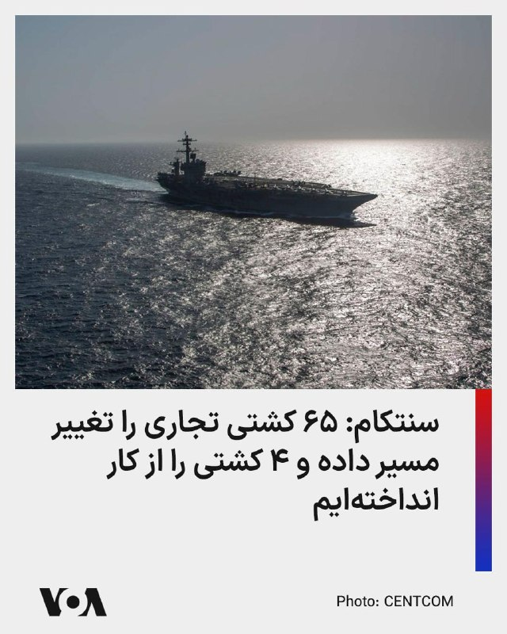

ستاد فرماندهی ارتش ایالات متحده آمریکا، روز سه‌شنبه ۲۲ اردیبهشت در شبکه اجتماعی ایکس با انتشار عکسی از ناو هواپیمابر آبراهام لینکلن (سی‌وی‌ان ۷۲) نوشت: « نیروهای سنتکام ۶۵ کشتی تجاری را تغییر مسیر داده و ۴ کشتی را از کار انداخته‌اند.»

در ادامه سنتکام افزوده است که ناو هواپیمابر آبراهام لینکلن به عملیات خود در دریای عرب، از جمله اعمال محاصره دریایی ایالات متحده علیه ایران، ادامه می‌دهد.

## FarsiVOA — post 217537

انتقال پنهانی هواپیماهای جمهوری اسلامی به پاکستان و افغانستان؛ کویت چند عضو سپاه را بازداشت کرد

## FarsiVOA — post 217536

🔺پرزیدنت ترامپ: رژیم ایران بسیار ضعیف شده و «محاصره» دریایی منابع مالی آنها را محدود کرده است

▪️پرریدنت ترامپ با اشاره به موثر بودن محاصره دریایی بر محدود کردن دسترسی رژیم ایران به منابع مالی، بار دیگر تاکید کرد که آمریکا اجازه نخواهد داد رژیم ایران به سلاح هسته‌ای دست یابد.

⬇️ بیشتر بخوانید:

https://ir.voanews.com/a/president-trump-iran/8149184.html/?nocach=1

## FarsiVOA — post 217535

  

دونالد ترامپ، رئیس ‌جمهوری آمریکا، در پیامی در شبکه اجتماعی تروت سوشال اعلام کرد که مشتاق سفر به چین است.

ترامپ در این پیام، چین را «کشوری شگفت‌انگیز» توصیف کرد و از شی جین‌پینگ به عنوان رهبری یاد کرد که به گفته او مورد احترام همگان است.

او افزود که این سفر می‌تواند به دستاوردهای مهمی برای هر دو کشور منجر شود.

@FarsiVOA

## FarsiVOA — post 217534

  <a href="telegram/content/FarsiVOA_217534_1778600557.mp4" target="_blank">🎬 Download video</a>

ارتش اسرائیل اعلام کرد امروز ۲۲ اردیبهشت، بعد از اینکه در تلاشی ناموفق، یک موشک کوچک زمین به هوا به سمت یک هواپیمای ارتش شلیک شد، نیروی هوایی فرد مظنون را که بلافاصله پس از شلیک با موتورسیکلت فرار کرده بود، هدف قرار داد.

علاوه بر این، نیروی هوایی اهداف مشکوکی را که در منطقه عملیات نیروهای ارتش اسرائیل در جنوب لبنان شناسایی شده بودند، رهگیری کرد.

## FarsiVOA — post 217533

در میدان پرسیدیم: امروز قدرت سیاسی در ایران دست کیست؟ چه کسی ایران را اداره می‌کند؟ خامنه‌ای دوم که تا به حال نه دیده و نه شنیده شده؟ سپاه پاسداران؟ مجموعه‌ای از حلقه‌ها و چهره‌های واسط یا هر کس که زورش بر دیگران می‌چربد؟

## FarsiVOA — post 217532

  <a href="telegram/content/FarsiVOA_217532_1778600558.mp4" target="_blank">🎬 Download video</a>

ارتش اسرائیل اعلام کرد از ابتدای آتش‌بس نیروی هوایی به بیش از ۱۱۰۰ هدف متعلق به حزب‌الله حمله کرده و بیش از ۳۵۰ تروریست را در جنوب لبنان از پای درآورده است.

اهداف مورد حمله شامل ساختمان‌هایی که برای اهداف نظامی حزب‌الله استفاده می‌شدند، انبارهای سلاح، پرتابگرهای آماده و مسلح به موشک و زیرساخت‌های دیگر اعلام شده است.

## FarsiVOA — post 217531

در داده‌نمای این برنامه از میدان برای بازگشایی بحث مهمانان درارتباط با اینکه «قدرت سیاسی در ایران دست کیست؟» به نقش کلیدی تعدادی از مطرح‌ترین چهره‌های باقیمانده در ساختار قدرت، در نظام جمهوری اسلامی اشاره کرده‌ایم

## FarsiVOA — post 217530

  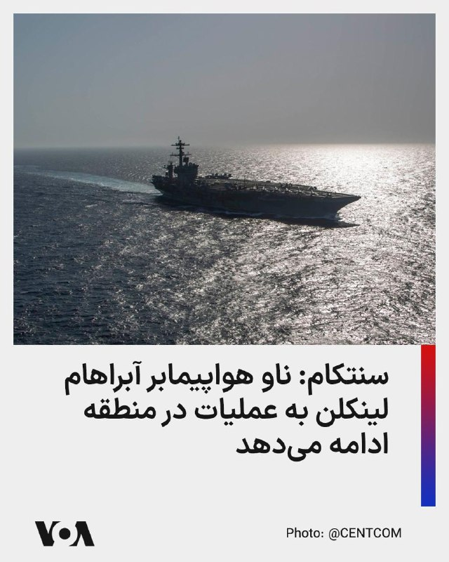

فرماندهی مرکزی ایالات متحده، سنتکام، اعلام کرد ناو هواپیمابر «یو‌اس‌اس آبراهام لینکلن» به عملیات خود در دریای عرب ادامه می‌دهد.

به گفته سنتکام، این عملیات شامل اجرای محاصره دریایی علیه جمهوری اسلامی ایران است.

سنتکام همچنین اعلام کرد نیروهای آمریکایی تاکنون مسیر ۶۵ کشتی تجاری را تغییر داده و چهار شناور را برای اطمینان از اجرای این اقدامات از کار انداخته‌اند.

@FarsiVOA

## FarsiVOA — post 217529

مهدیه گلرو معتقد است گروه‌های اپوزیسیون که سیاست فشار حداکثری بر مردم در داخل ایران را دنبال می‌کنند فرقی با حجتیه که می‌گوید ظلم باید به نهایت برسد تا امام زمان ظهور کند ندارند! فرج سرکوهی نیز اپوزیسیونی را که دنبال رهبر برای معترضان داخل کشور باشد معتبر نمی‌داند

## DW_Farsi — post 124615

  

🔶 سفیر آمریکا در اسرائیل استفاده امارات از سامانه "گنبد آهنین" را تایید کرد

مایک هاکبی، سفیر ایالات متحده آمریکا در اسرائیل با بیان این که "امارات متحده عربی، از توافق‌نامه‌های ابراهیم و عادی‌سازی روابط با اسرائیل، سود برده است" از به‌کار‌گیری سامانه دفاع موشکی "گنبد آهنین" اسرائیل در امارات برای مقابله با موشک‌های پرتاب شده از ایران در جریان جنگ خبر داد.

هاکبی با اشاره به پیامدهای حاصل از پیمان ابراهیم برای امارات گفت: «فقط نگاهی به مزایای آن بیندازید. اسرائیل همین حالا سامانه‌های گنبد آهنین و نیروهایی را برای کمک به بهره‌برداری از آن‌ها برایشان فرستاده است.»

امارات متحده عربی در چارچوب توافق‌نامه‌های ابراهیم که در سال ۲۰۲۰ با میانجی‌گری ایالات متحده آمریکا انجام شد، اسرائیل را به رسمیت شناخت.

پیش از این فایننشال تایمز گزارش داده بود که اسرائیل برای کمک به دفاع از امارات، سامانه شناسایی سبک "اسپکترو" و سامانه پدافند موشکی را همراه با ده‌ها نیروی نظامی به این کشور فرستاده است. این گزارش، استقرار این تجهیزات را یکی از نخستین نمونه‌های بزرگ همکاری دفاعی میان اسرائیل و امارات می‌داند؛ همکاری‌ای که در جنگ اخیر برای نخستین بار در مقیاسی گسترده آزموده شد.

@dw_farsi

## DW_Farsi — post 124614

  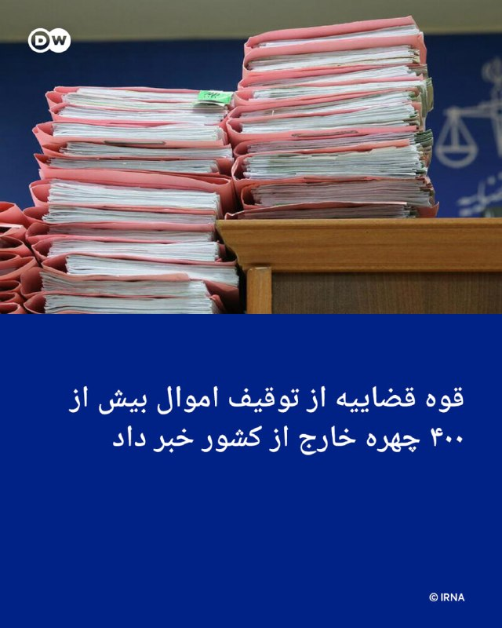

🔶 قوه قضاییه از توقیف اموال بیش از ۴۰۰ چهره خارج از کشور خبر داد

خبرگزاری مهر وابسته به سازمان تبلیغات اسلامی، به نقل از قوه قضاییه از توقیف اموال و دارایی‌های بیش از ۴۰۰ نفر از جمله خبرنگاران شبکه‌های "اینترنشنال" و "من‌وتو" خبر داد و مدعی شد که این افراد، "در همکاری با رژیم‌های متخاصم خسارت به زیرساخت‌ها و امنیت ملی وارد کردند".

بر اساس این گزارش، این اقدام در ادامه "دستور مقام قضایی و در راستای قانون تشدید مجازات جاسوسی" صورت گرفته و خبرنگاران یادشده، به همکاری با اسرائیل و "کشورهای متخاصم علیه امنیت و منافع ملی" متهم شده‌اند.

این گزارش، با اشاره به توقیف اموال ثبتی و دارایی‌های این افراد، آن‌ها را بیش از ۴۰۰ نفر از ایرانیان خارج از جمله "عده‌ای از بازیگران، ورزشکاران، مدیران و خبرنگاران" شبکه اینترنشنال و شبکه من‌وتو عنوان کرده است.

قوه قضاییه مدعی شده است که این افراد "در همکاری با دولت‌های متخاصم موجبات ایجاد خسارات گسترده‌ای به زیرساخت‌ها و مکان‌های عمومی نظیر مدارس، دانشگاه‌ها، مراکز تحقیقاتی، مراکز صنعتی و ... را فراهم کرده‌اند."

از زمان آغاز حملات نظامی آمریکا و اسرائیل به ایران در روز ۹ اسفندماه ۱۴۰۴، گزارش‌ها از افزایش بازداشت‌ها، اعدام‌ها و فشار بر فعالان رسانه‌ای و مدنی حکایت دارد. سازمان‌های حقوق بشری نیز نسبت به استفاده از مجازات‌هایی چون اعدام و مصادره اموال به عنوان ابزار سرکوب هشدار داده‌اند.

در این چارچوب، مصادره گسترده اموال را می‌توان بخشی از راهبردی دانست که در آن، جنگ خارجی بهانه‌ای برای بازتعریف و تشدید فشار داخلی شده است. در حالی که حکومت از "مذاکره" و "آتش‌بس" سخن می‌گوید، اقدامات عملی نشان می‌دهد که سطح تقابل با منتقدان و مخالفان نه تنها کاهش نیافته، بلکه در حال گسترش است.

@dw_farsi

## DW_Farsi — post 124613

🔶 هک با قدرت هوش مصنوعی؛ تهدیدی جدی در ابعاد جهانی

بر اساس یک گزارش گوگل، اقدامات هکرها با استفاده از قدرت هوش مصنوعی ، تنها در عرض سه ماه، از یک مشکل نوظهور به یک تهدید جدی در مقیاس وسیع تبدیل شده است.

گزارش‌های پیشین نشان داده بودند که جدیدترین مدل‌های هوش مصنوعی فراتر از حد تصور در کدنویسی توانمند هستند. این مدل‌ها در حال حاضر، به ابزارهایی بسیار قدرتمند برای سوءاستفاده از آسیب‌پذیری‌ سیستم‌ها تبدیل شده‌اند و طیف گسترده‌ای از سامانه‌های نرم‌افزاری را به خطر انداخته‌اند.

این گزارش همچنین دریافته است که گروه‌های تبهکار، همراه با عوامل بین‌المللی وابسته به دولت‌های چین، کره شمالی و روسیه، به طور گسترده از مدل‌های تجاری از جمله جمینای، کلود و ابزارهای شرکت اوپن‌ای‌آی برای بهبود و گسترش حملات استفاده می‌کنند.

به گزارش گاردین، یک کارشناس که در تدوین این گزارش نقش داشته می‌گوید این که چنین چیزی در آینده نزدیک رخ خواهد داد، تصوری اشتباه است. به گفته او "واقعیت این است که این روند همین حالا آغاز شده است".

@dw_farsi

## DW_Farsi — post 124612

🔶 تشکیل دادگاه نظامی در اسرائیل برای عاملان حمله هفت اکتبر

پارلمان اسرائیل شامگاه دوشنبه ۱۱ مه (۲۱ اردیبهشت) قانونی را تصویب کرد که بر اساس آن، یک دادگاه نظامی ویژه تشکیل خواهد شد تا صدها جنگجوی فلسطینی، به دلیل مشارکت در حمله تروریستی هفتم اکتبر ۲۰۲۳، در آن محاکمه شوند.

این قانون جدید با اکثریت ۹۳ رأی موافق، از مجموع ۱۲۰ نماینده کنست، تصویب شد. این طرح از سوی نمایندگانی از هر دو جناح ائتلاف حاکم و اپوزیسیون ارائه شده بود. نمایندگان پارلمان گفتند که این اقدام به التیام "ضربه روحی ملی" ناشی از آن حمله کمک خواهد کرد.

هدف این قانون آن است که تمامی مهاجمان ۷ اکتبر، بر اساس قوانین کیفری موجود اسرائیل، به اتهام‌هایی چون "جنایت علیه ملت یهود"، "جنایت علیه بشریت" و "جنایت جنگی" تحت پیگرد قرار گیرند.

به گفته اسرائیل، در حمله غافلگیرانه نیروهای موسوم به "نخبه" حماس در هفتم اکتبر ۲۰۲۳، دست‌کم ۱۲۰۰ نفر کشته شدند که بیشتر آنها غیرنظامی بودند. مهاجمان همچنین ۲۵۱ گروگان را به نوار غزه منتقل کردند. این روز، مرگبارترین روز تاریخ اسرائیل و شدیدترین حمله علیه یهودیان از زمان هولوکاست تاکنون توصیف شده است.

@dw_farsi

## DW_Farsi — post 124611

🔶 تبعیض دیجیتال در ایران زیر سایه جنگ؛ جدال بر سر اینترنت پرو

بیش از هفتاد روز پس از آغاز قطع گسترده اینترنت در ایران هم‌زمان با شروع جنگ آمریکا و اسرائیل علیه جمهوری اسلامی در نهم اسفند ۱۴۰۴، بحران دسترسی به شبکه جهانی از سطح محدودیتی امنیتی فراتر رفته و به مسئله‌ای سیاسی، اقتصادی و طبقاتی تبدیل شده است.

نت‌بلاکس پیش‌تر اعلام کرده بود که این قطعی در ششم اردیبهشت وارد پنجاه و هشتمین روز پیاپی شده و تا هشتم ماه مه از مرز هفتاد روز گذشته است؛ وضعیتی که به گفته این نهاد، گزارش‌دهی مستقل، ارتباطات عمومی و دسترسی مردم به اطلاعات جهانی را مختل کرده است.

هم‌زمان با این قطعی گسترده، موضوع "اینترنت پرو"، "خط سفید" و "سیم‌کارت سفید" نیز به نشانه‌ای آشکار از تبعیض دیجیتال بدل شده است. اکثریت شهروندان با اینترنت محدود، فیلترشکن‌های پرهزینه و اختلال دائمی روبرو هستند، اما گروه‌هایی خاص، از کسب‌وکارهای منتخب تا برخی چهره‌های رسانه‌ای و سیاسی، به مسیرهایی جداگانه برای دسترسی به اینترنت جهانی دست یافته‌اند.

@dw_farsi

## DW_Farsi — post 124601

📸 مروری بر مهم‌ترین حضورهای ایران در جشنواره سینمایی کن

هم‌زمان با آغاز جشنواره فیلم کن ۲۰۲۶ و نمایش دو فیلم ایرانی "داستان‌های موازی" ساخته اصغر فرهادی و "تمرین‌هایی برای یک انقلاب" به کارگردانی پگاه آهنگرانی، نگاهی داریم به مهم‌ترین فیلم‌های ایرانی که در سال‌های گذشته در این جشنواره حضور داشته‌اند.

از نخل طلای "طعم گیلاس" عباس کیارستمی تا موفقیت‌های اصغر فرهادی، جعفر پناهی و محمد رسول‌اف، سینمای ایران بارها در کن دیده شده و جوایز مهمی به دست آورده است.

این گالری مروری است بر فیلم‌ها، بازیگران و لحظه‌هایی که نام ایران را در یکی از مهم‌ترین جشنواره‌های سینمایی جهان ماندگار کردند.

@dw_farsi

## DW_Farsi — post 124592

  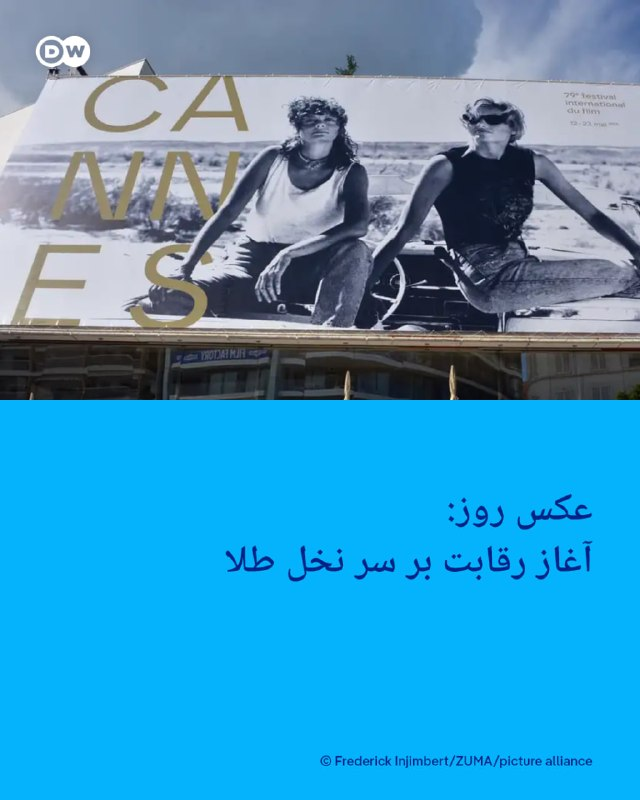

📸 عکس روز: آغاز رقابت بر سر نخل طلا

هفتاد و نهمین دوره از جشنواره سینمایی کن از روز ۱۲ تا ۲۳ مه برگزار می‌شود.

در بخش رقابتی این دوره سینماگران مطرح جهان حضور دارند، از پدرو آمودوار تا اصغر فرهادی که با آثار جدید خود در تلاش کسب نخل طلایی این فستیوال هستند. مجموعا ۲۲ فیلم برای دریافت نخل طلا با یکدیگر رقابت می‌کنند.

"ونوس الکتریکی"، ساخته جدید پیر سالوادوری، فیلم افتتاحیه این دوره خواهد بود.

@dw_farsi

## Persian_Trend_Official — post 13990

  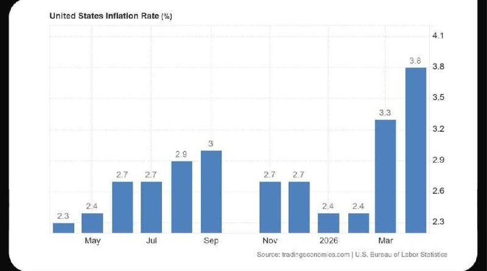

🔴 اختصاصی |تورم آمریکا بالاتر از انتظار ثبت شد

تورم آمریکا در ماه آوریل بار دیگر شتاب گرفت؛ موضوعی که تحت تأثیر افزایش قیمت بنزین، مواد غذایی و تبعات جنگ ایران رخ داده است.

بر اساس داده‌های منتشرشده:

▪️ نرخ تورم سالانه آمریکا به ۳.۸ درصد رسید
▪️ بازار انتظار عدد ۳.۷ درصدی را داشت
▪️ این سریع‌ترین رشد تورم از سال ۲۰۲۳ محسوب می‌شود

همچنین:

▪️ تورم ماهانه ۰.۶ درصد ثبت شد
▪️ تورم هسته ماهانه به ۰.۴ درصد رسید
▪️ تورم هسته سالانه نیز ۲.۸ درصد اعلام شد
▪️ هر دو شاخص هسته بالاتر از پیش‌بینی‌ها بودند

افزایش قیمت:

انرژی
بلیت هواپیما
و مواد غذایی

نشان می‌دهد فشارهای تورمی ممکن است در ماه‌های آینده نیز ادامه پیدا کند؛ حتی در صورت حفظ آتش‌بس یا کاهش تنش‌ها در تنگه هرمز

🫆:Tony

📌 @persian_trend_official
پرشین ترند | متفاوت‌ترین کانال نظامی

## Persian_Trend_Official — post 13989

🔴احضار سفیر جمهوری اسلامی به وزارت خارجه کویت

💢وزارت امور خارجه کویت عصر امروز در بیانیه‌ای اعلام کرد سفیر جمهوری اسلامی را احضار و یادداشت اعتراضی به او تحویل داده شد.

💢وزاتخانه یادشده در توجیه احضار سفیر جمهور اسلامی تأکید کرد این اقدام در پی آنچه «نفوذ گروهی از سپاه پاسداران به بوبیان و درگیری آنها با نیروهای کویتی» خوانده است، انجام گرفت.

🫆:Tony

📌 @persian_trend_official
پرشین ترند | متفاوت‌ترین کانال نظامی

## Persian_Trend_Official — post 13988

  

پیت هگست: آتش‌بس با ایران در حال اجراست
 

💢آتش‌بس با ایران در «وضعیت بسیار پویا» قرار دارد و در حال اجرا ست.
 
💢آتش‌بس به معنای توقف آتش‌پرانی است و می‌دانیم این اتفاق در حین مذاکرات رخ داده است و گفتگوهای مختلف بسیاری با تیم مذاکره ‌کننده ما در حال انجام است.

🫆:Tony

📌 @persian_trend_official
پرشین ترند | متفاوت‌ترین کانال نظامی

## Persian_Trend_Official — post 13987

🔴 دو وزیر دولت بریتانیا در اعتراض به استارمر استعفا دادند

💢گزارش‌ها حاکی است دو وزیر دولت بریتانیا در مخالفت با سیاست‌ها و عملکرد «کی یر استارمر» از سمت خود استعفا داده‌اند.

💢این استعفاها در حالی رخ می‌دهد که فشارهای سیاسی بر نخست‌وزیر بریتانیا افزایش یافته و پیش‌تر نیز گزارش‌هایی درباره نارضایتی گسترده در حزب کارگر منتشر شده بود.

🫆:Tony

📌 @persian_trend_official
پرشین ترند | متفاوت‌ترین کانال نظامی

## Persian_Trend_Official — post 13986

  <a href="telegram/content/Persian_Trend_Official_13986_1778600562.mp4" target="_blank">🎬 Download video</a>

🔴 وزارت دفاع روسیه تصاویر آزمایش موشک «سارمات» را منتشر کرد

وزارت دفاع روسیه ویدئویی از آزمایش موشک بالستیک قاره‌پیمای «سارمات» منتشر کرده است؛ موشکی که از آن به‌عنوان یکی از قدرتمندترین تسلیحات راهبردی هسته‌ای روسیه یاد می‌شود.

بر اساس گزارش‌ها:

▪️ «سارمات» یک موشک بالستیک قاره‌پیما با قابلیت حمل چندین کلاهک هسته‌ای است

▪️ ناتو این موشک را با نام «شیطان ۲» می‌شناسد

▪️ روسیه اعلام کرده این سامانه برای عبور از سپرهای موشکی طراحی شده است

️▪️ برد این موشک بین ۱۰ تا ۱۸ هزار
کیلومتر اعلام شده است

🫆:Tony

📌 @persian_trend_official
پرشین ترند | متفاوت‌ترین کانال نظامی

## Persian_Trend_Official — post 13984

🔴 عبور نفتکش‌های قطری از تنگه هرمز تأیید شد

در حالی که روز گذشته برخی گزارش‌ها مدعی شده بودند نفتکش قطری «مهزم» توسط ایران از تنگه هرمز بازگردانده شده، داده‌های جدید نشان می‌دهد این نفتکش دقایقی پیش موقعیت خود را در دریای عمان ثبت کرده و از مسیر تعیین‌شده عبور کرده است.

بر اساس گزارش‌ها:

▪️ نفتکش «مهزم» موفق به عبور از تنگه هرمز شده است
▪️ بلومبرگ نیز عبور دومین نفتکش حامل گاز طبیعی قطر از مسیر تعیین‌شده ایران را تأیید کرده است
▪️ عبور این کشتی‌ها در شرایط تنش شدید امنیتی در منطقه انجام شده است

🫆:Tony

📌 @persian_trend_official
پرشین ترند | متفاوت‌ترین کانال نظامی

## Persian_Trend_Official — post 13983

  <a href="telegram/content/Persian_Trend_Official_13983_1778600563.mp4" target="_blank">🎬 Download video</a>

🔴 رزمایش ضد هلی‌برن سپاه؛ بدون وجود پدافند هوایی

💢تصاویر منتشرشده از رزمایش «قائد شهید» سپاه تهران، استفاده از:
▪️ پهپادهای انتحاری
▪️ تک‌تیراندازها
▪️ مسلسل‌های سنگین سوار بر وانت تجاری

▪️ آرپی‌جی ۷

▪️ و توپ بدون لگد را نشان می‌دهد.

💢اما یک سؤال مهم مطرح است:
اگر هدف رزمایش مقابله با عملیات هلی‌برن دشمن بوده، چرا تمرینی برای هدف‌گیری بالگردها و اهداف پروازی با موشک‌های دوش‌پرتاب دیدهنمی‌شود؟

💢قاعدتاً جلوگیری از رسیدن و فرود دشمن، بسیار مؤثرتر از ورود به نبرد زمینی پس از پیاده‌سازی نیروهاست.

💢نکته مهم دیگر این است که ارتش آمریکا در صورت اجرای چنین عملیاتی، تنها از بالگرد ترابری استفاده نمی‌کند و عملیات معمولاً با:
▪️ پوشش هوایی
▪️ پهپادهای شناسایی
▪️ جنگ الکترونیک
▪️ و پشتیبانی آتش همراه خواهد بود.

💢به همین دلیل برخی تحلیلگران معتقدند این رزمایش بیشتر بر درگیری زمینی پس از فرود دشمن تمرکز داشته تا مقابله کامل با یک عملیات هوابرد مدرن.

🫆:Tony

📌 @persian_trend_official
پرشین ترند | متفاوت‌ترین کانال نظامی

## Persian_Trend_Official — post 13982

  

سخنگوی كميسيون امنيت ملی مجلس: غنی‌سازی ۹۰ درصدی اورانیوم در مجلس بررسی خواهد شد.

☆Phantom☆

📌 @persian_trend_official
پرشین ترند | متفاوت‌ترین کانال نظامی

## Persian_Trend_Official — post 13981

  

🚨🇺🇸🇮🇷 آخرین مقاومت سپاه پاسداران: این قایق‌ها تنها چیزی بود که برایشان باقی مانده بود.

☆Phantom☆

📌 @persian_trend_official
پرشین ترند | متفاوت‌ترین کانال نظامی

## Persian_Trend_Official — post 13979

  <a href="telegram/content/Persian_Trend_Official_13979_1778600566.webm" target="_blank">🎬 Download video</a>

اگر اینترنت غزه، اوکراین یا هرجایی که حمایت از آن برای حامی‌نماهای حقوق بشر "ویترین اخلاقی" داشته باشد فقط ۷ روز قطع میشد، دنیا را روی سرشان خراب می‌کردند؛ اما اینترنت ایران ۷۴ روز است عملاً قطع شده و آب از آب تکان نخورده است.

فکر می‌کنید اتفاق خاصی افتاده؟ خیر.
ضریب دسترسی واقعی به اینترنت آزاد در ایران به گواه نت‌بلاکس به حدود ۲ درصد رسیده؛ میلیون‌ها انسان نه ۷ روز، بلکه ۷۴ روز عملاً در یک زندان دیجیتال گروگان گرفته شده‌اند و همزمان که جمهوری اسلامی در پشت پرده به سرکوب، بازداشت و اعدام مشغول است، آشغالی به نام "اینترنت پرو" را به‌عنوان راه‌حل به مردم می‌فروشد، که عقیم‌سازی عمدی دسترسی آزاد به اطلاعات و نقض آشکار حقوق انسانی و حریم خصوصی شهروندان است.

ظاهراً برای جهان مدعی آزادی، فقط آن دسته از رنج‌هایی دیده می‌شوند که موضع‌گیری برایش هزینه‌ای نداشته باشد، یا چشم‌های مردمانش رنگی باشد.

📝 Nick

📌 @persian_trend_official
پرشین ترند | متفاوت‌ترین کانال نظامی

## Persian_Trend_Official — post 13978

💢خلاصه اخرین تحولات مهم

▪️دونالد ترامپ، رئیس‌جمهور آمریکا، اعلام کرد آتش‌بس با ایران «روی دستگاه حفظ حیات» قرار دارد و پیشنهاد اخیر تهران برای پایان جنگ را «کاملاً غیرقابل قبول» و «مزخرف» توصیف کرد.

▪️ قطر ایران را متهم کرد که از تنگه هرمز به‌عنوان ابزار فشار و «باج‌گیری» علیه کشورهای خلیج فارس استفاده می‌کند؛ در حالی که صادرات انرژی و کالاها همچنان با اختلال مواجه است

▪️ محمدباقر قالیباف، رئیس مجلس ایران، گفت تهران برای پاسخ به «هرگونه تجاوز» آماده است و واکنش ایران آمریکا را «غافلگیر» خواهد کرد

▪️ اتحادیه اروپا با اعمال تحریم‌های جدید علیه شهرک‌نشینان اسرائیلی به‌دلیل خشونت علیه فلسطینیان در کرانه باختری موافقت کرد؛ اقدامی که نتانیاهو گفته «موفق نخواهد شد»

▪️ شمار قربانیان جنگ غزه به ۷۲ هزار و ۷۴۰ نفر رسیده است

▪️ لبنان نیز اعلام کرد حملات اسرائیل از دوم مارس تاکنون ۲۸۶۹ کشته در این کشور برجای گذاشته است

🫆:Tony

📌 @persian_trend_official
پرشین ترند | متفاوت‌ترین کانال نظامی

## Persian_Trend_Official — post 13977

  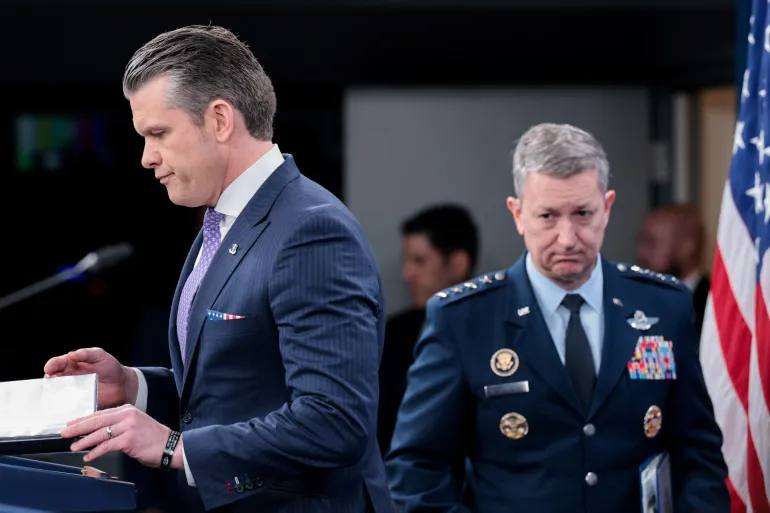

🔴 وزیر جنگ آمریکا درباره جنگ با ایران در کنگره بازخواست می‌شود

«پیت هگست» وزیر جنگ آمریکا قرار است در دور تازه‌ای از جلسات کنگره، درباره جنگ آمریکا و اسرائیل با ایران مورد پرسش نمایندگان قرار گیرد.

بر اساس گزارش‌ها:

▪️ برخی نمایندگان جمهوری‌خواه نیز نسبت به طولانی‌شدن جنگ و نبود مجوز رسمی کنگره ابراز نگرانی کرده‌اند
▪️ کمیته‌های بودجه دفاعی مجلس نمایندگان و سنا نشست‌هایی برای بررسی بودجه نظامی سال ۲۰۲۷ برگزار می‌کنند
▪️ دولت ترامپ بودجه‌ای تاریخی به ارزش ۱.۵ تریلیون دلار برای بخش دفاعی پیشنهاد داده است

گزارش‌ها حاکی است محور اصلی بحث‌ها علاوه بر بودجه، نحوه مدیریت جنگ با ایران خواهد بود؛ جنگی که به‌گفته رسانه‌های آمریکایی وارد وضعیت فرسایشی شده است.

همچنین انتظار می‌رود:

▪️ وزیر جنگ آمریکا و رئیس ستاد مشترک ارتش بر نیاز به افزایش پهپادها
ناوهای جنگی
سامانه‌های رهگیر موشکی
تأکید کنند؛ زیرا ذخایر این تجهیزات در جریان درگیری با ایران کاهش یافته است.

🫆:Tony

📌 @persian_trend_official
پرشین ترند | متفاوت‌ترین کانال نظامی

## RadioFarda — post 157096

🔸بحرین روز سه‌شنبه ۲۲ اردیبهشت سه نفر را به اتهام «همکاری با سپاه پاسداران» به حبس ابد محکوم کرد. 🔸دادگاهی در بحرین همچنین بیش از ۲۰ نفر دیگر را به حداکثر ۱۰ سال زندان محکوم کرد. 🔸این پادشاهی کوچک که تحت حاکمیت یک خاندان سنی است، جمعیت قابل‌توجهی از شیعیان…

## RadioFarda — post 157095

  

🔸بحرین روز سه‌شنبه ۲۲ اردیبهشت سه نفر را به اتهام «همکاری با سپاه پاسداران» به حبس ابد محکوم کرد.

🔸دادگاهی در بحرین همچنین بیش از ۲۰ نفر دیگر را به حداکثر ۱۰ سال زندان محکوم کرد.

🔸این پادشاهی کوچک که تحت حاکمیت یک خاندان سنی است، جمعیت قابل‌توجهی از شیعیان دارد که مدت‌هاست از حاشیه‌نشینی شکایت دارند.

🔸دادستانی بحرین در بیانیه‌ای اعلام کرد یک زن که «به همکاری با سازمان تروریستی سپاه پاسداران با هدف انجام اقدامات خصمانه و تروریستی» متهم شده بود، به حبس ابد محکوم شده است.

🔸دو نفر دیگر، که یکی از آن‌ها به ایران گریخته، نیز با اتهامات مشابه به حبس ابد و پرداخت جریمه ۱۰ هزار دیناری (۲۶ هزار و ۴۸۷ دلاری) محکوم شدند.

🔸در پرونده‌ای جداگانه، دادگاه ۱۰ متهم را به حبس‌هایی تا ۱۰ سال محکوم کرد که سه نفر از آن‌ها پس از گذراندن دوران محکومیت اخراج خواهند شد.

🔸آن‌ها به حمایت از ایران، فیلم‌برداری از مکان‌های ممنوعه و انتشار بیانیه‌های ممنوعه متهم شده‌اند.

@RadioFarda

## RadioFarda — post 157094

  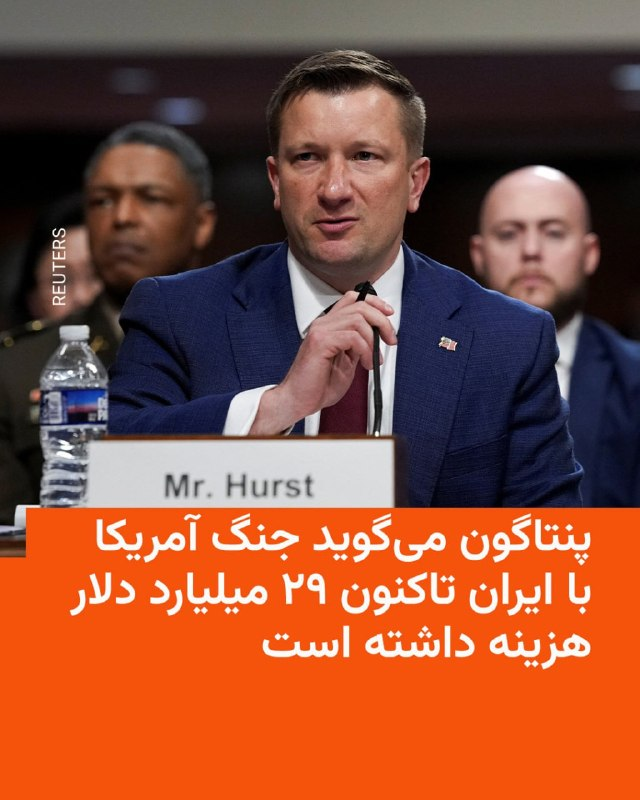

🔸یک مقام ارشد پنتاگون روز سه‌شنبه ۲۲ اردیبهشت اعلام کرد که جنگ ایالات متحده با ایران تاکنون ۲۹ میلیارد دلار هزینه داشته است، رقمی که نسبت به برآورد ارائه‌شده در اواخر ماه گذشته، چهار میلیارد دلار افزایش نشان می‌دهد.

🔸به گزارش خبرگزاری رویترز، در حالی که تنها شش ماه تا انتخابات میان‌دوره‌ای کنگره آمریکا باقی مانده است، دموکرات‌ها در نظرسنجی‌های عمومی موقعیت بهتری پیدا کرده‌اند و تلاش می‌کنند این جنگ را به مسائل مربوط به هزینه‌های زندگی پیوند بزنند.

🔸پنتاگون در ۲۹ آوریل اعلام کرده بود که هزینه جنگ تا آن زمان ۲۵ میلیارد دلار بوده است.

🔸جولز هرست، که به‌طور موقت وظایف حسابرس ارشد را بر عهده دارد، روز سه‌شنبه به قانون‌گذاران گفت که برآورد جدید شامل هزینه‌های به‌روزشده تعمیر و جایگزینی تجهیزات و همچنین هزینه‌های عملیاتی است.

🔸او گفت: «تیم ستاد مشترک و تیم حسابرسی به‌طور مداوم این برآورد را بررسی می‌کنند».

🔸هرست در کنار پیت هگست، وزیر دفاع، و ژنرال دن کین، رئیس ستاد مشترک نیروهای مسلح، سخن می‌گفت.

@RadioFarda

## RadioFarda — post 157093

رکوردشکنی شمار نویسندگان زندانی در جهان؛ ایران با ۵۳ نویسندهٔ زندانی در رده دوم

🔸انجمن قلم آمریکا در تازه‌ترین گزارش سالانهٔ خود دربارهٔ وضعیت آزادی بیان در جهان اعلام کرد شمار نویسندگان زندانی در سال ۲۰۲۵ برای نخستین بار از سال ۲۰۱۹ که این شاخص منتشر می‌شود، از مرز ۴۰۰ نفر عبور کرده است.

🔸این گزارش از افزایش چشمگیر بازداشت نویسندگان و فعالان فرهنگی در ایران نیز خبر می‌دهد.

🔸این گزارش که روز سه‌شنبه ۲۲ اردیبهشت منتشر شد، می‌گوید در سال ۲۰۲۵ میلادی در مجموع ۴۰۱ نویسنده در ۴۴ کشور زندانی بوده‌اند، در حالی‌که این رقم در سال پیش ۳۷۵ نفر در ۴۰ کشور بود.

🔸انجمن قلم آمریکا در شاخص «آزادی نوشتن» خود تأکید کرده است که طی هفت سال گذشته شمار نویسندگان زندانی در جهان ۶۸ درصد افزایش یافته و این روند نشان‌دهندهٔ تشدید مداوم سرکوب آزادی بیان و خاموش‌کردن صداهای منتقد در کشورهای مختلف است.

🔸بر اساس این گزارش، چین همچنان بزرگ‌ترین زندان نویسندگان در جهان است و با ۱۱۹ مورد در صدر فهرست قرار دارد. ایران با ۵۳ نویسندهٔ زندانی در رتبهٔ دوم ایستاده و به‌گفتۀ پن آمریکا، شدیدترین افزایش بازداشت‌ها در ایران طی سال گذشته رخ داده است.

🔸این سازمان می‌گوید مقام‌های جمهوری اسلامی در سال ۲۰۲۵ دست‌کم ۱۷ بازداشت تازه انجام دادند و شمار نویسندگان زندانی را بار دیگر به سطح دوران اعتراض‌های «زن، زندگی، آزادی» در سال ۱۴۰۱ نزدیک کرده‌اند.

🔸کارین دویچ کارلکار، مدیر برنامهٔ نویسندگان در معرض خطر در پن آمریکا، در این‌باره گفت مقام‌های جمهوری اسلامی در میان کشورهای جهان «کارزاری به‌ویژه خشن علیه صداهای مستقل» به راه انداخته‌اند.

🔸او افزود شاعران، مترجمان، پژوهشگران، ترانه‌سرایان، تحلیلگران آنلاین، مدافعان حقوق بشر و ستون‌نویسان همگی هدف بازداشت و سرکوب قرار گرفته‌اند، زیرا حکومت ایران در تلاش است «بحث و مخالفت» را خاموش کند.

🔸گزارش کامل را در وب‌سایت رادیوفردا بخوانید.

@RadioFarda

## RadioFarda — post 157092

🔸رسانه‌های ایران روز سه‌شنبه ۲۲ اردیبهشت مدعی شدند که هیئت‌های نمایندگی جمهوری اسلامی و عمان در مسقط دیدار کردند و «آخرین تحولات مربوط به تنگه هرمز و ترتیبات مربوط به عبور ایمن کشتی‌ها» را مورد بررسی قرار دادند. 🔸بر اساس این گزارش، عباس باقرپور مدیرکل حقوقی…

## RadioFarda — post 157091

  

🔸رسانه‌های ایران روز سه‌شنبه ۲۲ اردیبهشت مدعی شدند که هیئت‌های نمایندگی جمهوری اسلامی و عمان در مسقط دیدار کردند و «آخرین تحولات مربوط به تنگه هرمز و ترتیبات مربوط به عبور ایمن کشتی‌ها» را مورد بررسی قرار دادند.

🔸بر اساس این گزارش، عباس باقرپور مدیرکل حقوقی بین‌المللی وزارت خارجه، ریاست هیئت نمایندگی ایران را برعهده داشت و «نمایندگان دستگاه‌های ذیربط» جمهوری اسلامی نیز در آن حضور داشتند.

🔸به ادعای این رسانه‌ها، «دو طرف بر حقوق و صلاحیت‌های حاکمیتی خود بر این تنگه به عنوان بخشی از آب‌های سرزمینی ایران و عمان تأکید کردند».

🔸تنگه هرمز از ۹ اسفند پارسال که آمریکا و اسرائیل به ایران حمله کردند، از سوی سپاه پاسداران عملاً مسدود شده است؛ آبراهی حیاتی که حدود ۲۰ درصد از نفت و گاز جهان از این مسیر عبور می‌کند.

@RadioFarda

## RadioFarda — post 157090

  

🔸فرماندهی مرکزی ایالات متحده، سنتکام، روز سه‌شنبه خبر داد از ابتدای محاصره دریایی علیه بنادر ایران تاکنون، ۶۵ کشتی تجاری را وادار به «تغییر مسیر» کرده است.

🔸در اطلاعیه سنتکام که در حساب شبکه ایکس آن منتشر شده است، آمده که نیروهای نظامی آمریکا در خاورمیانه در این مدت چهار کشتی ایرانی را هم «از کار انداخته‌اند».

🔸ارتش آمریکا جمعه از شلیک به دو نفتکش ایرانی «ام‌تی سی استار» و «ام‌تی سودا» و از کار انداختن آنها خبر داد و روز چهارشنبه نیز نفتکش «ام‌تی حسنا» با پرچم ایران هدف قرار گرفته بود.

🔸ماه گذشته نیز نیروهای آمریکایی یک کشتی باری ایرانی را توقیف کرده بودند.

🔸آمریکا و ایران بعد از یک دور مذاکره حضوری در پاکستان که چند روز بعد از برقراری آتش‌بس در اسلام‌آباد برگزار شد، با ارسال طرح‌های پیشنهادی متقابل مشغول مذاکره بودند. آمریکا بعد از بی‌نتیجه ماندن مذاکره حضوری، محاصره دریایی بنادر ایران را آغاز کرد، در حالی که ایران از ابتدای جنگ تنگهٔ هرمز را مسدود کرده است.

@RadioFarda

## IranianMinds — post 20011

  <a href="telegram/content/IranianMinds_20011_1778600569.mp4" target="_blank">🎬 Download video</a>

🔴 شهبازی مجری صداوسیما در مورد نت 5G افغانستان و سیستم بانک جهانی‌ سوریه:

اگه اینارو میخوایید داشته باشید، برید همون سوریه و افغانستان زندگی کنید!

@IranianMinds

## IranianMinds — post 20010

  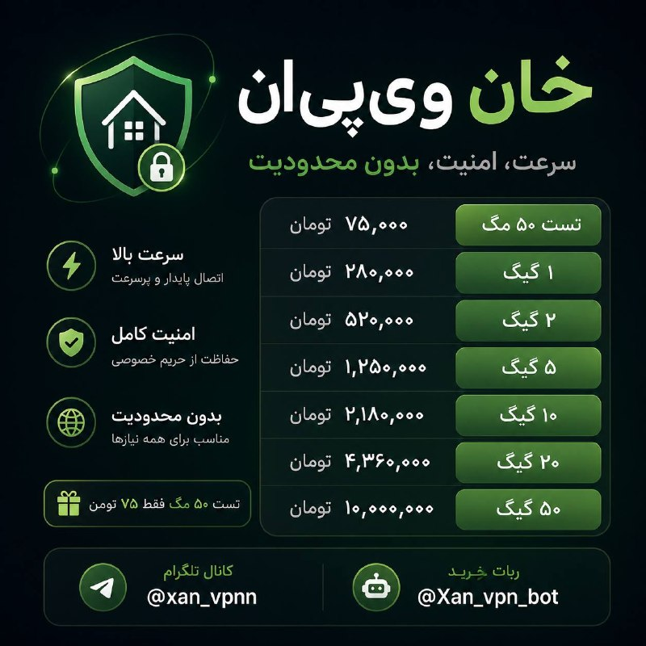

💙 خان وی‌پی‌ان

⚡️ سرعت بالا

🛡 پینگ و پایداری عالی

🔐 مناسب تلگرام، اینستا، یوتیوب، گیم و استریم

💸 قیمت اقتصادی با پلن‌های متنوع

🎁 تست ۵۰ مگ فقط ۷۵ تومن

🛎 کانال:

https://t.me/+qNjExGEJztE2OGI0

🤖 ربات خرید:
@Xan_vpn_bot

## IranianMinds — post 20009

🔴وزیر آموزش و پرورش:

کلاس‌ها تا پایان سال تحصیلی مجازی شده است و امتحانات قرار است از ۹ خرداد برگزار بشود.

@IranianMinds

## IranianMinds — post 20008

🔴وزیر دوم بریتانیا از دولت کی‌ر استارمر استعفاء داد.

@IranianMinds

## IranianMinds — post 20007

🔴سنتکام:

ناو هواپیمابر امریکایی آبراهام لینکلن به عملیات دریایی خود در دریای عرب ادامه می‌دهد که این عملیات شامل محاصره دریایی ایران نیز می‌شود.

@IranianMinds

## IranianMinds — post 20006

  <a href="telegram/content/IranianMinds_20006_1778600571.mp4" target="_blank">🎬 Download video</a>

🔴چندتا از بستگان موشعلی خامنه‌ای در بیمارستان هند دیده شده‌اند.

@IranianMinds

## BBCPersian — post 280853

  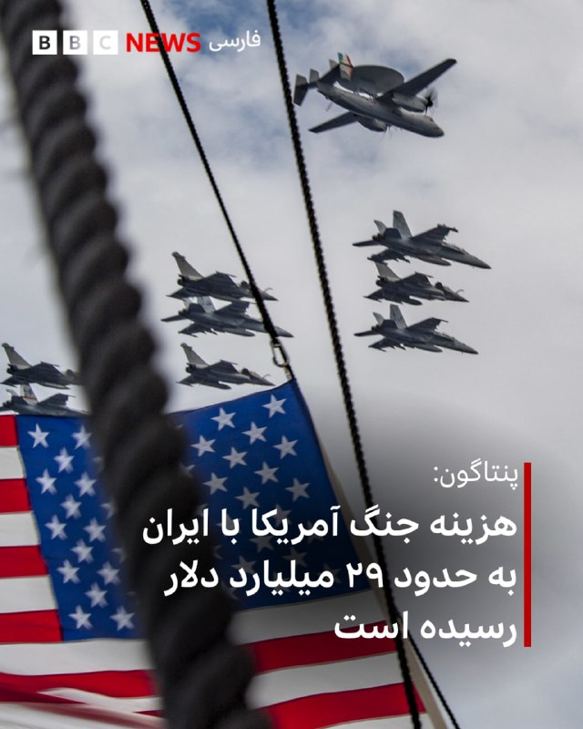

🔻پنتاگون روز سه‌شنبه اعلام کرد که جدیدترین ارزیابی از هزینه جنگ با ایران حدود ۲۹ میلیارد دلار است.

این آمار جدید که در جلسه استماع بودجه در کنگره اعلام شد، حدود ۴ میلیارد دلار بیشتر از تخمینی است که پیت هگست، وزیر دفاع آمریکا، حدود دو هفته پیش ارائه کرده بود.

پیت هگست، وزیر دفاع و ژنرال دن کین، رئیس ستاد مشترک ارتش آمریکا، در حال شهادت دادن در مورد درخواست بودجه یک و نیم تریلیون دلاری برای سال ۲۰۲۷ میلادی بودند که از آنها خواسته شد تا در مورد هزینه جنگ با ایران هم توضیحاتی ارائه دهند.

جولز هرست، رئیس امور مالی پنتاگون هم که در این جلسه حضور داشت با اشاره به تخمین وزیر دفاع این کشور در ۲۹ آوریل در کنگره گفت: «در زمان شهادت... این مبلغ ۲۵ میلیارد دلار بود.»

او همچنین گفت: «اما تیم مشترک کارکنان و حسابرسی دائما تخمین‌ها را زیر نظر دارند و اکنون فکر می‌کنیم که این مبلغ به ۲۹ میلیارد دلار نزدیک‌تر است.»

📷Getty Images
@BBCPersian

## BBCPersian — post 280852

🔻رزمایش اعلام نشده سپاه در تهران

سپاه پاسداران یک همایش اعلام نشده به نام «قائد شهید» در تهران بزرگ برگزار کرد.

به گزارش رسانه‌های ایران، این رزمایش برای «تمرین سناریوهای مقابله با دشمن و ارزیابی تاکتیک‌های رزمی» در سطح سپاه محمد رسول الله تهران بزرگ برگزار شد.

سرتیپ حسن حسن‌زاده، فرمانده این سپاه گفت در این رزمایش برای «ارتقای توان رزمی برای مقابله با هرگونه تحرک دشمن» همه «تاکتیک‌ها و تکنیک‌های تیمی و فردی با موفقیت» تمرین شد.

سپاه محمد رسول‌الله تهران بزرگ که گفته می‌شود بزرگترین یگان نظامی امنیتی سپاه است مسئولیت امنیت شهر تهران را به عهده دارد. مسئولیت امنیت استان تهران جز تهران بزرگ با سپاه سیدالشهداست.

https://bbc.in/4drNww2
@BBCPersian

## BBCPersian — post 280851

  <a href="https://t.me/bbcpersian/280851" target="_blank">📎 Download file</a>

پادکست برنامه شصت دقیقه سه‌شنبه ۲۲ اردیبهشت ۱۴۰۵
این نسخه رادیویی برنامه شصت دقیقه تلویزیون فارسی بی‌بی‌سی است که هرشب بعد از پخش، با حجم کم از اپلیکیشن‌های پادگیر و صفحه تلگرام بی‌بی‌سی فارسی در دسترس است.
در تلگرام بی‌بی‌سی فارسی می‌توانید با هشتگ #BBCPersianRadio با ما در ارتباط باشید.

پیامگیر تلگرام بی‌بی‌سی فارسی:
@BBCShoma

## BBCPersian — post 280850

  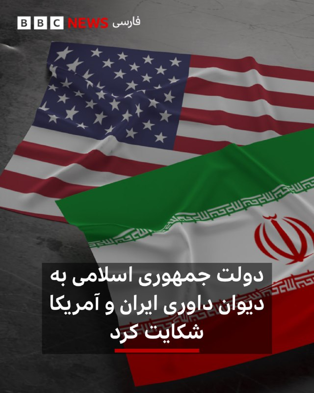

🔻دولت جمهوری اسلامی می‌گوید از ایالات متحده به دیوان داوری ایران و آمریکا، مستقر در لاهه هلند، شکایت کرده است.

به گزارش خبرگزاری‌های ایران، این شکایت دولت آمریکا را به نقض مفاد بیانیه‌های الجزایر متهم کرده است؛ توافقی که در دی ۱۳۵۹ با میانجی‌گری الجزایر حاصل شد و به بحران گروگان‌گیری دیپلمات‌های آمریکایی در ایران پایان داد.

«جنگ ۱۲ روزه، حملاتی که از ۹ اسفند (۲۸ فوریه) آغاز شد و همچنین تحریم‌های اقتصادی ایالات متحده» از جمله شکایت‌های ایران هستند.

بر اساس عهدنامه الجزایر آمریکا متعهد شده در امور داخلی، سیاسی و نظامی مستقیم یا غیرمستقیم ایران دخالت نکند.

در حال حاضر، دو شکایت دیگر ایران از آمریکا در دیوان دادگستری بین‌المللی در جریان است که یکی مربوط به خروج آمریکا از توافق هسته‌ای موسوم به برجام و دیگری درباره مصادره نزدیک به دو میلیارد دلار از اموال بانک مرکزی ایران است.

📷Getty Images
@BBCPersian

## BBCPersian — post 280849

  <a href="telegram/content/BBCPersian_280849_1778600573.mp4" target="_blank">🎬 Download video</a>

🔻سرخط خبرهای سه‌شنبه ۲۲ اردیبهشت ۱۴۰۵
@BBCPersian

## BBCPersian — post 280848

🔻نیروی دریایی سپاه: محدوده تنگه هرمز را از ۲۰ مایل، به بیش از ۲۰۰ مایل گسترش دادیم

معاون سیاسی نیروی دریایی سپاه پاسداران می‌گوید که ایران پس از جنگ اخیر با آمریکا و اسرائیل، محدوده تنگه هرمز را «به‌طور قابل‌توجهی» گسترش داده است.

محمد اکبرزاده به تلویزیون ایران گفت که این محدوده اکنون «از سواحل جاسک و سیری تا فراتر از جزایر تنب بزرگ، به‌عنوان یک پهنه راهبردی تعریف شده است؛ به‌عبارت دیگر، تنگه هرمز بزرگ‌تر شده و به یک منطقه وسیع عملیاتی تبدیل شده است.»

به گفته معاون سیاسی نیروی دریایی سپاه، محدوده تنگه هرمز از نظر وسعت «از ۲۰ الی ۳۰ مایل در گذشته به بیش از ۲۰۰ الی ۳۰۰ مایل، یعنی ۵۰۰ کیلومتر» گسترش پیدا کرده است.

محمد اکبرزاده گفت: «در یکی از موارد اخیر، یک ناوچه آمریکایی قصد عبور از این محدوده را داشت که با رصد دقیق نیروهای مسلح مواجه شد و پس از مشاهده برخی رفتارهای تحریک‌آمیز، نیروی دریایی ارتش با شلیک‌های هشداردهنده و هدفمند، پیام لازم را منتقل کرد و این شناور نیز بلافاصله مسیر خود را تغییر داد.»

https://bbc.in/4drNww2
@BBCPersian

## Dirty_Kids — post 389320

  <a href="telegram/content/Dirty_Kids_389320_1778600575.mp4" target="_blank">🎬 Download video</a>

لامین یامال بازیکن بی اخلاق و خانم‌باز بارسا توی جشن قهرمانی بارسلونا پرچم فلسطین را برافراشته. + این در جریان ۱ ماه دیگه باید بره امریکا لای کلی ایرانی؟ @Dirty_Kids 👻

## Dirty_Kids — post 389319

  

قل أعوذ برب الناس
آدم خارکسه از دور پیداس!

@Dirty_Kids 👻

## Dirty_Kids — post 389318

  <a href="telegram/content/Dirty_Kids_389318_1778600575.mp4" target="_blank">🎬 Download video</a>

یه قشری هم هستن توی اینستا این شکلی دارن با وصل بودنشون پز میدن.

@Dirty_Kids 👻

## Dirty_Kids — post 389317

  <a href="telegram/content/Dirty_Kids_389317_1778600577.mp4" target="_blank">🎬 Download video</a>

ابداع عبارت جدید برای توصیف شرایط فعلی لازم بود ! 😆✋

@Dirty_Kids 👻

## Dirty_Kids — post 389316

  <a href="telegram/content/Dirty_Kids_389316_1778600578.mp4" target="_blank">🎬 Download video</a>

کلیپ چقدر عرزشیا رو سوزونده

@Dirty_Kids 👻

## Dirty_Kids — post 389315

اسراییل تو خاک عراق پایگاه مخفی زده
باند فرودگاه ساخته
ارتش آورده
ماشین آلات و‌ تجهیزات آورده
چند سال اونجا فعالیت کرده

پارسال به خاطر بارندگی‌ محبور شده پایگاه مخفی رو رها کنه

تازه امسال فهمیدن 😂😂😂

همینجوری روز عاشورا شکست خودناااا

@Dirty_Kids 👻

## Dirty_Kids — post 389313

شیر بازیگوش و AIبه‌باسن با انتشار هفت هشتا از این تصاویر در تروث سوشال دوباره شروع کرد.

صبور باشید و پنیک نکنید.

@Dirty_Kids 👻

## Dirty_Kids — post 389312

  <a href="telegram/content/Dirty_Kids_389312_1778600579.mp4" target="_blank">🎬 Download video</a>

واکنش شهبازی (اسکل نظام) به وضعیت اینترنت مردم ایران و کشورهای منطقه:

اگه خیلی این چیزها مهمه، برید همون افغانستان و سوریه زندگی کنید! هاهاهاها

+ هاهاها و ک...خر

@Dirty_Kids 👻

## Hranews — post 112907

  

💥 دعوت به همکاری با خبرگزاری هرانا

خبرگزاری هرانا، با بیش از دو دهه سابقه در حوزه گزارشگری و مستندسازی حقوق بشر، در راستای توسعه فعالیت‌های خود از علاقه‌مندان واجد شرایط برای همکاری دعوت می‌کند.

هرانا در این مرحله بیش از آن‌که به دنبال افراد با سابقه حرفه‌ای باشد، به دنبال افرادی متعهد، دقیق و آموزش‌پذیر است؛ کسانی که دغدغه واقعی حقوق بشر دارند و مایل‌اند در یک چارچوب حرفه‌ای، مهارت‌های خود را توسعه دهند.

زمینه‌های همکاری شامل:
گزارشگری، ویراستاری، ترجمه، مدیریت شبکه‌های اجتماعی و سایر حوزه‌های مرتبط

ویژگی‌های مورد انتظار:

* تسلط کافی به زبان فارسی (خواندن و نوشتن)
* دقت، مسئولیت‌پذیری و توانایی یادگیری مستمر
* علاقه و حساسیت نسبت به موضوعات حقوق بشر
* آمادگی برای فعالیت در چارچوب‌های سازمان‌یافته و حرفه‌ای

❗️ توجه: این فرصت همکاری فقط شامل کسانی است که به زبان فارسی مسلط و ساکن یکی از کشورهای "ترکیه، قبرس شمالی، هندوستان، مصر، قرقیزستان، ازبکستان، کلمبیا، پاراگوئه، قزاقستان، سریلانکا، بلغارستان و رومانی" هستند.

همکاری با هرانا فرصتی است برای کسب تجربه عملی در حوزه مستندسازی و فعالیت‌های حقوق بشری در یک نهاد با سابقه و ساختار حرفه‌ای.

📎 برای ثبت درخواست همکاری، لطفا فرم زیر را تکمیل کنید:
https://hra.news/4cBjHqs

📩 در صورت بروز مشکل در تکمیل فرم، می‌توانید رزومه و اطلاعات تماس خود را به آدرس زیر ارسال نمایید:
info@hra-news.org

↘️
@hranews_bot تماس ✉️ -  @Hranews  کانال هرانا 🆑

## Hranews — post 112906

یک شهروند توسط نیروهای اداره اطلاعات در ازنا بازداشت شد

❗️
❗️
❗️
❗️
❗️– یک شهروند در شهرستان ازنا به دلیل آنچه ارتباط و همکاری با یکی از گروه‌های مخالف نظام عنوان شده است، توسط نیروهای اداره اطلاعات #بازداشت شد.

ادامه مطلب

↘️
@hranews_bot تماس ✉️ -  @Hranews  کانال هرانا 🆑

## Hranews — post 112905

  

افزایش هزینه مسکن و اجاره‌بها، فشار معیشتی بر خانوارهای کارگری را تشدید کرده و سهم مسکن را به بخش عمده سبد هزینه خانواده‌ها در برخی کلان‌شهرها رسانده است. خبرگزاری ایلنا با انتشار گزارشی در این رابطه، به پیامدهای رشد #تورم، افزایش هزینه ساخت‌وساز و کاهش قدرت خرید پرداخته است. بر اساس این گزارش، بسیاری از خانواده‌ها ناچار شده‌اند برای تامین هزینه سرپناه، از مخارج ضروری مانند خوراک، درمان و آموزش بکاهند.

کارشناسان اقتصادی همچنین از گسترش فقر مسکن، افزایش جابه‌جایی اجباری مستاجران به مناطق پایین‌تر و تشدید فشار بر خانوارهای کم‌درآمد خبر می‌دهند. به گفته آنان، ادامه رکود اقتصادی و #بیکاری، در کنار ناکارآمدی سیاست‌های حمایتی دولت، موجب شده بخش قابل توجهی از مستاجران با دشواری بیشتری در تامین هزینه‌های زندگی روبه‌رو شوند.

↘️
@hranews_bot تماس ✉️ - @Hranews کانال هرانا 🆑

## Hranews — post 112904

پخش اعترافات اجباری؛ گزارشی از بازداشت سه شهروند توسط ماموران اطلاعات سپاه

❗️
❗️
❗️
❗️
❗️– سه شهروند در استان کهگیلویه و بویراحمد به دلایلی همچون استفاده از استارلینک برای ارتباط با گروه‌های مخالف نظام و تصویربرداری از اماکن خاص و ارسال تصاویر آن به رسانه‌های خارج از کشور توسط ماموران سازمان اطلاعات سپاه #بازداشت شدند. ویدیویی از اعترافات اجباری این افراد نیز منتشر شده که شرایط ضبط آن مشخص نیست.

ادامه مطلب

↘️
@hranews_bot تماس ✉️ -  @Hranews  کانال هرانا 🆑

## Hranews — post 112903

  

مطهره گونه‌ای مجددا به دادسرا فراخوانده شد

❗️
❗️
❗️
❗️
❗️– مطهره گونه‌ای، فعال دانشجویی، برای دومین بار طی یک ماه اخیر به دادسرای عمومی و انقلاب ناحیه ۳۱ تهران احضار شد.

به گزارش خبرگزاری هرانا، ارگان خبری مجموعه فعالان حقوق بشر در ایران، مطهره گونه‌ای، فعال دانشجویی احضار شد.

وی با انتشار مطلبی در این خصوص نوشت: «امروز احضاریه جدید آمد. این بار، جهت دفاع از اتهام انتسابی نشر اکاذیب باید به دادسرای عمومی و انقلاب ناحیه ۳۱ تهران مراجعه کنم.»

ادامه مطلب

#مطهره_گونه‌ای

↘️
@hranews_bot تماس ✉️ -  @Hranews  کانال هرانا 🆑

## manototv — post 105356

  <a href="telegram/content/manototv_105356_1778600582.mp4" target="_blank">🎬 Download video</a>

تماسی از ایران؛ «می‌گفت تو این شرایط، به دور و برمون نگاه کنیم و دستِ همدیگه رو بگیریم…
تو هر خانواده و آشنایی یکی هست که بی‌صدا به کمک نیاز داره.»

## manototv — post 105355

  <a href="telegram/content/manototv_105355_1778600583.mp4" target="_blank">🎬 Download video</a>

دونالد ترامپ، رئیس‌جمهور آمریکا، با وجود توقف مذاکرات با جمهوری‌اسلامی، در یک گفتگو، اعلام کرده تهران صددرصد غنی‌سازی اورانیوم و هرگونه تلاش برای ساخت سلاح هسته‌ای را متوقف خواهد کرد.
ترامپ در گفت‌وگو با رادیوی WABC گفت شخصاً با مقام‌های جمهوری‌اسلامی در تماس بوده و افزود: «آن‌ها گفتند ما غبار هسته‌ای را تحویل خواهیم گرفت.»
او همچنین تأکید کرد آمریکا برای رسیدن به توافق عجله‌ای ندارد و گفت: «ما محاصره را در اختیار داریم.»

## manototv — post 105354

  <a href="telegram/content/manototv_105354_1778600584.mp4" target="_blank">🎬 Download video</a>

تماسی از تجربه‌اش با بهزیستی
می‌گفت برای بیمه و تأیید مشکلش هزار تا ایراد گرفتن
اما وقتی پای کمک رسید، گفتن هیچ مشکلی نداری

## manototv — post 105353

  <a href="telegram/content/manototv_105353_1778600585.mp4" target="_blank">🎬 Download video</a>

در جلسه استماع کنگره آمریکا، مقام‌های ارشد پنتاگون اعلام کردند هزینه تسلیحات و تجهیزات مصرف‌شده آمریکا در جنگ با ایران تاکنون به حدود ۲۴ میلیارد دلار رسیده است.
پیت هگست، وزیر دفاع آمریکا، به همراه رئیس ستاد مشترک ارتش و مقام مالی وزارت جنگ در این جلسه حضور داشتند. به گفته جولز هرست، این رقم شامل مهمات، موشک‌ها و سایر تجهیزات نظامی استفاده‌شده در جنگ است.
پنتاگون ماه گذشته نیز اعلام کرده بود مجموع هزینه‌های جنگ با ایران تاکنون به ۲۹ میلیارد دلار رسیده است.

## manototv — post 105352

  <a href="telegram/content/manototv_105352_1778600585.mp4" target="_blank">🎬 Download video</a>

ابراهیم رضایی، سخنگوی کمیسیون امنیت ملی و سیاست خارجی مجلس شورای اسلامی در شبکه اکس تهدید کرده، غنی سازی ۹۰ درصد به عنوان یکی از گزینه‌های جمهوری‌اسلامی در صورت حمله مجدد، بررسی می‌شود.

## manototv — post 105351

  <a href="telegram/content/manototv_105351_1778600586.mp4" target="_blank">🎬 Download video</a>

متاثر از پیچیده‌تر شدن سرنوشت مذاکرات جمهوری‌اسلامی و آمریکا، قیمت جهانی نفت، بیش از ۳ درصد افزایش یافت.
بهای نفت برنت به حدود ۱۰۸ دلار و نفت وست‌تگزاس آمریکا به بیش از ۱۰۱ دلار در هر بشکه رسید. تحلیلگران می‌گویند رد پیشنهادهای دو طرف، نگرانی‌ها درباره اختلال در عرضه نفت را دوباره افزایش داده است.
مدیرعامل آرامکوی عربستان هشدار داد هرگونه اختلال در صادرات نفت از تنگه هرمز می‌تواند بازگشت ثبات به بازار را تا سال ۲۰۲۷ به تعویق بیندازد.
کارشناسان همچنین گفته‌اند در صورت توافق واقعی میان تهران و واشنگتن، قیمت نفت ممکن است ۸ تا ۱۲ دلار کاهش پیدا کند، اما تشدید تنش‌ها می‌تواند قیمت نفت برنت را دوباره به بالای ۱۱۵ دلار برساند.

## manototv — post 105350

  <a href="telegram/content/manototv_105350_1778600586.mp4" target="_blank">🎬 Download video</a>

دونالد ترامپ در پیامی در شبکه اجتماعی تروث سوشال گفت کوبا از آمریکا درخواست کمک کرده و واشینگتن با هاوانا گفت‌وگو خواهد کرد.

ترامپ در این پیام نوشت هیچ جمهوری‌خواهی تاکنون درباره کوبا با او صحبت نکرده و این کشور را «شکست‌خورده» توصیف کرد که به گفته او تنها در مسیر «سقوط» حرکت می‌کند.

او افزود: «کوبا درخواست کمک کرده و ما گفت‌وگو خواهیم کرد.» ترامپ در پایان این پیام نوشت همزمان عازم چین است.

## manototv — post 105349

  <a href="telegram/content/manototv_105349_1778600587.mp4" target="_blank">🎬 Download video</a>

«حکومت بقای خود را در طناب دار می‌بیند»

## manototv — post 105348

  <a href="telegram/content/manototv_105348_1778600588.mp4" target="_blank">🎬 Download video</a>

مارک روته، دبیرکل ناتو، اعلام کرد موضوع جمهوری‌اسلامی و نحوه کمک کشورهای اروپایی برای مدیریت وضعیت تنگه هرمز، محور اصلی گفت‌وگوهای کنونی این ائتلاف است.
روته در نشست خبری در مونته‌نگرو گفت کشورهای عضو در حال بررسی راه‌هایی هستند تا متحدان اروپایی بتوانند در شرایط مرتبط با تنگه هرمز کمک کنند.
او با اشاره به افزایش بودجه دفاعی کشورهای اروپایی و کانادا، تأکید کرد نسبت به آینده ناتو «بسیار خوش‌بین» است.

## manototv — post 105347

  <a href="telegram/content/manototv_105347_1778600589.mp4" target="_blank">🎬 Download video</a>

دکتر حمید گیلوری فعال سیاسی و عضو حزب ایران نوین در گردهمایی ایرانیان روبروی دادگاه لاهه در هلند گفت: «اروپا نباید با جمهوری اسلامی مماشات کند».

## manototv — post 105346

  <a href="telegram/content/manototv_105346_1778600590.mp4" target="_blank">🎬 Download video</a>

وزارت خارجه امارات متحده عربی در بیانیه‌ای نفوذ اعضایی از سپاه از سوی نیروی دریایی جمهوری اسلامی به جزیره بوبیان کویت را محکوم کرد و آن را اقدامی در چارچوب «طرحی تروریستی» برای انجام عملیات خصمانه خواند.

در این بیانیه آمده است شیخ عبدالله بن زاید آل نهیان، وزیر خارجه امارات، در پیامی به عبدالله علی الیحیا، وزیر خارجه کویت، همبستگی کامل ابوظبی را با کویت اعلام کرده است.

بوبیان دومین جزیره بزرگ خلیج فارس بعد از جزیره قشم است.

## manototv — post 105345

  <a href="telegram/content/manototv_105345_1778600591.mp4" target="_blank">🎬 Download video</a>

دولت بریتانیا اعلام کرد از آوریل ۲۰۲۶، میزان کمک‌هزینه هفتگی برای «همسران اضافی» در ازدواج‌های چندهمسریِ ثبت‌شده در خارج از کشور، به ۱۲۵ پوند و ۲۵ پنس افزایش یافته است.
این مبلغ نسبت به سال گذشته ۴.۸ درصد افزایش داشته و شامل افرادی می‌شود که به سن بازنشستگی رسیده و از مزایایی مانند «پنشـن کردیت» یا کمک‌هزینه مسکن استفاده می‌کنند.
چندهمسری در بریتانیا غیرقانونی است، اما برخی ازدواج‌های چندهمسری که به‌طور قانونی در خارج از کشور ثبت شده‌اند، برای دریافت بعضی مزایای رفاهی به رسمیت شناخته می‌شوند.
دولت بریتانیا تأکید کرده «یونیورسال کردیت» شامل این نوع خانوارها نمی‌شود و قوانین مهاجرتی نیز اجازه حمایت برای ورود همسر دوم را نمی‌دهد، اگر ازدواج اول همچنان پابرجا باشد.

## alonews — post 119519

  <a href="telegram/content/alonews_119519_1778600591.mp4" target="_blank">🎬 Download video</a>

👈واکنش‌ شهبازی مجری کریح المنظر تلویزیون به نت 5G افغانستان و سیستم بانک جهانی‌ سوریه:

🔴 اگه اینارو میخوایید داشته باشید، برید همون سوریه و افغانستان زندگی کنید!

✅ @AloNews خبر جنگ

## alonews — post 119518

  <a href="telegram/content/alonews_119518_1778600592.webm" target="_blank">🎬 Download video</a>

👈90 نماینده پارلمان کارگر اکنون از نخست‌وزیر کیر استارمر می‌خواهند استعفا دهد

✅ @AloNews خبر جنگ

## alonews — post 119517

  <a href="telegram/content/alonews_119517_1778600593.webm" target="_blank">🎬 Download video</a>

👈آکسیوس:
احتمال حمله قریب‌الوقوع آمریکا به کوبا

🔴تشدید تهدیدهای ترامپ و روبیو نشان می‌دهد که حمله به کوبا می‌تواند قریب‌الوقوع باشد.

✅ @AloNews خبر جنگ

## alonews — post 119516

  <a href="telegram/content/alonews_119516_1778600593.webm" target="_blank">🎬 Download video</a>

👈حاج علی دبیر: تو جنگ بالای ۱۰۰تا موشک اطراف من خورد اما شهید نشیدم، اما من عاشق شهادتم

✅ @AloNews خبر جنگ

## alonews — post 119515

  <a href="telegram/content/alonews_119515_1778600593.webm" target="_blank">🎬 Download video</a>

👈تانکر ترکز: امکان ایجاد مسیر جایگزین برای تنگه هرمز در خاک عمان وجود دارد

✅ @AloNews خبر جنگ

## alonews — post 119514

  <a href="telegram/content/alonews_119514_1778600593.webm" target="_blank">🎬 Download video</a>

👈تورم در آمریکا 3.8% اعلام شد

✅ @AloNews خبر جنگ

## alonews — post 119513

  <a href="telegram/content/alonews_119513_1778600593.webm" target="_blank">🎬 Download video</a>

👈جایزهٔ ۱۵ میلیون دلاری آمریکا برای مختل کردن سیستم مالی ایران

🔴وزارت خارجهٔ آمریکا از برنامهٔ «پاداش برای عدالت» خود برای پرداخت تا سقف ۱۵ میلیون دلار به افراد همکار با این کشور، با هدف اختلال در سازوکارهای مالی سپاه پاسداران خبر داد.

✅ @AloNews خبر جنگ

## alonews — post 119512

  <a href="telegram/content/alonews_119512_1778600593.webm" target="_blank">🎬 Download video</a>

👈ترامپ: من با نتانیاهو خیلی خوب کنار می‌آیم. ما شریک‌هایی واقعی بوده‌ایم.

🔴بدون ما دو نفر، اسرائیل وجود نداشت و بدون من هم وجود نداشت.

🔴چین قوی است، اما ما از چین قوی‌تر هستیم. ما از هر کشور دیگری از نظر نظامی قوی‌تر هستیم.

🔴شما این را در ونزوئلا دیدید. این کار برای اکثر کشورهای دیگر سخت بود. ما آن را در یک روز انجام دادیم، و حالا به آن نگاه کنید.

🔴به ایران نگاه کنید... آنها همه چیز بزرگی داشتند، و حالا همه چیزشان رفته است.

🔴ایران از نظر نظامی شکست خورده است و احتمالاً هنوز خودشان این را نمی‌دانند.

🔴اگر روزنامه نیویورک تایمز را بخوانید، فکر می‌کنید که ایران وضعیت خوبی دارد.

✅ @AloNews خبر جنگ

## alonews — post 119511

  <a href="telegram/content/alonews_119511_1778600593.webm" target="_blank">🎬 Download video</a>

👈عبور نفتکش قطری از تنگه هرمز

🔴در حالی که روز گذشته اعلام شده بود نفتکش قطری MIHZEM  توسط ایران از تنگه هرمز برگردانده شده است. این نفتکش دقایقی پیش موقعیت خود را در دریای عمان ثبت کرده و از مسیر تعیین شده ایران از تنگه هرمز عبور کرده است.

🔴دقایقی پیش بلومبرگ هم خبر عبور دومین نفتکش قطری که حامل گاز طبیعی قطر است از مسیر  تعیین شده ایران را تأیید کرد.

✅ @AloNews خبر جنگ

## alonews — post 119510

  <a href="telegram/content/alonews_119510_1778600594.webm" target="_blank">🎬 Download video</a>

👈ترامپ درباره «گرد و غبار هسته‌ای» ایران: ایرانی‌ها به من گفتند، «این مال تو خواهد بود.» اما بعد نظرشان را عوض کردند

✅ @AloNews خبر جنگ

## alonews — post 119509

  <a href="telegram/content/alonews_119509_1778600594.mp4" target="_blank">🎬 Download video</a>

👈هگست، وزیر جنگ آمریکا : ایران عملاً تلاش کرده از الگوی کره شمالی استفاده کنه؛

🔴یعنی با داشتن توانایی‌های نظامی متعارف بسیار زیاد، طوری قدرت‌نمایی کنه که کسی جرأت نکنه جلوش رو برای رفتن به سمت سلاح هسته‌ای بگیره

🔴ولی رئیس‌جمهور آمریکا ترامپ جاعت این تصمیم تاریخی رو داشته و حالا امیدواریم بتوانیم از طریق مذاکره‌های جاری، این موضوع رو به نتیجه نهایی برسانیم

✅ @AloNews خبر جنگ

## alonews — post 119508

  <a href="telegram/content/alonews_119508_1778600595.webm" target="_blank">🎬 Download video</a>

👈 ترامپ: آمریکا در تماس مستقیم با مقامات ایرانی است و عجله ای برای رسیدن به توافق نداریم

✅ @AloNews خبر جنگ

## alonews — post 119507

  <a href="telegram/content/alonews_119507_1778600595.webm" target="_blank">🎬 Download video</a>

👈ترامپ: ما انتظار داریم اقتصاد ایران تحت فشار ناشی از محاصره بنادرش فرو بپاشد.

🔴این مناقشه بدون نیاز به عجله حل خواهد شد و ایران با انزوایی روبرو است که آن را از منابع درآمدی محروم می‌کند.

✅ @AloNews خبر جنگ

## alonews — post 119506

  <a href="telegram/content/alonews_119506_1778600595.mp4" target="_blank">🎬 Download video</a>

👈پیت هگست درباره ایران: ما پیروزیم؛ در هر بخش از این درگیری که جنگیدیم، پیروز شده‌ایم.

🔴ایران می‌داند که بر اساس تخریب فوق‌العاده توانایی‌هایشان، به همین دلیل دیدیم که آنها می‌خواستند به میز مذاکره بیایند.

🔴چگونگی حل این موضوع بر اساس شرایط ما و شرایط رئیس‌جمهور ترامپ خواهد بود و ما تمام مهمات و توانایی‌های لازم برای تحقق این امر را داریم

✅ @AloNews خبر جنگ

## alonews — post 119505

  <a href="telegram/content/alonews_119505_1778600597.webm" target="_blank">🎬 Download video</a>

👈وزیر جنگ آمریکا: ما مهمات و قابلیت‌های کافی برای تضمین دستیابی به آنچه می‌خواهیم در ایران به دست آوریم، داریم.

🔴وزارت جنگ در آمادگی کامل است و در صورت لزوم آماده اقدام علیه ایران است

✅ @AloNews خبر جنگ

## alonews — post 119504

  <a href="telegram/content/alonews_119504_1778600597.mp4" target="_blank">🎬 Download video</a>

👈مجری : واقعاً فکر می‌کنی می‌تونی ایران رو از غنی‌سازی اورانیوم و در نهایت ساخت سلاح هسته‌ای متوقف کنی؟

🔴 ترامپ : ۱۰۰٪. اونا قراره متوقف کنن خودشون به من گفتن،ایرانی‌ها گفتن ما قراره تحویل بدیم.

✅ @AloNews خبر جنگ

## alonews — post 119503

  <a href="telegram/content/alonews_119503_1778600599.webm" target="_blank">🎬 Download video</a>

👈مقام پنتاگون : جنگ با ایران ۲۹ میلیارد دلار هزینه داشته

✅ @AloNews خبر جنگ

## alonews — post 119502

  <a href="telegram/content/alonews_119502_1778600599.webm" target="_blank">🎬 Download video</a>

👈سخنگوی وزارت امور خارجه ایران: آمریکا به دنبال تسلیم کامل ایران است، نه مذاکره

✅ @AloNews خبر جنگ

## alonews — post 119501

  <a href="telegram/content/alonews_119501_1778600599.webm" target="_blank">🎬 Download video</a>

👈دبیرکل سازمان جهانی بهداشت: کشورها برای موارد بیشتر ابتلا به هانتاویروس آماده باشند

🔴در حال حاضر، هیچ نشانه‌ای مبنی بر آغاز شیوع گسترده‌تر بیماری وجود ندارد اما مطمئناً وضعیت می‌تواند تغییر کند.

✅ @AloNews خبر جنگ

## alonews — post 119500

  <a href="telegram/content/alonews_119500_1778600599.webm" target="_blank">🎬 Download video</a>

👈پیت هگست وزیر جنگ آمریکا: به دلیل حساسیت مموریتی که رئیس‌جمهور ترامپ بر عهده دارد و همچنین برای اطمینان از عدم دستیابی ایران به بمب هسته‌ای، گام بعدی خود علیه این کشور را فاش نخواهیم کرد

✅ @AloNews خبر جنگ

---
📅 بروزرسانی: 1405/02/22 16:04
---

## VahidOOnLine — post 239689

  

جان هیلی، وزیر دفاع بریتانیا، با اشاره به برگزاری نشستی درباره تامین امنیت کشتیرانی در تنگه هرمز گفت: «بی‌ثباتی بیشتر به سود بریتانیا نیست. اکنون باید تمام تمرکز ما بر رسیدگی به چالش‌های فوری اقتصادی و امنیتی باشد.»

او افزود سه‌شنبه ریاست مشترک نشست ۴۰ وزیر دفاع را با هدف جلب حمایت از ماموریت تحت رهبری بریتانیا برای تامین امنیت کشتیرانی در تنگه هرمز بر عهده خواهد داشت.

جان هیلی در شبکه ایکس نوشت مردم نگران درگیری‌های کنونی و بحران‌های جهانی پیش‌رو هستند و انتظار دارند دولت، همان‌گونه که نخست‌وزیر عمل می‌کند، کشور را از این شرایط عبور دهد.

او تاکید کرد بریتانیا مشارکت‌های نظامی خود در این ماموریت را اعلام خواهد کرد و افزود بی‌ثباتی بیشتر به سود بریتانیا نیست و دولت باید بر چالش‌های فوری اقتصادی و امنیتی تمرکز کند.

وزیر دفاع بریتانیا همچنین نوشت دولت باید برای بازگرداندن امنیت اقتصادی خانواده‌ها در داخل کشور اقدام کند.
‌🏁 🇬🇧 IranintlTV

🤖 @VahidOOnLine

## VahidOOnLine — post 239688

  <a href="telegram/content/VahidOOnLine_239688_1778589255.mp4" target="_blank">🎬 Download video</a>

مونترال‌ | کانادا؛ گردهمایی ایرانیان
‌🏁 🇬🇧 ManotoTV

🤖 @VahidOOnLine

## VahidOOnLine — post 239687

  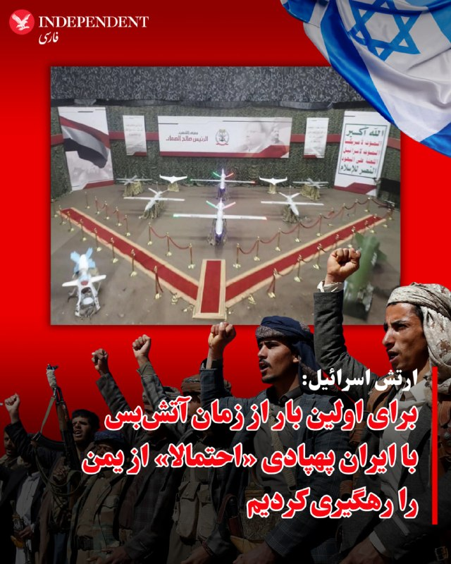

⭕️ارتش اسرائیل: برای اولین بار از زمان آتش‌بس با ایران پهپادی «احتمالا» از یمن را رهگیری کردیم

♦️ارتش اسرائیل بعدازظهر سه‌شنبه ۲۲ اردیبهشت اعلام کرد پدافند هوایی این کشور برای نخستین بار از زمان آتش‌بس با ایران، یک پهپاد که احتملا از یمن به‌پرواز درآمده را در آسمان بندر ایلات در جنوب این کشور رهگیری کرده است.

تایمز اسرائیل با انتشار این خبر از فعالیت پدافند هوایی بندر ایلات برای مقابله با این پهپاد خبر داد.

حوثی‌های یمن در هفته‌های پایانی پیش از آتش‌بس آمریکا و جمهوری اسلامی، پس از ماه‌ها شلیک موشک و پهپاد به اسرائیل را از سر گرفتند.
‌🇸🇦 Indypersian

🤖 @VahidOOnLine

## VahidOOnLine — post 239686

  <a href="telegram/content/VahidOOnLine_239686_1778589257.mp4" target="_blank">🎬 Download video</a>

جانان الماسی، شاعر حماسی و رقصنده، در گردهمایی سراسری ایرانیان در شهر کلن آلمان، قطعه‌ «سوگ سیاوش» را اجرا کرد.
این برنامه روز یکشنبه ۱۰ می برگزار شد.
‌🏁 🇬🇧 ManotoTV

🤖 @VahidOOnLine

## VahidOOnLine — post 239685

  <a href="telegram/content/VahidOOnLine_239685_1778589259.mp4" target="_blank">🎬 Download video</a>

آیلین وانگ، شهردار شهر آرکادیا در جنوب کالیفرنیا، پس از متهم شدن از سوی وزارت دادگستری آمریکا به فعالیت مخفیانه برای دولت چین، از سمت خود استعفا داد.
دادستانی آمریکا اعلام کرد وانگ متهم است به دستور مقام‌های چینی، مطالبی در حمایت از پکن را بدون ثبت رسمی به‌عنوان «عامل خارجی» منتشر کرده است. او پذیرفته که به اتهام جنایی مطرح‌شده اعتراف کند و ممکن است تا ۱۰ سال زندان محکوم شود.
به گفته مقام‌های آمریکایی، وانگ همراه با فردی دیگر سایتی خبری برای جامعه چینی‌تبارهای آمریکا اداره می‌کرده و برخی مطالب ارسالی مقام‌های چینی، از جمله درباره رد اتهام نقض حقوق بشر در سین‌کیانگ، را منتشر کرده است.
مدیر شهر آرکادیا گفت این پرونده مربوط به «رفتار فردی» وانگ بوده و هیچ‌یک از منابع یا تصمیم‌گیری‌های رسمی شهرداری درگیر این ماجرا نبوده‌اند.
‌🏁 🇬🇧 ManotoTV

🤖 @VahidOOnLine

## VahidOOnLine — post 239684

  <a href="telegram/content/VahidOOnLine_239684_1778589260.mp4" target="_blank">🎬 Download video</a>

⭕️وزیر خارجه ترکیه در قطر: از تلاش‌ها برای بازگشایی تنگه هرمز حمایت می‌کنیم

♦️هاکان فیدان، وزیر امور خارجه ترکیه روز سه‌شنبه ۲۲ اردیبهشت در نشست خبری مشترک با وزیر امور خارجه قطر در دوحه گفت نباید از تنگه هرمز به‌عنوان سلاح استفاده شود.
فیدان تاکید کرد که این کشور از تلاش‌ها برای بازگشایی این آبراه راهبردی بین‌المللی استقبال می‌کند.
وزیر امور خارجه ترکیه همچنین گفت که آنکارا و دوحه از روند مذاکرات اسلام‌آباد برای پایان دادن به جنگ حمایت می‌کنند.
‌🇸🇦 Indypersian

🤖 @VahidOOnLine

## VahidOOnLine — post 239683

  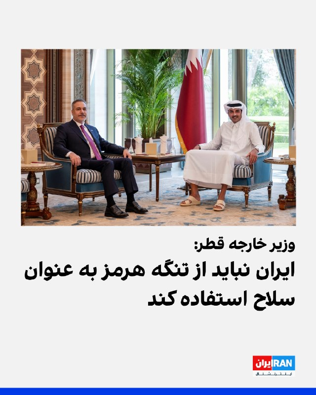

محمد بن عبدالرحمن آل ثانی، وزیر خارجه قطر، در نشست خبری با وزیر خارجه ترکیه گفت آنچه در تنگه هرمز در جریان است به کاهش تنش کمک نمی‌کند و جمهوری اسلامی نباید از این تنگه به‌عنوان سلاح استفاده کند.

او در ادامه با اشاره به سفر خود به آمریکا افزود این سفر عمدتا بر حمایت و همراهی با تلاش‌های پاکستان متمرکز بوده و نقش پاکستان برای منطقه و جهان بسیار مهم و تعیین‌کننده است.

محمد بن عبدالرحمن آل ثانی همچنین گفت قطر و ترکیه در حال هماهنگی تلاش‌ها هستند و از دیپلماسی پاکستان برای دستیابی به توافق در سریع‌ترین زمان ممکن حمایت می‌کنند.
‌🏁 🇬🇧 IranintlTV

🤖 @VahidOOnLine

## VahidOOnLine — post 239682

  <a href="telegram/content/VahidOOnLine_239682_1778589263.mp4" target="_blank">🎬 Download video</a>

محمد بن عبدالرحمن آل‌ثانی، نخست‌وزیر و وزیرخارجه قطر، در نشست خبری مشترک با هاکان فیدان، وزیر خارجه ترکیه، گفت دو کشور درباره شرایط بحرانی خاورمیانه در پی جنگ ایران گفت‌وگو کرده‌اند.
او گفت بحران تنگه هرمز باعث محدود شدن آزادی تردد دریایی شده و این آبراه عملاً به «سلاحی در این جنگ» تبدیل شده است.
نخست‌وزیر قطر افزود این وضعیت پیامدهای سنگینی، به‌ویژه اقتصادی، برای کشورهای حوزه خلیج فارس به همراه داشته است.
‌🏁 🇬🇧 ManotoTV

🤖 @VahidOOnLine

## VahidOOnLine — post 239681

  <a href="telegram/content/VahidOOnLine_239681_1778589264.mp4" target="_blank">🎬 Download video</a>

وزارت کشور کویت اعلام کرد چهار نفوذی وابسته به سپاه پاسداران جمهوری‌اسلامی را که قصد ورود دریایی به این کشور را داشتند، بازداشت کرده است.
خبرگزاری رسمی کویت گزارش داد در درگیری با این افراد، یکی از نیروهای مسلح کویت زخمی شده است.
‌🏁 🇬🇧 ManotoTV

🤖 @VahidOOnLine

## VahidOOnLine — post 239680

  <a href="telegram/content/VahidOOnLine_239680_1778589265.mp4" target="_blank">🎬 Download video</a>

شرکت ژاپنی «کالبی»، بزرگ‌ترین تولیدکننده چیپس در ژاپن، اعلام کرد به‌دلیل اختلال در زنجیره تأمین ناشی از جنگ آمریکا و اسرائیل با ایران، بسته‌بندی محصولاتش را تغییر می‌دهد.
این شرکت گفته از اواخر ماه جاری، بسته‌بندی ۱۴ محصول خود را به‌جای رنگ‌های معروف نارنجی و زرد، فقط با دو رنگ سیاه و سفید تولید خواهد کرد.
کالبی دلیل این تصمیم را «بی‌ثباتی در تأمین برخی مواد اولیه به‌دلیل تنش‌های فزاینده در خاورمیانه» اعلام کرده است.
رسانه‌های ژاپنی گزارش دادند کمبود نفتا، یکی از فرآورده‌های نفتی مورد استفاده در تولید جوهر چاپ، باعث اختلال در تأمین جوهر بسته‌بندی این شرکت شده است.
‌🏁 🇬🇧 ManotoTV

🤖 @VahidOOnLine

## VahidOOnLine — post 239679

  <a href="telegram/content/VahidOOnLine_239679_1778589265.mp4" target="_blank">🎬 Download video</a>

مایک هاکبی، سفیر آمریکا در اسرائیل، اعلام کرد اسرائیل برای کمک به دفاع امارات در جریان جنگ ایران، سامانه‌های پدافندی گنبد آهنین را به این کشور منتقل کرده است.
به گفته او، باتری‌های ضد موشکی و نیروهای عملیاتی این سامانه به امارات اعزام شده‌اند. امارات در سال ۲۰۲۰ و در چارچوب توافق ابراهیم، روابط دیپلماتیک با اسرائیل برقرار کرد.
هاکبی همچنین گفت نسبت به پیوستن کشورهای بیشتر منطقه به توافق عادی‌سازی روابط با اسرائیل خوش‌بین است.
او افزود کشورهای خلیج فارس اکنون باید انتخاب کنند که «احتمال حمله از سوی ایران بیشتر است یا اسرائیل». به گفته هاکبی، «اسرائیل به ما کمک کرد و ایران به ما حمله کرد».
‌🏁 🇬🇧 ManotoTV

🤖 @VahidOOnLine

## mwarmonitor — post 8970

  

🇺🇸ناو هواپیمابر USS Abraham Lincoln (CVN 72) به عملیات خود در دریای عرب ادامه می‌دهد، از جمله اجرای محاصره آمریکا علیه ایران. به گفته سنتکام، نیروهای آمریکایی ۶۵ کشتی تجاری را تغییر مسیر داده و ۴ کشتی را از کار انداخته‌اند.

@mwarmonitor

## mwarmonitor — post 8969

✈️🇺🇸«یونایتد ایرلاینز اعلام کرد که پروازهای خود به ونزوئلا را از ۱۱ آگوست از سر خواهد گرفت.»

@mwarmonitor

## mwarmonitor — post 8968

🇺🇸نیروی دریایی آمریکا روز دوشنبه اعلام کرد که ناو جنگی جدیدی که به نام رئیس‌جمهور ترامپ نام‌گذاری شده، هسته‌ای خواهد بود؛ اقدامی که انتظار می‌رود هزینه و پیچیدگی این پروژه چند میلیارد دلاری را افزایش دهد، پروژه‌ای که پیش‌تر نیز درباره عملی شدن ساخت آن تردیدهایی وجود داشت. WSJ

@mwarmonitor

## mwarmonitor — post 8967

  

✈️۳ فروند هواپیمای سوخت‌رسان هوایی KC-135R/T نیروی هوایی آمریکا در حال حاضر در نزدیکی تنگه هرمز در حال عملیات هستند.

@mwarmonitor

## mwarmonitor — post 8966

  

‼️یکی دیگه

## mwarmonitor — post 8964

🔸ترامپ دوباره این دو عکس در سوشال تروث منتشر کرده

@mwarmonitor

## mwarmonitor — post 8963

🇨🇺🇺🇸ترامپ: «کوبا درخواست کمک کرده و ما قرار است گفت‌وگو کنیم.»

@mwarmonitor

## mwarmonitor — post 8962

  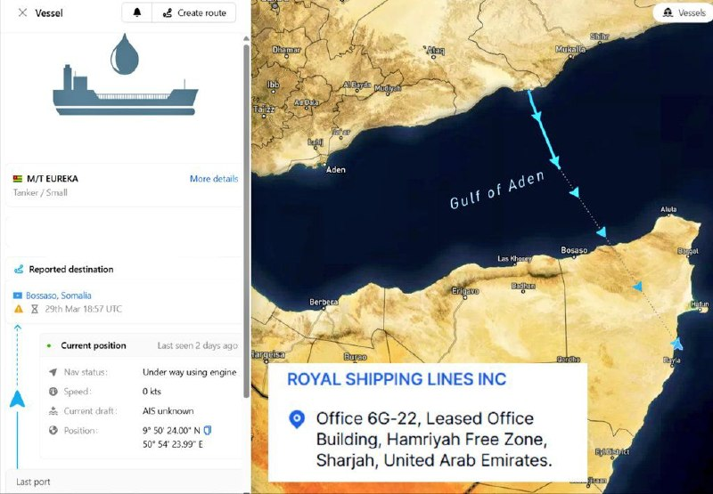

🔴دو هفته پیش، پس از آن‌که نفتکش M/T EUREKA هنگام عبور از Gulf of Aden توسط دزدان دریایی ناشناس ربوده شد، هشت ملوان مصری ربوده شدند.

📌این نفتکش متعلق به شرکت مستقر در امارات Royal Shipping Lines است و تحت پرچم Togo تردد می‌کند. همچنین مالک و مدیر آن در امارات متحده عربی مستقر است.

@mwarmonitor

## mwarmonitor — post 8960

🚨 (رویترز) — قیمت نفت روز سه‌شنبه بیش از ۳ درصد افزایش یافت، زیرا اختلافات شدید میان آمریکا و ایران بر سر پیشنهادی برای پایان دادن به جنگ در خاورمیانه، نگرانی‌ها درباره عرضه را بار دیگر به کانون توجه بازگرداند.

@mwarmonitor

## mwarmonitor — post 8959

🔴بر اساس گزارش Financial Times، خسارات واردشده به بزرگ‌ترین تأسیسات فرآوری گاز امارات متحده عربی در پی حملات ایران در ماه گذشته، ممکن است به‌طور کامل تا سال ۲۰۲۷ ترمیم نشود.

@mwarmonitor

## mwarmonitor — post 8958

🇺🇸🇺🇦بر اساس یک یادداشت تفاهم میان United States و Ukraine، چارچوب‌های یک توافق دفاعی جدید مشخص شده است که به اوکراین اجازه می‌دهد فناوری‌های نظامی خود را به آمریکا صادر کند و از طریق سرمایه‌گذاری‌های مشترک با شرکت‌های آمریکایی، پهپاد تولید کند. — CBS

@mwarmonitor

## pm_afshaa — post 90617

🔴ترامپ در Truth Social:هیچ جمهوری‌خواهی تاکنون درباره کوبا با من صحبت نکرده است، کشوری شکست‌خورده که فقط در یک جهت حرکت می‌کند - به سمت پایین

💧 Rainbet.com the #1 Non-KYC Crypto Casino & Sportsbook @rainbetcom

😁 @Pm_Afshaa

## pm_afshaa — post 90616

سفیر آمریکا تو اسرائیل : ترامپ قبل از انتخابات پیشرو به اسرائیل سفر میکنه

💧 Rainbet.com the #1 Non-KYC Crypto Casino & Sportsbook @rainbetcom

😁 @Pm_Afshaa

## pm_afshaa — post 90615

  <a href="telegram/content/pm_afshaa_90615_1778589269.webm" target="_blank">🎬 Download video</a>

فیلترشکن v2rayپرسرعت ‼️
                                                    

✅ مناسب برای تمام اینترنت‌ها (همراه اول ایرانسل رایتل اینترنت خانگی و ..)

✅ قابل استفاده برای تمام سیستم عامل ها 

😎 ضمانت بازگشت وجه در صورت عدم اتصال

✅ پشتیبانی ۲۴ ساعته تا آخرین مدت اعتبار اشتراک   
  

😎 اشتراک 10 گیگ 😎

✅ فقط و فقط 1/500/000 ✅

👩‍💻 آیدی ثبت سفارش✨پشتیبانی #خریدوفروش : 👇
@SuportSevenStarsVpn

لینک ورود به کانال اصلی:
            
 https://t.me/sevenstars_VPN

## pm_afshaa — post 90614

  <a href="telegram/content/pm_afshaa_90614_1778589270.webm" target="_blank">🎬 Download video</a>

🔴فاکس‌نیوز: در صورت شکست مذاکرات و تشدید بحران، برخی مقام‌های ارشد جمهوری اسلامی ممکنه به روسیه فرار کنن و مقام‌های رده‌پایین‌تر به کشورهایی مثل عراق یا افغانستان پناه ببرن.

💧 Rainbet.com the #1 Non-KYC Crypto Casino & Sportsbook @rainbetcom

😁 @Pm_Afshaa

## pm_afshaa — post 90613

🔴اسرائیل هیوم: هزاران اسرائیلی پیام‌های تهدیدآمیزی از هکرهای وابسته به جمهوری اسلامی ایران دریافت کردن که از شهروندان خواسته شده با جمهوری اسلامی ایران همکاری اطلاعاتی کنن

💧 Rainbet.com the #1 Non-KYC Crypto Casino & Sportsbook @rainbetcom

😁 @Pm_Afshaa

## pm_afshaa — post 90612

بقایی:اول باید داستان تنگه هرمز و پایان جنگ مشخص بشود تا راهی برای مذاکره در مورد انرژی هسته‌ای هم به وجود بیاید

💧 Rainbet.com the #1 Non-KYC Crypto Casino & Sportsbook @rainbetcom

😁 @Pm_Afshaa

## iaghapour — post 2601

⭕️ عصبانیت سخنگوی دولت از انتقاد خبرنگاران از قطع اینترنت

فاطمه مهاجرانی در نشست خبری امروز خود به اعتراض خبرنگاران بابت ادامه قطعی اینترنت واکنش نشان داد.
سخنگوی دولت گفت: «در شرایطی که رئیس جمهور آمریکا اعلام می‌کند آتش بس به دستگاه تنفس مصنوعی وصل است، پاسخ شما چیست؟ کشور در جنگ است. بپذیریم که ویژگی جنگ، امنیت مردم است.»

✍🏻 پ.ن: خانم مهاجرانی اگه دوباره عصبی نمیشید خواستم بگم کاش به فکر امنیت اقتصادی مردم هم بودید! کاش به فکر امنیت ذهنی و روانی مردم هم بودید! کاش یه فکری برای چند میلیون آدمی که با قطعی اینترنت بیکار و ناامید کردین هم بودید!

🆔 @iaghapour

## DEJradio — post 4590

  <a href="telegram/content/DEJradio_4590_1778589271.mp4" target="_blank">🎬 Download video</a>

🤡
🔺 ظهره‌وند نماینده مجلس:
میشه کارهایی کرد که بمب اتم جلوش بچه‌بازیه!

ابوالفضل ظهره‌وند عضو دیگر کمیسیون امنیت ملی مجلس شورای اسلامی، مدعی شده است، «تولید بمب کاری نداره، وقتی شما اراده داشته باشی می‌توانی پلاسما و سلاح‌هایی داشته باشی که بمب اتم جلوش ترقه باشه؛ تاثیر تنگه هرمز، باب المندب و جبهه مقاومت از صد تا بمب اتم بیشتره، البته این تضادی هم با دیگر مسائل ندارد.»

او همچنین گفته «من جاها و ظرفیت‌هایی رو دیدم که اتفاقی میوفته که بمب اتم جلوش ترقه است، شما میتونید زمان رو پشت سر بزارید، چیزی که در چند ثانیه از تهران تا واشنگتن برود، میشه یه کارهایی کرد که بمب اتم جلوش بچه بازیه!»

#بمب_اتم #تنگه_هرمز
@DEJradio

## DEJradio — post 4589

  <a href="telegram/content/DEJradio_4589_1778589273.mp4" target="_blank">🎬 Download video</a>

🔺🎥 “این قیافه پیروزیه که سـ.ـپاه میگه، هیچی نداریم!

#IRGCterrorists #تورم
@DEJradio

## DEJradio — post 4588

  <a href="telegram/content/DEJradio_4588_1778589275.webm" target="_blank">🎬 Download video</a>

🚨📢 ادعای وزارت خارجه پاکستان:
هواپیماهای ایرانی «موقت» در پاکستان مستقر هستند

سی‌بی‌اس گزارش داده بود که جمهوری اسلامی بخشی از ناوگان نیروی هوایی [تجاری و نظامی] خود را در طی جنگ ۴۰ روزه به پایگاه هوایی «نورخان» پاکستان منتقل کرده بود. در واکنش به این گزارش وزارت خارجه پاکستان به طور رسمی این گزارش را «گمراه‌کننده» خواند و تأکید کرد که این هواپیماها صرفاً برای تسهیل رفت‌وآمد دیپلمات‌ها و به صورت موقت مستقر شده‌اند.
در بیانیه وزارت خارجه پاکستان آمده «هواپیماهای نظامی ایران نه برای مصون ماندن از حملات آمریکا که در انتظار دورهای بعدی مذاکرات، در پایگاه نورخان مانده‌اند.»

همچنین تأکید شده، «هواپیماهای ایرانی که هم‌اکنون در خاک ما هستند، به هیچ گونه ترتیبات نظامی مرتبط نمی‌باشند». پاکستان همچنین تصریح کرد که ارتباط منظم خود را با همه طرف‌های ذی‌نفع حفظ کرده و متعهد است از تمامی تلاش‌هایی که به تقویت گفت‌وگو، کاهش تنش و پیشبرد صلح کمک می‌کند، حمایت کند.
در جریان جنگ ۱۲ روزه نیز نیروی هوایی جمهوری اسلامی بخشی از ناوگان خود را به پاکستان منتقل کرده بود تا کمتر آسیب ببینند.

#جنگ۴۰روزه #جمهوری_اسلامی #جنگ۱۲روزه
@DEJradio

## DEJradio — post 4586

  <a href="telegram/content/DEJradio_4586_1778589276.webm" target="_blank">🎬 Download video</a>

🔺📢 "نظامی‌های وطن‌دوست به مردم آموزش میدانی بدهند

شهاب عنایتی از پرسنل پیشین ارتش

#ارتش #گارد_جاویدان
@DEJradio

## mamlekate — post 103512

  <a href="telegram/content/mamlekate_103512_1778589276.mp4" target="_blank">🎬 Download video</a>

📝 حسین افشین، معاون علمی و فناوری مسعود پزشکیان، با اشاره به اینکه «در شرایط جنگی هم بستن اینترنت نمی‌تواند راهکار باشد» گفت: «دیدیم وقتی اینترنت کاملا بسته بود، ترورها همچنان وجود داشت.»

💎 پیشتر: ترور لاریجانی:
t.me/mamlekate/103477

## IranIntlTV — post 336808

  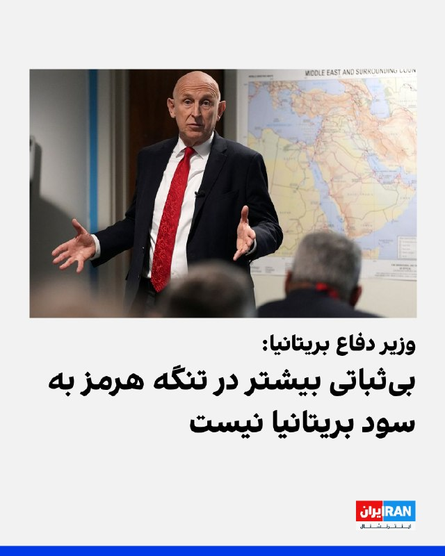

جان هیلی، وزیر دفاع بریتانیا، با اشاره به برگزاری نشستی درباره تامین امنیت کشتیرانی در تنگه هرمز گفت: «بی‌ثباتی بیشتر به سود بریتانیا نیست. اکنون باید تمام تمرکز ما بر رسیدگی به چالش‌های فوری اقتصادی و امنیتی باشد.»

او افزود سه‌شنبه ریاست مشترک نشست ۴۰ وزیر دفاع را با هدف جلب حمایت از ماموریت تحت رهبری بریتانیا برای تامین امنیت کشتیرانی در تنگه هرمز بر عهده خواهد داشت.

جان هیلی در شبکه ایکس نوشت مردم نگران درگیری‌های کنونی و بحران‌های جهانی پیش‌رو هستند و انتظار دارند دولت، همان‌گونه که نخست‌وزیر عمل می‌کند، کشور را از این شرایط عبور دهد.

او تاکید کرد بریتانیا مشارکت‌های نظامی خود در این ماموریت را اعلام خواهد کرد و افزود بی‌ثباتی بیشتر به سود بریتانیا نیست و دولت باید بر چالش‌های فوری اقتصادی و امنیتی تمرکز کند.

وزیر دفاع بریتانیا همچنین نوشت دولت باید برای بازگرداندن امنیت اقتصادی خانواده‌ها در داخل کشور اقدام کند.
https://iranintl.com/202605123953

## IranIntlTV — post 336807

  <a href="telegram/content/IranIntlTV_336807_1778589278.mp4" target="_blank">🎬 Download video</a>

وزارت کشور کویت اعلام کرد چهار عضو وابسته به سپاه پاسداران انقلاب اسلامی را که از راه دریا به جزیره بوبیان در خاک این کشور نفوذ کرده بودند، بازداشت کرد. در جریان درگیری با این افراد نیز یک عضو نیروهای مسلح کویت زخمی شده است.
جزییات بیشتر با تروسکه صادقی، خبرنگار ایران‌اینترنشنال
@iranintltv

## IranIntlTV — post 336806

  <a href="telegram/content/IranIntlTV_336806_1778589280.mp4" target="_blank">🎬 Download video</a>

به گفته باستان شناسان عراق روند مرمت زیگورات باستانی اور در استان ذی‌قار همچنان ادامه دارد. در این مرحله ابتدا نمای بیرونی این بنای تاریخی و سه راه‌پله طبقه اول در حال بازسازی است و مرمت طبقه دوم، به‌ویژه بخش‌های شمال‌غربی و جنوب‌شرقی، به‌صورت کامل انجام می‌شود.
@iranintltv

## IranIntlTV — post 336805

  <a href="telegram/content/IranIntlTV_336805_1778589282.mp4" target="_blank">🎬 Download video</a>

سازمان بهداشت جهانی اعلام کرد چند مورد ابتلا به ویروس هانتا در یک کشتی تفریحی تایید شده و ۳ نفر جان باختند. هانتاویروس خانواده‌ای از ویروس‌هاست که معمولا در جوندگان، از جمله موش‌ها، دیده می‌شود. این ویروس‌ها می‌توانند از طریق فضولات، ادرار یا بزاق جوندگان آلوده وارد محیط شوند و انسان را مبتلا کنند.
@iranintltv

## IranIntlTV — post 336804

  <a href="telegram/content/IranIntlTV_336804_1778589284.mp4" target="_blank">🎬 Download video</a>

تحریم‌های جدید استرالیا، بریتانیا و آمریکا علیه افراد و نهادهای مرتبط با سپاه پاسداران

@iranintltv

## IranIntlTV — post 336803

  

محمد بن عبدالرحمن آل ثانی، وزیر خارجه قطر، در نشست خبری با وزیر خارجه ترکیه گفت آنچه در تنگه هرمز در جریان است به کاهش تنش کمک نمی‌کند و جمهوری اسلامی نباید از این تنگه به‌عنوان سلاح استفاده کند.

او در ادامه با اشاره به سفر خود به آمریکا افزود این سفر عمدتا بر حمایت و همراهی با تلاش‌های پاکستان متمرکز بوده و نقش پاکستان برای منطقه و جهان بسیار مهم و تعیین‌کننده است.

محمد بن عبدالرحمن آل ثانی همچنین گفت قطر و ترکیه در حال هماهنگی تلاش‌ها هستند و از دیپلماسی پاکستان برای دستیابی به توافق در سریع‌ترین زمان ممکن حمایت می‌کنند.
https://iranintl.com/202605125826

## IranIntlTV — post 336802

  <a href="telegram/content/IranIntlTV_336802_1778589286.mp4" target="_blank">🎬 Download video</a>

هفتادونهمین دوره جشنواره فیلم کن، سه‌شنبه در جنوب فرانسه آغاز می‌شود. اصغر فرهادی نیز با فیلم «داستان‌های موازی» در بخش مسابقه اصلی این جشنواره حضور دارد.

لی‌لی نیکفر، خبرنگار ایران‌اینترنشنال، گزارش می‌دهد
@iranintltv

## IranIntlTV — post 336801

🔻آیا عملیات ویژه اسرائیل در سوریه می‌تواند الگوی انتقال ذخایر اورانیوم از ایران باشد؟

روزنامه معاریو در مطلبی با اشاره به اظهارات اخیر بنیامین نتانیاهو، احتمال انجام شدن عملیاتی از سوی اسرائیل برای خارج کردن ذخایر اورانیوم جمهوری اسلامی را مورد بررسی قرار داد و به جزییات یکی از نمونه‌های تاریخی مشابه پرداخت.

نخست‌وزیر اسرائیل ۲۱ اردیبهشت در گفت‌وگو با شبکه سی‌بی‌اس اعلام کرد در صورت دستیابی به توافقی با تهران، خارج کردن مواد هسته‌ای جمهوری اسلامی «کاملا امکان‌پذیر» است.

نتانیاهو در پاسخ به پرسشی درباره احتمال استفاده از زور برای جابه‌جایی ذخایر اورانیوم حکومت ایران در صورت شکست مذاکرات گفت نمی‌تواند درباره گزینه‌ها و عملیات نظامی احتمالی اظهار نظر کند.

معاریو سه‌شنبه ۲۲ اردیبهشت نوشت با وجود پاسخ مبهم نتانیاهو، ارتش اسرائیل سابقه اجرای «عملیات‌های ویژه در عمق خاک دشمن» را در کارنامه خود دارد.

بر اساس این گزارش، نیروهای واحد شلدگ هشتم سپتامبر ۲۰۲۴ در عملیاتی ویژه در خاک سوریه، به یک سایت زیرزمینی تولید موشک در منطقه مصیاف یورش بردند و آن را منهدم کردند.

واحد شلدگ، نیروی ویژه نخبه وابسته به نیروی هوایی اسرائیل است که ماموریت‌هایی چون نفوذ، شناسایی و عملیات مخفی در عمق خاک دشمن را انجام می‌دهد.

۲۱ اردیبهشت، دونالد ترامپ، رییس‌جمهوری آمریکا، پاسخ تهران به پیشنهاد واشینگتن را «آشغال» و «بسیار ضعیف» توصیف کرد و شانس پایداری آتش‌بس موقت را «حدود یک درصد» دانست.

در روزهای اخیر گمانه‌زنی‌ها درباره احتمال ازسرگیری کارزار نظامی ایالات متحده و اسرائیل علیه جمهوری اسلامی بالا گرفته است.
جزییات عملیات پیچیده ارتش اسرائیل در مصیاف

معاریو نوشت سازمان اطلاعات نظامی اسرائیل طی سال‌ها رصد، این سایت زیرزمینی را شناسایی کرد. تاسیساتی که با حمایت مالی جمهوری اسلامی برای تولید موشک‌های دقیق و راکت‌های دوربرد ساخته شده بود.

این تاسیسات زیرزمینی، پروژه‌ای راهبردی در چارچوب تلاش تهران برای تجهیز حزب‌الله و دیگر نیروهای نیابتی خود در مرز شمالی اسرائیل بود که در جریان این عملیات منهدم شد.

در ماه‌های منتهی به عملیات، طرح نابودی این مجموعه با مشارکت نیروی هوایی اسرائیل تدوین شد و نیروها با بالگرد، تحت پوشش آتش و پشتیبانی پهپادها، جنگنده‌ها و شناورهای نیروی دریایی، در منطقه فرود آمدند.

دقایقی پیش از فرود نیروهای اسرائیلی در خاک سوریه، تاسیسات تولید موشک‌های زمین‌به‌زمین هدف قرار گرفت و مواضع امنیتی اطراف آن از بین رفت.

بالگردهای حامل بیش از ۱۰۰ نیروی واحد شلدگ در فاصله حدود ۷۰۰ متری هدف به زمین نشستند و پس از درگیری با نیروهای دشمن، مسیر ورود به تونل‌ها و اتاق‌های حفرشده در دل کوه هموار شد.

این مجموعه که ساخت آن از اواخر سال ۲۰۱۷ کلید خورده بود، در عمق یک کوه و در میان دره‌ای با عمق حدود ۱۰۰ متر بنا شده بود و ساختاری نعل‌اسبی با دو خروجی اصلی داشت.
به‌دلیل موقعیت جغرافیایی و عوارض طبیعی منطقه مصیاف سوریه، نیروهای اسرائیلی توانستند به سرعت محدوده عملیات را تحت کنترل درآورند و از هر گونه دخالت نیروهای متخاصم جلوگیری کنند.

نیروهای اسرائیلی پس از شکستن درها، حجم زیادی از مواد منفجره را در اتاق‌های مجموعه کار گذاشتند. در مجموع، ۳۰۰ کیلوگرم مواد منفجره به‌همراه مهمات موجود در سایت، انفجاری معادل حدود یک تُن مهمات ایجاد کرد.

در این عملیات، نظامیان اسرائیلی به تجهیزات کلیدی در تولید موشک‌های دقیق، از جمله یک میکسر سیاره‌ای، دست یافتند و همچنین مقادیری سلاح و اسناد اطلاعاتی را ضبط کردند.

پس از انفجار گسترده‌ای که به نابودی کامل سایت انجامید و شدت آن همچون زمین‌لرزه احساس شد، نیروها از مسیر تخلیه به سوی بالگردها حرکت کردند.
🔗 ادامه گزارش را اینجا بخوانید
@iranintltv

## IranIntlTV — post 336800

  <a href="telegram/content/IranIntlTV_336800_1778589288.mp4" target="_blank">🎬 Download video</a>

دفتر کنترل دارایی‌های خارجی وزارت خزانه‌داری آمریکا ۱۲ فرد و شرکت را به‌دلیل نقش داشتن در تسهیل فروش و انتقال نفت ایران از سوی سپاه پاسداران انقلاب اسلامی به جمهوری خلق چین تحریم کرد.

گفت‌وگو با آرش آزرمی، دبیر بخش اقتصادی ایران‌اینترنشنال

@iranintltv

## IranIntlTV — post 336799

  <a href="telegram/content/IranIntlTV_336799_1778589291.mp4" target="_blank">🎬 Download video</a>

مروری بر روزنامه‌های ایران، سه‌شنبه ۲۲ اردیبهشت، با مجتبی هاشمی، روزنامه‌نگار
@iranintltv

## IranIntlTV — post 336798

  <a href="telegram/content/IranIntlTV_336798_1778589293.mp4" target="_blank">🎬 Download video</a>

سرخط خبرهای سه‌شنبه ۲۲ اردیبهشت
@iranintltv

## IranIntlTV — post 336797

  <a href="telegram/content/IranIntlTV_336797_1778589295.mp4" target="_blank">🎬 Download video</a>

یک شهروند با ارسال پیامی به ایران‌اینترنشنال می‌گوید هزینه برق در کمتر از یک سال حدود ۲۰۰ درصد افزایش یافته است.

## IranIntlTV — post 336796

  <a href="telegram/content/IranIntlTV_336796_1778589297.mp4" target="_blank">🎬 Download video</a>

شمار نمایندگان حزب کارگر که خواهان کناره‌گیری کی‌یر استارمر از سمت نخست‌وزیری بریتانیا شدند، به بیش از ۸۰ نفر رسید. این درخواست‌ پس از شکست سنگین این حزب در انتخابات شوراهای محلی بریتانیا مطرح شد.

گفت‌وگو با تاج‌الدین سروش، عضو تحریریه ایران‌اینترنشنال

@iranintltv

## Shin_Persian — post 5964

  

U.S. Central Command ✓ @CENTCOM
Tue, 12 May 2026 12:23:13 UTC

USS Abraham Lincoln (CVN 72) continues operations in the Arabian Sea, including enforcement of the U.S. blockade against Iran. CENTCOM forces have redirected 65 commercial vessels and disabled 4.

فارسی

ناو هواپیمابر یواس‌اس آبراهام لینکلن (سی‌وی‌ان ۷۲) به عملیات‌های خود در دریای عرب، از جمله اجرای محاصره ایالات متحده علیه ایران، ادامه می‌دهد. نیروهای سنتکام (فرماندهی مرکزی ایالات متحده) ۶۵ کشتی تجاری را تغییر مسیر داده و ۴ کشتی را از کار انداخته‌اند.

𝕏 · @shin_persian

## ManotoTV — post 105344

  <a href="telegram/content/ManotoTV_105344_1778589299.mp4" target="_blank">🎬 Download video</a>

مونترال‌ | کانادا؛ گردهمایی ایرانیان

## ManotoTV — post 105343

  <a href="telegram/content/ManotoTV_105343_1778589301.mp4" target="_blank">🎬 Download video</a>

جانان الماسی، شاعر حماسی و رقصنده، در گردهمایی سراسری ایرانیان در شهر کلن آلمان، قطعه‌ «سوگ سیاوش» را اجرا کرد.
این برنامه روز یکشنبه ۱۰ می برگزار شد.

## ManotoTV — post 105342

  <a href="telegram/content/ManotoTV_105342_1778589303.mp4" target="_blank">🎬 Download video</a>

آیلین وانگ، شهردار شهر آرکادیا در جنوب کالیفرنیا، پس از متهم شدن از سوی وزارت دادگستری آمریکا به فعالیت مخفیانه برای دولت چین، از سمت خود استعفا داد.
دادستانی آمریکا اعلام کرد وانگ متهم است به دستور مقام‌های چینی، مطالبی در حمایت از پکن را بدون ثبت رسمی به‌عنوان «عامل خارجی» منتشر کرده است. او پذیرفته که به اتهام جنایی مطرح‌شده اعتراف کند و ممکن است تا ۱۰ سال زندان محکوم شود.
به گفته مقام‌های آمریکایی، وانگ همراه با فردی دیگر سایتی خبری برای جامعه چینی‌تبارهای آمریکا اداره می‌کرده و برخی مطالب ارسالی مقام‌های چینی، از جمله درباره رد اتهام نقض حقوق بشر در سین‌کیانگ، را منتشر کرده است.
مدیر شهر آرکادیا گفت این پرونده مربوط به «رفتار فردی» وانگ بوده و هیچ‌یک از منابع یا تصمیم‌گیری‌های رسمی شهرداری درگیر این ماجرا نبوده‌اند.

## ManotoTV — post 105341

  <a href="telegram/content/ManotoTV_105341_1778589304.mp4" target="_blank">🎬 Download video</a>

محمد بن عبدالرحمن آل‌ثانی، نخست‌وزیر و وزیرخارجه قطر، در نشست خبری مشترک با هاکان فیدان، وزیر خارجه ترکیه، گفت دو کشور درباره شرایط بحرانی خاورمیانه در پی جنگ ایران گفت‌وگو کرده‌اند.
او گفت بحران تنگه هرمز باعث محدود شدن آزادی تردد دریایی شده و این آبراه عملاً به «سلاحی در این جنگ» تبدیل شده است.
نخست‌وزیر قطر افزود این وضعیت پیامدهای سنگینی، به‌ویژه اقتصادی، برای کشورهای حوزه خلیج فارس به همراه داشته است.

## ManotoTV — post 105340

  <a href="telegram/content/ManotoTV_105340_1778589305.mp4" target="_blank">🎬 Download video</a>

وزارت کشور کویت اعلام کرد چهار نفوذی وابسته به سپاه پاسداران جمهوری‌اسلامی را که قصد ورود دریایی به این کشور را داشتند، بازداشت کرده است.
خبرگزاری رسمی کویت گزارش داد در درگیری با این افراد، یکی از نیروهای مسلح کویت زخمی شده است.

## ManotoTV — post 105339

  <a href="telegram/content/ManotoTV_105339_1778589305.mp4" target="_blank">🎬 Download video</a>

شرکت ژاپنی «کالبی»، بزرگ‌ترین تولیدکننده چیپس در ژاپن، اعلام کرد به‌دلیل اختلال در زنجیره تأمین ناشی از جنگ آمریکا و اسرائیل با ایران، بسته‌بندی محصولاتش را تغییر می‌دهد.
این شرکت گفته از اواخر ماه جاری، بسته‌بندی ۱۴ محصول خود را به‌جای رنگ‌های معروف نارنجی و زرد، فقط با دو رنگ سیاه و سفید تولید خواهد کرد.
کالبی دلیل این تصمیم را «بی‌ثباتی در تأمین برخی مواد اولیه به‌دلیل تنش‌های فزاینده در خاورمیانه» اعلام کرده است.
رسانه‌های ژاپنی گزارش دادند کمبود نفتا، یکی از فرآورده‌های نفتی مورد استفاده در تولید جوهر چاپ، باعث اختلال در تأمین جوهر بسته‌بندی این شرکت شده است.

## ManotoTV — post 105338

  <a href="telegram/content/ManotoTV_105338_1778589306.mp4" target="_blank">🎬 Download video</a>

مایک هاکبی، سفیر آمریکا در اسرائیل، اعلام کرد اسرائیل برای کمک به دفاع امارات در جریان جنگ ایران، سامانه‌های پدافندی گنبد آهنین را به این کشور منتقل کرده است.
به گفته او، باتری‌های ضد موشکی و نیروهای عملیاتی این سامانه به امارات اعزام شده‌اند. امارات در سال ۲۰۲۰ و در چارچوب توافق ابراهیم، روابط دیپلماتیک با اسرائیل برقرار کرد.
هاکبی همچنین گفت نسبت به پیوستن کشورهای بیشتر منطقه به توافق عادی‌سازی روابط با اسرائیل خوش‌بین است.
او افزود کشورهای خلیج فارس اکنون باید انتخاب کنند که «احتمال حمله از سوی ایران بیشتر است یا اسرائیل». به گفته هاکبی، «اسرائیل به ما کمک کرد و ایران به ما حمله کرد».

## FarsiVOA — post 217528

🔺انتشار گزارشی از «وحشیگری جنسی» حماس علیه شهروندان اسرائیل در حمله تروریستی ۷ اکتبر

▪️اسرائیل با انتشار گزارشی هزاران سند و مدرک از اقدامات جنایت‌کارانه حماس در حمله تروریستی ۷ اکتبر علیه شهروندان اسرائیلی را منتشر کرد.

⬇️ بیشتر بخوانید:

https://ir.voanews.com/a/hamas-israel-crime-hostage-iran/8149158.html/?nocach=1

## FarsiVOA — post 217527

  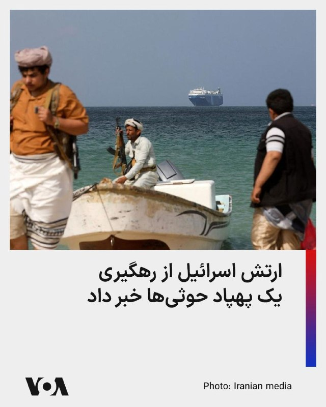

ارتش اسرائیل اعلام کرد نیروی هوایی این کشور یک پهپاد را که به گفته آن «از شرق» به سمت اسرائیل پرتاب شده بود، در نزدیکی شهر ایلات رهگیری کرده است.
تایمز اسرائیل به نقل از ارتش اسرائیل گزارش داد منشأ این پهپاد هنوز در دست بررسی است، اما مقام‌های نظامی اسرائیل احتمال می‌دهند از یمن شلیک شده باشد.
بر اساس این گزارش، در جریان این رهگیری آژیر خطر در ایلات فعال نشد و ارتش اسرائیل گفته است این اقدام «بر اساس پروتکل» انجام شده است.
تایمز اسرائیل نوشت این نخستین حمله پهپادی به سمت ایلات از زمان اجرایی شدن آتش‌بس‌های مربوط به ایران و لبنان در ماه گذشته است. حوثی‌های مورد حمایت جمهوری اسلامی در جریان جنگ، چندین موشک و پهپاد به سمت اسرائیل شلیک کرده بودند.

## FarsiVOA — post 217526

  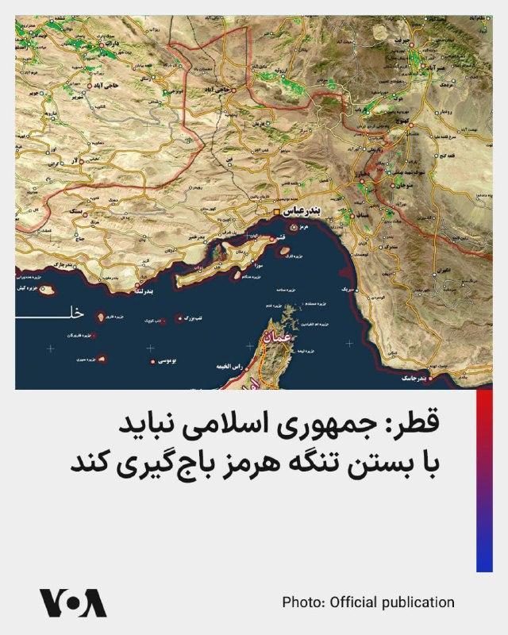

⚡️محمد بن عبدالرحمن آل ثانی، نخست‌وزیر و وزیر امور خارجه قطر، گفت جمهوری اسلامی نباید از تنگه هرمز به عنوان ابزاری برای فشار یا «باج‌گیری» از کشورهای خلیج فارس استفاده کند.

او روز سه‌شنبه در نشست خبری مشترک با هاکان فیدان، وزیر امور خارجه ترکیه، در دوحه گفت: «ایران نباید از این تنگه به عنوان سلاحی برای فشار یا باج‌گیری از کشورهای خلیج فارس استفاده کند.» وزیر خارجه قطر افزود آنچه در تنگه هرمز در جریان است، به کاهش تنش در منطقه کمک نمی‌کند.

هاکان فیدان نیز در همین نشست گفت ترکیه از تلاش‌ها برای بازگشایی تنگه هرمز حمایت می‌کند و این گذرگاه نباید در جریان جنگ ایران به عنوان «سلاح» استفاده شود.

وزیر خارجه ترکیه همچنین گفت آنکارا در تلاش‌هایی که به رهبری پاکستان برای یافتن راه‌حل مذاکره‌شده میان ایران و آمریکا جریان دارد، مشارکت می‌کند.

## FarsiVOA — post 217525

  <a href="telegram/content/FarsiVOA_217525_1778589307.mp4" target="_blank">🎬 Download video</a>

ورود گروهی از اوگاندا به جمع حامیان حکومت در تجمعات شبانه تهران؛

ویدیوهای منتشر شده در شبکه‌های اجتماعی حاکی از ورود شماری از شیعیان اوگاندا به ایران و شرکت آنها در تجمعات شبانه حامیان حکومت در خیابان‌های تهران است.
@FarsiVOA

## FarsiVOA — post 217524

  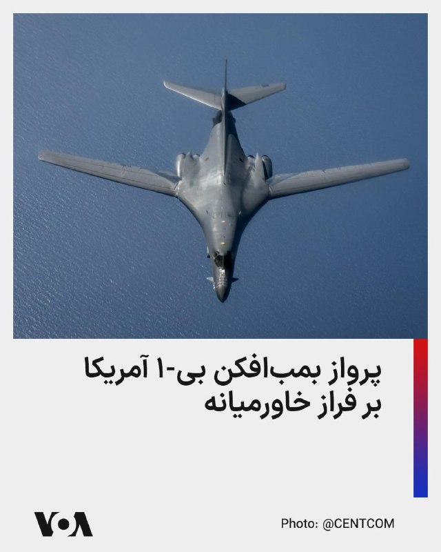

فرماندهی مرکزی ایالات متحده، سنتکام، تصویری از پرواز یک بمب‌افکن بی-۱ لنسر نیروی هوایی آمریکا بر فراز خاورمیانه در جریان یک ماموریت آموزشی را منتشر کرد. سنتکام اعلام کرد این پرواز روز ۹ مه انجام شد.

@FarsiVOA

## FarsiVOA — post 217522

  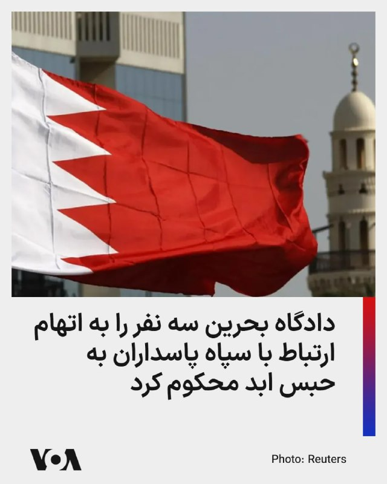

دادگاه عالی کیفری بحرین سه نفر، شامل دو مرد و یک زن، را در دو پرونده جداگانه به اتهام ارتباط با سپاه پاسداران جمهوری اسلامی و تلاش برای انجام اقدامات «خصمانه و تروریستی» علیه بحرین، به حبس ابد محکوم کرد.

خبرگزاری رسمی بحرین اعلام کرد دو متهم مرد به ارتباط با سپاه پاسداران با هدف اجرای عملیات علیه بحرین محکوم شده‌اند. دادگاه همچنین هر یک از آنان را به پرداخت ۱۰ هزار دینار بحرین جریمه و دستور مصادره اقلام ضبط‌شده را صادر کرده است.

دادستانی بحرین می‌گوید تحقیقات نشان داده سرویس‌های اطلاعاتی ایران و سپاه پاسداران از اعضای گروه‌هایی مستقر در ایران خواسته بودند تأسیسات حیاتی در بحرین را برای حملات احتمالی و بی‌ثبات‌سازی این کشور شناسایی کنند.

در پرونده‌ای جداگانه، یک زن نیز به اتهام تلاش برای همکاری با سپاه پاسداران محکوم شده است. دادستانی می‌گوید او با استفاده از حسابی در شبکه‌های اجتماعی، تصاویر و مختصات مراکز حساس بحرین را منتشر کرده بود. جزئیات مستقل درباره روند دادرسی و هویت متهمان منتشر نشده است.
@FarsiVOA

## FarsiVOA — post 217521

  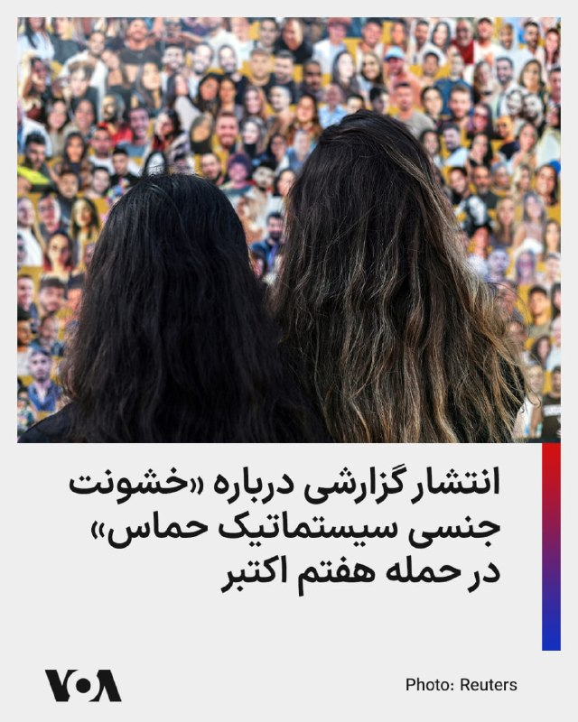

«کمیته مدنی برای مستندسازی و بررسی جنایات حماس» گزارشی تکان‌دهنده بر اساس ۱۰ هزار مدرک درباره «وحشیگری و خشونت جنسی سیستماتیک حماس» را منتشر کرد.

این گزارش ۲۵۰ صفحه‌ای، جزئیات جنایات جنسی و فجایع هولناکی را که شبه‌نظامیان حماس علیه قربانیان در جریان حمله ۷ اکتبر و دوره‌های اسارت پس از آن مرتکب شده‌اند، شرح می‌دهد.

این گزارش بر پایه مدارکی از جمله عکس، فیلم و شهادت آسیب‌شناسان و امدادگران تدوین شده و تصویری هولناک از خشونت سیستماتیک و وحشیانه‌ای که توسط اعضای حماس علیه زنان، مردان و کودکان انجام شده، ارائه می‌دهد.

همچنین این گزارش تأیید می‌کند که عاملان، مرتکب تخلفات تصادفی نشده‌اند، بلکه ۱۳ الگوی خشونت جنسی، از جمله تجاوز گروهی، برهنگی اجباری و مثله کردن عمدی اجساد را به کار گرفته‌اند.

در یکی از وحشتناک‌ترین شهادت‌های مستند شده در این گزارش، اعضای یک خانواده مجبور شدند با زور اسلحه و در تلاشی سادیستی برای خرد کردن کرامت انسانی، اعمال جنسی علیه یکدیگر انجام دهند.

بر اساس این گزارش، این وحشیگری محدود به یک مکان واحد نبود، بلکه در جشنواره‌های موسیقی، کیبوتص‌ها و پایگاه‌های نظامی نیز رخ داد.
@FarsiVOA

## FarsiVOA — post 217520

  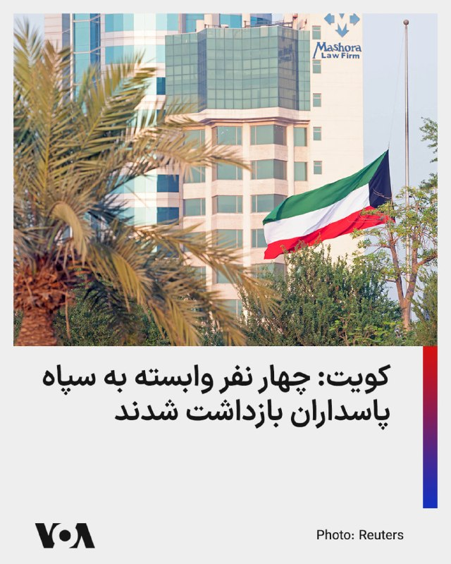

وزارت کشور کویت از بازداشت چهار نفر وابسته به سپاه پاسداران خبر داد و اعلام کرد که این افراد در تلاش بودند از راه دریا وارد کویت شوند.

وزارت کشور کویت روز سه‌شنبه اعلام کرد در جریان درگیری با این نفوذی‌ها، یکی از نیروهای مسلح کویت زخمی شده است.

چند روز پیش نیز با وجود برقراری آتش‌بس، کویت از شناسایی چند پهپاد «متخاصم» در حریم هوایی خود و مقابله با آن‌ها خبر داد.

رویترز پیشتر نوشت با وجود توافق آتش‌بس، در همان روز نخست همچنان درگیری‌هایی جریان داشت و کشورهای حاشیه خلیج فارس، از جمله کویت، بحرین و امارات، از حملات موشکی و پهپادی گزارش داده بودند.
@FarsiVOA

## FarsiVOA — post 217519

  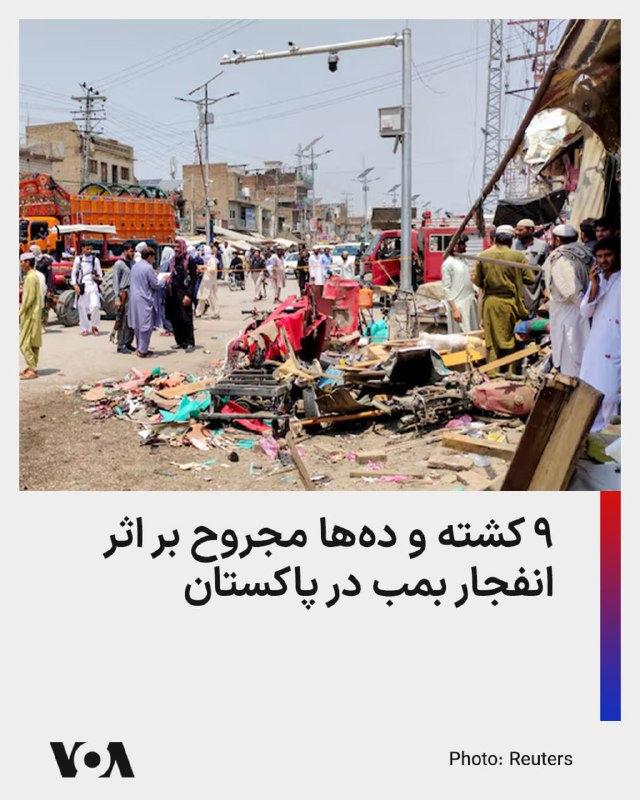

خبرگزاری رویترز به نقل از سازمان خدمات اضطراری پاکستان اعلام کرد که در پی انفجاری مهیب در یک بازار شلوغ در شمال‌غرب این کشور، ۹ نفر کشته و ده‌ها تن دیگر زخمی شدند.

این رویداد روز سه‌شنبه ۲۲ اردیبهشت رخ داد و رویترز معتقد است که می‌تواند خطر شعله‌ور شدن دوباره درگیری‌ها میان پاکستان و افغانستان را افزایش دهد.

مقامات بیمارستانی در پاکستان اعلام کردند که تاکنون ۳۷ مجروح به مراکز درمانی منتقل شده و حال برخی از آنها وخیم است.

این حمله پس از آن رخ داد که روز شنبه ۱۹ اردیبهشت، انفجار یک خودرو بمب‌گذاری شده در پاکستان، جان دست‌کم ۱۵ افسر پلیس این کشور را گرفت.

پاکستان، شبه‌نظامیان مستقر در افغانستان را مسئول حمله روز شنبه می‌داند و در مقابل افغانستان اعلام کرده که فعلاً درباره اتهام پاکستان، اظهارنظر نمی‌کند.

روابط کابل و اسلام‌آباد، پس از حملات هوایی پاکستان علیه پایگاه‌های شبه‌نظامیان مستقر در افغانستان، وارد تنش و درگیری شده است.
@FarsiVOA

## FarsiVOA — post 217518

  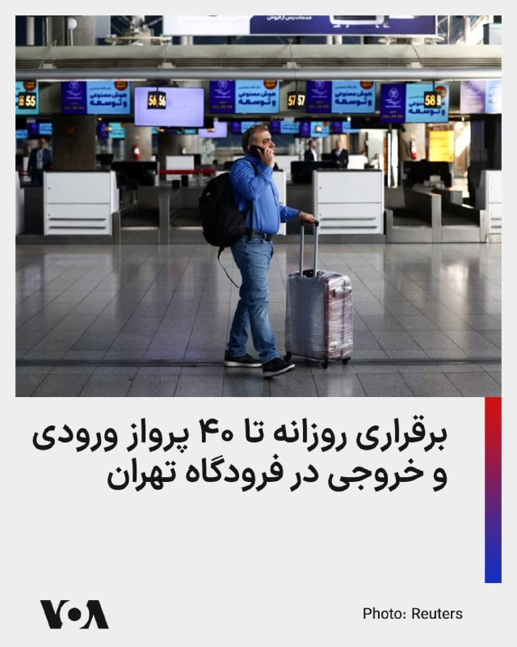

مدیر روابط عمومی فرودگاه خمینی تهران اعلام کرد پروازهای خارجی از این فرودگاه به بیش از ۲۰ مقصد بین‌المللی به ‌صورت عادی در حال انجام است. به گفته اهورا محمدی، بیشترین پروازها به استانبول، مسقط، نجف، مدینه، شانگهای، گوانگژو، بغداد و پکن است.

بر اساس این اعلام، روزانه بین ۳۵ تا ۴۰ پرواز ورودی و خروجی از این فرودگاه انجام می‌شود، و ایروان، مسکو، اربیل، کابل، آنکارا، بانکوک و باکو مقاصد مسافران است.

مدیرعامل شرکت شهر فرودگاهی فرودگاه خمینی نیز آمار پروازهای خارجی انجام شده در این فرودگاه را تا ۲۱ اردیبهشت ۵۳۴ مورد و تعداد مسافران جابه‌جا شده را هم بیش از ۴۸ هزار نفر اعلام کرد.

از زمان آغاز دیگری نظامی با آمریکا و اسرائیل، حریم هوایی ایران به روی پروازهای تجاری و مسافری بسته بود و فرودگاه‌های کشور هم تعطیل بودند اما در روزهای آخر فروردین، مقام‌ها مسئول از ازسرگیری تدریجی پروازها در برخی فرودگاه‌ها خبر دادند.
@FarsiVOA

## DW_Farsi — post 124591

  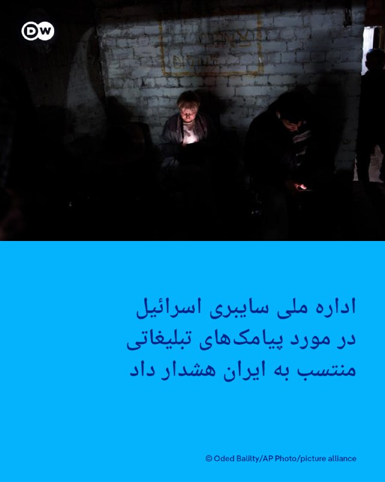

🔶 اداره ملی سایبری اسرائیل در مورد پیامک‌های تبلیغاتی منتسب به ایران هشدار داد

اداره ملی سایبری اسرائیل روز سه‌شنبه ۱۲ مه (۲۲ اردیبهشت) اعلام کرد هزاران اسرائیلی در ساعات گذشته پیام‌های "هراس‌آفرینی" را دریافت کرده‌اند که با هدف "ایجاد وحشت و تضعیف احساس امنیت" ارسال شده‌اند.

پیش‌تر روزنامه "اسرائیل هیوم" گزارش داده بود موجی از پیامک‌های تبلیغاتی به زبان عبری از شامگاه دوشنبه تا صبح سه‌شنبه ۱۲ مه (۲۲ اردیبهشت) از سوی هکرهای منتسب به جمهوری‌ اسلامی برای شمار زیادی از شهروندان اسرائیلی ارسال شده است که آنها را به همکاری با ایران فرامی‌خواند. به نوشته این روزنامه در یکی از این پیام‌ها آمده بود: «جمهوری اسلامی ایران از شما دعوت می‌کند در حوزه اطلاعاتی همکاری کنید. برای همکاری، با سفارت‌های ایران در کشورهای مختلف یا یکی از عوامل سایبری ایرانی به‌صورت آنلاین تماس بگیرید.»

در پیامی دیگر گفته شده بود: «ما به شما وعده داده بودیم که به‌زودی ستاره‌هایی را در آسمان شب خواهید دید که ستاره نیستند... به‌زودی خورشید را در آسمان شب خواهید دید.»

پلیس اسرائیل نیز تصاویری از این پیام‌ها را منتشر کرد.

اداره ملی سایبری اسرائیل ارسال این پیامک‌ها را "یک تلاش آشنا برای عملیات تأثیرگذاری در فضای دیجیتال" خوانده و گفت این پیام‌ها با محتوایی "تهدید‌آمیز، جنجالی یا تنش‌زا که مستقیماً برای شهروندان ارسال می‌شوند، سعی دارند آن‌ها را از روی ترس وادار به واکنش کنند".

این سازمان به شهروندان اسرائیلی هشدار داده است تا این پیام‌ها را بی‌پاسخ گذاشته، روی هیچ‌ لینکی کلیک نکنند و از ارسال آن برای دیگران خودداری کنند.

نهادهای امنیتی اسرائیل می‌گویند جمهوری اسلامی در ماه‌های اخیر تلاش‌های خود برای جذب شهروندان اسرائیلی به‌عنوان جاسوس را افزایش داده است. به گفته مقام‌های اسرائیلی، این ارتباط‌ها عمدتاً از طریق شبکه‌های اجتماعی، پیام‌رسان‌ها و پیشنهادهای مالی آغاز می‌شود. اسرائیل به شهروندانش نسبت به هرگونه همکاری اطلاعاتی با عوامل جمهوری اسلامی هشدار داده و تا کنون نیز چندین شهروند اسرائیلی به اتهام جاسوسی برای ایران محاکمه شده‌اند.

@dw_farsi

## DW_Farsi — post 124590

  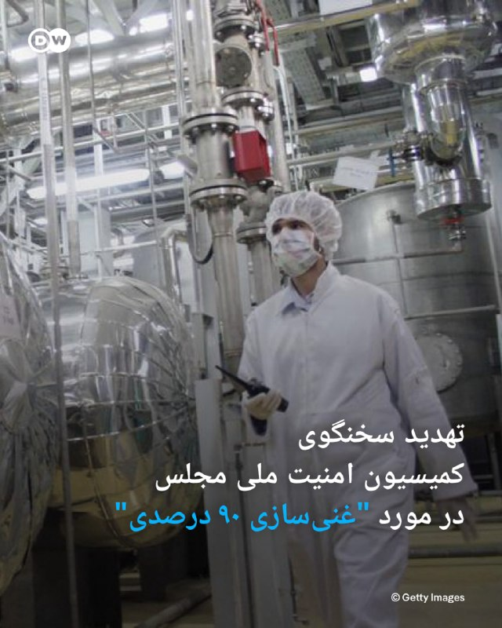

🔶 تهدید سخنگوی کمیسیون امنیت ملی مجلس در مورد "غنی‌سازی ۹۰ درصدی"

همزمان با ابراز ناخشنودی ترامپ از پاسخ ایران و بالا گرفتن گمانه‌زنی‌ها نسبت به از سرگیری جنگ آمریکا و اسرائیل علیه ایران، ابراهیم رضایی، سخنگوی كميسيون امنيت ملی و سياست خارجی مجلس شورای اسلامی، تهدید کرد ایران به حمله مجدد پاسخ می‌دهد.

او روز سه‌شنبه ۲۲ اردیبهشت (۱۲ مه) در پیامی در ایکس نوشت: «یکی از گزینه‌های ایران در صورت حمله مجدد می‌تواند غنی‌سازی ۹۰ درصد باشد. در مجلس بررسی می‌کنیم.»

ایران هم‌اکنون اورانیوم را تا سطح ۶۰ درصد غنی‌سازی کرده‌ است. این سطح فاصله فنی کوتاهی با غنی‌سازی ۹۰ درصدی دارد که درجه مورد نیاز برای ساخت سلاح هسته‌ای به شمار می‌رود. کارشناسان می‌گویند عبور از مرز ۹۰ درصد، به‌طور گسترده به‌عنوان ورود به محدوده "تسلیحاتی" تلقی می‌شود.

@dw_farsi

## DW_Farsi — post 124589

  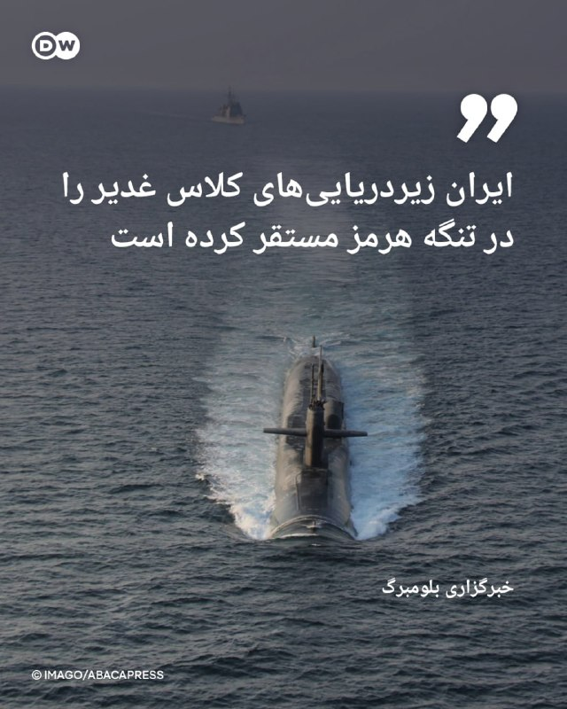

🔶 بلومبرگ: ایران زیردریایی‌های کلاس غدیر را در تنگه هرمز مستقر کرده است

به گزارش خبرگزاری بلومبرگ همزمان با افزایش تنش‌ها میان تهران و واشنگتن، ایران چندین زیردریایی کوچک از کلاس "غدیر" را در تنگه هرمز مستقر کرده است.

شهرام ایرانی، فرمانده نیروی دریایی ارتش‌، ۲۰ اردیبهشت (۱۰ مه) از استقرار زیردریایی‌های "سبک" ایران در آب‌های تنگه هرمز خبر داده و گفته بود این زیردریایی‌ها موسوم به "دلفین‌های خلیج فارس" متناسب با "تهدید‌ها و ظرفیت‌ها و نیاز‌ها در آب‌های تنگه هرمز دست به ماشه در حال گسترش و کف‌نشینی هستند".

او به نوع این زیردریایی‌ها اشاره نکرده بود اما خبرگزاری تسنیم همان زمان در گزارشی نوشته بود اشاره به "کف‌نشینی در بستر دریا مشخص می‌کند که این مأموریت احتمالاً با استفاده از زیردریایی غدیر صورت گرفته است".

@dw_farsi

## Persian_Trend_Official — post 13976

  <a href="telegram/content/Persian_Trend_Official_13976_1778589316.webm" target="_blank">🎬 Download video</a>

کویت مدعی بازداشت ۴ افسر نیروی دریایی سپاه شد
وزارت کشور کویت اعلام کرد چهار نفر وابسته به سپاه پاسداران را هنگام تلاش برای ورود دریایی به جزیره بوبیان بازداشت کرده است.
طبق بیانیه رسمی، بازداشت‌شدگان شامل دو سرهنگ، یک کاپیتان و یک ستوان نیروی دریایی سپاه هستند که به گفته کویت، مأموریت «نفوذ» به جزیره بوبیان و انجام «اقدامات خصمانه» را داشته‌اند. در جریان درگیری، یک نیروی مسلح کویتی نیز زخمی شده است. �
Arab News +1
اسامی اعلام‌شده از سوی کویت: ▪️ امیرحسین عبدالمحمد زیرایی — سرهنگ نیروی دریایی
▪️ عبدالصمد یدالله قنواتی — سرهنگ نیروی دریایی
▪️ احمد جمشید غلامرضا ذوالفقاری — کاپیتان نیروی دریایی
▪️ محمدحسین سهراب فاروقی‌راد — ستوان یکم
کویت می‌گوید این افراد اول ماه مه با یک قایق ماهیگیری وارد آب‌های این کشور شده بودند و دو نفر دیگر نیز موفق به فرار شده‌اند. �
Arab News +1
جزیره بوبیان بزرگ‌ترین جزیره کویت و در نزدیکی مرزهای دریایی ایران و عراق قرار دارد. ایران تاکنون واکنش رسمی به این ادعاها نشان نداده است.

## Persian_Trend_Official — post 13975

غرق شدن کشتی روسی حامل تجهیزات هسته‌ای به مقصد احتمالی کره شمالی

🔹 تحقیقات شبکه سی‌ان‌ان نشان می‌دهد یک کشتی باری روسی که احتمالاً دو راکتور هسته‌ای ویژه زیردریایی‌ها را حمل می‌کرد و ممکن بود مقصد آن کره شمالی باشد، پس از وقوع چند انفجار مشکوک در دریای مدیترانه غرق شده است.

☆Phantom☆

📌 @persian_trend_official
پرشین ترند | متفاوت‌ترین کانال نظامی

🔹این کشتی با نام Ursa Major در تاریخ 23 دسامبر 2024، حدود 60 مایلی سواحل اسپانیا، در شرایطی نامشخص غرق شد. به گفته منابع آگاه، سرنوشت این کشتی از زمان حادثه در هاله‌ای از ابهام قرار داشته و جزئیات مربوط به محموله و مأموریت آن محرمانه نگه داشته شده است.

## Persian_Trend_Official — post 13974

دقایقی قبل ارتش اسرائیل از رهگیری یک پهپاد که از سمت ایران یا حوثی ها به سمت جنوب اسرائیل شلیک شده بود خبر داد. ☆Phantom☆ 📌 @persian_trend_official پرشین ترند | متفاوت‌ترین کانال نظامی

## Persian_Trend_Official — post 13973

  <a href="telegram/content/Persian_Trend_Official_13973_1778589317.mp4" target="_blank">🎬 Download video</a>

دقایقی قبل ارتش اسرائیل از رهگیری یک پهپاد که از سمت ایران یا حوثی ها به سمت جنوب اسرائیل شلیک شده بود خبر داد.

☆Phantom☆

📌 @persian_trend_official
پرشین ترند | متفاوت‌ترین کانال نظامی

## RadioFarda — post 157089

  

🔸در پی انتقال نرگس محمدی، برندهٔ جایزهٔ صلح نوبل و زندانی سیاسی، به بیمارستان، ۱۱۲ برندهٔ جایزهٔ نوبل از رشته‌های مختلف با انتشار بیانیه‌ای مشترک خواستار آزادی فوری و بی‌قیدوشرط او و لغو همهٔ اتهام‌ها علیه این فعال حقوق بشر شدند.

🔸این بیانیه روز سه‌شنبه ۲۲ اردیبهشت، با هماهنگی «ابتکار زنان نوبل» و همکاری «بنیاد نرگس» منتشر شد. امضاکنندگان شامل برندگان نوبل در رشته‌های شیمی، اقتصاد، ادبیات، پزشکی، صلح و فیزیک هستند.

🔸در این بیانیه آمده است که گزارش‌های منتشرشده از سوی بنیاد نرگس و دیگر منابع معتبر نشان می‌دهد وضعیت جسمانی خانم محمدی «بحرانی» شده و او با کاهش شدید وزن، ناپایداری فشار خون و علائم جدی قلبی روبه‌رو است.

🔸برندگان نوبل هشدار داده‌اند که جان نرگس محمدی ممکن است در معرض «خطر فوری» باشد و تأکید کرده‌اند که او ماه‌ها از دسترسی به خدمات تخصصی پزشکی محروم بوده است.

🔸نرگس محمدی روز ۲۰ اردیبهشت با آمبولانس به بیمارستان تهرانپارس منتقل شد و اکنون تحت درمان یک تیم تخصصی پزشکی قرار دارد.

@Radiofarda

## RadioFarda — post 157088

🔸تنها ساعاتی تا افتتاح هفتاد‌و‌نهمین جشنواره فیلم کن باقی است و رسانه‌های جهان تصاویری از آماده‌سازی‌ نهایی کاخ جشنواره‌ کن را منتشر کرده‌اند.

🔸فرش قرمز روز افتتاحیه هفتاد‌و‌نهمین دوره این جشنواره روز سه‌شنبه ۲۲ اردیبهشت پهن شد و بزرگترین رویداد سینمایی جهان در انتظار حضور چهره‌های سرشناس سینماست که قرار است تا دوم خرداد در این جشنواره حضور داشته باشند.

🔸از جمله چهره‌های سرشناسی که امسال فیلم‌هایشان برای اولین بار اکران می‌شود می‌توان به اسکارلت جوهانسون، رامی مالک، خاویر باردم، جان تراولتا و لیا سیدو اشاره کرد.

🔸۲۲ فیلم هم برای دریافت جایزه نخل طلا در مراسم اختتامیه رقابت می‌کنند که در میان آنها چهره‌هایی از جمله پدرو آلمودوار،‌ اصغر فرهادی و لاسلو نمش حضور دارند.

@Radiofarda

## RadioFarda — post 157087

  <a href="https://t.me/radiofarda/157087" target="_blank">📎 Download file</a>

📻بشنوید: ساعت ۱۴ با رادیوفردا، ۲۲ اردیبهشت ۱۴۰۵‌

@Radiofarda

## RadioFarda — post 157086

  

🔸وزارت کشور کویت اعلام کرد که «چهار نفوذی» وابسته به سپاه پاسداران انقلاب اسلامی ایران را پس از تلاش برای ورود دریایی به این کشور حوزه خلیج فارس بازداشت کرده است.

🔸خبرگزاری رسمی دولت کویت، کونا، این خبر را منتشر کرده است.

🔸این وزارتخانه افزود که در جریان درگیری با این این افراد، یکی از نیروهای مسلح کویت زخمی شد و «دو نفوذی‌» موفق به فرار شدند.

🔸کونا همچنین به نقل از وزارت کشور کویت نوشته که بازداشت‌شدگان در جریان بازجویی «اعتراف» کردند که وابسته به سپاه پاسداران هستند.

🔸بر اساس این گزارش، آنها «اعتراف کردند که مأموریت داشتند با یک قایق ماهیگیری که به‌طور ویژه برای انجام اقدامات خصمانه علیه کویت اجاره شده بود، به جزیره بوبیان نفوذ کنند».

🔸پیش از این وزارت دفاع کویت خبر اولیه‌ای از تلاش این چهار نفر برای ورود به این کشور از راه دریا منتشر کرده بود.

@RadioFarda

## RadioFarda — post 157085

  <a href="https://t.me/radiofarda/157085" target="_blank">📎 Download file</a>

🔸روز اقدام جهانی با هدف اعتراض به ادامه حبس زندانیان سیاسی، اعدام‌های گسترده و همچنین قطع اینترنت روز بیستم اردیبهشت در چندین شهر برگزار شد.

🔸 هواداران شاهزاده رضا پهلوی در شهرهای مختلف دنیا، از جمله در اروپا و آمریکا شمالی به خیابان آمدند و به این حرکت پیوستند؛ برخی شهرها مثل برلین و هامبورگ و استکهلم جمعیت قابل توجهی به این فراخوان پاسخ دادند و در برخی شهرهای دیگر تجمعات به نسبت موارد پیشین کوچکتر برگزار شد.

🔸پس از انتشار تصاویر برخی از تجمعات، بحثی پیرامون آن شکل گرفته است؛ مشخصا تجمع در شهر رگنسبورگ در آلمان، معترضان با لباس‌های متحدالشکل با نشان ساواک (سازمان اطلاعات و امنیت کشور) و پرچم‌هایی با همین نشان به خیابان آمدند.

🔸در نمونه‌ای دیگر شرکت‌کنندگان در تجمع با یونیفرم نظامی به خیابان آمده بودند. تصاویری که بسیار متفاوت از تصاویر تجمعاتِ معمول ایرانیان خارج از کشور بود.

🔸 درباره این روز اقدام جهانی و بحث‌های پیرامون آن ارزیابی عبدالرضا احمدی عضو حزب ایران نوین در آلمان را بشنوید.

@RadioFarda

## RadioFarda — post 157084

صنعت گردشگری ایران طی دو ماه اخیر «حدود پنج هزار میلیارد تومان» زیان دیده است

🔸گزارش‌ها از ایران حاکی از «تعطیل عملی» صنعت گردشگری کشور به‌دلیل ماه‌ها رکود، بی‌ثباتی اقتصادی، جنگ و اختلال و قطع اینترنت است.

🔸رئیس انجمن صنفی دفاتر خدمات مسافرت هوایی و جهانگردی ایران می‌گوید «دفاتر مسافرتی از نوروز سال گذشته تاکنون تقریباً هیچ فعالیت اقتصادی نداشته‌اند» و دست‌اندرکاران صنعت گردشگری هشدار می‌دهند در شرایط «نه جنگ نه صلح» و تبعات آن، عملاً کسب‌و‌کارهای مرتبط با این صنعت خوابیده است.

🔸حرمت‌الله رفیعی، روز سه‌شنبه ۲۲ اردیبهشت، گفت براساس برآوردهای ارائه‌شده به وزارت میراث‌ فرهنگی، گردشگری و صنایع‌دستی، صنعت گردشگری «تنها طی دو ماه اخیر حدود پنج هزار میلیارد تومان زیان دیده است».

🔸ایران از خرداد سال گذشته و در پی جنگ ۱۲ روزه با اسرائیل درگیر جنگ و یا سرکوب اعتراضات و پیامدهای آن‌ها بوده است. جنگ ۳۹ روزه‌ای هم که از نهم اسفند پارسال با حملات مشترک آمریکا و اسرائیل آغاز شد، همچنان در وضعیت آتش‌بس شکننده قرار دارد.

🔸خروج نیروی انسانی متخصص از حوزهٔ گردشگری در حال حاضر یکی دیگر از بحران‌های اصلی است که این صنعت با آن مواجه شده است.

🔸آن‌طور که آقای رفیعی خبر داده، «بسیاری از کارکنان آموزش‌دیدهٔ دفاتر مسافرتی به‌دلیل نبود درآمد، جذب مشاغل دیگری مانند آرایشگری و فعالیت‌های غیرمرتبط شده‌اند».

🔸روزنامه دنیای اقتصاد نیز نوشته است که برآوردها نشان می‌دهد حدود «یک ‌میلیون شغل» در این صنعت تحت‌تأثیر شرایط جنگی و قطع اینترنت قرار گرفته است.

🔸نسخه کامل این گزارش را در وب‌سایت رادیوفردا بشنوید.

@RadioFarda

## IranianMinds — post 20005

  

🔴پست ترامپ:
دموکرات‌ها عاشق فاضلاب هستند.

@IranianMinds

## IranianMinds — post 20004

  <a href="telegram/content/IranianMinds_20004_1778589321.mp4" target="_blank">🎬 Download video</a>

🔴دختر طهرانی مقدم: همسرم باور نمی‌کرد یک فرمانده ارشد نظامی اینقدر در خانه لطیف و عاطفی باشد.

ناباوری همسرش بی‌جا نبوده، دلیلش هم اینه که بیرون از خانه وحشی، خونخوار و قاتل هستن.

@IranianMinds

## IranianMinds — post 20003

🔴 اژه‌ای:
داستان اینترنت پرو و سیمکارت سفید باعث خشم مردم شده و باید با موارد خلاف قانون در این موضوع برخورد بشه.

@IranianMinds

## IranianMinds — post 20002

🔴 اسرائیل هیوم:

هزاران اسرائیلی پیام‌های تهدیدآمیز از هکرهای وابسته به ج‌آ دریافت کردن که از شهروندان خواسته شده با جمهوری اسلامی همکاری اطلاعاتی کنند.

@IranianMinds

## IranianMinds — post 20001

🔴سپاه اصفهان:

امروز از ساعت ۱۵ تا ۱۸ در محدوده زردنجان، احتمال شنیده شدن صدای انفجار هست که کنترل شده هست.

@IranianMinds

## IranianMinds — post 20000

  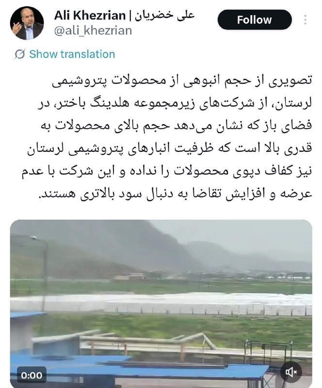

🔴علی خضریان نمایند مجلس، خیلی شیک و مجلسی یه پتروشیمی بسیار مهم کشور را رو کرد.

@IranianMinds

## BBCPersian — post 280847

  <a href="telegram/content/BBCPersian_280847_1778589324.mp4" target="_blank">🎬 Download video</a>

🔻‌در جریان اجلاس «آفریقا فوروارد» که روز دوشنبه ۱۱ مه ۲۰۲۶ در نایروبی کنیا برگزار شد، امانوئل مکرون، رئیس‌جمهور فرانسه، با قطع کردن صحبت‌های سخنران از حاضران خواست سکوت کرده و سر و صدا نکنند .

او با اشاره به «غیرممکن» شدن شنیدن صحبتهای سخنرانان به حاضران گفت: «این کاملا بی‌احترامی است.»

اجلاس «آفریقا فوروارد» نشستی است که بیش از ۳۰ رهبر آفریقایی، مدیران تجاری و کارآفرینان جوان را گرد هم آورده است.

فرانسه در تلاش است روابط خود را با کشورهای این قاره تقویت کند.

@‌‌BBCPersian

## BBCPersian — post 280846

در نشست خبری روز ۲۲ اردیبهشت فاطمه مهاجرانی، سخنگوی دولت، بر سر اینترنت پرو و شرایط واگذاری آن بگو مگویی بین او و خبرنگاران پیش آمد.

خانم مهاجرانی گفت اینترنت پرو مصوبه شورای عالی امنیت ملی را دارد که رئیس‌جمهور رئیس آن است. او با تاکید بر اینکه اینترنت پرو ویژه کسب و کارهاست، در ادامه گفت وقتی سایه جنگ از کشور رفع شد به حالت عادی برمی‌گردد.

در ادامه خبرنگاران سوال‌های متعددی پرسیدند که در ویدیو به درستی شنیده نمی‌شود و سخنگوی دولت گفت کشور در جنگ است و ویژگی جنگ امنیت مردم است.

او در ادامه گفت اینترنت حق مردم و یکی از حقوق شهروندی است و خشم مردم به حق است اما بدانند «عامل این خشم دشمنانی هستند که باعث می‌شوند امنیت ما مخدوش شود.»

همزمان وزیر ارتباطات در گفتگویی که با خبرنگاران داشت اعلام کرد در واگذاری اینترنت پرو تخلف‌هایی صورت گرفته که در حال بررسی است و قوه قضائیه هم ورود کرده است.

غلامحسین محسنی اژه‌ای، رئیس قوه قضائیه هم درباره اینترنت پرو و واگذاری آن گفت: اگر موضوع درستی است باید آن را تبیین کرد و اگر تخلف هست باید برخورد شود. نباید مسائل را مبهم رها کرد.
@BBCPersian

## BBCPersian — post 280845

🔻کویت: چهار نفوذی وابسته به سپاه پاسداران را دستگیر کردیم

وزارت کشور کویت می‌گوید که «چهار نفوذی وابسته به سپاه پاسداران» را حین تلاش برای ورود به کشور از طریق دریا بازداشت کرده است.

خبرگزاری دولتی کونا به نقل از این وزارتخانه گزارش داده است که یک نفر از نیروهای مسلح کویت در درگیری با این چهار نفر مجروح شده است.

بر اساس بیانیه وزارت کشور کویت، دستگیرشدگان دو سرهنگ، یک سروان و یک ستوان نیروی دریایی سپاه بوده‌اند که «اذعان» کرده‌اند ماموریت داشتند به جزیره بوبیان «نفوذ» کنند.

در این بیانیه آمده است که این چهار نفر در اول ماه مه (۱۱ روز پیش) سعی کردند «سوار بر یک قایق ماهیگیری که مخصوص انجام اقدامات خصمانه علیه کویت تدارک داده شده بود» وارد کویت شوند.

بوبیان بزرگترین جزیره کویت است و با سواحل ایران و عراق فاصله کمی دارد.

رسانه‌های ایران در زمان جنگ گفتند که پس از حمله ایران به پایگاه آمریکا در کویت، نظامیان آمریکا در جزیره بوبیان مستقر شدند.

https://bbc.in/4drNww2
@BBCPersian

## BBCPersian — post 280837

🖊میشل رابرتس
دبیر سلامت دیجیتال

مسافران کشتی تفریحی که دچار شیوع ویروس هانتا شده، در حال تخلیه و اعزام به کشورهای خود هستند تا در صورت لزوم خود را قرنطینه کنند و تحت درمان پزشکی قرار بگیرند.

برخی دیگر از مسافران کشتی ام‌وی هوندیوس با پروازها یا مسیرهای ارتباطی قبلی، کشتی را ترک کرده‌اند و اکنون برای احتیاط، افرادی که با آن‌ها در تماس بوده‌اند در حال شناسایی هستند.

مقام‌ها می‌گویند خطر گسترش این عفونت به عموم مردم همچنان پایین است.

خدمه و مسافران اکنون باید برای جلوگیری از هرگونه گسترش احتمالی این بیماری، بیش از یک ماه خود را قرنطینه کنند.

سه نفر یا در خود کشتی یا پس از سفر با آن، جان باختند. این کشتی‌ یک ماه پیش از آرژانتین حرکت کرده بود. چهار نفر دیگر نیز برای درمان، به شکل اورژانسی از کشتی خارج شدند.

با این وصف ما باید چقدر نگران باشیم؟
ادامه مطلب در لینک زیر:

https://bbc.in/4dgH0Ie
📸GettyImages/ Reuters/ Anadolu
via Getty Images/ EPA/ LightRocket via Getty Images/ AFP via Getty
Images
@BBCPersian

## BBCPersian — post 280836

🔻فیدان در قطر: از تنگه هرمز نباید به‌عنوان سلاح استفاده شود

وزیر خارجه ترکیه که به قطر سفر کرده است، می‌گوید آنکارا از تلاش‌ها برای باز کردن تنگه هرمز حمایت می‌کند.

هاکان فیدان در کنفرانس خبری مشترک با همتای قطری خود در دوحه در عین حال گفت که از تنگه هرمز نباید به‌عنوان «سلاح» استفاده شود.

محمد بن عبدالرحمن آل ثانی، نخست‌وزیر و وزیر خارجه قطر، هم گفت که ایران نباید از تنگه هرمز به‌عنوان ابزاری برای اعمال فشار یا «باج‌گیری» از کشورهای منطقه خلیج فارس استفاده کند.

وزیر خارجه قطر همچنین گفت که سفر اخیرش به آمریکا برای کمک به پایان دادن جنگ با ایران بوده است.

@BBCPersian

## Dirty_Kids — post 389311

  <a href="telegram/content/Dirty_Kids_389311_1778589327.mp4" target="_blank">🎬 Download video</a>

ایده خوب 👌
برسه به دست تیشرت‌فروشی جاجرود

@Dirty_Kids 👻

## Dirty_Kids — post 389310

از یه سنی به بعد کمتر کص‌ میگی و بیشتر بلاک میکنی.

@Dirty_Kids 👻

## Dirty_Kids — post 389309

  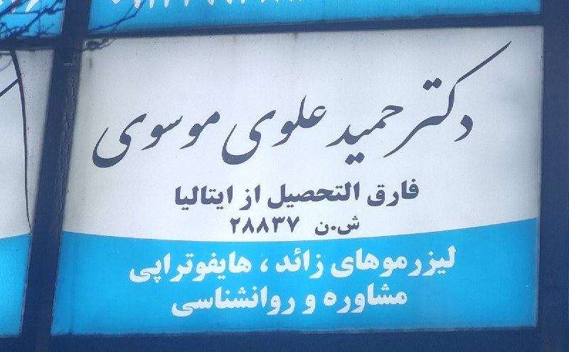

فارق‌التحصیل از ایتالیا

- وقت تراپی داشتین؟
+ بله
- دکتر یه مراجع داره که پشماشو می‌زنه؛ ۵ دقیقه دیگه می‌فرستمتون داخل.

@Dirty_Kids 👻

## Hranews — post 112902

  

زندان وکیل‌آباد؛ احراز هویت ۳۰ زن بازداشت‌شده در اعتراضات و تحولات امنیتی همزمان با جنگ

❗️
❗️
❗️
❗️
❗️– دست‌کم ۳۰ زن در جریان اعتراضات دی‌ماه ۱۴۰۴ و همچنین تحولات امنیتی همزمان با جنگ، در استان خراسان رضوی بازداشت و به بند «آرامش» و قرنطینه زندان وکیل‌آباد مشهد منتقل شدند. هم‌اکنون ۲۵ نفر از این شهروندان کماکان در این زندان نگهداری می‌شوند و ۵ نفر از آنها نیز با تأمین قرار کیفری آزاد شده‌اند. گزارش پیش رو، به هویت و جزئیات پرونده آنان میپردازد.

به گزارش خبرگزاری هرانا، ارگان خبری مجموعه فعالان حقوق بشر در ایران، هویت ۳۰ زن بازداشت‌شده در استان خراسان رضوی احراز شده است.

بر اساس اطلاعات دریافتی هرانا، این شهروندان در جریان اعتراضات دی‌ماه ۱۴۰۴ و همچنین تحولات امنیتی همزمان با جنگ بازداشت شده‌اند و ۲۵ تن از آنها همچنان در زندان به سر می‌برند. مریم نوری، آرزو دهقان، نادیا صدق‌علی، سهیلا حسینی، نجمه امینی، مهدیه افقهی، حدیثه مرواریدی، فائره صالح‌آبادی، شهرزاد ضمیری، طاهره دهقان، آذر یاهو، آسیه نعیمی، عادله نعیمی، مهسا بهداری، محبوبه شعبانی، مرضیه مشهدی، سیما انبایی، زهرا موسوی، معصومه یعقوبی، فاطمه رضوانی‌فر، سیده زینب موسوی، حدیثه بابازاده، ملیکا خاوری خراسانی، مینا زارعی و ریحانه کفشکنان ۲۵ زندانی هستند که هویتشان توسط هرانا احراز شده و کماکان در زندان وکیل‌آباد مشهد محبوس هستند.
همچنین هویت پنج بازداشتی که اخیراً از این زندان آزاد شده‌اند، سمیرا بیات، نگار فرهمند، فاطمه ارم، نجمه روحند و الناز اقبالی نیز توسط هرانا احراز شده است.

ادامه مطلب

↘️
@hranews_bot تماس ✉️ -  @Hranews  کانال هرانا 🆑

## Hranews — post 112901

  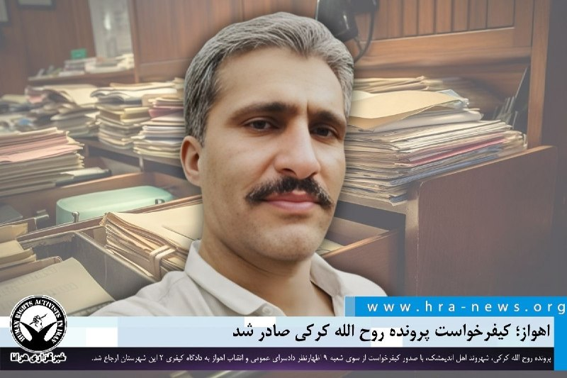

کیفرخواست پرونده روح الله کرکی صادر شد

❗️
❗️
❗️
❗️
❗️– پرونده روح الله کرکی، شهروند اهل اندیمشک، با صدور کیفرخواست توسط شعبه ۹ دادسرای عمومی و انقلاب اهواز به دادگاه کیفری ۲ این شهرستان ارجاع شد.

به گزارش خبرگزاری هرانا، ارگان خبری مجموعه فعالان حقوق بشر در ایران، کیفرخواست پرونده روح الله کرکی صادر شد.

براساس اطلاعات دریافتی هرانا، پرونده آقای کرکی با صدور کیفرخواست از بابت اتهامات «انتشار و افشای اسناد محرمانه»، «همکاری با سازمان مجاهدین خلق»، «جاسوسی برای اسرائیل و تبادل اطلاعات نظامی و امنیتی»، «توهین به مقدسات و مقامات» و «اقدام علیه امنیت ملی» توسط شعبه ۹ اظهارنظر دادسرای عمومی و انقلاب اهواز صادر و به دادگاه کیفری ۲ این شهرستان ارجاع شده است.

ادامه مطلب

#روح_الله_کرکی

↘️
@hranews_bot تماس ✉️ -  @Hranews  کانال هرانا 🆑

## Hranews — post 112900

  

روز یکشنبه ۲۰ اردیبهشت‌ماه، شماری از اساتید اخراجی دانشگاه فرهنگیان در مقابل ساختمان های سازمان بازرسی کل کشور و وزارت آموزش و پرورش دست به #تجمع اعتراضی زدند.

این اساتید نسبت به اخراج بیش از ۳۰۰ عضو هیئت علمی دانشگاه و قطع حدود ۱۰ ماه از حقوق و مزایای‌شان اعتراض کرده و خواستار رسیدگی به مطالبات خود و عزل رئیس دانشگاه فرهنگیان شدند.

↘️
@hranews_bot تماس ✉️ - @Hranews کانال هرانا 🆑

## Hranews — post 112899

  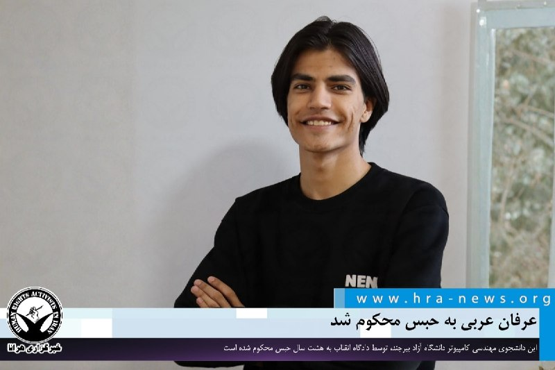

عرفان عربی به ۸ سال حبس محکوم شد

❗️
❗️
❗️
❗️
❗️– عرفان عربی، دانشجوی مهندسی کامپیوتر دانشگاه آزاد بیرجند، توسط دادگاه انقلاب به هشت سال حبس محکوم شد. آقای عربی، در بهمن ماه سال گذشته در رابطه با اعتراضات سراسری بازداشت شده بود.

به گزارش خبرگزاری هرانا، ارگان خبری مجموعه فعالان حقوق بشر در ایران، عرفان عربی به حبس محکوم شد.

یک منبع مطلع نزدیک به خانواده این دانشجوی دانشگاه آزاد بیرجند، میزان حبس صادر شده علیه آقای عربی را ۸ سال عنوان کرد. به گفته وی، دادگاه انقلاب حکم مذکور را امروز سه‌شنبه، به صورت شفاهی به عرفان عربی ابلاغ کرده است. با اعمال ماده ۱۳۴ قانون مجازات اسلامی، مجازات اشد یعنی ۵ سال حبس در خصوص وی قابل اجرا خواهد بود.

ادامه مطلب

#عرفان_عربی

↘️
@hranews_bot تماس ✉️ -  @Hranews  کانال هرانا 🆑

## Hranews — post 112898

  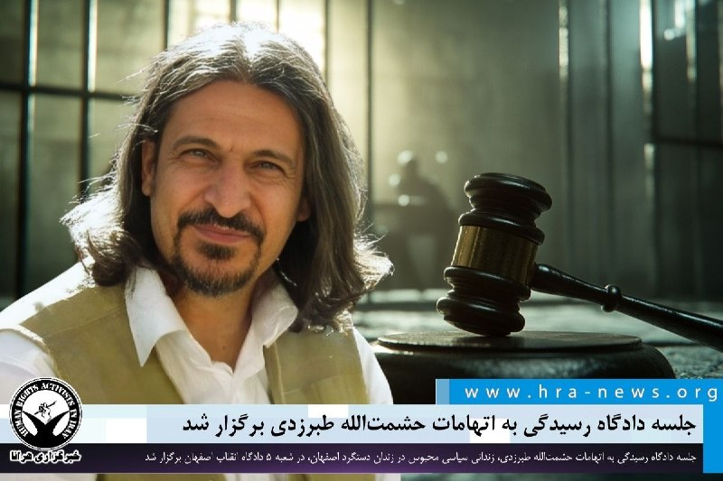

جلسه دادگاه رسیدگی به اتهامات حشمت‌الله طبرزدی برگزار شد

❗️
❗️
❗️
❗️
❗️– جلسه دادگاه رسیدگی به اتهامات حشمت‌الله طبرزدی، زندانی سیاسی محبوس در زندان دستگرد اصفهان، روز شنبه ۱۹ اردیبهشت ماه، در شعبه ۵ دادگاه انقلاب اصفهان برگزار شد.

به گزارش خبرگزاری هرانا، ارگان خبری مجموعه فعالان حقوق بشر در ایران، جلسه دادگاه رسیدگی به اتهامات حشمت‌الله طبرزدی برگزار شد.

روز شنبه ۱۹ اردیبهشت ماه جلسه دادگاه آقای طبرزدی در شعبه ۵ دادگاه انقلاب اصفهان به ریاست قاضی شاهینی برگزار شد. در جریان این جلسه این زندانی سیاسی از بابت اتهامات تبلیغ علیه نظام، توهین به رهبری و تشویش و تحریک به خشونت و کشتار از خود دفاع کرده است.

ادامه مطلب

#حشمت‌الله_طبرزدی

↘️
@hranews_bot تماس ✉️ -  @Hranews  کانال هرانا 🆑

## manototv — post 105344

  <a href="telegram/content/manototv_105344_1778589333.mp4" target="_blank">🎬 Download video</a>

مونترال‌ | کانادا؛ گردهمایی ایرانیان

## manototv — post 105343

  <a href="telegram/content/manototv_105343_1778589335.mp4" target="_blank">🎬 Download video</a>

جانان الماسی، شاعر حماسی و رقصنده، در گردهمایی سراسری ایرانیان در شهر کلن آلمان، قطعه‌ «سوگ سیاوش» را اجرا کرد.
این برنامه روز یکشنبه ۱۰ می برگزار شد.

## manototv — post 105342

  <a href="telegram/content/manototv_105342_1778589337.mp4" target="_blank">🎬 Download video</a>

آیلین وانگ، شهردار شهر آرکادیا در جنوب کالیفرنیا، پس از متهم شدن از سوی وزارت دادگستری آمریکا به فعالیت مخفیانه برای دولت چین، از سمت خود استعفا داد.
دادستانی آمریکا اعلام کرد وانگ متهم است به دستور مقام‌های چینی، مطالبی در حمایت از پکن را بدون ثبت رسمی به‌عنوان «عامل خارجی» منتشر کرده است. او پذیرفته که به اتهام جنایی مطرح‌شده اعتراف کند و ممکن است تا ۱۰ سال زندان محکوم شود.
به گفته مقام‌های آمریکایی، وانگ همراه با فردی دیگر سایتی خبری برای جامعه چینی‌تبارهای آمریکا اداره می‌کرده و برخی مطالب ارسالی مقام‌های چینی، از جمله درباره رد اتهام نقض حقوق بشر در سین‌کیانگ، را منتشر کرده است.
مدیر شهر آرکادیا گفت این پرونده مربوط به «رفتار فردی» وانگ بوده و هیچ‌یک از منابع یا تصمیم‌گیری‌های رسمی شهرداری درگیر این ماجرا نبوده‌اند.

## manototv — post 105341

  <a href="telegram/content/manototv_105341_1778589337.mp4" target="_blank">🎬 Download video</a>

محمد بن عبدالرحمن آل‌ثانی، نخست‌وزیر و وزیرخارجه قطر، در نشست خبری مشترک با هاکان فیدان، وزیر خارجه ترکیه، گفت دو کشور درباره شرایط بحرانی خاورمیانه در پی جنگ ایران گفت‌وگو کرده‌اند.
او گفت بحران تنگه هرمز باعث محدود شدن آزادی تردد دریایی شده و این آبراه عملاً به «سلاحی در این جنگ» تبدیل شده است.
نخست‌وزیر قطر افزود این وضعیت پیامدهای سنگینی، به‌ویژه اقتصادی، برای کشورهای حوزه خلیج فارس به همراه داشته است.

## manototv — post 105340

  <a href="telegram/content/manototv_105340_1778589338.mp4" target="_blank">🎬 Download video</a>

وزارت کشور کویت اعلام کرد چهار نفوذی وابسته به سپاه پاسداران جمهوری‌اسلامی را که قصد ورود دریایی به این کشور را داشتند، بازداشت کرده است.
خبرگزاری رسمی کویت گزارش داد در درگیری با این افراد، یکی از نیروهای مسلح کویت زخمی شده است.

## manototv — post 105339

  <a href="telegram/content/manototv_105339_1778589339.mp4" target="_blank">🎬 Download video</a>

شرکت ژاپنی «کالبی»، بزرگ‌ترین تولیدکننده چیپس در ژاپن، اعلام کرد به‌دلیل اختلال در زنجیره تأمین ناشی از جنگ آمریکا و اسرائیل با ایران، بسته‌بندی محصولاتش را تغییر می‌دهد.
این شرکت گفته از اواخر ماه جاری، بسته‌بندی ۱۴ محصول خود را به‌جای رنگ‌های معروف نارنجی و زرد، فقط با دو رنگ سیاه و سفید تولید خواهد کرد.
کالبی دلیل این تصمیم را «بی‌ثباتی در تأمین برخی مواد اولیه به‌دلیل تنش‌های فزاینده در خاورمیانه» اعلام کرده است.
رسانه‌های ژاپنی گزارش دادند کمبود نفتا، یکی از فرآورده‌های نفتی مورد استفاده در تولید جوهر چاپ، باعث اختلال در تأمین جوهر بسته‌بندی این شرکت شده است.

## manototv — post 105338

  <a href="telegram/content/manototv_105338_1778589339.mp4" target="_blank">🎬 Download video</a>

مایک هاکبی، سفیر آمریکا در اسرائیل، اعلام کرد اسرائیل برای کمک به دفاع امارات در جریان جنگ ایران، سامانه‌های پدافندی گنبد آهنین را به این کشور منتقل کرده است.
به گفته او، باتری‌های ضد موشکی و نیروهای عملیاتی این سامانه به امارات اعزام شده‌اند. امارات در سال ۲۰۲۰ و در چارچوب توافق ابراهیم، روابط دیپلماتیک با اسرائیل برقرار کرد.
هاکبی همچنین گفت نسبت به پیوستن کشورهای بیشتر منطقه به توافق عادی‌سازی روابط با اسرائیل خوش‌بین است.
او افزود کشورهای خلیج فارس اکنون باید انتخاب کنند که «احتمال حمله از سوی ایران بیشتر است یا اسرائیل». به گفته هاکبی، «اسرائیل به ما کمک کرد و ایران به ما حمله کرد».

## alonews — post 119491

  <a href="telegram/content/alonews_119491_1778589340.webm" target="_blank">🎬 Download video</a>

👈ساعات کاری دستگاه‌های اجرایی از شنبه به ۷ تا ۱۳ تغییر می‌کند

✅ @AloNews خبر جنگ

## alonews — post 119490

  <a href="telegram/content/alonews_119490_1778589340.webm" target="_blank">🎬 Download video</a>

👈الجزیره: با محدود شدن مسیرهای کشتیرانی در خلیج فارس، شبکه‌ای از جاده‌ها و راه‌آهن که ایران را به همسایگانش متصل می‌کرد، به عنوان جایگزینی رو به رشد برای حمل و نقل کالا و صادرات ظهور کرد

✅ @AloNews خبر جنگ

## alonews — post 119489

  <a href="telegram/content/alonews_119489_1778589341.webm" target="_blank">🎬 Download video</a>

👈 پزشکیان: اجازه نخواهیم داد عده‌ای از شرایط جنگ سوءاستفاده کرده و با ایجاد اختلال اقتصادی، به معیشت مردم ضربه بزنند.

✅ @AloNews خبر جنگ

## alonews — post 119488

  <a href="telegram/content/alonews_119488_1778589341.webm" target="_blank">🎬 Download video</a>

👈پست ترامپ درباره ایران

✅ @AloNews خبر جنگ

## alonews — post 119487

  <a href="telegram/content/alonews_119487_1778589341.webm" target="_blank">🎬 Download video</a>

👈وزارت خارجه کویت: ما از ایران می‌خواهیم که فوراً و بدون قید و شرط اقدامات غیرقانونی و خصمانه خود را که امنیت منطقه را تهدید می‌کند، متوقف کند

🔴 اقدامات خصمانه ایران نقض آشکار حاکمیت کویت و نقض جدی قوانین بین‌المللی است.

✅ @AloNews خبر جنگ

## alonews — post 119486

  <a href="telegram/content/alonews_119486_1778589341.webm" target="_blank">🎬 Download video</a>

👈فیدان : به خاطر جهان، تنگه هرمز باید باز شود

✅ @AloNews خبر جنگ

## alonews — post 119484

  <a href="telegram/content/alonews_119484_1778589342.webm" target="_blank">🎬 Download video</a>

👈ترامپ به بازنشر تصاویر تولیدشده توسط هوش مصنوعی مرتبط با ایران ادامه می‌دهد.

🔴او قبلاً همین تصاویر را منتشر کرده است

✅ @AloNews خبر جنگ

## alonews — post 119483

  <a href="telegram/content/alonews_119483_1778589342.webm" target="_blank">🎬 Download video</a>

👈توییت جدید ترامپ

🔴دموکرات های عاشق فاضلاب هستند !

✅ @AloNews خبر جنگ

## alonews — post 119482

  <a href="telegram/content/alonews_119482_1778589342.webm" target="_blank">🎬 Download video</a>

👈 ترامپ از طریق Truth Social:
هیچ جمهوری‌خواهی تاکنون درباره کوبا با من صحبت نکرده است، کشوری شکست‌خورده که فقط در یک جهت حرکت می‌کند - به سمت پایین!

🔴کوبا درخواست کمک می‌کند و ما قرار است صحبت کنیم!!!

🔴در این میان، من به چین می‌روم!

✅ @AloNews خبر جنگ

## alonews — post 119481

  <a href="telegram/content/alonews_119481_1778589342.webm" target="_blank">🎬 Download video</a>

👈سفیر آمریکا تو اسرائیل : ترامپ قبل از انتخابات پیشرو به اسرائیل سفر میکنه

✅ @AloNews خبر جنگ

## alonews — post 119480

  <a href="telegram/content/alonews_119480_1778589343.webm" target="_blank">🎬 Download video</a>

👈ایالات متحده و اوکراین پیش‌نویس یادداشتی را تهیه کرده‌اند که یک توافق دفاعی جدید احتمالی را ترسیم می‌کند و به اوکراین اجازه می‌دهد فناوری نظامی را به آمریکا صادر کند و به‌طور مشترک با شرکت‌های آمریکایی پهپاد تولید کند، طبق گزارش CBS News.

🔴این پیش‌نویس که بین وزارت امور خارجه آمریکا و سفیر اوکراین، اولگا استفانیشینا، مذاکره شده است، پس از افزایش علاقه آمریکا به فناوری پهپاد اوکراینی که در طول جنگ با روسیه توسعه یافته، شکل گرفته است.

🔴 این توافق با مقاومت‌هایی در داخل پنتاگون و کاخ سفید مواجه شد، به‌ویژه پس از آغاز جنگ ایران، که ترامپ قبلاً نیاز به تخصص پهپاد اوکراینی را رد کرده بود. اما یادداشت جدید نشان می‌دهد که این موانع سیاسی ممکن است اکنون در حال کاهش باشند.

✅ @AloNews خبر جنگ

## alonews — post 119479

  <a href="telegram/content/alonews_119479_1778589343.webm" target="_blank">🎬 Download video</a>

👈 سخنگوی ریاست جمهوری روسیه: پوتین اعلام کرده که آماده است با زلنسکی در مسکو یا هر جای دیگری دیدار کند.

✅ @AloNews خبر جنگ

## alonews — post 119478

  <a href="telegram/content/alonews_119478_1778589343.webm" target="_blank">🎬 Download video</a>

👈تحلیل نشریه هیل:ترامپ به احتمال زیاد پیروزی در جنگ علیه ایران را صرف نظر از نتیجه واقعی اعلام خواهد کرد، اما متقاعد کردن آمریکایی‌ها به شایستگی آن جنگ ممکن است از نظر سیاسی تقریباً غیرممکن باشد

🔴جمهوری خواهان بین وفاداری به ترامپ و افزایش نارضایتی عمومی گیر افتاده‌اند و بنابراین ارائه جنگ به عنوان یک موفقیت استراتژیک «عملاً غیرممکن خواهد بود»، به خصوص اگر توافق نهایی بسیار کمتر از وعده های اولیه دولت باشد.

✅ @AloNews خبر جنگ

## alonews — post 119477

  <a href="telegram/content/alonews_119477_1778589343.mp4" target="_blank">🎬 Download video</a>

👈نخست‌وزیر قطر درباره ایران: ایران نباید از این تنگه به عنوان سلاحی برای فشار یا باج‌گیری از کشورهای خلیج فارس استفاده کند.

🔴این یک گذرگاه آبی بین‌المللی است که باید همیشه محافظت شود.

🔴وضعیت کنونی تنگه و آنچه در آنجا اتفاق می‌افتد نباید هرگز تکرار شود، و باید کاملاً روشن شود که اگر در آینده هر کشوری به تنگه آسیبی برساند، باید برای انجام چنین کاری فلج شود.

✅ @AloNews خبر جنگ

## alonews — post 119476

  <a href="telegram/content/alonews_119476_1778589346.webm" target="_blank">🎬 Download video</a>

👈وزارت دفاع کویت از دستگیری چهار نفری خبر داد که تلاش کردند با یک قایق ماهیگیری اجاره‌ای وارد کویت شوند.

🔴 وزارت کشور بعداً اعلام کرد مظنونان اعتراف کردند که به دستور سپاه پاسداران انقلاب اسلامی برای نفوذ به جزیره بوبیان و انجام عملیات خرابکارانه هدایت شده‌اند.

🔴 مقامات گفتند این گروه پس از فرود در جزیره با نیروهای امنیتی کویت درگیر شدند که در نتیجه یک نفر از آنها مجروح و دو نفر دیگر فرار کردند.

✅ @AloNews خبر جنگ

## alonews — post 119475

  <a href="telegram/content/alonews_119475_1778589346.webm" target="_blank">🎬 Download video</a>

👈 نورالدین الدغیر خبرنگار الجزیره در تهران: شواهد و قرائن حاکی از آن است که چین تمایلی به میانجی‌گری بین تهران و واشنگتن ندارد، و دو طرف نیز از این موضوع آگاه هستند. 
✅ @AloNews خبر جنگ

## alonews — post 119474

  <a href="telegram/content/alonews_119474_1778589346.webm" target="_blank">🎬 Download video</a>

👈 نورالدین الدغیر خبرنگار الجزیره در تهران: شواهد و قرائن حاکی از آن است که چین تمایلی به میانجی‌گری بین تهران و واشنگتن ندارد، و دو طرف نیز از این موضوع آگاه هستند.

✅ @AloNews خبر جنگ

## alonews — post 119473

  <a href="telegram/content/alonews_119473_1778589346.mp4" target="_blank">🎬 Download video</a>

👈فعالیت پدافند اسرائیل برای رهگیری پهپاد یمنی

✅ @AloNews خبر جنگ

## alonews — post 119472

  <a href="telegram/content/alonews_119472_1778589348.webm" target="_blank">🎬 Download video</a>

👈سخنگوی وزارت خارجه: مطمئن هستم هر کسی که جرأت کند پا به خاک ایران بگذارد، به‌شدت آسیب خواهد دید

✅ @AloNews خبر جنگ

---
📅 بروزرسانی: 1405/02/22 14:16
---

## VahidOOnLine — post 239678

🗣روایت شما از بحران اقتصادی و زندگی در آتش‌بس- سه‌شنبه ۲۲ اردیبهشت:

🔹بهار پارسال قبض برق ۲۸۰ هزار تومان می‌آمد الان با چند کیلووات تفاوت، شده ۸۹۰ هزار تومان! چطور می‌شود در کمتر از یک سال بالای ۲۰۰ درصد افزایش هزینه برق داشته باشیم، اما حقوق فقط ۲۵ درصد اضافه شود؟

🔹کاش فکری به حال بازنشسته‌های فولاد و ذوب آهن شود که چند ماهه بیمه‌شان قطع شده. درحالی‌که بسیاری از بازنشسته‌ها دچار مشکلات سلامتی هستند و نیاز به بیمه برای روند درمانی‌شان دارند.

🔹از نیشابور پیام می‌دهم؛ وضعیت ‌آن‌چنان اسفناک شده که با سه شیفت کار کردن نمی‌شود حتی شکم را هم سیر کرد.

🔹تهیه مواد خوراکی سخت شده و تورم و بیکاری بیداد می‌کند. اکثر شرکت‌ها نیروهایشان را تعلیق کرده‌اند. کسب‌وکارهای آزاد هم خوابیده‌اند و مشتری ندارند، حتی در بخش خدمات.

🔹بازار خرید و فروش ماشین و ملک نوسان لحظه‌ای دارد. یک خودروی ۵۰۰ میلیون تومانی این هفته حدود ۲۰۰ میلیون تومان افزایش قیمت داشته.

🔹یک جعبه قرص مدیسن برای نقرس که قیمتش ۳۶۰ هزار تومان است را چون در داروخانه‌ها پیدا نمی‌شد، در بازار آزاد به قیمت ۵ میلیون تومان خریدم.

🔹داروی اربیتوکس برای بیماران مبتلا به سرطان از حدود ۵ میلیون تومان به هر ویال ۲۵ میلیون تومان افزایش یافته. برای یکی جلسه شیمی‌درمانی حدود شش ویال نیاز است.

🔹قیمت مسکن‌های نوافن، ریفن و آسیفن از ۳۰ هزار تومن برای هر ورق ۱۰تایی به ۶۸ هزار تومن افزایش یافته است.
‌🏁 🇬🇧 IranintlTV

🤖 @VahidOOnLine

## VahidOOnLine — post 239677

  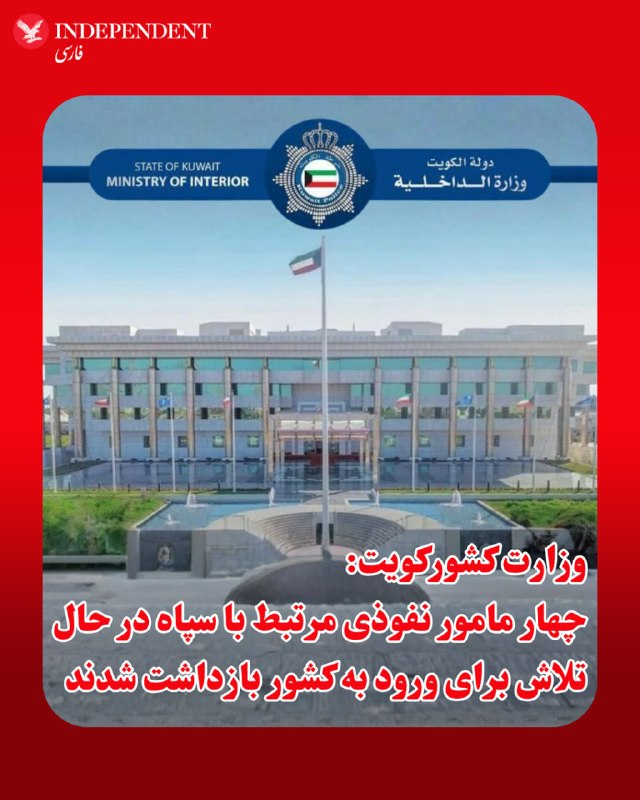

♦️وزارت کشور کویت روز سه‌شنبه ۲۲ اردیبهشت اعلام کرد چهار مامور «نفوذی» مرتبط با سپاه پاسداران در زمان تلاش برای ورود به خاک این کشور از طریق دریا بازداشت شدند.

به گزارش خبرگزاری دولتی کویت، یکی از نیروهای امنیتی این کشور در جریان درگیری با «ماموران نفوذی» مرتبط با سپاه بازداشت شده است.

در جریان جنگ اخیر بین جمهوری اسلامی ایران با آمریکا و اسرائیل، کویت بارها هدف حملات موشکی و پهپادی سپاه و شبه‌نظامیان عراقی حامی حکومت ایران قرار گرفت.
‌🇸🇦 Indypersian

🤖 @VahidOOnLine

## mwarmonitor — post 8957

🇮🇱«احزاب فوق‌ارتدوکس اسرائیل تهدید کرده‌اند که پارلمان را منحل کرده و احتمالاً انتخابات جدیدی را به جریان بیندازند، پس از آنکه بنیامین نتانیاهو، نخست‌وزیر، به آن‌ها اعلام کرد در حال حاضر اکثریتی برای تصویب قانونی که بسیاری از دانشجویان مذهبی را از خدمت سربازی معاف کند وجود ندارد.

🔸گزارش‌ها حاکی از آن است که یک بحران سیاسی میان دفتر نتانیاهو و موشه گافنی، یکی از رهبران ارشد جریان فوق‌ارتدوکس، در حال شکل‌گیری است و گفته می‌شود او تماس‌های نخست‌وزیر را پاسخ نمی‌دهد.»

@mwarmonitor

## mwarmonitor — post 8956

🔴« (رویترز) - مایک هاکبی، سفیر آمریکا در اسرائیل، روز سه‌شنبه گفت اسرائیل سامانه‌های باتری دفاع هوایی گنبد آهنین به همراه نیروهای عملیاتی آن را به امارات متحده عربی ارسال کرده است.»

@mwarmonitor

## IranIntlTV — post 336795

🗣روایت شما از بحران اقتصادی و زندگی در آتش‌بس- سه‌شنبه ۲۲ اردیبهشت:

🔹بهار پارسال قبض برق ۲۸۰ هزار تومان می‌آمد الان با چند کیلووات تفاوت، شده ۸۹۰ هزار تومان! چطور می‌شود در کمتر از یک سال بالای ۲۰۰ درصد افزایش هزینه برق داشته باشیم، اما حقوق فقط ۲۵ درصد اضافه شود؟

🔹کاش فکری به حال بازنشسته‌های فولاد و ذوب آهن شود که چند ماهه بیمه‌شان قطع شده. درحالی‌که بسیاری از بازنشسته‌ها دچار مشکلات سلامتی هستند و نیاز به بیمه برای روند درمانی‌شان دارند.

🔹از نیشابور پیام می‌دهم؛ وضعیت ‌آن‌چنان اسفناک شده که با سه شیفت کار کردن نمی‌شود حتی شکم را هم سیر کرد.

🔹تهیه مواد خوراکی سخت شده و تورم و بیکاری بیداد می‌کند. اکثر شرکت‌ها نیروهایشان را تعلیق کرده‌اند. کسب‌وکارهای آزاد هم خوابیده‌اند و مشتری ندارند، حتی در بخش خدمات.

🔹بازار خرید و فروش ماشین و ملک نوسان لحظه‌ای دارد. یک خودروی ۵۰۰ میلیون تومانی این هفته حدود ۲۰۰ میلیون تومان افزایش قیمت داشته.

🔹یک جعبه قرص مدیسن برای نقرس که قیمتش ۳۶۰ هزار تومان است را چون در داروخانه‌ها پیدا نمی‌شد، در بازار آزاد به قیمت ۵ میلیون تومان خریدم.

🔹داروی اربیتوکس برای بیماران مبتلا به سرطان از حدود ۵ میلیون تومان به هر ویال ۲۵ میلیون تومان افزایش یافته. برای یکی جلسه شیمی‌درمانی حدود شش ویال نیاز است.

🔹قیمت مسکن‌های نوافن، ریفن و آسیفن از ۳۰ هزار تومن برای هر ورق ۱۰تایی به ۶۸ هزار تومن افزایش یافته است.

## IranIntlTV — post 336794

  <a href="telegram/content/IranIntlTV_336794_1778582769.mp4" target="_blank">🎬 Download video</a>

هم‌زمان با ادامه قطع سراسری اینترنت در ایران و افزایش انتقادها به دسترسی طبقاتی، فاطمه مهاجرانی، سخنگوی دولت جمهوری اسلامی، اعلام کرد طرح اینترنت پرو مصوبه شورای عالی امنیت ملی است و تا شرایط عادی نشود این طرح ادامه خواهد داشت.
گفت‌وگو با نیما اکبرپور، کارشناس فناوری
@iranintltv

## FarsiVOA — post 217517

🔺جمهوری اسلامی منشأ لکه نفتی اطراف خارک را «نفتکش خارجی» اعلام کرد

▪️رئیس سازمان حفاظت محیط زیست ایران درباره لکه نفتی دیده شده در آب‌های اطراف جزیره خارک در خلیج فارس گفت که منشأ آلودگی مربوط به نشت «آب توازن آلوده به مواد نفتی مربوط به یک نفتکش غیرایرانی» بوده است.

▪️او جزئیات دقیق‌تری در این زمینه ارائه نکرد و اسم این نفتکش یا کشوری را که به آن تعلق دارد، اعلام نکرد.

▪️همچنین مشخص نیست که این نفتکش بر اثر چه حادثه‌ای آسیب دیده است.

▪️در حالی که پیشتر مقامات جمهوری اسلامی آلودگی آب‌های اطراف جزیره خارک را تکذیب کرده بودند، سازمان حفاظت محیط‌زیست ایران، دوشنبه ۲۱ اردیبهشت وجود این آلودگی را تأیید و اعلام کرد که ناشی از «نشت آب توازن یک نفتکش» بوده است.

⬇️ بیشتر بخوانید:
https://ir.voanews.com/a/8149155.html

## DW_Farsi — post 124588

  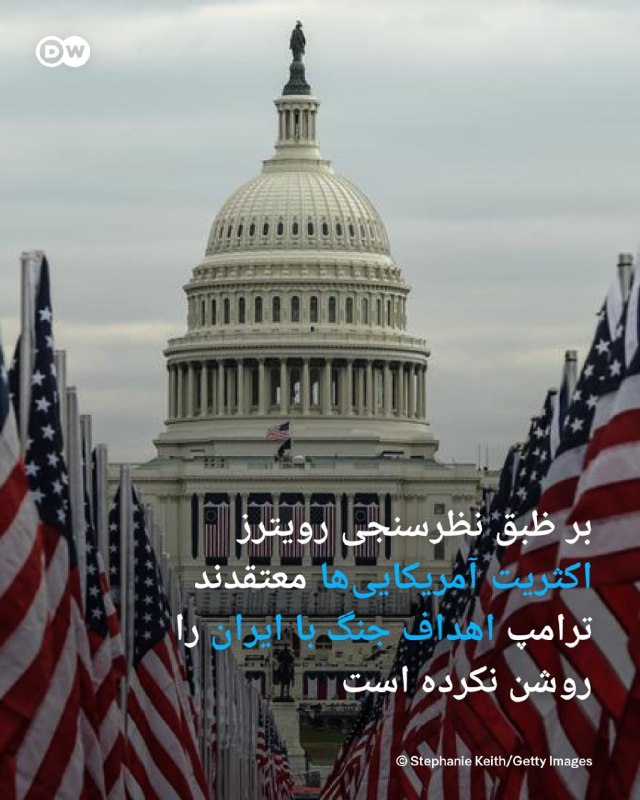

🔶نظرسنجی رویترز: اکثریت آمریکایی‌ها معتقدند ترامپ اهداف جنگ با ایران را روشن نکرده است

طبق یک نظرسنجی که توسط خبرگزاری رویترز و مؤسسه ایپسوس انجام شده، از هر سه آمریکایی دو نفر معتقدند دونالد ترامپ اهداف جنگ با ایران را به طور شفاف توضیح نداده است.

در این نظرسنجی که نتایج آن روز دوشنبه ۱۱ مه (۲۱ اردیبهشت) منتشر شد، حدود ۶۶ درصد پاسخ‌دهندگان گفته‌اند که رئیس جمهور آمریکا اهداف مداخله نظامی ایالات متحده در ایران را به روشنی توضیح نداده است.

همچنین ۶۳ درصد گفته‌اند که افزایش هزینه‌های انرژی به وضعیت مالی خانوارهایشان فشار وارد آورده است. این رقم در نظرسنجی دیگری که اواسط ماه مارس انجام شده بود ۵۵ درصد بود.

@dw_farsi

## IranianMinds — post 19999

🔴اسماعیل بقایی، سخنگوی وزارت امور خارجه:

اول باید داستان تنگه هرمز و پایان جنگ مشخص بشود تا راهی برای مذاکره در مورد انرژی هسته‌ای هم به وجود بیاید.

@IranianMinds

## BBCPersian — post 280835

🔻سفیر آمریکا در سازمان ملل: اسرائیل در جریان جنگ، به امارات گنبد آهنین داد

روزنامه «اسرائیل هیوم» به نقل از سفیر آمریکا در سازمان ملل نوشت که اسرائیل در جریان جنگ اخیر، سامانه پدافند گنبد آهنین در اختیار امارات متحده عربی قرار داده است.

پیش از گزارش این روزنامه راستگرا، سایت خبری اکسیوس هم به نقل از مقام‌های آمریکایی و اسرائیلی بدون ذکر نام این خبر را داده بود.

اسرائیل هیوم از مایک والتس، سفیر آمریکا در سازمان ملل، نقل کرده است که «ما شاهد استفاده امارات از (سامانه) گنبد آهنین بودیم که اسرائیل در اختیار آنها قرار داده است.»

این روزنامه می‌گوید که آقای والتس از جزئیاتی پرده برداشته است که نشانگر «تعمیق» روابط اسرائیل و امارات است.

پیشتر روزنامه آمریکایی وال‌استریت جورنال گزارش داده بود که امارات متحده عربی مخفیانه در اوايل ماه آوريل گذشته و هم‌زمان با اعلام آتش‌بس، چند حمله هوایی به تاسیسات نفتی ایران انجام داده است.

بنیامین نتانیاهو، نخست‌وزیر اسرائیل، مکررا وعده «خاورمیانه‌ جدید» را داده است که به گفته او شاهد افزایش همکاری اسرائیل و کشورهای منطقه خلیج فارس علیه ایران خواهد بود.

رسانه‌های اسرائیل هم در جریان جنگ اخیر بارها از «همکاری بی‌سابقه» با کشورهای منطقه خلیج فارس خبر داده بودند.

با آغاز حملات آمریکا و اسرائیل به ایران در نهم اسفند، سپاه پاسداران پایگاه‌های آمریکا و برخی نقاط را در برخی کشورهای حاشیه خلیج فارس هدف قرار داد.

ایران این کشورها را به همکاری با آمریکا و اسرائیل در حمله به ایران متهم می‌کند.

@BBCPersian

## Dirty_Kids — post 389308

بعد از ۸۸ تنها کسی که تونست اشک خامنه‌ای رو دربیاره ترامپ بود با کتلت کردن سلیمانی، چندسال بعدشم خودش رو فرستاد یخچال. واقعا چه مادری این بزرگمرد از شیعه گایید ما خیلی قدرنشناسیم

@Dirty_Kids 👻

## Dirty_Kids — post 389306

گه تو قبر بابات. چه قدر چرک و بی‌پرنسیپی

کاسبی‌ کردن با دردهای مردم، فقط از یه ذهن مریض‌ و هرزه برمیاد که توی زندگی شخصیشم‌‌ بویی از اخلاق نبرده و مرزهای وقاحت رو جابجا کرده‌ و عجیب نیست که‌بخواد از عمیق‌ترین زخم‌های‌ این مردم هم پول‌دربیاره.‌ این تیشرت‌ها برند نیست، نشان بی‌شرفی‌سازنده‌شه. پول دادن به این انگل‌بی‌ریشه، توهین به‌انسانیته.

@Dirty_Kids 👻

## Dirty_Kids — post 389305

‏یه وی‌پی‌ان ارزون دارم با نفت کار میکنه اول تلگرامو باز میکنم یکم گُر گرفت میرم توییتر و اینستا

@Dirty_Kids 👻

## Dirty_Kids — post 389304

  

بالاخره هر رهبری یک اثری از خودش بجا میزاره

@Dirty_Kids 👻

## Dirty_Kids — post 389303

  <a href="https://t.me/Dirty_Kids/389303" target="_blank">📎 Download file</a>

✅ اپلیکیشن اندروید سایت جهانی دربی بت

💰اولین سایت جهانی با امکان شارژ و برداشت ریالی(کارت به کارت)

🔗 برای ورود فیلترشکن روی کشور مناسب قرار دهید مانند فنلاند و المان و....

😀Telegram Channel
👇
https://t.me/+bcynkEgSW2dlYTc0

## Dirty_Kids — post 389302

  

😤دنبال یه سایت شرط بندی بین المللی بودی که به ایرانیا خدمات بده؟!
⛔

👍دربی بت همون انتخاب  100%

💎ویژگی های سایت جهانی Derby Bet:

⬅️امکان شارژ امن با کارت بانکی

⬅️واریز اول دوبل شارژ می شوید(بونوس۱۰۰٪)

⬅️پر اپشن ترین سایت فعال در ایران

⬅️تسویه حساب کمتر از 5 دقیقه

⬅️برگشت بخشی از باخت به صورت هفتگی

🚨کد هدیه ثبت نام:GG007

⚠️برای دانلود اپلکیشن کلیک کنید
👉

🔔کانال دربی بت :

🪙https://t.me/+bcynkEgSW2dlYTc0

## Dirty_Kids — post 389301

  <a href="telegram/content/Dirty_Kids_389301_1778582776.mp4" target="_blank">🎬 Download video</a>

🐁🐀خواهران جان فدا .V.S موش🐭🐁

@Dirty_Kids 👻

## alonews — post 119467

  <a href="telegram/content/alonews_119467_1778582778.webm" target="_blank">🎬 Download video</a>

👈علیرضا دبیر عکس‌ کارولین لیویت سخنگوی کاخ سفید با بچش رو گذاشت و نوشت الهی داغشو ببینی

✅ @AloNews خبر جنگ

## alonews — post 119466

  <a href="telegram/content/alonews_119466_1778582778.webm" target="_blank">🎬 Download video</a>

👈سپاه اصفهان: امروز از ساعت ۱۵ تا ۱۸ در محدودهٔ زردنجان احتمال شنیدن صدای انفجار کنترل‌شده وجود خواهد داشت.

✅ @AloNews خبر جنگ

---
📅 بروزرسانی: 1405/02/22 13:48
---

## VahidOOnLine — post 239676

  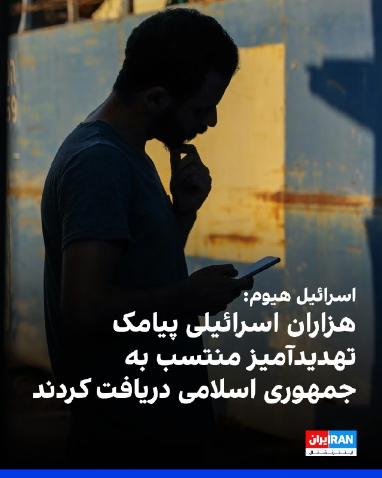

اسرائیل هیوم گزارش داد هزاران اسرائیلی از شامگاه ۲۲ اردیبهشت پیامک‌های تهدیدآمیز به زبان عبری دریافت کردند که در آن‌ها از سوی هکرهای منتسب به تهران خواسته شده با جمهوری اسلامی همکاری کنند.

در این پیام‌ها آمده است: «جمهوری اسلامی شما را به همکاری اطلاعاتی دعوت می‌کند و به‌زودی خورشید را در آسمان شب خواهید دید.»

اداره ملی سایبری اسرائیل اعلام کرد این پیام‌ها با هدف ایجاد هراس و جمع‌آوری اطلاعات شخصی ارسال شده و از شهروندان خواست آن‌ها را نادیده بگیرند و گزارش دهند.
‌🏁 🇬🇧 IranintlTV

🤖 @VahidOOnLine

## VahidOOnLine — post 239675

  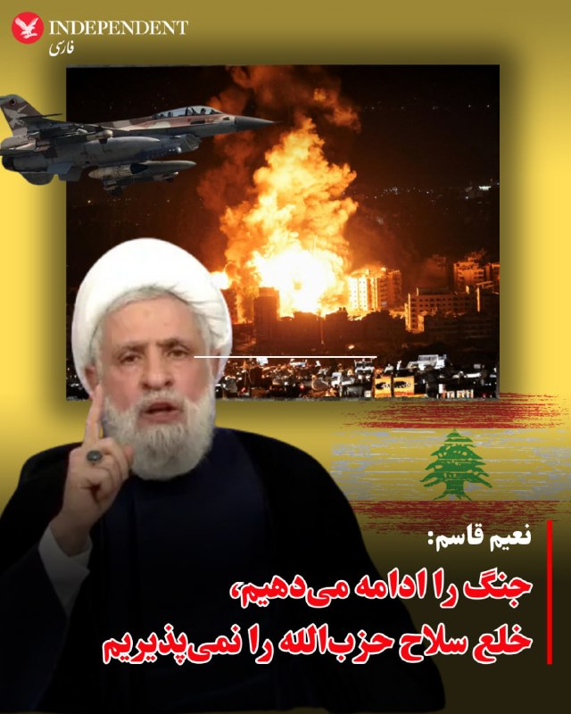

♦️نعیم قاسم، دبیر کل حزب‌الله لبنان روز سه‌شنبه ۲۲ اردیبهشت و در آستانه برگزاری دور سوم مذاکرات میان نمایندگان اسرائیل و دولت لبنان در واشنگتن، با صدور بیانیه‌ای بار دیگر تاکید کرد که خلع سلاح این گروه را نمی‌پذیرد.

نعیم قاسم با تشکر از جمهوری اسلامی برای «نگرانی از شرایط لبنان» در این بیانیه نوشت بهترین راه پایان جنگ با اسرائیل، آتش‌بس میان ایران و آمریکا است که لبنان هم جزئی از آن باشد.

دبیرکل حزب‌الله لبنان که از حدود یک ماه پیش دیگر پیام ویدیویی صادر نمی‌کند اعلام کرد اعضای این گروه با وجود تجهیزات اندک، در برابر ارتش اسرائیل به خوبی مقاومت می‌کنند و جنگ را ادامه می‌دهند.
‌🇸🇦 Indypersian

🤖 @VahidOOnLine

## VahidOOnLine — post 239674

  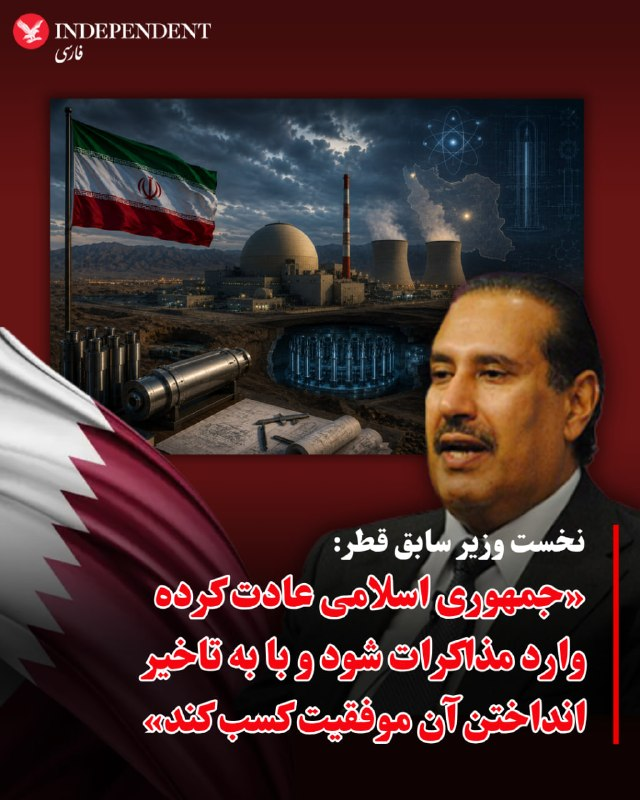

⭕️نخست وزیر سابق قطر: «جمهوری اسلامی عادت کرده وارد مذاکرات شود و با به تاخیر انداختن آن موفقیت کسب کند»

♦️جاسم بن جابر آل ثانی، نخست وزیر و وزیر امور خارجه پیشین قطر روز دوشنبه ۲۱ اردیبهشت در یک مصاحبه گفت «جمهوری اسلامی عادت کرده وارد مذاکرات شود و با به تاخیر انداختن آن موفقیت کسب کند».

نخست وزیر پیشین قطر که کشورش برای مدت‌ها یکی از میانجی‌های تهران و واشنگتن بود در همین مصاحبه گفت: «برنامه هسته‌ای برای جمهوری اسلامی ماهیتی «وجودی و حاکمیتی» دارد و به نظر نمی‌رسد که حکومت ایران حاضر باشد در جریان مذاکرات با آمریکا، این برنامه را «رایگان» رها کند.»
‌🇸🇦 Indypersian

🤖 @VahidOOnLine

## VahidOOnLine — post 239673

  <a href="telegram/content/VahidOOnLine_239673_1778581128.mp4" target="_blank">🎬 Download video</a>

دادگاه کیفری بحرین دو مرد و یک زن را به اتهام ارتباط با سپاه پاسداران و برنامه‌ریزی برای اقدامات «تروریستی و خصمانه» علیه این کشور، به حبس ابد محکوم کرد.
به گفته دادستانی بحرین، دو متهم مرد با سپاه در ارتباط بوده‌اند و برای جمع‌آوری اطلاعات از مراکز حساس، انتقال پول و حمایت از عملیات مورد نظر ایران همکاری می‌کردند. متهم اصلی پیش‌تر به ایران گریخته بود.
در پرونده‌ای جداگانه، یک زن نیز به اتهام انتشار تصاویر و مختصات مراکز حساس بحرین و حمایت از جمهوری اسلامی در شبکه‌های اجتماعی، به حبس ابد محکوم شد.
دادگاه همچنین هر یک از دو متهم مرد را به پرداخت ۱۰ هزار دینار بحرینی معادل تقریبا ۲۶۵۹۵٫۷۴ دلار آمریکا جریمه محکوم کرد.
‌🏁 🇬🇧 ManotoTV

🤖 @VahidOOnLine

## VahidOOnLine — post 239672

  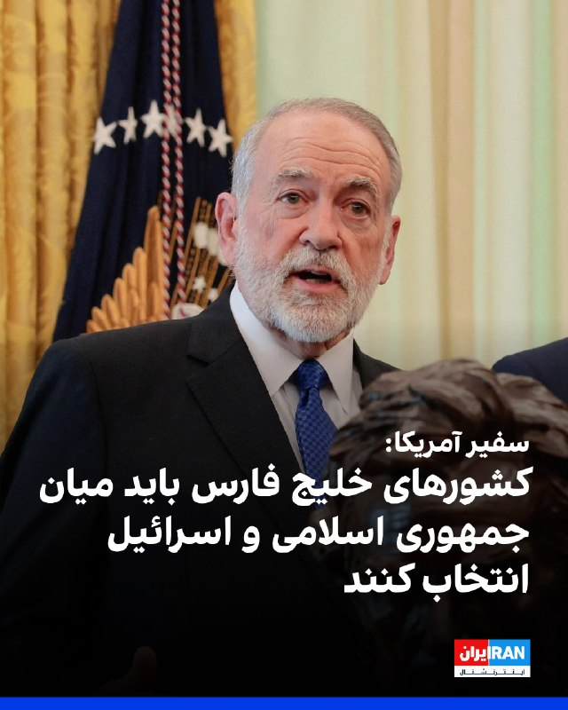

مایک هاکبی، سفیر آمریکا در اسرائیل، با اشاره به اقدام اسرائیل برای ارسال سامانه گنبد آهنین و نیروهایی برای راه‌اندازی آن در امارات متحده عربی گفت که این اقدام در چارچوب روابط «فوق‌العاده» اسرائیل و امارات متحده عربی بر اساس توافق‌های ابراهیم انجام شده است.

او افزود: «کشورهای خلیج فارس اکنون می‌دانند که باید انتخاب کنند؛ احتمال اینکه از سوی ایران هدف حمله قرار گیرند بیشتر است یا از سوی اسرائیل؟ آن‌ها می‌بینند که اسرائیل به ما کمک کرد و ایران به ما حمله کرد. اسرائیل به دنبال تصرف سرزمین شما نیست و برای شما موشک نمی‌فرستد.»
‌🏁 🇬🇧 IranintlTV

🤖 @VahidOOnLine

## VahidOOnLine — post 239671

  <a href="telegram/content/VahidOOnLine_239671_1778581130.mp4" target="_blank">🎬 Download video</a>

روزنامه اسرائیل هیوم گزارش داد هزاران شهروند اسرائیلی پیامک‌هایی تهدیدآمیز به زبان عبری دریافت کرده‌اند که در آنها از مخاطبان خواسته شده با جمهوری اسلامی همکاری اطلاعاتی کنند.

در یکی از این پیامک‌ها آمده است: «به شما قول داده بودیم که به‌زودی ستاره‌هایی را در آسمان شب خواهید دید که ستاره نیستند… به‌زودی خورشید را در آسمان شب خواهید دید، اما…»

بر اساس این گزارش، سازمان ملی سایبری اسرائیل این پیام‌ها را بخشی از تلاش برای ایجاد ترس و اثرگذاری روانی توصیف کرده و از شهروندان خواسته است به پیام‌ها پاسخ ندهند، شماره فرستنده را مسدود کنند و آن را گزارش دهند.
‌🏁 🇬🇧 ManotoTV

🤖 @VahidOOnLine

## VahidOOnLine — post 239670

  

♦️دادگاه عالی جنایی بحرین روز سه‌شنبه ۲۲ اردیبهشت یک زن را به اتهام همکاری اطلاعاتی با سپاه پاسداران به حبس ابد محکوم کرد.
به گزارش دیلی تریبون بحرین، این زن متهم است که در شبکه‌های اجتماعی تصاویری از اهداف و اماکن حیاتی کشورش را با هدف ضربه زدن به امنیت ملی بحرین منتشر می‌کرده است.

این زن همچنین متهم شده است که تصاویری از حملات جمهوری اسلامی به بحرین را همراه با محتوایی در راستای تمجید حکومت ایران منتشر می‌کرده است.
‌🇸🇦 Indypersian

🤖 @VahidOOnLine

## VahidOOnLine — post 239669

  

مسعود پزشکیان، رییس دولت جمهوری اسلامی، گفت: «دولت بنا ندارد برای فعالیت اقتصادی سالم محدودیت ایجاد کند، اما در مقابل نیز اجازه نخواهد داد عده‌ای با سوءاستفاده از شرایط جنگی، معیشت مردم را هدف قرار دهند.»

او یکی از سیاست‌های اساسی دولت چهاردهم در وضعیت کنونی را «کنترل مصرف و جلوگیری از شکل‌گیری تقاضای القایی و کاذب» دانست و افزود: «ایجاد تقاضای غیرواقعی بدون تامین متناسب کالا، منجر به نارضایتی عمومی خواهد شد.»

پزشکیان ادامه داد: «یکی از مهم‌ترین اهداف دشمن در شرایط فعلی، ایجاد اختلال در اقتصاد و فشار بر معیشت مردم است.»
‌🏁 🇬🇧 IranintlTV

🤖 @VahidOOnLine

## VahidOOnLine — post 239668

🗣روایت شما از زندگی زیر سایه آتش‌بس- سه‌شنبه ۲۲ اردیبهشت:

🔹قیمت قطعات خودرو مثل طلا به‌صورت دقیقه‌ای قیمت‌گذاری می‌شه و به طرز فجیعی بالا رفته، حتی نمی‌شه قطعات خودرو رو تعویض کرد.

🔹تهران آن‌قدر بیکاری زیاد شده که مردم همه راننده اسنپ شدند، آن هم با کرایه پایین که اصلا به‌صرفه نیست. گرانی بیداد می‌کند.

🔹کلی تلاش کردم وصل بشم تا بگم چرا پدر بازنشسته من بعد از ۳۰ سال تمام کار کردن باید حقوقش ۳۰ میلیون تومان باشد و برای خرج روزهایمان از صبح تا شب اسنپ کار کند؟

🔹من یک استادکار تاسیسات ساختمانم. اجناس تاسیسات پیش از عید تا حالا حدود ۴ برابر شده و به‌خاطر افزایش شدید قیمت اجناس، تقاضا برای کار تقریبا صفر شده.

🔹قیمت قهوه سر به فلک گذاشته و دیگر یک قهوه ساده هم نمی‌شود خورد. یک کیلو کیک و شیرینی بالای یک میلیون تومان شده. یک سالاد معمولی در کافه ۸۰۰ هزار تومان است.

🔹از شهر چابهار پیام می‌دهم؛ این‌جا زندگی روزه مردم به شدت مختل شده است، خصوصا برای قشر کارگر. خرید یک مرغ شده آرزو.
‌🏁 🇬🇧 IranintlTV

🤖 @VahidOOnLine

## VahidOOnLine — post 239667

♦️غلامحسین محسنی اژه‌ای، رئیس قوه قضائیه جمهوری اسلامی روز سه‌شنبه ۲۲ اردیبهشت گفت «برخی سرگردانی‌ها مثل پتکی بر سر مردم است».

اژه‌ای به مسئولان قضایی حکومت گفت باید بررسی شود که آیا سیم‌کارت سفید و «اینترنت پرو» تخلف قانونی هستند، باید با آن‌ها برخورد شود.

درحالی که از قطعی اینترنت در ایران ۷۴ روز می‌گذرد، دولت جمهوری اسلامی با هماهنگی شورای عالی امنیت ملی به گروهی از افراد در قبال هزینه‌های بالا اجازه اتصال به «اینترنت پرو/حرفه‌ای» داده است.
همین مساله باعث نارضایتی گسترده از ایجاد یک تبعیض جدید در جامعه شده است.
‌🇸🇦 Indypersian

🤖 @VahidOOnLine

## VahidOOnLine — post 239666

  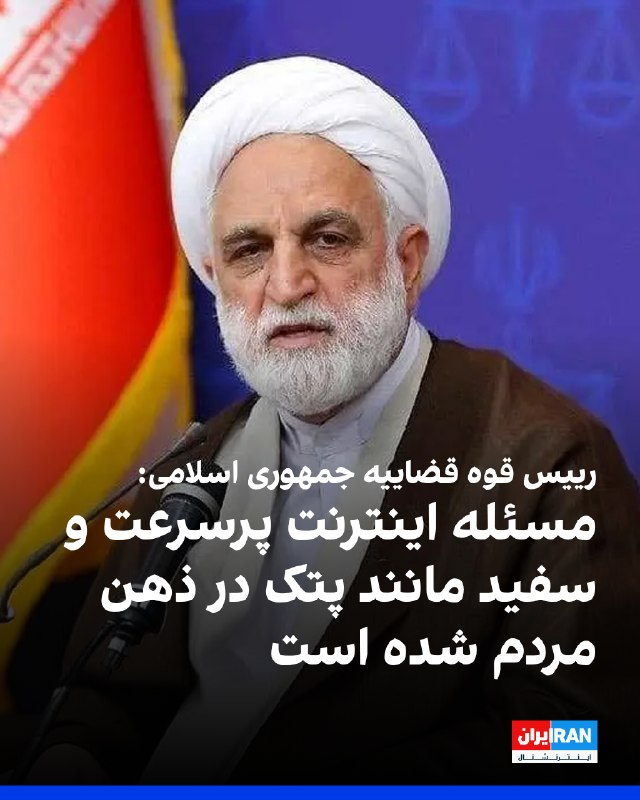

غلامحسین محسنی اژه‌ای، رییس قوه قضاییه جمهوری اسلامی، در جلسه‌ای با وزیر ارتباطات درباره «اینترنت پرو» و «سیم‌کارت سفید»، گفت: «موضوعاتی که برای مردم شفاف نمی‌شود، مانند پُتک بر افکار عمومی و اذهان جمعی فرود می‌آیند.»

اژه‌ای افزود: «قضیه اینترنت پرو و سیم‌کارت سفید در ذهن مردم مسئله ایجاد کرده است و اگر شفاف‌سازی نکنیم باعث بدبینی شهروندان خواهد شد.»

او به وجود شرایط جنگی اشاره کرد و گفت «سرمایه اصلی ما در این نبرد سرنوشت‌ساز» مردم هستند و «نباید اجازه دهیم دچار بی‌اعتمادی شوند».
‌🏁 🇬🇧 IranintlTV

🤖 @VahidOOnLine

## VahidOOnLine — post 239665

  

دادگاه عالی کیفری بحرین یک زن را به اتهام تلاش و همکاری اطلاعاتی با سپاه پاسداران با هدف انجام اقدامات خصمانه علیه این کشور به حبس ابد محکوم کرد.

دادستانی بحرین اعلام کرد این پرونده پس از شناسایی یک حساب کاربری در شبکه‌های اجتماعی تشکیل شد که تصاویر و مختصات برخی مکان‌ها و تاسیسات «مهم و حیاتی» در بحرین را منتشر می‌کرد.

به گفته مقام‌های بحرینی، محتوای منتشرشده در این حساب به جایگاه نظامی، سیاسی و اقتصادی این کشور آسیب می‌زد و شامل مطالبی در تمجید، تشویق و تبلیغ آنچه «حمله جمهوری اسلامی به بحرین» خوانده شده، بود.

دادستانی بحرین اعلام کرد این زن در بازجویی‌ها اتهامات مطرح‌شده را پذیرفته و گفته بود حساب کاربری خود را برای کمک به «مهاجمان علیه بحرین» اختصاص داده است.

به گفته دادستانی، او تصاویر و مختصات شماری از مکان‌های حیاتی را همراه با عباراتی درباره امکان هدف قرار گرفتن آن‌ها منتشر کرده بود.
‌🏁 🇬🇧 IranintlTV

🤖 @VahidOOnLine

## VahidOOnLine — post 239664

⭕️عربستان سعودی آینده امنیت غذایی را مهندسی می‌کند

📌تلاش عربستان سعودی برای تضمین امنیت غذایی خود، بیش‌ازپیش با علم، کشاورزی دقیق و نوآوری گسترده در یکی از سخت‌ترین شرایط اقلیمی جهان تعریف می‌شود

♦️عربستان سعودی در چارچوب چشم‌انداز ۲۰۳۰، با تکیه بر آبیاری هوشمند، کشاورزی دیجیتال، پژوهش‌های علمی و همکاری گسترده دولت و بخش خصوصی، در حال تبدیل کردن بیابان‌های خشک این کشور به قطب‌ تولید مواد غذایی است؛ تحولی که از مزارع عظیم سیب‌زمینی در وادی الدواسر تا استفاده از فناوری‌های هوش مصنوعی و «کشاورزی احیاگر بیابان» را دربر می‌گیرد و هدف آن کاهش وابستگی غذایی، صرفه‌جویی گسترده در مصرف آب و ایجاد الگویی پایدار برای تولید غذا در یکی از کم‌آب‌ترین کشورهای جهان است.

بیشتر بخوانید...
‌🇸🇦 Indypersian

🤖 @VahidOOnLine

## VahidOOnLine — post 239663

♦️فاطمه مهاجرانی، سخنگوی دولت جمهوری اسلامی روز سه‌شنبه ۲۲ اردیبهشت گفت با توجه به وضعیت جنگی، فعلا اینترنت عمومی وصل نخواهد شد.

مهاجرانی در پاسخ به پرسش‌های متعدد خبرنگاران درباره وضعیت اینترنت و به‌ویژه «اینترنت پرو» گفت ما در وضعیت جنگی هستیم. رئیس جمهوری به‌عنوان رئیس شورای عالی امنیت ملی پیگیر حقوق مردم است اما وضعیت جنگی است و بعد از پایان شرایط ویژه، اینترنت به‌حالت قبل بازخواهد گشت.»

پس از این سخنان، چند خبرنگار تلاش کردند تا با یادآوری تعهدات دولت پیگیر وضعیت وصل اینترنت شوند. مهاجرانی خطاب به آن‌ها گفت: «وقتی رئیس جمهوری آمریکا می‌گوید آتش‌بس به تنفس مصنوعی وصل است، انتظار شما چیست؟»
‌🇸🇦 Indypersian

🤖 @VahidOOnLine

## VahidOOnLine — post 239662

⭕️ادعا‌ها و تهدید‌های رژیم ایران؛ چه کابل‌هایی از بستر تنگه هرمز عبور می‌کنند؟

📌چندین شبکه اصلی از بستر تنگه هرمز عبور می‌کنند، از جمله کابل آسیا-آفریقا-اروپا ۱ (AAE-1) که جنوب شرق آسیا را از طریق مصر به اروپا متصل می‌کند و نقاط اتصال آن در امارات متحده عربی، عمان، قطر و عربستان سعودی قرار دارد

♦️در تازه‌ترین تلاش جمهوری اسلامی برای اعمال فشار و کسب درآمد از تنگه هرمز، رسانه‌های نزدیک به سپاه پاسداران و نهادهای حکومتی جمهوری اسلامی در روزهای اخیر ادعای دریافت هزینه سالانه از شرکت‌های بین‌المللی برای استفاده از کابل‌های فیبر نوری زیردریایی در تنگه هرمز را مطرح کرده‌اند.

بیشتر بخوانید...
‌🇸🇦 Indypersian

🤖 @VahidOOnLine

## VahidOOnLine — post 239661

  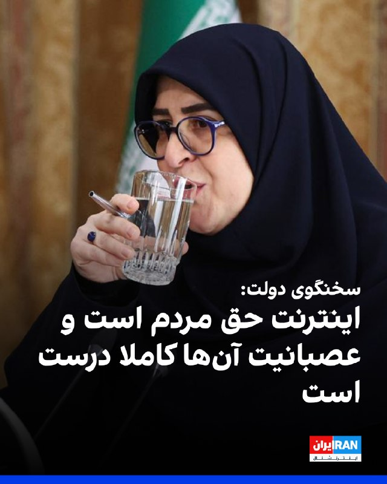

فاطمه مهاجرانی، سخنگوی دولت جمهوری اسلامی، با اشاره به قطعی طولانی‌مدت اینترنت در ایران گفت اینترنت حق مردم است و عصبانیت مردم کاملا درست است. اما در ادامه تاکید کرد: «عامل این عصبانیت دشمنانی هستند که باعث می‌شوند فضای امنیتی ما مخدوش شود.»

او افزود: «رسانه‌ها کمک کنند که این ادبیات را جا بیندازند. دولت طرفدار دسترسی آزاد است.»
‌🏁 🇬🇧 IranintlTV

🤖 @VahidOOnLine

## VahidOOnLine — post 239660

  <a href="telegram/content/VahidOOnLine_239660_1778581135.mp4" target="_blank">🎬 Download video</a>

گروهی از نیروهای ارتش بریتانیا برای رساندن کمک پزشکی به یک شهروند بریتانیایی مشکوک به ابتلا به هانتاویروس، با چتر روی جزیره دورافتاده تریستان دا کونا در جنوب اقیانوس اطلس فرود آمدند.

بر اساس اعلام وزارت دفاع بریتانیا، این عملیات با حضور شش چترباز و دو پزشک نظامی از تیپ شانزدهم حمله هوایی انجام شد. این نیروها از یک هواپیمای ترابری ایرفورس ای۴۰۰ام به جزیره اعزام شدند و همزمان اکسیژن و تجهیزات پزشکی نیز از هوا رها شد.

وزارت دفاع بریتانیا گفته است این نخستین‌بار است که ارتش این کشور برای یک ماموریت بشردوستانه پزشکی، نیروی درمانی را از راه پرش با چتر اعزام می‌کند. هانتاویروس بیماری نادری است که معمولا از طریق تماس یا تنفس ذرات آلوده به ادرار، مدفوع یا بزاق جوندگان منتقل می‌شود و در موارد شدید می‌تواند خطرناک باشد.
‌🏁 🇬🇧 ManotoTV

🤖 @VahidOOnLine

## VahidOOnLine — post 239659

🗣روایت شما از بحران اقتصادی و زندگی در آتش‌بس- سه‌شنبه ۲۲ اردیبهشت:

🔹در تاریخ ۲۰ اردیبهشت یک متر لوله پلیکا در ملایر خریدم یک میلیون و ۷۰۰ هزار تومان. قیمت‌ها به شکلی باورنکردنی افزایش یافته‌اند.

🔹من بیماری صرع دارم. پک ۶ تایی دارویم را قبلا در شیراز ۲۵۰ هزار تومن می‌خریدم، یک ماه پیش شد ۷۵۰ هزار تومان، الان قیمتش رسیده به دو میلیون و ۳۰۰ هزار تومان.

🔹چند ماه پیش قیمت آزاد قطره بتامتازون نهایتا ۷۰ هزار تومن بود امروز همان را با قیمت ۱۴۰ هزار تومان خریدم.

🔹قیمت بستنی قیفی در تهران در مقایسه با دوره پیش و پس از جنگ جهش کرده و از ۳۰ تومان به ۸۰ تومان رسیده است.

🔹من کارمند شرکت سایپا هستم حقوق‌ها را قسطی می‌ریزند، حتی به بازنشسته‌ها گفته‌اند سنوات‌تان را مهر ماه واریز می‌کنیم.

🔹پنج عدد تخم مرغ و سه تا دونه گوجه‌فرهنگی و یه پاکت سیگار، جمعا ۳۲۰ هزار تومن شد.
‌🏁 🇬🇧 IranintlTV

🤖 @VahidOOnLine

## mwarmonitor — post 8955

🔴«گروهی از مردان که به اتهام تلاش برای ورود به کشور از طریق دریا بازداشت شده بودند، در جریان بازجویی اعتراف کردند که عضو سپاه پاسداران انقلاب اسلامی ایران هستند، به گفته وزارت کشور کویت.»

@mwarmonitor

## mwarmonitor — post 8954

🔴«برخی از مقام‌های دولت همچنین معتقدند که پاکستان اغلب نسخه‌ای مثبت‌تر از موضع ایران را به آمریکا منتقل می‌کند نسبت به آنچه در واقعیت وجود دارد، به گفته دو منبع.» CNN

📝عمان هم همین رویکرد را در پیش گرفته بود، اما پس از اینکه آمریکا متوجه شد، از نقش میانجی‌گری کنار گذاشته شد. حالا هم گزارش‌هایی درباره پنهان‌کاری پاکستان در مورد هواپیمای ایرانی مطرح شده است.

@mwarmonitor

## mwarmonitor — post 8953

  <a href="telegram/content/mwarmonitor_8953_1778581137.mp4" target="_blank">🎬 Download video</a>

📝 ببین مرتیکه پزشکیان، تو که با اون زبون‌بازی و وعده‌های کثیفِ «برداشتن فیلترینگ» مثل یه لاشخور سیاسی روی رای مردم چنبره زدی، حالا دستت رو شده. دروغگوی رذل ، تو که می‌گفتی حق مردم اینترنت آزاده، چطور شد که حالا شدی سگِ نگهبانِ اینترنت طبقاتی؟ این «اینترنت پرو» دیگه چه لجن‌زاریه که برای دوشیدن بیشتر مردم راه انداختی؟
🔸شماها چه موجودات پست و رذلی هستید؛ ۲۴ ساعت کف خیابون مثل دیوونه‌ها پرچم می‌چرخونید و برای پیروزی‌های پوشالی‌تون عربده می‌کشید، اما وقتی نوبت به حق مردم می‌رسه، موش می‌شید و پشت «مصوبه امنیتی» قایم می‌شید. از بقال تا قصاب رو مجبور کردید برای یه ذره ارتباط، دنبال این کوفت و زهرماری که اسمشو گذاشتید «پرو» باشن. شما پیروز نشدید، شما فقط توی حروم‌زادگی و وقاحت رکورد زدید. با وعده آزادی اومدی و حالا داری اینترنت رو هم مثل بقیه زندگی مردم جیره‌بندی می‌کنی؛ ننگ بر تو و اون سیاست‌های کثیفت که از گرسنگی و محدودیت مردم برای خودتون دکان باز کردید.

@mwarmonitor

## mwarmonitor — post 8952

  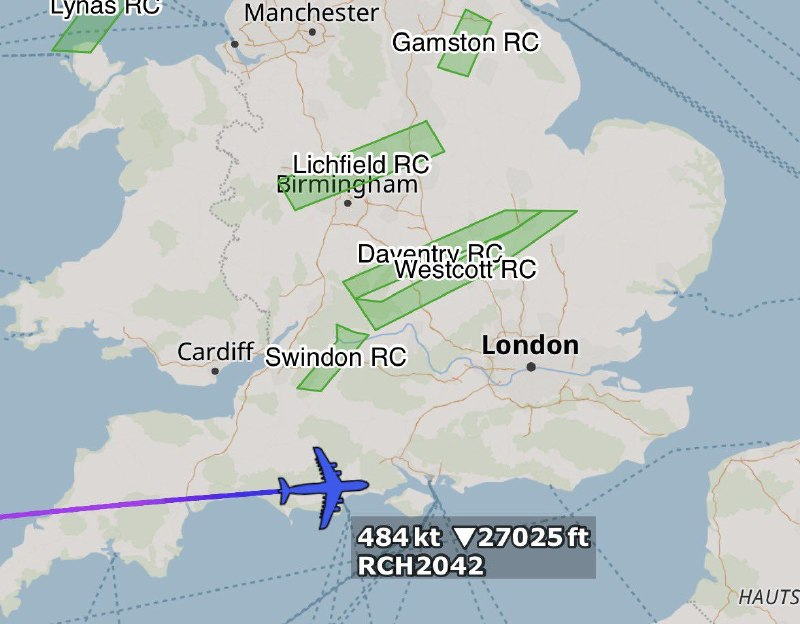

✈️🇺🇸نیروی هوایی آمریکا (USAF)

✈️هواپیمای ترابری فوق سنگین Lockheed C-5M Super Galaxy – یک فروند
شناسه: AE0580 / 87-0035 – با نام عملیاتی REACH 2042

🔰پرواز REACH 2042 در حال ورود به پایگاه RAF Mildenhall از پایگاه نیروی هوایی Dover Air Force Base ایالت دلاور است. آن‌ها در حال انجام عملیات «BANTER Ops» روی فرکانس 300.800 هستند.

@mwarmonitor

## mwarmonitor — post 8951

  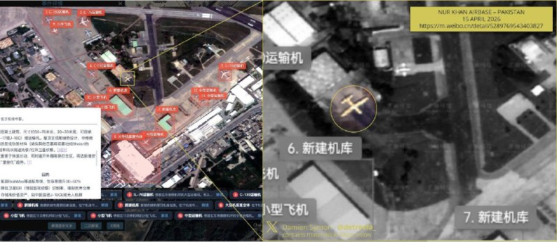

📝سؤال برای همه علاقه‌مندان هوانوردی: آیا نیروی هوایی پاکستان (PAF) در حال حاضر یک فروند C-130 با رنگ‌آمیزی استتار شنی/بیابانی (Desert Camouflage) در اختیار دارد؟ شهباز شریف خر خودتی @mwarmonitor

## mwarmonitor — post 8950

  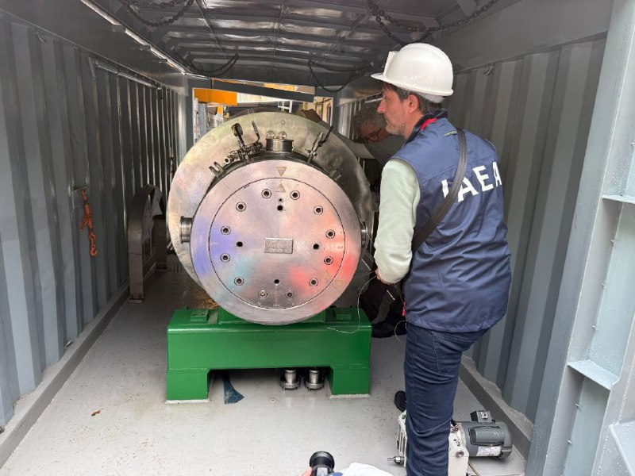

🇺🇸سفارت آمریکا در کاراکاس «طرح سه‌مرحله‌ای ریس جمهور ترامپ و وزیر امور خارجه برای ونزوئلا، خروج این ریسک هسته‌ای را از ونزوئلا تسریع کرد و یک نقطه عطف تاریخی دیگر را رقم زد. ☢۱۳.۵ کیلوگرم اورانیوم از IVIC (موسسه تحقیقات علمی ونزوئلا) خارج و برای دفع به ایالات…

## mwarmonitor — post 8949

  <a href="telegram/content/mwarmonitor_8949_1778581141.mp4" target="_blank">🎬 Download video</a>

🎥 تماشا کنید: تصاویر اختصاصی از محل اقامت استفاده‌شده توسط تروریست‌های حزب‌الله.

🔸در جریان عملیات‌های ویژه برای پاکسازی زیرساخت‌های تروریستی از منطقه لیتانی، در جنوب خط دفاعی جلو، بیش از ۱۰۰ هدف نظامی مورد حمله قرار گرفت.

🔰اهداف منهدم‌شده شامل موارد زیر است:

🔹مجموعه‌هایی که توسط تروریست‌های حزب‌الله استفاده می‌شد
🔹مسیرهای تونلی زیرزمینی حاوی مقادیر زیادی سلاح
🔹تأسیسات ذخیره‌سازی سلاح
🔹پرتابگرهای موشک

🔸علاوه بر این، نیروها در درگیری‌های نزدیک (تن‌به‌تن) و با پشتیبانی هوایی، ده‌ها تروریست را هدف قرار داده و از بین بردند.

📝 این ویدئو تصویر گویای زندگی ذلیلانه و کرم‌گونه‌ای است که در اعماق تاریک و نمور زمین، میان دیواره‌های سنگی و فضایی متعفن، تنها برای فرار از مرگ برگزیده‌اید. سرنوشت محتوم این فرقه همین خزیدن در سوراخ‌های بزدلانه است؛ جایی که بوی ترس و زوال، تمام ادعاهای پوشالی‌تان را در خود بلعیده است.

@mwarmonitor

## mwarmonitor — post 8948

🔸پاسخ رسمی به گزارش سی‌بی‌اس (CBS) درباره هواپیماهای ایرانی در پاکستان 🔹پاکستان گزارش شبکه خبری سی‌بی‌اس در خصوص حضور هواپیماهای ایرانی در پایگاه هوایی نورخان را قویاً رد کرده و آن را «گمراه‌کننده و جنجال‌برانگیز» می‌خواند. به نظر می‌رسد این روایت‌های گمانه‌زنانه…

## mwarmonitor — post 8947

🦠مقامات بهداشت جهانی می‌گویند در حال حاضر هیچ نشانه‌ای از گسترش گسترده انتقال ویروس هانتا از انسان به انسان وجود ندارد.

@mwarmonitor

## mwarmonitor — post 8946

🇺🇸🇮🇷ایالات متحده و ایران در یک بن‌بست دیپلماتیک بر سر موضوعاتی قرار گرفته‌اند که سال‌هاست دو طرف را دچار مشکل کرده است، و این درگیری اکنون در وضعیتی مبهم و خاکستری قرار دارد؛ حالتی که نه جنگ است و نه صلح. وال‌استریت ژورنال

@mwarmonitor

## pm_afshaa — post 90611

  <a href="telegram/content/pm_afshaa_90611_1778581143.mp4" target="_blank">🎬 Download video</a>

مارک لوین:می‌خوام با شما درباره‌ی مردم صحبت کنم، مردم ایران. 92 میلیون نفر که اکثریت قاطع اونها خواهان زندگی در آزادی هستند.

می‌خوام از انسانیت بگم. از ارزش‌ها و باورهای یهودی مسیحی. شاید بعضی از شما امروز به کلیسا یا معبد رفته باشید، یا صرفاً دارای این باورهای اخلاقی باشید. شاید اون‌ها رو یاد گرفته‌ باشید یا به صورت شهودی درکشون می‌کنید. اینکه تفاوت درست و غلط و خیر و شر رو می‌دونید.

پس می‌خوام درباره‌ی ده‌ها میلیون نفر در ایران صحبت کنم که 47 ساله با اون‌ها مثل حیوون رفتار شده. کسانی که زندانی، شکنجه، مورد تجاوز واقع شده و ده‌ها هزار نفرشون به قتل رسیدن. کسانی که به اون‌ها گفته شده چه نوع موسیقی‌ رو می‌تونن یا نمی‌تونن گوش بدن.

می‌خوام درباره‌ی زنان جوان بگم، دختران، خواهران و مادران در ایران که مجبور به پوشندن سر خود هستند و هیچ حقی ندارند، چه برسه به حقوق برابر و در معرض بدترین سوءرفتارها قرار می‌گیرن.

می‌خوام از جوونا بگم. جوونای ایران که می‌خوان از جوونی‌شون لذت ببرند، چیزهای جدید و شاد رو تجربه کنند و یاد بگیرن، اما توسط پلیس مخفی رژیم شیعه‌سانان رافضی هزارپدر بازداشت می‌شن و بدون محاکمه عمدتاً در خفا اعدام می‌شن.

می‌خوام درباره‌ی کسانی در کشور خودمون آمریکا صحبت کنم که خودشون رو لیبرال، فعال حقوق بشر یا مدافع آزادی‌های مدنی می‌نامند، اما کوچکترین اهمیتی به هیچ‌کدوم از اینها نمی‌دن. قرمساق‌هایی که اعتراض نمی‌کنند و نخواهند کرد، چون حزب دموکرات قرمدنگ یا جریان سیاسی که بهش تعلق دارند، مارکسیست‌ها و اسلام‌گرایان قحبه‌زاده، اونقدر از آمریکا و اسرائیل متنفرند که ترجیح می‌دن ده‌ها هزار ایرانی دیگه به شکلی وحشتناک بمیرند، اما شاهد اون نباشند که کشور ما این رژیم حرومزاده‌ی آدم‌کش رو شکست می‌ده. این جاکش‌ها در خیابون‌ها نیستند. راهپیمایی نمی‌کنند.
رهبران مذهبی کجان؟ بعضی‌شون هستند، اما بقیه‌شون کجان قحبه‌ها؟ صداشون رو نمی‌شنوم. شما می‌شنوید؟

می‌خوام از سکوت گروه‌های موسوم به فمینیست بگم که چنان با چپ‌گرایان افراطی و رادیکال گره خوردن که حتی یک کلمه درباره‌ی آزار و تجاوز گسترده به زنان و دختران توسط رژیم هزارپدر شیعه‌سانان رافضی نگفتن‌. هیچی!

می‌خوام درباره‌ی کسایی صحبت کنم که می‌گن تهدید هسته‌ای رژیم قحبه‌زادهی روافض قریب‌الوقوع نبود، می‌گن که این یک جنگ انتخابیه، می‌گن که این یک جنگ غیرقانونیه و کسشرایی از این دست.

این قرمساق‌های دیوث ذره‌ای حتی به اندازه‌ی یک ارزن اهمیت نمی‌دن که نه تنها در حال کمک کردن و آرامش دادن به این دشمن هولناک هستند، بلکه این دشمن پدرقحبه رو تشویق می‌کنند تا قتل‌عام کنه، اعدام کنه، تجاوز کنه، شکنجه کنه و کارهایی رو انجام بده که رژیم‌های آدم‌کش انجام می‌دن.

هیچ چیز، تکرار می‌کنم هیچ چیز شرافتمندانه یا برحقی در مورد هیچ‌کدوم از این گروه‌ها‌ی قحبه یا این افراد سراسر شرارت و تباهی وجود نداره.

و در مورد آمریکایی‌هایی که یا ساکتن یا بدتر از اون، تظاهر می‌کنن که این نسل‌کشی در حال اتفاق افتادن نیست، و یا با وجود اینکه می‌دونن در حال وقوعه، با بی‌تفاوتی ازش می‌گذرن. ننگ بر قرمساق‌هایی که این‌طوری فکر می‌کنن. ننگ بر اون قرمدنگ‌هایی که اعتراض نمی‌کنند. ننگ بر جاکشایی که اقدام نمی‌کنند، مخصوصاً اونایی که در جایگاهی هستند که می‌تونن کاری انجام بدن و نمی‌دن.

…مردم ایران‌ آزادی‌شون را می‌خوان و می‌خوان زندگی‌شون را پس بگیرن.
رژیم آدم‌کش و تروریست هزارپدر روافض رو بگایید، مردم ایران رو آزاد کنید و به هر نوع تهدید توسعه هسته‌ای و آبگرمکن‌های بالستیک در آینده پایان بدید. آیا این اتفاق خوبی برای مردم شریف ایران، برای مردم آمریکا، برای مردم خاورمیانه و کل دنیا نیست؟
ممکنه هزاران دلیل برای کمک نکردن به این مردم و اقدام نکردن وجود داشته باشه و شک ندارم که این دلایل ردیف شده و ارائه شدن. اما یک دلیل وجود دارد که بر همه‌ی اینا برتری داره. دلیلی که از همه اون‌ها مهم‌تره: انسانیت. اراده‌ی بشریت.

الان اون بهونه رو نداریم. با تکنولوژی مدرن ما می‌دونیم تو اون کشور چه می‌گذره. ما کشتار مردم عادی رو در اینترنت دیدیم‌ و نگاه کردن به اونا سخته. بیایید اون اشتباه رو تکرار نکنیم

💧 Rainbet.com the #1 Non-KYC Crypto Casino & Sportsbook @rainbetcom

😁 @Pm_Afshaa

## pm_afshaa — post 90610

حریم هوایی عراق کلیر شد

💧 Rainbet.com the #1 Non-KYC Crypto Casino & Sportsbook @rainbetcom

😁 @Pm_Afshaa

## DEJradio — post 4585

  <a href="telegram/content/DEJradio_4585_1778581146.webm" target="_blank">🎬 Download video</a>

🚨📢 اختصاصی دژ؛
استقرار نیروهای تیپ ۴۵ تکاور شوشتر اطراف سایت هسته‌ای اصفهان

منابع اختصاصی دژ از ایران گزارش دادند، بخش عمده‌ای از نیروهای تیپ ویژه ۴۵ تکاور شوشتر با ادوات و تجهیزات به اطراف سایت هسته‌ای اصفهان مستقر شدند.
منبع نظامی دژ می‌گوید، استقرار تکاوران تیپ ۴۵ با هدف دفاع زمینی از تاسیسات هسته‌ای اصفهان صورت می‌گیرد.
با افزایش احتمال عملیات مجدد علیه جمهوری اسلامی با هدف خارج کردن اورانیوم‌ها از ایران، ارتش و سـ.ـپاه لایه‌های دفاعی تاسیسات اصفهان را تقویت کنند.
در جریان جنگ ۴۰ روزه هواپیماهای ترابری آمریکا در دشت مهیار اصفهان حوالی تاسیسات اتمی فرود آمدند و نیرو پیاده کردند.
بخشی از ماموریت ارتش مقابله با هلی‌برن نیروهای آمریکا یا اسرائیل است.

#تاسیسات_اتمی #تاسیسات_اصفهان
@DEJradio

## DEJradio — post 4584

  <a href="telegram/content/DEJradio_4584_1778581147.mp4" target="_blank">🎬 Download video</a>

🔺📢 شعارنویسی؛ سـ.ـپاهی‌ها شکمشون سیره، اما بچه‌های ما گرسنه‌اند

#تورم #جمهوری_اسلامی
@DEJradio

## DEJradio — post 4583

  <a href="telegram/content/DEJradio_4583_1778581150.webm" target="_blank">🎬 Download video</a>

🚨
⭕️ تا شعاع ۵۰ کیلومتری پایگاه مشترک اسرائیل و آمریکا در عراق کسی حق نزدیک شدن ندارد

شاکر ابوتراب التمیمی، نماینده فراکسیون بدر [وابسته به نیروی قدس سـ.ـپاه] در پارلمان عراق، افشا کرد پایگاه مشترک اسرائیل- آمریکا در صحرای غرب عراق همچنان فعال است و نیروهای امنیتی عراق و آنها «اجازه نزدیک شدن به آن را ندارند».

به گفته التمیمی، «حدود دو ماه پیش اطلاعاتی درباره وجود این کمپ در خاک عراق منتشر شده بود، اما این اردوگاه همچنان پابرجاست و بغداد عملا هیچ کنترلی بر آن ندارد و آمریکا صراحتا به دولت عراق گفته است تا شعاع ۵۰ کیلومتری آن مکان کسی حق تردد و نزدیک شدن به آنجا را ندارد.»

او همچنین گفت، «دولت در ابتدا از این موضوع بی‌اطلاع بود، اما بعدها از مسیر دستگاه‌های امنیتی از وجود این پایگاه مشترک در صحرای غربی مطلع شد».
پیش‌تر وال‌استریت ژورنال به نقل از منابع امنیتی از وجود یک پایگاه مخفی اسرائیلی در صحرای نجف عراق خبر داده بود. طی جنگ ۴۰ روزه این پایگاه پشتیبان حملات به رژیم ایران بود.

#جنگ۴۰روزه #جمهوری_اسلامی
@DEJradio

## DEJradio — post 4581

  <a href="telegram/content/DEJradio_4581_1778581150.mp4" target="_blank">🎬 Download video</a>

🚨📢 تعرض به دختران مدرسه شرافت؛ "سکوت نکنید ملت"

تعرض ماموران امنیتی به دختران دانش‌آموز مدرسه شرافت با واکنش‌های مختلف در ایران روبرو شده است.
دانش‌آموزان و خانواده‌های آنها زیر فشار قرار دارند و سایر هموطنان مسئول‌ند از آنها پشتیبانی کنند.

#مدرسه_شرافت #مسئولیت_مدنی
@DEJradio

## DEJradio — post 4580

  <a href="telegram/content/DEJradio_4580_1778581153.mp4" target="_blank">🎬 Download video</a>

🔺🎥 پس از جنگ ۴۰ روزه اعتراض پرسنل نظامی به وضعیت خوراک و دستمزد پایین افزایش پیدا کرده و نارضایتی آنها از وضعیت معیشت بیشتر شده است.

بر اساس اطلاعات دریافتی، جیره‌های خوراکی ناکافی و ناسالم است و با تخریب پادگان‌ها بهداشت اولیه هم رعایت نمی‌شود. در برخی مناطق سرویس‌های معمول توالت تبدیل به مستراح‌های صحرایی شده است.

#جنگ۴۰روزه #جیره_بندی
@DEJradio

## DEJradio — post 4579

  <a href="telegram/content/DEJradio_4579_1778581155.mp4" target="_blank">🎬 Download video</a>

🤡
🔺 حکومت برای رونق‌بخشیدن به تجمعات شبانه، شیعیان را از کشورهای همسایه تا دورترین نقاط آفریقا به خیابان‌ها سرازیر کرده است!

در یکی از آخرین نمونه‌ها طلاب اوگاندایی و خانواده‌های آنها که در حوزه‌های علمیه بساط پهن کرده‌اند به عنوان سیاهی‌لشکر به تجمعات آمده‌اند.

#تجمعات_حکومتی #اوگاندا
@DEJradio

## DEJradio — post 4578

  <a href="telegram/content/DEJradio_4578_1778581157.mp4" target="_blank">🎬 Download video</a>

🔺🎥 ویدیوی ارسالی هموطنان با اشاره به گرانی و تورم شدید:
"مردم در بازار می‌چرخند اما هیچی نمی‌خرند."

#تورم #جمهوری_اسلامی
@DEJradio

## DEJradio — post 4577

  <a href="telegram/content/DEJradio_4577_1778581160.webm" target="_blank">🎬 Download video</a>

🚨
⭕️ «سی‌بی‌اس» دوشنبه، ۲۱ اردیبهشت‌ماه، گزارش داد که پاکستان برخلاف نقش خود به‌عنوان میانجی دیپلماتیک میان تهران و واشنگتن، به طور مخفیانه اجازه داده است هواپیماهای نظامی جمهوری اسلامی ایران در پایگاه‌های هوایی این کشور مستقر شوند تا از حملات هوایی آمریکا در امان بمانند.

بر اساس گزارش منابع آگاه در دولت ایالات متحده، تنها چند روز پس از اعلام آتش‌بس موقت توسط دونالد ترامپ، رئیس جمهوری آمریکا، در اوایل آوریل، چندین فروند هواپیما از جمله یک هواپیمای شناسایی و جاسوسی مدل «آر-۱۳۰» (RC-130) نیروی هوایی ایران در پایگاه هوایی «نورخان» پاکستان، واقع در نزدیکی شهر راولپندی، دیده شده‌اند. هم‌زمان گزارش‌هایی از اعزام هواپیماهای غیرنظامی جمهوری اسلامی ایران به افغانستان نیز منتشر شده است که به نظر می‌رسد بخشی از تلاش گسترده تهران برای حفاظت از دارایی‌های هوانوردی و نظامی باقی‌مانده خود در میانه درگیری‌های اخیر باشد.

همزمان، مقامات ارشد پاکستان این ادعاها را به شدت رد کرده‌اند. یک مقام عالی‌رتبه پاکستانی در گفت‌وگو با «سی‌بی‌اس نیوز» تاکید کرد که پایگاه هوایی نورخان در قلب شهر واقع شده و استقرار ناوگان بزرگی از هواپیماهای خارجی در چنین مکانی غیرممکن است که از دید عموم پنهان بماند. با این حال، تحلیلگران آمریکایی بر این باورند که این جابه‌جایی‌های استراتژیک نشان‌دهنده تلاش رژیم ایران برای بهره‌گیری از روابط منطقه‌ای جهت کاهش آسیب‌پذیری ناوگان هوایی خود در برابر فشارهای نظامی و محاصره اعمال شده توسط واشنگتن است.

#پاکستان #جمهوری_اسلامی
@DEJradio

## DEJradio — post 4576

  <a href="telegram/content/DEJradio_4576_1778581161.webm" target="_blank">🎬 Download video</a>

🔺📢 شاهزاده رضا پهلوی بامداد سه‌شنبه ۲۲ اردیبهشت به‌وقت ایران در«ایکس» نوشت که جمهوری اسلامی ۴۷ سال است علیه آمریکا و متحدانش جنگ به راه انداخته، و تاکید کرد: «امروز این رژیم از همیشه ضعیف‌تر است و مردم ایران آماده‌اند تا آن را سرنگون کنند.» او نوشت که اتخاذ سیاستی درست در این لحظه، می‌تواند قرن آینده را تغییر دهد.

#شاهزاده_رضا_پهلوی #جمهوری_اسلامی
@DEJradio

## DEJradio — post 4575

  <a href="telegram/content/DEJradio_4575_1778581162.webm" target="_blank">🎬 Download video</a>

🔺📢 بر اساس گزارش‌های منابع محلی، یک نفت‌کش متعلق به جمهوری اسلامی که قصد خروج از محدوده محاصره دریایی آمریکایی را داشت توسط موشک هدف قرار گرفت.
تاریخ دقیق اصابت مشخص نیست اما گفته شده ۱۹ یا ۲۰ اردیبهشت اتفاق افتاده است. بر اساس تصاویر زبانه‌های آتش و دود سیاه غلیظ از قسمت انتهایی عرضه این نفتکش کاملا پیداست اما از خدمه کسی کشته نشده است.
نام این کشتی در گذشته «سنندج» بود.

#محاصره_دریایی #آتشبس
@DEJradio

## mamlekate — post 103511

  <a href="telegram/content/mamlekate_103511_1778581162.mp4" target="_blank">🎬 Download video</a>

سخنگوی دولت: اینترنت پرو، مصوبه شورای عالی امنیت ملی است. اینترنت پرو برای کسب‌و‌کارها است. کشور در جنگ است و ویژگی جنگ امنیت مردم است

خانم فاطمه مهاجرانی دروغ می‌گوید. در هفته‌های اخیر، پیامک فعال‌سازی اینترنت پرو برای بسیاری از شهروندانی ارسال شده که هیچ کسب‌وکار خاصی ندارند. همزمان، گزارش‌های متعددی از شکل‌گیری بازار دلالی این نوع دسترسی منتشر شده؛ افرادی که در ازای دریافت مبالغی تا حدود ۶ میلیون تومان، اینترنت پرو را برای شهروندان فعال می‌کنند.

اظهارات امروز سخنگوی دولت مسعود پزشکیان، بار دیگر نشان می‌دهد که این دولت نه‌تنها مخالف فیلترینگ و محدودسازی اینترنت نیست، بلکه از سیاست ارائه اینترنت طبقاتی و دسترسی تبعیض‌آمیز به اینترنت آزاد نیز حمایت می‌کند.
alirezaer

کار از پرو گذشته، علنا سیم‌کارت سفید می‌فروشن.

@mamlekate

## kianmeli1 — post 87362

‏🔴رسانه‌های کویتی گزارش دادند افراد نفوذی وابسته به سپاه پاسداران قصد انجام اقدام‌های خصمانه علیه کویت را داشتند و تلاش کردند از طریق دریا وارد کشور شوند

‏رسانه‌های کویتی به نقل از وزارت کشور اعلام کردند چهار فرد نفوذی وابسته به سپاه پاسداران بازداشت شدند
https://t.me/kianmeli1

## kianmeli1 — post 87361

‏🔴اسرائیل هیوم: هزاران اسرائیلی ازشامگاه ۲۲ اردیبهشت پیامک‌های تهدیدآمیز به زبان عبری دریافت کردند که در آنها از سوی هکرهای منتسب به تهران خواسته شده با جمهوری اسلامی همکاری کنند
https://t.me/kianmeli1

## kianmeli1 — post 87360

‏🔴وزارت خارجه قطر اعلام کرد این کشور ربایش یک نفتکش حامل دریانوردان مصری از آب‌های یمن و انتقال آن به نزدیکی پانتلند سومالی را محکوم می‌کند و آن را نقض آشکار قوانین بین‌المللی دانست
https://t.me/kianmeli1

## kianmeli1 — post 87359

  <a href="telegram/content/kianmeli1_87359_1778581164.mp4" target="_blank">🎬 Download video</a>

🔴مهاجرانی: در حوادث دی ماه شاهد اعتراضات به حق مردم بودیم که توسط تروریست‌ها مصادره شد
https://t.me/kianmeli1

## kianmeli1 — post 87358

  <a href="telegram/content/kianmeli1_87358_1778581166.mp4" target="_blank">🎬 Download video</a>

🔴سخنگوی دولت: اینترنت پرو مصوبۀ شورای‌عالی امنیت ملی است که آقای رئیس‌جمهور ریاست آن را برعهده دارد
https://t.me/kianmeli1

## kianmeli1 — post 87357

  

🔴نت بلاکس:
امروز روز ۷۴ از قطع اینترنت در ایران است و این حادثه اکنون از ساعت ۱۷۵۲ گذشته است.از ۲۸ فوریه ۲۰۲۶ تاکنون، جهان شاهد پیشرفت‌های بزرگ در علم و فناوری بوده، در حالی که رژیم ایران در حال بازداشت و اعدام متخصصان و تکنولوژیست‌هاست.

 سه شنبه ۲۲ اردیبهشت ۱۴۰۵ 
https://t.me/kianmeli1

## kianmeli1 — post 87356

🔴 سخنان مارک لوین در مورد مردم ایران و سکوت دموکرات ها و چپ ها
‏ می‌خوام با شما درباره‌ی مردمی صحبت کنم، که اکثرانها خواهان زندگی در آزادی هستند.

‏ می‌خوام درباره‌ی ده‌ها میلیون صحبت کنم که ۴۷ ساله با ان‌ها مثل حیوان رفتار شده. کسانی که زندانی، شکنجه، مورد تجاوز واقع شده و ده‌ها هزار نفرشان به قتل رسیدن

‏می‌خوام درباره‌ زنان جوان بگم که مجبور به پوشندن سرخود هستند و هیچ حقی ندارند، چه برسه به حقوق برابر و در معرض بدترین سوءرفتارها قرار می‌گیرن.

‏می‌خوام از جوونا بگم. جوونای ایران که می‌خوان از جوونی‌شون لذت ببرند، چیزهای جدید و شاد رو تجربه کنند، اما توسط پلیس مخفی رژیم بازداشت و بدون محاکمه عمدتاً در خفا اعدام می‌شن.

‏می‌خوام درباره‌ کسانی در کشور خودمون آمریکا صحبت کنم که خودشون رو فعال حقوق بشر یا مدافع آزادی‌های مدنی می‌نامند، اما کوچکترین اهمیتی به هیچ‌کدوم از اینها نمی‌دهند، چون حزب دموکرات، مارکسیست‌ها و اسلام‌گرایان، آنقدر از آمریکا و اسرائیل متنفرند که ترجیح می‌دهند ده‌ها هزار ایرانی دیگه به شکلی وحشتناک بمیرند، اما شاهد اون نباشند که کشور ما این رژیم آدم‌کش رو شکست می‌دهد
‏

## IranIntlTV — post 336793

  

اسرائیل هیوم گزارش داد هزاران اسرائیلی از شامگاه ۲۲ اردیبهشت پیامک‌های تهدیدآمیز به زبان عبری دریافت کردند که در آن‌ها از سوی هکرهای منتسب به تهران خواسته شده با جمهوری اسلامی همکاری کنند.

در این پیام‌ها آمده است: «جمهوری اسلامی شما را به همکاری اطلاعاتی دعوت می‌کند و به‌زودی خورشید را در آسمان شب خواهید دید.»

اداره ملی سایبری اسرائیل اعلام کرد این پیام‌ها با هدف ایجاد هراس و جمع‌آوری اطلاعات شخصی ارسال شده و از شهروندان خواست آن‌ها را نادیده بگیرند و گزارش دهند.
https://iranintl.com/202605121388

## IranIntlTV — post 336792

  <a href="telegram/content/IranIntlTV_336792_1778581170.mp4" target="_blank">🎬 Download video</a>

ارتش اسرائیل اعلام کرد از زمان آغاز آتش‌بس با حزب‌الله لبنان، هزار و ۱۰۰ موضع مرتبط با این گروه را در جنوب لبنان هدف قرار داده و بیش از ۳۵۰ نیروی آن را کشته است.

اشکان صفایی، خبرنگار ایران‌اینترنشنال، گزارش می‌دهد
@iranintltv

## IranIntlTV — post 336791

  <a href="telegram/content/IranIntlTV_336791_1778581172.mp4" target="_blank">🎬 Download video</a>

یک شهروند بازنشسته با ارسال پیامی به ایران‌اینترنشنال می‌گوید: «چند ماه است که بیمه بازنشستگان فولاد و ذوب‌آهن را قطع کرده‌اند.»

## IranIntlTV — post 336790

🔻شورای سردبیری نیویورک‌پست: تنگه هرمز را باز کنید و به بازیِ وقت‌کشی تهران پایان دهید

شورای سردبیری نیویورک‌پست دوشنبه ۲۱ اردیبهشت با اشاره به اظهارات دونالد ترامپ، رییس‌جمهوری آمریکا نوشت در حالی که آتش‌بس با ایران زیر «دستگاه تنفس مصنوعی» قرار دارد، وقت آن رسیده که ترامپ «پروژه آزادی» را از سر بگیرد و تنگه هرمز را به روی رفت‌وآمد عادی کشتی‌های تجاری باز کند.

این روزنامه بلافاصله تاکید کرده است که محاصره دریایی جمهوری اسلامی باید ادامه یابد، تهران از اورانیوم غنی‌شده خود دست بکشد و به‌صورتی قابل راستی‌آزمایی به برنامه هسته‌ایش پایان دهد.

شورای سردبیری نیویورک‌پست افزوده رییس‌جمهوری کاملا درست می‌گوید که جمهوری اسلامی «ما را سر کار گذاشته‌ و معطل نگه داشته‌ است»، پیشنهادهای متقابل «کاملا غیرقابل قبول» داده‌ و به‌طور کلی «در حال بازی کردن» است.

ترامپ از ابتدا گفته بود آتش‌بس مشروط به «بازگشایی کامل، فوری و امن» تنگه هرمز از سوی جمهوری اسلامی است، اما تهران نه‌تنها چنین کاری نکرده، بلکه کوشیده بازگشایی تنگه هرمز را تنها امتیازی قرار دهد که ارائه می‌کند؛ آن هم در ازای فهرستی بی‌پایان از امتیازهایی که آمریکا باید بدهد، از جمله پایان محاصره، پرداخت غرامت جنگی و به‌رسمیت شناختن حاکمیت ایران بر تنگه هرمز.

شورای سردبیری نیویورک‌پست نوشته است: «اینها توهین هستند، نه مذاکره‌ای صادقانه؛ آنها فکر می‌کنند این رییس‌جمهوری هم به همان اندازه باراک اوباما ساده‌لوح است.»
در این یادداشت گفته شده ترامپ همچنین درست می‌گوید که حکومت ایران دهه‌هاست غرب را به همین شیوه معطل کرده است: ابتدا مطالبه امتیاز برای صرف آغاز گفت‌وگو، سپس تقسیم مذاکرات به بخش‌های کوچک، و بعد کش دادن بی‌پایان هر بخش؛ آن‌هم در حالی که حتی توافق‌های «موقت» هم در میانه راه از بین می‌روند.

این روزنامه تاکید کرده است: «دیگر کافی است: متحدان ما در خلیج فارس اکنون از پروژه آزادی حمایت می‌کنند و باید در اجرای آن نیز مشارکت داشته باشند. دیگر متحدانی که خواهان ازسرگیری جریان نفت و تجارت هستند نیز باید کمک کنند: بریتانیا که دست‌کم یک کشتی به خلیج فارس فرستاده؛ آیا می‌تواند کاری فراتر از «زیر نظر گرفتن اوضاع» انجام دهد؟»

به‌نوشته شورای سردبیری نیویورک‌پست، آنچه نیاز است، صرفا اسکورت کشتی‌ها از سوی نیروی دریایی آمریکا نیست، بلکه اقدام قاطع آمریکا علیه هرگونه تلاش جمهوری اسلامی برای متوقف کردن کشتی‌رانی است: هر قایقی که اقدامی انجام می‌دهد باید غرق شود؛ هر سایتی که از آن موشک یا پهپاد شلیک می‌شود باید نابود شود.

این روزنامه خطاب به دولت آمریکا نوشته است: «هدف قرار دادن کامل زیرساخت‌های فرماندهی و کنترل نظامی را از سر بگیرید؛ دوباره به حذف هر افسر سپاه پاسداران که ما یا اسرائیلی‌ها بتوانیم پیدا کنیم بازگردید.»
شورای سردبیری نیویورک‌پست افزوده است: «تا آنجا که ما می‌توانیم تشخیص دهیم، تنها دلیل ادامه دادن به «حفظ مصنوعی» آتش‌بس این است که مذاکرات رییس‌جمهوری در چین در اواخر این هفته پیچیده‌تر نشود. اما پس از آن، او می‌تواند به این آتش‌بس پایان دهد و بدون گرفتار شدن دوباره در چرخه «حرف، حرف، حرف» خواسته‌های واشینگتن را تحمیل کند.»

این روزنامه نوشته است: «رهبران حکومت ایران فکر می‌کنند می‌توانند ما را فرسوده و منتظر نگه دارند، اما ما هیچ دلیلی برای منتظر ماندن نداریم. آنها نمی‌توانند مانع بازگشایی تنگه یا ادامه محاصره شوند؛ ترامپ می‌تواند این روند را ادامه دهد تا یا تهران شروط او را بپذیرد، یا رهبران جدیدی در این کشور روی کار بیایند که حاضر به پذیرش آنها باشند.»
🔗 وب‌سایت ایران اینترنشنال
@iranintltv

## IranIntlTV — post 336789

  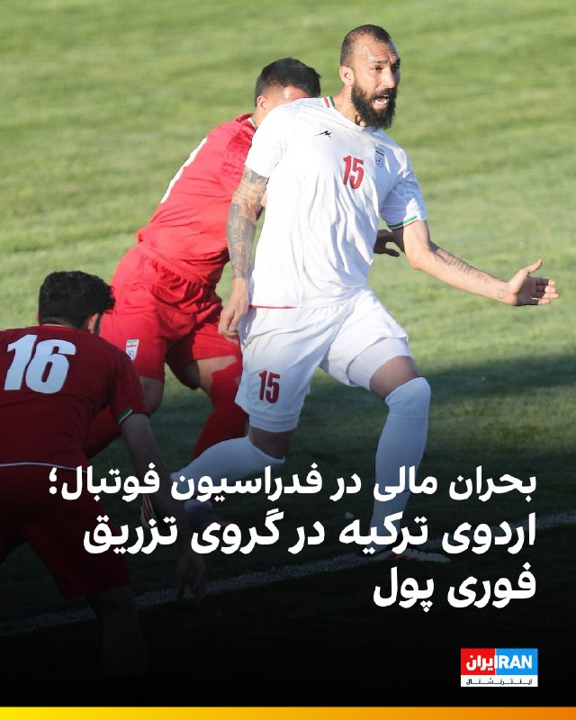

🔻فارس، رسانه وابسته به سپاه پاسداران، گزارش داد تیم ملی فوتبال برای اجرای برنامه آماده‌سازی خود در ترکیه، به تزریق فوری منابع مالی نیاز دارد؛ منابعی که پیش‌تر وعده پرداخت آن داده شده بود.

🔹آنطور که فارس نوشته، مهدی تاج، رئیس فدراسیون فوتبال، محمدنبی، مدیر تیم ملی و نایب‌رئیس فدراسیون به همراه امیر قلعه‌نویی، سرمربی تیم ملی با حمید پورمحمدی، رئیس سازمان برنامه‌وبودجه و محسن نجفی‌خواه، معاون فرهنگی و اجتماعی و برخی دیگر از معاونان این سازمان جلسه‌ای برگزار کردند تا موافقت مدیران این سازمان را برای حمایت مالی از تیم ملی بگیرند.

🔹تیم ملی فوتبال در شرایطی خود را برای جام جهانی آماده می‌کند که بازی‌های تدارکاتی برنامه‌ریزی‌شده از سوی فدراسیون فوتبال یکی پس از دیگری لغو شده‌اند و شاگردان امیر قلعه‌نویی ناچار به برگزاری چند دیدار درون‌تیمی شده‌اند.

@iranintltvsport

## IranIntlTV — post 336788

  <a href="telegram/content/IranIntlTV_336788_1778581176.mp4" target="_blank">🎬 Download video</a>

در بن‌بست در مذاکرات تهران و واشینگتن، دونالد ترامپ، رییس‌جمهوری آمریکا در دیدار با تیم امنیت ملی و شماری از فرماندهان نظامی ایالات متحده، پیشنهاد اخیر جمهوری اسلامی را «زباله» توصیف کرد و گفت احتمال بقای آتش‌بس «تقریبا یک درصد» است.
جزییات بیشتر با علی‌حسین‌ قاضی‌زاده، عضو تحریریه ایران‌اینترنشنال
@iranintltv

## IranIntlTV — post 336787

  

مایک هاکبی، سفیر آمریکا در اسرائیل، با اشاره به اقدام اسرائیل برای ارسال سامانه گنبد آهنین و نیروهایی برای راه‌اندازی آن در امارات متحده عربی گفت که این اقدام در چارچوب روابط «فوق‌العاده» اسرائیل و امارات متحده عربی بر اساس توافق‌های ابراهیم انجام شده است.

او افزود: «کشورهای خلیج فارس اکنون می‌دانند که باید انتخاب کنند؛ احتمال اینکه از سوی ایران هدف حمله قرار گیرند بیشتر است یا از سوی اسرائیل؟ آن‌ها می‌بینند که اسرائیل به ما کمک کرد و ایران به ما حمله کرد. اسرائیل به دنبال تصرف سرزمین شما نیست و برای شما موشک نمی‌فرستد.»
https://iranintl.com/202605124547

## IranIntlTV — post 336786

🔻شرط دسترسی به اینترنت: انتشار تصاویر خامنه‌ای، تعهد کتبی و معرفی ضامن

🖋سبا حیدرخانی

پیام‌های رسیده به ایران‌اینترنشنال نشان می‌دهد نهادهای امنیتی، اینترنت و سیم‌کارت برخی شهروندان را به‌دلیل «فعالیت‌های معاندانه و مغرضانه علیه جمهوری اسلامی» مسدود کرده‌اند و از آن‌ها خواسته‌اند برای رفع محدودیت‌ها، در تجمعات حکومتی شرکت کنند، تعهد کتبی بدهند و ضامن بیاورند.

بر اساس این اطلاعات، پیام‌هایی از سوی نهادهای امنیتی «بدون سربرگ» برای شهروندان ارسال شده است که در آن از افراد خواسته شده مشخصات کامل هویتی، نشانی منزل و محل کار، شماره حساب‌های بانکی، تصاویر کارت بانکی و همچنین نشانی و مشخصات تمامی حساب‌هایشان در شبکه‌های اجتماعی را برایشان بفرستند.

در بخشی دیگر، از شهروندان خواسته شده تعهدنامه‌ای دست‌نویس امضا کنند که در آن متعهد شوند دیگر «فعالیت مغرضانه» یا محتوایی که به گفته فرستندگان پیام «امنیت روانی، اجتماعی یا سیاسی کشور» را بر هم بزند، منتشر نکنند.

در این متن‌ها تاکید شده فعالیت‌های کاربران تحت «رصد هوشمند و سامانه‌های مصنوعی» قرار دارد و تکرار چنین فعالیت‌هایی می‌تواند به «پیگرد قضایی» و «مجازات‌های سنگین‌تر» منجر شود.

همچنین از برخی افراد خواسته شده برای رفع محدودیت‌ها، دست‌کم ۲۰ پست در حمایت از جمهوری اسلامی در شبکه‌های اجتماعی منتشر و تصاویر مربوط به آن را ارسال کنند.
اجبار به شرکت در تجمعات حکومتی شبانه

در یک سال اخیر، گزارش‌هایی از اعمال فشار و ارعاب با هدف تلاش برای کنترل فعالیت کاربران در فضای مجازی منتشر شده است. این بار اما به کاربران تاکید شده «برای طبیعی جلوه دادن ماجرا»، تمام پست‌ها را در یک روز منتشر نکنند.

همچنین از این شهروندان خواسته شده در تجمعات شبانه حکومتی که از آغاز حملات آمریکا و اسرائیل شکل گرفت و با وجود آتش‌بس همچنان ادامه دارد نیز شرکت کنند و همراه با پرچم جمهوری اسلامی یا تصاویر علی خامنه‌ای، عکس بگیرند.

در برخی از این پیام‌ها، ارائه مدارک هویتی یک ضامن نیز درخواست شده و از ضامن خواسته‌اند مسئولیت «عواقب ناشی از فعالیت مجرمانه مجدد فرد» را بپذیرد.

مرداد سال ۱۴۰۴ شمار زیادی از شهروندان در رسانه‌های اجتماعی نوشتند در هفته‌های منتهی به آن زمان و به‌ویژه پس از جنگ ۱۲ روزه، به‌دلیل انتشار مطالب انتقادی در رسانه‌های اجتماعی، سیم‌کارت‌هایشان بدون هشدار قبلی، بدون حکم قضایی و به شکل ناگهانی، قطع شده است.

نهادهای امنیتی با استفاده از پیام‌رسان داخلی «ایتا» با شهروندان تماس گرفته و از آنان خواسته بودند برای رفع مسدودی، اقدامات مدنظر آن‌ها را انجام دهند و به نهادهایی با عناوینی همچون «گرداب» یا «معاونت فضای مجازی دادستانی» مراجعه کنند.

در بسیاری از این مراجعات از شهروندان خواسته شد تصویر کارت ملی خود را ارائه و تعهدنامه‌ای مکتوب امضا کنند که از فعالیت انتقادی در رسانه‌های اجتماعی خودداری خواهند کرد.

پیش از آن و در مهر ۱۴۰۳ نیز شماری از روزنامه‌نگاران و فعالان سیاسی پس از قطع و مسدود شدن سیم‌کارت‌هایشان، با دستور نهادهای امنیتی مجبور به حذف مطالب خود و انتشار مطالبی بر خلاف عقایدشان در حساب‌هایشان در شبکه‌های اجتماعی شده بودند.
🔗 وب‌سایت ایران اینترنشنال
@iranintltv

## IranIntlTV — post 336785

  <a href="telegram/content/IranIntlTV_336785_1778581179.mp4" target="_blank">🎬 Download video</a>

اجلاس دموکراسی کپنهاگ ۲۰۲۶ در دانمارک با شعار «ساختن ائتلافی از دموکراسی‌ها در نظم بی‌نظم نوین جهانی» برگزار می‌شود. مسیح علی‌نژاد، فعال حقوق بشر ایرانی، امسال در فهرست مهمانان اصلی این اجلاس قرار دارد.
مهران عباسیان، خبرنگار ایران‌اینترنشنال، گزارش می‌دهد
@iranintltv

## IranIntlTV — post 336784

🔻ترامپ و شی درباره ایران، تجارت، هوش مصنوعی و تسلیحات هسته‌ای گفت‌وگو خواهند کرد

مقام‌های آمریکایی اعلام کردند دونالد ترامپ، رییس‌جمهوری آمریکا، و شی جین‌پینگ، رییس‌جمهوری چین، در جریان سفر دو روزه ترامپ به چین درباره ایران، تایوان، هوش مصنوعی و تسلیحات هسته‌ای گفت‌وگو خواهند کرد؛ در حالی که دو طرف در حال بررسی تمدید توافق مربوط به مواد معدنی حیاتی هستند.

خبرگزاری رویترز سه‌شنبه ۲۲ اردیبهشت نوشت که رهبران دو اقتصاد بزرگ جهان قرار است پس از بیش از شش ماه نخستین دیدار حضوری خود را برگزار کنند. دیداری که در شرایط تنش میان دو کشور بر سر تجارت، جنگ آمریکا و اسرائیل با حکومت ایران و دیگر اختلافات انجام می‌شود.

ترامپ قرار است چهارشنبه ۲۳ اردیبهشت وارد پکن شود و مذاکرات او با شی، روزهای پنج‌شنبه و جمعه برگزار خواهد شد.

این نخستین سفر ترامپ به چین از سال ۲۰۱۷ است.
توافق‌های احتمالی درباره خرید هواپیما، کشاورزی و تجارت

مقام‌های آمریکایی گفتند آمریکا و چین احتمالا درباره ایجاد سازوکارهایی برای تسهیل تجارت و سرمایه‌گذاری متقابل توافق خواهند کرد و انتظار می‌رود پکن خریدهایی را در حوزه هواپیماهای بوئینگ، محصولات کشاورزی آمریکا و انرژی اعلام کند.

به گفته یکی از این مقام‌ها، احتمال دارد طرح ایجاد «شورای تجارت» و «شورای سرمایه‌گذاری» نیز در این دیدار به‌طور رسمی اعلام شود، اما اجرای این سازوکارها به مذاکرات و اقدامات بعدی نیاز خواهد داشت.

دو کشور همچنین درباره تمدید آتش‌بس در جنگ تجاری خود گفت‌وگو خواهند کرد. توافقی که امکان صادرات مواد معدنی کمیاب از چین به آمریکا را فراهم کرده است.

این مقام آمریکایی گفت هنوز مشخص نیست این توافق در همین هفته تمدید شود یا نه، اما ابراز اطمینان کرد که در نهایت تمدید خواهد شد.

او به خبرنگاران گفت: «این توافق هنوز منقضی نشده است. مطمئنم هر گونه تمدید احتمالی در زمان مناسب اعلام خواهد شد.»

رویترز نوشت که سفارت چین در واشینگتن از اظهار نظر درباره این موضوع خودداری کرد.
ایران، تایوان و تسلیحات هسته‌ای؛ محورهای اختلاف

انتظار می‌رود گفت‌وگوهای ترامپ و شی به موضوعاتی مربوط شود که سال‌ها از محورهای تنش میان واشینگتن و پکن بوده‌اند؛ از جمله ایران، تایوان و تسلیحات هسته‌ای.

پکن روابط خود را با تهران حفظ کرده و همچنان یکی از خریداران اصلی نفت ایران است.

ترامپ تلاش کرده از نفوذ چین برای اعمال فشار بر تهران به‌منظور توافق با واشینگتن و پایان دادن به جنگی استفاده کند که با حملات آمریکا و اسرائیل به ایران در ۹ اسفند ۱۴۰۴ آغاز شد.

دولت ترامپ همچنین درباره روابط چین و روسیه به پکن فشار آورده است.

یکی از مقام‌های آمریکایی گفت: «رییس‌جمهوری چندین بار با شی جین‌پینگ درباره ایران و روسیه گفت‌وگو کرده، از جمله درباره درآمدی که چین در اختیار این دو حکومت قرار می‌دهد، و نیز کالاها و قطعات دو منظوره و حتی احتمال صادرات تسلیحات.»

او افزود: «انتظار دارم این گفت‌وگوها ادامه پیدا کند.»

در مقابل، شی از سیاست واشینگتن درباره تایوان ناراضی است.

آمریکا همچنان مهم‌ترین حامی بین‌المللی و تامین‌کننده تسلیحات برای تایوان به شمار می‌رود. جزیره‌ای که چین آن را بخشی از خاک خود می‌داند.

به گفته مقام‌های آمریکایی، چین در سال‌های اخیر حضور نظامی خود را در اطراف تایوان افزایش داده، اما سیاست آمریکا در این زمینه تغییر نخواهد کرد.
نگرانی آمریکا از پیشرفت هوش مصنوعی در چین

مشاوران ترامپ نگرانی فزاینده‌ای نسبت به مدل‌های پیشرفته هوش مصنوعی در حال توسعه در چین ابراز کرده‌اند.

آنان معتقدند دو کشور باید برای جلوگیری از بروز تنش ناشی از استفاده از این فناوری، «کانال ارتباطی» میان خود ایجاد کنند.

یکی از مقام‌ها گفت: «هنوز مشخص نیست این سازوکار چه شکلی خواهد داشت، اما می‌خواهیم از فرصت دیدار رهبران برای آغاز گفت‌وگو و بررسی امکان ایجاد کانال ارتباطی درباره مسائل مرتبط با هوش مصنوعی استفاده کنیم.»
اختلاف بر سر تسلیحات هسته‌ای

واشینگتن سال‌هاست امیدوار است گفت‌وگوهایی را درباره تسلیحات هسته‌ای با پکن آغاز کند، اما چین همچنان تمایلی به مذاکره درباره زرادخانه هسته‌ای خود نشان نداده است.

به گفته یک مقام آمریکایی، دولت چین به‌صورت خصوصی به واشینگتن اعلام کرده که در مقطع کنونی، «هیچ علاقه‌ای به گفت‌وگو درباره کنترل تسلیحات هسته‌ای یا موضوعات مشابه ندارد».

آخرین دیدار ترامپ و شی، آبان ۱۴۰۴ در کره جنوبی انجام شد. جایی که دو طرف توافق کردند جنگ تجاری شدید میان خود را متوقف کنند. جنگی که طی آن آمریکا تعرفه‌های سه رقمی بر کالاهای چینی وضع کرده بود و پکن نیز تهدید کرده بود صادرات مواد معدنی کمیاب را محدود خواهد کرد.

🔗 وب‌سایت ایران اینترنشنال
@iranintltv

## IranIntlTV — post 336783

  

مسعود پزشکیان، رییس دولت جمهوری اسلامی، گفت: «دولت بنا ندارد برای فعالیت اقتصادی سالم محدودیت ایجاد کند، اما در مقابل نیز اجازه نخواهد داد عده‌ای با سوءاستفاده از شرایط جنگی، معیشت مردم را هدف قرار دهند.»

او یکی از سیاست‌های اساسی دولت چهاردهم در وضعیت کنونی را «کنترل مصرف و جلوگیری از شکل‌گیری تقاضای القایی و کاذب» دانست و افزود: «ایجاد تقاضای غیرواقعی بدون تامین متناسب کالا، منجر به نارضایتی عمومی خواهد شد.»

پزشکیان ادامه داد: «یکی از مهم‌ترین اهداف دشمن در شرایط فعلی، ایجاد اختلال در اقتصاد و فشار بر معیشت مردم است.»
https://iranintl.com/202605122119

## IranIntlTV — post 336782

🔻۸ زندانی سیاسی زن در اوین از حق ملاقات با خانواده محروم شدند

بر اساس اطلاعات رسیده به ایران‌اینترنشنال، شیوا اسماعیلی، گلرخ ایرایی، سکینه پروانه، فروغ تقی‌پور، زهرا صفایی، مرضیه فارسی، الهه فولادی و وریشه مرادی، هشت تن از زندانیان سیاسی زن محبوس در بند زنان زندان اوین، از حق ملاقات با خانواده و وکیلان خود محروم شده‌اند.

اطلاعات رسیده حاکی است این محرومیت‌ها پس از تشدید فضای امنیتی در بند زنان اوین و در پی فشار و برخورد با زندانیانی اعمال شده که در برنامه‌های جمعی، یادبودها و رخدادهای اعتراضی داخل بند، مشارکت داشته‌اند.

یک منبع نزدیک به خانواده‌های زندانیان محبوس در بند زنان اوین به ایران‌اینترنشنال گفت در هفته‌های اخیر ماموران زندان بر خلاف روال پیشین، هر روز در ساعات صبح و گاه شب، به بهانه سرکشی وارد بند شده‌اند و با تردد مداوم خود، فضای بند را بیش از گذشته امنیتی کرده‌اند.

به گفته این منبع آگاه، زندانیان زن اوین در سال‌های گذشته مناسبت‌های سیاسی و عقیدتی را با دورهمی، خواندن متن و مقاله، سرودخوانی و یادآوری نام جان‌باختگان و چهره‌های پیشین و پیشکسوت جنبش‌های اعتراضی گرامی می‌داشتند، اما اخیرا همین برنامه‌ها نیز با دخالت مستقیم ماموران و مسئولان زندان و تهدید شرکت‌کنندگان روبه‌رو شده است.

این منبع مطلع افزود شماری از زندانیانی که به تازگی به بند زنان اوین منتقل شده‌اند و در برخی از این برنامه‌ها حضور پراکنده داشتند نیز از سوی زندانبانان و نیروهای امنیتی تهدید شده‌اند.

یک منبع آگاه دیگر به ایران‌اینترنشنال گفت ماموران زندان در ماه‌های اخیر با ادبیاتی اهانت‌آمیز با زندانیان برخورد کرده و آنان را به انتقال به سلول انفرادی تهدید کرده‌اند.

منبع دیگری که از وضعیت زنان زندانی در اوین مطلع است، به ایران‌اینترنشنال گفت غزل مرزبان، از زنان زندانی در اوین، اخیرا پس از اعتراض به رسیدگی نشدن به وضعیتش، پنج شب به سلول انفرادی منتقل شده است.

بند زنان اوین که از آن با عنوان خط مقدم جنبش «زن، زندگی، آزادی» یاد می‌شود، در سال‌های گذشته یکی از کانون‌های اصلی کنش‌گری زندانیان سیاسی زن بوده است. زندانیان این بند بارها در واکنش به تحولات سیاسی، اجتماعی و مدنی، از جمله اعتراض‌ها و خیزش‌ها، اعدام‌ها، بازداشت‌ها، فقر، فساد و سرکوب معترضان، موضع‌گیری کرده‌اند.

این بند همچنین بارها شاهد حرکت‌های اعتراضی، از جمله تحصن و اعتصاب غذای زندانیان در اعتراض به صدور و اجرای احکام اعدام بوده و زندانیان پس از آن با اقدامات تنبیهی، از جمله محرومیت از حق تماس تلفنی و ملاقات و نیز پرونده‌سازی تازه مواجه شده‌اند.

یک منبع نزدیک به خانواده‌های زندانیان زن اوین گفت افزایش محدودیت‌ها، تهدید به انفرادی و محرومیت از ملاقات، بخشی از تلاش مقام‌های زندان و نهادهای امنیتی برای خاموش کردن صدای اعتراض در این بند است.
محرومیت محترم پرندین از درمان فوری با وجود تومور نزدیک مخچه

بر اساس اطلاعات رسیده به ایران‌اینترنشنال، محترم پرندین، معروف به محشر، هنرمند و نقاش زندانی در اوین که ماه‌هاست با اتهامات سیاسی در حبس است، با وجود ابتلا به دو تومور در ناحیه پشت سر، نزدیک مخچه و گلو و همچنین بیماری حاد قلبی، از اعزام درمانی و جراحی فوری محروم مانده است.

یک منبع مطلع به ایران‌اینترنشنال گفت پزشک زندان جراحی فوری پرندین را ضروری دانسته و درباره خطر تومور نزدیک مخچه هشدار داده است. توموری که باعث اختلال در بینایی، تکلم و حرکات بدنی او شده و به گفته هم‌بندی‌هایش، آثار آن در راه رفتن و صحبت کردنش قابل مشاهده است.

به گفته این منبع آگاه، با وجود تاکید پزشک زندان، مسئولان تاکنون برای اعزام درمانی او همکاری نکرده‌اند و با وجود گذشت بیش از نیمی از ایام حبس و وخامت حال، با آزادی مشروط و مرخصی درمانی‌اش نیز مخالفت کرده‌اند.

این در حالی است که سند لازم برای مرخصی در اختیار دادستانی قرار دارد.

پرندین، مادر یک پسر نوجوان و محصل است و پس از درگذشت همسرش، سرپرستی خانواده را بر عهده دارد. فرزند او نیز به بیماری خاص مبتلاست و در نبود مادر با مشکلات جدی روبه‌رو شده است.
در سال‌های گذشته، گزارش‌های متعددی از محرومیت زندانیان سیاسی در ایران از رسیدگی پزشکی و نقض حق دسترسی آنان به درمان مناسب از سوی مسئولان زندان‌ها منتشر شده است.

شماری از زندانیان سیاسی نیز طی سال‌های اخیر در دوران حبس جان خود را از دست داده‌اند. مرگ‌هایی که خانواده‌ها و نهادهای حقوق بشری، آن‌ها را نتیجه فشار، شکنجه یا محرومیت از خدمات درمانی دانسته‌اند، اما جمهوری اسلامی در قبال آن‌ها مسئولیتی نپذیرفته است.

🔗 وب‌سایت ایران اینترنشنال
@iranintltv

## IranIntlTV — post 336781

  <a href="telegram/content/IranIntlTV_336781_1778581182.mp4" target="_blank">🎬 Download video</a>

یک شهروند با ارسال پیام به ایران‌اینترنشنال درباره گران و کمیاب شدن دارو می‌گوید: «من بیماری صرع دارم. بسته شش‌تایی دارویم را قبلا ۲۵۰ هزار تومان می‌خریدم که یک ماه پیش شده ۷۵۰ هزار تومان و الان به دو میلیون و ۳۰۰ هزار تومان رسیده است. گرانی کمر ما را شکسته و نگرانی پیدا نشدن دارو، دردی به دردهایمان اضافه کرده است.»

## IranIntlTV — post 336780

🗣روایت شما از زندگی زیر سایه آتش‌بس- سه‌شنبه ۲۲ اردیبهشت:

🔹قیمت قطعات خودرو مثل طلا به‌صورت دقیقه‌ای قیمت‌گذاری می‌شه و به طرز فجیعی بالا رفته، حتی نمی‌شه قطعات خودرو رو تعویض کرد.

🔹تهران آن‌قدر بیکاری زیاد شده که مردم همه راننده اسنپ شدند، آن هم با کرایه پایین که اصلا به‌صرفه نیست. گرانی بیداد می‌کند.

🔹کلی تلاش کردم وصل بشم تا بگم چرا پدر بازنشسته من بعد از ۳۰ سال تمام کار کردن باید حقوقش ۳۰ میلیون تومان باشد و برای خرج روزهایمان از صبح تا شب اسنپ کار کند؟

🔹من یک استادکار تاسیسات ساختمانم. اجناس تاسیسات پیش از عید تا حالا حدود ۴ برابر شده و به‌خاطر افزایش شدید قیمت اجناس، تقاضا برای کار تقریبا صفر شده.

🔹قیمت قهوه سر به فلک گذاشته و دیگر یک قهوه ساده هم نمی‌شود خورد. یک کیلو کیک و شیرینی بالای یک میلیون تومان شده. یک سالاد معمولی در کافه ۸۰۰ هزار تومان است.

🔹از شهر چابهار پیام می‌دهم؛ این‌جا زندگی روزه مردم به شدت مختل شده است، خصوصا برای قشر کارگر. خرید یک مرغ شده آرزو.

## IranIntlTV — post 336779

🔻قوه قضاییه جمهوری اسلامی از اعدام عبدالجلیل شه‌بخش، زندانی سیاسی، خبر داد

خبرگزاری میزان، رسانه قوه قضاییه جمهوری اسلامی، از اجرای حکم اعدام عبدالجلیل شه‌بخش، زندانی سیاسی بلوچ، خبر داد.

با اعدام شه‌بخش، شمار زندانیان اعدام‌شده با اتهامات سیاسی در ایران از ۲۷ اسفند ۱۴۰۴ تاکنون، طی ۵۶ روز، به دست‌کم ۳۰ نفر رسید.

این در حالی است که سایت حقوق بشری هرانا پیش‌تر گزارش داده بود جمهوری اسلامی در کل سال ۱۴۰۴ دست‌کم ۵۲ زندانی را با اتهام‌های سیاسی و امنیتی اعدام کرد.

به این ترتیب، روند اعدام زندانیان با اتهام‌های سیاسی و امنیتی در ایران از میانگین حدود یک اعدام در هفته در سال ۱۴۰۴، به حدود یک اعدام در هر دو روز طی ۵۶ روز گذشته رسید.

رسانه قوه قضاییه اعلام کرد حکم اعدام شه‌بخش با اتهامات «بغی از طریق حمله مسلحانه به مقرهای انتظامی و عضویت در گروه باغی انصارالفرقان» و پس از تایید در دیوان عالی کشور، بامداد سه‌شنبه ۲۲ اردیبهشت اجرا شده است.

میزان نوشت مستندات پرونده، از جمله فایل‌های صوتی استخراج‌شده از وسایل ارتباطی این زندانی و «اقاریر» او در مراحل بازجویی و بازپرسی، مبنای صدور حکم اعدام بوده است.

این رسانه توضیحی درباره نحوه دسترسی به این اطلاعات، شرایط نگهداری شه‌بخش در دوران بازداشت، چگونگی اخذ اعترافات او و محل اجرای حکم اعدام این زندانی سیاسی ارائه نکرد.

بر اساس گزارش میزان، نهادهای امنیتی جمهوری اسلامی شه‌بخش را از افراد بازداشت‌شده در استان سیستان و بلوچستان در جریان اعتراضات سال ۱۴۰۱ معرفی کرده‌اند.
میزان به نقل از نهادهای امنیتی نوشت او با یک تیم وابسته به گروه انصارالفرقان ارتباط داشته و اعضای این تیم با هدف «شناسایی مقرهای انتظامی» در استان سیستان و بلوچستان فعالیت می‌کردند.

قوه قضاییه افزود او حدود شش سال پیش به یکی از کشورهای همسایه رفته بود و پس از بازگشت به ایران، در «شناسایی مسیرها و مقرهای نظامی و انتظامی در مناطق کورین و تفتان» نقش داشته است.

هم‌زمان رسانه قوه قضاییه ویدیویی از اعترافات اجباری منتسب به شه‌بخش منتشر کرد که مشخص نیست در چه شرایطی ضبط شده است.

پیش‌تر اطلاعاتی درباره بازداشت شه‌بخش و روند قضایی پرونده او منتشر نشده بود. موضوعی که فعالان حقوق بشر آن را بخشی از رویه نهادهای امنیتی جمهوری اسلامی در پنهان نگه داشتن پرونده برخی بازداشت‌شدگان سیاسی و امنیتی می‌دانند.
در موارد مشابه، خانواده‌ها تحت فشار و تهدید قرار می‌گیرند تا درباره بازداشت فرزندان خود اطلاع‌رسانی نکنند و به آنان گفته می‌شود در صورت سکوت، امکان آزادی یا تخفیف مجازات وجود دارد.

هم‌زمان، شماری از بازداشت‌شدگان ماه‌ها در خانه‌های امن یا بازداشتگاه‌های امنیتی نگهداری می‌شوند و بدون انتقال به زندان‌های عمومی، روند پرونده و حتی صدور حکم آنان از افکار عمومی پنهان می‌ماند.

شبکه اسناد حقوق بشر بلوچستان، پیش‌تر در ۱۷ اردیبهشت گزارش داد دست‌کم ۲۱ زندانی سیاسی بلوچ در ایران در خطر اجرای حکم اعدام قرار دارند.
در این گزارش آمده است که بخش قابل توجهی از آنان پس از شکنجه، اعترافات اجباری، محرومیت از وکیل و دادگاه‌های غیرعلنی یا بدون حضور وکیل، به اعدام محکوم شده‌اند.
در حال حاضر صدها زندانی سیاسی و شهروند بازداشت‌شده در جریان اعتراضات در زندان‌های ایران با اتهام‌های سیاسی و امنیتی روبه‌رو هستند.

فعالان حقوق بشر هشدار داده‌اند بسیاری از آنان در خطر صدور، تایید و اجرای احکام اعدام هستند. احکامی که اغلب در روندهایی غیرشفاف و همراه با محدودیت شدید دسترسی به وکیل، نگهداری طولانی‌مدت در بازداشتگاه‌های امنیتی و فشار برای اخذ اعترافات اجباری صادر می‌شوند.

🔗 وب‌سایت ایران اینترنشنال
@iranintltv

## IranIntlTV — post 336777

  

غلامحسین محسنی اژه‌ای، رییس قوه قضاییه جمهوری اسلامی، در جلسه‌ای با وزیر ارتباطات درباره «اینترنت پرو» و «سیم‌کارت سفید»، گفت: «موضوعاتی که برای مردم شفاف نمی‌شود، مانند پُتک بر افکار عمومی و اذهان جمعی فرود می‌آیند.»

اژه‌ای افزود: «قضیه اینترنت پرو و سیم‌کارت سفید در ذهن مردم مسئله ایجاد کرده است و اگر شفاف‌سازی نکنیم باعث بدبینی شهروندان خواهد شد.»

او به وجود شرایط جنگی اشاره کرد و گفت «سرمایه اصلی ما در این نبرد سرنوشت‌ساز» مردم هستند و «نباید اجازه دهیم دچار بی‌اعتمادی شوند».
https://iranintl.com/202605123055

## IranIntlTV — post 336776

  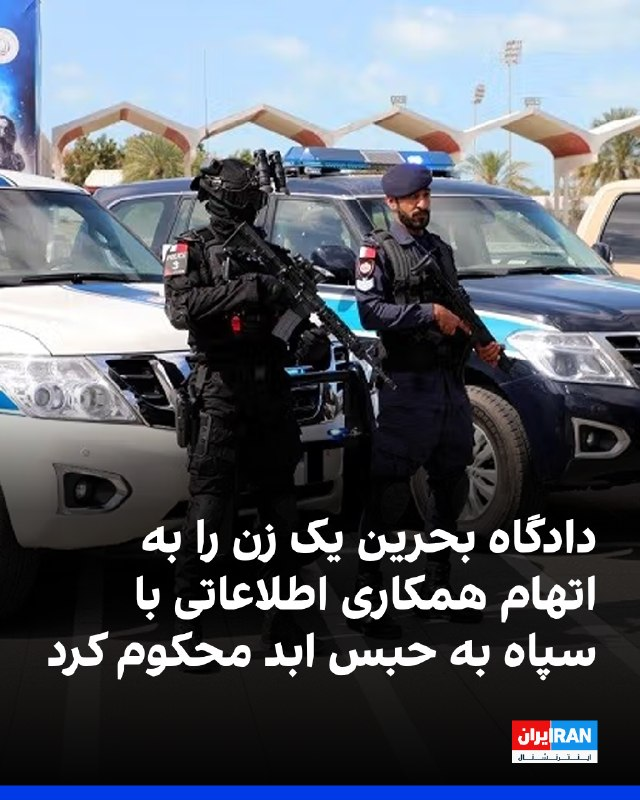

دادگاه عالی کیفری بحرین یک زن را به اتهام تلاش و همکاری اطلاعاتی با سپاه پاسداران با هدف انجام اقدامات خصمانه علیه این کشور به حبس ابد محکوم کرد.

دادستانی بحرین اعلام کرد این پرونده پس از شناسایی یک حساب کاربری در شبکه‌های اجتماعی تشکیل شد که تصاویر و مختصات برخی مکان‌ها و تاسیسات «مهم و حیاتی» در بحرین را منتشر می‌کرد.

به گفته مقام‌های بحرینی، محتوای منتشرشده در این حساب به جایگاه نظامی، سیاسی و اقتصادی این کشور آسیب می‌زد و شامل مطالبی در تمجید، تشویق و تبلیغ آنچه «حمله جمهوری اسلامی به بحرین» خوانده شده، بود.

دادستانی بحرین اعلام کرد این زن در بازجویی‌ها اتهامات مطرح‌شده را پذیرفته و گفته بود حساب کاربری خود را برای کمک به «مهاجمان علیه بحرین» اختصاص داده است.

به گفته دادستانی، او تصاویر و مختصات شماری از مکان‌های حیاتی را همراه با عباراتی درباره امکان هدف قرار گرفتن آن‌ها منتشر کرده بود.
https://iranintl.com/202605128996

## IranIntlTV — post 336775

  <a href="telegram/content/IranIntlTV_336775_1778581186.mp4" target="_blank">🎬 Download video</a>

تیم فوتبال ایران در ادامه برنامه آماده‌سازی خود برای حضور در جام جهانی ۲۰۲۶، سه‌شنبه سومین بازی تدارکاتی با خود را برگزار می‌کند. این در حالی است که به‌دلیل محدودیت‌های بین‌المللی، امکان برگزاری دیدارهای تدارکاتی با تیم‌های مطرح فوتبال جهان برای این تیم فراهم نشده است.
گفت‌وگو با آیدین مقیمی، عضو تحریریه ایران‌اینترنشنال
@iranintltv

## IranIntlTV — post 336774

  

فاطمه مهاجرانی، سخنگوی دولت جمهوری اسلامی، با اشاره به قطعی طولانی‌مدت اینترنت در ایران گفت اینترنت حق مردم است و عصبانیت مردم کاملا درست است. اما در ادامه تاکید کرد: «عامل این عصبانیت دشمنانی هستند که باعث می‌شوند فضای امنیتی ما مخدوش شود.»

او افزود: «رسانه‌ها کمک کنند که این ادبیات را جا بیندازند. دولت طرفدار دسترسی آزاد است.»
https://iranintl.com/202605125702

## IranIntlTV — post 336773

  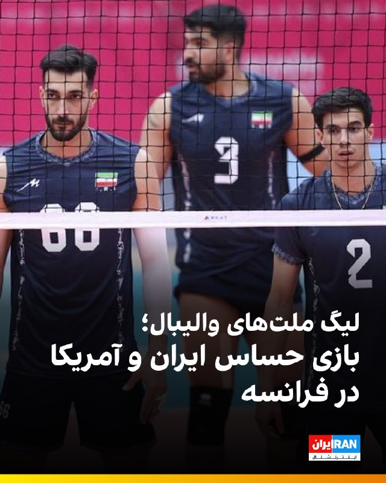

🔻تیم ملی والیبال ایران در مرحله مقدماتی لیگ ملت‌های ۲۰۲۶ در کشورهای برزیل، فرانسه و صربستان به مصاف حریفان خود می‌رود که در یکی از حساس‌ترین بازی‌ها شاگردان روبرتو پیاتزا ۴ تیر در فرانسه باید برابر آمریکا قرار بگیرند.

🔹در هفته اول این رقابت‌ها که از ۲۰ تا ۲۴ خرداد برگزار می‌شود، تیم ملی ایران در شهر برازیلیا برابر برزیل، بلغارستان، آرژانتین و بلژیک قرار می‌گیرد. دیدارهای این هفته به میزبانی کانادا، برزیل و چین برگزار خواهد شد.

🔹ملی‌پوشان ایران در ادامه و در هفته دوم لیگ ملت‌ها، از سوم تا هفتم تیر در شهر اورلئان فرانسه برابر فرانسه، آمریکا، ژاپن و کوبا صف‌آرایی می‌کنند. همزمان مسابقات این هفته در لهستان و اسلوونی نیز پیگیری می‌شود.

🔹هفته سوم مرحله مقدماتی لیگ ملت‌های ۲۰۲۶ از ۲۴ تا ۲۸ تیر برگزار خواهد شد و تیم ملی ایران در شهر بلگراد به مصاف اوکراین، آلمان، اسلوونی و ترکیه می‌رود. رقابت‌های این هفته علاوه بر صربستان، در آمریکا و ژاپن نیز برگزار می‌شود.

@iranintltvsport

## Shin_Persian — post 5963

  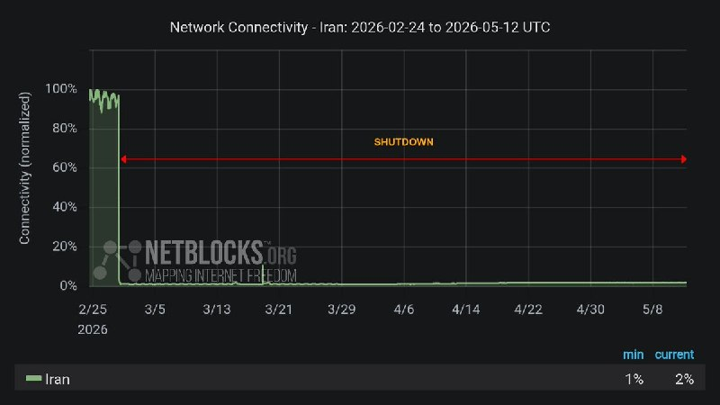

NetBlocks ✓ @netblocks
Tue, 12 May 2026 07:56:53 UTC

🕰️ Today is the 74th day that #Iran has been largely cut off the global internet, with the incident now passing hour 1752. Since 28 February 2026, the world has seen advances in science and technology. Meanwhile, Iran's regime has been arresting and executing technologists.

فارسی

🕰️ امروز هفتاد و چهارمین روزی است که اینترنت جهانی در #Iran (ایران) تا حد زیادی قطع شده است و این حادثه اکنون از ساعت ۱۷۵۲ زولو (۲۱:۲۲ به وقت تهران) می‌گذرد. از ۲۸ فوریه ۲۰۲۶، جهان شاهد پیشرفت‌هایی در علم و فناوری بوده است. در همین حال، رژیم ایران در حال دستگیری و اعدام متخصصان تکنولوژی بوده است.

𝕏 · @shin_persian

## ManotoTV — post 105337

  <a href="telegram/content/ManotoTV_105337_1778581191.mp4" target="_blank">🎬 Download video</a>

دادگاه کیفری بحرین دو مرد و یک زن را به اتهام ارتباط با سپاه پاسداران و برنامه‌ریزی برای اقدامات «تروریستی و خصمانه» علیه این کشور، به حبس ابد محکوم کرد.
به گفته دادستانی بحرین، دو متهم مرد با سپاه در ارتباط بوده‌اند و برای جمع‌آوری اطلاعات از مراکز حساس، انتقال پول و حمایت از عملیات مورد نظر ایران همکاری می‌کردند. متهم اصلی پیش‌تر به ایران گریخته بود.
در پرونده‌ای جداگانه، یک زن نیز به اتهام انتشار تصاویر و مختصات مراکز حساس بحرین و حمایت از جمهوری اسلامی در شبکه‌های اجتماعی، به حبس ابد محکوم شد.
دادگاه همچنین هر یک از دو متهم مرد را به پرداخت ۱۰ هزار دینار بحرینی معادل تقریبا ۲۶۵۹۵٫۷۴ دلار آمریکا جریمه محکوم کرد.

## ManotoTV — post 105336

  <a href="telegram/content/ManotoTV_105336_1778581191.mp4" target="_blank">🎬 Download video</a>

روزنامه اسرائیل هیوم گزارش داد هزاران شهروند اسرائیلی پیامک‌هایی تهدیدآمیز به زبان عبری دریافت کرده‌اند که در آنها از مخاطبان خواسته شده با جمهوری اسلامی همکاری اطلاعاتی کنند.

در یکی از این پیامک‌ها آمده است: «به شما قول داده بودیم که به‌زودی ستاره‌هایی را در آسمان شب خواهید دید که ستاره نیستند… به‌زودی خورشید را در آسمان شب خواهید دید، اما…»

بر اساس این گزارش، سازمان ملی سایبری اسرائیل این پیام‌ها را بخشی از تلاش برای ایجاد ترس و اثرگذاری روانی توصیف کرده و از شهروندان خواسته است به پیام‌ها پاسخ ندهند، شماره فرستنده را مسدود کنند و آن را گزارش دهند.

## FarsiVOA — post 217516

🔺رایزنی‌های اقتصادی پکن و واشنگتن پیش از دیدار ترامپ و شی

▪️چین و آمریکا در آستانه دیدار دونالد ترامپ و شی جین‌پینگ در پکن، مذاکرات تازه‌ای را با محور تجارت، کشاورزی و انرژی دنبال می‌کنند.

▪️هه لی‌فنگ، معاون نخست‌وزیر چین، روز سه‌شنبه وارد کره جنوبی شد تا پیش از دیدار رهبران دو اقتصاد بزرگ جهان، با هیئت آمریکایی گفت‌وگو کند.

▪️شماری از مدیران ارشد شرکت‌های بزرگ آمریکایی، از جمله ایلان ماسک، تیم کوک، مدیرعامل اپل، و مدیران بوئینگ و جنرال الکتریک اروسپیس، ترامپ را در سفر به چین همراهی می‌کنند. به گفته یک مقام کاخ سفید، انتظار می‌رود چین خریدهایی در زمینه هواپیماهای بوئینگ، محصولات کشاورزی و انرژی آمریکا اعلام کند.

⬇️ بیشتر بخوانید:
https://ir.voanews.com/a/8149154.html

## FarsiVOA — post 217515

  <a href="telegram/content/FarsiVOA_217515_1778581192.mp4" target="_blank">🎬 Download video</a>

ویدیوی منتسب به «حملات مخفیانه» امارات به پالایشگاه نفت لاوان در فروردین ماه؛

روزنامه وال‌استریت ژورنال به نقل از افراد آگاه گزارش داد که امارات متحده عربی به‌ طور مخفیانه حملات نظامی علیه جمهوری اسلامی انجام داده است.

طبق این گزارش یکی از این حملات به پالایشگاه نفت لاوان انجام شده است. هرچند این گزارش به تاریخ دقیقی اشاره نکرده، اما رسانه‌های رسمی داخل ایران از جمله خبرگزاری صداوسیمای جمهوری اسلامی در همان زمان گزارش داده بودند که تأسیسات نفتی جزیره لاوان در صبح روز ۱۹ فروردین هدف حمله قرار گرفته است.

تاکنون هیچ‌یک از مقامات رسمی امارات این گزارش را تایید نکرده‌اند، اما همچنان به بیانیه‌های قبلی خود اشاره کرده‌اند که در آنها بر «حق امارات برای پاسخگویی به حملات ایران» تاکید شده بود.

از آغاز حملات آمریکا و اسرائیل علیه جمهوری اسلامی، امارات بارها از سوی رژیم ایران هدف حملات موشکی و پهپادی قرار گرفته است.
@FarsiVOA

## FarsiVOA — post 217514

🔺افت بورس‌های منطقه‌ای جهانی در سایه کاهش امیدها به توافق تهران و واشنگتن

▪️رویترز گزارش داد بیشتر بازارهای سهام خلیج فارس در معاملات اولیه سه‌شنبه، همزمان با کاهش امیدها به توافقی برای پایان دادن به جنگ آمریکا و اسرائیل با جمهوری اسلامی، افت کردند.

▪️شاخص اصلی بورس دبی ۰.۵ درصد و شاخص ابوظبی ۰.۸ درصد کاهش یافت. شاخص قطر نیز ۰.۲ درصد افت کرد. در مقابل، شاخص عربستان سعودی با رشد سهام بانک الراجحی و آرامکو، ۰.۱ درصد بالا رفت. نفت برنت نیز به ۱۰۶ دلار و ۲۱ سنت رسید.

▪️دونالد ترامپ، رئیس‌جمهوری آمریکا، روز دوشنبه گفت آتش‌بس با ایران «روی دستگاه تنفس» است و به اختلاف‌ها بر سر توقف درگیری‌ها، رفع محاصره دریایی آمریکا، ازسرگیری صادرات نفت ایران و پرداخت غرامت جنگی اشاره کرد.

⬇️ بیشتر بخوانید:
https://ir.voanews.com/a/8149153.html

## FarsiVOA — post 217513

  

شرکت «ادنوک گاز» که بهره‌برداری از تأسیسات حبشان، اصلی‌ترین مجتمع گازی امارات متحده عربی را برعهده دارد، اعلام کرد انتظار می‌رود این مجتمع سال ۲۰۲۷ بتواند ظرفیت کامل خود را بازیابد.

تأسیسات حبشان در جریان جنگ اخیر هدف حملات جمهوری اسلامی قرار گرفت و این حملات یک کشته و هفت زخمی بر جای گذاشت.

ادنوک گاز روز سه‌شنبه در بیانیه‌ای که به مناسبت انتشار نتایج سه‌ماهه خود صادر کرد، نوشت هدف این است که «تا پایان سال ۲۰۲۶ به ۸۰ درصد بازیابی برسیم و بازگشت به ظرفیت کامل در سال ۲۰۲۷ انجام شود.»

مجتمع حبشان در ابوظبی، یکی از بزرگ‌ترین مراکز فرآوری گاز در جهان، اوایل آوریل دوبار هدف حملات جمهوری اسلامی قرار گرفت.

ادنوک گاز که زیرمجموعه شرکت بزرگ اماراتی «ادنوک» است تاکنون توانسته ۶۰ درصد از ظرفیت فرآوری این مجتمع را بازگرداند. سود خالص ادنوک گاز در سه ماه نخست سال، در شرایطی که «اختلالات عمده در بخش انرژی و ترافیک دریایی در تنگه هرمز» وجود داشته، ۱۵ درصد نسبت به سال گذشته کاهش یافته و به ۱.۱ میلیارد دلار رسیده است.

بسته شدن تنگه هرمز باعث اختلال در تأمین و افزایش شدید قیمت‌های انرژی شده است.
@FarsiVOA

## FarsiVOA — post 217512

  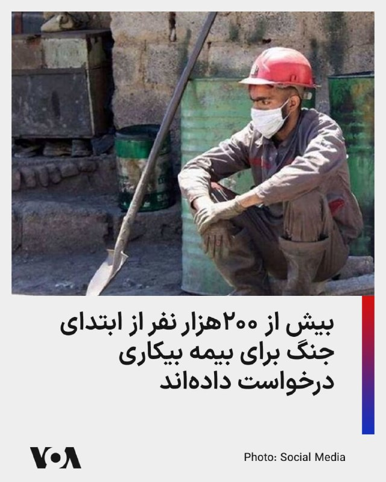

عضو کمیسیون اقتصادی مجلس جمهوری اسلامی از افزایش ثبت‌نام برای بیمه بیکاری خبر داده و گفته است این روند می‌تواند هزینه‌های دولت و صندوق بیمه بیکاری را افزایش دهد.

خبرگزاری تسنیم به نقل از میثم ظهوریان نوشت که از ابتدای جنگ تاکنون حدود ۲۰۵ هزار نفر برای دریافت بیمه بیکاری در کشور ثبت‌نام کرده‌اند.

این نماینده مجلس مدعی شد که بخشی از این افراد ممکن است در بخش غیررسمی مشغول به کار شوند، اما در هر صورت هزینه پرداخت بیمه بیکاری بر عهده دولت باقی خواهد ماند.

پیشتر علیرضا محجوب، دبیر خانه کارگر اعلام کرده بود که در طول جنگ، ۱۳۰ هزار فرصت شغلی به صورت مستقیم و ۶۰۰ هزار فرصت شغلی به صورت غیر مستقیم از بین رفته است.
@FarsiVOA

## FarsiVOA — post 217511

  <a href="telegram/content/FarsiVOA_217511_1778581196.mp4" target="_blank">🎬 Download video</a>

استقرار تعداد زیادی از هواپیماهای سوخت‌رسان ارتش ایالات متحده در فرودگاه بن گوریون اسرائیل؛

به دنبال گمانه‌زنی‌ها درباره تشدید احتمال از سرگیری عملیات نظامی آمریکا و اسرائیل علیه جمهوری اسلامی، تصاویر منتشر شده از فرودگاه بن گوریون اسرائیل، تعداد زیادی از سوخت‌رسان‌های نیروی هوایی ایالات متحده را در آن نشان می‌دهد.
@FarsiVOA

## FarsiVOA — post 217510

  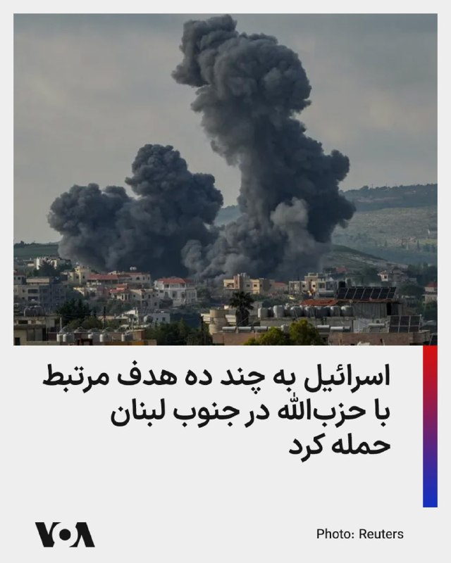

ارتش اسرائیل می‌گوید در ۲۴ ساعت گذشته حدود ۴۵ زیرساخت گروه حزب‌الله را در جنوب لبنان هدف قرار داده است. اسرائیل در کنار آمریکا و دیگر کشورها حزب‌الله لبنان را یک سازمان تروریستی می‌داند.

بر اساس اعلام ارتش اسرائیل، در طول ۲۴ ساعت گذشته، نیروهای اسرائیلی حدود ۴۵ زیرساخت مرتبط با حزب‌الله را در چندین منطقه در جنوب لبنان هدف قرار داد. از جمله این زیرساخت‌ها، «مراکز فرماندهی، ایستگاه‌های دیده‌بانی، نقاط تجمع و ساختمان‌های نظامی است که به گفته ارتش اسرائیل نیروهای حزب‌الله «از طریق آنها، اقدامات تروریستی علیه نیروهای ارتش و کشور اسرائیل را پیش می‌بردند.»

همچنین بر اساس این اعلام، حدود ۱۰ انبار که توسط حزب‌الله برای ذخیره تجهیزات جنگی با هدف آسیب رساندن به نیروهای ارتش اسرائیل استفاده می‌شد، هدف قرار گرفته‌اند.

همزمان، نیروی هوایی اسرائیل موشک‌اندازهایی را هدف قرار داده است. در رویدادی دیگر، نیروی هوایی اسرائیل دو هدف هوایی مشکوک را در منطقه‌ای که نیروهای ارتش اسرائیل در جنوب لبنان فعالیت می‌کنند، رهگیری کرد.
@FarsiVOA

## FarsiVOA — post 217509

  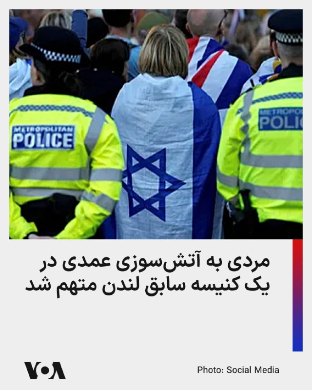

پلیس بریتانیا اعلام کرد که یک مرد ۴۵ ساله را به اتهام آتش‌سوزی عمدی با قصد به خطر انداختن جان افراد متهم کرده است. بر اساس اعلام پلیس، این فرد، این فرد پس از حمله به یک کنیسه سابق در شرق لندن در هفته گذشته بازداشت شد.

موارد حملات یهودستیزانه در بریتانیا در ماه‌های اخیر افزایش یافته است.

به دلیل افزایش اخیر خشونت‌ها، پلیس متروپولیتن بریتانیا تشکیل یک تیم جدید حفاظت از منطقه را اعلام کرد که با افزودن ۱۰۰ افسر پلیس به حفاظت از جوامع یهودی در سراسر لندن کمک می‌کند.

روز دوشنبه، دولت بریتانیا ۱۲ فرد و نهاد مرتبط با رژیم ایران را به فهرست تحریمی خود اضافه و آنها را به مشارکت در «فعالیت خصمانه» از جمله طراحی حملات و «ارائه خدمات مالی به گروه‌ها» برای بی‌ثبات‌سازی بریتانیا و سایر کشورها متهم کرد.

روزنامه بریتانیایی تلگراف ۱۳ اردیبهشت، در گزارشی از فعالیت یک شبکه پروپاگاندای «مرتبط با سپاه پاسداران انقلاب اسلامی» در بریتانیا نسبت به تهدید «امنیت ملی» بریتانیا از سوی جمهوری اسلامی هشدار داد.
@FarsiVOA

## FarsiVOA — post 217508

🔺۱۷۵۰ ساعت تاریکی دیجیتال؛ اژه‌ای خواستار برخورد با اینترنت پرو شد

▪️قطع گسترده اینترنت در ایران وارد هفتاد و چهارمین روز شده و مدت این اختلال از هزار و ۷۵۲ ساعت گذشته است.

▪️این محدودیت همزمان با بالا گرفتن جنجال «اینترنت پرو» و «خط‌های سفید»، موضوع دسترسی تبعیض‌آمیز به اینترنت را به یکی از محورهای اختلاف درون ساختار رسمی جمهوری اسلامی تبدیل کرده است.

▪️پرونده اینترنت پرو اکنون از یک طرح موقت اداری فراتر رفته و به موضوعی امنیتی، قضایی و سیاسی تبدیل شده است.

▪️این موضوع همزمان سه بحران را در خود جمع کرده است: ادامه قطع اینترنت برای اکثریت شهروندان، دسترسی ویژه برای گروهی محدود، و تأیید رسمی تخلف در سازوکار واگذاری این دسترسی‌ها.

⬇️ بیشتر بخوانید:
https://ir.voanews.com/a/8149152.html

## DW_Farsi — post 124587

🔶اخراج مهاجران؛ قصد اتحادیه اروپا برای دعوت از مقامات طالبان

تقریباً هیچ کشوری طالبان را به عنوان دولت قانونی افغانستان به رسمیت نمی‌شناسد. با این حال، اتحادیه اروپا می‌خواهد با اسلام‌گرایان حاکم بر این کشور، آن‌هم درباره افزایش اخراج مهاجران به افغانستان، گفت‌وگو کند.

اتحادیه اروپا قصد دارد نمایندگان دولت اسلام‌گرای افراطی طالبان را برای گفت‌وگو درباره اخراج مهاجران به افغانستان، به بروکسل دعوت کند.

سخنگوی کمیسیون اروپا ۱۱ مه (۲۱ اردیبهشت) اعلام کرد که در حال حاضر مقدمات برگزاری نشستی "در سطح فنی با مقام‌های بالفعل افغانستان" در دست آماده‌سازی است.

خبرگزاری فرانسه با استناد به منابع آگاه گزارش داد، قرار است به‌زودی نامه‌ای به کابل ارسال شود تا بتوان درباره تعیین زمانی برای این گفت‌وگوها در بروکسل به توافق رسید.

سفر نمایندگان طالبان به اروپا در ادامه دو سفر نمایندگان اروپایی به افغانستان انجام خواهد شد؛ سفرهایی که با هدف بررسی امکان اخراج مهاجران افغانستانی از اتحادیه اروپا به کشورشان صورت گرفته بود.

@dw_farsi

## DW_Farsi — post 124586

  

🔶 استرالیا تحریم‌های جدید علیه هفت فرد و چهار نهاد ایرانی اعمال کرد

پنی وانگ، وزیر امور خارجه استرالیا، روز سه‌شنبه ۱۲ مه (۲۲ اردیبهشت) اعلام کرد، دولت این کشور در واکنش به "سرکوب خشونت‌آمیز" مستمر شهروندان توسط حکومت جمهوری اسلامی و همچنین بازداشت ناعادلانه اتباع خارجی، ۷ فرد و ۴ نهاد ایرانی را تحریم می‌کند.

در بیانیه‌ای که وبسایت وزارت خارجه استرالیا منتشر کرده، آمده است: «در ماه ژانویه، رژیم ایران هزاران نفر از شهروندان خود را قتل‌عام کرد و دست به بازداشت‌های گسترده معترضان مسالمت‌آمیز زد؛ بازداشت‌شدگانی که تحت شکنجه قرار گرفتند، وادار به اعترافات اجباری شدند و از ارتباط با خانواده‌هایشان محروم ماندند.»

در این بیانیه با اشاره به قطع سراسری اینترنت گفته شده است حکومت ایران "دسترسی به اینترنت را محدود کرد تا مانع از آگاهی جهان از این جنایات شود".

به گفته وزیر خارجه استرالیا تحریم‌های جدید "همچنین نظام بانکی سایه‌ای ایران را هدف قرار می‌دهد که به این کشور اجازه می‌دهد گروه‌های نیابتی مانند حماس را تأمین مالی کند، از برنامه موشک‌های بالستیک خود حمایت کند و دیگر اقدامات بی‌ثبات‌کننده را انجام دهد".

## Persian_Trend_Official — post 13972

لینک داخلی برای افراد داخل ایران: https://dl.persiantrend.com/Mostanad/RezaShah.mp4

## Persian_Trend_Official — post 13970

  <a href="telegram/content/Persian_Trend_Official_13970_1778581200.webm" target="_blank">🎬 Download video</a>

دیگه هر بچه مزلفی پیج میزنه و دیگران رو تهدید میکنه !
من اگه قرار بود با این چیزا بترسم هیچوقت کار سیاسی نمیکردم

## Persian_Trend_Official — post 13969

هواپیمابر شارل دوگل فرانسه

## Persian_Trend_Official — post 13968

  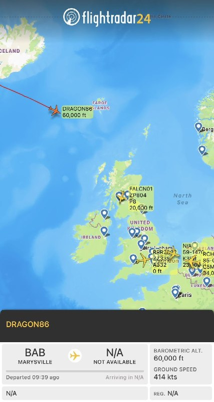

⭕️ یک فروند هواپیمای شناسایی U-2S "دراگون‌لیدی" با شناسه "دراگون ۸۶" صبح امروز از پایگاه هوایی "بیل" به سمت پایگاه هوایی "فِیرفورد" در بریتانیا حرکت کرده است.

آخرین باری که این هواپیمای جاسوسی به خاورمیانه آمده بود هفته بعدش به جنگ اخیر ختم شد.

📝 Nick

📌 @persian_trend_official
پرشین ترند | متفاوت‌ترین کانال نظامی

## Persian_Trend_Official — post 13967

  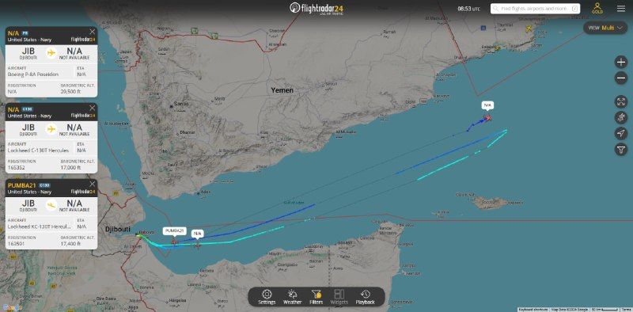

⭕️ فعالیت سنگین نیروی دریایی آمریکا در اطراف تنگه باب‌المندب

این فعالیت سنگین در آب‌های جنوبی یمن و تا فاصله با تنگه باب‌المندب احتمالاً برای پشتیبانی از ناو گروه ضربت هواپیمابر شارل دوگل فرانسه برای خروج از تنگه باب‌المندب است.
ناو هواپیمابر جورج بوش پوشش خروج ناو شارل دوگل را از تنگه باب‌المندب فراهم می‌کند.

📝 Nick

📌 @persian_trend_official
پرشین ترند | متفاوت‌ترین کانال نظامی

## Persian_Trend_Official — post 13966

جواد قارایی : طرفداران رضا پهلوی غلط می‌کنند بگویند عرب نمی‌پرستیم، چون یک عرب به پدرش پناه داد !!! پ.ن : چی می‌شود که یک نفر از طبیعت‌گردی، ناگهان تبدیل می‌شود به مفسر تاریخ معاصر ایران؛ آن هم با ادعاهایی چنین غلط، سطحی و بی‌پایه؟

## Persian_Trend_Official — post 13965

  <a href="telegram/content/Persian_Trend_Official_13965_1778581202.mp4" target="_blank">🎬 Download video</a>

جواد قارایی : طرفداران رضا پهلوی غلط می‌کنند بگویند عرب نمی‌پرستیم، چون یک عرب به پدرش پناه داد !!!

پ.ن : چی می‌شود که یک نفر از طبیعت‌گردی، ناگهان تبدیل می‌شود به مفسر تاریخ معاصر ایران؛ آن هم با ادعاهایی چنین غلط، سطحی و بی‌پایه؟

## Persian_Trend_Official — post 13964

اگر به اخبار جنگ، تحولات خاورمیانه، ایران، آمریکا و تحلیل اتفاقات روز علاقه داری، پیشنهاد می‌کنم حتماً پرشین ترند رو دنبال کنی.

چیزی که من توی این کانال دوست دارم فقط خبر نیست؛
تحلیل‌ها، جمع‌بندی‌ها و لایوهای شبانه‌ایه که کمک می‌کنه آدم وسط این حجم از اخبار، واقعاً بفهمه چه خبره.

هم نسخه کامل لایوها قرار می‌گیره، هم فایل صوتی و هم پوشش سریع اتفاقات مهم روز.

📌 @persian_trend_official
پرشین ترند | متفاوت‌ترین کانال نظامی

## Persian_Trend_Official — post 13963

اگر احساس می‌کنید یکی از دوستان، اعضای خانواده یا اطرافیانتون ممکنه به محتوای پرشین ترند علاقه داشته باشه، متن پایین رو براش فوروارد کنید 🙏

کمک شما باعث میشه خانواده پرشین ترند بزرگ‌تر بشه و افراد بیشتری به تحلیل‌ها، لایوها و پوشش روزانه اخبار دسترسی داشته باشن ❤️

## Persian_Trend_Official — post 13962

🔴 سخنگوی کمیسیون امنیت ملی مجلس: غنی‌سازی ۹۰ درصدی یکی از گزینه‌های ایران است

💢سخنگوی کمیسیون امنیت ملی و سیاست خارجی مجلس ایران اعلام کرد در صورت وقوع تجاوز علیه ایران، غنی‌سازی اورانیوم تا سطح ۹۰ درصد یکی از گزینه‌های روی میز خواهد بود.

▪️این اظهارات در حالی مطرح می‌شود که تنش‌ها میان ایران و آمریکا همچنان ادامه دارد و پرونده هسته‌ای تهران بار دیگر در کانون تحولات منطقه‌ای قرار گرفته است.

🫆:Tony

📌 @persian_trend_official
پرشین ترند | متفاوت‌ترین کانال نظامی

## Persian_Trend_Official — post 13961

دو روز ۱۸ و ۱۹ دی ۱۴۰۴، ۲۳۶ کودک رو کشتید. ۵۵۵ بچه رو هم بازداشت کردید. از جنایت هاتون در سوریه هم یه روزی وقتش برسه حرف میزنیم. تاریخ قضاوت خواهد کرد بلایی که شما سر ایران آوردید مغول نیاورد ... 📌 @persian_trend_official پرشین ترند | متفاوت‌ترین کانال نظامی

## RadioFarda — post 157083

  

🔸در حالی که مسعود پزشکیان، رئیس جمهوری ایران می‌گوید اجازه «فشار بر معیشت مردم» را نمی‌دهد،‌ گزارش رسانه‌ها در ایران از فروش دانه‌ای میوه در فروشگاه‌های اینترنتی حکایت دارد.

🔸رسانه‌های اقتصادی در ایران با اشاره به گرانی قیمت میوه از عرضه و فروش دانه‌ای میوه در برخی پلتفرم‌های اینترنتی گزارش می‌دهند و آن را نشانه‌ای از فشار اقتصادی و تغییر الگوی مصرف خانوارها توصیف کرده‌اند.

🔸بنا بر گزارش‌ها تصاویر منتشر شده در برخی پلتفرم‌های اینترنتی نشان می‌دهد که آنها در حال فروش دانه‌ای سیب، موز، خیار و برخی دیگر از میوه‌ها و صیفی‌جات هستند؛ پدیده‌ای که برای فرهنگی مانند ایران که میوه همیشه بخشی جدانشدنی از سفره خانواده‌ها، مهمانی‌ها، عیادت‌ها و حتی خریدهای روزمره بوده، دور از ذهن به نظر می‌رسید.

🔸این تصاویر و گزارش‌ها در حالی منتشر شده است که مسعود پزشکیان، روز سه‌شنبه تاکید کرد که اجازه «سوءاستفاده از شرایط جنگی و فشار بر معیشت مردم» را نخواهد داد و یکی از سیاست‌های اساسی دولت در شرایط فعلی «کنترل مصرف و جلوگیری از شکل‌گیری تقاضای القایی و کاذب» است.

@RadioFarda

## RadioFarda — post 157082

ترامپ می‌گوید خسته نمی‌شود و فشار بر جمهوری اسلامی را تا پیروزی کامل ادامه خواهد داد

🔸دونالد ترامپ، رئیس‌جمهور ایالات متحده، شامگاه دوشنبه ۲۱ اردیبهشت در گفت‌وگو با خبرنگاران بار دیگر پاسخ مقامات جمهوری اسلامی به پیشنهاد صلح آمریکا را «ضعیف» و «کاملاً غیرقابل قبول» خواند و تأکید کرد فشار بر جمهوری اسلامی را تا زمان دستیابی به توافق ادامه خواهد داد و از ادامهٔ جنگ فرسایشی خسته نخواهد شد.

🔸ترامپ در گفت‌وگو با خبرنگاران در کاخ سفید، با اشاره به رد پیشنهاد آمریکا از سوی تهران، گفت: «احمق‌ها نمی‌خواستند قبول کنند. فکر می‌کردند من خسته می‌شوم یا حوصله‌ام سر می‌رود یا تحت فشار قرار می‌گیرم، اما هیچ فشاری وجود ندارد. ما به یک پیروزی کامل خواهیم رسید.»

🔸او همچنین دربارهٔ پیشنهاد ارائه‌شده از سوی جمهوری اسلامی گفت: «به‌نظرم فوق‌العاده ضعیف است. بعد از خواندن مزخرفاتی که برای ما فرستادند، آن را ضعیف‌ترین پاسخ یافتم. من حتی خواندنش را تمام نکردم، گفتم وقتم را برای خواندن آن تلف نمی‌کنم.»

🔸ترامپ در گفت‌وگو با شبکه سی‌بی‌اس هم گفت تهران در برنامه هسته‌ای خود امتیازاتی داده، اما این امتیازها «کافی نبوده» است.

🔸ترامپ یک روز پیش‌تر نیز گفته بود از پاسخ تهران به پیشنهاد آمریکا رضایت ندارد و آن را «کاملاً غیرقابل قبول» می‌داند. همزمان، صداوسیمای جمهوری اسلامی گزارش داد که این پیشنهاد رد شده، زیرا به گفته این رسانه، به معنای «تسلیم کامل» بوده است.

🔸رئیس‌جمهور آمریکا در پاسخ به پرسشی دربارهٔ احتمال تغییر حکومت در ایران هم گفت در جمهوری اسلامی «میانه‌روها» و «دیوانه‌ها» وجود دارند و افزود: «دیوانه‌ها می‌خواهند تا آخر بجنگند.» ترامپ گفت جنگ «خیلی کوتاه» خواهد بود و مدعی شد میانه‌روها در حکومت ایران از تندروها می‌ترسند.

🔸نسخه کامل این گزارش را در وب‌سایت رادیوفردا بخوانید.

@RadioFarda

## RadioFarda — post 157081

آیا ایران می‌تواند از مالکان کابل‌های فیبر نوری در تنگۀ هرمز عوارض بگیرد؟

🔸ایران هفته‌هاست که ادعا می‌کند حق دارد از شناورهای بین‌المللی عبوری از تنگۀ هرمز، عوارض بگیرد.

🔸حالا دو نهاد خبری مرتبط با سپاه پاسداران، از طرح‌هایی برای دریافت عوارض از شرکت‌های فناوری اطلاعات خبر داده‌اند؛ اقدامی که به بهانۀ عبور کابل‌های فیبر نوری این‌ شرکت‌ها از تنگۀ هرمز پیشنهاد شده است.

🔸بازگشایی این آبراه حیاتی که تا پیش از جنگ، نزدیک به ۲۰ درصد از حامل‌های انرژی مورد نیاز جهان از آن عبور می‌کرد و حالا، مدت‌هاست که از سوی سپاه پاسداران بسته شده، به یکی از مهمترین موضوعات مرتبط با جنگ جاری خاورمیانه و پایان دادن به آن تبدیل شده است.

🔸تهران می‌گوید این تنگه، تحت حاکمیت ایران است و به همین دلیل دریافت چنین تعرفه‌ها و عوارضی را حق طبیعی خود می‌داند؛ موضوعی که از سوی جامعۀ بین‌المللی رد شده است.

🔸کارشناسان معتقدند که ایدۀ دریافت عوارض از شرکت‌های مالک کابل‌های زیر آبی عبوری از تنگۀ هرمز، بیشتر جنبۀ تهدید دارد تا امکان اجرایی و عملی.

🔸آیسیک مَتِر، مدیر تحقیقات در شرکت ناظر «نت بلاکس» مستقر در لندن به رادیو اروپای آزاد/رادیو آزادی می‌گوید: «خطر قطع تعمدی و خصمانۀ کابل‌های زیر دریایی، همیشه وجود داشته است؛ اما تهدیدی آشکار از سوی کشوری مثل ایران، این خطر را دوچندان می‌کند».

🔸کابل‌های زیردریایی، عمدتاً به غول‌های فناوری همچون گوگل، متا، مایکروسافت، و آمازون تعلق دارند. این کابل‌ها برای اتصال اینترنتی بین آسیا، اروپا و حوزۀ خلیج فارس به کار می‌روند؛ همین‌طور برای انتقال ترافیک داده‌ها، و البته برای تراکنش‌های مالی بین‌المللی.

🔸در صورت آسیب‌دیدن این کابل‌ها، مردم عادی ساکن آسیا، خاورمیانه و اروپا به سرعت و به‌شکلی گسترده با تبعات آن روبرو خواهند شد.

🔸نسخه کامل این گزارش را در وب‌سایت رادیوفردا بخوانید.

@RadioFarda

## RadioFarda — post 157080

🔸نشست خبری سخنگوی دولت مسعود پزشکیان روز سه‌شنبه ۲۲ اردیبهشت به دلیل وضعیت اینترنت به بگومگوی خبرنگاران با فاطمه مهاجرانی منجر شد.

🔸سخنگوی دولت تاکید کرد که «اینترنت پرو» با مصوبه شورای عالی امنیت ملی که ریاست آن را مسعود پزشکیان بر عهده دارد،‌ مورد استفاده قرار می‌گیرد.

🔸او در عین حال تاکید کرد که این اینترنت ویژه کسب و کارها است.

🔸فاطمه مهاجرانی همچنین با اشاره به سخنان شب گذشته دونالد ترامپ درباره آتش‌بس شکننده میان ایران و آمریکا که آن را در وضعیت «حفظ حیات» توصیف کرده بود، گفت: شرایط جنگی است و پس از دور شدن سایه جنگ وضعیت اینترنت به تدریج به حالت عادی تغییر می کند.

🔸این اظهارات در حالی مطرح شد که حسین افشین، معاون علمی و فناوری مسعود پزشکیان، روز دوشنبه به طور تلویحی وجود دلایل امنیتی برای قطعی کامل اینترنت در ایران را رد کرد و گفت: «حتی در شرایط جنگی هم بستن اینترنت راهکار درستی نیست، چرا که دیدیم وقتی اینترنت کامل بسته بود هم ترورها ادامه داشت».

🔸مقام‌های جمهوری اسلامی در پی آغاز حملات مشترک آمریکا و اسرائیل به ایران دسترسی مردم به اینترنت در کشور را به طور کامل قطع کردند.

@RadioFarda

## RadioFarda — post 157079

  <a href="https://t.me/radiofarda/157079" target="_blank">📎 Download file</a>

«خیرمقدم به بی‌حجاب‌ها»؛ عقب‌نشینی تاکتیکی یا استراتژی جدید جمهوری اسلامی؟

🔸احمد مَروی، تولیت آستان قدس رضوی و از روحانیون محافظه کار در جمهوری اسلامی، خواستار «خیرمقدم» به زنان با پوشش اختیاری در اجتماعات حکومتی شد.

🔸در روزهای گذشته نیز، در برخی تجمعات شبانه حامیان حکومت، از زنان و دخترانِ با ‌حجاب اختیاری به عنوان «ناموس ایران» یاد شد، و شعارهایی در استقبال از حضور آن‌ها در مراسم حکومتی سر داده شد.

🔸آیا استقبال از زنان با پوشش اختیاری در راهپیمایی‌های حکومتی یک چرخش ایدئولوژیک در ساختار جمهوری اسلامی است یا تنها یک تاکتیک موقت سیاسی در شرایط فعلی محسوب می‌شود؟

🔸این پرسشی است که با مهدیه گلرو، فعال حقوق زنان در سوئد، در میان گذاشته‌ایم.

@RadioFarda

## IranianMinds — post 19998

🔴حریم هوای عراق کلیر شد.

@IranianMinds

## IranianMinds — post 19997

🔴۷۴مین روز چال نشدن علی خامنه‌ای ملقب به موش‌علی.
حسن خرس‌الله هم ۱۴۹ روز چال نشده بود

@IranianMinds

## IranianMinds — post 19996

🔴بحرین:

سه نفر به اتهام جاسوسی برای سپاه پاسدارن ایران، به حبس ابد محکوم شدند.

@IranianMinds

## IranianMinds — post 19995

  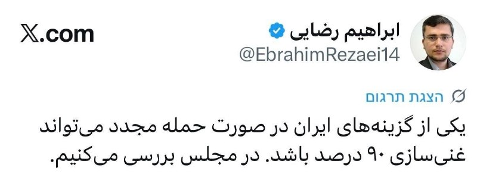

🔴ابراهیم رضایی سخنگوی کمیسیون امنیت ملی مجلس ایران در شبکه ایکس نوشت:

یکی از گزینه‌های ایران در صورت حمله مجدد می‌تواند غنی‌سازی ۹۰ درصدی باشد. در مجلس بررسی می‌کنیم.

@IranianMinds

## BBCPersian — post 280834

🔻فرودگاه امام خمینی: شرکت‌های هواپیمایی داخلی به ۲۰ مقصد پرواز دارند

بنابر اعلام فرودگاه امام خمینی تهران، هم اکنون ۱۳ شرکت هواپیمایی داخلی به ۲۰ مقصد پرواز دارند.

مدیر روابط عمومی این فرودگاه از شهرهای استانبول، مسقط، نجف، مدینه، شانگهای، گوانگژو، بغداد و پکن به عنوان مقاصدی نام برد که از تهران به آنها، پرواز انجام می‌شود.

اهورا محمدی همچنین گفت: «۱۳ شرکت هواپیمایی ایرانی در حال انجام این پروازها هستند و بیشترین پروازها نیز برای شرکت‌های ماهان، ایران‌ایر، معراج، ایرتور، سپهران و کاسپین است.»

آقای محمدی تعداد پروازهای روزانه از فرودگاه امام خمینی را «بین ۳۵ تا ۴۰ پرواز» اعلام کرد.

پروازهای خارجی از ایران که از زمان شروع جنگ در نهم اسفند سال گذشته متوقف شده بود، در اوایل اردیبهشت از سر گرفته شد.

آمریکا و اسرائیل در طول جنگ شماری از فرودگاه‌ها و هواپیماها را در ایران هدف حملات هوایی قرار دادند.

@BBCPersian

## BBCPersian — post 280833

🔻«شناسایی» ۵۱۰۰ زندانی فراری در استان البرز

رئیس کل دادگستری البرز گفت که ۵۱۰۰ زندانی فراری شناسایی شده‌اند اما به مجموع متهمانی که در این استان از زندان فرار کرده‌اند، اشاره‌ای نکرد.

حسین فاضلی هریکندی گفت: «در سال ۱۴۰۳ مجموعا ۲۲۸۵ متهم از طریق سامانه ساما شناسایی و بازداشت شدند. استفاده کامل از سامانه ساما در سال ۱۴۰۴ منجر به شناسایی بیش از ۵۱۰۰ متهم و محکوم متواری شد که نسبت به سال قبل از آن رشد ۱۲۳ درصدی را نشان می‌دهد و از این تعداد قریب به ۱۲۰۰ نفر جلب شدند.»

آقای فاضلی هریکندی گفت که سامانه اطلاعات موثر اشخاص (ساما) در سال ۱۴۰۳ برای «رفع مشکل فقدان پایگاه داده منسجم به منظور شناسایی و جلب متهمان و محکومان متواری در مبادی ورودی واحدهای قضائی و انتظامی» راه‌اندازی و اجرایش در سال ۱۴۰۴ «کامل» شد.

@BBCPersian

## BBCPersian — post 280832

🔻پاکستان گزارش سی‌بی‌اس درباره «پناه دادن» به هواپیماهای نظامی ایران را تکذیب کرد

پاکستان گزارش شبکه سی‌بی‌اس درباره حضور هواپیماهای نظامی ایرانی در پایگاه هوایی نورخان را رد کرد.

وزارت امور خارجه پاکستان این گزارش را «گمراه‌کننده و جنجالی» توصیف کرد.

در بیانیه این وزارتخانه آمده است: «چنین روایت‌های که براساس گمانه‌زنی‌هاست، ظاهرا با هدف تضعیف تلاش‌های جاری برای ثبات و صلح منطقه‌ای مطرح می‌شود.»

شبکه سی‌بی‌اس، شریک رسانه‌ای بی‌‌بی‌سی در آمریکا، به نقل از دو مقام آمریکایی گزارش داده است که پاکستان در میانه تلاش‌ها برای متوقف کردن جنگ، «به هواپيماهای نظامی ايران غیرعلنی اجازه داد در پايگاه‌های هوايی‌اش مستقر شوند.»

اقدامی که به گفته مقام‌های امريکايی در گفتگو با سی‌بی‌اس، ممکن است حاکی از تلاش ایران برای محافظت هواپیماهایش از حملات هوايی باشد.

وزارت خارجه پاکستان اما می‌گوید که پس از برقراری آتش‌بس و در جریان دور نخست گفت‌وگوهای اسلام‌آباد، تعدادی هواپیما از ایران و آمریکا برای تسهیل جابه‌جایی دیپلمات‌ها و تیم‌های امنیتی و کارکنان اداری مرتبط با روند مذاکرات وارد پاکستان شدند. برخی هواپیماها و نیروهای پشتیبانی نیز در انتظار دورهای بعدی مذاکرات مدتی در پاکستان ماندند.

این وزارتخانه اضافه کرده است: «هواپیماهای ایرانی که اکنون در پاکستان مستقر هستند، در دوره آتش‌بس وارد این کشور شده‌اند و هیچ ارتباطی با هیچ‌گونه وضعیت اضطراری نظامی یا ترتیبات حفاظتی ندارند.»

پاکستان همچنین گفت که اگرچه مذاکرات رسمی در جریان نیست اما تبادل‌ دیپلماتیک در سطح عالی ادامه دارد.

@BBCPersian

## BBCPersian — post 280831

🔻وزارت دارایی آمریکا ۱۲ فرد و نهاد را برای تسهیل و فروش نفت ایران به چین تحریم کرد

وزارت دارایی آمریکا در اقدامی تازه ۱۲ فرد و نهاد را به‌دلیل نقش‌ داشتن در تسهیل فروش و انتقال نفت ایران به چین از سوی سپاه پاسداران انقلاب اسلامی تحریم کرد.

به گفته این وزارتخانه، سپاه پاسداران با استفاده از شرکت‌های پوششی در حوزه‌های اقتصادی دارای نظارت ضعیف، نقش خود در فروش نفت را پنهان کرده است و درآمد حاصل از آن را به حکومت ایران منتقل می‌کند.

وزارت دارایی آمریکا گفته است که جمهوری اسلامی به‌جای استفاده از این درآمدها برای حمایت از مردم ایران، آن را صرف توسعه تسلیحاتی، حمایت از گروه‌های نیابتی و تامین مالی نیروهای امنیتی برای سرکوب آزادی‌های شهروندان می‌کند.

همچنین اسکات بسنت، وزیر دارایی آمریکا، نیز با انتشار بیانیه‌ای مرتبط با این تحریم‌ها در شبکه اجتماعی ایکس نوشته است: «در حالی که نیروهای نظامی ایران با درماندگی در تلاش برای بازسازی توان خود هستند، کارزار ‘فشار اقتصادی’ همچنان منابع مالی حکومت را برای برنامه‌های تسلیحاتی و گروه‌های نیابتی و اهداف هسته‌ای محدود خواهد کرد.»

او اضافه کرده است: «وزارت دارایی آمریکا به قطع دسترسی حکومت ایران به شبکه‌های مالی مورد استفاده برای اقدامات تروریستی و بی‌ثبات‌سازی اقتصاد جهانی ادامه می‌دهد.»

@BBCPersian

## BBCPersian — post 280829

🔻ولایتی در واکنش به ترامپ: در میدان شکست‌تان دادیم، گمان نکن در دیپلماسی پیروز خواهی شد

علی اکبر ولایتی، وزیرخارجه سابق ایران و مشاور سیاست خارجی رهبر جمهوری اسلامی، در واکنش به اظهارات جدید دونالد ترامپ، رئیس‌جمهور آمریکا، گفته است: «شما را در میدان شکست دادیم؛ پس هرگز گمان نکن پیروزِ دیپلماسی خواهی شد.»

آقای ولایتی به اظهارات جدید آقای ترامپ که برخی آن را اشاره تلویحی به تهدید ایران به حمله اتمی ارزیابی کرده‌اند، اشاره کرده و گفته است: «ترامپ، درحالی ایران را با ایهام، تهدید اتمی می‌کند که گویا دروغ‌های پنتاگون درباره کتمان آمار تلفات سنگین سربازان امریکایی را باور کرده است. آقای ترامپ هرگز گمان نکن با سوءاستفاده از آرامش امروز ما، پیروزمندانه وارد پکن خواهی شد.»

@BBCPersian

## BBCPersian — post 280821

🔻یک تحقیق بی‌بی‌سی از تخلفات جدی در بخش کودکان یک بیمارستان دولتی در پاکستان پرده برداشته است. در سال ۲۰۲۵، این بیمارستان در شهر تونسه با شیوع گسترده اچ‌آی‌وی در میان کودکان مرتبط دانسته شد.

مقام‌های پاکستانی وعده برخورد قاطع دادند، اما بیش از یک سال بعد، بی‌بی‌سی دریافت که استفاده دوباره از سرنگ‌ها همچنان جان کودکان را به خطر می‌اندازد.

بیشتر بخوانید:
https://bbc.in/431RC93
@BBCPersian

## Dirty_Kids — post 389300

  <a href="telegram/content/Dirty_Kids_389300_1778581207.mp4" target="_blank">🎬 Download video</a>

یه مشت شیعه وارداتی از اوگاندا تو خیابونای تهران دارن داد میزنن:
«مرگ بر منافق» [یعنی معترضای ایرانی]

فقط یک لحظه بهش فکر کن.

یه عده خارجی از یه قاره دیگه اومدن تو ⁹کشور ما، بعد دارن برای مرگ خودِ ایرانی‌ها شعار میدن🤦🏻‍♀️

@Dirty_Kids 👻

## Dirty_Kids — post 389299

  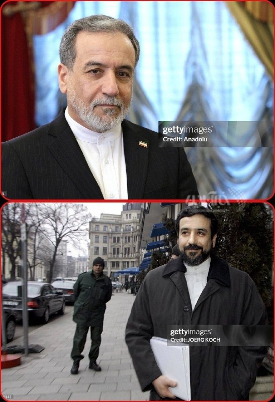

این بیناموس ۲۰ ساله داره مذاکره میکنه
خاک بر سر مذاکره کنندگان که علاف این حرامزاده شدند
۲۰۰۶
۲۰۲۶۰

@Dirty_Kids 👻

## Dirty_Kids — post 389298

  

🌪وقتی اینترنت طوفانیه... کافیه بادبان ها رو بکشی تا

⚫️با بالاترین کیفیت ممکن
⚡️ 

⚫️100 هزار تومان شارژ هدیه 
🎁

⚫️پایین ترین قیمت گیگی 250
🌐 

⚫️و ارائه پورسانت %10 در ازای هر معرفی
💼

بتونی یه اتصال پایدار با پشتیبانی 24 ساعته داشته باشی
🚀

بادبان راهتو باز می‌کنه
⛵️

🛡@BadBan_VPN | کانال 

🤖@BadBan_VPNBot | ربات 

📞@BadBan_VPNSupport | پشتیبانی

## Dirty_Kids — post 389297

  

دوران قاجار واقعا عجیب بوده

@Dirty_Kids 👻

## Hranews — post 112897

  

فریبرز کهن‌زاد با تودیع وثیقه آزاد شد

❗️
❗️
❗️
❗️
❗️– فریبرز کهن‌زاد، دانشجوی دانشگاه صنعتی شریف که پیشتر توسط نیروهای امنیتی بازداشت شده بود، روز یکشنبه ۲۰ اردیبهشت‌ماه با تودیع وثیقه آزاد شد.

به گزارش خبرگزاری هرانا، ارگان خبری مجموعه فعالان حقوق بشر در ایران، فریبرز کهن‌زاد آزاد شد.

آزادی آقای کهن‌زاد روز یکشنبه ۲۰ اردیبهشت ۱۴۰۴، با تودیع وثیقه صورت گرفته است.

ادامه مطلب

#فریبرز_کهن‌زاد

↘️
@hranews_bot تماس ✉️ -  @Hranews  کانال هرانا 🆑

## Hranews — post 112896

  

نت‌بلاکس، نهاد ناظر بر اختلالات اینترنت در جهان، اعلام کرد که قطع گسترده اینترنت در ایران وارد هفتاد و چهارمین روز خود شده و اکنون از مرز ۱۷۵۲ ساعت گذشته است. این نهاد تاکید کرده که از زمان آغاز این محدودیت‌ها، دسترسی عمومی شهروندان ایران به #اینترنت جهانی همچنان به‌طور گسترده مسدود مانده است.

نت‌بلاکس همچنین با اشاره به همزمانی این محدودیت‌ها با بازداشت و اعدام شماری از فعالان و متخصصان حوزه فناوری در ایران، نوشته است که در حالی‌ که جهان شاهد پیشرفت‌های علمی و فناوری بوده، حکومت ایران به برخوردهای امنیتی با تکنولوژیست‌ها ادامه داده است.

↘️
@hranews_bot تماس ✉️ - @Hranews کانال هرانا 🆑

## Hranews — post 112895

شهرستان آوج؛ یک جنگلبان توسط متخلف محیط زیستی مصدوم شد

❗️
❗️
❗️
❗️
❗️– یک #جنگلبان در منابع طبیعی شهرستان آوج توسط یک متخلف محیط زیستی مورد ضرب و شتم قرار گرفت و مجروح شد.

ادامه مطلب

↘️
@hranews_bot تماس ✉️ -  @Hranews  کانال هرانا 🆑

## Hranews — post 112894

  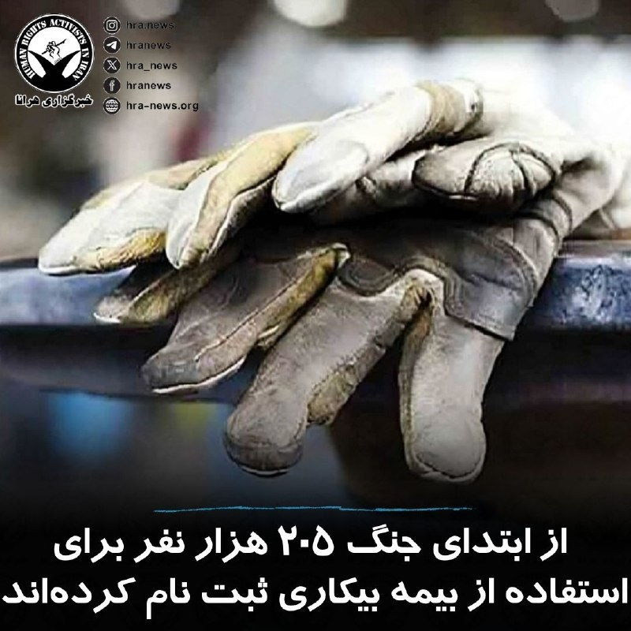

میثم ظهوریان، عضو کمیسیون اقتصادی مجلس اعلام کرد که از ابتدای #جنگ تاکنون، ۲۰۵ هزار نفر برای استفاده از بیمه بیکاری ثبت‌نام کرده‌اند.

↘️
@hranews_bot تماس ✉️ - @Hranews کانال هرانا 🆑

## Hranews — post 112893

  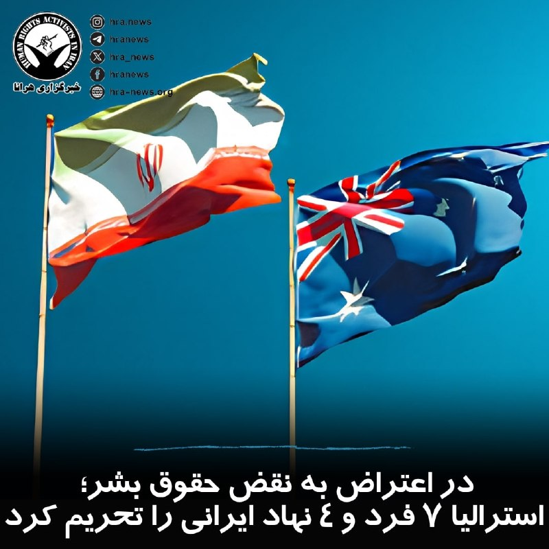

وزارت امور خارجه استرالیا اعلام کرد که هفت فرد و چهار نهاد مرتبط با جمهوری اسلامی را به دلیل مشارکت در «نقض حقوق بشر در ایران»، از جمله سرکوب زنان و دختران و نقض حقوق شهروندی، #تحریم کرده است.

«اسکندر مومنی، سید مجید فیض جعفری، روح‌الله مومن‌نسب، قربان محمد ولی‌زاده، محسن ابراهیمی، ناصر زرین‌قلم و منصور زرین‌قلم، همچنین فرماندهی انتظامی جمهوری اسلامی ایران (فراجا)، سازمان فضای مجازی سراج، صرافی برلیان و صرافی GCM» از جمله افراد و نهادهایی هستند که به دلیل نقش در #نقض_حقوق_بشر تحریم شده‌اند.

دولت استرالیا برای این افراد و نهادها تحریم‌های مالی و ممنوعیت سفر در نظر گرفته است.

↘️
@hranews_bot تماس ✉️ - @Hranews کانال هرانا 🆑

## manototv — post 105337

  <a href="telegram/content/manototv_105337_1778581214.mp4" target="_blank">🎬 Download video</a>

دادگاه کیفری بحرین دو مرد و یک زن را به اتهام ارتباط با سپاه پاسداران و برنامه‌ریزی برای اقدامات «تروریستی و خصمانه» علیه این کشور، به حبس ابد محکوم کرد.
به گفته دادستانی بحرین، دو متهم مرد با سپاه در ارتباط بوده‌اند و برای جمع‌آوری اطلاعات از مراکز حساس، انتقال پول و حمایت از عملیات مورد نظر ایران همکاری می‌کردند. متهم اصلی پیش‌تر به ایران گریخته بود.
در پرونده‌ای جداگانه، یک زن نیز به اتهام انتشار تصاویر و مختصات مراکز حساس بحرین و حمایت از جمهوری اسلامی در شبکه‌های اجتماعی، به حبس ابد محکوم شد.
دادگاه همچنین هر یک از دو متهم مرد را به پرداخت ۱۰ هزار دینار بحرینی معادل تقریبا ۲۶۵۹۵٫۷۴ دلار آمریکا جریمه محکوم کرد.

## manototv — post 105336

  <a href="telegram/content/manototv_105336_1778581214.mp4" target="_blank">🎬 Download video</a>

روزنامه اسرائیل هیوم گزارش داد هزاران شهروند اسرائیلی پیامک‌هایی تهدیدآمیز به زبان عبری دریافت کرده‌اند که در آنها از مخاطبان خواسته شده با جمهوری اسلامی همکاری اطلاعاتی کنند.

در یکی از این پیامک‌ها آمده است: «به شما قول داده بودیم که به‌زودی ستاره‌هایی را در آسمان شب خواهید دید که ستاره نیستند… به‌زودی خورشید را در آسمان شب خواهید دید، اما…»

بر اساس این گزارش، سازمان ملی سایبری اسرائیل این پیام‌ها را بخشی از تلاش برای ایجاد ترس و اثرگذاری روانی توصیف کرده و از شهروندان خواسته است به پیام‌ها پاسخ ندهند، شماره فرستنده را مسدود کنند و آن را گزارش دهند.

## alonews — post 119464

  <a href="telegram/content/alonews_119464_1778581215.webm" target="_blank">🎬 Download video</a>

👈به فاصله کمتر از یکسال بسیجی‌های دانشگاه تهران به اونایی که میگفتن قمار باز الان میگن شهید

✅ @AloNews خبر جنگ

## alonews — post 119463

  <a href="telegram/content/alonews_119463_1778581215.webm" target="_blank">🎬 Download video</a>

👈احتمال شنیده‌شدن صدای انفجار در تبریز

✅ @AloNews خبر جنگ

## alonews — post 119462

  <a href="telegram/content/alonews_119462_1778581215.webm" target="_blank">🎬 Download video</a>

👈عجیب اما واقعی
‼️

🔴علی خضریان نماینده مجلس خیلی شیک و مجلسی گرای یه پتروشیمی بسیار مهم کشور رو داد

✅ @AloNews خبر جنگ

## alonews — post 119461

  <a href="telegram/content/alonews_119461_1778581216.webm" target="_blank">🎬 Download video</a>

👈دیوان امیری قطر: امیر قطر با وزیر خارجه ترکیه در مورد اوضاع منطقه و آتش‌بس بین تهران و واشنگتن گفتگو کرد.

🔴دو طرف در مورد تلاش‌ها برای کاهش تنش‌ها و تثبیت اصل راه‌حل دیپلماتیک گفتگو کرد

✅ @AloNews خبر جنگ

## alonews — post 119460

  

🔥
🔥هر گیگ فقط 150 تا 100هزار تومان
🔥
🔥

💥
🔝تخفیف ویژه به مناسبت 100کا شدن مون از دست ندین
💰

🔍دنبال یه خرید مطمئن و ارزونی؟

🔄
💯فقط با 150 تومن، مستقیم و بدون واسطه خرید کن.

این فرصت ازت دست ندی دیگه نیاز به هزینه اضافی برای فیلتر نداری واسطه پاک‌کن مستقیم خرید کن
✅

📣
💎ما ۲۴ ساعته پشتت هستیم و اگه راضی نبودی، وجهت رو برمی‌گردونیم.
بزن رو لینک و امتحان کن:

🎮
🛡@premiumzone6bot

🎮
🛡@premiumzone6bot

## alonews — post 119459

  <a href="telegram/content/alonews_119459_1778581217.webm" target="_blank">🎬 Download video</a>

👈 آخرین قیمت نفت ۱۰۷.۱۲ دلار

✅ @AloNews خبر جنگ

## alonews — post 119458

  <a href="telegram/content/alonews_119458_1778581217.webm" target="_blank">🎬 Download video</a>

👈بحرین : برای ۳ نفر که متهم به جاسوسی و ارتباط با سپاه پاسداران ایران بودن، حکم حبس ابد صادر کردیم

✅ @AloNews خبر جنگ

## alonews — post 119457

  <a href="telegram/content/alonews_119457_1778581217.webm" target="_blank">🎬 Download video</a>

👈تداوم اختلال GPS در تنگه هرمز

🔴 داده‌های شرکت ردیابی دریایی WINDWARD وارد نشان می‌دهد که اختلال GPS در تنگه هرمز همچنان تداوم دارد.

🔴 حدود یک هفته است که اختلال سیستم‌های ناوبری دریایی و GPS به دلیل تحرکات تجاوزکارانه آمریکا در تنگه هرمز افزایش پیدا کرده است.

✅ @AloNews خبر جنگ

## alonews — post 119456

  <a href="telegram/content/alonews_119456_1778581217.webm" target="_blank">🎬 Download video</a>

👈سفیر آمریکا در تل‌آویو می‌گوید اسرائیل سامانه‌های گنبد آهنین را به امارات متحده عربی ارسال کرده است 
✅ @AloNews خبر جنگ

## alonews — post 119455

  <a href="telegram/content/alonews_119455_1778581218.webm" target="_blank">🎬 Download video</a>

👈ابراهیم رضایی، سخنگوی کمیسیون امنیت ملی مجلس : اگه دوباره به ایران حمله بشه، یکی از گزینه‌های روی میز می‌تونه غنی‌سازی ۹۰ درصدی اورانیوم باشه و این موضوع تو مجلس بررسی میشه!

✅ @AloNews خبر جنگ

## alonews — post 119454

  <a href="telegram/content/alonews_119454_1778581218.webm" target="_blank">🎬 Download video</a>

👈رویترز: به دلیل کمبود نفت، ژاپن چاپ بسته‌بندی مواد غذایی را به صورت سیاه‌وسفید آغاز کرده است.

✅ @AloNews خبر جنگ

## alonews — post 119453

  <a href="telegram/content/alonews_119453_1778581218.webm" target="_blank">🎬 Download video</a>

👈داده‌های ناوبری کپلر: ۸ کشتی روز دوشنبه از تنگه هرمز عبور کردند؛ ۵ کشتی از تنگه خارج و ۳ کشتی وارد شدند.

✅ @AloNews خبر جنگ

## alonews — post 119452

  <a href="telegram/content/alonews_119452_1778581218.webm" target="_blank">🎬 Download video</a>

👈صدر اعظم آلمان: توسعه اقتصادی ما برای سال‌ها راکد مانده است — حداقل هفت سال — در حالی که کشورهای دیگر اطراف ما رشد می‌کنند، برخی به طور قابل توجهی.

🔴پیش‌بینی می‌شود رشد بالقوه کمتر از نیم درصد برای سال‌های آینده باشد.

🔴برای کشور ما، برای رفاه ما، برای اقتصاد ما — این به سادگی خیلی کم است.

✅ @AloNews خبر جنگ

## alonews — post 119451

  <a href="telegram/content/alonews_119451_1778581219.webm" target="_blank">🎬 Download video</a>

👈سفیر آمریکا در تل‌آویو می‌گوید اسرائیل سامانه‌های گنبد آهنین را به امارات متحده عربی ارسال کرده است

✅ @AloNews خبر جنگ

## alonews — post 119450

  <a href="telegram/content/alonews_119450_1778581219.webm" target="_blank">🎬 Download video</a>

👈چرا ‏گوشی ۱۱۰۰ دلاری در ایران ۳۰۰۰ دلار فروخته می‌شود؟!

✅ @AloNews خبر جنگ

## alonews — post 119449

  <a href="telegram/content/alonews_119449_1778581219.webm" target="_blank">🎬 Download video</a>

👈وزیر کشور پاکستان: انفجار یک بمب در ایالت خیبرپختونخوا واقع در شمال غرب پاکستان دست کم ۷ کشته و ۱۸ زخمی برجای گذاشت.‌

✅ @AloNews خبر جنگ

## alonews — post 119448

## alonews — post 119447

  <a href="telegram/content/alonews_119447_1778581219.webm" target="_blank">🎬 Download video</a>

👈وال‌استریت ژورنال: آمریکا و ایران در یک بن‌بست دیپلماتیک بر سر موضوعاتی قرار گرفته‌اند که سال‌هاست دو طرف را دچار مشکل کرده است، و این درگیری اکنون در وضعیتی نامشخص و خاکستری قرار دارد؛ حالتی که نه جنگ است و نه صلح

✅ @AloNews خبر جنگ

## alonews — post 119446

  <a href="telegram/content/alonews_119446_1778581220.webm" target="_blank">🎬 Download video</a>

👈سی‌ان‌ان: بسته‌های چیپس کالبی ژاپن با تشدید جنگ علیه ایران، تک رنگ می‌شوند

🔴شرکت تولیدکننده تنقلات ژاپنی Calbee به دلیل مشکلات زنجیره تأمین ناشی از جنگ خاورمیانه، بسته‌بندی خود را به سیاه و سفید تغییر می‌دهد.

🔴این شرکت در بیانیه‌ای اعلام کرد که این اقدام در واکنش به «بی‌ثباتی عرضه که بر برخی مواد اولیه در بحبوحه تنش‌های جاری در خاورمیانه تأثیر می‌گذارد» صورت می‌گیرد.

🔴نفتا یک محصول جانبی نفتی است که گاهی اوقات در بخش‌هایی از فرآیند تولید جوهر استفاده می‌شود.

✅ @AloNews خبر جنگ

---
📅 بروزرسانی: 1405/02/22 11:38
---

## VahidOOnLine — post 239658

  

نت‌بلاکس اعلام کرد امروز هفتاد و چهارمین روزی است که ایران تا حد زیادی از اینترنت جهانی قطع شده و این اختلال اکنون وارد هزار و هفتصد و پنجاه و دومین ساعت خود شده است. نت‌بلاکس نوشت از ۹ اسفند جهان شاهد پیشرفت‌هایی در حوزه علم و فناوری بوده، در حالی که همزمان حکومت ایران در حال بازداشت و اعدام متخصصان حوزه فناوری بوده است.
‌🏁 🇬🇧 IranintlTV

🤖 @VahidOOnLine

## VahidOOnLine — post 239657

  <a href="telegram/content/VahidOOnLine_239657_1778573322.mp4" target="_blank">🎬 Download video</a>

وزارت خارجه پاکستان اعلام کرد اگرچه مذاکرات رسمی هنوز از سر گرفته نشده، تماس‌های دیپلماتیک در سطح بالا همچنان ادامه دارد.

این وزارتخانه در واکنش به گزارش سی‌بی‌اس درباره حضور هواپیماهای جمهوری اسلامی در پایگاه نورخان پاکستان، این گزارش را «گمراه‌کننده و جنجالی» خواند و گفت هواپیماهایی از ایران و آمریکا پس از آتش‌بس و در جریان دور نخست گفت‌وگوهای اسلام‌آباد وارد پاکستان شده بودند تا جابه‌جایی دیپلمات‌ها، تیم‌های امنیتی و کارکنان اداری مرتبط با روند مذاکرات را تسهیل کنند.

وزارت خارجه پاکستان همچنین گفت برخی هواپیماها و نیروهای پشتیبانی به‌طور موقت در پاکستان باقی ماندند تا برای دورهای بعدی تماس‌ها آماده باشند. اسلام‌آباد تاکید کرده است هواپیماهای ایرانی موجود در پاکستان ارتباطی با «اقدام نظامی» یا «حفظ دارایی‌های نظامی» ندارند و پاکستان در این روند نقش میانجی «بی‌طرف و سازنده» داشته است.
‌🏁 🇬🇧 ManotoTV

🤖 @VahidOOnLine

## VahidOOnLine — post 239656

  

بر اساس اطلاعات رسیده به ایران‌اینترنشنال، شیوا اسماعیلی، گلرخ ایرایی، سکینه پروانه، فروغ تقی‌پور، زهرا صفایی، مرضیه فارسی، الهه فولادی و وریشه مرادی، هشت تن از زندانیان سیاسی زن محبوس در بند زنان زندان اوین، از حق ملاقات با خانواده و وکیلان خود محروم شده‌اند.

اطلاعات رسیده حاکی است این محرومیت‌ها پس از تشدید فضای امنیتی در بند زنان اوین و در پی فشار و برخورد با زندانیانی اعمال شده که در برنامه‌های جمعی، یادبودها و رخدادهای اعتراضی داخل بند، مشارکت داشته‌اند.
‌🏁 🇬🇧 IranintlTV

🤖 @VahidOOnLine

## VahidOOnLine — post 239655

  

بر اساس اطلاعات رسیده به ایران‌اینترنشنال، محترم پرندین، معروف به محشر، هنرمند و نقاش زندانی در اوین که ماه‌هاست با اتهامات سیاسی در حبس است، با وجود ابتلا به دو تومور در ناحیه پشت سر، نزدیک مخچه و گلو و همچنین بیماری حاد قلبی، از اعزام درمانی و جراحی فوری محروم مانده است.

یک منبع مطلع به ایران‌اینترنشنال گفت پزشک زندان جراحی فوری پرندین را ضروری دانسته و درباره خطر تومور نزدیک مخچه هشدار داده است؛ توموری که باعث اختلال در بینایی، تکلم و حرکات بدنی او شده و به گفته هم‌بندی‌هایش، آثار آن در راه رفتن و صحبت کردنش قابل مشاهده است.

به گفته این منبع آگاه، با وجود تاکید پزشک زندان، مسئولان تاکنون برای اعزام درمانی او همکاری نکرده‌اند و با وجود گذشت بیش از نیمی از ایام حبس و وخامت حال، با آزادی مشروط و مرخصی درمانی‌اش نیز مخالفت کرده‌اند؛ این در حالی است که سند لازم برای مرخصی در اختیار دادستانی قرار دارد.

محترم پرندین مادر یک پسر نوجوان و محصل است و پس از درگذشت همسرش سرپرستی خانواده را بر عهده دارد. فرزند او نیز به بیماری خاص مبتلاست و در نبود مادر با مشکلات جدی روبه‌رو شده است.
‌🏁 🇬🇧 IranintlTV

🤖 @VahidOOnLine

## VahidOOnLine — post 239654

  <a href="telegram/content/VahidOOnLine_239654_1778573324.mp4" target="_blank">🎬 Download video</a>

⭕️نفتکش ایرانی سه روز پس از حمله آمریکا در تنگه هرمز همچنان در حال سوختن است

♦️یک نفتکش متعلق به جمهوری اسلامی که به گفته مقام‌های آمریکایی با شلیک جنگنده‌های آمریکایی در دریای عمان و در نزدیکی بندر جاسک  متوقف شده بود، روز دوشنبه ۲۱ اردیبهشت‌ماه همچنان در آتش می‌سوخت.

فرماندهی مرکزی آمریکا، سنتکام، اعلام کرده بود نیروهای این کشور روز شنبه ۱۹ اردیبهشت دو نفتکش با پرچم جمهوری اسلامی را پیش از رسیدن به بنادر ایران متوقف کردند. جزئیات بیشتری درباره علت آتش‌سوزی و وضعیت خدمه این نفتکش منتشر نشده است.
‌🇸🇦 Indypersian

🤖 @VahidOOnLine

## VahidOOnLine — post 239653

  

ابراهیم رضایی، سخنگوی کمیسیون امنیت ملی مجلس، در شبکه اجتماعی ایکس نوشت یکی از گزینه‌های جمهوری اسلامی در صورت حمله مجدد می‌تواند غنی‌سازی ۹۰ درصد باشد.

او نوشت: «یکی از گزینه‌‌ها در صورت حمله مجدد می‌تواند غنی‌سازی ۹۰ درصد باشد. در مجلس بررسی می‌کنیم.»
‌🏁 🇬🇧 IranintlTV

🤖 @VahidOOnLine

## VahidOOnLine — post 239652

  

ابراهیم رضایی، سخنگوی کمیسیون امنیت ملی مجلس، در شبکه اجتماعی ایکس نوشت یکی از گزینه‌های جمهوری اسلامی در صورت حمله مجدد می‌تواند غنی‌سازی ۹۰ درصد باشد.

او نوشت: «یکی از گزینه‌‌ها در صورت حمله مجدد می‌تواند غنی‌سازی ۹۰ درصد باشد. در مجلس بررسی می‌کنیم.»
‌🏁 🇬🇧 IranintlTV

🤖 @VahidOOnLine

## VahidOOnLine — post 239651

  

ابراهیم رضایی، سخنگوی کمیسیون امنیت ملی مجلس، در شبکه اجتماعی ایکس نوشت یکی از گزینه‌های جمهوری اسلامی در صورت حمله مجدد می‌تواند غنی‌سازی ۹۰ درصد باشد.

او نوشت: «یکی از گزینه‌‌ها در صورت حمله مجدد می‌تواند غنی‌سازی ۹۰ درصد باشد. در مجلس بررسی می‌کنیم.»
‌🏁 🇬🇧 IranintlTV

🤖 @VahidOOnLine

## VahidOOnLine — post 239650

  

♦️وزارت امور خارجه استرالیا روز سه‌شنبه ۲۲ اردیبهشت ماه اعلام کرد هفت فرد و چهار نهاد مرتبط با جمهوری اسلامی را به‌دلیل «سرکوب خشونت‌بار مردم» و «اقدامات مخل ثبات منطقه‌ای» در فهرست تحریم‌های خود قرارداده است.

براساس بیانیه وزارت امور خارجه استرالیا، این تحریم‌ها در هماهنگی با بریتانیا و دیگر شرکای بین‌المللی انجام شده است.

عبدلله اسکندر مومنی، وزیر کشور دولت مسعود پزشکیان، سید مجید فیض جعفری، روح‌الله مومن‌نسب، قربان محمد ولی‌زاده، محسن ابراهیمی، ناصر زرین‌قلم و منصور زرین قلم، افرادی هستند که در فهرست تحریم‌های استرالیا قرار گرفته‌اند.
علاوه بر وزیر کشور، رئیس پلیس امنیت عمومی فراجا، دبیر ستاد امر به معروف و نهی از منکر تهران و فرمانده سپاه سیدالشهدا استان تهران در فهرست تحریم‌های به‌روز شده دولت استرالیا قرار دارند.

وزارت خارجه استرالیا یکی از این افراد را «مسئول هدایت سرکوب زنان و دختران در ایران» معرفی کرده و نوشته است که این فرد «با استقرار ۸۰ هزار نیرو، نظارت گسترده و اجرای اجباری حجاب را دنبال کرده است».

فرد دیگر نیز موسس «پایگاه‌های اطلاعاتی محلی» معرفی شده که «از طریق جمع‌آوری اطلاعات خانه‌به‌خانه و گشت‌های محلی، مخالفان جمهوری اسلامی را شناسایی و مجازات کرده است. برخی دیگر نیز مسئول بازداشت ناعادلانه اتباع خارجی» معرفی شده‌اند.

تحریم‌های اخیر استرالیا سامانه «بانکداری پنهان ایران» را به‌عنوان سازوکاری برای حمایت از گروه‌های نیابتی نظیر حماس و برنامه موشکی بالستیک» هدف قرار داده و دارایی‌های
 نیروی انتظامی، سازمان فضای مجازی سراج، صرافی برلیان و صرافی جی‌سی‌ام را تحت نظام مجازات‌های مالی آورده است.
‌🇸🇦 Indypersian

🤖 @VahidOOnLine

## VahidOOnLine — post 239649

  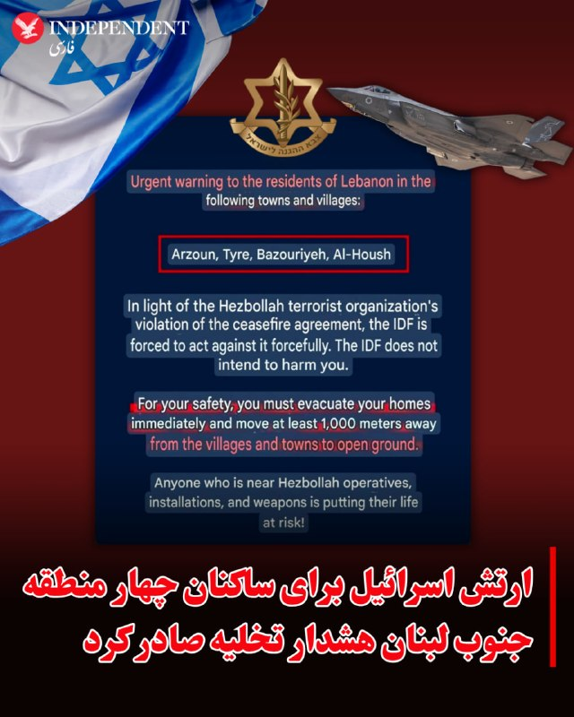

⭕️ارتش اسرائیل برای ساکنان چهار منطقه جنوب لبنان هشدار تخلیه صادر کرد

♦️آویخای ادرعی، سخنگوی عرب‌زبان ارتش ارتش اسرائیل، روز سه‌شنبه ۲۲ اردیبهشت با انتشار هشداری فوری از ساکنان مناطق ارزون، صور، البازوریه و الحوش در لبنان خواست فورا خانه‌های خود را تخلیه کرده و دست‌کم هزار متر به مناطق باز بروند.

سخنگوی ارتش اسرائیل در این هشدار بار دیگر حزب‌الله را به نقض آتش‌بس متهم کرد و نوشت: هر فردی که در نزدیکی نیروها، تاسیسات یا تجهیزات حزب‌الله قرار داشته باشد، در معرض خطر است.
این هشدار در حالی صادر می‌شود که وزارت بهداشت لبنان اعلام کرد در جریان بمباران‌های صبح سه‌شنبه دست‌کم ۶ نفر در جنوب این کشور کشته شده‌اند.
‌🇸🇦 Indypersian

🤖 @VahidOOnLine

## VahidOOnLine — post 239648

  

وزارت خارجه پاکستان گزارش درباره اعزام هواپیماهای نظامی و غیرنظامی جمهوری اسلامی به پاکستان برای در امان ماندن از حملات، را «گمراه‌کننده» توصیف کرد و آن را رد کرد.

این وزارتخانه در بیانیه‌ای اعلام کرد که پس از برقراری آتش‌بس و در جریان مذاکرات، شماری از هواپیماها وارد پاکستان شدند تا جابه‌جایی تیم‌ها را تسهیل کنند و برخی از این هواپیماها و نیروهای پشتیبانی «به‌طور موقت» در این کشور باقی ماندند تا برای دورهای بعدی تعامل آماده باشند.

در این بیانیه آمده است: «هواپیماهای ایرانی که هم‌اکنون در پاکستان مستقر هستند، در دوره آتش‌بس وارد این کشور شدند و هیچ‌گونه ارتباطی با هیچ سناریوی نظامی یا ترتیبات حفاظتی ندارند.»

شبکه خبری سی‌بی‌اس به نقل از «مقام‌های آگاه آمریکایی» گزارش داده بود که جمهوری اسلامی، شماری از هواپیماهای نظامی خود را به پایگاه نورخان پاکستان و همچنین چند هواپیمای غیرنظامی را به افغانستان اعزام کرده است تا از خسارات ناشی از جنگ در امان بمانند.
‌🏁 🇬🇧 IranintlTV

🤖 @VahidOOnLine

## VahidOOnLine — post 239647

🗣روایت شما از بحران اقتصادی و زندگی در آتش‌بس- سه‌شنبه ۲۲ اردیبهشت:

🔹دانه قهوه شده کیلویی ۲ میلیون تومان، قهوه فوری شده کیلویی ۳ میلیون تومان! دیگه نمی‌شه قهوه خورد

🔹لوازم بهداشتی به‌شدت گران شده‌ان. قیمت مام ضد تعریقی که می‌گرفتم ۲۰۰ هزار تومان به ۶۰۰ هزار تومان افزایش یافته.

🔹با ۲۸ میلیون حقوق ماهیانه، زندگی دو نفره رزیدنتی ما به بن‌بست رسیده. پس‌اندازهایمان تمام شده و حتی توان تعمیر وسایل را نداریم.

🔹من فارغ‌التحصیل ارشدم، دو سال با بدبختی پول جور کردم یه لپ‌تاپ خریدم تحقیقات انجام دادم همین که اومدم مقاله رو چاپ کنم نت قطع شد. این وضعیت برای یکی مثل من که هیچ‌وقت دست از تلاش برنمی‌داشتم یعنی خود مرگ.

🔹از میانکوه خوزستان پیام می‌دهم؛ منطقه یک انتقال گاز در سال جدید حقوق ارکان ثالث را پرداخت نکرده که سابقه نداشته، همیشه برج یک دستمزدها پرداخت می‌شد.

🔹جمهوری اسلامی دقیقا به سبک کارتل‌های مواد مخدر عمل می‌کند. یک عده وفادار به خودش را با تطمیع و پول‌پاشی نگه داشته، ملت ایران را ول کرده در فقر و گرونی دست و پا بزنند. الحق که جمهوری اسلامی جمع رذایل همه‌ حکومت‌های تاریخ است.
‌🏁 🇬🇧 IranintlTV

🤖 @VahidOOnLine

## VahidOOnLine — post 239646

  

خبرگزاری میزان، رسانه قوه قضاییه جمهوری اسلامی، اعلام کرد که حکم اعدام عبدالجلیل شه‌بخش، زندانی بلوچ، بامداد سه‌شنبه ۲۲ اردیبهشت اجرا شده است. میزان اتهام او را «عضویت در گروه انصارالفرقان» و «بغی» عنوان کرده است.

در گزارش منتشرشده از سوی این رسانه، به تاریخ دقیق بازداشت عبدالجلیل شه‌بخش اشاره‌ای نشده است. همچنین پیشتر اطلاعی درباره بازداشت و روند طی شدن مراحل قضایی پرونده او منتشر نشده بود.
‌🏁 🇬🇧 IranintlTV

🤖 @VahidOOnLine

## VahidOOnLine — post 239645

  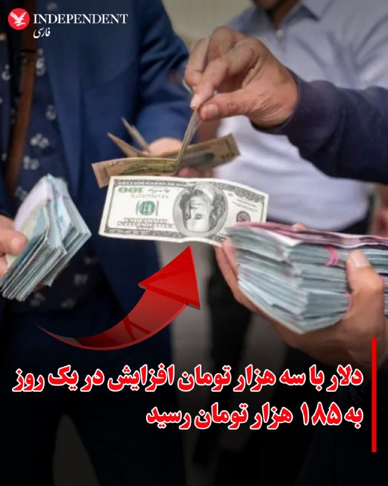

♦️قیمت دلار صبح سه‌شنبه ۲۲ اردیبهشت و در زمان آغاز کار بازار با سه هزار تومان افزایش نسبت به روز قبل به ۱۸۵ هزار تومان رسید.
روند صعودی افزایش بهای ارزهای خارجی در بازارهای ایران در حالی ادامه دارد که با ادامه محاصره دریایی بنادر جنوب، تشدید تحریم‌ها و احتمال وقوع دوباره جنگ، نگرانی از کمبود دلار دوچندان شده است.

روز سه‌شنبه قیمت یورو به ۲۱۸ هزار تومان رسید و هر پوند بریتانیا در برابر ۲۵۱ هزار و ۸۰۰ تومان فروخته شد.

احتمال افزایش قیمت ارز تا پایان روز بسیار بالا است.
‌🇸🇦 Indypersian

🤖 @VahidOOnLine

## VahidOOnLine — post 239644

  <a href="telegram/content/VahidOOnLine_239644_1778573331.mp4" target="_blank">🎬 Download video</a>

وزارت خارجه استرالیا اعلام کرد این کشور تحریم‌های مالی هدفمند و ممنوعیت سفر تازه‌ای را علیه هفت فرد و چهار نهاد وابسته به جمهوری اسلامی اعمال کرده است.

پنی وانگ، وزیر خارجه استرالیا، گفت این تحریم‌ها در واکنش به «سرکوب خشونت‌بار مردم ایران»، قطع اینترنت، فشار بر زنان و دختران و اقدامات بی‌ثبات‌کننده جمهوری اسلامی در منطقه اعمال می‌شود.

بر اساس اعلام دفتر تحریم‌های استرالیا، افراد تحریم‌شده شامل اسکندر مومنی، مجید فیض جعفری، روح‌الله مومن‌نسب، قربان‌محمد ولی‌زاده، محسن ابراهیمی، ناصر زرین‌قلم و منصور زرین‌قلم هستند. نیروی انتظامی جمهوری اسلامی، سراج سایبرسپیس، صرافی برلیان و صرافی جی‌سی‌ام نیز در فهرست نهادهای تحریم‌شده قرار گرفته‌اند.
‌🏁 🇬🇧 ManotoTV

🤖 @VahidOOnLine

## VahidOOnLine — post 239643

  <a href="telegram/content/VahidOOnLine_239643_1778573331.mp4" target="_blank">🎬 Download video</a>

تصویری از نفتکش ایرانی «سی‌استار سه» منتشر شده که آتش‌سوزی در بخش دودکش آن را پس از هدف قرار گرفتن در دریای عمان نشان می‌دهد.

تانکر ترکرز گزارش داد این نفتکش متعلق به شرکت ملی نفتکش ایران، نزدیک جاسک هدف قرار گرفته است. به گفته این وب‌سایت تخصصی ردیابی نفتکش‌ها، «سی‌استار سه» از نفتکش‌های بسیار بزرگ حمل نفت خام است، نام اولیه آن «سنندج» بوده و پس از تحریم‌ها چند بار تغییر نام داده است.

در این گزارش آمده است خدمه نفتکش آسیبی ندیده‌اند.

پیشتر سنتکام، فرماندهی مرکزی ارتش آمریکا، اعلام کرده بود یک جنگنده نیروی دریایی آمریکا از ناو هواپیمابر «جورج اچ دبلیو بوش» ۱۸ اردیبهشت دودکش این نفتکش را هدف قرار داده است. سنتکام گفته بود این اقدام برای جلوگیری از ورود این نفتکش به یکی از بنادر ایران انجام شد.
‌🏁 🇬🇧 ManotoTV

🤖 @VahidOOnLine

## VahidOOnLine — post 239642

  <a href="telegram/content/VahidOOnLine_239642_1778573332.mp4" target="_blank">🎬 Download video</a>

پلیس منطقه یورک در کانادا اعلام کرد مهران محققی، ۳۹ ساله و ساکن ریچموند هیل، در ارتباط با حادثه‌ای در جریان یک تجمع درباره ایران در این شهر بازداشت و متهم شده است.

بر اساس بیانیه پلیس، این حادثه روز یکشنبه ۲۱ اردیبهشت در حوالی تقاطع خیابان یانگ و میجر مکنزی رخ داد. پلیس می‌گوید مظنون با خودرو به شکلی خطرناک در نزدیکی تجمع حرکت کرده، با یک راننده تحویل غذا که در تجمع حضور نداشت برخورد کرده و هنگام فرار نیز با خودرویی دیگر تصادف کرده است.

به گفته پلیس، محققی به حمله با سلاح، رانندگی خطرناک، تهدید و توقف نکردن پس از تصادف متهم شده است. تحقیقات در این پرونده ادامه دارد و پلیس از شاهدان و دارندگان تصاویر دوربین خودرو، تلفن همراه یا دوربین‌های امنیتی خواسته است اطلاعات خود را در اختیار بازرسان بگذارند.
‌🏁 🇬🇧 ManotoTV

🤖 @VahidOOnLine

## VahidOOnLine — post 239641

  

جانشین پایگاه دریابانی بندرعباس از شناسایی و انهدام یک خط لوله انتقال سوخت قاچاق به طول شش کیلومتر خبر داد. به گزارش فارس، وابسته به سپاه، قاچاقچیان این خطوط لوله را زیر ماسه‌ها و آب دریا جاسازی کرده بودند و از آن طریق، سوخت را از ساحل به دریا و شناورهای متخلف انتقال می‌دادند.
‌🏁 🇬🇧 IranintlTV

🤖 @VahidOOnLine

## mwarmonitor — post 8945

🇺🇸جمهوری‌خواهان نبرد بر سر «تالار رقص» را به همه‌پرسی درباره امنیت ترامپ تبدیل می‌کنند

📝نویسندگان: هانس نیکولز، کیت سانتالیز AXIOS

🔰رهبران جمهوری‌خواه سنا قصد دارند نبرد سیاسی بر سر درخواست ۱ میلیارد دلاری برای ارتقای امنیتی مربوط به تالار رقص (Ballroom) جدید کاخ سفید را به یک همه‌پرسی درباره امنیت پرزیدنت ترامپ تبدیل کنند.

چرا این موضوع اهمیت دارد؟
دموکرات‌ها معتقدند رقم ۱ میلیارد دلار، یک شعار تبلیغاتی ساده و موثر علیه جمهوری‌خواهان در اختیار آن‌ها می‌گذارد تا رای‌دهندگانی را که نگران هزینه‌های زندگی هستند، با خود همراه کنند.
اما جان تون، رهبر اکثریت سنا (جمهوری‌خواه از داکوتای جنوبی)، اعلام کرد که این بودجه با هدف ایمن‌سازی تاسیسات جدید و اطمینان از داشتن منابع لازم توسط سرویس مخفی برای حفاظت از رئیس‌جمهور در نظر گرفته شده است.
جان تون در گفتگو با خبرنگاران: «این یک اقدام امنیتی است. ما با رئیس‌جمهوری روبه‌رو هستیم که تنها در دو سال گذشته، سه بار مورد سوءقصد قرار گرفته است.»
تحلیل پشت‌صحنه
طبق گزارش آکسیوس، مایک جانسون، رئیس مجلس نمایندگان، در سخنرانی روز سه‌شنبه خود در ناهار کاری جمهوری‌خواهان سنا، تلاش خواهد کرد تا اصطکاک‌های فزاینده با همتایان خود در سنا را برطرف کند.
انتظار می‌رود جانسون بر لزوم باز بودن مسیرهای ارتباطی تأکید کند، چرا که جمهوری‌خواهان خود را برای بسته‌های بودجه‌ای «آشتی‌ ملی» (Reconciliation) نسخه ۲.۰ و ۳.۰ آماده می‌کنند.
شان کوران، مدیر سرویس مخفی ایالات متحده نیز در این جلسه حضور خواهد داشت تا درباره بودجه امنیت ریاست‌جمهوری و نیاز به ارتقای تجهیزات امنیتی در تالار رقص جدید گفتگو کند.
نگاه نزدیک‌تر
اظهارات «جان تون» به همان اندازه که خطاب به دموکرات‌هاست، به نظر می‌رسد خطاب به مخالفان داخلی حزب جمهوری‌خواه نیز باشد:
تام تیلیس (سناتور کارولینای شمالی): «مشتاق هستم که جزئیات را در این هفته ببینم.»
سوزان کالینز (رئیس کمیته تخصیص بودجه سنا): «برداشت من این بود که قرار است هزینه این کار از طریق کمک‌های خصوصی تأمین شود؛ این چیزی است که رئیس‌جمهور گفته بود.»
رند پال (سناتور کنتاکی): «حس می‌کنم این موضوع یا در لایحه نخواهد بود و یا از 'آزمون برد' (Byrd test) سربلند بیرون نمی‌آید. احتمالاً هفته آینده بیشتر خواهیم دانست.» (او ترجیح می‌دهد از کمک‌های خصوصی استفاده شود).

🔸چاک شومر، رهبر اقلیت سنا (دموکرات از نیویورک)، در انتقادی تند گفت:
«آن‌ها به "جمهوری‌خواهانِ تالار رقص" تبدیل شده‌اند.»

@mwarmonitor

## mwarmonitor — post 8944

  

🎙داشا برنز رئیس دفتر کاخ سفید در نشریه پولیتیکو (Politico): به ما در «اجلاس امنیتی POLITICO Live» بپیوندید، جایی که من با ولیعهد تبعیدی ایران، رضا پهلوی، درباره وضعیت جنگ و آینده جنبش مخالفان ایران گفت‌وگو خواهم کرد.

🔹می‌توانید به‌صورت حضوری در واشنگتن دی‌سی (DC) شرکت کنید یا پخش زنده را آنلاین تماشا کنید:
https://www.politico.com/politicosecuritysummit

@mwarmonitor

## mwarmonitor — post 8943

  

📍 ۴ نفتکش/تانکر صبح امروز از تنگه هرمز عبور کردند:

🚢 نفتکش LPG APEX GAS با پرچم امارات (مرتبط با 🇨🇳 چین)
🚢 نفتکش نفت QUAR با پرچم جزایر ویرجین (مرتبط با 🇨🇳 چین)
🚢 نفتکش نفت STARWAY با مالکیت 🇨🇳 چین
🚢 نفتکش نفت AQUILA با پرچم سنگاپور (مرتبط با 🇨🇳 چین)

@mwarmonitor

## mwarmonitor — post 8942

📝 سوالی دارید دایرکت جواب میدم ...

## mwarmonitor — post 8941

  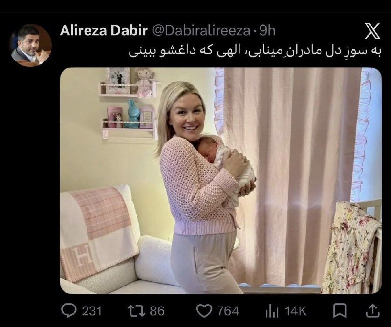

📝 وقتی پستی و رذالت به مغز استخوان برسد، موجودی پدید می‌آید که حتی واژه «حرامزاده» برای توصیف عمق کثافت و بی‌ریشگی‌اش کم می‌آورد. علیرضا دبیر تفاله‌ی متعفن و نطفه‌ی منعقد شده در لجن‌زار ابلیس، با آرزوی مرگ برای یک نوزاد نشان دادی که نه تنها بویی از انسانیت نبرده‌ای، بلکه درنده‌خویی و پستی‌ات از هر جانوری فراتر رفته است. این حد از خباثت و کثافتِ باطنی تنها در ذاتِ بی‌اصل و نسبی چون تو پیدا می‌شود که با نانِ حرام و دست‌بوسیِ ظالمان پروار شده‌ای. تُف بر آن پیشانی پینه‌بسته‌ات که نقابِ ریای توست؛ تو لکه‌ی ننگی بر دامن خلقت و لجنِ خالص در کالبد بشری هستی که بوی گندِ روحِ پوسیده‌ات تمام فضا را مسموم کرده است. موجودی که داغِ یک طفل را آرزو می‌کند، باید در زباله‌دانِ تاریخ زیر خروارها لعنت و حقارت دفن شود، ای پست‌فطرتِ بی‌ریشه که حتی مرگ هم از دربرگرفتن کالبدِ نجسِ تو شرم دارد.

@mwarmonitor

## mwarmonitor — post 8938

⚠️افشاگری به نقل از CBSNews: 🔴منابعی به Jennifer Jacobs و JimLaPorta گفتند که در حالی که پاکستان خود را به‌عنوان کانال دیپلماتیک میان تهران و واشینگتن مطرح می‌کرد، به‌طور پنهانی به هواپیماهای نظامی ایران اجازه داد در خاک این کشور مستقر شوند؛ اقدامی که می‌توانست…

## mwarmonitor — post 8937

  <a href="telegram/content/mwarmonitor_8937_1778573335.mp4" target="_blank">🎬 Download video</a>

📌موقعیت احتمالی یک پایگاه نظامی محرمانه اسرائیل در صحرای عراق در مختصات 31.66697°N, 42.44864°E که دارای یک باند خاکی حدود ۱.۷ کیلومتری است. 🔸این محل که تنها ۷۰ کیلومتر با مرز عربستان فاصله دارد، به نظر می‌رسد چند روز پیش از آغاز جنگ با ایران ساخته شده باشد.…

## mwarmonitor — post 8936

🔴رئیس‌جمهور ترامپ از افشای اطلاعات در رسانه‌ها درباره جنگ با ایران به دادستان کل موقت شکایت کرد؛ موضوعی که باعث شد وزارت دادگستری تحقیقات را آغاز کند. WSJ

@mwarmomitor

## pm_afshaa — post 90609

🔴وزارت خزانه داری آمریکا تا الان 12 فرد و نهاد را به دلیل کمک به ارسال نفت از ایران به چین تحریم کرد

💧 Rainbet.com the #1 Non-KYC Crypto Casino & Sportsbook @rainbetcom

😁 @Pm_Afshaa

## pm_afshaa — post 90608

🔴2 مقام ارشد آمریکایی به فاکس نیوز:
ترامپ به از سرگیری جنگ با ایران متمایل شده

💧 Rainbet.com the #1 Non-KYC Crypto Casino & Sportsbook @rainbetcom

😁 @Pm_Afshaa

## pm_afshaa — post 90607

🔴شاهزاده رضا پهلوی: جمهوری‌اسلامی امروز از همیشه ضعیف‌تره و مردم ایران آماده‌ن تا سرنگونش کنن، اتخاذ سیاستی درست در این لحظه میتونه قرن آینده رو تغییر بده

💧 Rainbet.com the #1 Non-KYC Crypto Casino & Sportsbook @rainbetcom

😁 @Pm_Afshaa

## pm_afshaa — post 90606

🔴سی‌بی‌اس نیوز:پاکستان علیرغم نقش میانجی، به هواپیماهای نظامی ایران اجازه داد در فرودگاه‌هایش پارک کنند و به طور بالقوه از آنها در برابر حملات هوایی ایالات متحده محافظت کند

💧 Rainbet.com the #1 Non-KYC Crypto Casino & Sportsbook @rainbetcom

😁 @Pm_Afshaa

## pm_afshaa — post 90605

🔴کانال 14 اسرائیل:کارخانه های خودرو سازی ایران از اهداف بعدی اسرائیل هستن

💧 Rainbet.com the #1 Non-KYC Crypto Casino & Sportsbook @rainbetcom

😁 @Pm_Afshaa

## pm_afshaa — post 90604

🔴سی ان ان:ترامپ تا قبل از سفرش به چین تصمیمی برای حمله به ایران نمی گیرد و پس از اتمام این سفر، تصمیم حمله را خواهد گرفت

💧 Rainbet.com the #1 Non-KYC Crypto Casino & Sportsbook @rainbetcom

😁 @Pm_Afshaa

## pm_afshaa — post 90603

🔴ترامپ:سیاست‌های دموکرات‌ها دیوانه‌وار است و آن‌ها کشور ما را به ویرانی خواهند کشاند.

ما باید در انتخابات میان‌دوره‌ای عملکرد خوبی داشته باشیم، و اگر نداشته باشیم، آن‌ها هر کاری که بتوانند انجام خواهند داد تا کشور ما را نابود کنن

💧 Rainbet.com the #1 Non-KYC Crypto Casino & Sportsbook @rainbetcom

😁 @Pm_Afshaa

## pm_afshaa — post 90602

  <a href="telegram/content/pm_afshaa_90602_1778573337.mp4" target="_blank">🎬 Download video</a>

ترامپ درباره ایران:نیروهای نظامی ما عالی هستند. ما داریم حسابی ضربه می‌زنیم

💧 Rainbet.com the #1 Non-KYC Crypto Casino & Sportsbook @rainbetcom

😁 @Pm_Afshaa

## iaghapour — post 2600

🔻نمیتونم خبر رو تایید کنم ولی میگن:
— افغانستان اینترنت 5G آورده.
— عراق تلگرام رو رفع فیلتر کرده.
— سوریه هم که ویزا و مستر کارت و...

این که ما درگیر فیلترینگ مسخره هستیم واقعا گریه داره...

## mamlekate — post 103510

📝 بحران تنگه هرمز و بازار باقلوا؛ آیا پسته ایرانی جای خود را به رقبای ترک و سوری می‌دهد؟

برآوردهای اقتصادی نشان می‌دهد که قیمت باقلوا به دلیل افزایش قیمت پسته ایرانی، حدود ۱۰ درصد افزایش یافته است.

@mamlekate

## IranIntlTV — post 336772

🗣روایت شما از بحران اقتصادی و زندگی در آتش‌بس- سه‌شنبه ۲۲ اردیبهشت:

🔹در تاریخ ۲۰ اردیبهشت یک متر لوله پلیکا در ملایر خریدم یک میلیون و ۷۰۰ هزار تومان. قیمت‌ها به شکلی باورنکردنی افزایش یافته‌اند.

🔹من بیماری صرع دارم. پک ۶ تایی دارویم را قبلا در شیراز ۲۵۰ هزار تومن می‌خریدم، یک ماه پیش شد ۷۵۰ هزار تومان، الان قیمتش رسیده به دو میلیون و ۳۰۰ هزار تومان.

🔹چند ماه پیش قیمت آزاد قطره بتامتازون نهایتا ۷۰ هزار تومن بود امروز همان را با قیمت ۱۴۰ هزار تومان خریدم.

🔹قیمت بستنی قیفی در تهران در مقایسه با دوره پیش و پس از جنگ جهش کرده و از ۳۰ تومان به ۸۰ تومان رسیده است.

🔹من کارمند شرکت سایپا هستم حقوق‌ها را قسطی می‌ریزند، حتی به بازنشسته‌ها گفته‌اند سنوات‌تان را مهر ماه واریز می‌کنیم.

🔹پنج عدد تخم مرغ و سه تا دونه گوجه‌فرهنگی و یه پاکت سیگار، جمعا ۳۲۰ هزار تومن شد.

## IranIntlTV — post 336771

  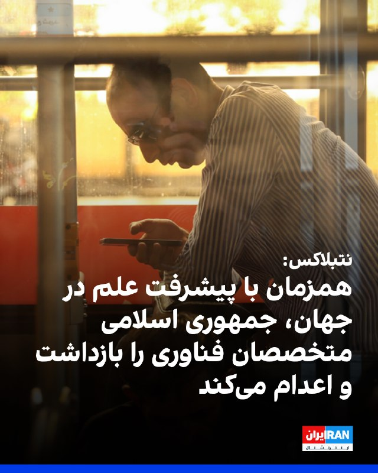

نت‌بلاکس اعلام کرد امروز هفتاد و چهارمین روزی است که ایران تا حد زیادی از اینترنت جهانی قطع شده و این اختلال اکنون وارد هزار و هفتصد و پنجاه و دومین ساعت خود شده است. نت‌بلاکس نوشت از ۹ اسفند جهان شاهد پیشرفت‌هایی در حوزه علم و فناوری بوده، در حالی که همزمان حکومت ایران در حال بازداشت و اعدام متخصصان حوزه فناوری بوده است.
https://iranintl.com/202605129825

## IranIntlTV — post 336770

  <a href="telegram/content/IranIntlTV_336770_1778573339.mp4" target="_blank">🎬 Download video</a>

عائد الهلالی، مشاور نخست‌وزیر عراق، در گفت‌وگو با شبکه الجزیره تایید کرد هدف از عملیاتی که در ماه مارس از سوی نیروهای اسرائیلی در خاک عراق انجام شد، ایجاد پایگاه نظامی نبوده است.

جزییات بیشتر با تروسکه صادقی، خبرنگار ایران‌اینترنشنال
@iranintltv

## IranIntlTV — post 336769

  <a href="telegram/content/IranIntlTV_336769_1778573340.mp4" target="_blank">🎬 Download video</a>

وزیر دفاع آلمان در سفری اعلام‌نشده به اوکراین از برنامه مشترک دو کشور برای توسعه پهپادها و سامانه‌های تسلیحاتی جدید خبر داد.

علی حسن‌پور، خبرنگار ایران‌اینترنشنال، گزارش می‌دهد

@iranintltv

## IranIntlTV — post 336768

  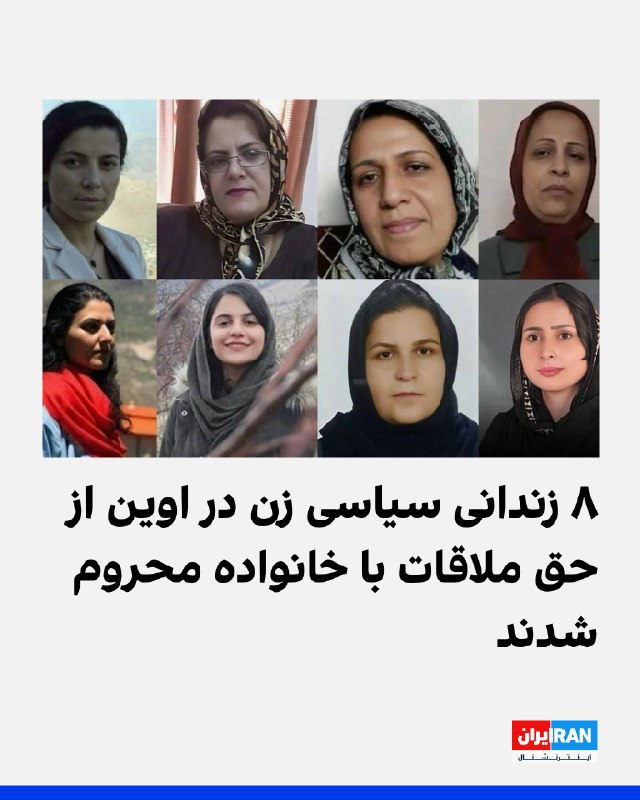

بر اساس اطلاعات رسیده به ایران‌اینترنشنال، شیوا اسماعیلی، گلرخ ایرایی، سکینه پروانه، فروغ تقی‌پور، زهرا صفایی، مرضیه فارسی، الهه فولادی و وریشه مرادی، هشت تن از زندانیان سیاسی زن محبوس در بند زنان زندان اوین، از حق ملاقات با خانواده و وکیلان خود محروم شده‌اند.

اطلاعات رسیده حاکی است این محرومیت‌ها پس از تشدید فضای امنیتی در بند زنان اوین و در پی فشار و برخورد با زندانیانی اعمال شده که در برنامه‌های جمعی، یادبودها و رخدادهای اعتراضی داخل بند، مشارکت داشته‌اند.
https://iranintl.com/202605122250

## IranIntlTV — post 336767

  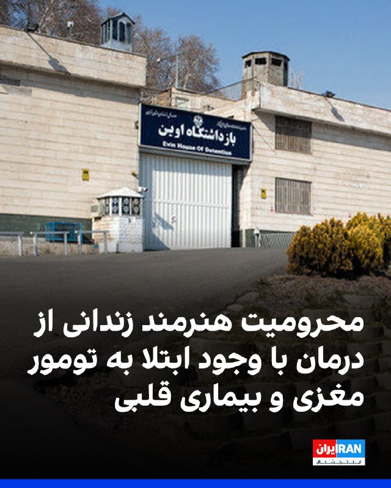

بر اساس اطلاعات رسیده به ایران‌اینترنشنال، محترم پرندین، معروف به محشر، هنرمند و نقاش زندانی در اوین که ماه‌هاست با اتهامات سیاسی در حبس است، با وجود ابتلا به دو تومور در ناحیه پشت سر، نزدیک مخچه و گلو و همچنین بیماری حاد قلبی، از اعزام درمانی و جراحی فوری محروم مانده است.

یک منبع مطلع به ایران‌اینترنشنال گفت پزشک زندان جراحی فوری پرندین را ضروری دانسته و درباره خطر تومور نزدیک مخچه هشدار داده است؛ توموری که باعث اختلال در بینایی، تکلم و حرکات بدنی او شده و به گفته هم‌بندی‌هایش، آثار آن در راه رفتن و صحبت کردنش قابل مشاهده است.

به گفته این منبع آگاه، با وجود تاکید پزشک زندان، مسئولان تاکنون برای اعزام درمانی او همکاری نکرده‌اند و با وجود گذشت بیش از نیمی از ایام حبس و وخامت حال، با آزادی مشروط و مرخصی درمانی‌اش نیز مخالفت کرده‌اند؛ این در حالی است که سند لازم برای مرخصی در اختیار دادستانی قرار دارد.

محترم پرندین مادر یک پسر نوجوان و محصل است و پس از درگذشت همسرش سرپرستی خانواده را بر عهده دارد. فرزند او نیز به بیماری خاص مبتلاست و در نبود مادر با مشکلات جدی روبه‌رو شده است.
https://iranintl.com/2026051226

## IranIntlTV — post 336764

  

ابراهیم رضایی، سخنگوی کمیسیون امنیت ملی مجلس، در شبکه اجتماعی ایکس نوشت یکی از گزینه‌های جمهوری اسلامی در صورت حمله مجدد می‌تواند غنی‌سازی ۹۰ درصد باشد.

او نوشت: «یکی از گزینه‌‌ها در صورت حمله مجدد می‌تواند غنی‌سازی ۹۰ درصد باشد. در مجلس بررسی می‌کنیم.»
https://iranintl.com/202605126303

## IranIntlTV — post 336763

  <a href="telegram/content/IranIntlTV_336763_1778573344.mp4" target="_blank">🎬 Download video</a>

اسرائیل به تصمیم اتحادیه اروپا برای تحریم برخی شهرک‌نشینان اسرائیلی در کرانه باختری واکنش نشان داد و با این اقدام مخالفت کرد.

بابک اسحاقی، خبرنگار ایران‌اینترنشنال، گزارش می‌دهد
@iranintltv

## IranIntlTV — post 336762

  <a href="telegram/content/IranIntlTV_336762_1778573345.mp4" target="_blank">🎬 Download video</a>

نمایشگاهی با هدف «بیدارسازی افکار عمومی» اروپا نسبت به نقض گسترده حقوق بشر و موج اعدام‌ها در ایران، به‌مدت یک ماه در شهرهای برلین، لاهه، آمستردام، بروکسل، پاریس و ژنو برگزار شد.

مهدی تهرانی، خبرنگار ایران‌اینترنشنال، گزارش می‌دهد
@iranintltv

## IranIntlTV — post 336761

  

وزارت خارجه پاکستان گزارش درباره اعزام هواپیماهای نظامی و غیرنظامی جمهوری اسلامی به پاکستان برای در امان ماندن از حملات، را «گمراه‌کننده» توصیف کرد و آن را رد کرد.

این وزارتخانه در بیانیه‌ای اعلام کرد که پس از برقراری آتش‌بس و در جریان مذاکرات، شماری از هواپیماها وارد پاکستان شدند تا جابه‌جایی تیم‌ها را تسهیل کنند و برخی از این هواپیماها و نیروهای پشتیبانی «به‌طور موقت» در این کشور باقی ماندند تا برای دورهای بعدی تعامل آماده باشند.

در این بیانیه آمده است: «هواپیماهای ایرانی که هم‌اکنون در پاکستان مستقر هستند، در دوره آتش‌بس وارد این کشور شدند و هیچ‌گونه ارتباطی با هیچ سناریوی نظامی یا ترتیبات حفاظتی ندارند.»

شبکه خبری سی‌بی‌اس به نقل از «مقام‌های آگاه آمریکایی» گزارش داده بود که جمهوری اسلامی، شماری از هواپیماهای نظامی خود را به پایگاه نورخان پاکستان و همچنین چند هواپیمای غیرنظامی را به افغانستان اعزام کرده است تا از خسارات ناشی از جنگ در امان بمانند.
https://iranintl.com/202605125000

## IranIntlTV — post 336760

🗣روایت شما از بحران اقتصادی و زندگی در آتش‌بس- سه‌شنبه ۲۲ اردیبهشت:

🔹دانه قهوه شده کیلویی ۲ میلیون تومان، قهوه فوری شده کیلویی ۳ میلیون تومان! دیگه نمی‌شه قهوه خورد

🔹لوازم بهداشتی به‌شدت گران شده‌ان. قیمت مام ضد تعریقی که می‌گرفتم ۲۰۰ هزار تومان به ۶۰۰ هزار تومان افزایش یافته.

🔹با ۲۸ میلیون حقوق ماهیانه، زندگی دو نفره رزیدنتی ما به بن‌بست رسیده. پس‌اندازهایمان تمام شده و حتی توان تعمیر وسایل را نداریم.

🔹من فارغ‌التحصیل ارشدم، دو سال با بدبختی پول جور کردم یه لپ‌تاپ خریدم تحقیقات انجام دادم همین که اومدم مقاله رو چاپ کنم نت قطع شد. این وضعیت برای یکی مثل من که هیچ‌وقت دست از تلاش برنمی‌داشتم یعنی خود مرگ.

🔹از میانکوه خوزستان پیام می‌دهم؛ منطقه یک انتقال گاز در سال جدید حقوق ارکان ثالث را پرداخت نکرده که سابقه نداشته، همیشه برج یک دستمزدها پرداخت می‌شد.

🔹جمهوری اسلامی دقیقا به سبک کارتل‌های مواد مخدر عمل می‌کند. یک عده وفادار به خودش را با تطمیع و پول‌پاشی نگه داشته، ملت ایران را ول کرده در فقر و گرونی دست و پا بزنند. الحق که جمهوری اسلامی جمع رذایل همه‌ حکومت‌های تاریخ است.

## IranIntlTV — post 336759

  <a href="https://t.me/IranintlTV/336759" target="_blank">📎 Download file</a>

🎧نسخه صوتی اخبار بامدادی | سه‌شنبه ۲۲ اردیبهشت
@iranintlTV

## IranIntlTV — post 336758

  

خبرگزاری میزان، رسانه قوه قضاییه جمهوری اسلامی، اعلام کرد که حکم اعدام عبدالجلیل شه‌بخش، زندانی بلوچ، بامداد سه‌شنبه ۲۲ اردیبهشت اجرا شده است. میزان اتهام او را «عضویت در گروه انصارالفرقان» و «بغی» عنوان کرده است.

در گزارش منتشرشده از سوی این رسانه، به تاریخ دقیق بازداشت عبدالجلیل شه‌بخش اشاره‌ای نشده است. همچنین پیشتر اطلاعی درباره بازداشت و روند طی شدن مراحل قضایی پرونده او منتشر نشده بود.
https://iranintl.com/202605126293

## IranIntlTV — post 336757

  <a href="telegram/content/IranIntlTV_336757_1778573348.mp4" target="_blank">🎬 Download video</a>

تصویری از یک راهب که هر صبح با گروهی از سگ‌های یک معبد در تایلند برای جمع‌آوری نذورات و غذا در اطراف محله حرکت می‌کند، در روزهای اخیر در شبکه‌های اجتماعی بازتاب گسترده‌ای داشته و میلیون‌ها بار دیده شده است.

گزارش فرزیا ثابتی، خبرنگار ایران‌اینترنشنال
@iranintltv

## IranIntlTV — post 336756

  <a href="telegram/content/IranIntlTV_336756_1778573349.mp4" target="_blank">🎬 Download video</a>

آیلین وانگ، شهردار شهر آرکادیا در ایالت کالیفرنیا، پس از متهم شدن به «همکاری پنهانی با دولت چین»، از سمت خود کناره‌گیری کرد.

گفت‌وگو با رضا گوهرزاد، روزنامه‌نگار و تحلیلگر سیاسی
@iranintltv

## IranIntlTV — post 336755

  <a href="telegram/content/IranIntlTV_336755_1778573351.mp4" target="_blank">🎬 Download video</a>

حمله به یک کشتی کره جنوبی در تنگه هرمز بازتاب گسترده‌ای در رسانه‌ها و محافل بین‌المللی داشته است. در همین ارتباط، سفیر جمهوری اسلامی در سئول هرگونه دخالت ایران در این حادثه را رد کرد.

گفت‌وگو با توماج طاهباز، خبرنگار ایران‌اینترنشنال
@iranintltv

## IranIntlTV — post 336754

  

جانشین پایگاه دریابانی بندرعباس از شناسایی و انهدام یک خط لوله انتقال سوخت قاچاق به طول شش کیلومتر خبر داد. به گزارش فارس، وابسته به سپاه، قاچاقچیان این خطوط لوله را زیر ماسه‌ها و آب دریا جاسازی کرده بودند و از آن طریق، سوخت را از ساحل به دریا و شناورهای متخلف انتقال می‌دادند.
https://iranintl.com/202605125372

## ManotoTV — post 105335

  <a href="telegram/content/ManotoTV_105335_1778573353.mp4" target="_blank">🎬 Download video</a>

گروهی از نیروهای ارتش بریتانیا برای رساندن کمک پزشکی به یک شهروند بریتانیایی مشکوک به ابتلا به هانتاویروس، با چتر روی جزیره دورافتاده تریستان دا کونا در جنوب اقیانوس اطلس فرود آمدند.

بر اساس اعلام وزارت دفاع بریتانیا، این عملیات با حضور شش چترباز و دو پزشک نظامی از تیپ شانزدهم حمله هوایی انجام شد. این نیروها از یک هواپیمای ترابری ایرفورس ای۴۰۰ام به جزیره اعزام شدند و همزمان اکسیژن و تجهیزات پزشکی نیز از هوا رها شد.

وزارت دفاع بریتانیا گفته است این نخستین‌بار است که ارتش این کشور برای یک ماموریت بشردوستانه پزشکی، نیروی درمانی را از راه پرش با چتر اعزام می‌کند. هانتاویروس بیماری نادری است که معمولا از طریق تماس یا تنفس ذرات آلوده به ادرار، مدفوع یا بزاق جوندگان منتقل می‌شود و در موارد شدید می‌تواند خطرناک باشد.

## ManotoTV — post 105334

  <a href="telegram/content/ManotoTV_105334_1778573355.mp4" target="_blank">🎬 Download video</a>

وزارت خارجه پاکستان اعلام کرد اگرچه مذاکرات رسمی هنوز از سر گرفته نشده، تماس‌های دیپلماتیک در سطح بالا همچنان ادامه دارد.

این وزارتخانه در واکنش به گزارش سی‌بی‌اس درباره حضور هواپیماهای جمهوری اسلامی در پایگاه نورخان پاکستان، این گزارش را «گمراه‌کننده و جنجالی» خواند و گفت هواپیماهایی از ایران و آمریکا پس از آتش‌بس و در جریان دور نخست گفت‌وگوهای اسلام‌آباد وارد پاکستان شده بودند تا جابه‌جایی دیپلمات‌ها، تیم‌های امنیتی و کارکنان اداری مرتبط با روند مذاکرات را تسهیل کنند.

وزارت خارجه پاکستان همچنین گفت برخی هواپیماها و نیروهای پشتیبانی به‌طور موقت در پاکستان باقی ماندند تا برای دورهای بعدی تماس‌ها آماده باشند. اسلام‌آباد تاکید کرده است هواپیماهای ایرانی موجود در پاکستان ارتباطی با «اقدام نظامی» یا «حفظ دارایی‌های نظامی» ندارند و پاکستان در این روند نقش میانجی «بی‌طرف و سازنده» داشته است.

## ManotoTV — post 105333

  <a href="telegram/content/ManotoTV_105333_1778573355.mp4" target="_blank">🎬 Download video</a>

وزارت خارجه استرالیا اعلام کرد این کشور تحریم‌های مالی هدفمند و ممنوعیت سفر تازه‌ای را علیه هفت فرد و چهار نهاد وابسته به جمهوری اسلامی اعمال کرده است.

پنی وانگ، وزیر خارجه استرالیا، گفت این تحریم‌ها در واکنش به «سرکوب خشونت‌بار مردم ایران»، قطع اینترنت، فشار بر زنان و دختران و اقدامات بی‌ثبات‌کننده جمهوری اسلامی در منطقه اعمال می‌شود.

بر اساس اعلام دفتر تحریم‌های استرالیا، افراد تحریم‌شده شامل اسکندر مومنی، مجید فیض جعفری، روح‌الله مومن‌نسب، قربان‌محمد ولی‌زاده، محسن ابراهیمی، ناصر زرین‌قلم و منصور زرین‌قلم هستند. نیروی انتظامی جمهوری اسلامی، سراج سایبرسپیس، صرافی برلیان و صرافی جی‌سی‌ام نیز در فهرست نهادهای تحریم‌شده قرار گرفته‌اند.

## ManotoTV — post 105332

  <a href="telegram/content/ManotoTV_105332_1778573356.mp4" target="_blank">🎬 Download video</a>

تصویری از نفتکش ایرانی «سی‌استار سه» منتشر شده که آتش‌سوزی در بخش دودکش آن را پس از هدف قرار گرفتن در دریای عمان نشان می‌دهد.

تانکر ترکرز گزارش داد این نفتکش متعلق به شرکت ملی نفتکش ایران، نزدیک جاسک هدف قرار گرفته است. به گفته این وب‌سایت تخصصی ردیابی نفتکش‌ها، «سی‌استار سه» از نفتکش‌های بسیار بزرگ حمل نفت خام است، نام اولیه آن «سنندج» بوده و پس از تحریم‌ها چند بار تغییر نام داده است.

در این گزارش آمده است خدمه نفتکش آسیبی ندیده‌اند.

پیشتر سنتکام، فرماندهی مرکزی ارتش آمریکا، اعلام کرده بود یک جنگنده نیروی دریایی آمریکا از ناو هواپیمابر «جورج اچ دبلیو بوش» ۱۸ اردیبهشت دودکش این نفتکش را هدف قرار داده است. سنتکام گفته بود این اقدام برای جلوگیری از ورود این نفتکش به یکی از بنادر ایران انجام شد.

## ManotoTV — post 105331

  <a href="telegram/content/ManotoTV_105331_1778573356.mp4" target="_blank">🎬 Download video</a>

پلیس منطقه یورک در کانادا اعلام کرد مهران محققی، ۳۹ ساله و ساکن ریچموند هیل، در ارتباط با حادثه‌ای در جریان یک تجمع درباره ایران در این شهر بازداشت و متهم شده است.

بر اساس بیانیه پلیس، این حادثه روز یکشنبه ۲۱ اردیبهشت در حوالی تقاطع خیابان یانگ و میجر مکنزی رخ داد. پلیس می‌گوید مظنون با خودرو به شکلی خطرناک در نزدیکی تجمع حرکت کرده، با یک راننده تحویل غذا که در تجمع حضور نداشت برخورد کرده و هنگام فرار نیز با خودرویی دیگر تصادف کرده است.

به گفته پلیس، محققی به حمله با سلاح، رانندگی خطرناک، تهدید و توقف نکردن پس از تصادف متهم شده است. تحقیقات در این پرونده ادامه دارد و پلیس از شاهدان و دارندگان تصاویر دوربین خودرو، تلفن همراه یا دوربین‌های امنیتی خواسته است اطلاعات خود را در اختیار بازرسان بگذارند.

## FarsiVOA — post 217507

  

ارتش اسرائیل با صدور هشدار فوری از ساکنان چند شهر و روستای لبنان خواست فوراً محل حضور خود را ترک کنند و دست‌کم هزار متر از مناطق مسکونی به سمت زمین‌های باز فاصله بگیرند.

این هشدار شامل مناطق ارزون، طیر دبا، البازوریه و الحوش اعلام شده است.

در این پیام آمده است که «به‌دلیل نقض توافق آتش‌بس از سوی حزب‌الله تروریستی، ارتش اسرائیل ناچار است با قدرت علیه مواضع و زیرساخت‌های این گروه اقدام کند.»

ارتش اسرائیل تأکید کرده قصد آسیب‌رساندن به غیرنظامیان را ندارد اما «هر فردی که در نزدیکی نیروها، تأسیسات یا تجهیزات جنگی حزب‌الله تروریستی باقی بماند، جان خود را در معرض خطر قرار می‌دهد.»

این هشدار نشان می‌دهد تنش‌ها در جنوب لبنان بار دیگر وارد مرحله‌ای حساس شده و احتمال عملیات گسترده‌تر علیه مواضع حزب‌الله افزایش یافته است.
@FarsiVOA

## FarsiVOA — post 217506

🔺پالایشگاه‌های مستقل چین تولید را کاهش دادند؛ فشار تازه بر مسیر فروش نفت تحریمی تهران

▪️رویترز به نقل از منابع تجاری و پالایشگاهی گزارش داد شماری از پالایشگاه‌های مستقل چین در استان شاندونگ، همزمان با افزایش زیان مالی، تولید سوخت خود را کاهش داده‌اند.

▪️این اقدام می‌تواند تقاضا برای نفت تحریمی ایران و روسیه را در بزرگ‌ترین واردکننده نفت جهان کاهش دهد.

▪️پالایشگاه‌های مستقل چین حدود ۹۰ درصد نفت صادراتی جمهوری اسلامی را خریداری می‌کنند و واردات آنها از نفت ایران در ماه مارس به رکورد حدود یک میلیون و ۸۰۰ هزار بشکه در روز رسیده بود.

⬇️ بیشتر بخوانید:
https://ir.voanews.com/a/8149151.html

## FarsiVOA — post 217505

  

یک اداره اسرائیلی به مردم این کشور توصیه کرد که اگر پیام‌هایی موسوم به «پیام‌های ترس» دریافت کرده‌اند، نسبت به آن واکنشی نشان ندهند.

اداره ملی سایبری اسرائیل سه‌شنبه اعلام کرد که در چند ساعت گذشته، مردم این کشور این نوع پیام‌ها دریافت کرده‌اند که هدف آن‌ها «ایجاد وحشت و تضعیف احساس امنیت» است.

این اداره افزود: «این یک تلاش آشنا برای تأثیرگذاری در فضای دیجیتال است: پیام‌های تهدیدآمیز، دراماتیک یا استرس‌زا که مستقیماً برای شهروندان ارسال می‌شوند و تلاش می‌کنند آن‌ها را وادار کنند بر اساس ترس عمل کنند.»

این نهاد جزئیاتی درباره محتوای پیام‌ها ارائه نداد و مشخص نکرد که چه کسی پشت ارسال آن‌ها قرار دارد.

اداره ملی سایبری اسرائیل توصیه کرد که دریافت‌کنندگان چنین پیام‌هایی روی هیچ لینکی کلیک نکنند، آنها را برای دیگران ارسال نکنند و به آن‌ها پاسخ ندهند.
@FarsiVOA

## FarsiVOA — post 217504

🔺اسلام‌آباد: حضور هواپیماهای ایرانی در پاکستان برای حفاظت از آنها نیست

▪️وزارت خارجه پاکستان اعلام کرد که حضور برخی هواپیماهای ایرانی در پاکستان در چارچوب «وضعیت اضطراری نظامی یا ترتیبات حفاظتی» نیست و صرفاً برای «تسهیل جابه‌جایی» مقامات جمهوری اسلامی در چارچوب مذاکرات است.

▪️پیشتر شبکه خبری سی‌بی‌اس گزارش داده بود که پاکستان به هواپیماهای نظامی جمهوری اسلامی اجازه داده در خاک آن کشور مستقر شوند و این اقدام به‌طور بالقوه آن هواپیماها را از حملات هوایی آمریکا محافظت می‌‌کند.

▪️در واکنش به این خبر، سناتور لیندزی گراهام، گفته بود: «اگر این گزارش درست باشد، باید نقش پاکستان به‌عنوان میانجی میان [جمهوری اسلامی] ایران، ایالات متحده و دیگر طرف‌ها به‌طور کامل بازنگری شود.»

⬇️ بیشتر بخوانید:
https://ir.voanews.com/a/8149150.html

## FarsiVOA — post 217503

🔺استرالیا نیروی انتظامی، وزیر کشور و چند فرد و نهاد دیگر جمهوری اسلامی را تحریم کرد

▪️استرالیا تحریم‌هایی را علیه نیروی انتظامی، وزیر کشور و چندین فرد و نهاد دیگر جمهوری اسلامی وضع و آن‌ها را به دست داشتن در نقض حقوق بشر، برنامه موشکی تهران، حمایت از گروه حماس و دیگر «اقدامات بی‌ثبات‌کننده» متهم کرد.

▪️وزیر کشور، رئیس‌ پلیس امنیت عمومی فراجا، دبیر ستاد امر به معروف و نهی از منکر تهران، فرمانده سپاه سیدالشهدا، فرمانده نیروهای موسوم به «نوپو»، و دو فردی که گفته می‌شود نقش کلیدی در پول‌شویی برای جمهوری اسلامی دارند، در فهرست این تحریم‌ها هستند.

▪️همچنین علاوه بر نیروی انتظامی، سازمان فضای مجازی سراج، صرافی برلیان و صرافی جی‌سی‌ام توسط استرالیا تحریم شده‌اند.

⬇️ بیشتر بخوانید:
https://ir.voanews.com/a/8149148.html

## FarsiVOA — post 217502

  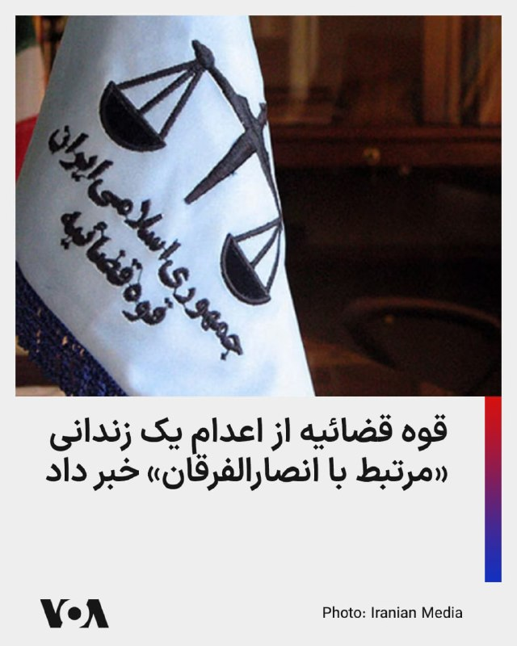

خبرگزاری قوه قضائیه اعلام کرد حکم اعدام عبدالجلیل شه‌بخش، معروف به «شکیب»، بامداد سه‌شنبه ۲۲ اردیبهشت اجرا شده است.

بر اساس این گزارش، مقام‌های قضایی جمهوری اسلامی او را «از اعضای عملیاتی گروه انصارالفرقان» معرفی کرده و گفته‌اند پرونده او با اتهام «بغی»، از طریق حمله مسلحانه به مقرهای انتظامی و عضویت در این گروه، در دادگاه انقلاب بررسی شده بود.

رئیس کل دادگستری سیستان و بلوچستان گفته است مدارک استخراج‌شده از وسایل ارتباطی، فایل‌های صوتی و آنچه «اقاریر» متهم خوانده شده، مبنای صدور حکم قرار گرفته و دیوان عالی کشور نیز حکم را تأیید کرده بود.

جزئیات دادرسی، دسترسی متهم به وکیل مستقل و روند اخذ اعترافات به‌طور مستقل تأیید نشده است.
@FarsiVOA

## FarsiVOA — post 217501

🔺نماینده آمریکا استقرار «گنبد آهنین» در امارات را تأیید کرد

▪️مایک والتز، سفیر آمریکا در سازمان ملل، استقرار سامانه دفاع موشکی «گنبد آهنین» اسرائیل برای رهگیری موشک‌های جمهوری اسلامی در امارات متحده عربی را تأیید کرد.

▪️والتز در جریان سخنرانی خود در مراسم روز استقلال که از سوی هیئت اسرائیل در سازمان ملل در نیویورک برگزار شد، گفت: «ما دیدیم که امارات متحده عربی از گنبد آهنینی که اسرائیل در اختیارش قرار داده بود استفاده کرد.»

▪️پیشتر اکسیوس گزارش کرده بود که در اوایل جنگ اخیر با جمهوری اسلامی، نتانیاهو به ارتش اسرائیل دستور داد که یک واحد سامانه گنبد آهنین همراه با رهگیرها و چند ده نیروی ارتش اسرائیل به امارات ارسال شود.

⬇️ بیشتر بخوانید:
https://ir.voanews.com/a/8149149.html

## FarsiVOA — post 217500

🔺دیده‌بان حقوق بشر: فناوری‌های نظارتی اروپا به کشورهای ناقض حقوق بشر صادر شده است

▪️دیده‌بان حقوق بشر در گزارشی تازه اعلام کرد اتحادیه اروپا، با وجود مقرراتی که برای کنترل صادرات فناوری‌های حساس تصویب کرده، همچنان در جلوگیری از انتقال ابزارهای نظارتی به دولت‌هایی با سابقه نقض حقوق بشر ناکام بوده است.

▪️بر اساس این گزارش، فناوری‌های نظارتی اروپایی به بیش از ۲۴ کشور رسیده‌اند؛ کشورهایی که سابقه مستند در سرکوب مخالفان، روزنامه‌نگاران یا فعالان مدنی دارند.

▪️ایران در گزارش تازه دیده‌بان حقوق بشر به‌عنوان مقصد صادرات ذکر نشده، اما پیش‌تر نام چند شرکت خارجی در ارتباط با فروش یا انتقال فناوری‌های شنود و نظارت به ایران مطرح شده بود.

⬇️ بیشتر بخوانید:
https://ir.voanews.com/a/8149147.html

## FarsiVOA — post 217499

  

وزارت خارجه آمریکا اعلام کرد مارکو روبیو، وزیر خارجه این کشور، در تماس‌هایی جداگانه با پنی وانگ، وزیر خارجه استرالیا، و ایوت کوپر، وزیر خارجه بریتانیا، درباره ایران و تلاش‌ها برای بازگرداندن آزادی کشتیرانی در تنگه هرمز گفت‌وگو کرده است.

به گزارش رویترز، جنگ آمریکا و جمهوری اسلامی عملاً عبور از تنگه هرمز را مختل کرده و بزرگ‌ترین اختلال در بازار انرژی را رقم زده است. پیش از جنگ، حدود ۲۰ درصد محموله‌های جهانی نفت و گاز طبیعی مایع از این تنگه عبور می‌کرد.

تهران تقریباً همه کشتی‌ها به‌جز کشتی‌های خود را از عبور از این مسیر منع کرده و دونالد ترامپ نیز محاصره جداگانه‌ای علیه بنادر ایران اعمال کرده است. ترامپ روز دوشنبه گفت آتش‌بس با ایران که بیش از یک ماه پیش به دست آمد، «در وضعیت بسیار شکننده» قرار دارد.
@FarsiVOA

## DW_Farsi — post 124585

  

🔶 قوه قضائیه از اعدام عبدالجلیل شه‌بخش به اتهام "عضویت در گروه انصارالفرقان" خبر داد

قوه قضائیه جمهوری اسلامی در اطلاعیه‌ای از اعدام یک زندانی دیگر به نام عبدالجلیل شه‌بخش در بامداد روز سه‌شنبه ۲۲ اردیبهشت (۱۲ مه) خبر داد.

در این اطلاعیه ادعا شده او "یکی از عناصر کلیدی گروه انصار الفرقان" بوده است که در جریان اعتراضات سراسری سال ۱۴۰۱ در استان سیستان و بلوچستان "با هدف انتقام‌جویی و ایجاد ناامنی، شناسایی مقرهای انتظامی را در دستور کار" قرار می‌دادند.

در این اطلاعیه اذعان شده است که عبدالجلیل شه‌بخش در مراحل اولیه بازجویی ارتباط با این گروه را تکذیب کرده است.

در ادامه ادعا شده است که او "در یکی از کشورهای همسایه آموزش‌های نظامی و ضد اطلاعاتی" دیده و "مستندات غیرقابل انکاری از حضور او در عملیات‌های مسلحانه" به دست آمده است.

قوه قضائیه مدعی شده است که عبدالجلیل شه‌بخش "حدود ۶ سال پیش" با گروه انصارالفرقان آشنا شده و " از روابط فامیلی و ترددهای عادی خود در مناطق کورین و تفتان به عنوان پوششی برای شناسایی مسیرها و مقرهای نظامی استفاده می‌کرده است".

@dw_farsi

## DW_Farsi — post 124584

  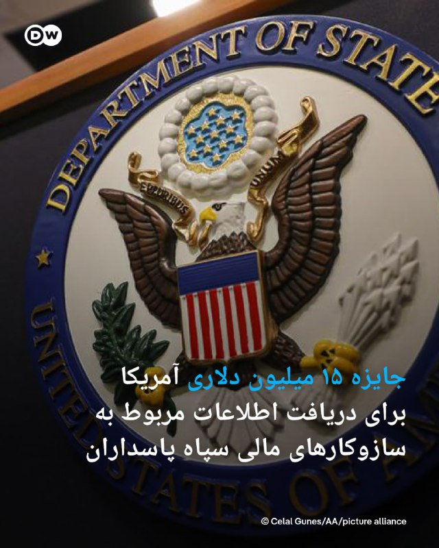

🔶 جایزه ۱۵ میلیون دلاری آمریکا برای دریافت اطلاعات مربوط به ساز‌وکارهای مالی سپاه پاسداران

دولت آمریکا در چارچوب تلاش‌های خود برای افزایش فشار بر تهران و در ادامه کارزار "خشم اقتصادی" علیه تهران، جایزه‌ای تا سقف ۱۵ میلیون دلار برای اطلاعاتی که "به مختل‌ کردن سازوکارهای مالی" سپاه پاسداران انقلاب اسلامی منجر شود، تعیین کرده است.

این جایزه از سوی برنامه "پاداش برای عدالت" وزارت خارجه آمریکا و برای دریافت اطلاعات درباره "منابع درآمد سپاه پاسداران، نیروی قدس سپاه، شاخه‌های وابسته به آن یا سازوکارهای کلیدی تسهیل مالی آن" ارائه می‌شود؛ از جمله شرکت‌های صوری، افرادی که به سپاه در دور زدن تحریم‌ها کمک می‌کنند یا مؤسسات مالی‌ که با این نهاد همکاری دارند.

@dw_farsi

## DW_Farsi — post 124583

  

🔶 سی‌ان‌ان: ترامپ به از سرگیری حملات نظامی علیه ایران جدی‌تر فکر می‌کند

شبکه خبری سی‌ان‌ان گزارش داد دونالد ترامپ، رئیس‌ جمهور آمریکا، به‌طور فزاینده‌ای از نحوه مدیریت مذاکرات توسط مقام‌های ایرانی برای پایان دادن به جنگ دچار نارضایتی شده و برخی از مشاوران ترامپ می‌گویند که او اکنون نسبت به هفته‌های اخیر، "با جدیت بیشتری به ازسرگیری عملیات‌های گسترده نظامی علیه ایران فکر می‌کند".

@dw_farsi

## DW_Farsi — post 124582

  

🔶 آمریکا ۱۲ فرد و نهاد را به دلیل فروش نفت ایران به چین تحریم کرد

دولت آمریکا روز دوشنبه ۱۱ مه (۲۱ اردیبهشت) اعلام کرد که سه فرد و ۹ شرکت از جمله چهار شرکت مستقر در هنگ‌کنگ و چهار شرکت در امارات متحده عربی را به دلیل کمک به ارسال نفت ایران به چین تحریم کرده است. شرکت نهم نیز در عمان مستقر است.

وزارت خزانه‌داری آمریکا در بیانیه‌ای گفت که این تحریم‌های جدید که توسط دفتر کنترل دارایی‌های خارجی (OFAC) اعمال شده، افراد و نهادهایی را هدف قرار می‌دهد که به سپاه پاسداران انقلاب اسلامی ایران کمک کرده‌اند تا سهم خود از نفت ایران را از طریق مجموعه‌ای از شرکت‌های پوششی به چین بفروشد و ارسال کند.

اسکات بسنت، وزیر خزانه‌داری، تأکید کرد که دولت ترامپ به استفاده از تحریم‌ها برای محروم کردن حکومت و ارتش ایران از منابع مالی لازم برای تأمین تسلیحات، برنامه هسته‌ای یا حمایت از نیروهای نیابتی در منطقه ادامه خواهد داد.

@dw_farsi

## DW_Farsi — post 124581

  

🔶 وال استریت ژورنال: امارات مخفیانه حملات نظامی علیه ایران انجام داده است

روزنامه وال استریت ژورنال به نقل از منابع مطلع گزارش داد که امارات متحده عربی به طور مخفیانه "حملات نظامی" جمهوری اسلامی انجام داده است. این روزنامه آمریکایی روز دوشنبه (۱۱ مه) ۲۱ اردیبهشت در گزارشی نوشت که حملات امارات پالایشگاهی واقع در جزیره لاوان را هدف قرار داده و "تقریباً هم‌زمان" با اعلام آتش‌بس جنگ از سوی دونالد ترامپ، رئیس ‌جمهور آمریکا، رخ داده است.

در این گزارش به نقل از یک منبع ناشناس ذکر شده است که آمریکا به طور محرمانه از حملات امارات و همچنین از هر کشور عربی حاشیه خلیج فارس که بخواهد به این جنگ با ایران بپیوندد، استقبال کرده است.

جمهوری اسلامی پس از آغاز جنگ چندین کشور عربی حاشیه خلیج فارس را هدف حملات موشکی و پهپادی قرار داد و در این میان امارات بیشترین حجم حملات را متحمل شد.

وال استریت ژورنال اشاره دقیقی به تاریخ حمله امارات به ایران نکرده و نوشته است این حمله که تا کنون به صورت علنی از سوی امارات تأیید نشده، اوایل ماه آوریل انجام شد.

@dw_farsi

## DW_Farsi — post 124580

  

🔶 قالیباف: هیچ راه‌حلی جز پذیرفتن طرح ۱۴ ماده‌ای ایران وجود ندارد

محمدباقر قالیباف،‌ رئیس مجلس شورای اسلامی، با انتشار پیامی در شبکه ایکس به زبان انگلیسی در واکنش به ابراز ناخرسندی و انتقاد شدید دونالد ترامپ در مورد پاسخ تهران به پیشنهاد واشنگتن برای پایان جنگ، نوشت: «هیچ راه‌حلی جز پذیرش حقوق مردم ایران، آن‌گونه که در طرح ۱۴ ماده‌ای بیان شده است، وجود ندارد.»

او در این پیام که شامگاه دوشنبه ۲۱ اردیبهشت منتشر شد تأکید کرد: «هر رویکرد دیگری کاملاً بی‌نتیجه خواهد بود؛ چیزی جز شکست‌های پی‌درپی در پی نخواهد داشت.»

قالیباف به آمریکا نسبت به تعلل در پایان جنگ هشدار داد و افزود: «هرچه بیشتر وقت‌کشی کنند، مالیات‌دهندگان آمریکایی هزینه بیشتری برای آن خواهند پرداخت.»

@dw_farsi

## DW_Farsi — post 124579

  

🔶 جام ۱۹۳۸؛ سیلویو پیولا، مهاجم زهردار لاجوردی‌پوشان ایتالیا

تیم ملی ایتالیا در مسابقات جام جهانی ۱۹۳۸ فرانسه مهاجمی جوان را در صف خود داشت که با ۲۷۴ گل، بهترین گلزن تاریخ لیگ فوتبال این کشور محسوب می‌شود: سیلویو پیولا که او را از مبتکران ضربه‌برگردان نیز می‌دانند.

سیلویو پیولا اگر چه در مسابقات جام جهانی ۱۹۳۸ فرانسه عنوان بهترین گلزن را به لئونیداس، ملی‌پوش برزیل واگذار کرد، اما با گل‌های مهم و سرنوشت‌ساز خود دومین عنوان قهرمانی جهان را برای لاجوردی‌های ایتالیا به ارمغان آورد.

خطرآفرینی و قابلیت‌های گلزنی پیولا سبب شده بود که ایتالیایی‌ها او را "سیلویو گل" بنامند. گل‌های او در مرحله یک‌چهارم نهایی جام جهانی ۳۸ مقابل فرانسه که حذف تیم میزبان را به دنبال داشت نیز باعث شد که نشریات فرانسوی پیولا را "جلادی" بخوانند که موجب نابودی فرانسویان شده بود.

@dw_farsi

## Persian_Trend_Official — post 13960

  <a href="telegram/content/Persian_Trend_Official_13960_1778573363.webm" target="_blank">🎬 Download video</a>

🔴سخنگوی دولت: اینترنت حق شهروندی است، پس از رفع تهدیدات شرایط عادی می‌شود

💢سخنگوی دولت در پاسخ به خبرنگار خبرهای فوری مهم درباره هزینه اینترنت پرو و تناقض آن با شعار رفع فیلتر توسط دولت و اینکه چه نهادی ناظر بر این مبالغ است تا منجر به رانت و فساد نشود، گفت:

🔹 دولت دسترسی عادلانه به اینترنت را حق شهروندی می‌داند و تبعیض را برنمی‌تابد.
مهاجرانی با اشاره به قطعی‌های مکرر اینترنت در سال ۱۴۰۴ و فضای ملتهب منطقه‌ای تأکید کرد:

🔹 اینترنت پرو مصوبه شورای عالی امنیت و با هدف حمایت از کسب‌وکارها بوده و این محدودیت‌ها موقتی خواهد بود.

🔹سخنگوی دولت وعده داد با بازگشت ثبات، وضعیت اینترنت هم عادی‌سازی می‌شود و درباره احتمال فساد در هزینه‌های دریافتی هم گفت نهادهای نظارتی بر همه فرآیندها نظارت دارند و مردم نگران نباشند

🫆:Tony

📌 @persian_trend_official
پرشین ترند | متفاوت‌ترین کانال نظامی

## Persian_Trend_Official — post 13959

  

رویترز، تولید نفت اوپک در ماه آوریل بار دیگر کاهش یافت و به پایین‌ترین سطح خود در بیش از دو دهه گذشته رسید.

بر اساس این نظرسنجی، تولید نفت خام ۱۲ عضو اوپک نسبت به ماه قبل، روزانه ۸۳۰ هزار بشکه کاهش یافته و به ۲۰.۰۴ میلیون بشکه در روز رسیده است. همچنین برآورد تولید ماه مارس نیز، پس از بازنگری در داده‌های عربستان سعودی، ۷۰۰ هزار بشکه در روز کمتر اعلام شد.

کویت بیشترین افت تولید را در میان اعضای اوپک ثبت کرد. عربستان سعودی و عراق نیز کاهش قابل‌توجهی در تولید داشتند. در مقابل، امارات متحده عربی تنها تولیدکننده بزرگ خلیج فارس بود که توانست تولید خود را افزایش دهد؛ اقدامی که با بهره‌گیری از مسیرهای صادراتی خارج از تنگه هرمز امکان‌پذیر شد. داده‌های ردیابی نفتکش‌ها نیز افزایش صادرات امارات در ماه آوریل را تأیید می‌کند.

رویترز گزارش داده است که سطح تولید اوپک در آوریل، پایین‌ترین میزان از سال ۲۰۰۰ تاکنون بوده است؛ البته با در نظر گرفتن تغییرات بعدی در عضویت این سازمان.

علاوه بر امارات، ونزوئلا و لیبی نیز از جمله کشورهایی بودند که در ماه آوریل افزایش تولید را تجربه کردند.

☆Phantom☆

📌 @persian_trend_official
پرشین ترند | متفاوت‌ترین کانال نظامی

## Persian_Trend_Official — post 13958

🔴 ارتش اسرائیل: بیش از ۳۵۰ نیروی حزب‌الله در جنوب لبنان کشته شدند

ارتش اسرائیل اعلام کرد طی هفته‌های اخیر، در جریان عملیات‌های انجام‌شده در جنوب لبنان، بیش از ۳۵۰ نفر از نیروهایی که آن‌ها را «تهدیدی علیه غیرنظامیان و نیروهای اسرائیلی» توصیف کرده، کشته شده‌اند.

بر اساس بیانیه ارتش اسرائیل:

▪️ بیش از ۱۱۰۰ هدف وابسته به حزب‌الله نیز هدف حمله قرار گرفته است

▪️ این اهداف شامل:

▪️ساختمان‌های مورد استفاده نظامی

▪️انبارهای تسلیحات

▪️سکوهای آماده شلیک

▪️زیرساخت‌های وابسته به حزب‌الله

بوده‌اند.

ارتش اسرائیل تأکید کرده عملیات‌ها در چارچوب تفاهمات میان اسرائیل و لبنان و طبق دستور مقامات سیاسی ادامه خواهد داشت.

🫆:Tony

📌 @persian_trend_official
پرشین ترند | متفاوت‌ترین کانال نظامی

## Persian_Trend_Official — post 13957

  <a href="telegram/content/Persian_Trend_Official_13957_1778573364.webm" target="_blank">🎬 Download video</a>

سنتکام؛ در تاریخ ۹ مه یک هواپیمای B-1B لانسر نیروی هوایی ایالات متحده در طول یک مأموریت آموزشی بر فراز خاورمیانه پرواز می‌کند،

☆Phantom☆

📌 @persian_trend_official
پرشین ترند | متفاوت‌ترین کانال نظامی

## Persian_Trend_Official — post 13956

کانال رسمی پرشین ترند pinned a video

## Persian_Trend_Official — post 13955

  <a href="telegram/content/Persian_Trend_Official_13955_1778573365.mp4" target="_blank">🎬 Download video</a>

خب اینم ضد حمله جنگ تبلیغاتی لگویی
جرات داری نت رو وصل کن ببین جطور جواب اراجیفت رو مردم ایران میدن !

📌 @persian_trend_official
پرشین ترند | متفاوت‌ترین کانال نظامی

## RadioFarda — post 157078

  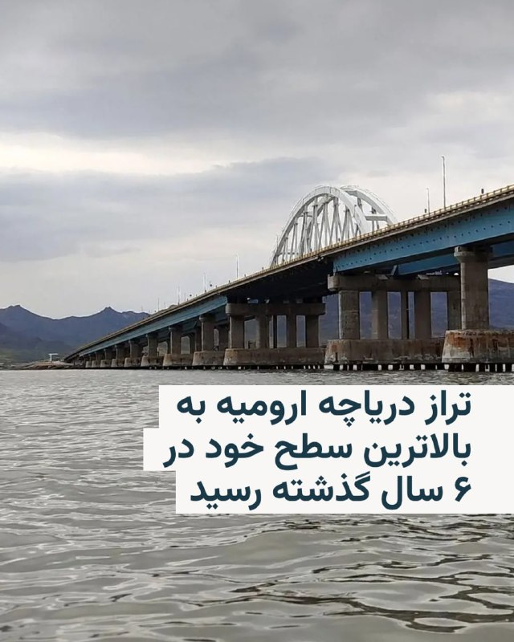

🔸دبیر کارگروه نجات دریاچه ارومیه می‌گوید تراز دریاچه ارومیه به بالاترین سطح خود در ۶ سال گذشته رسیده و موجب احیای حیات دوباره آن و بازگشت پرندگان مهاجر شده است.

🔸رضا رحمانی، استاندار آذربایجان غربی و دبیر کارگروه نجات دریاچه ارومیه روز سه‌شنبه ۲۲ اردیبهشت گفت: در چند ماه گذشته روزانه حدود ۳۰ میلیون متر مکعب آب به حوضچه دریاچه ارومیه واریز شده که باعث شده تراز آن به بالاترین سطح خود از سال ۱۳۹۹ تاکنون برسد

🔸استاندار آذربایجان غربی «میزان مناسب بارندگی، لایروبی رودخانه‌ها، تامین حق آب و آبگیری تالاب‌های اقماری» را از دلایل بهبود وضعیت دریاچه ارومیه عنوان کرد و گفت: «اگر این شرایط تا سال آینده تثبیت نشود، سیکل تبخیر تابستانی دوباره وضعیت دریاچه را بحرانی خواهد کرد.»

🔸رضا رحمانی همچنین بر ادامه اصلاح الگوهای آبخیزداری به ویژه در بخش کشاورزی تاکید کرد و افزود: حفظ تراز فعلی نیازمند مقابله با توسعه بی‌رویه کشاورزی و برداشت‌های غیرمجاز است.

🔸کاهش تراز آبی و خشکی دریاچه ارومیه در سال‌های اخیر سبب نگرانی کارشناسان و فعالان محیط زیست شده و بحران محیط زیستی پیرامون دریاچه ایجاد کرده بود.

@RadioFarda

## RadioFarda — post 157077

«خیرمقدم به بی‌حجاب‌ها»؛ عقب‌نشینی تاکتیکی یا استراتژی جدید جمهوری اسلامی؟

🔸احمد مَروی، تولیت آستان قدس رضوی و از روحانیون محافظه کار در جمهوری اسلامی، خواستار «خیرمقدم» به زنان با پوشش اختیاری در اجتماعات حکومتی شد.

🔸در روزهای گذشته نیز، در برخی تجمعات شبانه حامیان حکومت، از زنان و دخترانِ با ‌حجاب اختیاری به عنوان «ناموس ایران» یاد شد، و شعارهایی در استقبال از حضور آن‌ها در مراسم حکومتی سر داده شد.

🔸آیا استقبال از زنان با پوشش اختیاری در راهپیمایی‌های حکومتی یک چرخش ایدئولوژیک در ساختار جمهوری اسلامی است یا تنها یک تاکتیک موقت سیاسی در شرایط فعلی محسوب می‌شود؟

🔸نسخه کامل این گفت‌وگو را در وب‌سایت رادیوفردا بشنوید.

@RadioFarda

## RadioFarda — post 157076

  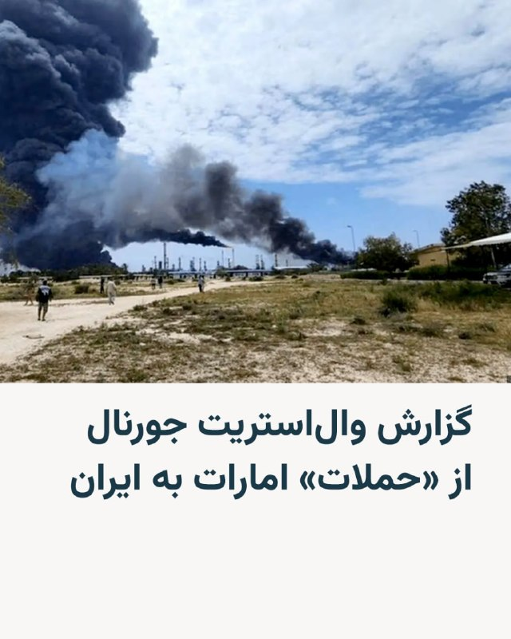

🔸روزنامه وال‌استریت جورنال به نقل از منابع آگاه، از «حملات نظامی» امارات متحده عربی به ایران خبر داد.

🔸بر اساس این گزارش، این حملات که امارات تاکنون به‌صورت علنی آن‌ها را تأیید نکرده، شامل «حمله به یک پالایشگاه در جزیره لاوان» ایران در خلیج فارس بوده است.

🔸آن‌طور که وال‌استریت جورنال نوشته، این حمله در اوایل ماه آوریل انجام شد.

🔸از زمان آغاز حملات مشترک آمریکا و اسرائیل به ایران، امارات متحده عربی، بیش از سایر کشورهای همسایه، مورد حملات پهپادی و موشکی جمهوری اسلامی قرار گرفته است. این کشور حتی در جریان آتش‌بس نیز اعلام کرد که چندبار هدف حملات موشکی و پهپادی قرار گرفته است.

🔸به‌نوشته وال‌استریت جورنال، این اقدام امارات می‌تواند این کشور را به یکی از طرف‌های فعال جنگی تبدیل کند که خود بیش از هر کشور دیگری هدف حملات حکومت ایران بوده است.

@RadioFarda

## RadioFarda — post 157075

  

🔸پاکستان گزارش سی‌بی‌اس مبنی بر اجازه دادن این کشور به ایران برای استقرار هواپیماهای نظامی در فرودگاه نورخان اسلام‌آباد را رد کرد، اما تأیید کرد که پس از دور نخست مذاکرات، شماری هواپیما و نیروهای پشتیبانی در پایگاه هوایی نورخان باقی ماندند.

🔸شبکه سی‌بی‌اس روز دوشنبه ۲۱ اردیبهشت در گزارشی به‌نقل از مقام‌های آمریکایی نوشت پاکستان، «پس از اعلام آتش‌بس میان ایران و آمریکا، به‌طور بی‌سر و صدا به چندین هواپیمای نظامی ایران اجازه داد در پایگاه هوایی نورخان مستقر شوند».

🔸این گزارش همچنین مدعی شد که در میان تجهیزات نظامی منتقل‌شده، «یک فروند هواپیمای RC-130 نیروی هوایی ارتش ایران» نیز وجود داشت.

🔸پاکستان اما روز سه‌شنبه با انتشار بیانیه‌ای، این گزارش را «گمراه‌کننده» خواند و در عین حال اعلام کرد: «هواپیماهای ایرانی که اکنون در پاکستان مستقر هستند، در دورهٔ آتش‌بس وارد این کشور شده‌اند و هیچ ارتباطی با هیچ‌گونه نیروی نظامی یا ترتیبات حفاظتی ندارند.»

@RadioFarda

## RadioFarda — post 157074

  

🔸دستگاه قضایی جمهوری اسلامی ایران از اجرای حکم اعدام یک زندانی دیگر به نام عبدالجلیل شه‌بخش در بامداد سه‌شنبه ۲۲ اردیبهشت خبر داد.

🔸ارگان رسمی قوه قضاییه، ادعا کرد عبدالجلیل شه‌بخش «تروریست آموزش‌دیده» گروه «انصارالفرقان» بوده است.

🔸در این گزارش آمده که در پی بازداشت عبدالجلیل شه‌بخش در جریان اقدامات «ضدتروریستی در شرق کشور، پرونده‌ای علیه وی تشکیل و دادسرا او را با عناوین اتهامی بغی از طریق حمله مسلحانه به مقر‌های انتظامی و عضویت در گروه باغی انصارالفرقان به دادگاه انقلاب معرفی کرد.»

🔸میزان نوشته که صدور حکم اعدام برای او به‌دلیل «وجود مدارک و مستندات متقن استخراج شده از وسایل ارتباطی و فایل‌های صوتی متهم و همچنین اقاریر صریح وی در مراحل مختلف بازجویی و بازپرسی» صورت گرفت. با این حال، در گزارش، مدارک و مستنداتی در این باره ارائه نشده و از جزئیات روند محاکمه نیز اطلاعی در دست نیست.

🔸از زمان حملات آمریکا و اسرائیل به ایران، جمهوری اسلامی اجرای احکام اعدام را افزایش داده است و در برخی روزها چند نفر را اعدام کرده است.

@RadioFarda

## RadioFarda — post 157073

🔸تصاویری از خرس‌های قهوه‌ای در معرض خطر انقراض به همراه توله‌هایشان در کوه‌های سبلان ایران که به تازگی مشاهده شدند، منتشر شده است.

🔸خبرگزاری تسنیم گزارش داد که فعالان محیط زیست و سازمان حفاظت از محیط زیست ایران در مشاهده خرس‌های قهوه‌ای در معرض خطر انقراض، از جمله چندین توله، در منطقه کوهستانی سبلان مشارکت داشته‌اند.

🔸این تصاویر پس از آن ثبت شد که تصور می‌شد نسل خرس قهوه‌ای در برخی مناطق ایران منقرض شده است.

🔸بازگشت این خرس‌ها که در لیست «گونه‌های در خط انقراض» بودند سبب امیدواری برای حفظ تنوع زیستی در کوه‌های شمال غرب ایران شده است.

🔸خرس قهوه‌ای در ایران به‌عنوان گونه‌ای در خطر انقراض شناخته می‌شود.

🔸این گونه به‌ویژه در مناطق کوهستانی البرز، زاگرس و بخش‌هایی از استان‌های شمالی و شمال غرب ایران مانند مازندران، کردستان و لرستان پراکنده است.

@RadioFarda

## RadioFarda — post 157072

  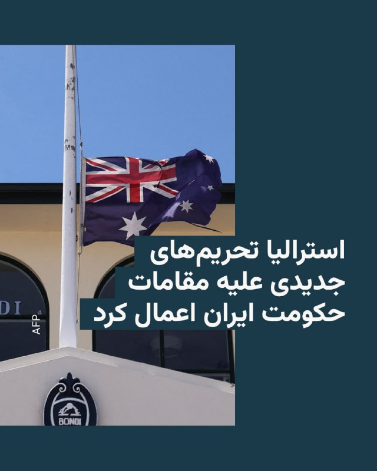

🔸دولت استرالیا اعلام کرد که در واکنش به سرکوب خشن و مداوم مردم ایران و بی‌ثبات‌سازی منطقه توسط حکومت ایران، تحریم‌های مالی هدفمند و ممنوعیت‌های سفر بیشتری را علیه افراد و نهادهای ایرانی اعمال می‌کند.

🔸در بیانیه وزارت خارجه استرالیا آمده که «در ماه ژانویه، حکومت ایران هزاران نفر از شهروندان خود را قتل‌عام کرد و دست به بازداشت گسترده معترضان مسالمت‌آمیز زد؛ بازداشت‌شدگانی که تحت شکنجه قرار گرفتند، مجبور به اعترافات اجباری شدند و از ارتباط با عزیزانشان محروم ماندند.»

🔸این بیانیه همچنین به محدودیت دسترسی مردم ایران به اینترنت اشاره کرده و گفته هدف حکومت ایران از این اعمال محدودیت این بود که «جهان از این جنایات مطلع نشود».

🔸این بیانیه نوشته: «هفت فرد و چهار نهادی که امروز تحریم شده‌اند، شامل مقام‌ها و سازمان‌های ارشدی هستند که در این اقدامات هولناک، از جمله خشونت علیه زنان و کودکان، نقش داشته‌اند.»

🔸از جمله مقام‌هایی که تحت تحریم استرالیا قرار گرفته‌اند، وزیر کشور، رئیس پلیس امنیت عمومی فراجا، دبیر ستاد امر به معروف و نهی از منکر استان تهران و فرمانده سپاه «سیدالشهدا» در استان تهران هستند.

@RadioFarda

## IranianMinds — post 19994

  

🔴 شاهزاده رضا پهلوی قراره امشب حدود ساعت ۲۰ به‌وقت ایران تو اجلاس امنیتی پولیتیکو تو واشنگتن سخنرانی کنه.

+ در این اجلاس مقامات رده‌بالایی همچون معاون وزیر دفاع آمریکا، مقامات ارشد پنتاگون، وزیر سابق امنیت‌داخلی آمریکا، سناتورهای کمیته نیروهای مسلح، کمیته اعتبارات و کمیته امنیت‌داخلی سنا، اعضای ارشد کمیته نیروهای مسلح و کمیته اطلاعات مجلس نمایندگان، مقامات دفاعی آلمان، مدیران ارشد شرکت لاکهید مارتین، و مدیران DARPA (آژانس پروژه‌های تحقیقاتی پیشرفته دفاعی) حضور دارن.

@IranianMinds

## IranianMinds — post 19993

  <a href="telegram/content/IranianMinds_19993_1778573370.mp4" target="_blank">🎬 Download video</a>

🔴یه مشت شیعه وارداتی از اوگاندا در تجمعات شبانه رژیم.

@IranianMinds

## IranianMinds — post 19992

🔴سی‌ان‌ان:

ترامپ تا قبل از سفرش به چین، تصمیمی برای حمله به ایران نمی‌گیرد و پس از اتمام سفر، تصمیم حمله را خواهد گرفت.

@IranianMinds

## IranianMinds — post 19991

  

🔴 شاهزاده رضا پهلوی :

شرایط امروز جمهوری اسلامی نسبت به گذشته ضعیف‌تره و مردم ایران آمادگی تغییر وضعیت رو دارن. یک سیاست درست در این مقطع می‌تونه آینده کشور رو شکل بده!

@IranianMinds

## IranianMinds — post 19990

  <a href="https://t.me/IranianMinds/19990" target="_blank">📎 Download file</a>

📲#اپلیکیشن اندروید سایت جهانی دربی بت

👍اسپانسر لیگ انگلیس
👍
🔥امکان شارژ امن از طریق کارت بانکی
➖➖➖➖➖➖➖➖➖

🪙همین حالا عضو شوید 👇
https://t.me/+aCbq7yy8QY80NzQ0

## IranianMinds — post 19989

  

😤دنبال یه سایت شرط بندی بین المللی بودی که به ایرانیا خدمات بده؟!
⛔

👍دربی بت همون انتخاب  100%

💎ویژگی های سایت جهانی Derby Bet:

⬅️امکان شارژ امن با کارت بانکی

⬅️واریز اول دوبل شارژ می شوید(بونوس۱۰۰٪)

⬅️پر اپشن ترین سایت فعال در ایران

⬅️تسویه حساب کمتر از 5 دقیقه

⬅️برگشت بخشی از باخت به صورت هفتگی

🚨کد هدیه ثبت نام:GG007

⚠️برای دانلود اپلکیشن کلیک کنید
👉
re22

🔔کانال دربی بت :

🪙https://t.me/+aCbq7yy8QY80NzQ0

## IranianMinds — post 19988

  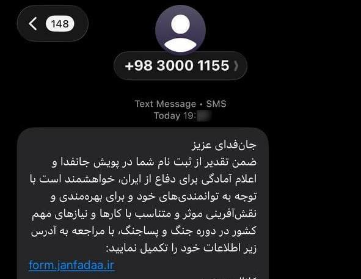

انگار‌ دیگه مستقیم خودشون عضوت میکنن دوروز دیگه اومدن گفتن آمار شد ۹۵ میلیون‌ نفر تعجب نکنید

@IranianMinds

## IranianMinds — post 19987

  <a href="telegram/content/IranianMinds_19987_1778573374.mp4" target="_blank">🎬 Download video</a>

🔴 ترامپ :

من نه قراره خسته بشم نه قراره کوتاه بیام جلو ایران ، تا پیروزی کامل ادامه میدم !

@IranianMinds

## IranianMinds — post 19986

🔴 وزارت خارجه پاکستان:

پاکستان همچنان به حمایت از تمامی تلاش‌های صادقانه برای تقویت گفت‌وگو متعهد است.

@IranianMinds

## BBCPersian — post 280814

🔻شاید باقلوا تنها یک شیرینی سنتی خاورمیانه‌ای به نظر بیاید که در مناسبت‌ها و مهمانی‌ها سرو می‌شود، اما پشت لایه‌های نازک خمیر، شربت و مغز پسته، زنجیره‌ای جهانی و بسیار حساس از تامین کالا قرار دارد.

با افزایش تنش‌های منطقه‌ای و بسته شدن تنگه هرمز، یکی از مهم‌ترین شریان‌های دریایی تجارت جهانی، این شیرینی کوچک هم بازتابی از بحران‌هایی بزرگ‌تر از اندازه خود شده است. این بحران بر قیمت پسته، زعفران و دیگر مواد اولیه صنعت شیرینی‌پزی اثر گذاشته است؛ به ویژه در بازارهای خلیج فارس که وابستگی زیادی به واردات دارند.
ادامه مطلب⬇️
📸GettyImages/ Anadolu via Getty Images/ AFP via Getty Images/ Universal Images Group via Getty Images
https://bbc.in/4wvMvvB
@BBCPersian

## BBCPersian — post 280813

  

🔻۲۷ وزير خارجه اتحاديه اروپا روز دوشنبه با اعمال تحريم‌های جديد عليه شهرک‌نشينان اسرائيلی به دليل افزايش خشونت‌ها عليه فلسطينيان در کرانه باختری اشغالی، موافقت کردند.

بر اساس آمار سازمان ملل متحد، از زمان آغاز جنگ غزه در اکتبر ۲۰۲۳، حملات شهرک‌نشينان افزايش چشمگيری داشته است.

شهرک‌های اسرائيلی — که طبق حقوق بين‌الملل غيرقانونی محسوب می‌شوند — بر روی اراضی اشغالی اسرائيل در کرانه باختری و بيت‌المقدس شرقی ساخته شده‌اند؛ مناطقی که فلسطينيان آنها را برای تشکيل کشور آينده خود مطالبه می‌کنند.

کايا کالاس، مسئول سیاست خارجی اتحادیه اروپا، روز دوشنبه گفت: «زمان آن رسيده که از بن‌بست به مرحله اقدام برسيم... افراط‌گرايی و خشونت بايد پيامد داشته باشد.»

تغيير دولت در مجارستان به ماه‌ها تأخير در اجرای تحريم‌های جديد اتحاديه اروپا پايان داد؛ تحريم‌هايی که پيش‌تر توسط نخست‌وزير راست‌گرای سابق اين کشور، ويکتور اوربان، از متحدان نزديک اسرائيل، متوقف شده بود.

ادامه مطلب⬇️
📸GettyImages
https://bbc.in/42sS8Nm
@BBCPersian

## BBCPersian — post 280812

🔻 قوه قضائیه جمهوری اسلامی ایران از اعدام عبدالجلیل شه‌بخش به جرم عضویت در گروه «انصار الفرقان» خبر داد. میزان، خبرگزاری قوه قضائیه اعلام کرد که او بامداد امروز (سه‌شنبه) اعدام شد. در بیانیه قوه قضائیه آمده است عبدالجلیل شه‌بخش «در جریان اقدامات ضد تروریستی…

## BBCPersian — post 280811

  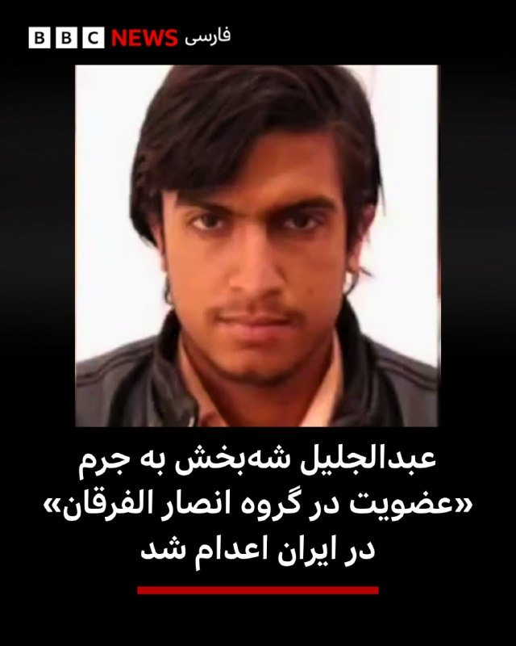

🔻 قوه قضائیه جمهوری اسلامی ایران از اعدام عبدالجلیل شه‌بخش به جرم عضویت در گروه «انصار الفرقان» خبر داد.

میزان، خبرگزاری قوه قضائیه اعلام کرد که او بامداد امروز (سه‌شنبه) اعدام شد.

در بیانیه قوه قضائیه آمده است عبدالجلیل شه‌بخش «در جریان اقدامات ضد تروریستی در شرق کشور» بازداشت شده بود.

انصارالفرقان، یک گروه مسلح سنی است که در سال های گذشته، در مواردی در جنوب شرقی ایران به نیروهای حکومتی حمله کرده است.

جمهوری اسلامی ایران این گروه را «باغی و تروریستی» می‌خواند.

عبدالجلیل شه‌بخش پس از بازداشت متهم به عضویت در این گروه شد و قوه قضائیه همچنین ادعا کرده است که او شش سال قبل برای دریافت آموزش‌های نظامی «به یکی از کشورهای همسایه» رفته بود. قوه قضائیه همچنین ویدیویی از او را به عنوان «اعترافات» منتشر کرده است. مشخص نیست که این ویدیو از او در چه شرایطی گرفته شده است.

📷MIZAN
@BBCPersian

## BBCPersian — post 280810

  

🔸تیم ملی فوتبال مردان ایران که آخرین تمرین‌های خود پیش از شرکت در جام جهانی را پشت سر می‌گذارد با انتشار عکسی دسته جمعی در روز دوشنبه - ۲۱ اردیبهشت - از نام‌گذاری رختکن کمپ تیم ملی به یاد کشته‌شدگان دبستان شجره طیبه میناب پرده برداشتند.

در این عکس که خبرگزاری ایرنا منتشر کرده تابلو «میناب ۱۶۸» در پشت سر بازیکنان حاضر در اردوی تیم ملی فوتبال دیده می‌شود.

تیم ملی فوتبال ایران برای برگزاری یک اردو تدارکاتی به زودی راهی ترکیه خواهد شد.

این تیم سه مسابقه مرحله گروهی خود را باید ماه آینده در لس‌آنجلس و سیاتل آمریکا برگزار کند و انتظار می‌رود در آنجا با حواشی فراونی از جمله اعتراضات ایرانیان مخالف جمهوری اسلامی روبرو شود.

📸IRNA
https://bbc.in/4dCcLg6
@BBCPersian

## Dirty_Kids — post 389296

زندگی اینجوری شده که ۲-۳ ساعت بهت خوش می‌گذره؛
بعد یهو ته دلت خالی می‌شه و یک دلشوره عجیبی میاد سراغت.

@Dirty_Kids 👻۰

## Dirty_Kids — post 389295

  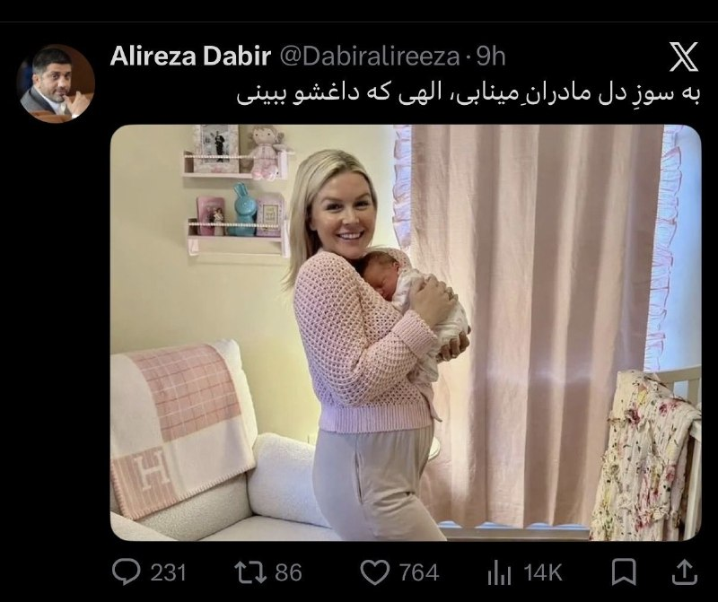

من هیچ جانوری رو ندیده بودم که آرزوی مرگ یک نوزاد رو بکنه!
کس ننه آقای دبیر و همه ۷۸۴ نفری که لایک کردن

@Dirty_Kids 👻

## Hranews — post 112892

عبدالجلیل شه‌بخش اعدام شد

❗️
❗️
❗️
❗️
❗️– رسانه قوه قضاییه از اجرای حکم #اعدام عبدالجلیل شه‌بخش، زندانی با اتهامات امنیتی از جمله «بغی» و عضویت در یک گروه مسلح مخالف نظام، خبر داد. این حکم بامداد امروز سه‌شنبه ۲۲ اردیبهشت‌ماه، پس از تایید در دیوان عالی کشور به اجرا درآمد.

ادامه مطلب

#عبدالجلیل_شه‌بخش

↘️
@hranews_bot تماس ✉️ -  @Hranews  کانال هرانا 🆑

## manototv — post 105335

  <a href="telegram/content/manototv_105335_1778573381.mp4" target="_blank">🎬 Download video</a>

گروهی از نیروهای ارتش بریتانیا برای رساندن کمک پزشکی به یک شهروند بریتانیایی مشکوک به ابتلا به هانتاویروس، با چتر روی جزیره دورافتاده تریستان دا کونا در جنوب اقیانوس اطلس فرود آمدند.

بر اساس اعلام وزارت دفاع بریتانیا، این عملیات با حضور شش چترباز و دو پزشک نظامی از تیپ شانزدهم حمله هوایی انجام شد. این نیروها از یک هواپیمای ترابری ایرفورس ای۴۰۰ام به جزیره اعزام شدند و همزمان اکسیژن و تجهیزات پزشکی نیز از هوا رها شد.

وزارت دفاع بریتانیا گفته است این نخستین‌بار است که ارتش این کشور برای یک ماموریت بشردوستانه پزشکی، نیروی درمانی را از راه پرش با چتر اعزام می‌کند. هانتاویروس بیماری نادری است که معمولا از طریق تماس یا تنفس ذرات آلوده به ادرار، مدفوع یا بزاق جوندگان منتقل می‌شود و در موارد شدید می‌تواند خطرناک باشد.

## manototv — post 105334

  <a href="telegram/content/manototv_105334_1778573382.mp4" target="_blank">🎬 Download video</a>

وزارت خارجه پاکستان اعلام کرد اگرچه مذاکرات رسمی هنوز از سر گرفته نشده، تماس‌های دیپلماتیک در سطح بالا همچنان ادامه دارد.

این وزارتخانه در واکنش به گزارش سی‌بی‌اس درباره حضور هواپیماهای جمهوری اسلامی در پایگاه نورخان پاکستان، این گزارش را «گمراه‌کننده و جنجالی» خواند و گفت هواپیماهایی از ایران و آمریکا پس از آتش‌بس و در جریان دور نخست گفت‌وگوهای اسلام‌آباد وارد پاکستان شده بودند تا جابه‌جایی دیپلمات‌ها، تیم‌های امنیتی و کارکنان اداری مرتبط با روند مذاکرات را تسهیل کنند.

وزارت خارجه پاکستان همچنین گفت برخی هواپیماها و نیروهای پشتیبانی به‌طور موقت در پاکستان باقی ماندند تا برای دورهای بعدی تماس‌ها آماده باشند. اسلام‌آباد تاکید کرده است هواپیماهای ایرانی موجود در پاکستان ارتباطی با «اقدام نظامی» یا «حفظ دارایی‌های نظامی» ندارند و پاکستان در این روند نقش میانجی «بی‌طرف و سازنده» داشته است.

## manototv — post 105333

  <a href="telegram/content/manototv_105333_1778573383.mp4" target="_blank">🎬 Download video</a>

وزارت خارجه استرالیا اعلام کرد این کشور تحریم‌های مالی هدفمند و ممنوعیت سفر تازه‌ای را علیه هفت فرد و چهار نهاد وابسته به جمهوری اسلامی اعمال کرده است.

پنی وانگ، وزیر خارجه استرالیا، گفت این تحریم‌ها در واکنش به «سرکوب خشونت‌بار مردم ایران»، قطع اینترنت، فشار بر زنان و دختران و اقدامات بی‌ثبات‌کننده جمهوری اسلامی در منطقه اعمال می‌شود.

بر اساس اعلام دفتر تحریم‌های استرالیا، افراد تحریم‌شده شامل اسکندر مومنی، مجید فیض جعفری، روح‌الله مومن‌نسب، قربان‌محمد ولی‌زاده، محسن ابراهیمی، ناصر زرین‌قلم و منصور زرین‌قلم هستند. نیروی انتظامی جمهوری اسلامی، سراج سایبرسپیس، صرافی برلیان و صرافی جی‌سی‌ام نیز در فهرست نهادهای تحریم‌شده قرار گرفته‌اند.

## manototv — post 105332

  <a href="telegram/content/manototv_105332_1778573384.mp4" target="_blank">🎬 Download video</a>

تصویری از نفتکش ایرانی «سی‌استار سه» منتشر شده که آتش‌سوزی در بخش دودکش آن را پس از هدف قرار گرفتن در دریای عمان نشان می‌دهد.

تانکر ترکرز گزارش داد این نفتکش متعلق به شرکت ملی نفتکش ایران، نزدیک جاسک هدف قرار گرفته است. به گفته این وب‌سایت تخصصی ردیابی نفتکش‌ها، «سی‌استار سه» از نفتکش‌های بسیار بزرگ حمل نفت خام است، نام اولیه آن «سنندج» بوده و پس از تحریم‌ها چند بار تغییر نام داده است.

در این گزارش آمده است خدمه نفتکش آسیبی ندیده‌اند.

پیشتر سنتکام، فرماندهی مرکزی ارتش آمریکا، اعلام کرده بود یک جنگنده نیروی دریایی آمریکا از ناو هواپیمابر «جورج اچ دبلیو بوش» ۱۸ اردیبهشت دودکش این نفتکش را هدف قرار داده است. سنتکام گفته بود این اقدام برای جلوگیری از ورود این نفتکش به یکی از بنادر ایران انجام شد.

## manototv — post 105331

  <a href="telegram/content/manototv_105331_1778573384.mp4" target="_blank">🎬 Download video</a>

پلیس منطقه یورک در کانادا اعلام کرد مهران محققی، ۳۹ ساله و ساکن ریچموند هیل، در ارتباط با حادثه‌ای در جریان یک تجمع درباره ایران در این شهر بازداشت و متهم شده است.

بر اساس بیانیه پلیس، این حادثه روز یکشنبه ۲۱ اردیبهشت در حوالی تقاطع خیابان یانگ و میجر مکنزی رخ داد. پلیس می‌گوید مظنون با خودرو به شکلی خطرناک در نزدیکی تجمع حرکت کرده، با یک راننده تحویل غذا که در تجمع حضور نداشت برخورد کرده و هنگام فرار نیز با خودرویی دیگر تصادف کرده است.

به گفته پلیس، محققی به حمله با سلاح، رانندگی خطرناک، تهدید و توقف نکردن پس از تصادف متهم شده است. تحقیقات در این پرونده ادامه دارد و پلیس از شاهدان و دارندگان تصاویر دوربین خودرو، تلفن همراه یا دوربین‌های امنیتی خواسته است اطلاعات خود را در اختیار بازرسان بگذارند.

## alonews — post 119442

  <a href="telegram/content/alonews_119442_1778573385.webm" target="_blank">🎬 Download video</a>

👈سفیر آمریکا تو اسرائیل : ما نمی دونیم که اوضاع در مورد ایران به کجا میرسه

✅ @AloNews خبر جنگ

## alonews — post 119441

  <a href="telegram/content/alonews_119441_1778573385.webm" target="_blank">🎬 Download video</a>

👈گزارش شبکه i24 اسرائیل نخستین بار از شروع جنگ نیروهای واحد گولانی ارتش اسرائیل درگیری در آن سوی رودخانه لیطانی با نیروهای حزب الله داشته اند که منجر به زخمی شدن ۸ نیروی تیپ گولانی شده است و به ادعای آنها پس از کشته شدن چندین نیروی حزب الله، مابقی دسته اقدام به عقب نشینی از منطقه مورد نظر(روستای زوطر الشرقیه) کرده اند.

✅ @AloNews خبر جنگ

## alonews — post 119440

  <a href="telegram/content/alonews_119440_1778573385.webm" target="_blank">🎬 Download video</a>

👈العربیه به نقل از سفیر آمریکا در اسرائیل:
نمیدانیم اوضاع با ایران به کجا خواهد کشید.

✅ @AloNews خبر جنگ

## alonews — post 119439

  <a href="telegram/content/alonews_119439_1778573385.webm" target="_blank">🎬 Download video</a>

👈وزارت خارجه پاکستان: اگرچه مذاکرات رسمی هنوز از سر گرفته نشده است، اما تماس‌های دیپلماتیک در سطح بالا ادامه دارد

✅ @AloNews خبر جنگ

## alonews — post 119438

  <a href="telegram/content/alonews_119438_1778573386.webm" target="_blank">🎬 Download video</a>

👈کره جنوبی هم به مذاکرات چندملیتی بازگشایی تنگه هرمز پیوست

🔴سئول قرار است امروز سه شنبه به یک نشست چندملیتی سطح بالای وزرای دفاع برای بحث در مورد امنیت تنگه هرمز بپیوندد.

✅ @AloNews خبر جنگ

## alonews — post 119437

  <a href="telegram/content/alonews_119437_1778573386.mp4" target="_blank">🎬 Download video</a>

👈ترامپ پس از شنیدن صدای یک پرنده در نشست خبری کاخ سفید: اوه! فکر کردم یه پهپاده؛ این روزها پهپادها رو در اندازه‌های مختلف درست می‌کنن و می‌تونن خیلی مخرب باشن، همون‌طور که احتمالا شنیدید

✅ @AloNews خبر جنگ

## alonews — post 119436

  <a href="telegram/content/alonews_119436_1778573387.webm" target="_blank">🎬 Download video</a>

👈معاون نیروی دریایی سپاه: تحرکات را با دقت زیرنظر داریم در یکی از موارد اخیر، یک ناوچه آمریکایی قصد عبور از محدودهٔ تنگهٔ هرمز را داشت که با رصد دقیق نیروهای مسلح مواجه شد و پس از مشاهدهٔ برخی رفتارهای تحریک‌آمیز، نیروی دریایی ارتش با شلیک‌های هشداردهنده و هدفمند، پیام لازم را منتقل کرد و این شناور نیز بلافاصله مسیر خود را تغییر داد.

✅ @AloNews خبر جنگ

## alonews — post 119435

  <a href="telegram/content/alonews_119435_1778573387.webm" target="_blank">🎬 Download video</a>

👈هاکان فیدان وزیر خارجه ترکیه با خلیل الحیه رهبر گروه حماس دیدار کرد

🔴الحیه تحت تعقیب اسرائیل قرار دارد

✅ @AloNews خبر جنگ

## alonews — post 119434

  <a href="telegram/content/alonews_119434_1778573387.webm" target="_blank">🎬 Download video</a>

👈سخنگوی دولت: اینترنت پرو مصوبه‌ شورای‌ عالی امنیت ملی را دارد و اين شرايط موقت است

✅ @AloNews خبر جنگ

## alonews — post 119433

  <a href="telegram/content/alonews_119433_1778573388.mp4" target="_blank">🎬 Download video</a>

👈ترامپ : همه ۱۱۱ موشک ایرانی که به سمت یک ناو آمریکایی شلیک شده بودن، رهگیری و ساقط شدن

🔴 خدمه فقط حدود ۱۳ ثانیه وقت داشتن برای تصمیم‌گیری در هر درگیری

🔴 اگه یه محاسبه اشتباه بکنی، هم کلی نیرو از دست میدی، هم یه عالمه کشتی چند میلیارد دلاری

✅ @AloNews خبر جنگ

## alonews — post 119432

  <a href="telegram/content/alonews_119432_1778573389.webm" target="_blank">🎬 Download video</a>

👈آخرین قیمت نفت ۱۰۶.۳۸ دلار

✅ @AloNews خبر جنگ

## alonews — post 119431

  <a href="telegram/content/alonews_119431_1778573390.webm" target="_blank">🎬 Download video</a>

👈قراردادهای آتی نفت خام برنت بیش از ۲٪ افزایش یافت و به ۱۰۶.۳۸ دلار در هر بشکه رسید، طبق گزارش رویترز

✅ @AloNews خبر جنگ

## alonews — post 119430

  <a href="telegram/content/alonews_119430_1778573390.webm" target="_blank">🎬 Download video</a>

👈شیخ حمد بن جاسم بن جابر آل ثانی، نخست‌وزیر سابق قطر: عملیات نظامی به طور کلی به نفع منطقه نبود. آمریکا به دوستان خود در منطقه آسیب زد.

🔴عملیات نظامی به طور شخصی به نفع نتانیاهو و برنانه‌های او بود

🔴او به صراحت درباره نقشه جدید منطقه، اتحادهای جدید و اسرائیل بزرگ صحبت می‌کند.

🔴آنها از ساختار قدرت در ایران بی‌اطلاعند. این هرم طی ۴۷ سال ساخته شده است، اینطور که آنها فکر می‌کنند فرو نخواهد ریخت

✅ @AloNews خبر جنگ

## alonews — post 119429

  <a href="telegram/content/alonews_119429_1778573390.mp4" target="_blank">🎬 Download video</a>

👈ترامپ از رئیس جمهور بعدی آمریکا گفت: ترکیب ونس-روبیو رویایی است!

🔴«چه کسی جی‌دی ونس را دوست دارد؟ چه کسی مارکو روبیو را؟ بسیار خب. به نظر ترکیب خوبی می‌آید. ضمناً، من معتقدم که این یک تیم رویایی است. فکر می‌کنم به نظر می‌رسد کاندیدای ریاست جمهوری و کاندیدای معاونت ریاست جمهوری باشد.

✅ @AloNews خبر جنگ

## alonews — post 119428

  <a href="telegram/content/alonews_119428_1778573392.webm" target="_blank">🎬 Download video</a>

👈رسایی: از نظر من باید با خانم‌های بی حجاب برخورد فرهنگی و انتظامی بشه

✅ @AloNews خبر جنگ

## alonews — post 119427

  <a href="telegram/content/alonews_119427_1778573392.webm" target="_blank">🎬 Download video</a>

👈سخنگوی ارتش اسرائیل، آویخای آدراعی، هشدار فوری به ساکنان ارزون، طیر دبّه، البازوریه و الحوش در لبنان صادر کرده است تا فوراً خانه‌های خود را تخلیه کرده و حداقل ۱۰۰۰ متر به سمت مناطق باز حرکت کنند، با اشاره به نقض آتش‌بس توسط حزب‌الله و هشدار اینکه هر کسی که در نزدیکی اعضا، تأسیسات یا تجهیزات حزب‌الله باشد در معرض خطر است.

✅ @AloNews خبر جنگ

## alonews — post 119426

  <a href="telegram/content/alonews_119426_1778573392.mp4" target="_blank">🎬 Download video</a>

👈عوستاد خوش چشم سری قبل گفت جنگ نمیشه اما شد، اینسری گفته جنگ میشه ظرف ۱هفته و باید ببینیم دوباره گلشعر گفته یا نه

✅ @AloNews خبر جنگ

## alonews — post 119425

  <a href="telegram/content/alonews_119425_1778573394.mp4" target="_blank">🎬 Download video</a>

👈انفجار پالایشگاه سالیناکروز در مکزیک

🔴براثر انفجار پالایشگاه سالیناکروز در مکزیک، ۶ نفر زخمی و بخشی از این پالایشگاه تخریب شده است.

✅ @AloNews خبر جنگ

## alonews — post 119424

  <a href="telegram/content/alonews_119424_1778573395.webm" target="_blank">🎬 Download video</a>

👈ارتش اسرائیل تصمیم گرفته است کارخانه‌ای برای تولید پهپادهای انفجاری به عنوان بخشی از پاسخ خود به توانمندی‌های پهپادی حزب‌الله تأسیس کند، طبق گزارش یدیعوت آحارونوت

✅ @AloNews خبر جنگ

## alonews — post 119423

  <a href="telegram/content/alonews_119423_1778573395.webm" target="_blank">🎬 Download video</a>

👈سفیر پاکستان در مسکو: مذاکرات ادامه دارد و ما معتقدیم که دیر یا زود به نتیجه خواهیم رسید

🔴بن‌بست زمانی است که شما کاملاً از گفتگو با یکدیگر دست بکشید

🔴 خدا را شکر، آنها هنوز از طریق پاکستان در حال گفتگو هستند و مذاکرات ادامه دارد. این چیزی است که به من امید زیادی می‌دهد

🔴مهم‌ترین مسئله در حال حاضر باز شدن تنگه هرمز است که در ابتدا حتی روی میز هم نبود

✅ @AloNews خبر جنگ

---
📅 بروزرسانی: 1405/02/22 08:38
---

## VahidOOnLine — post 239640

  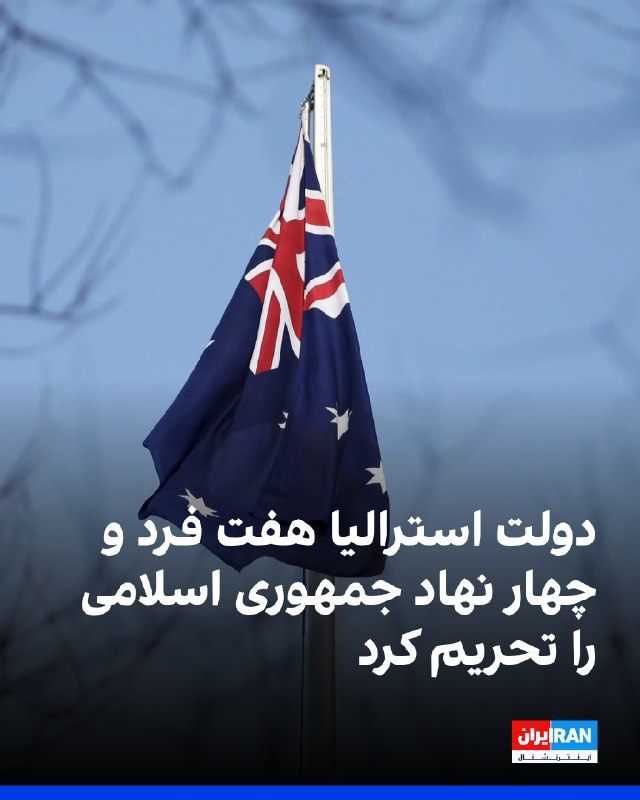

وزارت خارجه استرالیا اعلام کرد این کشور سه‌شنبه ۲۲ اردیبهشت در واکنش به اقدامات جمهوری اسلامی در ادامه سرکوب خشونت‌بار مردم ایران، قطع اینترنت و ایجاد بی‌ثباتی در منطقه، تحریم‌های مالی هدفمند و ممنوعیت‌های سفر بیشتری را علیه هفت فرد و چهار نهاد حکومت ایران اعمال می‌کند.
هفت فرد و چهار نهادی که امروز تحریم شده‌اند، شامل مقام‌ها و نهادهای ارشدی هستند که در این اقدامات، از جمله خشونت علیه زنان و کودکان، نقش داشته‌اند.
یکی از این افراد مسئول هدایت سرکوب زنان و دختران در ایران بوده و با به‌کارگیری ۸۰ هزار نیرو، نظارت و اجرای حجاب اجباری را پیش برده است.
فرد دیگری پایگاه‌های اطلاعاتی محلی ایجاد کرده و با جمع‌آوری اطلاعات خانه‌به‌خانه و گشت‌زنی، مخالفان جمهوری اسلامی را شناسایی و مجازات کرده است.
برخی دیگر نیز مسئول بازداشت ناعادلانه شهروندان خارجی بوده‌اند.
این تحریم‌ها همچنین نظام بانکداری پنهان جمهوری اسلامی را هدف قرار می‌دهد.

‌🏁 🇬🇧 IranintlTV

🤖 @VahidOOnLine

## VahidOOnLine — post 239639

  <a href="telegram/content/VahidOOnLine_239639_1778562525.mp4" target="_blank">🎬 Download video</a>

وزارت خارجه آمریکا از طریق برنامه «پاداش برای عدالت» اعلام کرد برای دریافت اطلاعاتی که به مختل شدن سازوکارهای مالی سپاه و شاخه‌های مختلف آن، از جمله نیروی قدس سپاه، منجر شود، تا سقف ۱۵ میلیون دلار پاداش پرداخت می‌کند.

بر اساس اعلام این برنامه، سپاه بخشی از فعالیت‌های خارجی خود را از طریق فروش نفت تحریم‌شده جمهوری اسلامی و با استفاده از شبکه‌ای از شرکت‌های پوششی تامین مالی می‌کند. وزارت خارجه آمریکا می‌گوید این شبکه‌ها درآمدهای حاصل از فروش نفت را از مسیرهای غیرشفاف و از جمله از طریق نظام بانکی آمریکا جابه‌جا کرده‌اند.

در اطلاعیه برنامه «پاداش برای عدالت» از وانگ شائویون، تبعه چین، و محمود راشد عامر الحبسی، تبعه عمان، نام برده شده است. به گفته مقام‌های آمریکایی، این دو نفر به همراه افراد و شرکت‌های وابسته در چین، عمان و ترکیه، فروش و انتقال نفت تحریم‌شده ایران به پالایشگاه‌ها و شرکت‌های دولتی چین را سازمان‌دهی کرده‌اند تا درآمد آن به نیروی قدس سپاه برسد.
‌🏁 🇬🇧 ManotoTV

🤖 @VahidOOnLine

## VahidOOnLine — post 239638

  <a href="telegram/content/VahidOOnLine_239638_1778562526.mp4" target="_blank">🎬 Download video</a>

سی‌بی‌اس نیوز به نقل از مقام‌های آمریکایی گزارش داد پاکستان، همزمان با ایفای نقش میانجی میان تهران و واشینگتن، به چند هواپیمای نظامی جمهوری اسلامی اجازه داد در پایگاه‌های هوایی این کشور مستقر شوند.

بر اساس این گزارش، این اقدام احتمالا برای دور نگه داشتن بخشی از دارایی‌های هوایی جمهوری اسلامی از حملات آمریکا انجام شده است. مقام‌های آمریکایی گفته‌اند یکی از این هواپیماها یک فروند آرسی-۱۳۰ نیروی هوایی ایران بود که به پایگاه نورخان پاکستان منتقل شد.

یک مقام ارشد پاکستانی این گزارش را رد کرد و گفت پنهان کردن چنین هواپیماهایی در پایگاه نورخان، به دلیل موقعیت آن در قلب شهر، ممکن نیست.
‌🏁 🇬🇧 ManotoTV

🤖 @VahidOOnLine

## VahidOOnLine — post 239637

  <a href="telegram/content/VahidOOnLine_239637_1778562527.mp4" target="_blank">🎬 Download video</a>

رزا پرتو، روزنامه‌نگار «منوتو»، در گردهمایی ایرانیان روبروی دادگاه لاهه در هلند گفت: «جمهوری اسلامی باید در دادگاه لاهه محاکمه شود».
‌🏁 🇬🇧 ManotoTV

🤖 @VahidOOnLine

## VahidOOnLine — post 239636

  

چاک شومر، رهبر اقلیت دموکرات در سنا، در ایکس نوشت دموکرات‌های سنا در هفته جاری هفتمین قطعنامه اختیارات جنگی برای خروج نیروهای آمریکایی از در‌گیری‌‌ها با جمهوری اسلامی را به رای می‌گذارند. تاکنون شش قطعنامه دموکرات‌‌ها در این زمینه شکست خورده است.
شومر جنگ علیه جمهوری اسلامی را «جنگی پرهزینه و بدون هیچ هدف» دانست و افزود: «بهترین راه برای کاهش هزینه‌ها و پایان دادن به این هرج و مرج، پایان دادن به این جنگ غیرقانونی است.»

‌🏁 🇬🇧 IranintlTV

🤖 @VahidOOnLine

## VahidOOnLine — post 239635

  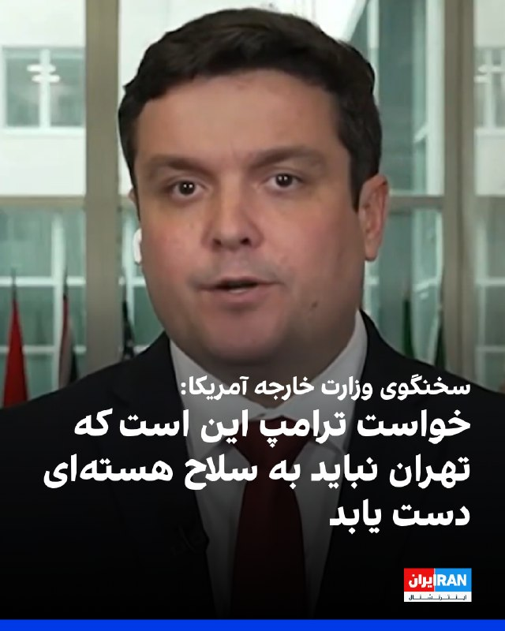

تامی پیگوت، سخنگوی وزارت خارجه آمریکا، درباره خواست ایالات‌متحده از توافق با جمهوری اسلامی به فاکس نیوز گفت: «ترامپ قرار است توافقی خوب برای مردم آمریکا انجام دهد که از ایالات متحده، جهان و نسل‌های آینده محافظت کند.»
او گفت: «هیچ ابهامی درباره آنچه ترامپ می‌خواهد وجود ندارد. آنچه او می‌خواهد این است که حکومت ایران نباید به سلاح هسته‌ای دست یابد.»
پیگوت افزود: «نکته مهم دیگر این است که ما در دوران دولت باراک اوباما شاهد یک توافق بد بودیم که به حکومت ایران نقشه راهی برای دستیابی به سلاح هسته‌ای داد.»

‌🏁 🇬🇧 IranintlTV

🤖 @VahidOOnLine

## VahidOOnLine — post 239634

♦️دونالد ترامپ، رئیس‌جمهوری ایالات متحده، روز دوشنبه در جریان سخنرانی در جمع نیروهای پلیس با لحنی طنزآمیز دست به نظرسنجی از میان جمعیت حاضر زد تا محبوبیت گزینه‌های احتمالی برای پست معاونت ریاست‌جمهوری را بسنجد. او به چهره‌های شاخصی چون جی‌دی ونس و مارکو روبیو اشاره کرد. ترامپ پس از دریافت واکنش‌های مثبت و تشویق‌های بلند برای هر دو نفر، خاطرنشان کرد که ترکیب این دو می‌تواند یک «گروه رویایی» را تشکیل دهد، اما بلافاصله افزود: «البته این‌ها جزئیات است و به این معنا نیست که من در حال حاضر از کسی حمایت رسمی کرده‌ام، اما این ترکیب واقعا عالی به نظر می‌رسد. چیزی شبیه به یک زوج ایده‌آل برای ریاست‌جمهوری و معاونت ریاست‌جمهوری.»
‌🇸🇦 Indypersian

🤖 @VahidOOnLine

## VahidOOnLine — post 239633

  <a href="telegram/content/VahidOOnLine_239633_1778562531.mp4" target="_blank">🎬 Download video</a>

ارتش اسرائیل با انتشار ویدیویی در تلگرام، از انهدام تونل‌های حماس در نوار غزه خبر داد.
به گزارش ارتش اسرائیل، چهار تونل زیرزمینی، به طول مجموع حدود چهار کیلومتر، تخریب شدند. یکی از این تونل‌ها بخشی از مجموعه‌ای بود که به‌عنوان زیرساخت نگهداری گروگان‌ها مورد استفاده قرار می‌گرفت.
‌🏁 🇬🇧 IranintlTV

🤖 @VahidOOnLine

## VahidOOnLine — post 239632

♦️ولادیمیر پوتین، رئیس‌جمهور روسیه، روز دوشنبه  ۲۱ اردیبهشت در مسکو با معلم سابق خود، ورا دیمیتریونا گورویچ، دیدار کرد.
بر اساس اعلام کرملین، پوتین شخصا با خودروی خود به محل اقامت معلمش رفت و او را به کاخ کرملین برد؛ جایی که آن‌ها شام را در کنار یکدیگر صرف کردند. این دیدار در ادامه روابط صمیمانه‌ای صورت گرفت که میان این دو از دهه‌ها پیش برقرار بوده است.
گورویچ که در مدرسه شماره ۱۹۳ لنینگراد (سن‌پترزبورگ کنونی) به پوتین تدریس می‌کرد، به دعوت رئیس‌جمهور روسیه برای حضور در مراسم روز پیروزی و برنامه‌های فرهنگی مرتبط به مسکو سفر کرده است. پوتین پیش‌تر نیز بارها از نقش این معلم در شکل‌گیری مسیر زندگی و تحصیلی خود قدردانی کرده است.
‌🇸🇦 Indypersian

🤖 @VahidOOnLine

## VahidOOnLine — post 239631

  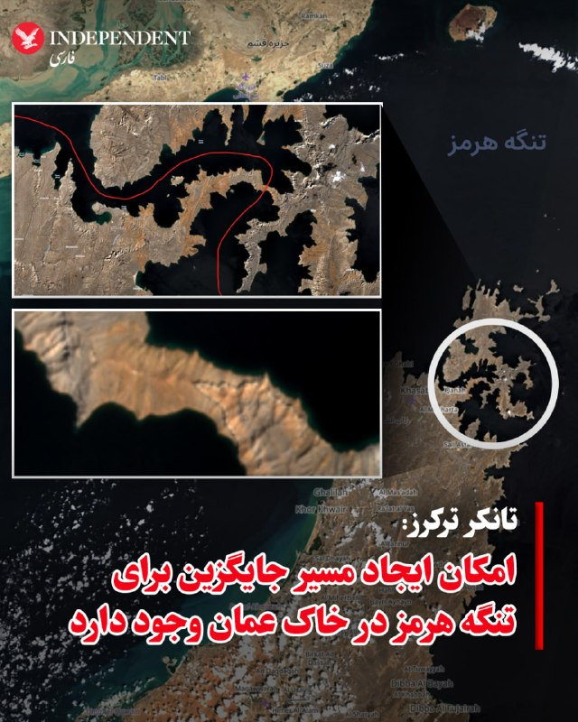

♦️«تانکر ترکرز»، سامانه رصد موقعیت نفتکش‌ها در جهان، با انتشار تصاویری در اکس به بررسی فرضیه ایجاد یک مسیر جایگزین در شبه‌جزیره «مسندم» عمان پرداخته است. این سامانه با اشاره به وجود یک گذرگاه باریک صخره‌ای در منطقه «مقصه» با عرض تنها ۲۲۸ متر، عنوان کرد که از نظر فرضی امکان بازگشایی این مسیر برای عبور شناورهایی با عمق آبخور ۲۵ متر وجود دارد. هرچند تانکر ترکرز تاکید کرده که نباید این فرضیه را چندان جدی گرفت، چرا که بعید است دولت عمان تمایلی به اجرای چنین پروژه‌ای داشته باشد، اما مقایسه ابعاد این پل صخره‌ای با طول ۱۹۳ کیلومتری کانال سوئز، از نگاه فنی توجه تحلیلگران حوزه ترانزیت دریایی را به خود جلب کرده است.
‌🇸🇦 Indypersian

🤖 @VahidOOnLine

## VahidOOnLine — post 239630

  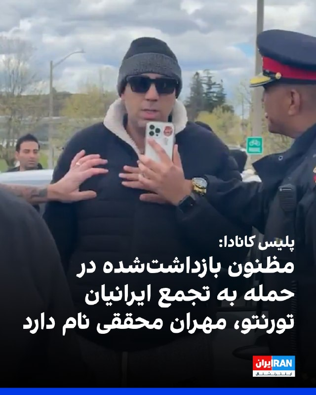

پلیس منطقه یورک تورنتو کانادا اعلام کرد فردی به نام مهران محققی، ۳۹ ساله را در ارتباط با حادثه‌ای در جریان تجمع ایرانیان علیه جمهوری اسلامی بازداشت کرده است. این شخص به رانندگی خطرناک نزدیک تجمع، حمله با سلاح، تهدید تجمع‌کنندگان و فرار پس از تصادف متهم شده است.
طبق گزارش‌های ارائه شده به پلیس، این فرد یک‌شنبه ۲۰ اردیبهشت با رانندگی خطرناک به این تجمع نزدیک شد و پرچم جمهوری اسلامی را تکان می‌داد. او پس از برخورد به راننده یک خودروی تحویل غذا سعی داشت متواری شود، اما پس از برخورد با یک خودروی دیگر متوقف شد.
طبق گزارش پلیس یورک، مظنون سپس خودرو را متوقف کرد تا معترضان را تهدید کند و پس از آن بازداشت شد. یک فرد مصدوم در این حادثه با جراحات جزئی به بیمارستان منتقل شده است.
پلیس کانادا گفت تحقیقات درباره این پرونده همچنان ادامه دارد و جزئیات بیشتر پس از تکمیل بررسی‌ها منتشر خواهد شد.
پلیس از شاهدانی که هنوز با بازرسان گفت‌وگو نکرده‌اند و یا افرادی که فیلم و تصویری از این حمله دارند خواست هرچه سریع‌تر برای ارائه اطلاعات خود به پلیس مراجعه کنند.

‌🏁 🇬🇧 IranintlTV

🤖 @VahidOOnLine

## VahidOOnLine — post 239629

  

♦️پس از انتشار ویدیوهایی در شبکه‌های اجتماعی در پی حمله مردی با پرچم جمهوری اسلامی به تجمع اعتراضی ایرانیان در تورنتو دست‌کم یک نفر زخمی شده و به چند خودرو نیز خسارت وارد شده است.
پلیس منطقه یورک کانادا با انتشار بیانیه‌ای اعلام کرد فردی به نام مهران محققی، ۳۹ ساله و ساکن ریچموند هیل، در ارتباط با این حادثه بازداشت شده است. به گفته پلیس، او با اتهاماتی از جمله حمله با خودرو، تهدید و ترک صحنه تصادف مواجه است.
پلیس تأکید کرده تحقیقات درباره این پرونده همچنان ادامه دارد و اطلاعات تکمیلی پس از پایان بررسی‌ها منتشر خواهد شد.
‌🇸🇦 Indypersian

🤖 @VahidOOnLine

## VahidOOnLine — post 239628

  <a href="telegram/content/VahidOOnLine_239628_1778562534.mp4" target="_blank">🎬 Download video</a>

♦️همزمان با هفتادوسومین روز قطع اینترنت جهانی در ایران، حسین افشین، معاون علمی و فناوری مسعود پزشکیان، در مصاحبه‌ با خبرگزاری جوان با اشاره به اینکه «در شرایط جنگی هم بستن اینترنت نمی‌تواند راهکار باشد» گفت: «دیدیم وقتی اینترنت کاملا بسته بود، ترورها همچنان وجود داشت.»
‌🇸🇦 Indypersian

🤖 @VahidOOnLine

## VahidOOnLine — post 239627

  

♦️به گزارش سی‌ان‌ان، بعید است پیش از سفر دونالد ترامپ به چین، تصمیم نهایی و مهمی درباره نحوه برخورد با ایران اتخاذ شود، اما رئیس‌جمهوری ایالات متحده به‌طور فزاینده‌ای از مدیریت مذاکرات توسط تهران ناامید شده و اکنون با جدیتی بیش از هفته‌های گذشته، موضوع ازسرگیری عملیات‌های گسترده نظامی را بررسی می‌کند. ترامپ که از تداوم انسداد تنگه هرمز و آنچه «شکاف در رهبری جمهوری اسلامی» می‌نامد به ستوه آمده، آخرین پاسخ ایران را «احمقانه» توصیف کرده است؛ موضوعی که باعث شده مقامات واشینگتن در جدیت تهران برای مذاکره تردید کنند. در حالی که پنتاگون بر گزینه‌های تهاجمی‌تر و حملات هدفمند تأکید دارد، برخی دیگر همچنان خواهان ادامه دیپلماسی هستند. هم‌زمان، مقامات آمریکایی نسبت به نقش میانجی‌گری پاکستان مشکوک بوده و معتقدند اسلام‌آباد خشم ترامپ را با شدت کافی به تهران منتقل نمی‌کند و تصویری خوش‌بینانه از مواضع رژیم ارائه می‌دهد. با وجود تلاش‌های فشرده منطقه‌ای برای هشدار به تهران مبنی بر اینکه این «آخرین فرصت برای دیپلماسی» است، به نظر نمی‌رسد جمهوری اسلامی این هشدارها را جدی گرفته باشد و اکنون همه نگاه‌ها به نتایج دیدارهای ترامپ با مقامات چینی در پکن دوخته شده است.
‌🇸🇦 Indypersian

🤖 @VahidOOnLine

## VahidOOnLine — post 239626

  

♦️آمریکا تا ۱۵ میلیون دلار جایزه برای «اطلاعاتی که به مختل شدن سازوکارهای مالی» سپاه پاسداران جمهوری اسلامی منجر شود، تعیین کرده است.
این جایزه از سوی برنامه «پاداش برای عدالت» وزارت خارجه آمریکا ارائه شده است.
برنامه «پاداش برای عدالت» اعلام کرد این جایزه برای اطلاعاتی درباره «منابع درآمد سپاه پاسداران، نیروی قدس سپاه، شاخه‌های وابسته یا سازوکارهای کلیدی تسهیل مالی آن‌ها» در نظر گرفته شده است؛ از جمله شرکت‌های پوششی، افرادی که به سپاه برای دور زدن تحریم‌ها کمک می‌کنند یا موسسات مالی‌ای که با آن‌ها همکاری دارند.
این برنامه همچنین به‌دنبال اطلاعاتی درباره «نحوه انتقال پول و تجهیزات از سوی سپاه به نیروهای نیابتی و گروه‌های شبه‌نظامی وابسته»، «موسسات مالی یا صرافی‌هایی که تراکنش‌های سپاه را تسهیل می‌کنند» یا شرکت‌های تحت مالکیت سپاه است.
دولت ترامپ اوایل روز دوشنبه نیز ۱۲ فرد و نهاد را به‌دلیل نقش ادعایی‌شان در کمک به فروش و انتقال نفت ایران به چین از سوی سپاه پاسداران تحریم کرد.
‌🇸🇦 Indypersian

🤖 @VahidOOnLine

## VahidOOnLine — post 239625

  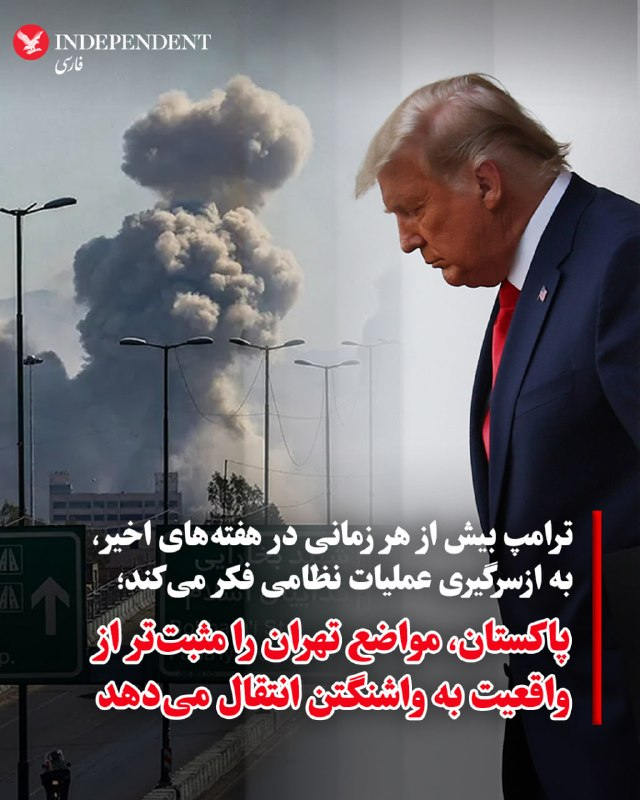

♦️به گزارش سی‌ان‌ان، دونالد ترامپ به‌طور فزاینده‌ای از نحوه مدیریت مذاکرات پایان جنگ از سوی رژیم ایران ناامید شده و برخی مشاوران او می‌گویند اکنون بیش از هفته‌های اخیر، جدی‌تر به ازسرگیری عملیات گسترده نظامی فکر می‌کند.
به گفته منابع آگاه از گفت‌وگوها، ترامپ از ادامه بسته ماندن تنگه هرمز و همچنین آنچه شکاف در رهبری جمهوری اسلامی می‌داند، خسته شده است. ترامپ پیش‌تر بسیاری از گزارش‌های رسانه های جریان اصلی آمریکا به ویژه سی‌ان‌ان را که به نقل از منابع ناشناس ادعاهایی را از آنچه پشت پرده می‌گذرد مطرح می‌کنند، رد کرده است
به گزارش سی‌ان‌ان این منابع ناشناس گفتند آخرین پاسخ ایران، که ترامپ آن را هم «کاملا غیرقابل‌قبول» و هم «احمقانه» توصیف کرده، باعث شده چندین مقام آمریکایی تردید کنند که آیا تهران واقعا آماده اتخاذ موضعی جدی در مذاکرات هست یا نه.
به گفته منابع، در داخل دولت آمریکا دیدگاه‌های متفاوتی درباره مسیر پیش‌رو وجود دارد. برخی، از جمله مقام‌هایی در پنتاگون، خواهان رویکردی تهاجمی‌تر از جمله حملات هدفمند هستند و برخی هم می‌خواهند دیپلماسی ادامه پیدا کند.
به نوشته سی‌ان‌ان، بسیاری از افراد نزدیک به ترامپ می‌خواهند میانجی‌های پاکستان در پیام‌رسانی به ایران بسیار صریح‌تر عمل کنند. برخی مقام‌های دولت آمریکا مدت‌هاست تردید دارند که آیا پاکستان نارضایتی ترامپ از روند مذاکرات را ــ آن‌گونه که او علنا بیان کرده ــ با شدت کافی به تهران منتقل می‌کند یا نه.
دو منبع گفتند برخی مقام‌های دولت آمریکا همچنین معتقدند پاکستان اغلب تصویری مثبت‌تر از مواضع رژیم ایران نسبت به واقعیت، به واشینگتن ارائه می‌دهد.
یک مقام منطقه‌ای روز دوشنبه گفت کشورهای مختلف منطقه و همچنین پاکستان تلاش فشرده‌ای داشته‌اند تا به ایران منتقل کنند که ترامپ خشمگین است و این آخرین فرصت تهران برای ورود جدی به دیپلماسی است، اما به‌نظر نمی‌رسد جمهوری اسلامی به این هشدارها توجهی داشته باشد یا آن‌ها را جدی بگیرد.
این مقام افزود آمریکا و ایران با دو سطح متفاوت از تحمل فشار و دو جدول زمانی متفاوت وارد مذاکرات شده‌اند و تهران دهه‌ها فشار اقتصادی را تحمل کرده است.
ترامپ روز دوشنبه بار دیگر با تیم امنیت ملی خود در کاخ سفید دیدار کرد تا گزینه‌های پیش‌رو را بررسی کند.
منابع آگاه از این گفت‌وگوها می‌گویند بعید است پیش از سفر ترامپ به چین ــ که قرار است بعدازظهر سه‌شنبه انجام شود ــ تصمیم مهمی درباره نحوه ادامه مسیر گرفته شود.
‌🇸🇦 Indypersian

🤖 @VahidOOnLine

## VahidOOnLine — post 239624

  <a href="telegram/content/VahidOOnLine_239624_1778562540.mp4" target="_blank">🎬 Download video</a>

♦️دونالد ترامپ، رئیس‌جمهوری ایالات متحده، روز دوشنبه، ضمن ابراز افتخار از حضور در جمع نیروهای پلیس در واشنگتن، به اولویت‌بندی برنامه‌های خود اشاره کرد و گفت: «امشب بسیار سرم شلوغ بود و وقت شام خوردن نداشتم، اما وقتی شنیدم که قرار است از نیروهای پلیس تجلیل شود، گفتم حتما برای شام خواهم ماند.» او در ادامه با تاکید بر اهمیت این مراسم، با لحنی طنزآمیز خطاب به حاضران گفت: «من امشب مسائل مربوط به ایرانی‌ها را کنار می‌گذارم تا در کنار شما باشم؛ شما افرادی واقعا خاص و شگفت‌انگیز هستید و از حضور در اینجا بسیار سپاسگزارم.»
‌🇸🇦 Indypersian

🤖 @VahidOOnLine

## VahidOOnLine — post 239623

  

♦️علی‌اکبر ولایتی، از مشاوران رهبر جمهوری اسلامی با اشاره به سفر دونالد ترامپ به چین، ادعا کرد که رئیس‌جمهوری آمریکا نمی‌تواند نبود درگیری مستقیم میان آمریکا و ایران در حال حاضر را نشانه پیروزی تلقی کند.
به گزارش تسنیم ولایتی گفت: «آقای ترامپ، هرگز تصور نکنید که با سوءاستفاده از آرامش کنونی ایران، خواهید توانست پیروزمندانه وارد پکن شوید.»
او افزود: «ما شما را در میدان نبرد شکست دادیم؛ بنابراین هرگز فکر نکنید که در عرصه دیپلماسی نیز پیروز خواهید شد.»
ترامپ روز دوشنبه گفت آتش‌بس یک‌ماهه میان آمریکا و ایران «فقط با دستگاه زنده نگه داشته شده است.»
از زمان اجرایی شدن آتش‌بس، هم رژیم ایران و هم آمریکا در تنگه هرمز به‌سوی یکدیگر شلیک کرده‌اند.
‌🇸🇦 Indypersian

🤖 @VahidOOnLine

## mamlekate — post 103509

  <a href="telegram/content/mamlekate_103509_1778562543.mp4" target="_blank">🎬 Download video</a>

رئیس‌جمهور ایالات متحده درباره ایران:

آن‌ها افراد بسیار بی‌اعتباری هستند؛ [منظورم] رهبری‌شان است. آن‌ها مدام نظرشان را عوض می‌کنند. من در تجارت بارها با این موضوع روبه‌رو شده‌ام. شما با این افراد معامله می‌کنید و بعد آن‌ها برایتان یک سند می‌فرستند که باید در ۲۰ دقیقه به دست شما برسد، اما پنج روز طول می‌کشد تا برسد.

آن‌ها هرگز سلاح هسته‌ای نخواهند داشت.

USABehFarsi
@mamlekate

## mamlekate — post 103508

📝 وال‌استریت ژورنال: امارات به‌طور مخفیانه حملاتی علیه جمهوری اسلامی انجام داده است

روزنامه وال‌استریت ژٰورنال دوشنبه ۲۱ اردیبهشت به‌نقل از منابع آگاه خبر داد که امارات متحده عربی به‌طور مخفیانه حملاتی علیه جمهوری اسلامی انجام و در یکی از این حملات در ماه آوریل پالایشگاه نفتی جزیره لاوان ایران را هدف قرار داده است.

@mamlekate

## mamlekate — post 103507

📝 گزارش: دونالد ترامپ با تیم امنیت ملی خود درباره ایران جلسه گذاشت

دونالد ترامپ، رئيس جمهوری آمریکا روز دوشنبه بار دیگر با تیم امنیت ملی خود در کاخ سفید دیدار و گفت‌وگو کرد.

📝 نتانیاهو: جمهوری اسلامی اکنون می‌داند بستن تنگه هرمز چه خطر بزرگی برای خودش دارد

بنیامین نتانیاهو، نخست‌وزیر اسرائیل، در نخستین مصاحبه تلویزیونی با رسانه‌‌های آمریکایی پس از آغاز جنگ، به سی‌بی‌اس نیوز گفت جنگ ایران «دستاوردهای زیادی» داشته، اما به پایان نرسیده است.

📝 سی‌ان‌ان: ترامپ با جدیت بیشتری عملیات گسترده نظامی علیه جمهوری اسلامی را بررسی می‌کند

سی ان ان به نقل از منابع آگاه گزارش داد ترامپ به طور فزاینده ای از نحوه مدیریت مذاکرات از سوی مقام های ایران ابراز نارضایتی می کند و برخی از دستیاران او می گویند که ترامپ اکنون نسبت به هفته های اخیر، با جدیت بیشتری در حال بررسی ازسرگیری عملیات گسترده نظامی است.

@mamlekate

## mamlekate — post 103505

  

📞 شرح زندگی خامنه ای در تورات
[تورات، کتاب اشعیا، باب ۱۴، آیه ۱۸ تا ۲۱]

@mamlekate

## IranIntlTV — post 336753

  <a href="telegram/content/IranIntlTV_336753_1778562546.mp4" target="_blank">🎬 Download video</a>

🔻امانوئل مکرون، رییس‌جمهوری فرانسه، که برای شرکت در نشست «آفریقا فوروارد ۲۰۲۶» به کنیا سفر کرده است، صبح دوشنبه همراه با الیود کیپچوگه، قهرمان ماراتن المپیک‌های ۲۰۱۶ و ۲۰۲۰، دقایقی در خیابان‌های نایروبی، پایتخت کنیا دوید.

🔹الیود کیپچوگه با انتشار تصاویری درباره دویدن رییس‌جمهور فرانسه با او‌ نوشت: «فرصت داشتیم درباره این صحبت کنیم که چگونه می‌توانیم حمایت و فرصت‌های بیشتری برای نسل بعدی ورزشکاران آفریقایی فراهم کنیم.»

🔹او نوشت: «چنین لحظاتی به من یادآوری می‌کند که دویدن فراتر از حرکت است. این یک زبان جهانی است که مردم، فرهنگ‌ها و ایده‌ها را به هم پیوند می‌دهد.»

@iranintltvsport

## IranIntlTV — post 336752

  <a href="telegram/content/IranIntlTV_336752_1778562548.mp4" target="_blank">🎬 Download video</a>

دولت استرالیا از اعمال تحریم‌های جدید علیه مقام‌ها و نهادهای جمهوری اسلامی، از جمله وزیر کشور، فرماندهان امنیتی و نیروی انتظامی، به‌دلیل نقش آن‌ها در سرکوب معترضان و همچنین محدود کردن اینترنت در ایران خبر داد.

علیرضا محبی، خبرنگار ایران‌اینترنشنال،‌گزارش می‌دهد
@iranintltv

## IranIntlTV — post 336751

  <a href="telegram/content/IranIntlTV_336751_1778562550.mp4" target="_blank">🎬 Download video</a>

دونالد ترامپ، رییس‌جمهوری ایالات متحده، دوشنبه در کاخ سفید با تیم امنیت ملی و شماری از فرماندهان نظامی آمریکا درباره ایران گفت‌وگو کرد. بر اساس گزارش‌ها، در این نشست مسیر پیشروی جنگ با جمهوری اسلامی بررسی شد.

گزارش سمیرا قرایی، خبرنگار ایران‌اینترنشنال
@iranintltv

## IranIntlTV — post 336750

  <a href="telegram/content/IranIntlTV_336750_1778562552.mp4" target="_blank">🎬 Download video</a>

وزارت خزانه‌داری آمریکا دوشنبه ۱۲ فرد و نهاد مرتبط با سپاه پاسداران را به‌دلیل نقش آن‌ها در تسهیل فروش و انتقال نفت ایران به چین در فهرست تحریم‌های ایالات متحده قرار داد.

گفت‌وگو با امیر گیتی، عضو تحریریه ایران‌اینترنشنال
@iranintltv

## IranIntlTV — post 336749

  

وزارت خارجه استرالیا اعلام کرد این کشور سه‌شنبه ۲۲ اردیبهشت در واکنش به اقدامات جمهوری اسلامی در ادامه سرکوب خشونت‌بار مردم ایران، قطع اینترنت و ایجاد بی‌ثباتی در منطقه، تحریم‌های مالی هدفمند و ممنوعیت‌های سفر بیشتری را علیه هفت فرد و چهار نهاد حکومت ایران اعمال می‌کند.
هفت فرد و چهار نهادی که امروز تحریم شده‌اند، شامل مقام‌ها و نهادهای ارشدی هستند که در این اقدامات، از جمله خشونت علیه زنان و کودکان، نقش داشته‌اند.
یکی از این افراد مسئول هدایت سرکوب زنان و دختران در ایران بوده و با به‌کارگیری ۸۰ هزار نیرو، نظارت و اجرای حجاب اجباری را پیش برده است.
فرد دیگری پایگاه‌های اطلاعاتی محلی ایجاد کرده و با جمع‌آوری اطلاعات خانه‌به‌خانه و گشت‌زنی، مخالفان جمهوری اسلامی را شناسایی و مجازات کرده است.
برخی دیگر نیز مسئول بازداشت ناعادلانه شهروندان خارجی بوده‌اند.
این تحریم‌ها همچنین نظام بانکداری پنهان جمهوری اسلامی را هدف قرار می‌دهد.

https://iranintl.com/202605128683

## IranIntlTV — post 336748

  <a href="telegram/content/IranIntlTV_336748_1778562555.mp4" target="_blank">🎬 Download video</a>

جاویدنامان انقلاب ملی ایرانیان
«محمد جباری» در شامگاه ۱۸ دی‌ماه در اعتراضات کرج با شلیک مستقیم نیروهای سرکوب کشته شد. نامش در حافظه‌ی این سرزمین می‌ماند و یادش چراغ راه آزادی‌خواهان است.
@iranintltv

## IranIntlTV — post 336747

  <a href="telegram/content/IranIntlTV_336747_1778562558.mp4" target="_blank">🎬 Download video</a>

سرخط خبرهای سه‌شنبه ۲۲ اردیبهشت
@iranintltv

## IranIntlTV — post 336746

  <a href="telegram/content/IranIntlTV_336746_1778562560.mp4" target="_blank">🎬 Download video</a>

شهروندی از انزلی با ارسال پیامی به ایران‌اینترنشنال، درباره وضعیت قطعی برق در این شهر روایت می‌کند که «افتضاح» است و می‌گوید چند ساعت در روز برق را بدون اطلاع قطع می‌کنند و هنوز تابستان شروع نشده، جمهوری اسلامی عذاب دادن مردم را آغاز کرده‌ است.

## IranIntlTV — post 336745

  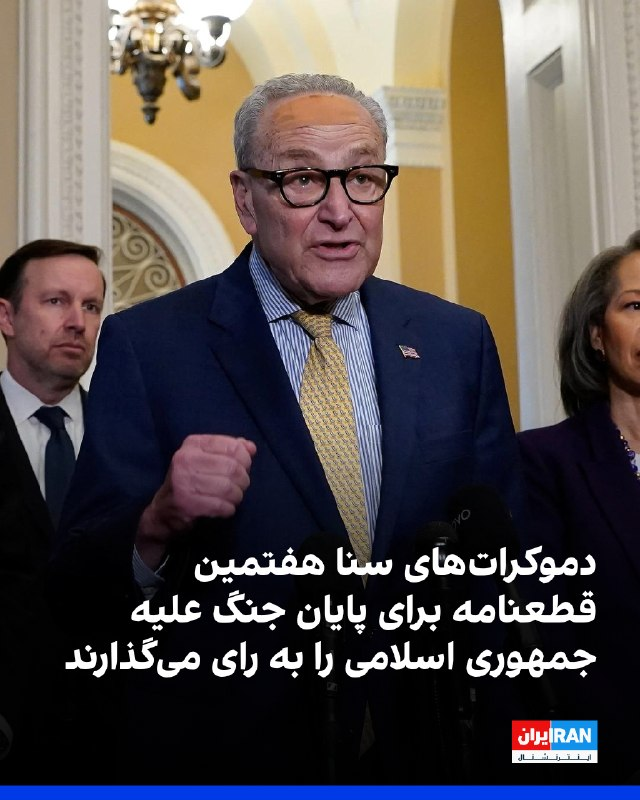

چاک شومر، رهبر اقلیت دموکرات در سنا، در ایکس نوشت دموکرات‌های سنا در هفته جاری هفتمین قطعنامه اختیارات جنگی برای خروج نیروهای آمریکایی از در‌گیری‌‌ها با جمهوری اسلامی را به رای می‌گذارند. تاکنون شش قطعنامه دموکرات‌‌ها در این زمینه شکست خورده است.
شومر جنگ علیه جمهوری اسلامی را «جنگی پرهزینه و بدون هیچ هدف» دانست و افزود: «بهترین راه برای کاهش هزینه‌ها و پایان دادن به این هرج و مرج، پایان دادن به این جنگ غیرقانونی است.»

https://iranintl.com/202605123934

## IranIntlTV — post 336744

  

تامی پیگوت، سخنگوی وزارت خارجه آمریکا، درباره خواست ایالات‌متحده از توافق با جمهوری اسلامی به فاکس نیوز گفت: «ترامپ قرار است توافقی خوب برای مردم آمریکا انجام دهد که از ایالات متحده، جهان و نسل‌های آینده محافظت کند.»
او گفت: «هیچ ابهامی درباره آنچه ترامپ می‌خواهد وجود ندارد. آنچه او می‌خواهد این است که حکومت ایران نباید به سلاح هسته‌ای دست یابد.»
پیگوت افزود: «نکته مهم دیگر این است که ما در دوران دولت باراک اوباما شاهد یک توافق بد بودیم که به حکومت ایران نقشه راهی برای دستیابی به سلاح هسته‌ای داد.»

https://iranintl.com/202605122667

## IranIntlTV — post 336743

  <a href="telegram/content/IranIntlTV_336743_1778562563.mp4" target="_blank">🎬 Download video</a>

ارتش اسرائیل با انتشار ویدیویی در تلگرام، از انهدام تونل‌های حماس در نوار غزه خبر داد.
به گزارش ارتش اسرائیل، چهار تونل زیرزمینی، به طول مجموع حدود چهار کیلومتر، تخریب شدند. یکی از این تونل‌ها بخشی از مجموعه‌ای بود که به‌عنوان زیرساخت نگهداری گروگان‌ها مورد استفاده قرار می‌گرفت.

## IranIntlTV — post 336742

  <a href="telegram/content/IranIntlTV_336742_1778562564.mp4" target="_blank">🎬 Download video</a>

از مداحی بندری تا عروسی با جیپ جنگی؛
ازدواج نظامی برای زوج‌های «جان‌فدا»

سپاه تهران از برگزاری مراسم «پیوند آسمانی زوج‌های جان‌فدا» خبر داده؛ مراسمی که قرار است عروس و دامادها با جیپ‌های جنگی گل‌آرایی‌شده در سطح شهر حرکت کنند.

در شرایطی که جوانان با بحران اقتصادی، بیکاری، مهاجرت و دشواری ازدواج روبه‌رو هستند، نظامی‌کردن حتی مراسم عروسی، نشانه‌ای از گسترش نگاه امنیتی جمهوری اسلامی به تمام ابعاد زندگی مردم است.

کامبیز حسینی در «برنامه» به این موضوع می‌پردازد.

«یک ایران صدای شما را می‌شنود»
دوشنبه تا پنجشنبه ۱۱ شب تهران
از تلویزیون ایران اینترنشنال

تماشای نسخه کامل این قسمت از «برنامه» در یوتیوب:
https://youtu.be/upmpJfvQdS8
@iranintltv

## IranIntlTV — post 336741

  <a href="telegram/content/IranIntlTV_336741_1778562567.mp4" target="_blank">🎬 Download video</a>

رویا از آلمان: مردم نمی‌دانند نان بخرند برای خوردن یا استامینوفن برای دردشان

«یک ایران صدای شما را می‌شنود»
دوشنبه تا پنجشنبه ۱۱ شب تهران
از تلویزیون ایران اینترنشنال

تماشای نسخه کامل این قسمت از «برنامه» در یوتیوب:
https://youtu.be/upmpJfvQdS8
@iranintltv

## IranIntlTV — post 336740

  

پلیس منطقه یورک تورنتو کانادا اعلام کرد فردی به نام مهران محققی، ۳۹ ساله را در ارتباط با حادثه‌ای در جریان تجمع ایرانیان علیه جمهوری اسلامی بازداشت کرده است. این شخص به رانندگی خطرناک نزدیک تجمع، حمله با سلاح، تهدید تجمع‌کنندگان و فرار پس از تصادف متهم شده است.
طبق گزارش‌های ارائه شده به پلیس، این فرد یک‌شنبه ۲۰ اردیبهشت با رانندگی خطرناک به این تجمع نزدیک شد و پرچم جمهوری اسلامی را تکان می‌داد. او پس از برخورد به راننده یک خودروی تحویل غذا سعی داشت متواری شود، اما پس از برخورد با یک خودروی دیگر متوقف شد.
طبق گزارش پلیس یورک، مظنون سپس خودرو را متوقف کرد تا معترضان را تهدید کند و پس از آن بازداشت شد. یک فرد مصدوم در این حادثه با جراحات جزئی به بیمارستان منتقل شده است.
پلیس کانادا گفت تحقیقات درباره این پرونده همچنان ادامه دارد و جزئیات بیشتر پس از تکمیل بررسی‌ها منتشر خواهد شد.
پلیس از شاهدانی که هنوز با بازرسان گفت‌وگو نکرده‌اند و یا افرادی که فیلم و تصویری از این حمله دارند خواست هرچه سریع‌تر برای ارائه اطلاعات خود به پلیس مراجعه کنند.

https://iranintl.com/202605126848

## IranIntlTV — post 336739

  <a href="telegram/content/IranIntlTV_336739_1778562570.mp4" target="_blank">🎬 Download video</a>

افشار از تهران: من پرستارم. فروردین ۱۵ میلیون تومان به من دادند که حتی نصف حقوقم هم نیست

«یک ایران صدای شما را می‌شنود»
دوشنبه تا پنجشنبه ۱۱ شب تهران
از تلویزیون ایران اینترنشنال

تماشای نسخه کامل این قسمت از «برنامه» در یوتیوب:
https://youtu.be/upmpJfvQdS8
@iranintltv

## IranIntlTV — post 336738

  <a href="telegram/content/IranIntlTV_336738_1778562572.mp4" target="_blank">🎬 Download video</a>

مازیار از رشت: قیمت داروهای بیماران ام‌اس و دیابتی‌ها ۵ تا ۶ برابر شده است

«یک ایران صدای شما را می‌شنود»
دوشنبه تا پنجشنبه ۱۱ شب تهران
از تلویزیون ایران اینترنشنال

تماشای نسخه کامل این قسمت از «برنامه» در یوتیوب:
https://youtu.be/upmpJfvQdS8
@iranintltv

## IranIntlTV — post 336737

  <a href="telegram/content/IranIntlTV_336737_1778562574.mp4" target="_blank">🎬 Download video</a>

شهیاد از بجنورد: رفتم برای نوه‌ام دارو بگیرم؛ دیدم قیمت سه برابر شده، همان هم پیدا نمی‌شود

«یک ایران صدای شما را می‌شنود»
دوشنبه تا پنجشنبه ۱۱ شب تهران
از تلویزیون ایران اینترنشنال

تماشای نسخه کامل این قسمت از «برنامه» در یوتیوب:
https://youtu.be/upmpJfvQdS8
@iranintltv

## IranIntlTV — post 336736

  <a href="telegram/content/IranIntlTV_336736_1778562577.mp4" target="_blank">🎬 Download video</a>

رسانه‌های اسرائیلی گزارش دادند پس از رد پاسخ تهران از سوی دونالد ترامپ، بنیامین نتانیاهو جلسه امنیتی فوری برگزار کرده است.

بنابر این گزارش‌ها، نتانیاهو برای حضور در این نشست، جلسه دادگاه خود را ترک کرده است.

گفت‌وگو با بن سبطی، پژوهشگر ایران و اسرائیل
@iranintltv

## IranIntlTV — post 336735

  <a href="telegram/content/IranIntlTV_336735_1778562580.mp4" target="_blank">🎬 Download video</a>

وزارت خزانه‌داری آمریکا ۱۲ فرد و نهاد مرتبط با سپاه پاسداران را به‌دلیل نقش آن‌ها در تسهیل فروش و انتقال نفت ایران به چین تحریم کرد.

گفت‌وگو با فرهاد علوی، حقوقدان و کارشناس تحریم مالی و بانکی
@iranintltv

## IranIntlTV — post 336734

  <a href="telegram/content/IranIntlTV_336734_1778562582.mp4" target="_blank">🎬 Download video</a>

دونالد ترامپ در کاخ سفید با تیم امنیت ملی و شماری از فرماندهان نظامی آمریکا درباره ایران گفت‌وگو کرد.

براساس گزارش‌ها، در این نشست مسیر پیش‌روی جنگ با جمهوری اسلامی مورد بررسی قرار گرفت.

گزارش مرضیه حسینی، خبرنگار ایران‌اینترنشنال
@iranintltv

## ManotoTV — post 105330

  <a href="telegram/content/ManotoTV_105330_1778562584.mp4" target="_blank">🎬 Download video</a>

وزارت خارجه آمریکا از طریق برنامه «پاداش برای عدالت» اعلام کرد برای دریافت اطلاعاتی که به مختل شدن سازوکارهای مالی سپاه و شاخه‌های مختلف آن، از جمله نیروی قدس سپاه، منجر شود، تا سقف ۱۵ میلیون دلار پاداش پرداخت می‌کند.

بر اساس اعلام این برنامه، سپاه بخشی از فعالیت‌های خارجی خود را از طریق فروش نفت تحریم‌شده جمهوری اسلامی و با استفاده از شبکه‌ای از شرکت‌های پوششی تامین مالی می‌کند. وزارت خارجه آمریکا می‌گوید این شبکه‌ها درآمدهای حاصل از فروش نفت را از مسیرهای غیرشفاف و از جمله از طریق نظام بانکی آمریکا جابه‌جا کرده‌اند.

در اطلاعیه برنامه «پاداش برای عدالت» از وانگ شائویون، تبعه چین، و محمود راشد عامر الحبسی، تبعه عمان، نام برده شده است. به گفته مقام‌های آمریکایی، این دو نفر به همراه افراد و شرکت‌های وابسته در چین، عمان و ترکیه، فروش و انتقال نفت تحریم‌شده ایران به پالایشگاه‌ها و شرکت‌های دولتی چین را سازمان‌دهی کرده‌اند تا درآمد آن به نیروی قدس سپاه برسد.

## ManotoTV — post 105329

  <a href="telegram/content/ManotoTV_105329_1778562585.mp4" target="_blank">🎬 Download video</a>

سی‌بی‌اس نیوز به نقل از مقام‌های آمریکایی گزارش داد پاکستان، همزمان با ایفای نقش میانجی میان تهران و واشینگتن، به چند هواپیمای نظامی جمهوری اسلامی اجازه داد در پایگاه‌های هوایی این کشور مستقر شوند.

بر اساس این گزارش، این اقدام احتمالا برای دور نگه داشتن بخشی از دارایی‌های هوایی جمهوری اسلامی از حملات آمریکا انجام شده است. مقام‌های آمریکایی گفته‌اند یکی از این هواپیماها یک فروند آرسی-۱۳۰ نیروی هوایی ایران بود که به پایگاه نورخان پاکستان منتقل شد.

یک مقام ارشد پاکستانی این گزارش را رد کرد و گفت پنهان کردن چنین هواپیماهایی در پایگاه نورخان، به دلیل موقعیت آن در قلب شهر، ممکن نیست.

## ManotoTV — post 105328

  <a href="telegram/content/ManotoTV_105328_1778562586.mp4" target="_blank">🎬 Download video</a>

رزا پرتو، روزنامه‌نگار «منوتو»، در گردهمایی ایرانیان روبروی دادگاه لاهه در هلند گفت: «جمهوری اسلامی باید در دادگاه لاهه محاکمه شود».

## FarsiVOA — post 217498

🔺گزارش: دونالد ترامپ با تیم امنیت ملی خود درباره ایران جلسه گذاشت

▪️دونالد ترامپ، رئيس جمهوری آمریکا روز دوشنبه بار دیگر با تیم امنیت ملی خود در کاخ سفید دیدار و گفت‌وگو کرد.

⬇️ بیشتر بخوانید:
https://ir.voanews.com/a/8149146.html
@FarsiVOA

## FarsiVOA — post 217497

  

⚡️ارتش اسرائيل با صدور هشداری فوری به ساکنان روستای سحمر در لبنان، از آن‌ها خواست برای حفظ امنیت خود، فوراً خانه‌های خود را ترک کنند و دست‌کم به فاصله ۱۰۰۰ متری از روستا، به مناطق باز منتقل شوند. ارتش اسرائيل در این هشدار گفت حزب‌الله لبنان توافق آتش‌بس را نقض کرده است و «ارتش دفاعی ناچار است علیه آن با قدرت اقدام کند. ارتش قصد آسیب رساندن به شما را ندارد.» ارتش اسرائيل افزود «هر فردی که در نزدیکی عناصر حزب‌الله، تأسیسات یا تجهیزات نظامی آن‌ها حضور داشته باشد، جان خود را در معرض خطر قرار می‌دهد.»
@FarsiVOA

## Persian_Trend_Official — post 13954

  

دو روز ۱۸ و ۱۹ دی ۱۴۰۴، ۲۳۶ کودک رو کشتید.
۵۵۵ بچه رو هم بازداشت کردید.
از جنایت هاتون در سوریه هم یه روزی وقتش برسه حرف میزنیم.
تاریخ قضاوت خواهد کرد بلایی که شما سر ایران آوردید مغول نیاورد ...

📌 @persian_trend_official
پرشین ترند | متفاوت‌ترین کانال نظامی

## Persian_Trend_Official — post 13953

#صبحانه_خبری

📍 بولتن صبحگاهی پرشین ترند
🗓 ۲۲ اردیبهشت ۱۴۰۵

━━━━━━━━━━━━━━

◾️ ایران به فرانسه و بریتانیا درباره حضور نظامی در تنگه هرمز هشدار داد

◾️ بیش از ۴۰ کشور درباره اسکورت کشتی‌ها در هرمز جلسه برگزار می‌کنند

◾️ ترامپ در حال بررسی گسترش «پروژه آزادی» در تنگه هرمز است

◾️ تمرکز مذاکرات تهران و واشنگتن روی پایان جنگ و امنیت هرمز قرار گرفت

◾️ ناو هواپیمابر شارل دوگل وارد دریای سرخ شد

◾️ جنگنده‌ها و سوخت‌رسان‌های فرانسوی به سمت خاورمیانه حرکت کردند

◾️ سنتکام: بیش از ۲۰ ناو جنگی آمریکا در محاصره دریایی ایران مشارکت دارند

◾️ دومین سیگنال اضطراری F-35 آمریکا طی ۲۴ ساعت گذشته ثبت شد

◾️ نفتکش قطری مسیر خود را در تنگه هرمز تغییر داد

◾️ حمله به کشتی فله‌بر نزدیک قطر نگرانی امنیت دریایی را افزایش داد

◾️ فرمانده نیروی دریایی ایران: زیردریایی‌های سبک به هرمز اعزام شدند

◾️ اتحادیه اروپا: تمرکز فعلی بر بازگشایی تنگه هرمز است

◾️ ترامپ چین را درباره روابطش با ایران تحت فشار قرار می‌دهد

◾️ احتمال ارسال سامانه‌های پدافندی چین به ایران بررسی می‌شود

◾️ نتانیاهو: سقوط حکومت ایران ممکن است اما تضمینی نیست

◾️ نتانیاهو: چین در تولید موشک به ایران کمک کرده است

◾️ اسرائیل آماده گسترش عملیات زمینی در لبنان می‌شود

◾️ رئیس رافائل: اسرائیل کمبود موشک رهگیر ندارد

◾️ ترکیه نخستین زیردریایی کوچک اژدرافکن خود را آزمایش کرد

◾️ ترکیه تولید انبوه بمب هدایت‌شونده TOLUN را آغاز کرد

◾️ عرفان شکورزاده به اتهام همکاری با موساد و سیا اعدام شد

◾️ وزارت اطلاعات: دو هسته وابسته به موساد متلاشی شدند

◾️ احتمال سفر عراقچی به هند برای نشست بریکس

◾️ تماس تلفنی عراقچی و وزیر خارجه عربستان درباره مذاکرات با آمریکا

◾️ کره جنوبی حمله به کشتی باری خود را محکوم کرد

◾️ جنگ ایران امنیت غذایی آسیا را تحت تاثیر قرار داده است

◾️ اروپا درباره تبعات اقتصادی جنگ ایران هشدار داد

◾️ پدافند ایران یک پهپاد شناسایی «دشمن» را سرنگون کرد

━━━━━━━━━━━━━━
📌 @persian_trend_official
پرشین ترند | متفاوت‌ترین کانال نظامی

## Persian_Trend_Official — post 13952

  

امروز میخوام یه ویدیو تحلیلی در مورد این تصویر برم

اما به نظر شما چه اتفاقاتی از این پیشبینی محقق شده ؟

## Persian_Trend_Official — post 13951

  <a href="telegram/content/Persian_Trend_Official_13951_1778562591.mp4" target="_blank">🎬 Download video</a>

صبحتون بخیر ❤️

📝 Nick
📌 @persian_trend_official
پرشین ترند | متفاوت‌ترین کانال نظامی

## RadioFarda — post 157071

  

🔸دونالد ترامپ، رئیس‌جمهور آمریکا، روز دوشنبه ۲۱ اردیبهشت پس از رد آخرین پیشنهاد متقابل ایران، هشدار داد که آتش‌بس در وضعیت شکننده‌ای است و «به دستگاه حفظ حیات» متصل است.

🔸ترامپ پس از آنکه پاسخ تهران را «کاملاً غیرقابل قبول» خواند، تأکید کرد که ایالات متحده شاهد «پیروزی کامل» بر ایران خواهد بود و افزود که آتش‌بس که بیش از یک ماه است جنگ در خلیج فارس را تا حد زیادی متوقف کرده است، در آخرین لحظات خود قرار دارد.

🔸او روز دوشنبه به خبرنگاران گفت که آتش‌بس در وضعیت «حفظ حیات» قرار دارد، جایی که پزشک وارد می‌شود و می‌گوید: «آقا، عزیز شما تقریباً یک درصد شانس زنده ماندن دارد.»

🔸محمد باقر قالیباف، رئیس مجلس شورای اسلامی، اندکی پس از آن گفت که نیروهای مسلح آماده هر سناریویی هستند.

🔸قالیباف همچنین اعلام کرد که «هیچ جایگزینی» جز پذیرش نکات مطرح شده در پیشنهاد ۱۴ ماده‌ای ایران که توسط ترامپ رد شد، وجود ندارد.

@RadioFarda

## RadioFarda — post 157070

  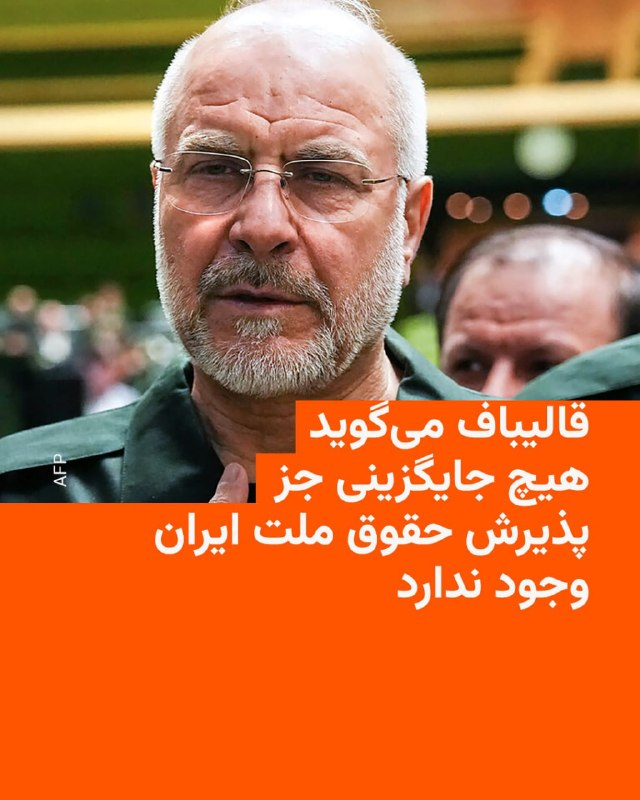

🔸محمدباقر قالیباف، رئیس مجلس شورای اسلامی در واکنش به مواضع دونالد ترامپ رئیس جمهوری آمریکا در قبال ایران روز دوشنبه ۲۱ اردیبهشت بر ضرورت پذیرش شروط تهران از سوی واشینگتن تاکید و اعلام کرد: «هیچ جایگزینی جز پذیرش حقوق ملت ایران وجود ندارد.»

🔸قالیباف در پیامی در شبکه اجتماعی ایکس نوشت: «هر رویکردی دیگری بی‌نتیجه خوواهد بود و تنها به شکست‌های پیاپی منجر می‌شود.»

🔸او همچنین هشدار داد که ادامه این روند هزینه بیشتری برای مالیات دهندگان آمریکایی به همراه خواهد داشت.

🔸این پیام پس از آن منتشر شد که دونالد ترامپ، رئیس‌جمهور آمریکا، شامگاه یکشنبه ۲۰ اردیبهشت پاسخ ایران به طرح پیشنهادی آمریکا برای پایان جنگ را «کاملا غیر قابل‌ قبول» خواند.

🔸او در پیام کوتاهی در شبکه اجتماعی تروث سوشال نوشت: «من همین حالا پاسخِ به‌اصطلاح “نمایندگان” ایران را خواندم. از آن خوشم نمی‌آید. کاملاً غیرقابل‌قبول است!»

@RadioFarda

## RadioFarda — post 157069

  <a href="https://t.me/radiofarda/157069" target="_blank">📎 Download file</a>

📻بشنوید: سرخط خبرها با رادیوفردا، ۲۲ اردیبهشت ۱۴۰۵‌

@RadioFarda

## IranianMinds — post 19985

🔴 ایالات متحده جایزه ۱۵ میلیون دلاری برای اطلاعاتی که به مختل شدن سازوکارهای مالی سپاه و شاخه‌های مختلف اون منجر بشه، تعیین کرد.

@IranianMinds

## IranianMinds — post 19984

  

ترامپ یه سری پستارو داره ریپوست میکنه که خواهان بازداشت اوباما هستن

@IranianMinds

## BBCPersian — post 280809

  

🔸لامین یامال، فوق ستاره فوتبال اسپانیا و جهان که عصر یکشنبه به همراه تیم بارسلونا توانست با شکست رئال مادرید در ال‌کلاسیکو، قهرمانی این تیم در لالیگا را قطعی کند، روز دوشنبه در هنگام جشن خیابانی این تیم با بالا بردن پرچم فلسطین خبرساز شد.

بارسلونا در بازی اخیرش با نتیجه دو بر صفر، رئال مادرید را برد و سه هفته مانده به پایان مسابقات این فصل قهرمانی خود را مسجل کرد و و برای ۲۹مین بار جام قهرمانی باشگاه‌های اسپانیا را تصاحب کرد.

اسپانیا از کشورهای پیشگام اتحادیه اروپا در به رسمیت شناختن کشور مستقل فلسطینی است.

📸INSTAGRAM/Reuters
https://bbc.in/4wpg69U
@BBCPersian

## BBCPersian — post 280808

  

🔻بنابر گزارش رسانه‌های ایران،‌ رضا رحمانی، دبیر کارگروه نجات دریاچه ارومیه گفته است در چند ماه گذشته حدود ۳۰ میلیون متر مکعب آب به حوضچه دریاچه ارومیه افزوده شده که موجب شکسته شدن رکود ۶ ساله تراز آبی این دریاچه شده است.

استاندار آذربایجان غربی «لایروبی نهرها ، تامین حق آب و آبگیری تالاب های اقماری در کنار وضعیت مناسب بارش‌ها» را از دلایل بهبود وضعیت دریاچه ارومیه دانسته است و بر ادامه اصلاح الگوهای آبخیزداری به ویژه در بخش کشاورزی تاکید کرده است.

خشکی دریاچه ارومیه سالهاست که موجب نگرانی کارشناسان و فعالان محیط زیست شده است.

📸IRNA
https://bbc.in/4u5xbUz
@BBCPersian

## BBCPersian — post 280807

  

🔻جان رابرتز، گزارشگر و از مجریان شبکه خبری فاکس نیوز در حساب ایکس خود نوشته که در تماسی تلفنی با دونالد ترامپ، رئیس جمهور آمریکا به او گفته به ایده انضمام ونزوئلا به عنوان ایالت پنجاه و یکم آمریکا «به طور جدی» فکر می‌کند.

آقای ترامپ پیش‌تر هم از ایده پیوستن کانادا به ایالات متحده به طور جدی سخن گفته بود که با واکنش تند دولت این کشور و بسیاری از رهبران غربی روبرو شد.

او همچنین از «به دست آوردن» گرینلند به طور جدی سخن گفته و حتی ایده خود را به اجلاس رهبران اروپا و ناتو هم برده بود هر چند در نهایت با طرح پیشنهادهایی از سوی کشورهای اروپایی و متحد واشنگتن، دیگر آن را مطرح نکرد.

📸EPA/Shutterstock
https://bbc.in/4wpH3Ko
@BBCPersian

## BBCPersian — post 280806

🔻مقامات لبنان از سفیر آمریکا خواستند اسرائیل را برای توقف حملات تحت فشار بگذارد

مقامات لبنان از سفیر آمریکا در بیروت خواسته‌اند که واشنگتن را برای متوقف کردن حملات اسرائیل به لبنان تحت فشار بگذارد. حملاتی که با وجود آتش‌بس در جنگ اسرائیل و حزب‌الله، همچنان ادامه دارد.

مقام‌های لبنانی اعلام کرده‌اند شمار کشته‌شدگان حملات اسرائیل از دوم مارس تاکنون به ۲ هزار و ۸۶۹ نفر رسیده که ده‌ها نفر از آن‌ها پس از اجرایی شدن آتش‌بس در ۱۷ آوریل کشته شده‌اند.

ژوزف عون، رئیس‌جمهوری لبنان و نواف سلام نخست‌وزیر جداگانه با میشل عیسی، سفیر آمریکا دیدار کردند. دیدارهایی که در آستانه سومین نشست نمایندگان لبنان و اسرائیل در واشنگتن انجام شد.

نواف سلام گفته است که از سفیر آمریکا خواسته برای توقف حملات و نقض‌ مداوم آتش‌بس از سوی اسرائیل اقدام کند.

در روزهای اخیر، اسرائیل حملات خود به لبنان را تشدید کرده و برخی حملات تا حدود ۲۰ کیلومتری بیروت پیش رفته است.

خبرگزاری رسمی لبنان گزارش داده که اسرائیل روز دوشنبه بیش از ۳۰ نقطه در جنوب و شرق این کشور را هدف حملات هوایی قرار داده است.

https://bbc.in/3RyM0k8
@BBCPersian

## BBCPersian — post 280805

  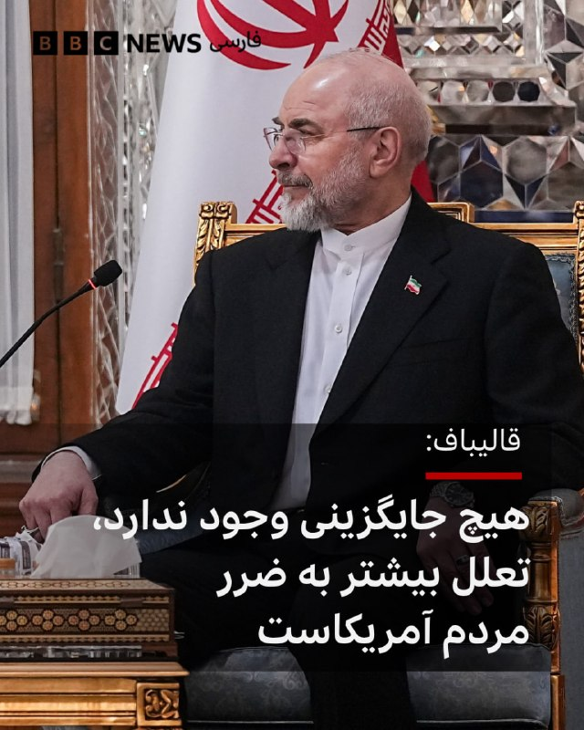

🔻محمدباقر قالیباف، رئیس مجلس شوری اسلامی ایران در واکنشی تازه به اظهارات دونالد ترامپ گفته است: «هيچ جايگزينی جز پذيرش حقوق مردم ايران، آن‌گونه که در پيشنهاد ۱۴ بندی آمده، وجود ندارد.»

این اظهارات را حساب کاربری آقای قالیباف عصر دوشنبه در شبکه ایکس و به زبان انگلیسی منتشر کرده و نوشته است: «هر رويکرد ديگری کاملا بی‌نتيجه خواهد بود و چيزی جز شکست‌های پياپی به همراه نخواهد داشت. هرچه بیشتر تعلل کنند، مالیات‌دهندگان آمریکایی هزینه بیشتری از جیب خود خواهند پرداخت.»

آقای قالیباف در پست قبلی هم گفته بود ایران برای هر سناریویی آماده است.

به نظر می‌رسد اظهارات رئیس مجلس ایران در واکنش به اظهارات دونالد ترامپ است که در آنها رئیس جمهور آمریکا از نارضایتی کامل خود از پاسخ ایران به پیشنهادهای او خبر داده است.

آقای ترامپ روز دوشنبه گفته بود با توجه به نارضایتی او از پاسخ ایران، آتش بس میان دو کشور در وضعیتی شبیه زنده ماندن به کمک «دستگاه تنفس مصنوعی» است.

📸Handout via Getty Images
https://bbc.in/437QfWl
@BBCPersian

## BBCPersian — post 280804

🔻گزارش‌ها درباره احداث یک پایگاه مخفی اسرائیل در خاک عراق، ابعاد تازه‌ای از جنگ ۳۹ روزه آمریکا و اسرائیل با ایران را آشکار کرده است.
گفته می‌شود اسرائیل از این پایگاه که در وسط صحرای عراق ساخته شده بود، برای پشتیبانی عملیات علیه ایران استفاده می‌کرد.

گزارش فرزاد صیفی‌کاران از بخش راستی‌آزمایی بی‌بی‌سی

@BBCPERSIAN

## manototv — post 105330

  <a href="telegram/content/manototv_105330_1778562601.mp4" target="_blank">🎬 Download video</a>

وزارت خارجه آمریکا از طریق برنامه «پاداش برای عدالت» اعلام کرد برای دریافت اطلاعاتی که به مختل شدن سازوکارهای مالی سپاه و شاخه‌های مختلف آن، از جمله نیروی قدس سپاه، منجر شود، تا سقف ۱۵ میلیون دلار پاداش پرداخت می‌کند.

بر اساس اعلام این برنامه، سپاه بخشی از فعالیت‌های خارجی خود را از طریق فروش نفت تحریم‌شده جمهوری اسلامی و با استفاده از شبکه‌ای از شرکت‌های پوششی تامین مالی می‌کند. وزارت خارجه آمریکا می‌گوید این شبکه‌ها درآمدهای حاصل از فروش نفت را از مسیرهای غیرشفاف و از جمله از طریق نظام بانکی آمریکا جابه‌جا کرده‌اند.

در اطلاعیه برنامه «پاداش برای عدالت» از وانگ شائویون، تبعه چین، و محمود راشد عامر الحبسی، تبعه عمان، نام برده شده است. به گفته مقام‌های آمریکایی، این دو نفر به همراه افراد و شرکت‌های وابسته در چین، عمان و ترکیه، فروش و انتقال نفت تحریم‌شده ایران به پالایشگاه‌ها و شرکت‌های دولتی چین را سازمان‌دهی کرده‌اند تا درآمد آن به نیروی قدس سپاه برسد.

## manototv — post 105329

  <a href="telegram/content/manototv_105329_1778562601.mp4" target="_blank">🎬 Download video</a>

سی‌بی‌اس نیوز به نقل از مقام‌های آمریکایی گزارش داد پاکستان، همزمان با ایفای نقش میانجی میان تهران و واشینگتن، به چند هواپیمای نظامی جمهوری اسلامی اجازه داد در پایگاه‌های هوایی این کشور مستقر شوند.

بر اساس این گزارش، این اقدام احتمالا برای دور نگه داشتن بخشی از دارایی‌های هوایی جمهوری اسلامی از حملات آمریکا انجام شده است. مقام‌های آمریکایی گفته‌اند یکی از این هواپیماها یک فروند آرسی-۱۳۰ نیروی هوایی ایران بود که به پایگاه نورخان پاکستان منتقل شد.

یک مقام ارشد پاکستانی این گزارش را رد کرد و گفت پنهان کردن چنین هواپیماهایی در پایگاه نورخان، به دلیل موقعیت آن در قلب شهر، ممکن نیست.

## manototv — post 105328

  <a href="telegram/content/manototv_105328_1778562602.mp4" target="_blank">🎬 Download video</a>

رزا پرتو، روزنامه‌نگار «منوتو»، در گردهمایی ایرانیان روبروی دادگاه لاهه در هلند گفت: «جمهوری اسلامی باید در دادگاه لاهه محاکمه شود».

## alonews — post 119410

  <a href="telegram/content/alonews_119410_1778562605.webm" target="_blank">🎬 Download video</a>

👈وال استریت ژورنال: ترامپ به طور جدی در حال پیگیری تحقیقات درباره نشت اطلاعات پس از جنگ ایران است.

🔴ترامپ شخصاً به دادستان کل موقت تاد بلانچ دسته‌ای از مقالات خبری با برچسب «خیانت» تحویل داد و وزارت دادگستری را تحت فشار قرار داد تا سوابق خبرنگاران از رسانه‌هایی مانند وال استریت ژورنال، نیویورک تایمز و واشنگتن پست را احضار کند.

🔴این احضاریه‌ها مربوط به داستان‌هایی درباره هشدارهای نظامی پیش از جنگ، لابی‌گری نتانیاهو با ترامپ و عملیات نجات جت‌های سرنگون شده است.

✅ @AloNews خبر جنگ

## alonews — post 119409

  <a href="telegram/content/alonews_119409_1778562605.webm" target="_blank">🎬 Download video</a>

👈دفتر نتانیاهو خطاب به اروپا : چاز آنجا که اسرائیل و آمریکا «کار کثیف اروپا را انجام می‌دهند» با مبارزه برای تمدن در برابر دیوانگان جهادی در ایران و جاهای دیگر، اتحادیه اروپا ورشکستگی اخلاقی خود را با ایجاد تقارن نادرست بین شهروندان اسرائیلی و تروریست‌های حماس نشان داد.

🔴تلاش‌های اتحادیه اروپا برای تحریم غیرنظامیان اسرائیلی نشانه‌ای دیگر از ضعف است و موفق نخواهد شد.

✅ @AloNews خبر جنگ

<!-- MSG END -->

<!-- NAV START -->

<a href="https://github.com/morii86/aio-downloader/blob/main/telegram/content/archive_1.md" style="display:inline-block; padding:6px 12px; margin:0 4px; background-color:#2ea44f; color:white; text-decoration:none; border-radius:4px; font-weight:bold;">صفحه بعد</a>

<!-- NAV END -->
