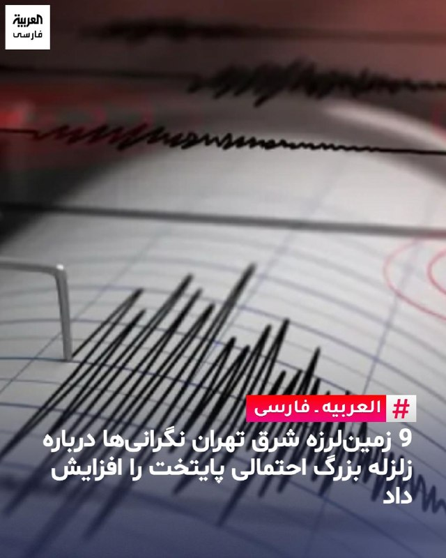
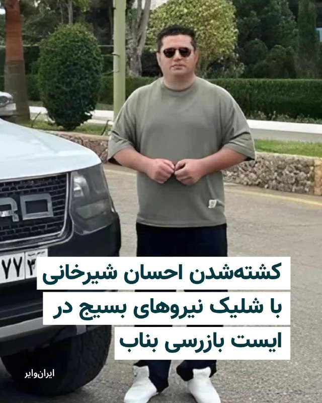
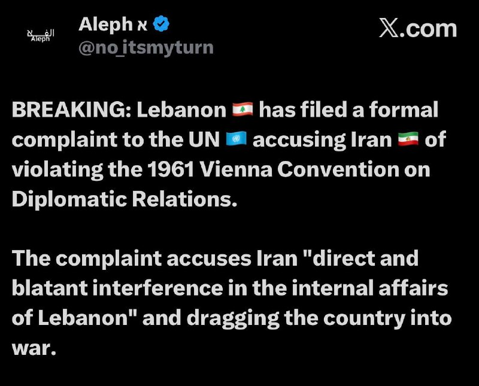
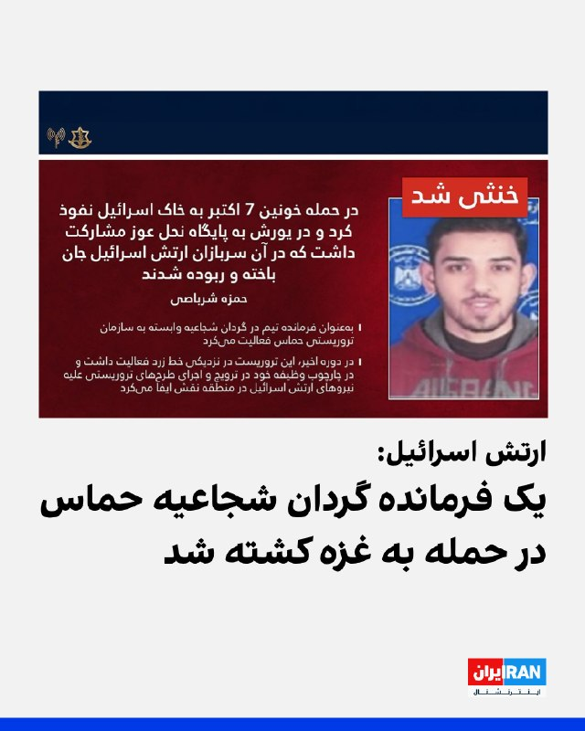
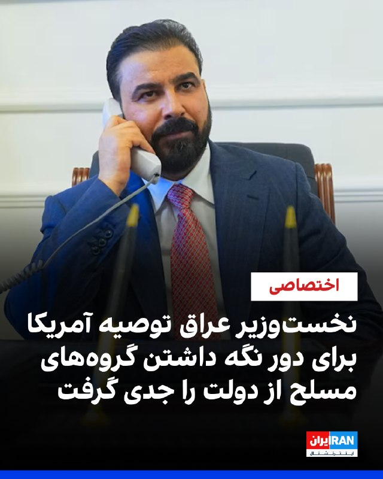
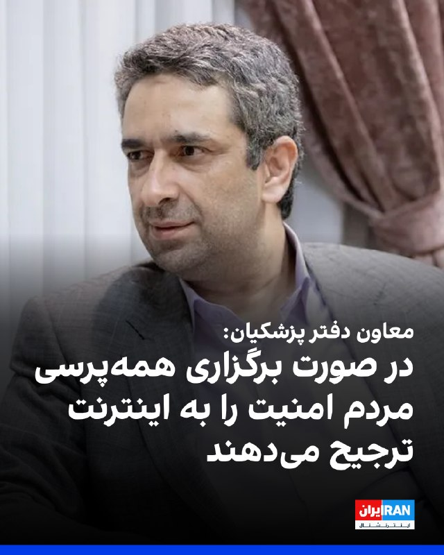
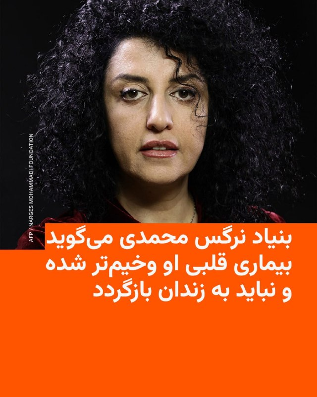
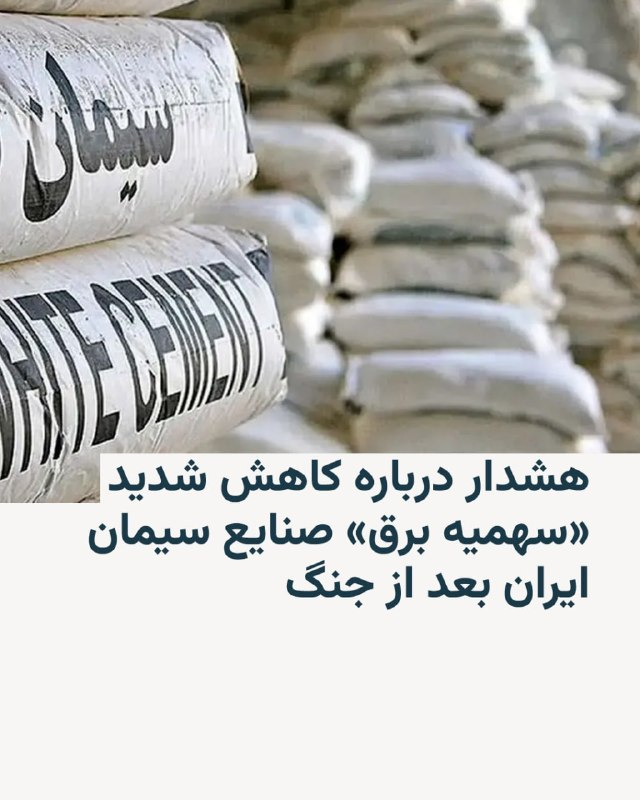
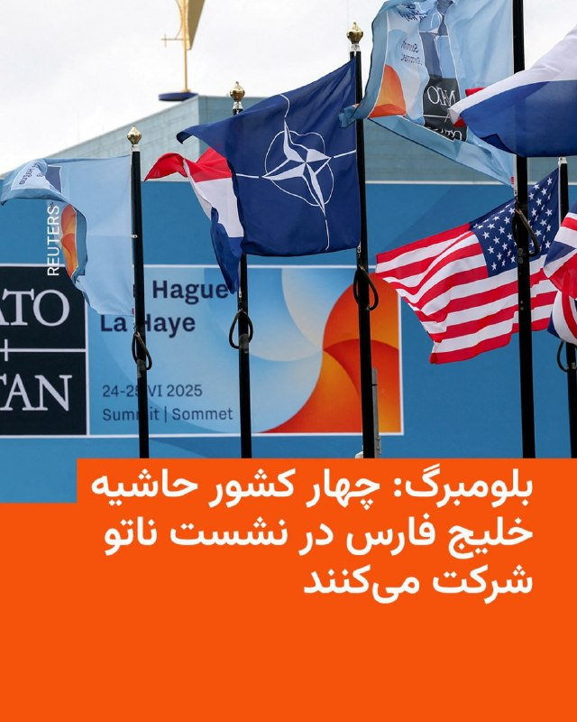
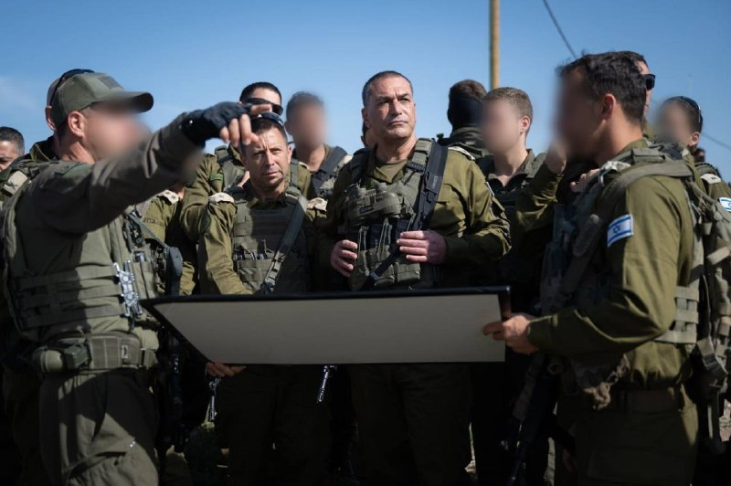

# خواننده تلگرام

<!-- TOP_NAV START -->

<a href="https://github.com/morii86/aio-downloader/blob/main/telegram/content/archive_1.md" style="display:inline-block; padding:6px 12px; margin:0 4px; background-color:#2ea44f; color:white; text-decoration:none; border-radius:4px; font-weight:bold;">صفحه بعد</a>

<!-- TOP_NAV END -->

<!-- MSG START -->

---
📅 بروزرسانی: 1405/02/23 19:44
---

## VahidOOnLine — post 239933

♦️دونالد ترامپ، رئیس‌جمهوری ایالات متحده همراه با تعدادی از اعضای کابینه‌اش، چهارشنبه شب ۲۳ اردیبهشت، وارد چین شد. مراسم استقبال شبانه با حضور گروهی از جوانان چینی که پرچم‌های چین و آمریکا را در دست داشتند و رژه سربازان انجام شد.

در هواپیمای ریاست جمهوری، اریک ترامپ و همسرش لارا، ایلان ماسک، میلیاردر مشهور و صاحب شرکت‌های تسلا و اسپیس‌ایکس، جن‌سن هوانگ، بنیانگذار و مدیر اجرایی انویدیا و تیم کوک، مدیرعامل اپل، رئیس‌جمهوری آمریکا را همراهی کردند. پیت هگست، وزیر جنگ و مارکو روبیو، وزیر امور خارجه ایالات متحده نیز از دیگر همراهان ترامپ بودند.

مراسم رسمی استقبال و دیدار ترامپ با شی جین‌پینگ، رئیس‌جمهوری چین قرار است روز پنجشنبه در پکن انجام شود.
‌🇸🇦 Indypersian

🤖 @VahidOOnLine

## VahidOOnLine — post 239932

♦️فضای سنای فیلیپین روز چهارشنبه پس از شنیده شدن صدای تیراندازی، به صحنه‌ای پرتنش و آشفته تبدیل شد، اتفاقی که هم‌زمان با افزایش نگرانی‌ها درباره احتمال بازداشت «رونالد دلا روزا» سناتور جنجالی و از چهره‌های اصلی جنگ خونین علیه مواد مخدر در دوران ریاست‌جمهوری رودریگو دوترته رخ داد.
ویدیوهای منتشرشده از شبکه تلویزیونی «تی‌وی۵» فیلیپین، لحظاتی پرهرج‌ومرج را نشان می‌دهد؛ جایی که خبرنگاران و کارکنان سنا پس از شنیده شدن صدای چند گلوله، با اضطراب محل را ترک می‌کنند و صدای فریاد و آشفتگی در ساختمان شنیده می‌شود.
رونالد دلا روزا، رئیس پیشین پلیس فیلیپین از حامیانش خواسته بود برای جلوگیری از تحویلش به دیوان کیفری بین‌المللی وارد عمل شوند.
در همین حال، وزیر کشور فیلیپین اعلام کرد هنوز مشخص نیست چه کسی در ساختمان سنا تیراندازی کرده است.
رونالد دلا روزا یکی از چهره‌های کلیدی «جنگ با مواد مخدر» در دوران ریاست‌جمهوری رودریگو دوترته محسوب می‌شود؛ کارزاری که به کشته شدن هزاران نفر انجامید و سال‌هاست تحت بررسی دیوان کیفری بین‌المللی قرار دارد.
‌🇸🇦 Indypersian

🤖 @VahidOOnLine

## VahidOOnLine — post 239931

  

فیصل بن فرحان، وزیر خارجه عربستان سعودی در نشست خبری مشترک با وزیر خارجه اسپانیا در مادرید اعلام کرد که بازگشت کشتیرانی در تنگه هرمز به وضعیت پیش از ۹ اسفند ضروری است.

او اضافه کرد: «امنیت تنگه هرمز و آزادی کشتیرانی، پایه ثبات اقتصاد جهانی به شمار می‌رود. به حمایت از کاهش تنش‌ها و جلوگیری از تشدید بحران ادامه می‌دهیم.»
‌🏁 🇬🇧 IranintlTV

🤖 @VahidOOnLine

## VahidOOnLine — post 239930

  <a href="telegram/content/VahidOOnLine_239930_1778688891.mp4" target="_blank">🎬 Download video</a>

در حالی که مجریان صداوسیما در پاسخ به اعتراض شهروندان به شرایط کشور از جمله سرکوب، وضع معیشتی و قطع اینترنت، خواستار ترک کشور از سوی منتقدان و معترضان می‌شوند، مردم و مخاطبان ایران اینترنشنال در شعار انقلاب دی و همچنین پیام‌های ارسالی خود می‌گویند می‌جنگند و کشور را از حکومت پس می‌گیرند.
‌🏁 🇬🇧 IranintlTV

🤖 @VahidOOnLine

## VahidOOnLine — post 239929

  

سنتکام اعلام کرد از زمان آغاز محاصره دریایی بنادر و سواحل جنوب ایران، ۶۷ کشتی تجاری مجبور به تغییر مسیر شده‌اند. به گفته این نهاد، نیروهای آمریکایی اجازه عبور ۱۵ کشتی حامل کمک‌های بشردوستانه را داده‌اند و چهار کشتی نیز در پی اقدامات این نیروها از کار افتاده‌اند.
‌🏁 🇬🇧 IranintlTV

🤖 @VahidOOnLine

## VahidOOnLine — post 239927

  <a href="telegram/content/VahidOOnLine_239927_1778688895.mp4" target="_blank">🎬 Download video</a>

‌
تصاویر مارکو روبیو، وزیر خارجه آمریکا، با یک ست ورزشی خاکستری در هواپیمای ریاست جمهوری آمریکا، در شبکه‌های اجتماعی خبرساز شد.

در تصویری که توسط استیون چونگ، مدیر ارتباطات کاخ سفید، منتشر شده روبیو دقیقاً همان لباس ورزشی‌ای را پوشیده که نیکلاس مادورو، رئیس‌جمهوری پیشین ونزوئلا، هنگام بازداشت توسط نیروهای آمریکایی در اوایل سال جاری به تن داشت.

مدیر ارتباطات کاخ سفید در توضیح عکس‌ها به شوخی به «Nike Tech ونزوئلا» اشاره کرد.

روبیو در جریان سفر دونالد ترامپ به چین او را همراهی می‌کند؛ سفری که محور آن مسائل تجاری و امنیتی عنوان شده است.
‌🏁 🇬🇧 ManotoTV

🤖 @VahidOOnLine

## VahidOOnLine — post 239926

  <a href="telegram/content/VahidOOnLine_239926_1778688896.mp4" target="_blank">🎬 Download video</a>

سنتکام اعلام کرده یک جنگنده رادارگریز اف-۳۵آ نیروی هوایی آمریکا بر فراز آب‌های منطقه‌ای نزدیک تنگه هرمز عملیات گشت‌زنی انجام داده است و این جنگنده اف-۳۵آ توانایی حمل تا ۱۸ هزار پوند مهمات را دارد و در عین حال می‌تواند با سرعت مافوق صوت پرواز کند.
‌🏁 🇬🇧 ManotoTV

🤖 @VahidOOnLine

## VahidOOnLine — post 239925

  

ارتش اسرائیل و شاباک اعلام کردند حمزه شرباصی، از فرماندهان گردان «شجاعیه» حماس، هفته گذشته در حمله‌ای هوایی در شمال نوار غزه کشته شد؛ فردی که به گفته آن‌ها در حمله هفت اکتبر ۲۰۲۳ به پایگاه «نحل عوز» مشارکت داشت.

بر اساس این بیانیه، شرباصی در جریان حمله هفت اکتبر ۲۰۲۳ وارد خاک اسرائیل شد و در حمله به پایگاه نحل عوز که در آن شماری از سربازان اسرائیلی کشته و ربوده شدند، نقش داشت.

ارتش اسرائیل و شاباک اعلام کردند شرباصی اخیرا در نزدیکی «خط زرد» فعالیت می‌کرد و در چارچوب مسئولیت خود، در پیشبرد طرح‌هایی علیه نیروهای اسرائیلی در منطقه نقش داشت.

در همین حمله، عزام الحیه، پسر ۲۳ ساله خلیل الحیه، مذاکره‌کننده ارشد حماس نیز کشته شد.

به گفته ارتش اسرائیل، الحیه عضو یگان نخبه حماس بود و اخیرا «نقشی مرکزی» در این گروه داشت.

ارتش اسرائیل اعلام کرد نیروهایش در فرماندهی جنوب، مطابق توافق آتش‌بس، همچنان در منطقه مستقر هستند و برای رفع هرگونه تهدید فوری به فعالیت خود ادامه خواهند داد.
‌🏁 🇬🇧 IranintlTV

🤖 @VahidOOnLine

## VahidOOnLine — post 239924

  

خبرگزاری تسنیم، وابسته به سپاه پاسداران، گزارش داد نعیم قاسم، دبیرکل حزب‌الله لبنان، در پیامی به علیرضا اعرافی، مدیر حوزه‌های علمیه جمهوری اسلامی، اعلام کرد که «مقاومت هرگز تسلیم نخواهد شد.»

نعیم قاسم در پیام خود نوشت: «ما قدردان حمایت خالصانه و مستمر جمهوری اسلامی از ابتدا تا امروز هستیم. حمایتی که با دستور روح‌الله خمینی آغاز شد و تحت هدایت علی خامنه‌ای و از طریق سپاه پاسداران و خصوصا نیروی قدس ادامه یافت.»

دبیرکل حزب‌الله حملات اخیر آمریکا و اسرائیل به جمهوری اسلامی را «حمله به پرچم مقاومت، استقلال و حمایت از فلسطین و قدس» دانست و نوشت با این حال مجتبی خامنه‌ای، این مرحله را نیز با پیروزی پشت سر خواهد گذاشت.
‌🏁 🇬🇧 IranintlTV

🤖 @VahidOOnLine

## VahidOOnLine — post 239923

  <a href="telegram/content/VahidOOnLine_239923_1778688898.mp4" target="_blank">🎬 Download video</a>

⭕️ وزیر انرژی آمریکا:
جریان آزاد تجارت انرژی از تنگه هرمز با یا بدون توافق با ایران برقرار خواهد شد

♦️کریس رایت، وزیر انرژی ایالات متحده، روز چهارشنبه ٢٣ اردیبهشت ماه در جلسه تعیین بودجه سنا گفت: «پایان دادن به برنامه هسته‌ای چند دهه‌ای ایران، اقدامی پیچیده، حساس و دشوار است؛ همان‌طور که اکنون همه در حال مشاهده آن هستند. اما به هر شکل ممکن، ایالات متحده جریان آزاد تجارت انرژی از طریق تنگه هرمز را دوباره برقرار خواهد کرد.»
او افزود: «تقریبا همه کشورهای جهان در این مسیر همسو هستند و به‌طور ویژه تمام کشورهای حوزه خلیج فارس و همه همسایگان منطقه نیز در این موضوع با ما هم‌نظر و همراه هستند. بنابراین این مسئله، چه از طریق توافق و معامله با ایران و چه بدون توافق با ایران، در نهایت انجام خواهد شد.»
‌🇸🇦 Indypersian

🤖 @VahidOOnLine

## VahidOOnLine — post 239922

  <a href="telegram/content/VahidOOnLine_239922_1778688901.mp4" target="_blank">🎬 Download video</a>

♦️روز چهارشنبه ۲۳ اردیبهشت، چارلز سوم در مراسمی باشکوه و با رعایت سنت‌های تاریخی، برنامه قانون‌گذاری دولت بریتانیا را در مجلس لردها تبیین کرد. پادشاه بریتانیا که همراه با همسرش، ملکه کامیلا با کالسکه سلطنتی از کاخ باکینگهام به پارلمان آمده بود، در سخنرانی خود بر اولویت‌های استراتژیک دولت تاکید کرد.

او خطاب به قانون‌گذاران گفت که وزیران تصمیماتی را اتخاذ خواهند کرد که امنیت انرژی، دفاعی و اقتصادی بلندمدت پادشاهی متحده را تضمین کند. در این سخنرانی، سرفصل‌های ۳۷ لایحه پیشنهادی دولت برای سال پیش‌رو ارائه شد که هشت مورد آن پیش‌تر به پارلمان معرفی شده بود. این مراسم که ریشه در قرن شانزدهم میلادی دارد، نمادی از تفکیک قوای قانون اساسی در بریتانیا و نقشه راه سیاسی این کشور برای ماه‌های آینده محسوب می‌شود.
‌🇸🇦 Indypersian

🤖 @VahidOOnLine

## VahidOOnLine — post 239921

  

شاخوان عبدالله، رییس فراکسیون حزب دموکرات کردستان عراق، در گفت‌وگویی اختصاصی با ایران‌اینترنشنال تایید کرد که الزیدی توصیه‌های واشنگتن درباره دور نگه داشتن گروه‌های مسلح از وزارتخانه‌ها را جدی گرفته است.

به گفته عبدالله، تفاوت زیادی میان کابینه السودانی و کابینه الزیدی در زمینه حضور گروه‌های مسلح وجود دارد؛ چرا که در دولت السودانی شمار زیادی از افراد وابسته به گروه‌های مسلح در دولت حضور داشتند، اما تا این لحظه روند در دولت الزیدی به این شکل نیست، مگر این‌که در لحظات آخر تغییراتی ایجاد شود.

فادی الشمری، مشاور نخست‌وزیر، سه‌شنبه در گفت‌وگویی خبری تایید کرده بود آمریکایی‌ها اطلاع داده‌اند که اگر حتی یک وزیر وابسته به گروه‌های مسلح در دولت حضور داشته باشد، به‌طور کامل با دولت همکاری نخواهند کرد.

بر اساس برخی گزارش‌ها، قرار است پنج‌شنبه پارلمان عراق بخشی از کابینه دولت الزیدی را به رای بگذارد.

در عراق، «نخست‌وزیر مکلف» به فردی گفته می‌شود که مامور تشکیل کابینه شده اما هنوز از پارلمان رای اعتماد نگرفته، قدرت اجرایی ندارد و رسما در سمت نخست‌وزیر فعالیت نمی‌کند.
‌🏁 🇬🇧 IranintlTV

🤖 @VahidOOnLine

## mwarmonitor — post 9043

  <a href="telegram/content/mwarmonitor_9043_1778688905.mp4" target="_blank">🎬 Download video</a>

🇺🇸چهار هفته پیش، فرماندهی مرکزی آمریکا (CENTCOM) اجرای محاصره علیه کشتی‌هایی را آغاز کرد که وارد یا از بنادر ایران خارج می‌شوند. تا امروز، نیروهای آمریکایی ۶۷ کشتی تجاری را تغییر مسیر داده‌اند، اجازه عبور به ۱۵ کشتی حامل کمک‌های بشردوستانه داده‌اند و ۴ کشتی را برای تضمین رعایت مقررات از کار انداخته‌اند.

🇺🇸اوایل این هفته نیز نیروهای CENTCOM پس از ارتباط رادیویی و شلیک هشداردهنده با سلاح‌های سبک، دو کشتی تجاری را وادار به بازگشت کردند؛ اقدامی که نشان می‌دهد اجرای این محدودیت‌ها همچنان به‌طور کامل برقرار است.

@mwarmonitor

## mwarmonitor — post 9042

  <a href="telegram/content/mwarmonitor_9042_1778688907.mp4" target="_blank">🎬 Download video</a>

📝 این قاب تهوع‌آور، ویترینی از تکثیر ویروس‌هایی است که در لجن‌زار رانت و وقاحت رشد کرده‌اند؛ انگل‌هایی که با پاهای میلیاردی و مغزهای پوچ، روی صندلی‌های دانشگاهی تکیه زده‌اند که حتی آدرسش را هم «حضور ذهن ندارند». وقتی آن ملی‌پوش با پوزخندی ابلهانه از پاسخ به نام دانشگاهش عاجز می‌ماند، در واقع به ریشِ تمام استخوان‌خردکرده‌های علم و سواد شلیک می‌کند. این فاجعه فقط به زمین فوتبال ختم نمی‌شود؛ تزویرِ لزجی که در رگ‌های موجوداتی مثل آن مجریِ نجس‌زاده جریان دارد، وظیفه‌اش عادی‌سازی همین حماقتِ عریان و دکتری‌های پوشالیِ غیرحضوری است. این ویروس‌های بی‌سواد که خونِ بیت‌المال را می‌مکند و با وقاحت تمام از «تحصیلات عالیه» دم می‌زنند، نمادِ فروپاشیِ اخلاقی و فرهنگی هستند که در آن، هرچه متعفن‌تر باشی، عزیزتر و نورچشمی‌تر خواهی بود. شما نه قهرمان هستید و نه الگو، بلکه تنها زالوهایی هستید که در پیکره‌ی نیمه‌جان این ملت جا خوش کرده‌اید.

@mwarmonitor

## mwarmonitor — post 9041

🟥محموله‌های نفتی عراق با انسداد مواجه شدند

🔘سه نفتکش حامل نفت خام و سوخت عراق پس از استفاده از کریدور ترانزیتی تنگه هرمز که تحت کنترل ایران است، در تاریخ ۱۰ مه، بر اساس داده‌های Kpler، در نزدیکی عمان متوقف شده‌اند. این کشتی‌ها با پرچم ایران ثبت نشده‌اند و محموله ایرانی نیز حمل نمی‌کنند، اما خود مسیر عبور اهمیت دارد.

🔘بر اساس گزارش، دفتر کنترل دارایی‌های خارجی آمریکا (OFAC) اعلام کرده است که پرداخت «هزینه ترانزیت ۱ دلاری به ازای هر بشکه» به ایران می‌تواند به‌عنوان حمایت مادی تحت قوانین تحریم‌های آمریکا تلقی شود. با توجه به اینکه محموله‌ها به نقاط بارگیری در عراق مرتبط هستند که پیش‌تر نیز تحت بررسی آمریکا بوده‌اند، این پرونده نشان می‌دهد اجرای محدودیت‌ها اکنون فراتر از منشأ محموله و شامل مسیر حمل، پرداخت‌ها و اسناد نیز می‌شود.

@mwarmonitor

## mwarmonitor — post 9040

🔴وال‌استریت ژورنال : گفته می‌شود معاون رئیس‌جمهور، جی‌دی ونس، در حال برنامه‌ریزی برای ارائه یک اولتیماتوم به هر ۵۰ ایالت آمریکاست: یا به‌طور کامل از قوانین ضدتقلب تبعیت کنند، یا خطر از دست دادن بودجه فدرال مدیکید (Medicaid) را بپذیرند.

@mwarmonitor

## mwarmonitor — post 9039

🔴(رویترز) - پنتاگون قرار است روز چهارشنبه چارچوب توافق‌هایی را اعلام کند که این نهاد را برای احتمال خرید بیش از ۱۰ هزار موشک کم‌هزینه و کانتینری طی سه سال از سال ۲۰۲۷ آماده می‌کند.

🔸در بیانیه‌ای که رویترز پیش از انتشار آن مشاهده کرده، آمده است این توافق‌ها میان پنتاگون و شرکت‌های Anduril، CoAspire، Leidos و Zone 5 منعقد شده و برنامه‌ای با عنوان «مهمات کانتینری کم‌هزینه (LCCM)» را آغاز می‌کند.

🔹مرحله ارزیابی این برنامه شامل خرید موشک‌های آزمایشی از هر چهار شرکت از ژوئن ۲۰۲۶ خواهد بود. در این بیانیه هزینه‌ای ذکر نشده و مشخصات دقیق سامانه‌های تسلیحاتی نیز اعلام نشده، اما گفته شده این توافق‌ها شرایط قراردادهای تولیدی آینده با قیمت ثابت را تعیین می‌کنند.

🔸ارتش آمریکا مدت‌هاست سامانه‌های تسلیحاتی کانتینری را به‌عنوان روشی کم‌هزینه و متحرک برای استقرار موشک‌ها در قالب کانتینرهای استاندارد حمل‌ونقل تبلیغ می‌کند.

🔹در توافقی جداگانه با استارتاپ دفاعی Castelion نیز طرحی برای قرارداد دو‌ساله با حداقل خرید سالانه ۵۰۰ موشک «Blackbeard» ارائه شده است؛ این موشک‌ها نخستین سلاح ضربتی هایپرسونیک این شرکت هستند و پس از تکمیل آزمایش‌ها و تأیید نهایی وارد مرحله قرارداد خواهند شد.

🔸طبق این بیانیه، پنتاگون به دنبال مجوز و بودجه برای خرید بیش از ۱۲ هزار موشک Blackbeard طی پنج سال است.

🔹مایکل دافی، معاون وزیر دفاع در امور خرید و پشتیبانی، گفته این توافق‌ها نشان می‌دهد پنتاگون در حال فاصله گرفتن از پیمانکاران سنتی و گسترش پایگاه صنعتی دفاعی است.

🔸امیل مایکل، معاون وزیر دفاع در امور تحقیق و مهندسی، نیز گفته این توافق‌ها شرکت‌ها را متعهد به تحویل به‌موقع و با هزینه کنترل‌شده می‌کند.

🔹او افزود: «ما با سرعتی بی‌سابقه مهمات مقرون‌به‌صرفه را برای نیروهای خود فراهم خواهیم کرد.»

🔸پنتاگون در حال افزایش درخواست‌های بودجه‌ای خود از کنگره برای تأمین مهمات است؛ موضوعی که با توجه به جنگ جاری در ایران، تقاضا برای آن بالا رفته است.

🔹ژنرال دن کین، رئیس ستاد مشترک ارتش آمریکا، در شهادت کتبی این هفته گفته بود بودجه سال مالی ۲۰۲۷ پنتاگون بیش از ۲۶ میلیارد دلار برای قراردادهای چندساله خرید مهمات حیاتی تأمین خواهد کرد.

@mwarmonitor

## pm_afshaa — post 90696

  <a href="telegram/content/pm_afshaa_90696_1778688909.webm" target="_blank">🎬 Download video</a>

🔴سنتکام با انتشار تصویری، از گشت‌زنی جنگنده پنهان‌کار F-35A آمریکا بر فراز آب‌های نزدیک تنگه هرمز خبر داد.

به گفته سنتکام، این جنگنده توان حمل تا 18 هزار پوند مهمات رو در سرعت مافوق صوت داره.

💧Rainbet.com the #1 Non-KYC Crypto Casino & Sportsbook @rainbetcom

😁 @Pm_Afshaa

## pm_afshaa — post 90695

احسان افرشته امروز صبح توسط جمهوری تروریستی اسلامی اعدام شد 
💧 Rainbet.com the #1 Non-KYC Crypto Casino & Sportsbook @rainbetcom 
😁 @Pm_Afshaa

## pm_afshaa — post 90694

🔴پولیتیکو به نقل از یک مقام ارشد کاخ سفید: چین پیش از دیدار ترامپ به ایران فشار آورده تا با امریکا به توافق برسه

💧 Rainbet.com the #1 Non-KYC Crypto Casino & Sportsbook @rainbetcom

😁 @Pm_Afshaa

## pm_afshaa — post 90693

🔴رئیس ستاد ارتش اسرائیل:
جنگ با ایران پایان نیافته و برای از سرگیری جنگ در هوشیاری کامل قرار داریم. از یهودا و سامره تا تهران برای دفاع و حمله آماده‌ایم.

💧 Rainbet.com the #1 Non-KYC Crypto Casino & Sportsbook @rainbetcom

😁 @Pm_Afshaa

## iaghapour — post 2606

⭕️ خلاصه اخبار چند روز گذشته

🔸اینترنت بین‌الملل به گیمرها ارائه می‌شود؛ ثبت درخواست در سامانه همگرا (اینترنت طبقاتی)

🔹دولت و مجلس به دنبال حمایت تازه از پیام‌رسان‌های داخلی (رانت و فساد جدید)

🔸نماینده مردم تهران در مجلس: درباره خسارت‌های قطعی اینترنت جوسازی می‌شود. (حرف بیخود)

🔹معاون رئیس‌جمهور: اینترنت بین‌الملل حتما وصل می‌شود؛ دولت قصد دائمی‌کردن محدودیت‌ها را ندارد. (حرف الکی)

🔸برآورد انجمن بلاکچین: خسارت ۳۰۰ تا ۷۰۰ هزار میلیاردی از قطعی اینترنت.

🔹معاون رئیس جمهور: محدودیت حجم و گرانی اینترنت پرو برای جلوگیری از استفاده غیرضروری است. (عجب بابا عجب)

🔸قطع اینترنت به هفتاد و پنجمین روز خود رسید.

🆔 @iaghapour

## DEJradio — post 4620

  <a href="telegram/content/DEJradio_4620_1778688910.webm" target="_blank">🎬 Download video</a>

🚨
🔸 گزارش اختصاصی دژ؛ بازتاب تهدید جنسی دختران مدرسه شرافت، واکنش مردم چه بود؟ روانشناس چه می‌گوید؟

#تهران #آزار_جنسی⁩ #مدرسه_شرافت
@DEJradio

## DEJradio — post 4619

  <a href="telegram/content/DEJradio_4619_1778688910.webm" target="_blank">🎬 Download video</a>

🔺🎤 آتش‌بس یا فقط وقفه‌ای کوتاه در جنگ؟

گفت‌وگو با شهرام خلدی، پژوهشگر تاریخ خاورمیانه

#جمهوری_اسلامی #آتشبس
@DEJradio

## DEJradio — post 4618

  <a href="telegram/content/DEJradio_4618_1778688911.webm" target="_blank">🎬 Download video</a>

🔺📷 تصویر ماهواره‌ای از هواپیمای هرکولس نهاجا در پایگاه هوایی «نورخان» پاکستان

جمهوری اسلامی ایران، طی جنگ ۴۰ روزه بخشی از هواپیماهای نیروی هوایی ارتش را به پاکستان منتقل کرد تا آسیب نبیند.
تصاویر ماهواره‌ای مورخ ۲۵ آوریل ۲۰۲۶ نشان می‌دهد، یک هواپیمای ترابری نظامی ایران از نوع C-130 «هرکولس» داخل پایگاه هوایی «نور خان» پاکستان پارک شده است.

پیش‌تر سی‌بی‌اس به نقل از مقامات آمریکایی گزارش داده بود، مخفیانه به هواپیماهای نظامی ایران اجازه داده است که در پایگاه‌های هوایی‌اش مستقر شوند.

به گفته دو مقام آمریکایی، ایران همچنین برخی از هواپیماهای غیرنظامی خود را به افغانستان منتقل کرده است. مشخص نیست که آیا ایران هواپیمای نظامی هم به افغانستان فرستاده است یا نه.
یک روز بعد وزارت خارجه پاکستان این ادعا را رد کرد و گفت، این هواپیماها «موقت» به پاکستان منتقل شده و مربوط به اسکورت تیم مذاکره کننده جمهوری اسلامی بودند!

#جمهوری_اسلامی #پاکستان
@DEJradio

## VahidOnline — post 75449

  

ستاد فرماندهی مرکزی ایالات متحده روز چهارشنبه ۲۳ اردیبهشت با تاکید بر ادامه محاصره دریایی بنادر ایران اعلام کرد که از زمان آغاز این عملیات، به ۱۵ کشتی حامل کمک‌های بشردوستانه اجازه عبور داده شده است.

سنتکام در پیامی در شبکه ایکس نوشت که نیروهای آمریکایی طی چهار هفته گذشته ۶۷ کشتی تجاری را وادار به تغییر مسیر کرده و چهار شناور را نیز برای اجرای محاصره «از کار انداخته‌اند».

این فرماندهی همچنین اعلام کرد اوایل هفته جاری، دو کشتی تجاری دیگر پس از تماس رادیویی و شلیک تیر هشدار از سوی نیروهای آمریکایی مسیر خود را تغییر داده و از ادامه حرکت به سمت بنادر ایران منصرف شدند.
@VahidHeadline

📡 @VahidOnline

## VahidOnline — post 75448

  <a href="telegram/content/VahidOnline_75448_1778688913.mp4" target="_blank">🎬 Download video</a>

پاسخ‌های ملی‌پوشان فوتبال در صداوسیما درباره میزان تحصیلات دانشگاهی‌شان جنجالی شد.
در این گفتگو، یکی از ملی‌پوشان در پاسخ به سوال مجری که پرسیده بود «در کدام دانشگاه درس می‌خوانی؟» گفت: «نمی‌دانم، الان حضور ذهن ندارم».

در دوره قبلی جام جهانی نیز انتشار ویدیویی از دروازه‌بان تیم ملی فوتبال ایران که گفته بود «من دکترا دارم»، بحث‌برانگیز شده بود؛ دکترایی که بعدها مشخص شد به‌صورت غیرحضوری در رشته تربیت بدنی دانشگاه پیام نور اخذ شده است.
@VahidOOnLine

📡 @VahidOnline

## VahidOnline — post 75447

  

رویترز به نقل از دو مقام غربی و دو مقام ایرانی گزارش داد عربستان سعودی در جریان جنگ خاورمیانه، در پاسخ به حملاتی که در خاک این کشور انجام شده بود، چندین حمله اعلام‌نشده در ایران انجام داده است.
به گفته دو مقام غربی، این حملات توسط نیروی هوایی عربستان سعودی و در اواخر ماه مارس انجام شده‌اند. یکی از این مقامات گفت این حملات «اقداماتی تلافی‌جویانه در پاسخ به حملاتی بود که عربستان سعودی هدف آن قرار گرفته بود»
رویترز با اشاره به گزارش‌های پیشین درباره حملات امارات متحده عربی به ایران نوشت اقدامات عربستان سعودی و امارات متحده نشان می‌دهد کشورهای عربی خلیج فارس که هدف حملات جمهوری اسلامی قرار گرفته‌اند، به‌تدریج وارد فاز پاسخ‌گویی مستقیم شده‌اند.
@VahidOOnLine

📡 @VahidOnline

## VahidOnline — post 75446

  

یک کمیسیون مستقل اسرائیلی جزئیات تکان‌دهنده‌ای از خشونت جنسی «سیستماتیک و گسترده» توسط حماس و سایر گروه‌های مسلح فلسطینی در جریان حملات ۷ اکتبر ۲۰۲۳ و علیه گروگان‌ها منتشر کرده است.

گزارش ۳۰۰ صفحه‌ای این کمیسیون نتیجه‌گیری می‌کند که تجاوز و شکنجه جنسی «با هدف به حداکثر رساندن درد و رنج» انجام شده است.
@VahidHeadline

📡 @VahidOnline

## VahidOnline — post 75445

  

مسعود پزشکیان، رئیس‌جمهور ایران، محمدرضا عارف، معاون اول خود، را به ریاست «ستاد ویژه ساماندهی و راهبری فضای مجازی کشور» منصوب کرد.

در حکم آقای پزشکیان بر «حکمرانی یکپارچه» در فضای مجازی، پایان دادن به «چندصدایی» و جلوگیری از «موازی‌کاری» میان نهادهای مسئول تأکید شده است.

این انتصاب در حالی انجام می‌شود که امروز هفتاد و پنجمین روز اختلال و محدودیت گسترده اینترنت در ایران است.

حکومت ایران از ۹ اسفند (۲۸ فوریه) و همزمان با حملات اسرائیل و آمریکا، دسترسی به اینترنت بین‌الملل را قطع کرد و تماس‌ تلفنی با خارج از ایران هم با اختلال جدی رو‌به‌رو است.
@VahidHeadline

📡 @VahidOnline

## VahidOnline — post 75444

  

به گزارش خبرگزاری مهر، وابسته به سازمان تبلیغات اسلامی، مهدی زارع، زلزله‌شناس و استاد پژوهشگاه بین‌المللی زلزله‌شناسی و مهندسی زلزله با اشاره به زمین‌لرزه به بزرگی ۷.۱ در قرن نوزدهم در گسل شرق تهران گفت: «وقوع زلزله‌های ۴ ریشتری اخیر در ۲۸ فروردین و ۲۲ اردیبهشت در پردیس نشان از تخلیه انرژی دارد. وقوع زمین‌لرزه‌های کوچک به صورت مستمر، بخشی از انرژی گسل را تخلیه می‌کند، ولی این لرزه‌ها می‌توانند نشانه‌ای از ناپایداری در پهنه‌ای وسیع‌تر باشند که مقدمه رویداد بزرگتری است.

به عبارت دیگر، لرزه‌های خرد و متوسط، هرچند تا حدی تنش را کاهش می‌دهند، اما نمی‌توانند به طور قطع احتمال وقوع یک زلزله بزرگ را منتفی کنند. در برخی موارد، چنین توالی‌هایی می‌توانند پیش‌لرزه (foreshock) باشند.»
@VahidOOnLine
امروز پیام‌هایی از پس‌لرزه یا پیش‌لرزه ساعت ۱۲:۳۳ دریافت کرده بودم.
📡 @VahidOnline

## VahidOnline — post 75443

  

احسان شیرخانی، شهروند ۳۵ ساله اهل شهرستان ملکان در استان آذربایجان شرقی، بامداد روز سه‌شنبه ۲۲ اردیبهشت ۱۴۰۵، با شلیک مستقیم نیروهای بسیج در ایست بازرسی شهرستان بناب جان خود را از دست داد.

بر اساس گزارش رسیده به ایران‌وایر، نیروهای مستقر در ایست بازرسی بسیج شهرستان بناب، خودروی این شهروند را به بهانه «عدم توجه به دستور ایست» هدف تیراندازی مستقیم قرار داده‌اند.
یک منبع مطلع در این‌باره به ایران‌وایر گفت که نیروهای بسیج بدون رعایت قانون به‌کارگیری سلاح و بدون شلیک تیر هوایی، مستقیما به سمت اتاق خودرو تیراندازی کرده‌اند. به گفته این منبع، چهار گلوله به احسان شیرخانی اصابت کرده و او در دم جان باخته است.
@VahidHeadline

📡 @VahidOnline

## kianmeli1 — post 87384

  <a href="telegram/content/kianmeli1_87384_1778688917.mp4" target="_blank">🎬 Download video</a>

🔴آشنا: ایران هنوز شگفتی‌هایی برای دشمن دارد

ایران ظرفیت عبور از چالش فعلی را دارد. برای توان نظامی ایران، ۴۷ سال زحمت کشیده شده است. به‌نظر من هیچ‌کس نمی‌داند ایران چقدر قدرت دارد.

اگر قرار است مستقل باشیم آخرش اسلحه‌ها حرف می‌زنند.
https://t.me/kianmeli1

## kianmeli1 — post 87383

  <a href="telegram/content/kianmeli1_87383_1778688919.mp4" target="_blank">🎬 Download video</a>

🔴زنگنه: ۳۰ درصد از گرانی‌ها طبیعی جنگ است / ۳۵ درصد از گرانی‌ها به خاطر ناکارآمدی دستگاه‌هاست

محسن زنگنه، عضو کمیسیون برنامه و بودجه مجلس:
برخی از وزارتخانه‌ها آرایش جنگی ندارند

گزارشات وزارتخانه‌ها مداوم نیست و قطع می‌شود؛ به طور خاص وزارت جهاد کشاورزی اینگونه است

باید در وزارت کشاورزی برنامه ریزی بهتری داشته باشیم که در آینده چه خواهد شد
وزارت جهادکشاورزی یک مرتبه کود را هفت برابر کرده است!
https://t.me/kianmeli1

## kianmeli1 — post 87382

  <a href="telegram/content/kianmeli1_87382_1778688922.mp4" target="_blank">🎬 Download video</a>

🔴تیراندازی در مجلس سنای فیلیپین

به گزارش رویترز حداقل 12 گلوله در مجلس سنای فیلیپین شلیک شد اما یکی از نمایندگان تاکید کرد در این حادثه هیچ فردی زخمی یا کشته نشده است.
https://t.me/kianmeli1

## kianmeli1 — post 87381

  

🔴لبنان شکایتی رسمی به سازمان ملل ارائه کرده و ایران را به نقض کنوانسیون وین ۱۹۶۱ در مورد روابط دیپلماتیک متهم کرده است.

در این شکایت، ایران به «دخالت مستقیم و آشکار در امور داخلی لبنان» و کشاندن این کشور به جنگ متهم شده است.
https://t.me/kianmeli1

## kianmeli1 — post 87380

🔴وزیر کار دولت ابراهیم رئیسی:
در جنگ اخیر ۱۴۷ هزار نفر بیکار شدند نه دو میلیون نفر و این فاجعه نیست

حجت‌الله عبدالملکی، وزیر کار در دولت سیزدهم، در مصاحبه با خبرگزاری دانشجو گفت که در جنگ اخیر ۱۴۷ هزار نفر بیکار شدند نه دو میلیون نفر و این فاجعه نیست.

عبدالملکی افزود: «منابع دولتی برای بیمه بیکاری وجود دارد.»
https://t.me/kianmeli1

## kianmeli1 — post 87379

  <a href="telegram/content/kianmeli1_87379_1778688924.mp4" target="_blank">🎬 Download video</a>

🔴استقبال مقام‌های دولتی چین از ترامپ در فرودگاه پکن

گروهی از مقام‌های عالی‌رتبه دولت چین شامگاه چهارشنبه ۲۳ اردیبهشت از دونالد ترامپ و هیئت همراهش در فرودگاه پکن استقبال کردند.
ترامپ در سال ۲۰۱۷ و در دور نخست ریاست جمهوری به چین سفر کرده بود. روابط دو کشور در دوران جو بایدن به‌‌شدت سرد شد.
https://t.me/kianmeli1

## kianmeli1 — post 87378

  

🔴ایتن لوینز، تحلیلگر و روزنامه‌نگار آمریکایی: امارات متحده عربی شروع به نصب تورهای فلزی مخصوص پهپاد در اطراف انبارهای نفت کرده است تا از حملات ایران محافظت کند.
https://t.me/kianmeli1

## kianmeli1 — post 87377

  

🔴اسکات بسنت، وزیر خزانه‌داری ایالات متحده، پیش از نشست امروز بین دونالد ترامپ، رئیس جمهور ایالات متحده و شی جین پینگ، رئیس جمهور چین در پکن، چین، با هی لیفنگ، معاون نخست وزیر چین، در کره جنوبی دیدار کرد. این مذاکرات که بر همکاری تجاری و اقتصادی بین دو کشور متمرکز بود، پیش از مذاکرات امروز بین تصمیم‌گیرندگان اصلی کشورهای مربوطه که تحت سلطه تجارت، همکاری اقتصادی و تایوان خواهند بود، انجام شد.
https://t.me/kianmeli1

## kianmeli1 — post 87376

  

🔴گفته می‌شود امانوئل مکرون چندین ماه «رابطه افلاطونی» با گلشیفته فراهانی، بازیگر ایرانی، داشته است که شامل «پیام‌هایی بوده که ظاهراً بسیار فراتر رفته‌اند» و باعث ایجاد تنش‌هایی در درون این زوج ریاست جمهوری شده است که گفته می‌شود منجر به سیلی زدن شده است.
https://t.me/kianmeli1

## IranIntlTV — post 337023

  <a href="telegram/content/IranIntlTV_337023_1778688929.mp4" target="_blank">🎬 Download video</a>

در پی موج جدید بیکاری در ایران در سایه جنگ و سرکوب، آمار رسمی از بیش از ۲۰۰هزار نفر متقاضی دریافت بیمه بیکاری خبر می‌دهد.

گفت‌وگو با نیکی محجوب، روزنامه‌نگار
@iranintltv

## IranIntlTV — post 337022

  

فیصل بن فرحان، وزیر خارجه عربستان سعودی در نشست خبری مشترک با وزیر خارجه اسپانیا در مادرید اعلام کرد که بازگشت کشتیرانی در تنگه هرمز به وضعیت پیش از ۹ اسفند ضروری است.

او اضافه کرد: «امنیت تنگه هرمز و آزادی کشتیرانی، پایه ثبات اقتصاد جهانی به شمار می‌رود. به حمایت از کاهش تنش‌ها و جلوگیری از تشدید بحران ادامه می‌دهیم.»
https://iranintl.com/202605135219

## IranIntlTV — post 337020

  

🔻احمد دنیامالی، وزیر ورزش جمهوری اسلامی در حاشیه حضور مسعود پزشکیان در اردوی تیم ملی، ضمن اعلام حضور تیم ملی در جام جهانی گفت: «بازیکنان تیم ملی تصمیم گرفته‌اند سرود جمهوری اسلامی را نخوانند، بلکه آن را فریاد بزنند.»

🔹او پیش‌تر حامیان حضور در جام جهانی را «بی‌غیرت» خوانده بود.

🔹دنیامالی در این دیدار مدعی شد: «بازیکنان و اعضای کادر تیم ملی برای دفاع از ایران هم‌قسم شده‌اند و خوش‌بین هستیم که با برنامه‌ریزی انجام گرفته و تلاش‌ کادر فنی، تیم ملی برای کشور افتخارآفرینی کند.»

@iranintltvsport

## IranIntlTV — post 337019

  

سنتکام اعلام کرد از زمان آغاز محاصره دریایی بنادر و سواحل جنوب ایران، ۶۷ کشتی تجاری مجبور به تغییر مسیر شده‌اند. به گفته این نهاد، نیروهای آمریکایی اجازه عبور ۱۵ کشتی حامل کمک‌های بشردوستانه را داده‌اند و چهار کشتی نیز در پی اقدامات این نیروها از کار افتاده‌اند.
https://iranintl.com/202605135107

## IranIntlTV — post 337018

🔻انتشارات دانشگاه کمبریج اتهامات جعل علمی یک استاد طرفدار خامنه‌ای را بررسی می‌کند

🖋بنجامین واینتال

یک استاد ایرانی-آمریکایی دانشگاه آرکانزاس که اواخر ماه مارس به‌دلیل «فعالیت‌هایی در طرفداری از علی خامنه‌ای رهبر کشته‌شده جمهور اسلامی» از موقعیت رسمی خود برکنار شد، اکنون با تحقیقاتی درباره احتمال تخلفات علمی مواجه است.

انتشارات دانشگاه کمبریج که کتاب شیرین سعیدی، استاد ایرانی-آمریکایی دانشگاه آرکانزاس را منتشر کرده، در حال بررسی اتهاماتی است مبنی بر اینکه این اثر شامل مصاحبه‌های جعلی یا بدون مجوز با زنان قربانی حکومت ایران است. این کتاب بر پایه رساله دکترای شیرین سعیدی نوشته شده است.

ایران‌اینترنشنال دریافته است که دانشگاه کمبریج نیز در حال بررسی رساله دکترای سعیدی به‌دلیل احتمال تقلب است.

دکتر جی سیلوریا، رییس دانشگاه آرکانزاس، سعیدی را به دلایلی غیرمرتبط با تحقیقات کمبریج اخراج کرده است. او این تصمیم را به هیات امنای دانشگاه ابلاغ کرده و قرار است این هیات در ۲۱ مه پرونده اخراج او را بررسی کند.

کتاب سعیدی با عنوان «زنان و جمهوری اسلامی: چگونه شهروندی جنسیتی دولت ایران را شکل می‌دهد» اکنون در بریتانیا زیر ذره‌بین قرار دارد.
سخنگوی انتشارات دانشگاه کمبریج به ایران‌اینترنشنال گفت: «انتشارات دانشگاه کمبریج تمام شکایات مربوط به آثار منتشرشده را جدی می‌گیرد و بررسی مسائل مطرح‌شده را مطابق با دستورالعمل‌های استاندارد COPE ادامه می‌دهد.»

COPE مخفف کمیته اخلاق در انتشار است که به مسائل اخلاقی در آثار علمی می‌پردازد.

ایران‌اینترنشنال نسخه‌ای از نامه‌ای را به دست آورده که مریم نوری، نویسنده خاطرات «در جست‌وجوی رهایی»، به انتشارات دانشگاه کمبریج ارسال کرده و در آن سعیدی را به ساختگی بودن روایت‌هایش متهم کرده است.

نوری، که در سال ۱۹۸۵ در حالی که باردار بود به‌دست جمهوری اسلامی زندانی شد و به‌گفته خودش مجبور شد فرزندش را در زندان به دنیا بیاورد، در نامه‌اش نوشته است: «این نامه را برای ثبت شکایت رسمی درباره استفاده غیراخلاقی و بدون مجوز از خاطرات شخصی‌ام و جعل محتوای مصاحبه از سوی دکتر شیرین سعیدی می‌نویسم.»

او تاکید کرد: «من هرگز با خانم سعیدی ملاقات نکرده‌ام و هیچ‌گونه مصاحبه‌ای با او در شهر کلن یا هیچ شهر دیگری در آلمان نداشته‌ام. او از محتوای کتاب من در رساله دکتری و کتاب منتشرشده خود بدون اجازه کتبی یا شفاهی من استفاده کرده و از آن برای منافع شخصی، از جمله ارتقای جایگاه دانشگاهی و حرفه‌ای خود بهره برده است.»

نوری افزود: «این اقدام را نقض آشکار حقوق و کرامت شخصی خود می‌دانم و آن را به‌شدت محکوم می‌کنم.»
سخنگوی دانشگاه کمبریج نیز اعلام کرد: «دانشگاه اتهامات مربوط به تخلفات علمی را جدی می‌گیرد و هرگونه نگرانی مطرح‌شده را مطابق با سیاست‌ها و رویه‌های مربوطه بررسی می‌کند. این فرایندها ذاتا محرمانه هستند.»

نسرین پروَز، که هشت سال در ایران زندانی و شکنجه شده بود، نیز در مجموعه‌ای از هفت پست در شبکه ایکس در ماه دسامبر، ادعای مصاحبه سعیدی با خود را رد کرد.

او نوشت: «من هرگز سعیدی را نمی‌شناختم و هیچ مصاحبه‌ای با او نداشته‌ام. او فقط از نسخه فارسی کتاب من که بیش از ۲۰ سال پیش منتشر شده استفاده کرده است.»

سعیدی و وکیلش، جی‌جی تامپسون، به پرسش‌های رسانه‌ای ایران‌اینترنشنال پاسخی نداده‌اند.

دانشگاه آرکانزاس پیش از اخراج سعیدی نیز او را به‌دلیل استفاده ادعایی نادرست از سربرگ دانشگاه برای درخواست آزادی حمید نوری مورد تنبیه قرار داده بود. حمید نوری در سال ۲۰۲۲ در دادگاهی در سوئد به‌دلیل مشارکت در اعدام هزاران زندانی سیاسی در زندان گوهردشت در سال ۱۹۸۸ محکوم شد.

سعیدی مدعی است برای استفاده از سربرگ دانشگاه مجوز داشته است.

پروَز در شبکه ایکس نوشت: «دفاع او از حمید نوری، یکی از عاملان اعدام‌های سال ۱۹۸۸، نشان می‌دهد او در کدام سوی تاریخ ایستاده است.»
لادن بازرگان، مدیر سازمان «ائتلاف علیه حامیان رژیم جمهوری اسلامی ایران»، نخستین کسی بود که نقش سعیدی در کمک به حمید نوری در سوئد را افشا کرد.

او که در دادگاه نوری حضور داشت، گفت مترجم دادگاه تایید کرده که سعیدی به نفع نوری مداخله کرده است.

بیژن بازرگان، برادر لادن بازرگان، از زندانیان سیاسی چپ‌گرا بود که در کشتار سال ۱۹۸۸ به‌دست حکومت ایران کشته شد.

بازرگان همچنین موارد ادعایی جعل در آثار علمی سعیدی را شناسایی کرده است.

او به ایران‌اینترنشنال گفت: «زندانیان سیاسی سابقی که نامشان در رساله و کتاب سعیدی آمده، به‌طور علنی انجام مصاحبه با او را رد کرده‌اند و اکنون پرسش‌هایی جدی درباره اسناد، ضبط‌ها، فرم‌های رضایت، دقت استنادها و حتی وجود برخی افراد ذکرشده در این آثار مطرح است.»

🔗ادامه این گزارش را اینجا بخوانید
@iranintltv

## IranIntlTV — post 337017

🔻مدیران انویدیا، تسلا، اپل و بوئینگ، ترامپ را در سفر به چین همراهی می‌کنند

دونالد ترامپ، رییس‌جمهوری آمریکا، در سفر به چین برای دیدار با شی جین‌پینگ، رییس‌جمهوری این کشور، گروهی از مدیران بزرگ‌ترین شرکت‌های آمریکایی از جمله انویدیا، تسلا، اپل، بوئینگ و گلدمن ساکس را با خود همراه کرده است.

ترامپ چهارشنبه ۲۳ اردیبهشت پیش از ورود به پکن، در شبکه اجتماعی تروث‌سوشال نوشت جنسن هوانگ، مدیرعامل انویدیا، همراه او در هواپیمای ریاست‌جمهوری آمریکا حضور دارد و گزارش شبکه سی‌ان‌بی‌سی درباره دعوت نشدن او به این سفر «خبر جعلی» است.

بر اساس آنچه ترامپ نوشت «جنسن، ایلان، تیم اپل، لری فینک، استیون شوارتزمن، کلی اورتبرگ از بوئینگ، برایان سایکس از کارگیل، جین فریزر از سیتی، لری کالپ از جی‌ای ایرواسپیس، دیوید سولومون از گلدمن ساکس، سانجی مهروترا از مایکرون، کریستیانو آمون از کوالکام و بسیاری دیگر» در این سفر حضور دارند.

رییس‌جمهوری آمریکا اعلام کرد قصد دارد در دیدار با شی جین‌پینگ از او بخواهد اقتصاد چین را بیش از پیش به روی شرکت‌ها و سرمایه‌گذاری آمریکایی باز کند.
او نوشت: «از رییس‌جمهوری شی خواهم خواست چین را باز کند تا این افراد بتوانند توانایی‌های خود را به کار بگیرند و به ارتقای جمهوری خلق چین کمک کنند.»

حل مسائل تجاری

رویترز نوشت بیشتر شرکت‌های حاضر در این سفر به دنبال حل مسائل تجاری و محدودیت‌های موجود در بازار چین هستند.

انویدیا از جمله شرکت‌هایی است که برای فروش تراشه‌های پیشرفته هوش مصنوعی خود در چین با محدودیت‌های نظارتی روبه‌رو شده است.

به گزارش رویترز، مذاکرات دو طرف علاوه بر تجارت، موضوعاتی چون جنگ ایران، فروش تسلیحات آمریکا به تایوان، صادرات فناوری‌های پیشرفته، هوش مصنوعی و کاهش تنش‌های تجاری میان واشینگتن و پکن را در بر می‌گیرد.
همزمان اسکات بسنت، وزیر خزانه‌داری آمریکا مذاکره‌کننده تجاری آمریکا، در کره جنوبی با مقام‌های چینی دیدار کرد. خبرگزاری دولتی شین‌هوا این گفت‌وگوها را «صریح، عمیق و سازنده» توصیف کرد.

رویترز نوشت ترامپ در حالی وارد مذاکرات با چین شده که ادامه جنگ ایران و افزایش تورم در آمریکا، فشار سیاسی بر او را افزایش داده است. در مقابل، شی جین‌پینگ با فشار داخلی کمتری روبه‌رو است.

انتظار می‌رود ترامپ در دیدار با شی، از چین بخواهد تهران را برای رسیدن به توافق با واشینگتن و پایان دادن به جنگ ایران ترغیب کند؛ هرچند ترامپ گفته تصور نمی‌کند به کمک پکن نیاز داشته باشد.

چین چهارشنبه بار دیگر مخالفت شدید خود را با فروش تسلیحات آمریکا به تایوان اعلام کرد. هنوز مشخص نیست آیا ترامپ بسته تسلیحاتی ۱۴ میلیارد دلاری برای تایوان را تایید خواهد کرد یا نه.

آمریکا با وجود نداشتن روابط دیپلماتیک رسمی با تایوان، بر اساس قانون موظف است ابزارهای دفاعی لازم را در اختیار این جزیره قرار دهد.
🔗وب‌سایت ایران‌اینترنشنال
@iranintltv

## IranIntlTV — post 337016

  

ارتش اسرائیل و شاباک اعلام کردند حمزه شرباصی، از فرماندهان گردان «شجاعیه» حماس، هفته گذشته در حمله‌ای هوایی در شمال نوار غزه کشته شد؛ فردی که به گفته آن‌ها در حمله هفت اکتبر ۲۰۲۳ به پایگاه «نحل عوز» مشارکت داشت.

بر اساس این بیانیه، شرباصی در جریان حمله هفت اکتبر ۲۰۲۳ وارد خاک اسرائیل شد و در حمله به پایگاه نحل عوز که در آن شماری از سربازان اسرائیلی کشته و ربوده شدند، نقش داشت.

ارتش اسرائیل و شاباک اعلام کردند شرباصی اخیرا در نزدیکی «خط زرد» فعالیت می‌کرد و در چارچوب مسئولیت خود، در پیشبرد طرح‌هایی علیه نیروهای اسرائیلی در منطقه نقش داشت.

در همین حمله، عزام الحیه، پسر ۲۳ ساله خلیل الحیه، مذاکره‌کننده ارشد حماس نیز کشته شد.

به گفته ارتش اسرائیل، الحیه عضو یگان نخبه حماس بود و اخیرا «نقشی مرکزی» در این گروه داشت.

ارتش اسرائیل اعلام کرد نیروهایش در فرماندهی جنوب، مطابق توافق آتش‌بس، همچنان در منطقه مستقر هستند و برای رفع هرگونه تهدید فوری به فعالیت خود ادامه خواهند داد.
https://iranintl.com/202605136406

## IranIntlTV — post 337015

  

خبرگزاری تسنیم، وابسته به سپاه پاسداران، گزارش داد نعیم قاسم، دبیرکل حزب‌الله لبنان، در پیامی به علیرضا اعرافی، مدیر حوزه‌های علمیه جمهوری اسلامی، اعلام کرد که «مقاومت هرگز تسلیم نخواهد شد.»

نعیم قاسم در پیام خود نوشت: «ما قدردان حمایت خالصانه و مستمر جمهوری اسلامی از ابتدا تا امروز هستیم. حمایتی که با دستور روح‌الله خمینی آغاز شد و تحت هدایت علی خامنه‌ای و از طریق سپاه پاسداران و خصوصا نیروی قدس ادامه یافت.»

دبیرکل حزب‌الله حملات اخیر آمریکا و اسرائیل به جمهوری اسلامی را «حمله به پرچم مقاومت، استقلال و حمایت از فلسطین و قدس» دانست و نوشت با این حال مجتبی خامنه‌ای، این مرحله را نیز با پیروزی پشت سر خواهد گذاشت.
https://iranintl.com/202605137004

## IranIntlTV — post 337014

🔻از مکزیکوسیتی تا نیویورک؛ کالاهای جام جهانی با برچسب «ساخت چین»

کمتر از یک ماه مانده به آغاز جام جهانی فوتبال ۲۰۲۶ در مکزیکوسیتی، موج صادرات کالاهای ساخت چین به کشورهای میزبان این مسابقات آغاز شده است؛ از توپ فوتبال و پرچم گرفته تا لباس هواداری و ماگ‌های ورزشی.

جام جهانی ۲۰۲۶ از ۲۱ خرداد تا ۲۸ تیر ۱۴۰۵ در آمریکا، کانادا و مکزیک برگزار می‌شود و برای نخستین‌بار با حضور ۴۸ تیم در ۱۶ شهر برگزار خواهد شد.

شرکت «کینگدائو واندرفول فلگ» در استان شاندونگ چین اعلام کرد بلافاصله پس از مشخص شدن فهرست تیم‌های حاضر در جام جهانی، سفارش تولید پرچم کشورهای شرکت‌کننده به‌سرعت افزایش یافت. شیائو چانگ‌آی، رییس این شرکت، گفت تولید پرچم تیم‌هایی مانند برزیل، آرژانتین و آلمان از ماه مارس آغاز شده بود، اما با شروع مسابقات، سفارش‌ها به‌صورت لحظه‌ای و با تحویل فوری ثبت خواهند شد.

بر اساس اعلام گمرک چین، این شرکت اکنون به‌صورت شبانه‌روزی فعالیت می‌کند و تولید روزانه آن به بیش از ۱۰۰ هزار پرچم رسیده است.

همزمان شرکت «نینگبو اکو-ویل تکنولوژی» که تولیدکننده ماگ، لیوان و لوازم هواداری است، اعلام کرد صادراتش به آمریکا، کانادا و مکزیک در چهار ماه نخست سال ۲۰۲۶ نسبت به مدت مشابه سال قبل ۴۷ درصد افزایش یافته و به ۴۰ میلیون یوان رسیده است. این شرکت افزایش تقاضا برای کالاهای دارای لوگوی رسمی تیم‌های فوتبال را عامل اصلی رشد صادرات دانست.

داده‌های گمرک نینگبو نشان می‌دهد صادرات تجهیزات و کالاهای ورزشی از این بندر بین ژانویه تا آوریل به ۵.۷۴ میلیارد یوان رسیده که نسبت به سال گذشته بیش از ۱۱ درصد رشد داشته است.
🔗وب‌سایت ایران‌اینترنشنال
@iranintltv

## IranIntlTV — post 337013

  <a href="telegram/content/IranIntlTV_337013_1778688935.mp4" target="_blank">🎬 Download video</a>

وزارت خارجه لبنان با ارسال نامه‌ای رسمی به دبیرکل و رییس شورای امنیت سازمان ملل، از جمهوری اسلامی شکایت کرد. لبنان در این نامه نهادهای جمهوری اسلامی، از جمله سپاه پاسداران را مسئول درگیر شدن این کشور در جنگ، برخلاف خواست دولت معرفی کرد.

گزارش می فرحات، خبرنگار ایران‌اینترنشنال
@iranintltv

## IranIntlTV — post 337012

  <a href="telegram/content/IranIntlTV_337012_1778688938.mp4" target="_blank">🎬 Download video</a>

محسن کدیور، مدرس مطالعات اسلامی در دانشگاه دوک آمریکا، در گفت‌وگو با خبرگزاری جمهوری اسلامی، از تجمعات شبانه حمایت کرد. او که اولین بار پس از ۱۷ سال، حرفهایش اجازه انتشار می‌گیرد، حضور هواداران حکومت در خیابان‌ها را دفاع مردم ایران از میهن توصیف کرد.

گفت‌وگو با محدجواد اکبرین، عضو تحریریه ایران‌اینترنشنال
@iranintltv

## IranIntlTV — post 337011

🔻وال‌استریت ژورنال: رییس موساد در جریان «جنگ ایران» به امارات متحده عربی سفر کرد

دیوید بارنئا، رییس سازمان اطلاعات و وظایف ویژه اسرائیل (موساد)، در جریان جنگ اخیر آمریکا و اسرائیل با جمهوری اسلامی، دست‌کم دو بار به‌صورت محرمانه به امارات متحده عربی سفر کرده تا درباره هماهنگی‌های مرتبط با جنگ گفت‌وگو کند.

روزنامه وال‌استریت ژورنال چهارشنبه ۲۳ اردیبهشت به نقل از مقام‌های عرب و یک منبع آگاه گزارش داد بارنئا در دو ماه‌ گذشته، دست‌کم دو بار با هدف هماهنگی درباره جنگ با جمهوری اسلامی به امارات متحده عربی سفر کرده است.

آنچه در این گزارش آمده است، نشانه‌ای از گسترش همکاری‌های امنیتی میان اسرائیل و امارات متحده عربی است.

وال‌استریت ژورنال نوشت دو کشور در طول جنگ، هماهنگی امنیتی نزدیکی داشته‌اند.
این روزنامه پیش‌تر گزارش داده بود اسرائیل سامانه‌های پدافندی گنبد آهنین و ده‌ها نیروی نظامی را برای مقابله با حملات موشکی و پهپادی جمهوری اسلامی به امارات متحده عربی فرستاده است.

وال‌استریت ژورنال ۲۱ اردیبهشت نیز به نقل از منابع آگاه خبر داد که امارات متحده عربی به‌طور مخفیانه حملاتی به جمهوری اسلامی کرده و در یکی از این حملات در ماه آوریل، پالایشگاه نفتی جزیره لاوان در ایران را هدف قرار داده است.

به‌نوشته وال‌استریت ژورنال، این اقدام می‌تواند امارات را به یکی از طرف‌های فعال جنگی تبدیل کند که در آن، خود بیش از هر کشور دیگری هدف حملات حکومت ایران بوده است.

برخی مقامات جمهوری اسلامی پیش از این از دست داشتن امارات در بعضی حملات به جنوب ایران سخن گفته بودند.

رهبران جمهوری اسلامی در جریان آتش‌بس نیز به تندی به این کشور هشدار داده‌اند.

امارات متحده عربی حتی در جریان آتش‌بس چند بار هدف حملات موشکی و پهپادی قرار گرفته است.

وزارت خارجه امارات متحده عربی و دفتر بنیامین نتانیاهو، نخست‌وزیر اسرائیل، تاکنون به درخواست وال‌استریت ژورنال برای اظهار نظر پاسخ نداده‌اند.
موساد: همین حالا وقت عمل است

کانال ۱۳ اسرائیل ۱۹ اردیبهشت به نقل از یک مقام اسرائیلی که نامش فاش نشده گزارش داد دولت این کشور همچنان در وضعیت «انتظار دائمی» درباره تصمیم مورد انتظار دونالد ترامپ، رییس‌جمهوری آمریکا، در قبال ایران قرار دارد.

بر اساس این گزارش، مقام‌های نظامی و اطلاعاتی اسرائیل در جریان نشست‌های اخیر، مواضعی تهاجمی‌تر علیه تهران را به نتانیاهو ارائه کرده‌اند.

این گزارش افزود ارتش اسرائیل وضعیت کنونی توان نظامی [حکومت] ایران را یک «فرصت عملیاتی» برای از سرگیری حملات و «تکمیل ماموریت» می‌داند.

کانال ۱۳ تلویزیون اسرائیل گزارش داد موساد به نتانیاهو گفته است: «باید همین حالا به ایران حمله کرد.»

بنا بر این گزارش، موساد معتقد است از سرگیری جنگ می‌تواند روند فروپاشی حکومت ایران را تسریع کند.
🔗وب‌سایت ایران‌اینترنشنال
@iranintltv

## IranIntlTV — post 337010

  <a href="https://t.me/IranintlTV/337010" target="_blank">📎 Download file</a>

🎧نسخه صوتی اخبار نیم‌روزی | چهارشنبه ۲۳ اردیبهشت
@iranintlTV

## IranIntlTV — post 337009

  

شاخوان عبدالله، رییس فراکسیون حزب دموکرات کردستان عراق، در گفت‌وگویی اختصاصی با ایران‌اینترنشنال تایید کرد که الزیدی توصیه‌های واشنگتن درباره دور نگه داشتن گروه‌های مسلح از وزارتخانه‌ها را جدی گرفته است.

به گفته عبدالله، تفاوت زیادی میان کابینه السودانی و کابینه الزیدی در زمینه حضور گروه‌های مسلح وجود دارد؛ چرا که در دولت السودانی شمار زیادی از افراد وابسته به گروه‌های مسلح در دولت حضور داشتند، اما تا این لحظه روند در دولت الزیدی به این شکل نیست، مگر این‌که در لحظات آخر تغییراتی ایجاد شود.

فادی الشمری، مشاور نخست‌وزیر، سه‌شنبه در گفت‌وگویی خبری تایید کرده بود آمریکایی‌ها اطلاع داده‌اند که اگر حتی یک وزیر وابسته به گروه‌های مسلح در دولت حضور داشته باشد، به‌طور کامل با دولت همکاری نخواهند کرد.

بر اساس برخی گزارش‌ها، قرار است پنج‌شنبه پارلمان عراق بخشی از کابینه دولت الزیدی را به رای بگذارد.

در عراق، «نخست‌وزیر مکلف» به فردی گفته می‌شود که مامور تشکیل کابینه شده اما هنوز از پارلمان رای اعتماد نگرفته، قدرت اجرایی ندارد و رسما در سمت نخست‌وزیر فعالیت نمی‌کند.
https://iranintl.com/202605138519

## IranIntlTV — post 337008

🔻اینترنت، نابرابری و کنترل روانی در وضعیت بحران

🖋تحلیل - صبا آلاله

اوایل ورود اینترنت، بسیاری آن را فقط یک فناوری تازه یا ابزار سرگرمی می‌دانستند؛ اما به‌تدریج اینترنت از یک امکان جانبی خارج شد و به بخشی از جریان اصلی زندگی تبدیل شد؛ تا جایی که امروز بخش بزرگی از کار، ارتباطات، آموزش و حتی تجربه ما از جهان بدون آن قابل تصور نیست.

امروزه برای میلیون‌ها نفر، اینترنت بخشی از زیرساخت زندگی روزمره و شرط حضور در جهان اجتماعی است. معیشت بخش بزرگی از جامعه نیز به اینترنت وابسته شده است؛ از فروشگاه‌های آنلاین و کسب‌وکارهای کوچک گرفته تا رانندگان تاکسی‌های اینترنتی، افراد شاغل به‌صورت دورکاری و پروژه‌ای، تولیدکنندگان محتوا و مشاغلی که شبکه‌های اجتماعی بستر اصلی فعالیت آن‌هاست.

به همین دلیل، قطع یا محدودسازی اینترنت فقط به معنای کند شدن ارتباطات نیست، بلکه می‌تواند مستقیما جریان زندگی، درآمد و احساس امنیت افراد را مختل کند.

شبکه‌های اجتماعی و پیام‌رسان‌ها در سال‌های اخیر به بخشی از تجربه جمعی جامعه تبدیل شده‌اند؛ فضایی برای حرف زدن، دیده شدن، روایت کردن و شریک شدن در تجربه‌های مشترک. افراد بخش مهمی از احساس باهم‌بودن را در فضای دیجیتال تجربه می‌کنند.

در بحران‌ها، همین فضا می‌تواند به بستری برای همدلی، انتقال تجربه، شکل‌گیری حافظه جمعی و حتی سازماندهی اجتماعی تبدیل شود.

این فضا بخشی از تجربه روانی و اجتماعی انسان امروز شده است؛ جایی که افراد در آن خود را بیان می‌کنند، دیده می‌شوند و احساس می‌کنند به جهان پیرامون متصل‌اند. در چنین شرایطی، محرومیت از اینترنت فقط محرومیت از یک ابزار نیست، بلکه می‌تواند تجربه‌ای از حذف شدن، نادیده گرفته شدن و قطع ارتباط با جهان بیرون باشد؛ وضعیتی که افراد در آن نوعی محرومیت روانی و اجتماعی را تجربه می‌کنند.
اینترنت و کنترل ادارک

با توجه به اینکه اینترنت در جامعه ما همواره با نوسان، کندی و قطعی‌های دوره‌ای همراه بوده، در زمان‌های بحران این اختلال‌ها شدت بیشتری پیدا می‌کند.

این وضعیت نشان می‌دهد که دسترسی به اطلاعات و امکان اشتراک‌گذاری روایت‌ها در شرایط بحرانی به مسئله‌ای حساس تبدیل می‌شود؛ جایی که کنترل یا محدودسازی اینترنت می‌تواند بر آگاهی جمعی و شکل‌گیری روایت‌های عمومی اثر بگذارد. هرچه اینترنت بیشتر در زندگی روزمره ریشه دوانده، حساسیت نسبت به کنترل آن نیز بیشتر شده است.

در لحظه‌های بحران، قطع یا محدودسازی اینترنت فقط به کمبود اطلاعات منجر نمی‌شود، بلکه پیوستگی تجربه مشترک از واقعیت را دچار اختلال می‌کند. افراد به تصویر هم‌زمان و مشترکی از آنچه در حال رخ دادن است دسترسی ندارند؛ خبرها با تاخیر می‌رسند، روایت‌ها ناقص‌اند و منابع مختلف اطلاعاتی هم‌پوشانی ندارند. نتیجه این وضعیت، شکل‌گیری نوعی تعلیق ذهنی و ناامنی جمعی است؛ وضعیتی که در آن تشخیص واقعیت دشوارتر شده و احساس اطمینان نسبت به جهان پیرامون کاهش می‌یابد.

در چنین شرایطی، اختلال در اینترنت می‌تواند درک مشترک جامعه از واقعیت را دچار گسست و آشفتگی کند.
🔗ادامه این مطلب را اینجا بخوانید
@iranintltv

## IranIntlTV — post 337007

  

مهدی طباطبایی، معاون ارتباطات و اطلاع‌رسانی دفتر مسعود پزشکیان، گفت اگر همه‌پرسی برگزار شود، مردم در شرایط جنگی، امنیت را به سهولت دسترسی به اینترنت ترجیح خواهند داد.

طباطبایی در واکنش به انتقادها درباره محدودیت‌های اینترنتی و «اینترنت پرو» گفت تصمیم‌های مربوط به اینترنت با اجماع نهادهای تخصصی و امنیتی و در شورای عالی امنیت ملی، بر اساس ملاحظات امنیتی و شرایط جنگی اتخاذ شده است.

او افزود «در وضعیت جنگی، باز بودن کامل اینترنت بین‌الملل اساسا قابل تصور نیست.»

طباطبایی گفت در شورای عالی امنیت ملی، کمیته‌ای مسئول بررسی وضعیت ارتباطات و فضای مجازی در شرایط ویژه جنگی بوده و جمع‌بندی کارشناسی این کمیته این بوده که اینترنت در چنین شرایطی می‌تواند «مخاطرات امنیتی جدی برای کشور» به همراه داشته باشد.

او همچنین درباره طرح «اینترنت پرو» گفت این طرح برای پاسخ به نیاز برخی کسب‌وکارها و فعالان اقتصادی وابسته به اینترنت بین‌الملل طراحی شده تا در دوره محدودیت‌ها، فعالیت‌های ضروری آن‌ها مختل نشود.
https://iranintl.com/202605137018

## IranIntlTV — post 337006

همزمان با ادامه رقابت تجاری و فناوری میان آمریکا و چین، سفر دونالد ترامپ، رییس‌جمهوری آمریکا به پکن دوباره بحث درباره آینده روابط اقتصادی دو قدرت بزرگ جهان را مطرح کرده است. با وجود تعرفه‌ها، تحریم‌ها و رقابت سیاسی، شرکت‌های بزرگ آمریکایی و چینی همچنان به بازارهای یکدیگر وابسته‌اند.
مهدی بیگی، عضو تحریریه ایران‌اینترنشنال، در «پیوست» به این موضوع می‌پردازد
@iranintltv

## IranIntlTV — post 337005

  <a href="telegram/content/IranIntlTV_337005_1778688942.mp4" target="_blank">🎬 Download video</a>

رییس‌جمهور آمریکا پس از ۹ سال وارد پکن شد تا با رهبر جمهوری خلق چین، دیدار و گفت‌وگو کند. دونالد ترامپ می‌گوید در مورد ایران به کمک شی جین‌پینگ نیاز ندارد.

سمیرا قرایی، خبرنگار ایران‌اینترنشنال، گزارش می‌دهد
@iranintltv

## IranIntlTV — post 337004

  <a href="telegram/content/IranIntlTV_337004_1778688944.mp4" target="_blank">🎬 Download video</a>

انتشار کتاب «زوجی تقریبا کامل»، درباره ارتباط رییس‌جمهور فرانسه و همسرش مورد توجه رسانه‌ها قرار گرفت. فلوریان تاردیف، روزنامه‌نگار فرانسوی دراین کتاب از ارتباط امانوئل مکرون و گلشیفته فراهانی و رد و بدل شدن پیام‌های خصوصی میان آنها خبر داد.

گفت‌وگو با محمدرضا شاهید، روزنامه‌نگار
@iranintltv

## IranIntlTV — post 337003

سرخط خبرهای چهارشنبه ۲۳ اردیبهشت
@iranintltv

## Shin_Persian — post 5990

  <a href="telegram/content/Shin_Persian_5990_1778688947.mp4" target="_blank">🎬 Download video</a>

U.S. Central Command ✓ @CENTCOM Wed, 13 May 2026 15:19:24 UTC Four weeks ago, CENTCOM began implementing the blockade against ships entering and exiting Iran’s ports. As of today, American forces have redirected 67 commercial vessels, allowed 15 supporting…

## Shin_Persian — post 5989

U.S. Central Command ✓ @CENTCOM
Wed, 13 May 2026 15:19:24 UTC

Four weeks ago, CENTCOM began implementing the blockade against ships entering and exiting Iran’s ports. As of today, American forces have redirected 67 commercial vessels, allowed 15 supporting humanitarian aid to pass, and disabled 4 to ensure compliance.

Earlier this week, CENTCOM forces ensured that 2 commercial vessels turned around to comply with the blockade after communicating via radio and firing warning shots from small arms, clearly demonstrating that U.S. enforcement remains in full effect.

فارسی

چهار هفته پیش، ستاد فرماندهی مرکزی ایالات متحده (سنتکام) اجرای محاصره علیه کشتی‌هایی که به بنادر ایران وارد و یا از آن خارج می‌شدند را آغاز کرد. تا به امروز، نیروهای آمریکایی مسیر ۶۷ شناور تجاری را تغییر داده، به ۱۵ کشتی حامل کمک‌های بشردوستانه اجازه عبور داده و ۴ فروند را برای اطمینان از انطباق با مقررات از کار انداخته‌اند.

در اوایل این هفته، نیروهای سنتکام اطمینان حاصل کردند که ۲ شناور تجاری پس از برقراری ارتباط رادیویی و شلیک تیرهای هشدار توسط سلاح‌های سبک، برای پایبندی به محاصره دور زده و بازگشتند؛ موضوعی که به وضوح نشان می‌دهد اجرای مقررات توسط ایالات متحده همچنان با قوت کامل در جریان است.

𝕏 · @shin_persian

## Shin_Persian — post 5988

Shin ✓ @hey_itsmyturn
Wed, 13 May 2026 13:40:21 UTC

Blast sound in Shiraz
Fars Province, #Iran

فارسی

صدای انفجار در شیراز
استان فارس، #Iran

𝕏 · @shin_persian

## ManotoTV — post 105405

  <a href="telegram/content/ManotoTV_105405_1778688951.mp4" target="_blank">🎬 Download video</a>

‌
تصاویر مارکو روبیو، وزیر خارجه آمریکا، با یک ست ورزشی خاکستری در هواپیمای ریاست جمهوری آمریکا، در شبکه‌های اجتماعی خبرساز شد.

در تصویری که توسط استیون چونگ، مدیر ارتباطات کاخ سفید، منتشر شده روبیو دقیقاً همان لباس ورزشی‌ای را پوشیده که نیکلاس مادورو، رئیس‌جمهوری پیشین ونزوئلا، هنگام بازداشت توسط نیروهای آمریکایی در اوایل سال جاری به تن داشت.

مدیر ارتباطات کاخ سفید در توضیح عکس‌ها به شوخی به «Nike Tech ونزوئلا» اشاره کرد.

روبیو در جریان سفر دونالد ترامپ به چین او را همراهی می‌کند؛ سفری که محور آن مسائل تجاری و امنیتی عنوان شده است.

## ManotoTV — post 105404

  <a href="telegram/content/ManotoTV_105404_1778688952.mp4" target="_blank">🎬 Download video</a>

سنتکام اعلام کرده یک جنگنده رادارگریز اف-۳۵آ نیروی هوایی آمریکا بر فراز آب‌های منطقه‌ای نزدیک تنگه هرمز عملیات گشت‌زنی انجام داده است و این جنگنده اف-۳۵آ توانایی حمل تا ۱۸ هزار پوند مهمات را دارد و در عین حال می‌تواند با سرعت مافوق صوت پرواز کند.

## ManotoTV — post 105403

  <a href="telegram/content/ManotoTV_105403_1778688952.mp4" target="_blank">🎬 Download video</a>

ایال زمیر، رییس ستاد کل ارتش اسرائیل، در جریان سفر به کرانه باختری گفت: «ما در همه جبهه‌ها واقعیت امنیتی جدیدی ایجاد کرده‌ایم، با این حال نبرد به پایان نرسیده است.»
او افزود: «ارتش اسرائیل برای ازسرگیری جنگ در صورت نیاز آماده است و در دفاع و حمله، از یهودا و سامره تا تهران، در آمادگی و هوشیاری دائم قرار دارد.

## ManotoTV — post 105402

  <a href="telegram/content/ManotoTV_105402_1778688953.mp4" target="_blank">🎬 Download video</a>

در پی تلاش مقام‌های فیلیپین برای بازداشت رونالد دلا روزا، سناتور نزدیک به رودریگو دوترته، در ساختمان سنای این کشور تیراندازی رخ داد.
دلا روزا که از سوی دادگاه کیفری بین‌المللی به «جنایت علیه بشریت» در ارتباط با جنگ خونین ضد مواد مخدر دوترته متهم شده، دو شب گذشته را در ساختمان سنا سپری کرده تا از بازداشت فرار کند.
او روز دوشنبه با فرار از مقابل ماموران دولتی در راهروها و پله‌های سنا، خود را به صحن اصلی ساختمان رساند و تحت حمایت رئیس سنا، از متحدان دوترته، قرار گرفت.
رسانه‌های محلی گزارش دادند شامگاه چهارشنبه نیروهای نظامی مسلح وارد ساختمان سنا شدند و ساعاتی بعد صدای تیراندازی در محل شنیده شد.
رودریگو دوترته سال گذشته در مانیل بازداشت و به دادگاه کیفری بین‌المللی منتقل شد؛ جایی که به‌دلیل هزاران کشته در جریان عملیات ضد مواد مخدر با اتهام جنایت علیه بشریت روبه‌رو است.

## ManotoTV — post 105401

  <a href="telegram/content/ManotoTV_105401_1778688954.mp4" target="_blank">🎬 Download video</a>

مقام‌های فرانسه اعلام کردند بیش از هزار مسافر یک کشتی تفریحی تحت مدیریت بریتانیا پس از شیوع بیماری گوارشی در این کشتی، اجازه پیاده شدن در بندر بوردو را ندارند.
بر اساس گزارش‌ها، ۴۹ نفر در کشتی «Ambition» علائمی شبیه گاستروآنتریت نشان داده‌اند و سه مسافر در کابین‌های خود قرنطینه شده‌اند.
گاستروآنتریت یا التهاب معده و روده یک بیماری عفونی دستگاه گوارش است. این بیماری اغلب توسط ویروس‌ها مثل نوروویروس یا روتاویروس ایجاد می‌شود، اما گاهی باکتری یا غذای آلوده هم عامل آن است. در کشتی‌های تفریحی، شیوع این بیماری رایج‌تر است چون افراد زیادی در فضای بسته و مشترک حضور دارند و ویروس به‌سرعت منتقل می‌شود. اعلام شده یک مرد ۹۲ ساله نیز روز یکشنبه در کشتی جان باخته، اما هنوز ارتباطی میان مرگ او و بیماری گوارشی تأیید نشده است.
این شرکت می‌گوید اقدامات بهداشتی و ضدعفونی گسترده در کشتی اجرا شده و به مسافران درباره رعایت بهداشت و گزارش علائم هشدار داده شده است.
کشتی «Ambition» با ۱۱۸۷ مسافر و ۵۱۴ خدمه، هشتم مه سفر خود را از بلفاست آغاز کرده بود.

## ManotoTV — post 105400

  <a href="telegram/content/ManotoTV_105400_1778688955.mp4" target="_blank">🎬 Download video</a>

دونالد ترامپ پس از ورود به پکن، در مراسمی رسمی با فرش قرمز، گارد احترام نظامی و صدها نفر از جوانان چینی مورد استقبال مقام‌های چین قرار گرفت. در تصاویر ثبت شده ایلان ماسک نیز در جمع همراهان ترامپ حضور دارد.
ترامپ امروز برنامه عمومی دیگری ندارد، اما قرار است پنجشنبه و جمعه چندین بار با شی جین‌پینگ دیدار کند. او پیش از سفر گفته بود محور اصلی گفت‌وگوها با رئیس‌جمهور چین، تجارت و توافق‌های اقتصادی خواهد بود.
این سفر در حالی انجام می‌شود که جنگ آمریکا و اسرائیل با ایران و افزایش تورم، فشارهایی بر محبوبیت ترامپ در داخل آمریکا وارد کرده است.
ترامپ پیش از ترک آمریکا گفت: «ما دو ابرقدرت جهان هستیم. آمریکا از نظر نظامی قدرتمندترین کشور دنیاست و چین را نفر دوم می‌دانند.»

## FarsiVOA — post 217636

🔺ارتش اسرائیل: برای ازسرگیری جنگ در صورت نیاز آماده‌ایم

▪️رئیس ستاد کل ارتش اسرائیل در شمال سامره اعلام کرد: «ما واقعیت امنیتی جدیدی در تمام جبهه‌ها ایجاد کرده‌ایم؛ با این حال، نبرد به پایان نرسیده است. ارتش اسرائیل برای ازسرگیری جنگ در صورت نیاز آماده است و در حالت آمادگی و هوشیاری دائمی در دفاع و حمله قرار دارد، از یهودیه و سامره تا تهران.»

⬇️ بیشتر بخوانید:

https://ir.voanews.com/a/chief-of-staff-of-the-israeli-army-war-iran/8149577.html/?nocach=1

## FarsiVOA — post 217635

  <a href="telegram/content/FarsiVOA_217635_1778688956.mp4" target="_blank">🎬 Download video</a>

ارتش اسرائیل یکی دیگر از عاملان کشتار ۷ اکتبر را در نوار غزه از بین برد؛
ارتش اسرائیل و شین‌بت در بیانیه‌ای مشترک تایید کردند که یکی از اعضای سازمان تروریستی حماس را که در حمله به پایگاه نحل عوز و ربایش و کشتار سربازان اسرائیلی در ۷ اکتبر ۲۰۲۳ دخیل بود کشته شده است.

«حمزه شَرباصی»، فرمانده گردان شجاعیه و عضو گروه تروریستی حماس بود که هفته گذشته در شمال نوار غزه کشته شد.

در همین عملیات «عزام الحیه»، یک عضو کلیدی دیگر از سازمان تروریستی حماس نیز از پا درآمد.

## FarsiVOA — post 217634

  <a href="telegram/content/FarsiVOA_217634_1778688958.mp4" target="_blank">🎬 Download video</a>

در ویدیوی منتشرشده در شبکه‌های اجتماعی، صدای تیراندازی در جمع خبرنگاران حاضر در ساختمان سنای فیلیپین شنیده می‌شود. این تیراندازی پس از آن رخ داد که حکم بازداشت رونالد دلا روزا، سناتور فیلیپینی، اعلام شد. دلا روزا برای جلوگیری از بازداشتش در ساختمان سنا مستقر شده بود. هنوز جزئیات دقیقی درباره هویت فرد تیرانداز اعلام نشده است.

## FarsiVOA — post 217633

🔺نسرین ستوده به طور موقت و با قرار وثیقه آزاد شد

▪️نسرین ستوده، وکیل دادگستری و فعال حقوق بشر، روز چهارشنبه ۲۳ اردیبهشت با تودیع وثیقه، به‌طور موقت آزاد شد.

⬇️ بیشتر بخوانید:

https://ir.voanews.com/a/nasrin-sotoudeh-bail-temporary-release-iran/8149566.html?withmediaplayer=1%2F%3Fnocach%3D1

## FarsiVOA — post 217632

🔺پرزیدنت ترامپ برای دیدار با شی جین‌پینگ وارد چین شد

▪️دونالد ترامپ، رئیس جمهوری آمریکا، روز چهارشنبه ۲۳ اردیبهشت برای شرکت در نشستی که انتظارات زیادی درباره‌اش وجود دارد وارد پکن شد. او گفت از شی جین‌پینگ، رئیس جمهوری چین، خواهد خواست کشورش را به روی کسب‌وکارهای آمریکایی «باز کند.»

⬇️ بیشتر بخوانید:

https://ir.voanews.com/a/president-trump-arrives-in-beijing-xi-jinping-meeting/8149564.html?withmediaplayer=1%2F%3Fnocach%3D1

## FarsiVOA — post 217631

  <a href="telegram/content/FarsiVOA_217631_1778688961.mp4" target="_blank">🎬 Download video</a>

تصاویری دیگر از لحظه فرود «ایرفورس وان»، هواپیمای ویژه ریاست جمهوری آمریکا، در فرودگاه پکن؛ دونالد ترامپ که هنگام ورود با استقبال گسترده رو‌به رو شد به سمت هتل حرکت کرد.

قرار است شی جین‌پینگ، رئیس جمهوری چین، صبح پنجشنبه به وقت محلی در مراسمی رسما از دونالد ترامپ استقبال کند.

دونالد ترامپ قرار است در این سفر گفت‌وگوهایی را با شی جین‌پینگ، رئیس جمهوری چین، درباره روابط دوجانبه، تجارت، و تحولات امنیتی بین‌المللی آغاز کند.

## FarsiVOA — post 217630

در سال‌های اخیر، همواره از نقش آموزش‌های روسیه و تجهیزات چین در سرکوب‌های داخلی جمهوری اسلامی شنیده‌ایم. در میدان پرسیدیم: آیا جمهوری اسلامی و چین علاوه بر منافع اقتصادی و جدال با غرب در اقتدارگرایی و سرکوب‌گری هم شریک و همدست‌اند؟

## FarsiVOA — post 217629

  <a href="telegram/content/FarsiVOA_217629_1778688963.mp4" target="_blank">🎬 Download video</a>

ارتش اسرائیل اعلام کرد امروز چهارشنبه، ۲۳ اردیبهشت، انبارهای تسلیحاتی، پرتابگرهای بارگذاری‌شده و آماده شلیک و سایر زیرساخت‌های حزب‌الله را در چند منطقه در جنوب لبنان هدف قرار داد.

به گفته این ارتش، نیروهای «سازمان تروریستی حزب‌الله از این زیرساخت‌ها برای پیشبرد طرح‌های تروریستی علیه اسرائیل و نیروهای ارتش این کشور که در جنوب لبنان فعالیت می‌کنند» استفاده می‌کردند.

این ویدیو بی‌صدا است.

## FarsiVOA — post 217628

🔺گزارش‌ها: اسرائیل و امارات در جریان جنگ با رژیم ایران هماهنگی امنیتی داشتند

▪️رسانه‌های آمریکایی و اسرائیلی گزارش داده‌اند که مقام‌های ارشد امنیتی اسرائیل در جریان عملیات «غرش شیران» سفرهای محرمانه‌ای را به امارات متحده عربی انجام داده‌اند تا درباره جنگ با رژیم ایران و هماهنگی‌های امنیتی گفت‌وگو کنند.

⬇️ بیشتر بخوانید:

https://ir.voanews.com/a/israel-uae-cooperating-against-iran-rising-lion/8149553.html/?nocach=1

## DW_Farsi — post 124653

  

🔶 وال‌استریت ژورنال: رئیس موساد در جریان جنگ ایران دست‌کم دو بار به امارات سفر کرد

وال‌استریت ژورنال گزارش داد دیوید بارنیا، رئیس موساد، در جریان جنگ ایران دست‌کم دو بار، در ماه‌های مارس و آوریل، به امارات سفر کرده است تا درباره روند جنگ و هماهنگی‌های امنیتی گفت‌وگو کند.

هم‌زمان، مایک هاکبی، سفیر آمریکا در اسرائیل، تأیید کرد اسرائیل سامانه "گنبد آهنین" و نیروهایی برای راه‌اندازی آن به امارات فرستاده است.

این سفرها از تازه‌ترین نشانه‌های افزایش همکاری میان اسرائیل و امارات در خلال جنگ به شمار می‌رود. این همکاری فقط به رایزنی سیاسی محدود نبوده و شامل تبادل اطلاعات و هماهنگی در قبال درگیری با ایران نیز شده است. این روند، از نگاه منابع آگاه، یکی از آشکارترین نشانه‌های تعمیق رابطه‌ای است که پس از توافق ابراهیم شکل گرفت.

هاکبی با اشاره به مزایای توافق ابراهیم برای امارات گفت اسرائیل برای کمک به این کشور در برابر حملات ایران، سامانه "گنبد آهنین" و نیروهای لازم برای بهره‌برداری از آن را به امارات منتقل کرده است. رویترز هم این اظهارات را نخستین تأیید رسمی استقرار این سامانه در امارات توصیف کرد.
@dw_farsi

## DW_Farsi — post 124652

🎥 باج‌گیری جدید جمهوری اسلامی: طرح درآمدزایی از کابل‌های اینترنت زیر دریا

تنگه هرمز یکی از شاهراه‌های حیاتی برای انتقال نفت در جهان است. حالا به نظر می‌رسد با دخالت جمهوری اسلامی می‌تواند به عرصه چالش‌برانگیزی در حوزه اینترنت نیز تبدیل شود. برخی رسانه‌های جمهوری اسلامی موضوع درآمدزایی از کابل‌های اینترنت زیر دریا در خلیج فارس را مطرح کرده‌اند.
#dwdigital
@dw_farsi

## DW_Farsi — post 124651

🎥 دیپو مالش؛ پدیده سنگ‌نوردی سرعتی هند

دیپو مالش، یکی از بهترین سنگ‌نوردان سرعتی آسیا، رؤیای حضور در المپیک را دنبال می‌کند؛ رؤیایی دشوار برای ورزشکاری هندی که از خانواده‌ای ثروتمند نمی‌آید و برای ادامه مسیرش به کمک‌های مردمی متکی است.
#dwsportshindi
@dw_farsi

## DW_Farsi — post 124650

  

🔶 آژانس بین‌المللی انرژی: کشورها با سرعتی بی‌سابقه از ذخایر نفتی استفاده می‌کنند

آژانس بین‌المللی انرژی در گزارش ماهانه خود اعلام کرد جهان در ماه آوریل ۱۱۷ میلیون بشکه دیگر از ذخایر نفتی خود را از دست داده است؛ آن هم پس از کاهش ۱۲۹ میلیون بشکه‌ای در ماه مارس، زمانی که حملات آمریکا و اسرائیل به ایران آغاز شد. این نهاد هشدار داد کاهش سریع حاشیه‌های ذخیره، در حالی که اختلال در عرضه ادامه دارد، می‌تواند به جهش‌های تازه قیمت در آینده منجر شود.

آژانس بین‌المللی انرژی اعلام کرد از ۴۰۰ میلیون بشکه‌ای که در ماه مارس قرار بود از ذخایر اضطراری اعضا وارد بازار شود، تاکنون حدود ۱۶۴ میلیون بشکه آزاد شده است.

این نهاد گفت سرعت آزادسازی ذخایر اضطراری در آوریل بیشتر شده و قرار است در ماه‌های آینده نیز حجم بیشتری وارد بازار شود.

آژانس هشدار داد با نزدیک شدن فصل اوج سفرهای تابستانی در نیمکره شمالی، نگرانی درباره کمبود عرضه بیشتر شده است. شرکت‌های هواپیمایی هم هشدار داده‌اند اگر اختلال‌های فعلی ادامه پیدا کند، ظرف چند هفته آینده ممکن است با کمبود سوخت جت روبه‌رو شوند.
@dw_farsi

## DW_Farsi — post 124649

🔶 نمایش ساواک در خیابان‌های آلمان؛ عادی‌سازی زبان تهدید؟

🔻 گزارشی از نیلوفر غلامی

یکشنبه ۲۰ اردیبهشت ۱۴۰۵ (۱۰ مه ۲۰۲۶) مرکز شهر رگنزبورگ در نزدیکی مونیخ یکی از چند شهری بود که قرار بود تجمعی در آن برای "توقف اعدام‌ها، آزادی زندانیان سیاسی و دسترسی آزاد به اینترنت در ایران" برگزار شود. فراخوان این تجمع را شاهزاده رضا پهلوی در شبکه‌های اجتماعی رسمی خود اعلام کرده بود. تصویری از این تجمع که در آن چندین نفر از شرکت‌کنندگان به شکلی متحدالشکل در صفوفی هماهنگ تی‌شرت‌هایی سفید با نماد ساواک به تن داشتند، به موجی از واکنش‌ها دامن زد.

برای اطلاع بیشتر از انگیزه‌های این اقدام بحث‌برانگیز در تجمع شهر رگنزبورگ، با یکی از شرکت‌کنندگان در آن، که با نگاهی به حساب کاربری ایکس او و انتشار تصاویر و ویدیوهای این تجمع، می‌توان دریافت که از طرفداران ساواک و فعالیت‌هایش است، تماس گرفتیم، اما تا لحظه انتشار این گزارش پاسخی دریافت نکرده‌ایم.

همچنین برای مطلع شدن از موضع‌گیری رسمی و نظر شاهزاده رضا پهلوی در این خصوص، با دفتر او تماس گرفتیم، اما تا لحظه انتشار این گزارش، پاسخی به این درخواست داده نشده است.

نجات بهرامی، تحلیلگر سیاسی و از نویسندگان "دفترچه دوران اضطرار" که تاکید می‌کند صحبت‌هایش نظر شخصی او است، به بخش فارسی دویچه وله می‌گوید، اینکه تعدادی از جوانان با دیدن این اتفاقات تاریخی و تجربه تلخ نیم قرن جمهوری اسلامی که کل دوران جوانی آنها را بر باد داده است، تیشرتی با نشان ساواک بپوشند اصلا کار عجیبی نیست.

ساسان امجدی، تحلیلگر سیاسی، در گفت‌وگو با دویچه وله فارسی می‌گوید استفاده از پوشش‌ها و نمادهای منقش به آرم ساواک، به عنوان یکی از مهم‌ترین "نهادهای امنیتی و سرکوبگر دوران پهلوی"، واجد معنایی فراتر از یک کنش نمایشی یا صرفاً یک حضور خیابانی است. به باور او، ساواک در حافظه جمعی بخش بزرگی از جامعه ایران، نماد دستگاهی است که "کنترل سیاسی، شکنجه، بازجویی، سانسور و حذف مخالفان" را سازماندهی می‌کردە است.

کاظم کردوانی، پژوهشگر و جامعه‌شناس، نیز به دویچه وله فارسی می‌گوید این افراد با نماد ساواک به خیابان آمده و برای خود هویت اجتماعی قائل شده‌اند. از نظر او، اثبات هویت این افراد "به عنوان بخشی از امروز و آینده جامعه ایران، یکی از خطرناکترین اتفاقات" رخ‌داده در تجمع شهر رگنزبورگ است.
@dw_farsi

## Persian_Trend_Official — post 14066

⭕️ خلاصه اخبار چند روز گذشته

🔸اینترنت بین‌الملل به گیمرها ارائه می‌شود؛ ثبت درخواست در سامانه همگرا (اینترنت طبقاتی)

🔹دولت و مجلس به دنبال حمایت تازه از پیام‌رسان‌های داخلی (رانت و فساد جدید)

🔸نماینده مردم تهران در مجلس: درباره خسارت‌های قطعی اینترنت جوسازی می‌شود. (حرف مفت)

🔹معاون رئیس‌جمهور: اینترنت بین‌الملل حتما وصل می‌شود؛ دولت قصد دائمی‌کردن محدودیت‌ها را ندارد. (حرف الکی)

🔸برآورد انجمن بلاکچین: خسارت ۳۰۰ تا ۷۰۰ هزار میلیاردی از قطعی اینترنت.

🔹معاون رئیس جمهور: محدودیت حجم و گرانی اینترنت پرو برای جلوگیری از استفاده غیرضروری است. (عجب بابا عجب)

🔸قطع اینترنت به هفتاد و پنجمین روز خود رسید.

📝 Nick

📌 @persian_trend_official
پرشین ترند | متفاوت‌ترین کانال نظامی

## Persian_Trend_Official — post 14065

## Persian_Trend_Official — post 14064

  

🔴دبیرکل حزب‌الله: حمایت‌های ایران باعث شد ما مقابل اشغالگری ایستادگی کنیم

💢شیخ نعیم قاسم دبیرکل حزب‌الله لبنان:

حمایت‌های جمهوری اسلامی ایران از همان آغاز تأسیس حزب‌الله در سال 1982 به فرمان امام خمینی و تداوم این پشتیبانی‌ها تحت نظارت امام خامنه‌ای و از طریق «سپاه پاسداران» به‌ویژه «نیروی قدس»، ما را قادر ساخت تا جنوب لبنان را در سال 2000 آزاد کنیم و تا به امروز در برابر تجاوزات مکرر بایستیم.

🫆:Tony

📌 @persian_trend_official
پرشین ترند | متفاوت‌ترین کانال نظامی

## Persian_Trend_Official — post 14063

🔴 لاوروف: آمریکا به‌دنبال کنترل بازار جهانی انرژی است

💢سرگئی لاوروف، وزیر خارجه روسیه، در اظهاراتی دولت ترامپ را متهم کرده که تلاش می‌کند نفوذ خود را بر بازار جهانی انرژی «تحمیل» کند.

💢او گفته است هدف آمریکا این است که شرکت‌های انرژی روسیه مانند لوک‌اویل و روس‌نفت را از بازارهای بین‌المللی خارج کند و مسیرهای اصلی تأمین انرژی جهان را تحت کنترل خود بگیرد.

💢لاوروف همچنین تأکید کرده:
آمریکا در اسناد راهبردی خود به دنبال تسلط بر بازار انرژی جهانی است و قصد دارد همه مسیرهای مهم انرژی را تحت نفوذ خود قرار دهد.

🫆:Tony

📌 @persian_trend_official
پرشین ترند | متفاوت‌ترین کانال نظامی

## Persian_Trend_Official — post 14061

🚨🇮🇱🇱🇧 حملات هوایی جدید اسرائیل دقایقی پیش مناطقی در لبنان را هدف قرار داد؛ همزمان منابع محلی از شنیده شدن صدای چندین انفجار خبر می‌دهند.

☆Phantom☆

📌 @persian_trend_official
پرشین ترند | متفاوت‌ترین کانال نظامی

## RadioFarda — post 157141

ترامپ در پکن؛ تجارت، جنگ ایران و فروش سلاح آمریکایی به تایوان، از موضوعات اصلی

🔸رئیس‌جمهور ایالات متحده و هیئت همراهش روز چهارشنبه ۲۳ اریبهشت‌ماه برای یک دیدار رسمی دو روزه وارد پکن پایتخت چین شده و با استقبال گرم مقام‌های چینی روبرو شدند.

🔸ایلان ماسک سهامدار اصلی شرکت‌های تسلا و ایکس، و جنسِن هوانگ مدیر غول تراشه‌سازی انویدیا، از جمله حاضران در هیئت همراه دونالد ترامپ هستند. رئیس‌جمهور آمریکا قصد دارد از شی ژین‌پینگ همتای چینی‌اش بخواهد بازارهای چین را به‌روی شرکت‌های آمریکایی باز کند.

🔸دونالد ترامپ به‌عنوان نخستین رئیس‌جمهور ایالات متحده که در نزدیک به یک دهۀ اخیر به پکن سفر کرده، امیدوار است در این نشست دو روزه به موفقیت‌های تجاری رسیده و «آتش‌بس شکنندۀ تجاری» میان دو ابرقدرت را، حفظ کند.

🔸مدیران ارشد تجاری و فناوری که رئیس‌جمهور آمریکا را در این سفر همراهی می‌کنند، امیدوارند بتوانند برخی موانع تجاری میان دو کشور را برطرف کنند؛ از جمله مدیر عامل شرکت انویدیا که برای دریافت مجوز فروش تراشه‌های قدرتمند هوش مصنوعی خود موسوم به اچ ۲۰۰، دردسر زیادی کشیده است.

🔸دونالد ترامپ در پستی که در شبکه اجتماعی خود، «تروث سوشال» منتشر کرد، نوشت: «از رئیس‌جمهور شی، به‌عنوان رهبری با توانایی خارق‌العاده خواهم خواست که دروازه‌های چین را باز کند تا این انسان‌های فوق‌العاده بتوانند کارشان را بکنند. این اولین خواستۀ من خواهد بود».

🔸گوئو ژیاکون سخنگوی وزارت خارجۀ چین در واکنش به این موضوع، از آمادگی پکن برای «گسترش همکاری دوجانبه، مدیریت اختلافات و تزریق ثبات و آرامش به جهان پرتلاطم کنونی» خبر داد.

🔸در آستانۀ ورود دونالد ترامپ به پکن،‌ اسکات بسنت وزیر خزانه‌داری ایالات متحده در سئول پایتخت کرۀ جنوبی، نشستی سه‌ساعته با مقام‌های چینی برگزار کرد و مذاکراتی مقدماتی داشت؛ گفت‌وگوهایی که شین‌هوا، خبرگزاری رسمی چین، «صریح، عمیق و سازنده» توصیف کرد.

🔸اما صرف نظر از تجارت، گفت‌وگوهای دو روزۀ سران دو ابرقدرت، شامل مجموعه‌‌ای از دیگر موضوعات حساس هم خواهد بود؛ از جمله جنگ ایران و فروش تسلیحات آمریکایی به تایوان.

🔸انتظار می‌رود که دونالد ترامپ از چین بخواهد که تهران را برای توافق با واشینگتن با هدف پایان دادن به جنگ، متقاعد کند؛ هرچند که رئیس‌جمهور آمریکا پیش از ترک آمریکا گفته بود که فکر نمی‌کند نیازی به کمک پکن داشته باشد.

🔸گزارش کامل را در وب‌سایت رادیوفردا بخوانید.

@RadioFarda

## RadioFarda — post 157140

  

🔸ستاد فرماندهی مرکزی ایالات متحده روز چهارشنبه ۲۳ اردیبهشت با تاکید بر ادامه محاصره دریایی بنادر ایران اعلام کرد که از زمان آغاز این عملیات، به ۱۵ کشتی حامل کمک‌های بشردوستانه اجازه عبور داده شده است.

🔸سنتکام در پیامی در شبکه ایکس نوشت که نیروهای آمریکایی طی چهار هفته گذشته ۶۷ کشتی تجاری را وادار به تغییر مسیر کرده و چهار شناور را نیز برای اجرای محاصره «از کار انداخته‌اند».

🔸این فرماندهی همچنین اعلام کرد اوایل هفته جاری، دو کشتی تجاری دیگر پس از تماس رادیویی و شلیک تیر هشدار از سوی نیروهای آمریکایی مسیر خود را تغییر داده و از ادامه حرکت به سمت بنادر ایران منصرف شدند.

🔸آمریکا و ایران بعد از یک دور مذاکره حضوری در پاکستان که چند روز بعد از برقراری آتش‌بس در اسلام‌آباد برگزار شد، با ارسال طرح‌های پیشنهادی متقابل مشغول مذاکره بودند. آمریکا بعد از بی‌نتیجه ماندن مذاکره حضوری، محاصره دریایی بنادر ایران را آغاز کرد، در حالی که ایران از ابتدای جنگ تنگهٔ هرمز را مسدود کرده است.

@RadioFarda

## RadioFarda — post 157139

  

🔸بنیاد نرگس محمدی اعلام کرد این فعال حقوق بشر و برنده جایزه صلح نوبل پس از انتقال به تهران تحت عمل آنژیوگرافی قرار گرفته و نتایج آزمایش‌ها نشان‌دهنده «وخامت قابل توجه» وضعیت قلبی و عروقی اوست.

🔸بر اساس بیانیه بنیاد نرگس، پزشکان اعلام کرده‌اند رگی که پیش‌تر در آن استنت‌گذاری انجام شده بود دچار تنگی مجدد شده و یک رگ فرعی دیگر نیز دچار انسداد است. به گفته تیم درمان، وضعیت جسمانی او نسبت به آخرین بررسی در سال ۱۴۰۳ به شکل محسوسی بدتر شده است.

🔸این بنیاد همچنین اعلام کرد آزمایش‌های تخصصی، از جمله مانیتورینگ فشار خون و تست «تیلت»، نشان داده که نرگس محمدی دچار نوسانات شدید فشار خون، افت سطح هوشیاری و حتی بیهوشی کامل شده است.

🔸به گفته پزشکان، بخشی از اختلالات ایجادشده ناشی از فشارهای شدید روحی، اضطراب مزمن و تنش‌های طولانی‌مدت بوده و او نیازمند حداقل هشت ماه درمان تخصصی در محیطی به دور از استرس است.

🔸در بیانیه بنیاد نرگس تأکید شده که نرگس محمدی در حال حاضر در بخش مراقبت‌های ویژه قلبی بستری است و تیم پزشکی اعلام کرده او توان بازگشت به محیط زندان را ندارد.

@RadioFarda

## RadioFarda — post 157138

  

🔸دبیرکل انجمن صنفی صنعت سیمان ایران روز چهارشنبه خبر داد که «سهمیه برق» کارخانه‌های تولید سیمان تا ۹۰ درصد کاهش می‌یابد و از این تصمیم انتقاد کرد.

🔸علی اکبر الوندیان به خبرگزاری ایسنا گفت که توانبیر و شرکت‌های برق منطقه‌ای به صنایع سیمان ابلاغ کرده‌اند که سهمیه آنها تا پایان مرداد و ابتدای شهریور به شدت کاهش می‌یابد.

🔸او افزود: «اعمال محدودیت در برخی از کارخانجات سیمان کشور به ۹۰ درصد هم رسیده است» و هشدار داد این به معنای آن است که تولید سیمان به «۱۰ درصد» ظرفیت فعلی خواهد رسید.

🔸این در حالی است که ویرانی‌های ناشی از جنگ اخیر تقاضا برای سیمان در کشور را افزایش داده است.

🔸بسیاری از نیروگاه‌های برق ایران با سوزاندن گاز فعالیت می‌کنند و به نظر می‌رسد که حملات وارد شده به تأسیسات گازی پارس جنوبی باعث اعمال محدودیت مضاعف برای صنایع شده است.

🔸این در حالی است که پیش از این جنگ نیز ایران در سال‌های اخیر با بحران کمبود برق در فصل گرم مواجه بود.

@RadioFarda

## RadioFarda — post 157137

🔸خبرگزاری بلومبرگ روز چهارشنبه در گزارشی نوشت که ناتو در حال برنامه‌ریزی است تا از نمایندگان چهار کشور حاشیه خلیج فارس برای شرکت در نشست آنکارا دعوت کند؛ نشستی که به گفته منابع آگاه از موضوع، انتظار می‌رود جنگ ایران و شکاف فزاینده میان اروپا و آمریکا بر گفت‌وگوهای…

## RadioFarda — post 157136

  

🔸خبرگزاری بلومبرگ روز چهارشنبه در گزارشی نوشت که ناتو در حال برنامه‌ریزی است تا از نمایندگان چهار کشور حاشیه خلیج فارس برای شرکت در نشست آنکارا دعوت کند؛ نشستی که به گفته منابع آگاه از موضوع، انتظار می‌رود جنگ ایران و شکاف فزاینده میان اروپا و آمریکا بر گفت‌وگوهای آن سایه بیندازد.

🔸این چهار کشور شامل بحرین، کویت، قطر و امارات متحده عربی همگی عضو «ابتکار همکاری استانبول» هستند؛ چارچوبی برای همکاری میان ناتو و کشورهای غیرعضو در منطقه خاورمیانه.

🔸منابع بلومبرگ که به دلیل محرمانه بودن مذاکرات نخواستند نامشان فاش شود، گفته‌اند انتظار می‌رود وزیران خارجه این کشورها برای شرکت در نشست روزهای هفتم و هشتم ژوئیه در پایتخت ترکیه دعوت شوند.

🔸دفتر مطبوعاتی ناتو از اظهار نظر در این‌باره خودداری کرده است.

🔸این نشست در حالی برگزار می‌شود که تنش‌های فراآتلانتیکی بر سر جنگ ایران افزایش یافته است. دونالد ترامپ، رئیس‌جمهور آمریکا، از متحدان واشینگتن در ناتو به دلیل کمک نکردن به بازگشایی تنگه هرمز انتقاد کرد و سپس از خروج حدود پنج‌هزار نیروی نظامی از آلمان خبر داد.

@RadioFarda

## RadioFarda — post 157135

🔸ویدئوهایی از ساختمان سنای فیلیپین نشان می‌دهد خبرنگاران و کارکنان رسانه‌ای روز چهارشنبه ۲۳ اردیبهشت پس از شنیده شدن صدای تیراندازی، محل را ترک می‌کنند.

🔸در تصاویر منتشرشده از شبکه «تی‌وی۵» فیلیپین، صدای شلیک گلوله و فریاد افراد حاضر در ساختمان شنیده می‌شود و خبرنگاران در حال فرار دیده می‌شوند.

🔸این حادثه در حالی رخ داد که رونالد دلا روزا، رئیس پیشین پلیس فیلیپین و از چهره‌های اصلی «جنگ با مواد مخدر» در دوران ریاست‌جمهوری رودریگو دوترته، اعلام کرد احتمال بازداشتش قریب‌الوقوع است.

🔸او که از دوشنبه در دفترش در ساختمان سنا پناه گرفته، در پیامی در فیسبوک از حامیانش خواست برای جلوگیری از بازداشت و تحویل او به دیوان کیفری بین‌المللی تجمع کنند.

🔸بر اساس گزارش‌ها، حکم بازداشت دلا روزا از سوی دیوان کیفری بین‌المللی به‌تازگی علنی شده است.

@RadioFarda

## IranianMinds — post 20078

🔴 عباس عراقچی وارد هند شد.

@IranianMinds

## IranianMinds — post 20077

  

🔴 سنتکام با انتشار تصویری از گشت‌زنی جنگنده پنهان‌کار F-35A امریکا بر فراز آب‌های نزدیک تنگه هرمز خبر داد.

به گفته سنتکام، این جنگنده توان حمل تا ۱۸ هزار پوند مهمات را در سرعت مافوق صوت دارد.

@IranianMinds

## IranianMinds — post 20075

  <a href="telegram/content/IranianMinds_20075_1778688972.mp4" target="_blank">🎬 Download video</a>

🔴 حملات اسرائیل به جنوب لبنان

@IranianMinds

## IranianMinds — post 20074

🔴 پولیتیکو به نقل از یک مقام ارشد کاخ سفید:

چین پیش از دیدار ترامپ به ایران فشار آورده تا به توافق برسد با آمریکا.

@IranianMinds

## IranianMinds — post 20072

🔴 مجله فرانسوی Paris Match ادعا میکند که رئیس‌جمهور فرانسه، مکرون، چند ماه با گلشیفته فراهانی بازیگر‌ایرانی یک رابطهٔ افلاطونی ( رابطه صمیمانه عاطفی بدون رابطه ی جنسی ) داشته و پیام‌هایی مانند «خیلی زیبا هستی» رد و بدل کرده‌اند.

ماجرای جنجالی مه ۲۰۲۵ در هانوی که به نظر می‌رسید بریژیت او را در باند فرودگاه سیلی زده باشد، در واقع یک دعوای زوجین بوده، زمانی که بریژیت پیام‌ها را وسط پرواز در گوشی مکرون دیده است.

گلشیفته درباره این ادعا هنوز چیزی نگفته.

@IranianMinds

## IranianMinds — post 20071

  

😤دنبال یه سایت شرط بندی بین المللی بودی که به ایرانیا خدمات بده؟!
⛔

👍دربی بت همون انتخاب  100%

💎ویژگی های سایت جهانی Derby Bet:

⬅️امکان شارژ امن با کارت بانکی

⬅️واریز اول دوبل شارژ می شوید(بونوس۱۰۰٪)

⬅️پر اپشن ترین سایت فعال در ایران

⬅️تسویه حساب کمتر از 5 دقیقه

⬅️برگشت بخشی از باخت به صورت هفتگی

🚨کد هدیه ثبت نام:GG007

⚠️برای دانلود اپلکیشن کلیک کنید
👉
ge23

🔔کانال دربی بت :

🪙https://t.me/+aCbq7yy8QY80NzQ0

## IranianMinds — post 20070

  

🔴تقریبا همه غول‌های مالی و اقتصادی و امپراتوری‌های سرمایه‌داری آمریکا که همراه ترامپ به چین رفتند.

@IranianMinds

## IranianMinds — post 20069

  

🔴سپهبد ایال زامیر، رئیس ستاد کل ارتش اسرائیل:
نبرد هنوز به پایان نرسیده است. ارتش اسرائیل برای از سرگیری درگیری و حمله در صورت نیاز از کرانه باختری تا تهران آمادگی کامل دارد.

@IranianMinds

## IranianMinds — post 20068

  <a href="telegram/content/IranianMinds_20068_1778688976.mp4" target="_blank">🎬 Download video</a>

🔴ارتش اسرائیل حمله به زیرساخت‌های حزب‌الله را در چندین منطقه در جنوب لبنان تکمیل کرد

ارتش اسرائیل امروز (چهارشنبه) انبارهای تسلیحاتی، پرتابگرهای بارگذاری‌شده و آماده شلیک و سایر زیرساخت‌های تروریستی سازمان تروریستی حزب‌الله را در چندین منطقه در جنوب لبنان هدف قرار داد.

تروریست‌های سازمان تروریستی حزب‌الله از این زیرساخت‌ها برای پیشبرد طرح‌های تروریستی علیه نیروهای ارتش اسرائیل که در جنوب لبنان فعالیت می‌کنند و علیه اسرائیل استفاده می‌کردند.

در محل‌های شلیک که هدف قرار گرفتند، پرتابگرهای راکتی که به سمت منطقه فعالیت نیروهای ارتش اسرائیل و به سمت خاک اسرائیل هدف‌گیری شده بودند، منهدم شدند.

ارتش اسرائیل به اقدام علیه تهدیدها علیه شهروندان اسرائیل و نیروهای ارتش ادامه خواهد داد و مطابق با دستورالعمل‌های رده سیاسی عمل می‌کند.

@IranianMinds

## BBCPersian — post 280947

🔻آژانس بین‌المللی انرژی: عرضه جهانی نفت امسال از تقاضا کمتر است

آژانس بین‌المللی انرژی روز چهارشنبه با تغییر پیش‌بینی قبلی خود درباره وجود مازاد عرضه نفت، اعلام کرد که عرضه جهانی نفت امسال از کل تقاضا کمتر خواهد بود.

به گفته این نهاد، جنگ آمریکا و اسرائیل با ایران تولید نفت خاورمیانه را مختل کرده و حجم ذخایر را با سرعت بی‌سابقه‌ای کاهش می‌دهد.

از نظر آژانس بین‌المللی انرژی، جنگ ایالات متحده و اسرائیل با ایران و آسیب‌ به زیرساخت‌های نفتی ایران و کشورهای خلیج فارس و بسته شدن عملی تنگه هرمز، بزرگترین بحران عرضه نفت در تاریخ را رقم زده و به جهش قیمت نفت منجر شده است.

این آژانس در گزارش ماهانه خود اعلام کرد: «با توجه به اینکه تردد نفتکش‌ها در تنگه هرمز همچنان محدود است، مجموع کاهش عرضه تولیدکنندگان نفت خلیج فارس از یک میلیارد بشکه فراتر رفته و بیش از ۱۴ میلیون بشکه نفت در روز متوقف شده است که این یک شوک بی‌سابقه در عرضه محسوب می‌شود.»

آژانس بین‌المللی انرژی اعلام کرده است که به دلیل جنگ، عرضه جهانی نفت در سال ۲۰۲۶ حدود ۳‌/۹ میلیون بشکه در روز کاهش خواهد یافت.

پیش‌بینی قبلی این سازمان ۱/۵ میلیون بشکه کاهش در روز بود.

@BBCPersian

## BBCPersian — post 280946

🔻اهمیت سفر دو روزه ترامپ به چین در چیست

🖊بن هاتن، خبرنگار بی‌بی‌سی

دونالد ترامپ، رئیس‌جمهور آمریکا، برای اولین بار در نزدیک به یک دهه گذشته وارد چین شده است تا در مذاکراتی حساس با شی جین‌پینگ، همتای چینی‌اش شرکت کند.

برخی از بزرگ‌ترین چهره‌های صنعت آمریکا نیز در هواپیمای ریاست‌جمهوری آمریکا هنگام فرود در پکن حضور داشتند؛ از جمله ایلان ماسک، میلیاردر حوزه فناوری، جنسن هوانگ مدیر انویدیا، و کلی اورتبرگ از شرکت بوئینگ.

انتظار می‌رود تجارت یکی از اصلی‌ترین محورهای مذاکرات باشد. دونالد ترامپ گفته است «اولین درخواست» او این خواهد بود که چین «درهایش را باز کند تا این افراد نابغه بتوانند جادوی خود را به کار بگیرند.»

روابط آمریکا و چین در حوزه تجارت پرتنش بوده است. آقای ترامپ در آغاز دومین دوره ریاست‌جمهوری خود، جنگ تجاری‌ای را که در دوره اول آغاز کرده بود دوباره شعله‌ور کرد، هرچند دو طرف در اکتبر گذشته بر سر یک آتش‌بس تجاری توافق کردند.

اما موضوعات دیگری هم روی میز قرار دارد. به‌طور گسترده تصور می‌شود چین می‌تواند بر ایران نفوذ داشته باشد؛ کشوری که ترامپ به‌دنبال دستیابی به توافق صلح با آن است، هرچند تأکید کرده برای این کار به کمک چین نیازی ندارد. با این حال، پکن منافع خاص خود را در منطقه دارد؛ و برآورد می‌شود حدود ۹۰ درصد صادرات نفت ایران را خریداری کند.

مراسم رسمی و رویدادهای اصلی دیپلماتیک قرار است روزهای پنجشنبه و جمعه برگزار شود.

https://bbc.in/4uEGyKS
@BBCPersian

## BBCPersian — post 280945

  

🔻«تایم‌اوت»، مجله اینترنتی جهانی، لندن را به‌عنوان بهترین شهر فرهنگی جهان معرفی کرد.

در این مجله از پایتخت بریتانیا به‌دلیل برخورداری از صحنه فرهنگی گسترده، باکیفیت و در دسترس تقدیر شد؛ صحنه‌ای که شامل «تئاتر، گالری‌های هنری، موزه‌ها، جشنواره‌های ادبی، موسیقی زنده و برنامه‌های کمدی» می‌شود.

این رتبه‌بندی بر اساس نظرسنجی از بیش از ۲۴ هزار شهروند در سراسر جهان و همچنین ارزیابی کارشناسان و دبیران مجله تایم‌اوت تهیه شده است.

جاستین سایمونز، معاون شهردار لندن در امور فرهنگ و صنایع خلاق، لندن را «یک پایتخت فرهنگی جهانی» توصیف کرد و گفت: «فرهنگ بخشی از دی‌ان‌ای لندن است. این بخش ۶۴ میلیارد پوند برای اقتصاد لندن ارزش دارد و دلیل اصلی سفر بیشتر گردشگران به این شهر است.»

در این رتبه‌بندی، پاریس در جایگاه دوم و نیویورک در رتبه سوم قرار گرفتند.

📷Getty Images
@BBCPersian

## BBCPersian — post 280936

🖊سو میچل, بی‌بی‌سی

تحقیقات بی‌بی‌سی هویت یکی از سردسته‌های قاچاقچیان انسان در ارتباط با انتقال مهاجران با قایق‌های کوچک به بریتانیا را فاش کرده است؛ فردی که گفته می‌شود شبکه‌اش در سال‌های اخیر مسئول بخش عمده عبورهای غیرقانونی از کانال مانش بوده است.

این مرد ۲۸ ساله که کرد عراقی است، سال‌ها با استفاده از نام مستعار «کاردو رانیه» از بازداشت گریخته بود.او نام واقعی خود را به شدت مخفی نگه داشته بود و این مسئله تلاش نهادهای مجری قانون برای صدور حکم بین‌المللی بازداشت علیه او را با مشکل روبه‌رو کرده بود.

نبود اطلاعات درباره نام واقعی کاردو رانیه همچنین باعث شده بود نیروهای پلیس در کشورهای مختلف اروپایی نتوانند به راحتی محل حضور او را ردیابی کنند یا سرنخ‌ها را فراتر از مرزهای خود دنبال کنند.

اما من و همکارم راب لاوری، با استفاده از رابط‌هایی در دنیای قاچاق، توانستیم ردپایی را از اردوگاه‌های مهاجران در سواحل شمالی فرانسه تا اقلیم کردستان دنبال کنیم؛ مسیری که در نهایت به شناسایی هویت واقعی و جزئیات مربوط به کاردو رانیه و سپس رویارویی مستقیم با او منجر شد.
https://bbc.in/431R0jQ
📸BBC/ GettyImages/ AFP via Getty

## BBCPersian — post 280935

🔻قوه قضائیه ایران، اموال ۲۴ شهروند ایرانی در استان هرمزگان را توقیف کرد

مجتبی قهرمانی، رئیس دادگستری استان هرمزگان می‌گوید که اموال ۲۴ شهروند ایرانی در این استان را توقیف کرده است که در خارج از ایران سکونت دارند.

آقای قهرمانی این افراد را به «همکاری با دشمن» متهم کرد که منظورش اسرائیل و آمریکاست.

در هفته‌های اخیر قوه قضائیه ایران چندین بار با انتشار فهرستی از شهروندان ساکن استان‌های مختلف گفته که اموال آنها را توقیف کرده است.

در میان شهروندانی که اموالشان توقیف شده است، طیف وسیعی از اقشار جامعه از خبرنگاران تا بازیگران سابق و فعالان سیاسی و هنرمندان، دیده می‌شوند.

فعالان مجازی حامی جمهوری اسلامی در جریان جنگ ۴۴ روزه، اقدام به فراخوان‌هایی برای معرفی مخالفان جمهوری اسلامی کرده بودند. آنها این مخالفان را «حامی جنگ» خوانده‌اند.

قوه قضائیه ایران پس از جنگ آمریکا و اسرائیل با ایران، با استناد به قانون «تشدید مجازات جاسوسی» معترضان و مخالفان را به «همراهی با دشمن» متهم کرد. در پی این جنگ، سرکوب مخالفان جمهوری اسلامی شدت یافته است.

اما این توقیف‌ها به موضوع جنگ محدود نیست؛ در زمان اعتراضات دی‌ماه هم اموال بعضی از چهره‌های شناخته شده در داخل ایران ضبط شد.

محمد ساعدی‌نیا، مالک کافه‌های «ساعدی‌نیا» یکی از آنها بود که قوه قضائیه به اتهام اینکه «مردم را دعوت به اغتشاش و آشوب کرده بود» او را بازداشت و دستور توقیف کلیه اموال و حساب‌های بانکی‌اش را صادر کرد.

@BBCPersian

## BBCPersian — post 280934

🔻افزایش مشکلات معیشتی شهروندان در ایران؛ کارگروه آرد و نان اتاق اصناف، «افزایش قیمت نان» را رد کرد

هم‌زمان با گزارش‌ها در ایران از افزایش بسیاری از اقلام خوراکی، محمدجواد کرمی، رئیس کارگروه آرد و نان اتاق اصناف ایران، انتشار نرخ‌های جدید نان را رد کرده است.

آقای کرمی گفت: «قیمت‌های جدید نرخ نان که در فضای مجازی دست به دست می‌شود اشتباه است و نرخ جدیدی برای نان تصویب نشده است.»

او گفته است که از دیروز فهرست قیمت‌های جدید نان در فضای مجازی می‌چرخد و حتی در خیابان‌ها مردم از افزایش قیمت از امروز خبر می‌دادند اما تاکید کرد که تصمیم جدیدی در این زمینه ابلاغ نشده است.

حدود چهار روز پیش ابوذر گل‌محمدی، رییس اتحادیه نانوایان همدان نرخ‌های جدیدی را برای اردیبهشت ماه اعلام کرد و گفت نانوایان ملزم به رعایت آن هستند.

بر اساس نرخ‌‌های جدیدی که او اعلام کرد، قیمت نان لواش ۲ هزار تومان، نان سنگک هشت هزار تومان، نان بربری ساده ۶ هزار و ۵۰۰ تومان و نان محلی و تافتون سه هزار و ۵۰۰ تومان تعیین شده است.

پیشتر هم رئیس اتاق اصناف به مشکلات در عرضه بعضی از نان‌ها اشاره کرده بود.

او گفته بود که «در حال حاضر در حوزه نان، تنها در بخش نان‌های بربری و سنگک با برخی مشکلات مواجه هستیم.»

مشکلات صنف نانوایی در ایران در حالی ادامه دارد که نانوایان از درآمد خود رضایت ندارند و از نحوه تخصیص یارانه‌ها گله‌مندند.

مشکلات گرانی در ایران البته محدود به نان نیست، از آغاز جنگ آمریکا و اسرائیل قیمت اقلام چند برابر شده است.

بر اساس گزارش آمار مرکز آمار ایران، تورم نقطه‌ای کالاهای اساسی خوراکی در فروردین ماه امسال (۱۴۰۵) به سطح کم‌سابقه‌ای رسید.

در این گزارش روغن نباتی جامد با افزایش ۳۷۵ درصدی قیمت (نقطه به نقطه) در صدر مواد خوراکی گران قرار گرفت.

پس از آن روغن مایع با ۳۰۸ درصد و برنج خارجی با ۲۰۹ درصد افزایش قیمت، در رتبه‌های بعدی گرانی قرار دارند.

@BBCPersian

## BBCPersian — post 280933

  

🔻روزنامه شرق در گزارشی با عنوان «تعدیل شده‌ها پشت درهای بسته بیمه» به مشکلات دریافت بیمه بیکاری در موج تازه تعدیل نیرو در ایران پرداخته است.

در این گزارش با اشاره به «موج فزاینده تعداد بیکاران»، آمده است که «نداشتن قرارداد کاری یا در اختیار نداشتن نسخه‌ای از قرارداد» به یکی از معضلات متقضیان برای شروع روند اداری درخواست بیمه بیکاری تبدیل شده است.

در اصنافی مانند رسانه‌های ایران، نداشتن قرارداد موضوعی بسیار رایج است.

به‌نوشته روزنامه شرق، «بسیاری از متقاضیان می‌گویند که پس از ثبت درخواست، در نوعی بلاتکلیفی میان اداره کار و سازمان تأمین اجتماعی گرفتار می‌شوند؛ جایی که هیچ‌کدام مسئولیت تأخیرها را نمی‌پذیرند و متقاضی نیز نمی‌داند دقیقا باید از چه نهادی پاسخ بخواهد.»

بعضی متقاضیان که شرق با آنها گفتگو کرده، از قطع بیمه بیکاری پس از اشتغال کوتاه‌مدت یا پروژه‌ای انتقاد دارند.

«شرق» گفته است که برای پیگیری ماجرا به سراغ بیمه تامین اجتماعی رفته است اما روابط‌عمومی این سازمان می‌گوید که «این موضوع به آنها مربوط نمی‌شود و وزارت کار متولی است.»

📷SNN
@BBCPersian

## BBCPersian — post 280932

🔻ایران، تعرفه‌های تجاری وسرمایه‌گذاری؛ موضوعاتی که ترامپ در سفرش به چین ممکن است پیگیر آنها باشد

🖊تام بیتمن، خبرنگار امور وزارت خارجه آمریکا، گزارش از پکن

همان‌طور که همیشه درباره دونالد ترامپ صادق است، بخش بزرگی از این سفر صرفا به تصاویر و نمایش‌های رسانه‌ای مربوط می‌شود؛ او دوست دارد در کنار رهبران قدرتمند و در میان تشریفات دولتی دیده شود. اما از منظر سیاست‌گذاری، تصویر بسیار پیچیده‌تر است.

آقای ترامپ به‌شدت به یک موفقیت نیاز دارد تا از فشار ناشی از سقوط محبوبیتش و احتمال شکست جمهوری‌خواهان در انتخابات میان‌دوره‌ای امسال بکاهد، که به دلیل افزایش هزینه‌های زندگی تشدید شده است.

با توجه به این‌که بخشی از این فشار اقتصادی به جنگ ایران مرتبط است، گفت‌وگو با شی جین‌پینگ می‌تواند مفید باشد. البته اگر پکن حاضر شود بر تهران فشار وارد کند، هرچند این هدف برای ترامپ بسیار دشوار است.

در مقابل، شی جین‌پینگ ممکن است از آقای ترامپ امتیازاتی درباره حمایت واشنگتن از تایوان مطالبه کند. به‌ویژه فروش تسلیحات به تایوان که پکن آن را بخشی از خاک خود می‌داند.

با این حال، کاخ سفید پیشاپیش اعلام کرده است که سیاستش درباره تایوان تغییر نخواهد کرد.

پیروزی‌های آسان‌تر برای آقای ترامپ در حوزه تجارت خواهد بود. انتظار می‌رود که آتش‌بس کنونی در جنگ تعرفه‌ای که او پاییز گذشته با شی به آن رسید، حفظ شود. این موضوع به تداوم جریان صادرات عناصر نادر خاکی و آهنرباهای چینی کمک می‌کند که برای فناوری آمریکا، از جمله صنایع دفاعی، حیاتی هستند.

همچنین ممکن است وعده‌هایی درباره سرمایه‌گذاری چین در آمریکا مطرح شود. از جمله آنها خرید هواپیماهای بوئینگ و واردات بیشتر سویا از آمریکاست.

موضوعی که برای کشاورزان ناراضی در برخی ایالت‌های کلیدی انتخاباتی، اهمیت زیادی دارد.

https://bbc.in/3R8zyHJ
@BBCPersian

## BBCPersian — post 280931

🔻سفر مقام‌های ایرانی به هند برای اجلاس وزرای خارجه کشورهای عضو بریکس

در آستانه اجلاس وزرای خارجه کشورهای عضو بریکس، کاظم غریب‌آبادی، معاون وزیر خارجه ایران به دهلی‌نو سفر و با مقام های هند دیدار کرده است.

نشست وزرای خارجه بریکس قرار است از فردا به مدت دو روز به ریاست هند تشکیل شود و مقدمه اجلاس رهبران را که در شهریور به میزبانی همین کشور است، فراهم کند.

اسماعیل بقایی، سخنگوی وزارت خارجه ایران به یک روزنامه هندی گفته است که نشست فردا برای تهران اهمیت زیادی دارد و ایران امیدوار است در حاشیه آن دیدارهای دوجانبه‌ای از جمله با وزیر خارجه هند برگزار شود.

آقای بقایی درباره احتمال حمله مجدد آمریکا به ایران به روزنامه ایندیا تودی گلوبال گفته است «می‌توانم اطمینان دهم نیروهای مسلح ما برای هر سناریویی آماده هستند» و ادامه داده «هر کسی که جرأت کند پا به خاک ایران بگذارد، به‌شدت از این اقدام پشیمان خواهد شد.»

@BBCPersian

## BBCPersian — post 280930

  <a href="telegram/content/BBCPersian_280930_1778688981.mp4" target="_blank">🎬 Download video</a>

🔻رسانه‌های ایران از برگزاری رزمایش پنج روزه سپاه تهران بزرگ با محوریت مقابله با عملیات «هلی برن» نیروهای متخاصم برای پیاده کردن سرباز در خاک ایران خبر دادند.

به نوشته خبرگزاری فارس این رزمایش برای «تقابل با تهدیدات احتمالی اجرا شده و در آن رده‌های تابعه سپاه تهران بزرگ شامل؛ لشکر ۲۷ محمد رسول‌الله، تیپ یکم امنیت حضرت زهرا، تیپ دوم امنیت آل محمد و یگان فاتحین حضور داشته‌‌اند.»

در تصاویری که فارس و تسنیم نزدیک به سپاه پاسداران از این رزمایش منتشر کردند، گروهی از نیروهای پیاده، موتورسوار و وانت‌سوار با سلاح‌های سبک، نیمه‌سنگین و پهپاد به اهداف فرضی تعیین‌شده از جمله تصویر یک هلی‌کوپتر شلیک می‌کنند.
‌
پیشتر در فروردین ۱۴۰۵ و در جریان عملیات جستجو و نجات خلبان دوم جنگنده اف-۱۵ آمریکا که مورد هدف قرار گرفته و در مناطق کوهستانی جنوب غربی ایران سرنگون‌شده بود، تصاویری از ورود هلی‌کوپترهای بلک‌هاوک و هواپیمای تانکر سوخت‌رسان به خاک ایران و شلیک ماموران پلیس و شماری از مردم محلی به آنها منتشر شد.
متن کامل این گزارش را اینجا بخوانید.

@BBCPersian

## idfinfarsi — post 11575

  <a href="telegram/content/idfinfarsi_11575_1778688983.mp4" target="_blank">🎬 Download video</a>

‏بیانیه مشترک سخنگوی ارتش اسرائیل و سخنگوی شاباک:

‏‼️برای رفع تهدید علیه نیروهای ما در حال فعالیت در منطقه خط زرد: ارتش اسرائیل و شاباک یک تروریست نخبه از سازمان تروریستی حماس را که در حمله به پایگاه نحل عوز در ۷ اکتبر مشارکت داشت، به هلاکت رساندند

‏⭕️نیروهای ارتش اسرائیل در فرماندهی جنوب و شاباک هفته گذشته (چهارشنبه) با استفاده از نیروی هوایی، تروریست حمزه شَرباصی، فرمانده در گردان شجاعیه از سازمان تروریستی حماس در شمال نوار غزه را به هلاکت رساندند.

‏❌تروریست شرباصی در کشتار وحشیانه ۷ اکتبر به داخل خاک اسرائیل نفوذ کرد و در حمله به پایگاه نحل عوز که در آن سربازان ارتش کشته و ربوده شدند، مشارکت داشت.

‏⭕️در زمان اخیر، شرباصی در نزدیکی خط زرد فعالیت می‌کرد و در چارچوب وظیفه خود به پیشبرد طرح‌های تروریستی علیه نیروهای ارتش اسرائیل در منطقه می‌پرداخت.

‏⭕️ارتش اسرائیل اکنون تصویری از حمزه شرباصی منتشر می‌کند که او را در یک پناهگاه در پایگاه نحل عوز در جریان کشتار ۷ اکتبر نشان می‌دهد.

‏⭕️در همان حمله، عزام الحیه، یک تروریست نخبه دیگر از سازمان تروریستی حماس که در زمان اخیر نقش مرکزی در این سازمان ایفا می‌کرد، نیز به هلاکت رسید.

‏⭕️نیروهای ارتش اسرائیل در فرماندهی جنوب مطابق با توافق در منطقه مستقر هستند و به فعالیت برای رفع هرگونه تهدید فوری ادامه خواهند داد

## idfinfarsi — post 11574

  <a href="telegram/content/idfinfarsi_11574_1778688985.mp4" target="_blank">🎬 Download video</a>

ارتش اسرائیل حمله به زیرساخت‌های حزب‌الله را در چندین منطقه در جنوب لبنان تکمیل کرد

ارتش اسرائیل امروز (چهارشنبه) انبارهای تسلیحاتی، پرتابگرهای بارگذاری‌شده و آماده شلیک و سایر زیرساخت‌های تروریستی سازمان تروریستی حزب‌الله را در چندین منطقه در جنوب لبنان هدف قرار داد.

تروریست‌های سازمان تروریستی حزب‌الله از این زیرساخت‌ها برای پیشبرد طرح‌های تروریستی علیه نیروهای ارتش اسرائیل که در جنوب لبنان فعالیت می‌کنند و علیه اسرائیل استفاده می‌کردند.

در محل‌های شلیک که هدف قرار گرفتند، پرتابگرهای راکتی که به سمت منطقه فعالیت نیروهای ارتش اسرائیل و به سمت خاک اسرائیل هدف‌گیری شده بودند، منهدم شدند.

ارتش اسرائیل به اقدام علیه تهدیدها علیه شهروندان اسرائیل و نیروهای ارتش ادامه خواهد داد و مطابق با دستورالعمل‌های رده سیاسی عمل می‌کند.

## Dirty_Kids — post 389383

ببخشید من متوجه نشدم تو این مثلث عشقی فاعل کیه؟

@Dirty_Kids 👻

## Dirty_Kids — post 389382

  <a href="telegram/content/Dirty_Kids_389382_1778688988.mp4" target="_blank">🎬 Download video</a>

نمیدونم سوال نفهمید یا خوب توجیه نشده :)))

مصاحبه‌گر: «قبول دارید عامل گرانی‌ها محاصره آمریکا علیه ماست؟»

حامی حکومت: «نه، قبول ندارم!»

@Dirty_Kids 👻

## Dirty_Kids — post 389381

  

🌪وقتی اینترنت طوفانیه... کافیه بادبان ها رو بکشی تا

⚫️با بالاترین کیفیت ممکن
⚡️ 

⚫️100 هزار تومان شارژ هدیه 
🎁

⚫️پایین ترین قیمت گیگی 250
🌐 

⚫️و ارائه پورسانت %10 در ازای هر معرفی
💼

بتونی یه اتصال پایدار با پشتیبانی 24 ساعته داشته باشی
🚀

بادبان راهتو باز می‌کنه
⛵️

G23

🛡@BadBan_VPN | کانال 

🤖@BadBan_VPNBot | ربات 

📞@BadBan_VPNSupport | پشتیبانی

## Dirty_Kids — post 389380

  <a href="telegram/content/Dirty_Kids_389380_1778688990.mp4" target="_blank">🎬 Download video</a>

عمو مانوک
این قسمت: انگلیس جاکش

@Dirty_Kids 👻

## Dirty_Kids — post 389378

‏با این گرونی امسال تابستون مام دیگه اجباری نیست. می‌تونین بو بدین

@Dirty_Kids 👻

## Dirty_Kids — post 389377

  

چون عرزشی‌ها خیلی میسوزن

@Dirty_Kids 👻

## Hranews — post 112932

  

اعتراضات دی‌ماه ۱۴۰۴؛ محمد عباسی در زندان قزلحصار کرج اعدام شد

❗️
❗️
❗️
❗️
❗️– محمد عباسی، از بازداشت شدگان اعتراضات سراسری دی‌ماه ۱۴۰۴، محبوس در زندان قزلحصار کرج سحرگاه امروز #اعدام شد. آقای عباسی در جریان اعتراضات سراسری دی‌ماه ۱۴۰۴ بازداشت شده و حکم اعدام وی به تازگی توسط دیوان عالی کشور تایید شده بود.

به گزارش خبرگزاری هرانا، ارگان خبری مجموعه فعالان حقوق بشر در ایران، یکی دیگر از معترضان بازداشت شده در جریان اعتراضات سراسری ۱۴۰۴، اعدام شد. همزمان با آغاز درگیری‌های نظامی، روند صدور و اجرای احکام اعدام در پرونده‌های سیاسی و امنیتی افزایش یافته است. با احتساب محمد عباسی، تاکنون ۳۲ زندانی با این اتهامات در بازه زمانی پس از آغاز مخاصمه بین آمریکا-اسرائیل و ایران اعدام شده‌اند.

یک منبع مطلع نزدیک به خانواده این زندانی سیاسی، در تماس با هرانا گفت: «مسئولان زندان قزلحصار کرج از خانواده محمد عباسی خواستند که برای ملاقات با وی به زندان مراجعه کنند. اما پس از حضور خانواده در زندان، این امکان از نزدیکان او سلب شد. پس از خروج خانواده عباسی از زندان، آنها در تماسی تلفنی از اجرای حکم اعدام محمد عباسی مطلع شدند.»

ادامه مطلب

#محمد_عباسی

↘️
@hranews_bot تماس ✉️ - @Hranews کانال هرانا 🆑

## Hranews — post 112931

  

روزهای نامعلوم در زندان؛ وضعیت بلاتکلیف شکیلا قاسمی، شهروند بهائی ادامه دارد

❗️
❗️
❗️
❗️
❗️– شکیلا قاسمی، شهروند بهائی ساکن کرمان، با گذشت بیش از سه ماه از زمان بازداشت، به صورت بلاتکلیف در زندان کرمان نگهداری می‌شود. وی پس از گذراندن بیش از ۴۰ روز در بازداشتگاه اطلاعات سپاه، به سلول انفرادی زندان کرمان منتقل شده است.

به گزارش خبرگزاری هرانا، ارگان خبری مجموعه فعالان حقوق بشر در ایران، شکیلا قاسمی، شهروند بهائی کماکان در بازداشت موقت به سر می‌برد.

یک منبع مطلع نزدیک به خانواده این شهروند بهائی، ضمن تایید این موضوع به هرانا گفت: «خانم قاسمی علیرغم گذشت ۱۰۳ روز از زمان بازداشت، همچنان به صورت بلاتکلیف در زندان کرمان نگهداری می‌شود. وی حدود ۴۷ روز در بازداشتگاه اطلاعات سپاه تحت بازجویی قرار داشت و سپس به سلول انفرادی در زندان کرمان منتقل شد. پس از مخالفت با آزادی او به قید وثیقه، دوران انفرادی وی در قطع ارتباط کامل با خانواده آغاز شد. فشارهای وارده در این دوران منجر به بروز حملات عصبی و انتقال او به بهداری شد. وی همچنان با این حملات دست‌ و پنجه نرم می‌کند و تحت درمان است.»

این منبع مطلع افزود: «در حال حاضر وی تماس تلفنی روزانه و ملاقات هفتگی دارد، اما با انتقال او به بند عمومی موافقت نشده است. اتهامات به طور رسمی اعلام نشده، اما به خود او تفهیم شده و وی تمامی اتهامات را رد کرده است. همچنین اعلام شده است که تا زمان برگزاری دادگاه، آزاد نخواهد شد.»

ادامه مطلب

#شکیلا_قاسمی

↘️
@hranews_bot تماس ✉️ - @Hranews کانال هرانا 🆑

## Hranews — post 112930

  

تداوم بازداشت؛ گزارشی از آخرین وضعیت مسلم زمانی در زندان یاسوج

❗️
❗️
❗️
❗️
❗️– مسلم زمانی، شهروند ساکن گچساران که در رابطه با اعتراضات دی‌ماه ۱۴۰۴ بازداشت شده، با گذشت بیش از دو ماه همچنان در زندان یاسوج در بلاتکلیفی قضایی به‌سر می‌برد.

به گزارش خبرگزاری هرانا، ارگان خبری مجموعه فعالان حقوق بشر در ایران، مسلم زمانی در #بازداشت به‌سر می‌برد.

بر اساس اطلاعات دریافتی هرانا، آقای زمانی اواسط اسفندماه سال گذشته در رابطه با اعتراضات دی ماه بازداشت شده است. اکنون او با اتهاماتی همچون اجتماع و تبانی علیه امنیت ملی و عضویت در دسته یا جمعیتی با هدف برهم زدن امنیت کشور، مواجه شده است.

یک منبع مطلع نزدیک به خانواده این متهم سیاسی ضمن تایید این خبر به هرانا گفت: “پرونده قضایی او در دادگاه انقلاب گچساران است و تاکنون زمان برگزاری دادگاه تعیین نشده است. از زمان بازداشت تاکنون او از دسترسی به وکیل محروم مانده و هیچ اقدام موثری برای رسیدگی به پرونده اش صورت نگرفته است.”

ادامه مطلب

#مسلم_زمانی

↘️
@hranews_bot تماس ✉️ - @Hranews کانال هرانا 🆑

## manototv — post 105405

  <a href="telegram/content/manototv_105405_1778688994.mp4" target="_blank">🎬 Download video</a>

‌
تصاویر مارکو روبیو، وزیر خارجه آمریکا، با یک ست ورزشی خاکستری در هواپیمای ریاست جمهوری آمریکا، در شبکه‌های اجتماعی خبرساز شد.

در تصویری که توسط استیون چونگ، مدیر ارتباطات کاخ سفید، منتشر شده روبیو دقیقاً همان لباس ورزشی‌ای را پوشیده که نیکلاس مادورو، رئیس‌جمهوری پیشین ونزوئلا، هنگام بازداشت توسط نیروهای آمریکایی در اوایل سال جاری به تن داشت.

مدیر ارتباطات کاخ سفید در توضیح عکس‌ها به شوخی به «Nike Tech ونزوئلا» اشاره کرد.

روبیو در جریان سفر دونالد ترامپ به چین او را همراهی می‌کند؛ سفری که محور آن مسائل تجاری و امنیتی عنوان شده است.

## manototv — post 105404

  <a href="telegram/content/manototv_105404_1778688995.mp4" target="_blank">🎬 Download video</a>

سنتکام اعلام کرده یک جنگنده رادارگریز اف-۳۵آ نیروی هوایی آمریکا بر فراز آب‌های منطقه‌ای نزدیک تنگه هرمز عملیات گشت‌زنی انجام داده است و این جنگنده اف-۳۵آ توانایی حمل تا ۱۸ هزار پوند مهمات را دارد و در عین حال می‌تواند با سرعت مافوق صوت پرواز کند.

## manototv — post 105403

  <a href="telegram/content/manototv_105403_1778688995.mp4" target="_blank">🎬 Download video</a>

ایال زمیر، رییس ستاد کل ارتش اسرائیل، در جریان سفر به کرانه باختری گفت: «ما در همه جبهه‌ها واقعیت امنیتی جدیدی ایجاد کرده‌ایم، با این حال نبرد به پایان نرسیده است.»
او افزود: «ارتش اسرائیل برای ازسرگیری جنگ در صورت نیاز آماده است و در دفاع و حمله، از یهودا و سامره تا تهران، در آمادگی و هوشیاری دائم قرار دارد.

## manototv — post 105402

  <a href="telegram/content/manototv_105402_1778688996.mp4" target="_blank">🎬 Download video</a>

در پی تلاش مقام‌های فیلیپین برای بازداشت رونالد دلا روزا، سناتور نزدیک به رودریگو دوترته، در ساختمان سنای این کشور تیراندازی رخ داد.
دلا روزا که از سوی دادگاه کیفری بین‌المللی به «جنایت علیه بشریت» در ارتباط با جنگ خونین ضد مواد مخدر دوترته متهم شده، دو شب گذشته را در ساختمان سنا سپری کرده تا از بازداشت فرار کند.
او روز دوشنبه با فرار از مقابل ماموران دولتی در راهروها و پله‌های سنا، خود را به صحن اصلی ساختمان رساند و تحت حمایت رئیس سنا، از متحدان دوترته، قرار گرفت.
رسانه‌های محلی گزارش دادند شامگاه چهارشنبه نیروهای نظامی مسلح وارد ساختمان سنا شدند و ساعاتی بعد صدای تیراندازی در محل شنیده شد.
رودریگو دوترته سال گذشته در مانیل بازداشت و به دادگاه کیفری بین‌المللی منتقل شد؛ جایی که به‌دلیل هزاران کشته در جریان عملیات ضد مواد مخدر با اتهام جنایت علیه بشریت روبه‌رو است.

## manototv — post 105401

  <a href="telegram/content/manototv_105401_1778688997.mp4" target="_blank">🎬 Download video</a>

مقام‌های فرانسه اعلام کردند بیش از هزار مسافر یک کشتی تفریحی تحت مدیریت بریتانیا پس از شیوع بیماری گوارشی در این کشتی، اجازه پیاده شدن در بندر بوردو را ندارند.
بر اساس گزارش‌ها، ۴۹ نفر در کشتی «Ambition» علائمی شبیه گاستروآنتریت نشان داده‌اند و سه مسافر در کابین‌های خود قرنطینه شده‌اند.
گاستروآنتریت یا التهاب معده و روده یک بیماری عفونی دستگاه گوارش است. این بیماری اغلب توسط ویروس‌ها مثل نوروویروس یا روتاویروس ایجاد می‌شود، اما گاهی باکتری یا غذای آلوده هم عامل آن است. در کشتی‌های تفریحی، شیوع این بیماری رایج‌تر است چون افراد زیادی در فضای بسته و مشترک حضور دارند و ویروس به‌سرعت منتقل می‌شود. اعلام شده یک مرد ۹۲ ساله نیز روز یکشنبه در کشتی جان باخته، اما هنوز ارتباطی میان مرگ او و بیماری گوارشی تأیید نشده است.
این شرکت می‌گوید اقدامات بهداشتی و ضدعفونی گسترده در کشتی اجرا شده و به مسافران درباره رعایت بهداشت و گزارش علائم هشدار داده شده است.
کشتی «Ambition» با ۱۱۸۷ مسافر و ۵۱۴ خدمه، هشتم مه سفر خود را از بلفاست آغاز کرده بود.

## manototv — post 105400

  <a href="telegram/content/manototv_105400_1778688997.mp4" target="_blank">🎬 Download video</a>

دونالد ترامپ پس از ورود به پکن، در مراسمی رسمی با فرش قرمز، گارد احترام نظامی و صدها نفر از جوانان چینی مورد استقبال مقام‌های چین قرار گرفت. در تصاویر ثبت شده ایلان ماسک نیز در جمع همراهان ترامپ حضور دارد.
ترامپ امروز برنامه عمومی دیگری ندارد، اما قرار است پنجشنبه و جمعه چندین بار با شی جین‌پینگ دیدار کند. او پیش از سفر گفته بود محور اصلی گفت‌وگوها با رئیس‌جمهور چین، تجارت و توافق‌های اقتصادی خواهد بود.
این سفر در حالی انجام می‌شود که جنگ آمریکا و اسرائیل با ایران و افزایش تورم، فشارهایی بر محبوبیت ترامپ در داخل آمریکا وارد کرده است.
ترامپ پیش از ترک آمریکا گفت: «ما دو ابرقدرت جهان هستیم. آمریکا از نظر نظامی قدرتمندترین کشور دنیاست و چین را نفر دوم می‌دانند.»

## alonews — post 119776

  <a href="telegram/content/alonews_119776_1778688999.webm" target="_blank">🎬 Download video</a>

👈وزیر نیرو: تابستان خاموشی نخواهیم داشت!

✅ @AloNews خبر جنگ

## alonews — post 119775

  <a href="telegram/content/alonews_119775_1778688999.webm" target="_blank">🎬 Download video</a>

👈دولت فرانسه از بیم شیوع ویروس هانتا ۱۷۰۰ نفر را در یکی کشتی در ساحل شهر بوردو قرنطینه کرد

✅ @AloNews خبر جنگ

## alonews — post 119774

  <a href="telegram/content/alonews_119774_1778689000.webm" target="_blank">🎬 Download video</a>

👈عراقچی وارد هند شد

✅ @AloNews خبر جنگ

## alonews — post 119773

  <a href="telegram/content/alonews_119773_1778689000.webm" target="_blank">🎬 Download video</a>

👈تحلیل سی‌تی بانک: انتظار نمی‌رود دیدار ترامپ با شی جین پینگ بن‌بست موجود میان آمریکا و ایران را بشکند

🔴 بنابر تحلیل سی‌تی بانک، انتظار نمی‌رود دیدار دونالد ترامپ، رئیس‌جمهور آمریکا، با شی جین پینگ، رهبر چین، بن‌بست موجود میان آمریکا و ایران را بشکند.

✅ @AloNews خبر جنگ

## alonews — post 119772

  <a href="telegram/content/alonews_119772_1778689000.webm" target="_blank">🎬 Download video</a>

👈گفتگوی تلفنی وزرای امور خارجه ایران و جمهوری آذربایجان

✅ @AloNews خبر جنگ

## alonews — post 119771

  <a href="telegram/content/alonews_119771_1778689000.mp4" target="_blank">🎬 Download video</a>

👈امانوئل ماکرون: کل اقتصاد جهانی به وضوح تحت تأثیر بسته شدن تنگه هرمز قرار گرفته است، اما قاره آفریقا به‌ویژه تحت تأثیر است.

🔴چندین کشور قیمت سوخت خود را بیش از ۳۰٪ افزایش داده‌اند، همراه با افزایش‌های عظیم در کودهای شیمیایی و خطرات قطع در ماه‌های آینده که امنیت غذایی را به خطر می‌اندازد.

🔴در مواجهه با این وضعیت، باید از اقتصاد آفریقا بیش از پیش حمایت کنیم

✅ @AloNews خبر جنگ

## alonews — post 119770

  <a href="telegram/content/alonews_119770_1778689003.webm" target="_blank">🎬 Download video</a>

👈 حملات اسرائیل به جنوب لبنان

✅ @AloNews خبر جنگ

## alonews — post 119769

  <a href="telegram/content/alonews_119769_1778689003.mp4" target="_blank">🎬 Download video</a>

👈فرماندهی مرکزی ایالات متحده: چهار هفته پیش، فرماندهی مرکزی شروع به اجرای محاصره علیه کشتی‌هایی که وارد و خارج از بنادر ایران می‌شوند کرد.

🔴تا امروز، نیروهای آمریکایی ۶۷ کشتی تجاری را تغییر مسیر داده‌اند، اجازه عبور ۱۵ کشتی حامل کمک‌های بشردوستانه را داده‌اند و ۴ کشتی را برای اطمینان از رعایت قوانین غیرفعال کرده‌اند.

🔴اوایل این هفته، نیروهای فرماندهی مرکزی اطمینان حاصل کردند که ۲ کشتی تجاری پس از ارتباط رادیویی و شلیک هشدار با سلاح‌های سبک، برای رعایت محاصره بازگشتند، که به وضوح نشان می‌دهد اجرای قوانین توسط ایالات متحده همچنان به طور کامل ادامه دارد

✅ @AloNews خبر جنگ

## alonews — post 119768

  <a href="telegram/content/alonews_119768_1778689006.webm" target="_blank">🎬 Download video</a>

👈رئیس ستاد کل نیروهای دفاعی اسرائیل، ایال زامیر: نیروهای دفاعی اسرائیل با عزم راسخ در همه جبهه‌ها فعالیت می‌کنند. عملیات هنوز به پایان نرسیده است.

🔴نیروهای دفاعی اسرائیل آماده‌اند در صورت نیاز مبارزه را از سر بگیرند و در حالت آمادگی دائمی هم در دفاع و هم در حمله باقی می‌مانند — از یهودیه و سامره (کرانه باختری) تا تهران.

✅ @AloNews خبر جنگ

## alonews — post 119767

  <a href="telegram/content/alonews_119767_1778689006.webm" target="_blank">🎬 Download video</a>

👈رسانه ترکیه‌ای: حضور کشورهای خلیج‌فارس در نشست ناتو علیه ایران نیست

✅ @AloNews خبر جنگ

## alonews — post 119766

  <a href="telegram/content/alonews_119766_1778689007.webm" target="_blank">🎬 Download video</a>

👈پاتریک وینتور دبیر دیپلماتیک گاردین:
معاون وزیر امور خارجه فعال و مبتکر نروژ به طرز غافلگیر کننده‌ای وارد تهران شده است. او اخیراً به عمان و پاکستان نیز سفر کرده، بنابراین به نظر می‌رسد نروژ در حال آزمودن نقش خود به عنوان یک میانجی اروپایی است.

🔴همزمان، برخی جمهوری‌خواهان آمریکا نظر منفی نسبت به تلاش‌های میانجی‌گرانه پاکستان دارند.

✅ @AloNews خبر جنگ

## alonews — post 119765

  <a href="telegram/content/alonews_119765_1778689007.webm" target="_blank">🎬 Download video</a>

👈نفت آمریکا به ۱۰۴ دلار افزایش یافت

✅ @AloNews خبر جنگ

## alonews — post 119763

  <a href="telegram/content/alonews_119763_1778689007.mp4" target="_blank">🎬 Download video</a>

👈حملات هوایی اسرائیل چند لحظه پیش منطقه نبطیه الفوقا در جنوب لبنان را هدف قرار داد

✅ @AloNews خبر جنگ

## alonews — post 119762

  <a href="telegram/content/alonews_119762_1778689008.webm" target="_blank">🎬 Download video</a>

👈نیکلاس کریستوف، ستون‌نویس نیویورک‌تایمز: جنگ ایران یک شکست استراتژیک بوده است که از برخی جهات، ایران را تضعیف نکرده، بلکه آن را قدرتمندتر کرده است.

🔴 هنوز هیچ راه حل ساده‌ای برای از سرگیری جریان نفت، گاز و کود شیمیایی وجود ندارد.

✅ @AloNews خبر جنگ

## alonews — post 119761

  <a href="telegram/content/alonews_119761_1778689009.webm" target="_blank">🎬 Download video</a>

👈ادعای پولیتیکو، به نقل از یک مقام ارشد دولت ترامپ: انتظار می رود ترامپ در جریان دیدار با همتای چینی خود، او را در مورد ایران تحت فشار قرار دهد

🔴چین پیش از این ایران را برای رسیدن به توافق تحت فشار قرار داده است

✅ @AloNews خبر جنگ

## alonews — post 119760

  <a href="telegram/content/alonews_119760_1778689009.webm" target="_blank">🎬 Download video</a>

👈گویا اینترنت پرو محدودیت حجم روزانه برای استفاده در سایتهای خارجی هم داره!

✅ @AloNews خبر جنگ

## alonews — post 119759

  <a href="telegram/content/alonews_119759_1778689009.webm" target="_blank">🎬 Download video</a>

👈اطرافیان همسر مکرون با تکذیب ارتباط گلشیفته فراهانی و رئیس جمهور فرانسه گفتند: بانوی اول، هرگز در تلفن همسرش تجسس نمی‌کند.

✅ @AloNews خبر جنگ

## alonews — post 119758

  <a href="telegram/content/alonews_119758_1778689009.mp4" target="_blank">🎬 Download video</a>

👈رئیس جمهور روسیه، پوتین :

🔴سیستم‌های متحرک نظامی که موشک‌های بالستیک غیرهسته‌ای دارن...

🔴توی جریان یه عملیات ویژه نظامی به شکل مؤثری استفاده شدن و موفق بود

✅ @AloNews خبر جنگ

## alonews — post 119757

  <a href="telegram/content/alonews_119757_1778689012.mp4" target="_blank">🎬 Download video</a>

👈حزب‌الله ویدیویی منتشر کرده که یه پهپاد FPV تو نزدیکی خربت‌المناره، سربازِ اسرائیلی رو هدف قرار داده

✅ @AloNews خبر جنگ

<!-- MSG END -->

<!-- NAV START -->

<a href="https://github.com/morii86/aio-downloader/blob/main/telegram/content/archive_1.md" style="display:inline-block; padding:6px 12px; margin:0 4px; background-color:#2ea44f; color:white; text-decoration:none; border-radius:4px; font-weight:bold;">صفحه بعد</a>

<!-- NAV END -->
