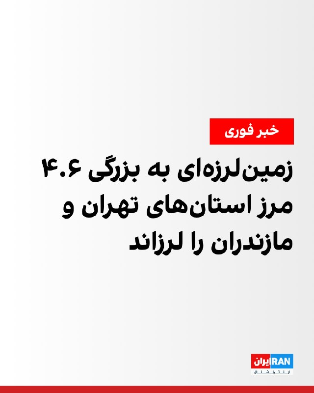
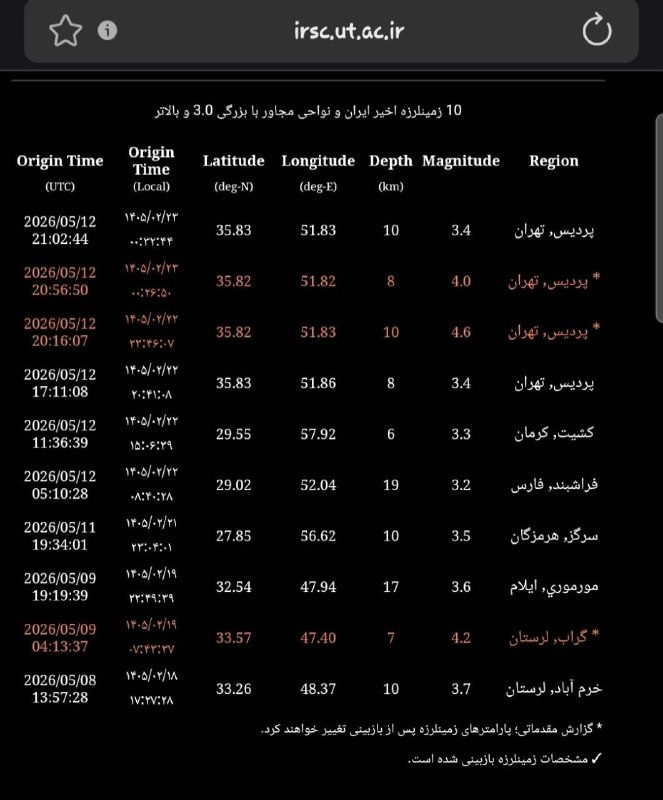
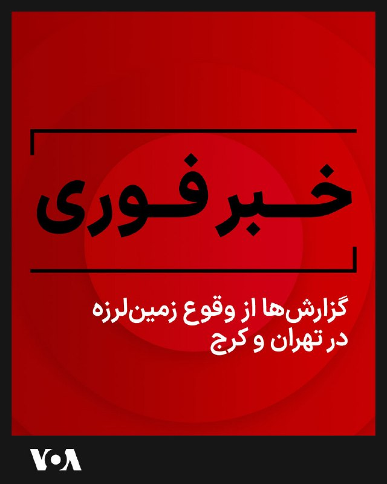
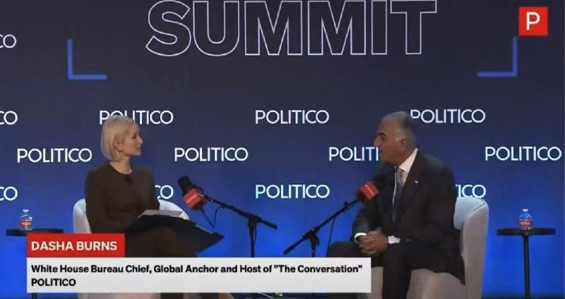
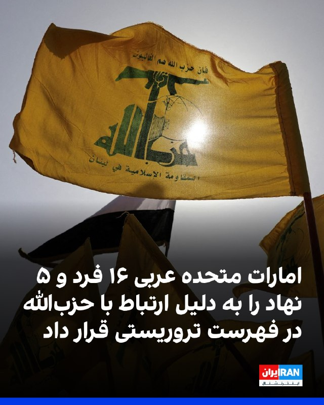
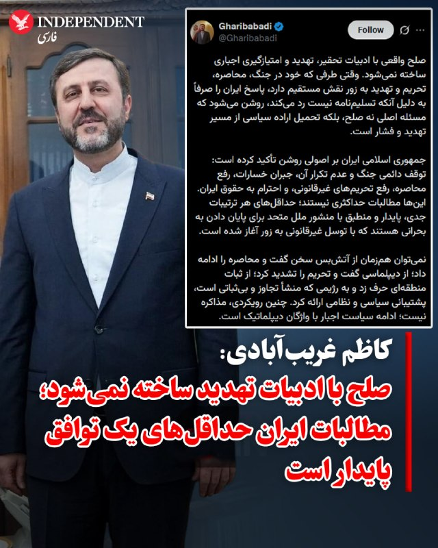
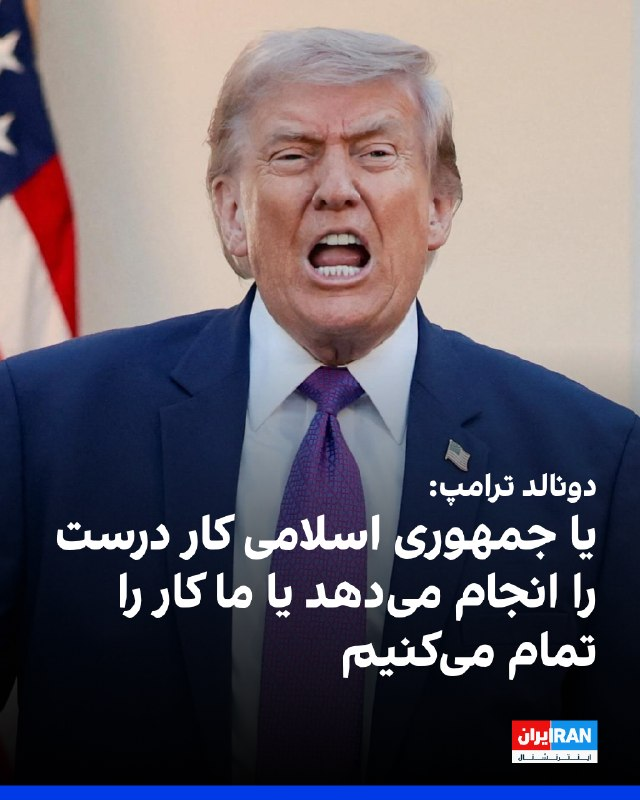
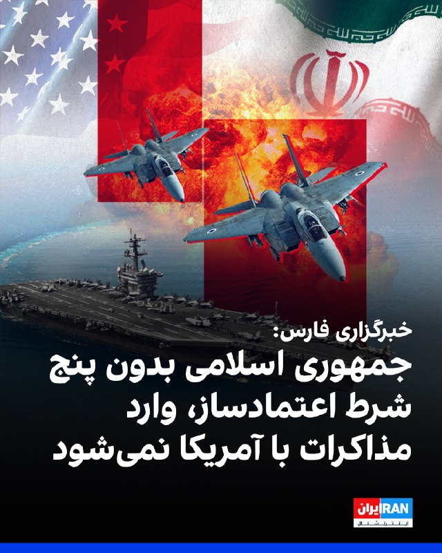
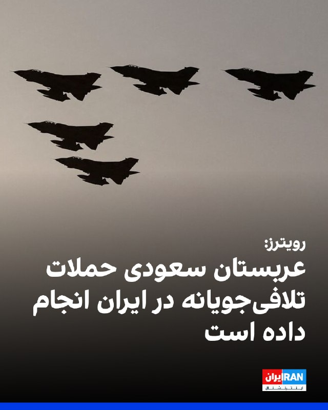
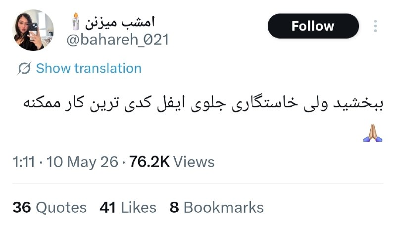

# خواننده تلگرام

<!-- TOP_NAV START -->

<a href="https://github.com/morii86/aio-downloader/blob/main/telegram/content/archive_1.md" style="display:inline-block; padding:6px 12px; margin:0 4px; background-color:#2ea44f; color:white; text-decoration:none; border-radius:4px; font-weight:bold;">صفحه بعد</a>

<!-- TOP_NAV END -->

<!-- MSG START -->

---
📅 بروزرسانی: 1405/02/23 00:59
---

## VahidOOnLine — post 239800

  <a href="telegram/content/VahidOOnLine_239800_1778621366.mp4" target="_blank">🎬 Download video</a>

رئیس سازمان هلال احمر اعلام کرد زلزله در تهران و کرج «هیچ» خسارت مالی و جانی در پی نداشته است.
پیش‌تر زلزله‌ای به بزرگی ۴.۶ در مقیاس ریشتر، مرز استان‌های تهران و مازندران را لرزاند.
‌🏁 🇬🇧 ManotoTV

🤖 @VahidOOnLine

## VahidOOnLine — post 239799

  

♦️به گزارش مرکز لرزه‌نگاری ایران، در نخستین ساعت بامداد چهارشنبه، ۲۳ اردیبهشت‌ماه، وقوع دو پس‌لرزه به‌ترتیب به بزرگی ۴ و ۳.۴ در پردیس، تهران را لرزاند. براساس گزارش فارس، این پس‌لرزه‌ها در ورامین، پاکدشت، پردیس و بخش‌هایی از شمیرانات حس شده است. پیش از این، زلزله به بزرگی ۴.۶ در مرز تهران و مازندران رخ داد که پردیس مرکز آن اعلام شد.
‌🇸🇦 Indypersian

🤖 @VahidOOnLine

## VahidOOnLine — post 239798

  

♦️دونالد ترامپ، رئیس‌جمهوری ایالات متحده، با انتشار پیامی در شبکه اجتماعی «تروث سوشال»، گزارش‌های رسانه‌ها درباره موفقیت‌های نظامی جمهوری اسلامی در برابر آمریکا را «دروغین» و مصداق عینی «خیانت» خواند و گفت: «این اظهارات مضحک تنها به ایران امیدی واهی می‌دهد؛ این‌ها ترسوهای آمریکایی هستند که علیه کشور خودشان ریشه می‌دوانند و با حمایت از دشمن، به آن‌‌ها کمک می‌کنند.» ترامپ با اشاره به نابودی توان نظامی جمهوری اسلامی گفت: «ایران درگیر یک فاجعه اقتصادی است.» او در پایان تاکید کرد که تنها «بازندگان، افراد ناسپاس و احمق‌ها» می‌توانند علیه آمریکا استدلال کنند.
‌🇸🇦 Indypersian

🤖 @VahidOOnLine

## VahidOOnLine — post 239797

  

♦️به گزارش ایرنا، مرکز زمین‌لرزه سه‌شنبه‌شب تهران، در مرز این استان با مازندران در حوالی پردیس بوده است. براساس این گزارش، این زلزله به بزرگی ۴.۶، ساعت ۲۳:۴۶:۰۷ سه‌شنبه‌شب، ۲۲ اردیبهشت‌ماه، در عمق ۱۰ کیلومتر رخداد و حدود ۱۰ ثانیه به طول انجامید. همزمان، سخنگوی اورژانس تهران اعلام کرد در پی زمین لرزه در تهران تا این لحظه مصدومی گزارش نشده است
‌🇸🇦 Indypersian

🤖 @VahidOOnLine

## VahidOOnLine — post 239796

  

♦️خبرگزاری تسنیم، وابسته به سپاه پاسداران، گزارش داد عباس عراقچی، وزیر خارجه جمهوری اسلامی، در دیدار با معاون وزیر خارجه نروژ، مدعی شد «فقدان حسن‌نیت، زیاده‌خواهی و عدم صداقت آمریکا» مهم‌ترین مانع پایان قطعی جنگ و دستیابی به توافق احتمالی است. او همچنین آمریکا و اسرائیل را عامل وضعیت جاری در تنگه هرمز معرفی کرد و گفت جمهوری اسلامی در حال بررسی تدوین مقررات مرتبط با این آبراه بر اساس حقوق بین‌الملل است.
‌🇸🇦 Indypersian

🤖 @VahidOOnLine

## VahidOOnLine — post 239795

  

دونالد ترامپ در شبکه تروث سوشال نوشت وقتی رسانه‌های «جعلی» می‌گویند دشمن ایرانی از نظر نظامی در برابر آمریکا عملکرد خوبی دارد، این نوعی خیانت است، زیرا چنین ادعایی کاملا نادرست و حتی مضحک است.
او افزود: آن‌ها در حال کمک به دشمن هستند و به جمهوری اسلامی امید می‌دهند در حالی که نباید هیچ امیدی برای او وجود داشته باشد.
‌🏁 🇬🇧 IranintlTV

🤖 @VahidOOnLine

## VahidOOnLine — post 239794

  

علی احتشام، امام جمعه کاشان گفت: «جمهوری اسلامی نه یکی از چهار قدرت، بلکه تنها ابرقدرت جهان است و ملت ایران هشت کشور منطقه و آمریکا را از کمال ارتفاع ساقط کرد و امروز با حضور در خیابان‌ها اجازه نداد جام زهر دیگری نوشیده شود.»

او افزود: «اگر مردم کف خیابان نبودند، چه بسا جام زهر دیگری نوشیده می‌شد.»
‌🏁 🇬🇧 IranintlTV

🤖 @VahidOOnLine

## VahidOOnLine — post 239793

  

♦️به گزارش فارس، زلزله‌ای به بزرگی ۴.۶، سه‌شنبه‌شب، ۲۲ اردیبهشت‌ماه، مرز تهران و مازندران را لرزاند.
‌🇸🇦 Indypersian

🤖 @VahidOOnLine

## VahidOOnLine — post 239792

  

رسانه‌های ایران از وقوع زمین‌لرزه به بزرگی ۴.۶ در مرز استان‌های تهران و مازندران خبر دادند.

خبرگزاری فارس همچنین از زمین‌لرزه در کرج خبر داد.

همزمان خبرگزاری دولتی ایرنا گزارش داد زمین‌لرزه در تهران حدود ۱۰ ثانیه طول کشیده است.
‌🏁 🇬🇧 IranintlTV

🤖 @VahidOOnLine

## VahidOOnLine — post 239790

  <a href="telegram/content/VahidOOnLine_239790_1778621374.mp4" target="_blank">🎬 Download video</a>

‌
خبرگزاری‌های داخل ایران گزارش دادند دقایقی پیش زلزله تهران و کرج را لرزاند. به گزارش این خبرگزاری‌ها سمت شرق تهران زمین‌لرزه بسیار شدیدتر بوده است.
‌🏁 🇬🇧 ManotoTV

🤖 @VahidOOnLine

## VahidOOnLine — post 239789

  

سعید سیاه‌سرانی، دبیر ستاد راهیان نور دریایی، گفت: «بدون اراده جمهوری اسلامی اجازه عبور حتی یک لیتر نفت از تنگه هرمز داده نمی‌شود.»

او افزود: «تنگه هرمز جزو خاک ما است، شناورهایی که رد می‌شوند باید اجازه بگیرند و به زبان فارسی صحبت کنند و از نقاطی که ما تعیین می‌کنیم عبور کنند.»
‌🏁 🇬🇧 IranintlTV

🤖 @VahidOOnLine

## VahidOOnLine — post 239788

  

♦️وزارت امور خارجه جمهوری اسلامی روز سه‌شنبه ۲۲ اردیبهشت، بازداشت چهار نفر توسط کویت را که گفته می‌شود با سپاه پاسداران در ارتباط هستند، محکوم کرد. این وزارتخانه اعلام کرد که این افراد در حال گشت‌زنی دریایی بوده‌اند و تنها به دلیل «اختلال در سیستم ناوبری» وارد آب‌های سرزمینی این کشور حوزه خلیج فارس شده‌اند.

همچنین وزارت خارجه جمهوری اسلامی اظهارات مقامات کویتی مبنی بر برنامه‌ریزی ایران برای انجام «اقدامات خصمانه» علیه این کشور را به شدت رد کرد. این تنش دیپلماتیک در حالی رخ می‌دهد که امنیت دریانوردی در منطقه به موضوعی حساس تبدیل شده است.
‌🇸🇦 Indypersian

🤖 @VahidOOnLine

## mwarmonitor — post 9009

  

📰(رویترز) - کلودیا شینباوم، رئیس‌جمهور مکزیک، روز دوشنبه اعلام کرد که از همکاری مقامات سفارت آمریکا با ایالت شمالی «چی‌واوا» برای مبارزه با کارتل‌های مواد مخدر اطلاعی نداشته است. وی در پی کشته شدن این مقامات در یک تصادف رانندگی، گفت که دولتش بررسی خواهد کرد…

## mwarmonitor — post 9008

  

🇺🇸✈️🇨🇳 ترامپ واشنگتن را به مقصد پکن، چین ترک کرد.

هواپیمای ریاست‌جمهوری آمریکا (Air Force One) بوئینگ VC-25A با شماره ثبت 92-9000

@mwarmonitor

## mwarmonitor — post 9007

📝 به نظر می‌رسد سیستمِ مدیریتِ بلایایِ الهی هم به این نتیجه رسیده که در ایران، مرگِ تدریجی دیگر از مد افتاده و باید کمی هیجان و سرعت به فرآیندِ انقراضِ ما تزریق کند. انگار فرشته‌ی عذاب نشسته بالای سرِ تقویمِ تهران و با خودش می‌گوید: «خب، این‌ها که تحریم هستند،…

## mwarmonitor — post 9005

✈️پرواز بمب‌افکن‌های راهبردی از نوع B-1B Lancer از پایگاه RAF Fairford ✈️به‌طور جالب توجهی، بمب‌افکن تک‌فروندی B-1B با نام “Lancer” که از RAF Fairford (کد EGVA) پرواز می‌کند (و چهلمین مأموریت آموزشی از این پایگاه از زمان آغاز آتش‌بس را انجام می‌دهد)، موقعیت…

## mwarmonitor — post 9004

🇮🇱اسرائیل نگران است که ترامپ با ایران یک «توافق بد» امضا کند؛ توافقی که برنامه هسته‌ای ایران را تا حدی دست‌نخورده باقی بگذارد و برنامه موشکی بالستیک ایران و همچنین حمایت این کشور از نیروهای نیابتی منطقه‌ای را نادیده بگیرد - CNN

🇮🇱یک مقام اسرائیلی به CNN گفته است: «اگر هیچ توافقی حاصل نشود خوشحال خواهیم شد» و «اگر محاصره/بسته بودن تنگه هرمز ادامه پیدا کند هم خوشحال خواهیم شد».

@mwarmonitor

## mwarmonitor — post 9003

🔸خبرنگار: آقای رئیس‌جمهور، پیامتان به مردم چین در آستانه این نشست (اجلاس سران) چیست؟ 🔹ترامپ: این است که ما برای دهه‌های متمادی، رابطه‌ی فوق‌العاده‌ای خواهیم داشت. رابطه‌ی من با رئیس‌جمهور «شی»، رابطه‌ای بی‌نظیر است؛ ما همیشه با هم کنار آمده‌ایم. ما با چین…

## mwarmonitor — post 9002

  

«وقتی «اخبار جعلی» (Fake News) می‌گویند که دشمن ایرانی از نظر نظامی در برابر ما خوب عمل می‌کند، این عملاً به مثابه خیانت است، زیرا چنین اظهارنظری کذب و حتی مضحک است. آن‌ها در حال کمک و یاری رساندن به دشمن هستند!
تمام کاری که این کار انجام می‌دهد، دادن امید واهی به ایران است، در حالی که هیچ امیدی نباید وجود داشته باشد. این‌ها ترسوهای آمریکایی هستند که علیه کشورمان فعالیت می‌کنند. ایران ۱۵۹ کشتی در نیروی دریایی خود داشت — اکنون تک‌تک آن کشتی‌ها در کف دریا آرام گرفته‌اند. آن‌ها دیگر نیروی دریایی ندارند، نیروی هوایی‌شان از بین رفته، تمام تکنولوژی‌شان نابود شده، «رهبرانشان» دیگر در میان ما نیستند و این کشور یک فاجعه اقتصادی است.
فقط بازنده‌ها، ناسپاس‌ها و احمق‌ها می‌توانند علیه آمریکا استدلال کنند!

رئیس‌جمهور دونالد جی. ترامپ»

@mwarmonitor

## mwarmonitor — post 9001

تهران یه بچه زلزله امده

## mwarmonitor — post 9000

🔸خبرنگار: تالار پذیرایی شما چه تفاوتی با بقیه دارد؟ 🔹دونالد ترامپ: اتفاقی که افتاده این است که ما یک تالار پذیرایی داریم که هزینه‌اش کمتر از بودجه پیش‌بینی شده بوده، دقیقاً همین‌جا در حال ساخت است. من اندازه‌اش را دو برابر کردم چون مسلماً به آن نیاز داریم.…

## mwarmonitor — post 8999

🔸خبرنگار: آقای رئیس‌جمهور، شما قول داده بودید که تورم را پایین بیاورید. اما الان در بالاترین سطح خود در سه سال اخیر است. آیا سیاست‌های شما کار نمی‌کنند؟ چه اتفاقی دارد می‌افتد؟ 🔹ترامپ: سیاست‌های من فوق‌العاده خوب کار می‌کنند. اگر به زمان دقیقاً قبل از شروع…

## mwarmonitor — post 8998

🔸خبرنگار: آقای رئیس‌جمهور، تا چه زمانی به مذاکره با ایران ادامه می‌دهید؟ (چه زمانی مذاکره با ایران تمام می‌شود؟) 🔹ترامپ: خب، خواهیم دید چه پیش می‌آید. ما فقط یک توافق خوب خواهیم کرد. ارتش آن‌ها از بین رفته، نابود شده است. ما فقط یک توافق خوب خواهیم کرد و خواهیم…

## mwarmonitor — post 8997

🔸خبرنگار: آقای رئیس‌جمهور، تا چه زمانی به مذاکره با ایران ادامه می‌دهید؟ (چه زمانی مذاکره با ایران تمام می‌شود؟)
🔹ترامپ: خب، خواهیم دید چه پیش می‌آید. ما فقط یک توافق خوب خواهیم کرد. ارتش آن‌ها از بین رفته، نابود شده است. ما فقط یک توافق خوب خواهیم کرد و خواهیم دید چه می‌شود. اما من معتقدم که به هر شکلی، این [توافق] برای مردم آمریکا و در واقع برای مردم ایران بسیار خوب خواهد بود.
🔸خبرنگار: آیا شما پاکستانی‌ها را به عنوان میانجی در نظر می‌گیرید؟
🔹ترامپ: نه، آن‌ها عالی هستند. من فکر می‌کنم پاکستانی‌ها عالی بوده‌اند. فیلد مارشال و نخست‌وزیر پاکستان مطلقاً عالی بوده‌اند.
🔸خبرنگار: آقای رئیس‌جمهور، پیام شما به رئیس‌جمهور "شی" [رئیس‌جمهور چین] در رابطه با جنگ ایران چیست؟
🔹ترامپ: خب، فکر می‌کنم اولاً ما در مورد آن صحبت مفصلی خواهیم داشت. فکر می‌کنم او نسبتاً خوب بوده است، اگر صادقانه بگویم. به محاصره نگاه کنید، مشکلی نیست. آن‌ها مقدار زیادی از نفت خود را از آن منطقه می‌گیرند. ما مشکلی نداشتیم و او دوست من بوده است، کسی است که با هم کنار می‌آییم. و فکر می‌کنم خواهید دید که اتفاقات خوبی رخ خواهد داد. این سفر بسیار هیجان‌انگیزی خواهد بود و اتفاقات خوب زیادی خواهد افتاد.
🔸خبرنگار: آقای رئیس‌جمهور، آیا فکر می‌کنید او (رئیس‌جمهور چین) اصلاً نیاز دارد در مورد ایرانی‌ها مداخله کند؟ فکر می‌کنید او می‌تواند به هر شکلی کمک کند؟
🔹ترامپ: نه، فکر نمی‌کنم در مورد ایران به کمکی نیاز داشته باشیم. ما به هر شکلی پیروز می‌شویم. ما به صورت مسالمت‌آمیز یا غیر از آن پیروز می‌شویم. نیروی دریایی آن‌ها رفته، نیروی هوایی‌شان رفته، تک‌تک عناصر ماشین جنگی آن‌ها از بین رفته است. آن‌ها افراد زیادی را کشته‌اند، حداقل ۴۲ هزار نفر را در یک ماه و نیم گذشته کشته‌اند. ما پیروز می‌شویم، مهم نیست چطور حساب کنید.
🔸خبرنگار: آقای رئیس‌جمهور، آیا معتقدید سفر شما به چین بر اقتصاد بین‌الملل و قیمت نفت تأثیر خواهد گذاشت؟
🔹ترامپ: تأثیر مثبتی خواهد داشت. ما دیدار بسیار خوبی خواهیم داشت. من با رئیس‌جمهور شی صحبت کردم. هر دوی ما مشتاقانه منتظر این دیدار هستیم. عالی خواهد بود.
🔸خبرنگار: آقای رئیس‌جمهور، خط قرمز شما برای پایان دادن به این آتش‌بس چه خواهد بود؟ چه چیزی باعث می‌شود که شما همکاری را قطع کنید؟
🔹ترامپ: خب، خواهیم دید. در طول پرواز به آن فکر خواهیم کرد و برای مدتی در موردش تأمل می‌کنیم. اما ما ارتش آن‌ها را به سختی شکست داده‌ایم، آن تمام شده است. محاصره بسیار مؤثر است، ۱۰۰ درصد مؤثر بوده است. و به هر شکلی، همه چیز خیلی خوب پیش خواهد رفت. فکر می‌کنم آن‌قدر نفت خواهید داشت که مثل گذشته فوران نفت (فراوانی نفت) داشته باشید. بنابراین وقتی قیمت نفت کمی بالا می‌رود... من فکر می‌کردم اگر به سه چهار ماه پیش، زمانی که در حال برنامه‌ریزی بودیم برگردید، قیمت خیلی بیشتر بالا برود. دیروز قیمت ۹۹ دلار بود. و اگر به آن فکر کنید، من کل روز آن [قیمت] را می‌پذیرفتم (با آن قیمت مشکلی نداشتم).

@mwarmonitor

## mwarmonitor — post 8996

## pm_afshaa — post 90665

  <a href="telegram/content/pm_afshaa_90665_1778621379.webm" target="_blank">🎬 Download video</a>

🔴سی‌ان‌ان: اسرائیل نگرانه ترامپ ممکنه قبل از حل کامل مسائل اصلی جنگ، با ایران به یه توافق سریع برسه. ترس اصلی اینه که ترامپ از روند مذاکرات خسته بشه و هر توافقی حتی با امتیازهای لحظه آخری رو قبول کنه.

اسرائیل میگه آمریکا درباره اورانیوم غنی‌شده اطمینان داده، ولی نگرانی اصلیشون اینه که موضوع موشک‌های بالستیک و شبکه نیروهای نیابتی ایران اصلاً تو توافق نیاد.
همچنین می‌ترسن یه توافق نصفه‌نیمه باعث بشه تحریم‌ها سبک بشه و ایران دوباره از نظر اقتصادی و سیاسی قوی‌تر بشه.

💧Rainbet.com the #1 Non-KYC Crypto Casino & Sportsbook @rainbetcom

😁 @Pm_Afshaa

## pm_afshaa — post 90664

  <a href="telegram/content/pm_afshaa_90664_1778621379.webm" target="_blank">🎬 Download video</a>

🔴دو زمین لرزه 4 و 3.4 ریشتری در فاصله 6 دقیقه در پردیس تهران

💧 Rainbet.com the #1 Non-KYC Crypto Casino & Sportsbook @rainbetcom

😁 @Pm_Afshaa

## pm_afshaa — post 90663

این یکی کمتر بود پس لرزه بود

## pm_afshaa — post 90662

  <a href="telegram/content/pm_afshaa_90662_1778621380.webm" target="_blank">🎬 Download video</a>

🔴زلزله مجدد در تهران

💧 Rainbet.com the #1 Non-KYC Crypto Casino & Sportsbook @rainbetcom

😁 @Pm_Afshaa

## pm_afshaa — post 90661

  <a href="telegram/content/pm_afshaa_90661_1778621381.webm" target="_blank">🎬 Download video</a>

ساعت ۸ یه زلزله پردیس تهران اومد الانم یه زلزله مرز تهران و مازندران امشب رو مراقب و هوشیار باشید

## pm_afshaa — post 90660

  <a href="telegram/content/pm_afshaa_90660_1778621381.webm" target="_blank">🎬 Download video</a>

🔴پست جدید ترامپ:

وقتی رسانه‌های فیک‌نیوز می‌گویند دشمن ایرانی از نظر نظامی مقابل ما عملکرد خوبی دارد، این عملاً نوعی خیانت است، چون چنین ادعایی کاملاً دروغ و حتی مضحک است. آن‌ها دارند به دشمن کمک می‌کنند و به او امید واهی می‌دهند، در حالی که هیچ امیدی نباید وجود داشته باشد. این‌ها آمریکایی‌های ترسویی هستند که علیه کشور ما موضع گرفته‌اند. ایران ۱۵۹ کشتی در نیروی دریایی خود داشت — حالا تک‌تک آن‌ها در کف دریا قرار دارند. آن‌ها دیگر نیروی دریایی ندارند، نیروی هوایی‌شان از بین رفته، تمام فناوری‌شان نابود شده، «رهبرانشان» دیگر در میان ما نیستند و کشورشان به یک فاجعه اقتصادی تبدیل شده است. فقط بازنده‌ها، ناسپاس‌ها و احمق‌ها می‌توانند علیه آمریکا استدلال کنند!

💧 Rainbet.com the #1 Non-KYC Crypto Casino & Sportsbook @rainbetcom

😁 @Pm_Afshaa

## pm_afshaa — post 90659

  

کانون زلزله لحظات قبل تهران

💧 Rainbet.com the #1 Non-KYC Crypto Casino & Sportsbook @rainbetcom

😁 @Pm_Afshaa

## pm_afshaa — post 90658

ساعت ۸ یه زلزله پردیس تهران اومد
الانم یه زلزله مرز تهران و مازندران
امشب رو مراقب و هوشیار باشید

## pm_afshaa — post 90657

فک کنم خدا گفته ترامپ خایه نداره بزار خودم بزنم

## pm_afshaa — post 90656

امشب هم طوفان داشتیم هم زلزله

## pm_afshaa — post 90655

  <a href="telegram/content/pm_afshaa_90655_1778621383.webm" target="_blank">🎬 Download video</a>

🔴مرکز لرزه‌نگاری: لحظاتی پیش زلزلهٔ 4.6 ریشتری مرز استان‌های تهران و مازندران رو لرزوند. 
💧 Rainbet.com the #1 Non-KYC Crypto Casino & Sportsbook @rainbetcom 
😁 @Pm_Afshaa

## pm_afshaa — post 90654

  <a href="telegram/content/pm_afshaa_90654_1778621384.webm" target="_blank">🎬 Download video</a>

🔴مرکز لرزه‌نگاری:
لحظاتی پیش زلزلهٔ 4.6 ریشتری مرز استان‌های تهران و مازندران رو لرزوند.

💧 Rainbet.com the #1 Non-KYC Crypto Casino & Sportsbook @rainbetcom

😁 @Pm_Afshaa

## pm_afshaa — post 90653

میگید زلزله کجا بود یا تست اتم رو دوباره بیاریم وسط

## pm_afshaa — post 90651

زلزله ۳.۴ ریشتر پردیس که چنلا دارن میزنن واسه ساعت ۸/۹ شب بود واسه الان نیست

## pm_afshaa — post 90650

  <a href="telegram/content/pm_afshaa_90650_1778621384.webm" target="_blank">🎬 Download video</a>

🔴زلزله نسبتا شدید در تهران

💧 Rainbet.com the #1 Non-KYC Crypto Casino & Sportsbook @rainbetcom

😁 @Pm_Afshaa

## DEJradio — post 4600

  <a href="telegram/content/DEJradio_4600_1778621385.webm" target="_blank">🎬 Download video</a>

🚨
🔸 حامد فرد هنرمند ملی‌گرا موزیک ویدیو «موشتباه» را منتشر کرد. او در صفحه اینستاگرام خود نوشته دو و ماه و نیم از کشته شدن علی خامنه‌ای گذشته اما جسدش را دفن نکرده‌اند و مضحک ماجرا اینجاست که مراسم چهلمش را در یک کلیسا در تهران برگزار کردند؛ آن هم چهلم کسی را که در تمام دوران حکومت ظالمانه‌اش نه‌تنها آزادی مذهب وجود نداشت، بلکه پیروان آیین مسیح و نوکیشان مسیحی تحت آزار و سـ.ـرکوب قرار داد.

او تأکید کرد کشته شدن خامنه‌ای هرچند برای بسیاری از مردم ایران مرهمی بر دل‌های خونین و زخمی بود، اما چیزی جز یک مُسکن کوتاه‌مدت و موقتی نبود و نیست. عطش انتـ.ـقام ما ملت ایران با حذف یک نفر پایان پیدا نمی‌کند.»

حامد فرد تأکید کرد «تا زمانی که حقیقت تمام جـ.ـنایت‌ها ا آشکار نشود، تا زمانی که خانواده‌های قربانیان دادخواهی نکنند، و تا زمانی که جمهوری اسلامی و تمام نمادها، ساختارها و نشانه‌های آن به‌طور کامل از ایران برچیده نشوند، آرام نخواهیم گرفت. ما تا اانـ.ـقام تمام قربانیان این رژیم اهریمنی، از بهمن شوم ۵۷ تا امروز را نگیریم، از پا نخواهیم نشست.»

#موشتبا #جمهوری_اسلامی
@DEJradio

## DEJradio — post 4599

  <a href="telegram/content/DEJradio_4599_1778621386.mp4" target="_blank">🎬 Download video</a>

🔺📢 پیام شهروندان در #تهران در واکنش به تهدید جنسی دانش‌آموزان مدرسه دخترانه شرافت در منطقه ۱۳ تهران: سکوت نکنیم، امروز مدرسه شرافت بود فردا مدرسه‌ای دیگر.

#مدرسه_شرافت #جمهوری_اسلامی
@DEJradio

## DEJradio — post 4598

  <a href="telegram/content/DEJradio_4598_1778621388.mp4" target="_blank">🎬 Download video</a>

🚨
🔸 شهرام سبزواری کارشناس نظامی با اشاره به استقرار تکاوران تیپ ۴۵ شوشتر در اطراف تاسیسات اتمی اصفهان بیان می‌کند احتمال عملیات زمینی برای خارج کردن اورانیوم‌ها از ایران زیاد است و همزمان ممکن است پشت صحنه بین دولت‌ها و برخی فرماندهان داخلی توافق‌هایی صورت گرفته باشد و پیامد آن قربانی شدن نیروهای تامینی باشد.

#تاسیسات_اتمی #جمهوری_اسلامی
@DEJradio

## DEJradio — post 4597

  <a href="telegram/content/DEJradio_4597_1778621390.mp4" target="_blank">🎬 Download video</a>

🔺📢 یک شهروند از تهران با ارسال ویدیویی به دژ نوشت، عامل تعرض به دانش‌آموزان مدرسه شرافت مزدور بودند.
براساس آخرین خبرها پیگیری خانواده این دختران و شکایت آنها از نیروهای امنیتی که دختران را تهدید به تجاوز کرده‌اند بی‌نتیجه مانده است.

#مدرسه_شرافت #جمهوری_اسلامی
@DEJradio

## DEJradio — post 4596

  <a href="telegram/content/DEJradio_4596_1778621392.webm" target="_blank">🎬 Download video</a>

🚨
⭕️ دقایقی پیش زلزله، تهران وکرج را لرزاند.
بر اساس گزارش‌های منتشر شده زلزله‌ای باقدرت ۳/۴ دهم ریشتر دقایقی پیش شهر پردیس را لرزاند و منجر به قطعی برق در برخی مناطق شد.

#فوری #زلزله
@DEJradio

## mamlekate — post 103517

📝 سلام ساعت ۲۳:۴۵ چیتگر لرزید

📝 ۲۲ اردیبهشت - ۲۳:۴۸ - غرب تهران یه چیزی مثل زلزله حس کردیم.

📝 سلام لرزش عجیب و بی صدای تهران شرق و جنوب شرق ساعت ۱۱:۴۶

📝 ستارخان تهران رو تخت خوابیده بودم قشنگ زیرم تکون خورد و لرزید بعد هم سبد وسیله ها تکون خورد و لوسترها ،کامل لرزیدم فکر کردم سرگیجه گرفتم ولی زلزله بود طول کشید چند ثانیه

📝 منم توی رودهن هستم و لرزش اولش ضعیف و بعد خیلی شدید شد. صدا نداشت اما خیلی لرزش کوتاه اما ترسناکی بود

@mamlekate

## VahidOnline — post 75438

  

لرزش چهارم
[آپدیت: اضافه شدن تصویر دریافتی بالا]
پیام‌های دریافتی:

دوباره لرزید شرق همین الان 12:33

بازم اومد ولی ریزتر از قبلی

همین الان دوباره لرزید (نارمک ) ۰۰:۳۳

من الان دوباره لرزیدم

وحیددد نزدیک چهاربار تو پردیس زلزله اومد نمیدونی تختم چجوری میلرزید

📡 @VahidOnline

## VahidOnline — post 75437

زمین‌لرزه دیگری به بزرگی ۴
این میشه سومین بار ظرف چند ساعت گذشته! اولین باردر شرق استان احساس شد و پیام‌ها از پردیس و بومهن و دماوند بود و یکی هم از لواسان]
پیام‌های دریافتی لرزش سوم:

تهران مجددا لرزید

دوباره لرزید کمی خفیف‌تر

وحید جان دوباره لرزیدیم شرق تهران .. ۲۷

دوباره! پس لرزه بود.

دوباره هم اومد ولی ضعیف بود خوشبختانه

وحید جان شاید باورت نشه اما سومیش هم همین الان اومد، منتها خیلی کوتاه و کم بود...

ان، زلزله، ۰۰:۲۷
باز اومد، کوتاه، شاید پس لرزه باشه

دوباره اومد
یعنی اون رفت این برگشت

دوباره زلزله اومد

باز هم لرزش ۱۲:۲۷

سلام بازم لرزید حدود دو سه دقیقه پیش طوفانم هست خدا رحم کنه تو این شرایط فقط بلایای طبیعی کم داریم

اینجا ازگل، ۱۲:۲۷دقیقه، دوباره لرزید

🔄 رسانه‌های داخلی به نقل از مرکز لرزه‌نگاری:
🔹بزرگی: ۴
🔹محل وقوع: حوالی پرديس
🔹زمان: ۲۶ دقیقه بامداد
🔹عمق زمین‌لرزه: ۸ کیلومتر

🔹نزدیک‌ترین شهرها:
۹ کیلومتری پرديس (تهران)
۱۱ کیلومتری بومهن (تهران)
۱۲ کیلومتری رودهن (تهران)

🔹نزدیکترین مراکز استان:
۴۰ کیلومتری تهران
۷۶ کیلومتری كرج

📡 @VahidOnline

## VahidOnline — post 75436

  

پست ترامپ، ترجمه ماشین:
وقتی «رسانه‌های جعلی» می‌گویند دشمن ایرانی از نظر نظامی در برابر ما عملکرد خوبی دارد، این عملاً خیانت است؛ چون چنین ادعایی کاملاً دروغ و حتی مضحک است. آن‌ها به دشمن کمک و از او حمایت می‌کنند! تنها نتیجه‌اش این است که به ایران امیدی واهی می‌دهد؛ در حالی که اصلاً نباید چنین امیدی وجود داشته باشد. این‌ها بزدل‌های آمریکایی هستند که علیه کشور خودمان طرف می‌گیرند.

ایران ۱۵۹ کشتی در نیروی دریایی خود داشت؛ تک‌تک آن کشتی‌ها اکنون در کف دریا آرمیده‌اند. آن‌ها دیگر نیروی دریایی ندارند، نیروی هوایی‌شان از بین رفته، تمام فناوری‌شان نابود شده، «رهبران»شان دیگر در میان ما نیستند، و کشورشان یک فاجعه اقتصادی است.

فقط بازنده‌ها، ناسپاس‌ها و احمق‌ها می‌توانند علیه آمریکا استدلالی مطرح کنند!

رئیس‌جمهور دونالد جی. ترامپ
realDonaldTrump

📡 @VahidOnline

## VahidOnline — post 75435

"وحید تهران لرزید"

+ ده‌ها پیام دریافتی مشابه درباره احساس لرزش زمین در مناطق مختلف تهران

حدود سه ساعت پیش هم حوالی پردیس و بومهن در شرق استان تهران زمین‌‌لرزه خفیف‌تری حس شده بود.

🔄 رسانه‌های داخلی:
زمین‌لرزه‌ای به بزرگی ۴.۶ ساعت ۲۳:۴۶ امشب مرز استان‌های تهران و مازندران را لرزاند.
این زلزله در حوالی شهر پردیس و در عمق ۱۰ کیلومتری زمین به وقوع پیوسته و در بخش‌هایی از پایتخت نیز احساس شده است.
بزرگی: 4.6
محل وقوع: مرز استانهای تهران و مازندران - حوالی پرديس
تاریخ و زمان وقوع به وقت محلی: 1405/02/22 23:46:07
طول جغرافیایی: 51.83
عرض جغرافیایی: 35.82
عمق زمین‌لرزه: 10 کیلومتر

نزدیک‌ترین شهرها:
8 کیلومتری پرديس (تهران)
10 کیلومتری بومهن (تهران)
11 کیلومتری رودهن (تهران)

نزدیکترین مراکز استان:
41 کیلومتری تهران
77 کیلومتری كرج

📡 @VahidOnline

## IranIntlTV — post 336887

  <a href="telegram/content/IranIntlTV_336887_1778621393.mp4" target="_blank">🎬 Download video</a>

🔻علیرضا دبیر، رییس فدراسیون کشتی در گفتگویی با خبرنگاران مدعی شد فدراسیون و خانه کشتی در غرب تهران در تمام روزهای جنگ ۴۰ روزه، مورد هدف قرار گرفته است.

🔹او گفت بیش از ۱۵۰تا ۱۶۰ موشک به این محل اصابت کرده است.

🔹در هفته اول جنگ، ایران‌اینترنشنال گزارش داد که پس از آغاز حملات اسرائیل و آمریکا در نهم اسفندماه، به کارکنان و پرسنل فدراسیون‌ها و مراکز مستقر در مجموعه ورزشی آزادی در تهران دستور داده شد ساختمان‌ها و سالن‌های ورزشی این مجموعه را تخلیه کنند.

🔹طبق این اطلاعات، پس از تخلیه کارکنان، نیروهای حکومتی از جمله یگان ویژه و بسیج در بخش‌های مختلف این مجموعه مستقر شدند.

🔹پس از این ماموران در سالن‌های مختلف از جمله ورزشگاه ۱۲ هزار نفری آزادی و همچنین سالن‌ها و ساختمان‌های متعلق به فدراسیون‌های ورزشی از جمله کشتی، والیبال، بسکتبال و وزنه‌برداری مستقر شدند.

🔹در پی این اقدامات، سالن ۱۲ هزار نفری ورزشگاه آزادی در حملات هوایی روز پنجشنبه ۱۴ اسفند ۱۴۰۴، تخریب شد.

🔹به گفته علیرضا دبیر، برای بازسازی خانه کشتی، تاکنون بیش از ۴۰۰ میلیارد تومان هزینه شده است.

@iranintltvsport

## IranIntlTV — post 336885

  

دونالد ترامپ در شبکه تروث سوشال نوشت وقتی رسانه‌های «جعلی» می‌گویند دشمن ایرانی از نظر نظامی در برابر آمریکا عملکرد خوبی دارد، این نوعی خیانت است، زیرا چنین ادعایی کاملا نادرست و حتی مضحک است.
او افزود: آن‌ها در حال کمک به دشمن هستند و به جمهوری اسلامی امید می‌دهند در حالی که نباید هیچ امیدی برای او وجود داشته باشد.
https://iranintl.com/202605125060

## IranIntlTV — post 336884

  

علی احتشام، امام جمعه کاشان گفت: «جمهوری اسلامی نه یکی از چهار قدرت، بلکه تنها ابرقدرت جهان است و ملت ایران هشت کشور منطقه و آمریکا را از کمال ارتفاع ساقط کرد و امروز با حضور در خیابان‌ها اجازه نداد جام زهر دیگری نوشیده شود.»

او افزود: «اگر مردم کف خیابان نبودند، چه بسا جام زهر دیگری نوشیده می‌شد.»
https://iranintl.com/202605128116

## IranIntlTV — post 336883

  

رسانه‌های ایران از وقوع زمین‌لرزه به بزرگی ۴.۶ در مرز استان‌های تهران و مازندران خبر دادند.

خبرگزاری فارس همچنین از زمین‌لرزه در کرج خبر داد.

همزمان خبرگزاری دولتی ایرنا گزارش داد زمین‌لرزه در تهران حدود ۱۰ ثانیه طول کشیده است.
https://iranintl.com/202605123583

## IranIntlTV — post 336882

  

سعید سیاه‌سرانی، دبیر ستاد راهیان نور دریایی، گفت: «بدون اراده جمهوری اسلامی اجازه عبور حتی یک لیتر نفت از تنگه هرمز داده نمی‌شود.»

او افزود: «تنگه هرمز جزو خاک ما است، شناورهایی که رد می‌شوند باید اجازه بگیرند و به زبان فارسی صحبت کنند و از نقاطی که ما تعیین می‌کنیم عبور کنند.»
https://iranintl.com/202605123958

## IranIntlTV — post 336881

  <a href="telegram/content/IranIntlTV_336881_1778621398.mp4" target="_blank">🎬 Download video</a>

خبرگزاری رویترز به نقل از دو مقام غربی گزارش داد که عربستان سعودی در جریان جنگ اخیر در خاورمیانه، در واکنش به حملاتی که در خاک این کشور انجام شده بود، چند حمله هوایی اعلام‌نشده علیه مواضعی در ایران انجام داده است.

گفت‌وگو با شهرام خلدی، پژوهشگر تاریخ خاورمیانه و روابط بین‌الملل

@iranintltv

## IranIntlTV — post 336880

  <a href="telegram/content/IranIntlTV_336880_1778621401.mp4" target="_blank">🎬 Download video</a>

هم‌زمان با سفر ترامپ به چین، گزارش‌ها حاکی است جمهوری اسلامی از پکن خواسته پیام‌های خود را به واشینگتن منتقل کند و چین را به‌عنوان ضامن احتمالی هر توافق آینده مطرح کرده است. سفیر ایران در چین نیز گفته پکن با ارائه طرح‌های صلح و رایزنی‌های منطقه‌ای تلاش دارد مسیر گفت‌وگوها را باز نگه دارد.

گفت‌وگو با آرام حسامی، استاد علوم سیاسی کالج مونتگومری

@iranintltv

## Shin_Persian — post 5983

Shin ✓ @hey_itsmyturn
Tue, 12 May 2026 21:17:38 UTC

Someone wrote “Tehran is having a wild orgasm” in Telegram 😭😭😭

فارسی

یک نفر در تلگرام نوشته «تهران دارد به ارگاسم وحشیانه می‌رسد» 😭😭😭

𝕏 · @shin_persian

## Shin_Persian — post 5982

Shin ✓ @hey_itsmyturn
Tue, 12 May 2026 21:16:15 UTC

And another aftershock rn

فارسی

و یک پس‌لرزه دیگر همین الان

𝕏 · @shin_persian

## Shin_Persian — post 5981

Shin ✓ @hey_itsmyturn
Tue, 12 May 2026 21:06:37 UTC

And we are back at “It’s HAARP” dumbfucks.

فارسی

و دوباره برگشتیم سر احمق‌هایی که می‌گویند «کار هارپ (HAARP) است».

𝕏 · @shin_persian

## Shin_Persian — post 5980

Shin ✓ @hey_itsmyturn
Tue, 12 May 2026 21:00:34 UTC

Another earthquake shook Tehran just now

فارسی

همین الان زلزله دیگری تهران را لرزاند

𝕏 · @shin_persian

## Shin_Persian — post 5979

  

Shin ✓ @hey_itsmyturn Tue, 12 May 2026 20:25:23 UTC President Trump @POTUS: "When the Fake News says that the Iranian enemy is doing well, Militarily, against us, it’s virtual TREASON in that it is such a false, and even preposterous, statement. They are…

## Shin_Persian — post 5978

Shin ✓ @hey_itsmyturn
Tue, 12 May 2026 20:25:23 UTC

President Trump @POTUS:
"When the Fake News says that the Iranian enemy is doing well, Militarily, against us, it’s virtual TREASON in that it is such a false, and even preposterous, statement. They are aiding and abetting the enemy! All it does is give Iran false hope when none should exist. These are American cowards that are rooting against our Country. Iran had 159 ships in their Navy — Every single ship is now resting at the bottom of the sea. They have no Navy, their Air Force is gone, all Technology is gone, their “leaders” are no longer with us, and the Country is an Economic Disaster. Only Losers, Ingrates, and Fools are able to make a case against America! President DONALD J. TRUMP"

فارسی

رئیس‌جمهور ترامپ @POTUS:
«وقتی اخبار جعلی می‌گویند که دشمن ایرانی از نظر نظامی در برابر ما خوب عمل می‌کند، این در واقع خیانتی مجازی است، چرا که چنین ادعایی کذب و حتی مضحک است. آن‌ها در حال کمک و یاری رساندن به دشمن هستند! تمام کاری که این حرف‌ها انجام می‌دهد، دادن امید واهی به ایران است، در حالی که هیچ امیدی نباید وجود داشته باشد. این‌ها بزدلانی آمریکایی هستند که علیه کشورمان ریشه دوانده‌اند. ایران ۱۵۹ کشتی در نیروی دریایی خود داشت — اکنون تک‌تک آن کشتی‌ها در کف دریا آرام گرفته‌اند. آن‌ها دیگر نیروی دریایی ندارند، نیروی هوایی‌شان از بین رفته، تمام تکنولوژی‌شان نابود شده، "رهبرانشان" دیگر در میان ما نیستند و آن کشور یک فاجعه اقتصادی است. فقط بازنده‌ها، ناسپاس‌ها و احمق‌ها می‌توانند علیه آمریکا استدلال کنند! رئیس‌جمهور دونالد جی. ترامپ»

𝕏 · @shin_persian

## Shin_Persian — post 5977

Shin ✓ @hey_itsmyturn
Tue, 12 May 2026 20:17:27 UTC

Quake in Tehran right now.

فارسی

هم‌اکنون زلزله در تهران.

𝕏 · @shin_persian

## ManotoTV — post 105379

  <a href="telegram/content/ManotoTV_105379_1778621403.mp4" target="_blank">🎬 Download video</a>

رئیس سازمان هلال احمر اعلام کرد زلزله در تهران و کرج «هیچ» خسارت مالی و جانی در پی نداشته است.
پیش‌تر زلزله‌ای به بزرگی ۴.۶ در مقیاس ریشتر، مرز استان‌های تهران و مازندران را لرزاند.

## ManotoTV — post 105378

  <a href="telegram/content/ManotoTV_105378_1778621404.mp4" target="_blank">🎬 Download video</a>

شاهزاده رضا پهلوی در نشست امنیتی سالانه پولیتیکو گفت مردم ایران، نه نیروهای خارجی، باید نقش اصلی را در تغییر حکومت جمهوری اسلامی ایفا کنند؛ اما برای این کار به «حمایت و پوشش» نیاز دارند.

او گفت: «نیروهای روی زمین در ایران، خود مردم ایران هستند. ما نیازی نداریم نیروهای خارجی این کار را برای ما انجام دهند.»

شاهزاده رضا پهلوی با اشاره به سرکوب اعتراضات دی‌ماه گفت در کمتر از ۴۸ ساعت بیش از ۴۰ هزار نفر کشته شدند و افزود بدون حمایت، نمی‌توان از مردم انتظار داشت دوباره به خیابان‌ها بیایند.

او گفت: «به همین دلیل بود که به کارزار هوایی و پوشش هوایی نیاز داشتیم.»

شاهزاده رضا پهلوی همچنین تأکید کرد باید یک استراتژی روشن برای پایان دادن به جمهوری اسلامی وجود داشته باشد؛ استراتژی‌ای که هم مردم را برای قیام تشویق کند و هم زمینه پیوستن نیروهایی از ارتش و دستگاه امنیتی به مردم را فراهم سازد.

او افزود: «نمی‌شود از یک طرف گفت مردم قیام کنند و همزمان گفت در حال مذاکره هستیم؛ این همه را گیج می‌کند.»

شاهزاده رضا پهلوی همچنین گفت حملات انجام‌شده علیه جمهوری اسلامی، ملت ایران را هدف نگرفته بود، بلکه زیرساخت‌های سرکوب حکومت، از جمله دستگاه اطلاعاتی و سپاه پاسداران، را هدف قرار داده بود.

او افزود: «مردم آن‌قدر باهوش هستند که تفاوت میان حمله به ملت ایران و حمله به حکومت را تشخیص دهند.»

## ManotoTV — post 105377

  <a href="telegram/content/ManotoTV_105377_1778621407.mp4" target="_blank">🎬 Download video</a>

‌
خبرگزاری‌های داخل ایران گزارش دادند دقایقی پیش زلزله تهران و کرج را لرزاند. به گزارش این خبرگزاری‌ها سمت شرق تهران زمین‌لرزه بسیار شدیدتر بوده است.

## FarsiVOA — post 217578

🔺پرزیدنت ترامپ: بیان ادعاهای دروغین درباره مناسب بودن شرایط نظامی رژیم ایران «خیانت» است

▪️رئیس جمهوری ایالات متحده با انتقاد شدید از انتشار اخبار دروغین در برخی از رسانه‌ها و مطرح کردن ادعاهای «وضعیت خوب» رژیم ایران از لحاظ نظامی در مقابل ارتش آمریکا، آن‌ را «عملا خیانت» به کشور دانست.

⬇️ بیشتر بخوانید:
https://ir.voanews.com/a/trump-iran-nuclear-inflation-travel-china/8149296.html
@FarsiVOA

## FarsiVOA — post 217577

⚡️توافق امنیتی یا نقض حاکمیت؟ پشت‌ پرده فشار جمهوری اسلامی برای پاکسازی کامل مرزی با عراق
@FarsiVOA

## FarsiVOA — post 217576

  

⚡️رسانه‌های داخلی و منابع مردمی شامگاه سه‌شنبه ۲۲ اردیبهشت از وقوع زمین‌لرزه در تهران و کرج خبر دادند.

رسانه‌های داخلی دقایقی پیش از نیمه‌شب سه‌شنبه از وقوع یک زمین‌لرزه نسبتا شدید در شهر تهران و بخش‌هایی از استان البرز خبر دادند.

وحیدآنلاین براساس گزارش‌های مردمی اعلام کرد این زلزله در شرق و شمال شرق تهران بیشتر حس شده است اما اهالی غرب پایتخت نیز وقوع آنرا گزارش کرده‌اند.

مرکز لرزه‌نگاری دانشگاه تهران بزرگای این زلزله را ۴.۶ ریشتر و محل وقوع آن را در عمق ۱۰ کیلومتری زمین در حوالی پردیس، در مرز استان‌های تهران و مازندارن، اعلام کرده است.

شامگاه سه‌شنبه نیز لرزه خفیفی حدودا ۳.۵ ریشتری حوالی پردیس و بومهن در شرق استان تهران گزارش شده بود.
@FarsiVOA

## FarsiVOA — post 217575

⚡️دونالد ترامپ، رئیس جمهوری آمریکا، روز سه‌شنبه ۲۲ اردیبهشت پیش از ترک آمریکا به مقصد چین، به پرسش‌های خبرنگاران پاسخ داد.
@FarsiVOA

## FarsiVOA — post 217574

🔺بیش از ۱۱۰ برنده جایزه نوبل خواستار آزادی فوری نرگس محمدی شدند

▪️بیش از ۱۱۰ برنده جایزه نوبل در بیانیه‌ای مشترک خواستار آزادی فوری و بدون قید و شرط نرگس محمدی، فعال حقوق بشر و برنده ایرانی جایزه صلح نوبل، شدند، و نسبت به وضعیت جسمانی او در زندان ابراز نگرانی شدید کردند.

⬇️ بیشتر بخوانید:
https://ir.voanews.com/a/nobel-laureates-narges-mohammadi-release/8149256.html
@FarsiVOA

## FarsiVOA — post 217573

⚡️دونالد ترامپ، رئیس جمهوری آمریکا، روز سه‌شنبه ۲۲ اردیبهشت پیش از ترک آمریکا به مقصد چین، به پرسش‌های خبرنگاران پاسخ داد. بخش‌هایی از این پرسش و پاسخ با ترجمه همزمان پژواک کیومرثی از صدای آمریکا پخش شد.
@FarsiVOA

## FarsiVOA — post 217572

⚡️دونالد ترامپ، رئیس جمهوری آمریکا، روز سه‌شنبه ۲۲ اردیبهشت پیش از ترک آمریکا به مقصد چین، به پرسش‌های خبرنگاران پاسخ داد.
@FarsiVOA

## DW_Farsi — post 124629

  

🔶 ترامپ: یا ایران کار درست را انجام می‌دهد یا ما کار را تمام می‌کنیم

دونالد ترامپ، رئیس ‌جمهور ایالات متحده آمریکا، روز سه‌شنبه ۱۲ مه (۲۲ اردیبهشت) در آغاز سفر خود به چین برای ملاقات با شی جین‌پینگ، رئیس ‌جمهور چین، اختلافات خود با شی بر سر جنگ آمریکا با ایران را کم‌اهمیت جلوه داد.

ترامپ پیش از این تلاش کرده بود شی را تحت فشار قرار دهد تا از نفوذ قابل‌توجه چین استفاده کرده و ایران را به پذیرش شروط آمریکا برای پایان دادن به جنگ یا باز کردن تنگه هرمز ترغیب کند.

ترامپ درباره برنامه خود برای گفت‌وگو با شی درباره جنگ با ایران گفت: «فکر می‌کنم او نسبتا خوب عمل کرده است.»

ترامپ افزود: «ما موضوعات زیادی برای گفت‌وگو داریم. راستش را بخواهید، نمی‌گویم ایران یکی از آن‌هاست، چون ما ایران را تا حد زیادی تحت کنترل داریم.»

رئیس جمهور آمریکا در عین حال اذعان کرد که دولت شی، ماه گذشته، زمانی که گفت‌وگوها دچار تزلزل شده بود، با ترغیب تهران به بازگشت به مذاکرات آتش‌بس به کاهش تنش‌ها کمک کرد.

@dw_farsi

## Persian_Trend_Official — post 14017

  <a href="telegram/content/Persian_Trend_Official_14017_1778621409.mp4" target="_blank">🎬 Download video</a>

💢این ویدئو بهت نشون میده که پناه‌گیری درست چطور جانت رو حفظ می‌کنه در زمان زلزله

🫆:Tony

📌 @persian_trend_official
پرشین ترند | متفاوت‌ترین کانال نظامی

## Persian_Trend_Official — post 14016

🔴کولیوند: زلزله پردیس تهران، خسارت مالی و جانی نداشت

💢 رئیس جمعیت هلال احمر: مردم نگران نباشند؛ زلزله پردیس تهران، خسارت مالی و جانی در پی نداشته است.

💢 ۲ پس لرزه ۴ و ۳.۴ ریشتری دیگر تهران را لرزاند.

🫆:Tony

📌 @persian_trend_official
پرشین ترند | متفاوت‌ترین کانال نظامی

## Persian_Trend_Official — post 14015

🔴آماده باش مدیریت بحران پردیس؛ در پی زلزله مردم پردیس از خانه‌ها خارج شدند

💢در حالی که فرماندار شهرستان پردیس گفت: در پی وقوع زمین لرزه استان ستاد مدیریت بحران شهرستان در آماده باش کامل است، خبرنگار ایرنا از پردیس گزارش می‌دهد شهروندان پردیسی از خانه‌ها خارج شده و در پارک‌ها و خودروها مستقر شده‌اند.

🫆:Tony

📌 @persian_trend_official
پرشین ترند | متفاوت‌ترین کانال نظامی

## Persian_Trend_Official — post 14014

🔴گزارش جدیدترین پس‌لرزه در استان تهران

بزرگی: 3.4
محل وقوع: حوالی پرديس
تاریخ و زمان وقوع به وقت محلی: 1405/02/23 00:32:44
طول جغرافیایی: 51.83
عرض جغرافیایی: 35.83
عمق زمین‌لرزه: 10 کیلومتر

نزدیک‌ترین شهرها:
10 کیلومتری پرديس (تهران)
11 کیلومتری بومهن (تهران)
12 کیلومتری رودهن (تهران)

نزدیکترین مراکز استان:
41 کیلومتری تهران
76 کیلومتری كرج

🫆:Tony

📌 @persian_trend_official
پرشین ترند | متفاوت‌ترین کانال نظامی

## Persian_Trend_Official — post 14013

🔴 سخنگوی اورژانس تهران:

در پی زمین لرزه در تهران تا این لحظه مصدومی گزارش نشده است

🫆:Tony

📌 @persian_trend_official
پرشین ترند | متفاوت‌ترین کانال نظامی

## Persian_Trend_Official — post 14012

  <a href="telegram/content/Persian_Trend_Official_14012_1778621412.webm" target="_blank">🎬 Download video</a>

🔴حین و بعد از زلزله چه باید کرد؟

🫆:Tony

📌 @persian_trend_official
پرشین ترند | متفاوت‌ترین کانال نظامی

## Persian_Trend_Official — post 14010

  <a href="telegram/content/Persian_Trend_Official_14010_1778621413.webm" target="_blank">🎬 Download video</a>

🔴زلزله در تهران احساس شد 🫆:Tony 📌 @persian_trend_official پرشین ترند | متفاوت‌ترین کانال نظامی

## Persian_Trend_Official — post 14009

خب دیگه بلا های آسمانی هم سر شوخی رو با مردم ایران باز کردن 🤦🏻‍♂️

📝 Nick

## Persian_Trend_Official — post 14008

🔴زلزله در تهران احساس شد 🫆:Tony 📌 @persian_trend_official پرشین ترند | متفاوت‌ترین کانال نظامی

## Persian_Trend_Official — post 14007

🔴زلزله در تهران احساس شد

🫆:Tony

📌 @persian_trend_official
پرشین ترند | متفاوت‌ترین کانال نظامی

## IranianMinds — post 20047

  

🔴 ترامپ:

وقتی اخبار جعلی می‌گویند دشمن ایرانی در مقابله با ما از نظر نظامی خوب عمل کرده است، این عملاً خیانت است، چون خبری کاملاً دروغین و حتی مضحک است. آن‌ها به دشمن کمک می‌کنند! این کار تنها به ایران امید دروغین می‌دهد، در حالی که نباید هیچ امیدی وجود داشته باشد.

این‌ها آمریکایی‌های بزدل هستند که علیه کشور ما ریشه دوانده‌اند. ایران ۱۵۹ کشتی در نیروی دریایی داشت حالا هر کشتی‌ای در کف دریا است. نیروی دریایی ندارند، نیروی هوایی‌شان از بین رفته، تمام فناوری‌هایشان از بین رفته، «رهبران»شان دیگر با ما نیستند و کشور در بحران اقتصادی است!

@IranianMinds

## IranianMinds — post 20046

  <a href="telegram/content/IranianMinds_20046_1778621414.mp4" target="_blank">🎬 Download video</a>

بچه ها اسم این بازی عبور مرغ از خیابون  هست ویدئو نگاه کنید خیلی راحت 8 میلیون ازش سود گرفتیم😍

😤اگ توم دوس داری خیلی راحت از بازی های انلاین پول در بیاری حتما عضو کازینو شبانه شو
✅

توی کازینو شبانه بهت اموزش میدیم از بازی های انلاین پول دربیاری👌

کازینو شبانه راهی برای چند برابر کردن سرمایت 🤷‍♂

کسب درامد انلاین با یه ادم حرفه ای یاد بگیر و‌ پول دربیار 
💵
ae22
🎯همین حالا عضو شو و شروع کن👇
https://t.me/+OS-QBvyDO4M2ZGY0
https://t.me/+OS-QBvyDO4M2ZGY0

## IranianMinds — post 20045

  

جمهوری اسلامی از اورک ها هم‌ داره استفاده میکنه

@IranianMinds

## IranianMinds — post 20044

🔴 امام جمعه کاشان پا منقل :

جمهوری اسلامی تنها ابرقدرت جهان است هیچ کشوری توان مقابله با ما رو‌ نداره !

@IranianMinds

## IranianMinds — post 20043

ترامپ هم‌ تو‌ راه چین نشسته یه متن بالا بلند نوشته و دوباره گفته فیک‌ نیوزا شعر میگن ما ارتش ایران و رهبریشو‌ از بین بردیم

@IranianMinds

## IranianMinds — post 20042

🔴 مرکز لرزه نگاری :

زلزله ۴.۶ ریشتری مرز استان های تهران و مازندران را لرزاند.

@IranianMinds

## IranianMinds — post 20041

یادش بخیر جنگ ۱۲ روزه هر زلزله ای میومد میگفتن تموم شد تست بمب اتم‌ بود

## IranianMinds — post 20040

🔴 زلزله نسبتا شدیدی در تهران رخ داد @IranianMinds

## IranianMinds — post 20039

  <a href="telegram/content/IranianMinds_20039_1778621417.mp4" target="_blank">🎬 Download video</a>

🔴 شاهزاده رضا پهلوی از استراتژی ترامپ درباره ایران انتقاد کرد:

از یک سو می‌گوید مردم باید قیام کنند و از سوی دیگر می‌گوید صبر کنید، ما در حال مذاکره هستیم. این موضوع همه را کاملاً گیج کرده است.

نمی‌توان پیام‌های متناقض فرستاد.

@IranianMinds

## IranianMinds — post 20038

🔴 زلزله نسبتا شدیدی در تهران رخ داد

@IranianMinds

## IranianMinds — post 20037

  

🔴 ۷۴ روزه که اینترنت توسط جمهوری اسلامی قطع شده

میلیون ها کسب و کار نابود شدن و میلیون ها نفر از نون خوردن افتادن ، در‌ حالی که جمهوری اسلامی با فروش اینترنت پرو داره درآمد برا خودش قطع میکنه و از این سود میبره …

@IranianMinds

## IranianMinds — post 20036

  

🔴 شاهزاده رضا پهلوی تو نشست امنیتی سالانه پولیتیکو:

الان ما با یه جونورِ زخمی طرفیم و نباید بذاریم فرصت از دست بره، کار رو باید یه بار واسه همیشه تموم کنیم.

سیاست مماشات با جمهوری اسلامی که راهبرد خیلی از دولت‌ها بود، شکست خورده.
مردم به‌اندازه کافی هوشمند هستنن که تفاوت بین حمله به یه ملت و حمله به یه رژیم رو تشخیص بدن.
ما فقط زمانی می‌تونیم مردم رو به بازگشت به خیابون‌ها فرا بخوانیم که اونا هم سطحی از توان مقابله رو داشته باشن.

@IranianMinds

## BBCPersian — post 280881

🔻اورژانس تهران اعلام کرده در پی طوفان و باد شدید در تهران تاکنون ۱۱ حادثه به این سازمان امدادی گزارش شده است.

خبرگزاری مهر به نقل از شروین تبریزی، سخنگوی اورژانس تهران نوشته تاکنون ۷ مصدوم که ۵ نفر آنها سرپایی درمان شده‌اند، در ماموریت‌های امدادگران ثبت شده اند اما ممکن است آمار تعداد مصدومان بیشتر شود.

در همین حال، خبرگزاری‌های ایران از وقوع زمین لرزه در حوالی تهران خبر داده‌اند.
زلزله در حوالی شهر پردیس - شرق تهران - و به بزرگی ۴/۶ گزارش شده است و به گزارش ایرنا درشهرهای بومهن و رودهن احساس شده و در شهر دماوند موجب قطعی برق شده است.

قطعی برق در برخی از مناطق تهران هم گزارش شده اما علت آن وزش تندباد با سرعتی بالای ۵۵ کیلومتر در ساعت گزارش شده است که موجب شکستن درختان در نقاطی هم شده است.

@BBCPersian

## BBCPersian — post 280880

🔻کایا کالاس، مسئول سیاست خارجی اتحادیه اروپا، گفت این اتحادیه ممکن است مأموریت دریایی خود در دریای سرخ را پس از پایان جنگ ایران، به تنگه هرمز نیز گسترش دهد.

مأموریت اتحادیه اروپا در سال ۲۰۲۴ برای حفاظت از کشتیرانی در دریای سرخ، یکی دیگر از آبراه‌های مهم خاورمیانه، در برابر حملات حوثی‌های یمن آغاز شد.

خانم کالاس پس از نشست وزیران دفاع اتحادیه اروپا گفت عملیات اتحادیه اروپا هم‌اکنون نقش مهمی در حفاظت از کشتیرانی در دریای سرخ دارد و فعالیت‌های آن می‌تواند به تنگه هرمز هم گسترش یابد.

او افزود که برخی کشورها از هم‌اکنون وعده داده‌اند کشتی‌های بیشتری در اختیار این مأموریت قرار دهند و این موضوع می‌تواند در صورت تصمیم برای گسترش دامنه عملیات، کمک‌کننده باشد.

وزیران دفاع اتحادیه اروپا در ماه گذشته میلادی در ابتدا پیشنهاد گسترش مأموریت دریای سرخ را رد کرده بودند.

به نظر می‌رسد مذاکرات میان آمریکا و ایران برای پایان دادن به جنگ خاورمیانه و بازگشایی این آبراه حیاتی، متوقف شده است.

انسداد تنگه هرمز از سوی ایران باعث افزایش قیمت جهانی انرژی شده است.
@BBCPersian

## BBCPersian — post 280879

🔻دونالد ترامپ، رئیس‌جمهوری آمریکا پیش از عزیمت به چین گفت که برای پایان دادن به جنگ با ایران به کمک این کشور نیازی ندارد.

آقای ترامپ در عین حال اعلام کرد که در جریان نشست این هفته خود با شی جین‌پینگ، رئیس‌جمهور چین گفت‌وگویی مفصل خواهد داشت.

چین یکی از مهم‌ترین شرکای اقتصادی ایران است و بخش بزرگی از صادرات نفت این کشور را خریداری می‌کند. پکن همچنین از حامیان مهم ایران است.

آقای ترامپ تأکید کرد که برای یافتن راه خروج از درگیری‌ای که دو ماه و نیم پیش با حمله گسترده آمریکا و اسرائیل آغاز شد و سپس بر سر کنترل مسیر کشتیرانی تنگه هرمز به بن‌بست رسید، به شی جین‌پینگ نیازی ندارد.

آقای ترامپ گفت: «موضوعات زیادی برای گفت‌وگو داریم. راستش را بخواهید، نمی‌گویم ایران یکی از آنهاست، چون ما ایران را کاملا تحت کنترل داریم.»

او افزود: «یا به توافق می‌رسیم یا آنها نابود خواهند شد.»

در حالی که گزارش‌هایی منتشر شده مبنی بر این‌که چین همچنان به تسلیح ایران کمک می‌کند و نفت تحریم‌شده ایران را می‌خرد، آقای ترامپ گفت شی جین‌پینگ «نسبتا خوب» عمل کرده است.
@BBCPersian

## BBCPersian — post 280878

  <a href="https://t.me/bbcpersian/280878" target="_blank">📎 Download file</a>

این نسخه رادیویی برنامه شصت دقیقه تلویزیون فارسی بی‌بی‌سی است که هرشب بعد از پخش، با حجم کم از اپلیکیشن‌های پادگیر و صفحه تلگرام بی‌بی‌سی فارسی در دسترس است. 
با هشتگ BBCPersianRadio با ما در ارتباط باشید.

## Dirty_Kids — post 389348

نون و پنیک و سبزی
تو بیش از این می‌لرزی

@Dirty_Kids 👻

## Dirty_Kids — post 389347

ترسناک‌تر از زلزله‌ای که اومده، پس‌زلزله‌ای که هنوز نیومده

@Dirty_Kids 👻

## Dirty_Kids — post 389346

تهران مجددا بصورت خفیف لرزید

@Dirty_Kids 👻

## Dirty_Kids — post 389345

قدیم اگه همچین زلزله‌ای میومد ملت تا صبح تو ماشینا و پارکا می‌خوابیدن، ببین چقدر پوستمون کلفت شده که کیرمونم نیست.

@Dirty_Kids 👻

## Dirty_Kids — post 389343

امشب هم طوفان اومد، هم زلزله شد، بعدی حمله‌ی زامبیاس.

@Dirty_Kids 👻

## Dirty_Kids — post 389342

الان باید تن‌ماهی بخریم یا بنزین بزنیم؟

@Dirty_Kids 👻

## Dirty_Kids — post 389341

  

🔴 زلزله تهران به مرکز پردیس، 3.4 ریشتر بود.

@Dirty_Kids 👻

## Dirty_Kids — post 389340

🔴 فوری: وسط این همه بگایی تهران زلزله اومد!

@Dirty_Kids 👻

## Dirty_Kids — post 389339

  

واکنش شهبازی (اسکل نظام) به وضعیت اینترنت مردم ایران و کشورهای منطقه: اگه خیلی این چیزها مهمه، برید همون افغانستان و سوریه زندگی کنید! هاهاهاها + هاهاها و ک...خر @Dirty_Kids 👻

## manototv — post 105379

  <a href="telegram/content/manototv_105379_1778621423.mp4" target="_blank">🎬 Download video</a>

رئیس سازمان هلال احمر اعلام کرد زلزله در تهران و کرج «هیچ» خسارت مالی و جانی در پی نداشته است.
پیش‌تر زلزله‌ای به بزرگی ۴.۶ در مقیاس ریشتر، مرز استان‌های تهران و مازندران را لرزاند.

## manototv — post 105378

  <a href="telegram/content/manototv_105378_1778621424.mp4" target="_blank">🎬 Download video</a>

شاهزاده رضا پهلوی در نشست امنیتی سالانه پولیتیکو گفت مردم ایران، نه نیروهای خارجی، باید نقش اصلی را در تغییر حکومت جمهوری اسلامی ایفا کنند؛ اما برای این کار به «حمایت و پوشش» نیاز دارند.

او گفت: «نیروهای روی زمین در ایران، خود مردم ایران هستند. ما نیازی نداریم نیروهای خارجی این کار را برای ما انجام دهند.»

شاهزاده رضا پهلوی با اشاره به سرکوب اعتراضات دی‌ماه گفت در کمتر از ۴۸ ساعت بیش از ۴۰ هزار نفر کشته شدند و افزود بدون حمایت، نمی‌توان از مردم انتظار داشت دوباره به خیابان‌ها بیایند.

او گفت: «به همین دلیل بود که به کارزار هوایی و پوشش هوایی نیاز داشتیم.»

شاهزاده رضا پهلوی همچنین تأکید کرد باید یک استراتژی روشن برای پایان دادن به جمهوری اسلامی وجود داشته باشد؛ استراتژی‌ای که هم مردم را برای قیام تشویق کند و هم زمینه پیوستن نیروهایی از ارتش و دستگاه امنیتی به مردم را فراهم سازد.

او افزود: «نمی‌شود از یک طرف گفت مردم قیام کنند و همزمان گفت در حال مذاکره هستیم؛ این همه را گیج می‌کند.»

شاهزاده رضا پهلوی همچنین گفت حملات انجام‌شده علیه جمهوری اسلامی، ملت ایران را هدف نگرفته بود، بلکه زیرساخت‌های سرکوب حکومت، از جمله دستگاه اطلاعاتی و سپاه پاسداران، را هدف قرار داده بود.

او افزود: «مردم آن‌قدر باهوش هستند که تفاوت میان حمله به ملت ایران و حمله به حکومت را تشخیص دهند.»

## manototv — post 105377

  <a href="telegram/content/manototv_105377_1778621426.mp4" target="_blank">🎬 Download video</a>

‌
خبرگزاری‌های داخل ایران گزارش دادند دقایقی پیش زلزله تهران و کرج را لرزاند. به گزارش این خبرگزاری‌ها سمت شرق تهران زمین‌لرزه بسیار شدیدتر بوده است.

## alonews — post 119628

  <a href="telegram/content/alonews_119628_1778621427.webm" target="_blank">🎬 Download video</a>

👈یک مقام ارشد اسرائیلی به سی‌ان‌ان گفت: اگر توافقی حاصل نشود خوشحال خواهیم شد اگر محاصره ادامه یابد خوشحال خواهیم شد و اگر چند حمله دیگر هم به ایران شود، خوشحال خواهیم شد

✅ @AloNews خبر جنگ

## alonews — post 119627

  <a href="telegram/content/alonews_119627_1778621427.webm" target="_blank">🎬 Download video</a>

👈طبق معمول پمپ بنزینای تهران شلوغ شد

✅ @AloNews خبر جنگ

## alonews — post 119626

  <a href="telegram/content/alonews_119626_1778621428.webm" target="_blank">🎬 Download video</a>

👈گزارش مقدماتی زمین‌لرزه مجدد در تهران

🔴 بزرگی: ۴ ریشتر
محل وقوع: حوالی پرديس
زمان: ۲۶ دقیقه بامداد
عمق زمین‌لرزه: ۸ کیلومتر

🔴نزدیک‌ترین شهرها:
۹ کیلومتری پرديس (تهران)
۱۱ کیلومتری بومهن (تهران)
۱۲ کیلومتری رودهن (تهران)

🔴نزدیکترین مراکز استان:
۴۰ کیلومتری تهران
۷۶ کیلومتری كرج

✅ @AloNews خبر جنگ

## alonews — post 119625

  <a href="telegram/content/alonews_119625_1778621428.webm" target="_blank">🎬 Download video</a>

👈چندین پس لرزه خفیف در تهران ثبت شد

✅ @AloNews خبر جنگ

## alonews — post 119624

  <a href="telegram/content/alonews_119624_1778621428.webm" target="_blank">🎬 Download video</a>

👈عوضش اورانیوم ۶۰درصد داریم میتونیم بزاریم تو شیشه نگاش کنیم و روز به روز بدبختر بشیم😍

✅ @AloNews خبر جنگ

## alonews — post 119623

  <a href="telegram/content/alonews_119623_1778621428.webm" target="_blank">🎬 Download video</a>

🔴فوری/زلزله مجدد در پردیس تهران

✅ @AloNews خبر جنگ

## alonews — post 119622

  <a href="telegram/content/alonews_119622_1778621429.webm" target="_blank">🎬 Download video</a>

👈مردم تهران باید امشب رو هوشیار باشن و زیر وسایل خطرساز مثل لوسترها و پنجره‌ها نخوابن، احتمال لرزش‌های شدیدتر است

✅ @AloNews خبر جنگ

## alonews — post 119621

  <a href="telegram/content/alonews_119621_1778621429.webm" target="_blank">🎬 Download video</a>

👈پس لرزه‌ها تو تهران شروع شده

✅ @AloNews خبر جنگ

## alonews — post 119620

  <a href="telegram/content/alonews_119620_1778621429.webm" target="_blank">🎬 Download video</a>

🔴فوری/زلزله مجدد در تهران

✅ @AloNews خبر جنگ

## alonews — post 119619

  <a href="telegram/content/alonews_119619_1778621429.webm" target="_blank">🎬 Download video</a>

👈رسایی: مردم بعدا میفهمن با قطع اینترنت چه خدمتی به ایران کردیم

🔴دشمن برنامه‌ها داشت

✅ @AloNews خبر جنگ

## alonews — post 119618

اخبار جنگ الونیوز AloNews pinned «
⭕️
⭕️ حجم 1 تا 100 گیگ بدون ضریب با لینک ساب بدون قطعی سرعت بالا و ضمانت بازگشت وجه قیمت هر گیگ 235 
💸 برای خرید به ادمین چنل پیام بدید خرید آسان و راحت با کارت ب کارت ثبت سفارش از طریق ربات: و اگر تمایل به همکاری دارید کافیه به ساپورت چنل مراجعه کنید…»

## alonews — post 119617

  <a href="telegram/content/alonews_119617_1778621429.webm" target="_blank">🎬 Download video</a>

👈سخنگوی اورژانس تهران: در پی زمین لرزه در تهران تا این لحظه مصدومی گزارش نشده است

✅ @AloNews خبر جنگ

## alonews — post 119616

  <a href="telegram/content/alonews_119616_1778621430.webm" target="_blank">🎬 Download video</a>

👈در زمان زلزله چه باید کرد؟

✅ @AloNews خبر جنگ

## alonews — post 119614

  <a href="telegram/content/alonews_119614_1778621430.webm" target="_blank">🎬 Download video</a>

👈کانون زلزله لحظات قبل تهران

✅ @AloNews خبر جنگ

## alonews — post 119613

  <a href="telegram/content/alonews_119613_1778621430.webm" target="_blank">🎬 Download video</a>

👈مردم تهران امشب هوشیار بخوابن

✅ @AloNews خبر جنگ

## alonews — post 119612

  <a href="telegram/content/alonews_119612_1778621430.webm" target="_blank">🎬 Download video</a>

👈ترامپ از طریق Truth Social: وقتی اخبار جعلی می‌گویند که دشمن ایرانی در مقابل ما از نظر نظامی خوب عمل می‌کند، این عملاً خیانت است چون چنین بیانی کاملاً نادرست و حتی مضحک است. آنها به دشمن کمک و یاری می‌رسانند! این فقط به ایران امید کاذب می‌دهد در حالی که نباید هیچ امیدی وجود داشته باشد.

🔴این‌ها ترسوهای آمریکایی هستند که علیه کشور ما ریشه دوانده‌اند. ایران ۱۵۹ کشتی در نیروی دریایی خود داشت — هر کشتی اکنون در کف دریا استراحت می‌کند. آنها نیروی دریایی ندارند، نیروی هوایی‌شان از بین رفته، تمام فناوری‌ها از دست رفته، «رهبران» آنها دیگر با ما نیستند و کشور یک فاجعه اقتصادی است.

🔴فقط بازندگان، ناسپاسان و احمق‌ها قادر به ارائه استدلال علیه آمریکا هستند!

✅ @AloNews خبر جنگ

## alonews — post 119611

  <a href="telegram/content/alonews_119611_1778621431.webm" target="_blank">🎬 Download video</a>

👈گزارش مقدماتی زمین‌لرزه

🔴بزرگی: ۴.۶ ریشتر

🔴محل وقوع: مرز استانهای تهران و مازندران  - حوالی پرديس

🔴تاریخ و زمان وقوع به وقت محلی: 1405/02/22 23:46:07

🔴عمق زمین‌لرزه: 10 کیلومتر

🔴نزدیک‌ترین شهرها:

🔴8 کیلومتری پرديس (تهران)

🔴10 کیلومتری بومهن (تهران)

🔴11 کیلومتری رودهن (تهران)
    

🔴نزدیکترین مراکز استان:

🔴41 کیلومتری تهران

🔴77 کیلومتری كرج

✅ @AloNews خبر جنگ

## alonews — post 119610

  <a href="telegram/content/alonews_119610_1778621431.webm" target="_blank">🎬 Download video</a>

👈تمام پایگاه ها و هلال اهمر در تهران به حالت آماده باش در اومدن، تهرانیا امشب حتما مراقب باشین و از زیر لوستر و دم پنجره فاصله بگیرین.

✅ @AloNews خبر جنگ

## alonews — post 119609

  <a href="telegram/content/alonews_119609_1778621431.webm" target="_blank">🎬 Download video</a>

👈شرق تهران باز لرزید

🔴اهالی مناطقی در شمال و جنوب شرق تهران از لرزش مجدد این منطقه خبر داده اند.

✅ @AloNews خبر جنگ

## alonews — post 119608

  <a href="telegram/content/alonews_119608_1778621431.webm" target="_blank">🎬 Download video</a>

🔴فوری/مرکز لرزه‌نگاری:
لحظاتی پیش زلزلهٔ ۴.۶ ریشتری مرز استان‌های تهران و مازندران را لرزاند

✅ @AloNews خبر جنگ

---
📅 بروزرسانی: 1405/02/22 23:33
---

## VahidOOnLine — post 239787

  

امارات متحده عربی اعلام کرد ۱۶ شهروند لبنانی و پنج نهاد مستقر در لبنان را به دلیل ارتباط با حزب‌الله در فهرست تروریستی این کشور قرار داده است.

در همین چارچوب، «موسسه قرض‌الحسن» و چهار نهاد دیگر نیز به دلیل ارتباط با حزب‌الله در این فهرست قرار گرفته‌اند.

امارات متحده عربی تاکید کرد این اقدامات در راستای مهار آفات تروریسم، محدود کردن گسترش آن و قطع تامین مالی فرامرزی انجام شده است.
‌🏁 🇬🇧 IranintlTV

🤖 @VahidOOnLine

## VahidOOnLine — post 239786

  

♦️ وزارت دفاع بریتانیا روز سه‌شنبه، ۲۲ اردیبهشت، اعلام کرد که این کشور تجهیزات خودکار مین‌یاب و سیستم‌های ضدپهپادی با فناوری بسیار نوین را به تنگه هرمز ارسال می‌کند. طبق بیانیه صادر شده، جان هیلی، وزیر دفاع بریتانیا، تاکید کرد که بریتانیا نقشی کلیدی در تامین امنیت تنگه هرمز ایفا می‌کند و امروز با ارسال تجهیزات پیشرفته، تعهد خود را برای حفاظت از منافع کشور و امنیت این آبراه نشان می‌دهد.

بریتانیا همچنین در پایان هفته گذشته اعلام کرده بود که ناو «اچ‌ام‌اس دراگون» نیروی دریایی سلطنتی را برای پشتیبانی از عملیات مین‌روبی در این مسیر آبی پرتردد به خاورمیانه اعزام می‌کند. علاوه بر این، بریتانیا و فرانسه به طور مشترک تلاش‌هایی را برای تشکیل یک ماموریت بین‌المللی با هدف بهبود امنیت خطوط کشتیرانی در این تنگه هدایت کرده‌اند.
‌🇸🇦 Indypersian

🤖 @VahidOOnLine

## VahidOOnLine — post 239785

  <a href="telegram/content/VahidOOnLine_239785_1778616225.mp4" target="_blank">🎬 Download video</a>

♦️دونالد ترامپ، رئیس‌جمهوری آمریکا، روز سه‌شنبه ۲۲ اردیبهشت‌ماه پیش از سفر رسمی به چین و دیدار با شی جین‌پینگ، در پاسخ به سوالی درباره خط قرمز پایان آتش‌بس با ایران گفت: «در طول پرواز به آن فکر خواهیم کرد و در روزهای آینده هم درباره آن فکر می‌کنیم.»

ترامپ همچنین گفت آمریکا ارتش جمهوری اسلامی را «به‌طور کامل شکست داده» و افزود: «کار آن تمام شده است.»
‌🇸🇦 Indypersian

🤖 @VahidOOnLine

## VahidOOnLine — post 239784

  

در پی بازداشت چهار فرد «وابسته به سپاه پاسداران» در کویت، وزارت خارجه جمهوری اسلامی برنامه‌ریزی برای انجام اقدامات خصمانه علیه کویت را بی‌اساس و مردود دانست.

وزارت خارجه جمهوری اسلامی در بیانیه‌ای اعلام کرد این چهار مامور در چارچوب ماموریت مرسوم گشت‌زنی دریایی مشغول انجام وظیفه بوده‌اند و به دلیل «اختلال در سامانه ناوبری» وارد آب‌های سرزمینی کویت شده‌اند.

این وزارتخانه از مراجع کویت خواست از اظهارنظرهای شتاب‌زده و طرح ادعاهای بی‌اساس خودداری کرده و موضوع را از طریق مجاری رسمی پیگیری کنند. وزارت خارجه جمهوری اسلامی همچنین خواهان آزادی این چهار مامور بازداشت‌شده شد.
‌🏁 🇬🇧 IranintlTV

🤖 @VahidOOnLine

## VahidOOnLine — post 239783

  <a href="telegram/content/VahidOOnLine_239783_1778616227.mp4" target="_blank">🎬 Download video</a>

تماسی از ایران؛
«می‌گفت تغییر از بیرون نیست…
کار خود مردمه، حتی با این وضعیت سخت.»
‌🏁 🇬🇧 ManotoTV

🤖 @VahidOOnLine

## VahidOOnLine — post 239782

  <a href="telegram/content/VahidOOnLine_239782_1778616228.mp4" target="_blank">🎬 Download video</a>

رویترز به نقل از دو مقام غربی و دو مقام ایرانی گزارش داد عربستان سعودی در واکنش به حملات انجام‌شده علیه این کشور، چند حمله نظامی اعلام‌نشده علیه جمهوری اسلامی انجام داده است.

بر اساس این گزارش، حملات هوایی عربستان در اواخر ماه مارس توسط نیروی هوایی این کشور انجام شده و نخستین مورد شناخته‌شده از حمله مستقیم نظامی عربستان به خاک ایران به شمار می‌رود.

رویترز نوشت این حملات پس از آن انجام شد که جمهوری اسلامی در جریان جنگ اخیر، همه کشورهای عضو شورای همکاری خلیج فارس را با موشک و پهپاد هدف قرار داد و به زیرساخت‌های نفتی، فرودگاه‌ها و مراکز غیرنظامی حمله کرد.

به گفته منابع رویترز، پس از حملات عربستان، تهران و ریاض وارد تماس‌های فشرده دیپلماتیک شدند و عربستان نیز هشدار داده بود در صورت ادامه حملات، پاسخ‌های بیشتری خواهد داد.

یک مقام ایرانی به رویترز گفت تهران و ریاض در نهایت برای کاهش تنش به تفاهم رسیدند؛ تفاهمی که هدف آن «توقف درگیری‌ها، حفظ منافع متقابل و جلوگیری از تشدید تنش» بوده است.

رویترز همچنین گزارش داد شمار حملات موشکی و پهپادی علیه عربستان پس از این تفاهم به‌طور قابل توجهی کاهش یافت.
‌🏁 🇬🇧 ManotoTV

🤖 @VahidOOnLine

## VahidOOnLine — post 239781

  <a href="telegram/content/VahidOOnLine_239781_1778616229.mp4" target="_blank">🎬 Download video</a>

♦️ ۲۲ اردیبهشت، زادروز مریم میرزاخانی، به عنوان روز جهانی زنان در ریاضیات شناخته می‌شود؛ ریاضیدان ایرانی‌ای که نامش برای همیشه در تاریخ علم ماندگار شد.

میرزاخانی در سال ۱۳۷۳ مدال طلای المپیاد ریاضی ایران و در سال ۱۹۹۴ مدال طلای المپیاد جهانی ریاضی در هنگ‌کنگ را کسب کرد. یک سال بعد، در ۱۹۹۵، دوباره طلای جهانی گرفت و با کسب نمره کامل، نامش را در تاریخ المپیادها ثبت کرد.

او پس از تحصیل در دانشگاه صنعتی شریف، برای ادامه تحصیل به آمریکا رفت و دکترای خود را از دانشگاه هاروارد گرفت. مریم بعدها استاد دانشگاه استنفورد شد و در سال ۲۰۱۴ به عنوان نخستین زن تاریخ، مدال فیلدز، معتبرترین جایزه دنیای ریاضیات، را دریافت کرد.

داستان او فقط درباره ریاضی نیست؛ درباره کنجکاوی، پشتکار و شکستن مرزهایی‌ست که غیرممکن به نظر می‌رسیدند.
‌🇸🇦 Indypersian

🤖 @VahidOOnLine

## VahidOOnLine — post 239780

  

کاظم غریب‌آبادی، معاون وزیر خارجه جمهوری اسلامی، در شبکه ایکس نوشت: «صلح واقعی با ادبیات تحقیر، تهدید و امتیازگیری اجباری ساخته نمی‌شود.»

غریب‌آبادی اضافه کرد: «اصول ما مشخص است، توقف دائمی جنگ و عدم تکرار آن، جبران خسارات، رفع محاصره، رفع تحریم‌های غیرقانونی و احترام به حقوق جمهوری اسلامی.»

او افزود: «وقتی طرفی که خود در جنگ، محاصره، تحریم و تهدید به زور نقش مستقیم دارد، پاسخ جمهوری اسلامی را صرفا به دلیل آنکه تسلیم‌نامه نیست، رد می‌کند، روشن می‌شود که مسئله اصلی نه صلح، بلکه تحمیل اراده سیاسی از مسیر تهدید و فشار است.»
‌🏁 🇬🇧 IranintlTV

🤖 @VahidOOnLine

## VahidOOnLine — post 239779

  

♦️ کاظم غریب‌آبادی در پیامی در شبکه اجتماعی ایکس با انتقاد از رویکرد ایالات متحده، تاکید کرد که صلح واقعی با «ادبیات تحقیر، تهدید و امتیازگیری اجباری» به دست نمی‌آید. او خاطرنشان کرد وقتی طرفی که خود در جنگ و تحریم نقش دارد، پاسخ جمهوری اسلامی را صرفا به دلیل تسلیم‌نامه نبودن رد می‌کند، روشن می‌شود که هدف اصلی نه صلح، بلکه تحمیل اراده سیاسی از مسیر فشار است. غریب‌آبادی تصریح کرد که «توقف دائمی جنگ، جبران خسارات، رفع محاصره، لغو تحریم‌های غیرقانونی و احترام به حقوق ایران» نه مطالبات حداکثری، بلکه حداقل‌های هر ترتیبات جدی و پایدار منطبق با منشور ملل متحد است. او همچنین افزود که نمی‌توان هم‌زمان از دیپلماسی سخن گفت و تحریم‌ها را تشدید کرد یا از رژیمی که منشا تجاوز است پشتیبانی نظامی کرد، چرا که چنین رویکردی مذاکره نیست و تنها ادامه سیاست اجبار با واژگان دیپلماتیک محسوب می‌شود.
‌🇸🇦 Indypersian

🤖 @VahidOOnLine

## VahidOOnLine — post 239778

  

اطلاعات رسیده به ایران اینترنشنال حاکی از آن است که احمد خزایی، شهروند ۴۶ ساله، از جمله شهروندان معترضی بوده که در جریان انقلاب ملی دی‌ماه در شهریار استان تهران با شلیک ماموران حکومت کشته شده است. او در جریان اعتراضات ۱۸ دی‌ماه کشته شد.
‌🏁 🇬🇧 IranintlTV

🤖 @VahidOOnLine

## VahidOOnLine — post 239777

  

رویترز به نقل از دو مقام غربی و دو مقام ایرانی گزارش داد عربستان سعودی در جریان جنگ خاورمیانه، در پاسخ به حملاتی که در خاک این کشور انجام شده بود، چندین حمله اعلام‌نشده در ایران انجام داده است.
به گفته دو مقام غربی، این حملات توسط نیروی هوایی عربستان سعودی و در اواخر ماه مارس انجام شده‌اند. یکی از این مقامات گفت این حملات «اقداماتی تلافی‌جویانه در پاسخ به حملاتی بود که عربستان سعودی هدف آن قرار گرفته بود»
رویترز با اشاره به گزارش‌های پیشین درباره حملات امارات متحده عربی به ایران نوشت اقدامات عربستان سعودی و امارات متحده نشان می‌دهد کشورهای عربی خلیج فارس که هدف حملات جمهوری اسلامی قرار گرفته‌اند، به‌تدریج وارد فاز پاسخ‌گویی مستقیم شده‌اند.
‌🏁 🇬🇧 IranintlTV

🤖 @VahidOOnLine

## VahidOOnLine — post 239776

  <a href="telegram/content/VahidOOnLine_239776_1778616233.mp4" target="_blank">🎬 Download video</a>

♦️دونالد ترامپ، رئیس‌جمهوری آمریکا، روز سه‌شنبه ۲۲ اردیبهشت‌ماه پیش از سفر رسمی خود به چین، در پاسخ به سوالی درباره پاکستانی‌ها به‌عنوان میانجی میان ایران و آمریکا گفت: « آن‌ها عالی هستند.»

ترامپ افزود: «فکر می‌کنم پاکستانی‌ها فوق‌العاده عمل کرده‌اند. فیلد مارشال و نخست‌وزیر پاکستان کاملا عالی بوده‌اند.»
‌🇸🇦 Indypersian

🤖 @VahidOOnLine

## VahidOOnLine — post 239775

  

دانشجویان متحد گزارش داد یاسین حسن‌زاده، دانشجوی مهندسی صنایع دانشگاه تهران، روز ۲۲ اردیبهشت بازداشت شده است.

بر اساس این اطلاعات، یاسین حسن‌زاده، دبیر انجمن اسلامی دانشجویان دانشگاه تهران بوده است.
‌🏁 🇬🇧 IranintlTV

🤖 @VahidOOnLine

## VahidOOnLine — post 239774

  

دونالد ترامپ هنگام خروج از کاخ سفید برای عزیمت به چین گفت فکر نمی‌کند آمریکا برای موضوع ایران به کمکی نیاز داشته باشد و افزود ایالات متحده این مسئله را یا به‌صورت مسالمت‌آمیز یا به شکلی دیگر حل خواهد کرد.

ترامپ تاکید کرد جمهوری اسلامی از نظر نظامی شکست خورده و یا «کار درست را انجام خواهد داد» یا آمریکا «کار را تمام خواهد کرد».
‌🏁 🇬🇧 IranintlTV

🤖 @VahidOOnLine

## VahidOOnLine — post 239773

  <a href="telegram/content/VahidOOnLine_239773_1778616235.mp4" target="_blank">🎬 Download video</a>

دونالد ترامپ در واکنش به افزایش تورم ناشی از جنگ با ایران، گفت پایان جنگ «خیلی دور نیست» و با پایان درگیری‌ها، قیمت نفت و تورم به‌سرعت کاهش خواهد یافت.
رئیس‌جمهور آمریکا به خبرنگاران گفت: «به‌محض پایان جنگ، شاهد سقوط قیمت نفت و جهش بازار سهام خواهید بود.»
او افزود صدها کشتی حامل نفت آماده خروج هستند و با باز شدن مسیرها، حجم زیادی نفت وارد بازار خواهد شد که به کاهش شدید تورم کمک می‌کند.
‌🏁 🇬🇧 ManotoTV

🤖 @VahidOOnLine

## VahidOOnLine — post 239772

  <a href="telegram/content/VahidOOnLine_239772_1778616235.mp4" target="_blank">🎬 Download video</a>

دونالد ترامپ پیش از سفر رسمی خود به چین اعلام کرد در دیدار با شی جین‌پینگ گفت‌وگویی طولانی خواهد داشت، اما نیازی به صحبت درباره جمهوری‌اسلامی نمی‌بیند؛ چون به گفته او، «ایران کاملاً تحت کنترل است».
رئیس‌جمهور آمریکا بار دیگر تأکید کرد جمهوری‌اسلامی «به سلاح هسته‌ای دست نخواهد یافت» و گفت اقدامات آمریکا علیه تهران «کاملا مؤثر» بوده است.
‌🏁 🇬🇧 ManotoTV

🤖 @VahidOOnLine

## VahidOOnLine — post 239771

  

خبرگزاری فارس، وابسته به سپاه پاسداران، به نقل از یک منبع آگاه گزارش داد جمهوری اسلامی بدون انجام «پنج شرط اعتمادساز» وارد دور دوم مذاکرات با آمریکا نمی‌شود.

این رسانه افزود پیش‌شرط‌های اعلامی جمهوری اسلامی، تضامین حداقلی اعتمادساز برای آغاز هرگونه مذاکره با آمریکا است.

خبرگزاری فارس به نقل از «کنبع آگاه اعلام کرد پنج پیش‌شرط جمهوری اسلامی «پایان جنگ در همه جبهه‌ها به‌ویژه لبنان»، «رفع تحریم‌ها»، «آزادسازی پول‌های بلوکه‌شده»، «جبران خسارات ناشی از جنگ» و «پذیرش حق حاکمیت حکومت ایران بر تنگه هرمز» است.

این رسانه وابسته به سپاه گزارش داد که جمهوری اسلامی از طریق واسط پاکستانی به طرف آمریکایی اعلام کرد تداوم محاصره دریایی پس از برقراری آتش‌بس، گزاره غیرقابل اعتماد بودن مذاکره با آمریکا را بیش از پیش تقویت کرده است.
‌🏁 🇬🇧 IranintlTV

🤖 @VahidOOnLine

## VahidOOnLine — post 239770

  <a href="telegram/content/VahidOOnLine_239770_1778616236.mp4" target="_blank">🎬 Download video</a>

♦️دونالد ترامپ، رئیس‌جمهوری آمریکا، روز سه‌شنبه ۲۲ اردیبهشت‌ماه هنگام خروج از کاخ سفید برای سفر به چین، به خبرنگاران گفت: «فکر نمی‌کنم ما برای ایران به هیچ کمکی نیاز داشته باشیم. ما به هر شکلی پیروز خواهیم شد.»

ترامپ افزود: «یا به‌صورت مسالمت‌آمیز پیروز می‌شویم یا به شکلی دیگر.»

رئیس‌جمهوری آمریکا همچنین گفت نیروی دریایی، نیروی هوایی و «تمام اجزای ماشین جنگی» جمهوری اسلامی از بین رفته‌اند.
‌🇸🇦 Indypersian

🤖 @VahidOOnLine

## VahidOOnLine — post 239769

صدها پیام دریافتی روزانه از شهروندان به ایران اینترنشنال حاکی از کلافگی، خستگی روحی و ورشکستگی اقتصادی آن‌ها در شرایط سخت معیشتی همزمان با قطع اینترنت است. در حالی مقام‌های حکومت ابتدا اعلام کردند دولت تصمیم‌گیر قطع اینترنت نبوده، اما بعد سخنگوی دولت پزشکیان گفت دستور قطع سراسری آن را رییس‌جمهوری داده است. شهروندان می‌گویند پول خود را برای اینترنت پرو که با تبعیض و رانت توزیع شده نخواهند داد چراکه درآمد دستگاه‌ها و نیروهای سرکوب خواهد شد.
‌🏁 🇬🇧 IranintlTV

🤖 @VahidOOnLine

## VahidOOnLine — post 239767

  

دونالد ترامپ، رییس‌جمهور آمریکا، هنگام خروج از کاخ سفید برای عزیمت به چین گفت جمهوری اسلامی می‌داند نباید به سلاح هسته‌ای دست پیدا کند و افزود به‌زودی درباره جنگ ایران با رییس‌جمهور چین گفت‌وگوی مفصلی خواهد داشت.
او تاکید کرد محاصره ایران «۱۰۰ درصد موثر» بوده و آمریکا پیروز شده است.

ترامپ همچنین گفت تنها توافقی «خوب» با تهران امضا خواهد کرد و اجازه نخواهد داد جمهوری اسلامی به سلاح هسته‌ای دست یابد. او افزود هرکس اجازه دستیابی تهران به سلاح هسته‌ای را بدهد «احمق» است.
‌🏁 🇬🇧 IranintlTV

🤖 @VahidOOnLine

## mwarmonitor — post 8995

🔴تا جایی که اطلاع داریم، ایران در ۲۸ روز گذشته هیچ نفت خامی را از طریق دریا به‌طور موفقیت‌آمیز صادر نکرده است. بخشی از فرآورده‌های پالایش‌شده توانسته‌اند خارج شوند، زیرا دفتر کنترل دارایی‌های خارجی آمریکا (OFAC) روی آن نفتکش‌ها تحریم اعمال نکرده است.

🔴علاوه بر این، جزیره خارگ از تاریخ 2026-05-06 تاکنون هیچ نفتکشی را بارگیری نکرده است؛ این موضوع در نتیجه نشت نفتی است که تهران وقوع آن را انکار کرده است.

🔴با این حال، هنوز تعداد زیادی نفتکشِ خالی در داخل و خارج از محدوده محاصره وجود دارد؛ همچنین تعداد زیادی نفتکشِ پر از محموله که در نزدیکی پاکستان به‌صورت گروهی تجمع کرده‌اند.

🔸(تعریف به‌روزشده ما از «صادرات» از ایران این است که یک نفتکش از خط محاصره نیروی دریایی آمریکا عبور کند و بدون نفت به ایران بازنگردد.)
TANKER TRACKER

@mwarmonitor

## mwarmonitor — post 8994

  

🚨 تغییر معنادار در ماموریت بمب‌افکن‌های استراتژیک آمریکا 📌 رصد تحرکات هوایی نشان‌دهنده تغییر الگو و خروج بمب‌افکن‌های USAF از روال عادی پروازهای تمرینی است. 📍 جزئیات کلیدی: بمب‌افکن: یک فروند B-1B Lancer (شناسه ZENER 01) از پایگاه فایرفورد به پرواز درآمد.…

## mwarmonitor — post 8993

🔴«رویترز به نقل از منابع آگاه: عراق و پاکستان با ایران توافق‌هایی امضا کرده‌اند که بر اساس آن اجازه حمل نفت و گاز مایع از خلیج فارس داده می‌شود.»

@mwarmonitor

## mwarmonitor — post 8992

🛰دفتر بودجه کنگره آمریکا (CBO) برآورد کرده است که پروژه «گنبد طلایی برای آمریکا» حدود ۱.۲ تریلیون دلار هزینه خواهد داشت تا طی ۲۰ سال توسعه، استقرار و بهره‌برداری شود؛ که تنها هزینه‌های خرید و تأمین تجهیزات آن کمی بیش از ۱ تریلیون دلار برآورد شده است.

@mwarmonitor

## mwarmonitor — post 8991

🔴(رویترز) – دونالد ترامپ، رئیس‌جمهور آمریکا، روز سه‌شنبه گفت که در جریان سفر پیش‌روی خود به چین، گفت‌وگویی طولانی با شی جین‌پینگ درباره جنگ ایران خواهد داشت، اما افزود که فکر نمی‌کند به کمک شی نیازی داشته باشد.

🔸ترامپ هنگام ترک کاخ سفید به مقصد چین به خبرنگاران گفت: «فکر نمی‌کنم ما به هیچ کمکی درباره ایران نیاز داشته باشیم. ما این جنگ را به هر شکلی—چه مسالمت‌آمیز و چه غیر از آن—خواهیم برد.»

📝ویدیو به‌همراه متن ترجمه‌شده مصاحبه با خبرنگاران، پس از آماده‌سازی کامل، در کانال منتشر خواهد شد.

@mwarmonitor

## mwarmonitor — post 8990

🔴«گزارش فوری: عربستان سعودی در جریان جنگ، در پاسخ به حملات ایران، علیه ایران حملات هوایی انجام داده است - رویترز» @mwarmonitor

## mwarmonitor — post 8989

🔴«گزارش فوری: عربستان سعودی در جریان جنگ، در پاسخ به حملات ایران، علیه ایران حملات هوایی انجام داده است - رویترز»

@mwarmonitor

## pm_afshaa — post 90649

  <a href="telegram/content/pm_afshaa_90649_1778616239.webm" target="_blank">🎬 Download video</a>

🔴ان‌بی‌سی نیوز: ارتش ایالات متحده در نظر داره در صورت فروپاشی آتش‌بس و تصمیم ترامپ برای از سرگیری عملیات‌های عمده رزمی، نام درگیری خود با ایران رو به عملیات «چکش سنگین» تغییر بده و این جایگزین نام قبلی عملیات خشم حماسی خواهد شد.

این تغییر نام میتونه به دولت آمریکا اجازه بده درگیری‌های جدید رو یک عملیات نظامی تازه معرفی کنه؛ اقدامی که عملاً مهلت 60 روزه اختیارات جنگی رئیس‌جمهور آمریکا تحت قانون «اختیارات جنگی ۱۹۷۳» رو از نو آغاز میکنه.

💧 Rainbet.com the #1 Non-KYC Crypto Casino & Sportsbook @rainbetcom

😁 @Pm_Afshaa

## pm_afshaa — post 90648

  <a href="telegram/content/pm_afshaa_90648_1778616239.webm" target="_blank">🎬 Download video</a>

🔴رویترز: عربستان در اواخر ماه مارس یک سری حملات تلافی جویانه غیرعلنی علیه ایران در طول جنگ انجام داد. 
💧 Rainbet.com the #1 Non-KYC Crypto Casino & Sportsbook @rainbetcom 
😁 @Pm_Afshaa

## pm_afshaa — post 90647

  <a href="telegram/content/pm_afshaa_90647_1778616240.mp4" target="_blank">🎬 Download video</a>

ترامپ راهی چین شد

💧 Rainbet.com the #1 Non-KYC Crypto Casino & Sportsbook @rainbetcom

😁 @Pm_Afshaa

## pm_afshaa — post 90646

  <a href="telegram/content/pm_afshaa_90646_1778616241.webm" target="_blank">🎬 Download video</a>

🔴تغییر معنادار در ماموریت بمب‌افکن‌های استراتژیک آمریکا

رصد تحرکات هوایی آمریکا نشون میده یک بمب‌افکن استراتژیک B-1B برخلاف پروازهای روتین اخیر، این بار مسیر خودش رو به سمت جنوب تغییر داده و دو هواپیمای سوخت‌رسان هم به‌صورت مخفیانه اونو همراهی کردن.

این تغییر غیرعادی در الگوی پرواز، گمانه‌زنی‌ها درباره احتمال یک عملیات یا تحرک نظامی جدید رو افزایش داده.

💧 Rainbet.com the #1 Non-KYC Crypto Casino & Sportsbook @rainbetcom

😁 @Pm_Afshaa

## pm_afshaa — post 90645

🔴ترامپ:شما دوران طلایی آمریکا را زمانی خواهید دید که این جنگ به پایان برسد، و شما اکنون آن را می‌بینید

💧 Rainbet.com the #1 Non-KYC Crypto Casino & Sportsbook @rainbetcom

😁 @Pm_Afshaa

## pm_afshaa — post 90644

🔴زمین لرزه 3.4 ریشتری در پردیس تهران

💧 Rainbet.com the #1 Non-KYC Crypto Casino & Sportsbook @rainbetcom

😁 @Pm_Afshaa

## pm_afshaa — post 90643

  <a href="telegram/content/pm_afshaa_90643_1778616241.webm" target="_blank">🎬 Download video</a>

🔴ترامپ: من به هیچی و هیچکس فکر نمی‌کنم، فقط به یه چیز فکر میکنم، اینکه اجازه ندیم ایران سلاح هسته‌ای داشته باشه.

💧 Rainbet.com the #1 Non-KYC Crypto Casino & Sportsbook @rainbetcom

😁 @Pm_Afshaa

## pm_afshaa — post 90642

  <a href="telegram/content/pm_afshaa_90642_1778616242.webm" target="_blank">🎬 Download video</a>

🔴رویترز: عربستان در اواخر ماه مارس یک سری حملات تلافی جویانه غیرعلنی علیه ایران در طول جنگ انجام داد.

💧 Rainbet.com the #1 Non-KYC Crypto Casino & Sportsbook @rainbetcom

😁 @Pm_Afshaa

## pm_afshaa — post 90641

🔴ترامپ:ما ایران را کاملا تحت کنترل داریم خلاصه یا یک توافق می‌کنیم، یا هم نابودشون میکنیم

💧 Rainbet.com the #1 Non-KYC Crypto Casino & Sportsbook @rainbetcom

😁 @Pm_Afshaa

## pm_afshaa — post 90640

🎙️خبرنگار: در چه مرحله‌ای مذاکره با ایران رو کنار میذارید؟

ترامپ: خواهیم دید چه می‌شود.

💧 Rainbet.com the #1 Non-KYC Crypto Casino & Sportsbook @rainbetcom

😁 @Pm_Afshaa

## pm_afshaa — post 90639

  <a href="telegram/content/pm_afshaa_90639_1778616242.webm" target="_blank">🎬 Download video</a>

🔴ترامپ: ایران نمیتونه سلاح هسته‌ای داشته باشه؛ آنها با این موضوع موافق بودن، اما چیزی که برای من فرستادن، آن نبود. ما بازی نمی‌کنیم.

💧 Rainbet.com the #1 Non-KYC Crypto Casino & Sportsbook @rainbetcom

😁 @Pm_Afshaa

## iaghapour — post 2604

اکانت های هوش مصنوعی رو با یک دهم قیمت بخر 
🛍

🔆 ChatGPT Plus :
- اکانت از پیش ساخته شده ی Plus
- پلاس شخصی ( نسخه 20$ )
- مناسب برنامه نویسی
- ساخت عکس فارسی و تجزیه تحلیل
- مناسب تحقیق عمیق
- جامع ترین هوش مصنوعی در حال حاضر

🏳️‍🌈 Gemini Pro :
( گزینه ی اقتصادی )
- پلن مشابه GPT Plus از شرکت گوگل
- پشتیبانی از Antigravity
- ساخت عکس و ویدیو فارسی
- تجزیه و تحلیل و تحقیق عمیق
- فعال سازی روی ایمیل شما
- قیمت :
یک ماهه : 275 هزار تومان
یک ساله : 1200 هزار تومان

🌐 Kiro.dev Pro
( جایگزین اقتصادی Claude )
- ایجنت برنامه نویسی شرکت آمازون
- پشتیبانی از تمامی مدل های Claude
- ارزان و اقتصادی و با کیفیت
- مناسب فقط برنامه نویسان

خرید و توضیحات بیشتر از ربات :

🤖 @ChatGPT_StoreBOT

## iaghapour — post 2603

✍ آدم راننده شوتی باشه به مراتب اضطرابش كمتر از کسیه كه شغلش تو ايران به اينترنت وابسته هستش...

🆔 @iaghapour

## mamlekate — post 103516

📝 پرزیدنت ترامپ: رژیم ایران بسیار ضعیف شده و «محاصره» دریایی منابع مالی آنها را محدود کرده است

پرریدنت ترامپ با اشاره به موثر بودن محاصره دریایی بر محدود کردن دسترسی رژیم ایران به منابع مالی، بار دیگر تاکید کرد که آمریکا اجازه نخواهد داد رژیم ایران به سلاح هسته‌ای دست یابد.

📝 دونالد ترامپ: مطمئنم تهران غنی‌سازی اورانیوم را به‌طور کامل متوقف خواهد کرد

📝 وزیر جنگ: ما در حال پیروزی در جنگ با رژیم ایران هستیم؛ آنها در استفاده از استراتژی کره‌شمالی شکست خوردند

پیت هگست، وزیر جنگ آمریکا، و ژنرال دن کین، رئیس ستاد مشترک نیروهای مسلح ایالات متحده، روز سه‌شنبه ۲۲ اردیبهشت با حضور در جلسه کمیته فرعی تخصیص بودجه مجلس نمایندگان آمریکا از عملکرد دولت ترامپ در عملیات نظامی علیه رژیم ایران دفاع کردند.

یک عضو پنتاگون نیز در پاسخ به پرسشی درباره هزینه جنگ اخیر آمریکا با جمهوری اسلامی گفت که این جنگ از ابتدا تا کنون حدود ۲۹ میلیارد دلار برای ایالات متحده هزینه داشته است.

📝 هگست اعلام کرد برای تشدید یا عقب‌نشینی در خاورمیانه برنامه دارد اما قدم بعدی را فاش نکرد

@mamlekate

## VahidOnline — post 75433

  <a href="telegram/content/VahidOnline_75433_1778616243.mp4" target="_blank">🎬 Download video</a>

ترامپ: خواهیم دید چه خواهد شد

دونالد ترامپ، رئیس‌جمهور آمریکا، پیش از سفر به پکن گفت که رئیس‌جمهور چین درباره جنگ ایران «نسبتاً خوب» عمل کرده است، اما واشینگتن به کمک او نیازی ندارد.

او روز سه شنبه در جمع خبرنگاران افزود که قرار است با شی جین‌پینگ «گفت‌وگویی طولانی» درباره ایران داشته باشد.
ترامپ تصریح کرد: «فکر نمی‌کنم ما به هیچ کمکی درباره ایران نیاز داشته باشیم. ما به هر شکلی که باشد پیروز خواهیم شد. یا به‌صورت مسالمت‌آمیز پیروز می‌شویم یا به شکل دیگری.»

رئیس‌جمهور آمریکا با اشاره به این که توان نظامی ایران در جنگ اخیر از بین رفته است، هشدار داد: ««ایران یا کار درست را انجام خواهد داد یا ما کار را تمام خواهیم کرد.»

او به جزئیات بیشتری درباره این هشدار اشاره نکرد، اما این اظهارات در حالی است که ترامپ پیشنهاد آخر ایران برای توافق پایان جنگ را در روزهای اخیر رد کرده و آن را «کاملا غیر قابل قبول» و «فوق‌العاده ضعیف» خوانده است.
رئیس‌جمهور آمریکا قرار است چهارشنبه برای دیداری رسمی وارد پایتخت چین شود. این سفر که قرار بود در ماه مارس انجام شود، به دلیل درگیری نظامی آمریکا و اسرائیل با ایران چند هفته به تأخیر افتاد.
@VahidHeadline

📡 @VahidOnline

## kianmeli1 — post 87372

  

🔴رؤیافروشی تلویزیون ها پایانی ندارد

قبل از علی خامنه ای میگفتند با کشته شدن خامنه ای کار تمام است
امروز میگویند با پایان لایه بعدی کار تمام است

هموطن٫ کار تمام است اما وقتی که «سازماندهی هوشمندانه و شبکه سازی شهری» دیده شود

از ۱۸ دی تا امروز کدام شبکه سازی در کشور توانسته یک قاضی قاتل را از بین ببرد که احساس کنیم نیروهای سازماندهی در حال تلاش است!

با رویافروشی شبکه ها که مدام تحلیل غلط به خوردتان میدهند ٫ براندازی محقق نمی شود

«براندازی بدون سازماندهی ٫ شکست سنگین ادامه دارد»

این صحبت تلخ است اما حقیقت است
https://t.me/kianmeli1

## kianmeli1 — post 87371

🔴طبق گزارش NBCNews : ارتش ایالات متحده در نظر دارد در صورت فروپاشی آتش‌بس و تصمیم ترامپ برای از سرگیری عملیات‌های عمده رزمی، نام درگیری خود با ایران را به عملیات چکش سنگین تغییر دهد و این جایگزین نام قبلی عملیات خشم حماسی خواهد شد.
https://t.me/kianmeli1

## IranIntlTV — post 336879

  <a href="telegram/content/IranIntlTV_336879_1778616244.mp4" target="_blank">🎬 Download video</a>

انجمن قلم آمریکا در گزارش سالانه خود اعلام کرد؛ شمار نویسندگان زندانی در جهان برای نخستین‌بار از ۴۰۰ نفر عبور کرده است. این نهاد گفت؛ چین با ۱۱۹ مورد در صدر قرار دارد و ایران با زندانی‌کردن ۵۳ نویسنده در رتبه دوم ایستاده است.

در این گزارش آمده است؛ عربستان سعودی با ۲۷ نویسنده زندانی در رتبۀ سوم قرار دارد. پن آمریکا تاکید کرد؛ سرکوب نویسندگان و اهل قلم در ایران، به‌ویژه پس از «جنگ ۱۲روزه»، شدت گرفته است.

@iranintltv

## IranIntlTV — post 336878

  <a href="https://t.me/IranintlTV/336878" target="_blank">📎 Download file</a>

🎧نسخه صوتی ‌‌‏۲۴ با فرداد فرحزاد: ترامپ: برای توافق با جمهوری اسلامی عجله ندارم
@iranintlTV

## IranIntlTV — post 336877

  

امارات متحده عربی اعلام کرد ۱۶ شهروند لبنانی و پنج نهاد مستقر در لبنان را به دلیل ارتباط با حزب‌الله در فهرست تروریستی این کشور قرار داده است.

در همین چارچوب، «موسسه قرض‌الحسن» و چهار نهاد دیگر نیز به دلیل ارتباط با حزب‌الله در این فهرست قرار گرفته‌اند.

امارات متحده عربی تاکید کرد این اقدامات در راستای مهار آفات تروریسم، محدود کردن گسترش آن و قطع تامین مالی فرامرزی انجام شده است.
https://iranintl.com/202605127283

## IranIntlTV — post 336876

  <a href="https://t.me/IranintlTV/336876" target="_blank">📎 Download file</a>

🎧نسخه صوتی چشم‌انداز: جهنم قطع اینترنت چگونه به پایان می‌رسد؟
@iranintlTV

## IranIntlTV — post 336875

  <a href="telegram/content/IranIntlTV_336875_1778616247.mp4" target="_blank">🎬 Download video</a>

بنا بر گزارش‌ها هم‌زمان با سفر دونالد ترامپ به چین، جمهوری اسلامی تلاش کرده است از پکن برای رساندن پیامش به واشینگتن استفاده کند و گفته است چین می‌تواند نقش ضامن هر توافق احتمالی را داشته باشد.

گفت‌وگو با جمشید برزگر، روزنامه‌نگار و تحلیل‌گر سیاسی
@iranintltv

## IranIntlTV — post 336874

  <a href="telegram/content/IranIntlTV_336874_1778616248.mp4" target="_blank">🎬 Download video</a>

جهنم قطع اینترنت چگونه به پایان می‌رسد؟

«چشم‌انداز با مهدی مهدوی‌آزاد»

تماشای نسخه کامل این برنامه در یوتیوب:

https://youtu.be/92BJ6BfAYHQ

@iranintltv

## IranIntlTV — post 336873

  

در پی بازداشت چهار فرد «وابسته به سپاه پاسداران» در کویت، وزارت خارجه جمهوری اسلامی برنامه‌ریزی برای انجام اقدامات خصمانه علیه کویت را بی‌اساس و مردود دانست.

وزارت خارجه جمهوری اسلامی در بیانیه‌ای اعلام کرد این چهار مامور در چارچوب ماموریت مرسوم گشت‌زنی دریایی مشغول انجام وظیفه بوده‌اند و به دلیل «اختلال در سامانه ناوبری» وارد آب‌های سرزمینی کویت شده‌اند.

این وزارتخانه از مراجع کویت خواست از اظهارنظرهای شتاب‌زده و طرح ادعاهای بی‌اساس خودداری کرده و موضوع را از طریق مجاری رسمی پیگیری کنند. وزارت خارجه جمهوری اسلامی همچنین خواهان آزادی این چهار مامور بازداشت‌شده شد.
https://iranintl.com/202605121807

## IranIntlTV — post 336872

  

کاظم غریب‌آبادی، معاون وزیر خارجه جمهوری اسلامی، در شبکه ایکس نوشت: «صلح واقعی با ادبیات تحقیر، تهدید و امتیازگیری اجباری ساخته نمی‌شود.»

غریب‌آبادی اضافه کرد: «اصول ما مشخص است، توقف دائمی جنگ و عدم تکرار آن، جبران خسارات، رفع محاصره، رفع تحریم‌های غیرقانونی و احترام به حقوق جمهوری اسلامی.»

او افزود: «وقتی طرفی که خود در جنگ، محاصره، تحریم و تهدید به زور نقش مستقیم دارد، پاسخ جمهوری اسلامی را صرفا به دلیل آنکه تسلیم‌نامه نیست، رد می‌کند، روشن می‌شود که مسئله اصلی نه صلح، بلکه تحمیل اراده سیاسی از مسیر تهدید و فشار است.»
https://iranintl.com/202605129672

## IranIntlTV — post 336871

  

اطلاعات رسیده به ایران اینترنشنال حاکی از آن است که احمد خزایی، شهروند ۴۶ ساله، از جمله شهروندان معترضی بوده که در جریان انقلاب ملی دی‌ماه در شهریار استان تهران با شلیک ماموران حکومت کشته شده است. او در جریان اعتراضات ۱۸ دی‌ماه کشته شد.
https://iranintl.com/202605128985

## IranIntlTV — post 336870

  

رویترز به نقل از دو مقام غربی و دو مقام ایرانی گزارش داد عربستان سعودی در جریان جنگ خاورمیانه، در پاسخ به حملاتی که در خاک این کشور انجام شده بود، چندین حمله اعلام‌نشده در ایران انجام داده است.
به گفته دو مقام غربی، این حملات توسط نیروی هوایی عربستان سعودی و در اوایل فروردین انجام شده‌اند. یکی از این مقامات گفت این حملات «اقداماتی تلافی‌جویانه در پاسخ به حملاتی بود که عربستان سعودی هدف آن قرار گرفته بود»
رویترز با اشاره به گزارش‌های پیشین درباره حملات امارات متحده عربی به ایران نوشت اقدامات عربستان سعودی و امارات متحده نشان می‌دهد کشورهای عربی خلیج فارس که هدف حملات جمهوری اسلامی قرار گرفته‌اند، به‌تدریج وارد فاز پاسخ‌گویی مستقیم شده‌اند.
https://iranintl.com/202605123748

## IranIntlTV — post 336869

  <a href="telegram/content/IranIntlTV_336869_1778616252.mp4" target="_blank">🎬 Download video</a>

مهدی مهدوی‌آزاد در برنامه «چشم‌انداز» گفت: «سخنگوی دولت پزشکیان باید بداند که او و دولت متبوعش نیز از حامیان «سیم‌کارت‌های سفید» بوده‌اند؛ بنابراین نمی‌توانند خود را در کنار مردم نشان دهند یا افکار عمومی را درباره محدودیت‌های اینترنت قانع کنند.»

@iranintltv

## IranIntlTV — post 336868

  

دانشجویان متحد گزارش داد یاسین حسن‌زاده، دانشجوی مهندسی صنایع دانشگاه تهران، روز ۲۲ اردیبهشت بازداشت شده است.

بر اساس این اطلاعات، یاسین حسن‌زاده، دبیر انجمن اسلامی دانشجویان دانشگاه تهران بوده است.
https://iranintl.com/202605124133

## IranIntlTV — post 336867

  

دونالد ترامپ هنگام خروج از کاخ سفید برای عزیمت به چین گفت فکر نمی‌کند آمریکا برای موضوع ایران به کمکی نیاز داشته باشد و افزود ایالات متحده این مسئله را یا به‌صورت مسالمت‌آمیز یا به شکلی دیگر حل خواهد کرد.

ترامپ تاکید کرد جمهوری اسلامی از نظر نظامی شکست خورده و یا «کار درست را انجام خواهد داد» یا آمریکا «کار را تمام خواهد کرد».
https://iranintl.com/202605129211

## IranIntlTV — post 336866

  <a href="telegram/content/IranIntlTV_336866_1778616255.mp4" target="_blank">🎬 Download video</a>

۲۴ با فرداد فرحزاد
@iranintltv

## IranIntlTV — post 336865

  

خبرگزاری فارس، وابسته به سپاه پاسداران، به نقل از یک منبع آگاه گزارش داد جمهوری اسلامی بدون انجام «پنج شرط اعتمادساز» وارد دور دوم مذاکرات با آمریکا نمی‌شود.

این رسانه افزود پیش‌شرط‌های اعلامی جمهوری اسلامی، تضامین حداقلی اعتمادساز برای آغاز هرگونه مذاکره با آمریکا است.

خبرگزاری فارس به نقل از «کنبع آگاه اعلام کرد پنج پیش‌شرط جمهوری اسلامی «پایان جنگ در همه جبهه‌ها به‌ویژه لبنان»، «رفع تحریم‌ها»، «آزادسازی پول‌های بلوکه‌شده»، «جبران خسارات ناشی از جنگ» و «پذیرش حق حاکمیت حکومت ایران بر تنگه هرمز» است.

این رسانه وابسته به سپاه گزارش داد که جمهوری اسلامی از طریق واسط پاکستانی به طرف آمریکایی اعلام کرد تداوم محاصره دریایی پس از برقراری آتش‌بس، گزاره غیرقابل اعتماد بودن مذاکره با آمریکا را بیش از پیش تقویت کرده است.
https://iranintl.com/202605121380

## IranIntlTV — post 336864

  <a href="https://t.me/IranintlTV/336864" target="_blank">📎 Download file</a>

🎧نسخه صوتی تیتراول با نیوشا صارمی: جدی‌ شدن بازگشت حملات نظامی به ایران در آمریکا؛ جزییات حمله امارات به ایران
@iranintlTV

## IranIntlTV — post 336863

صدها پیام دریافتی روزانه از شهروندان به ایران اینترنشنال حاکی از کلافگی، خستگی روحی و ورشکستگی اقتصادی آن‌ها در شرایط سخت معیشتی همزمان با قطع اینترنت است. در حالی مقام‌های حکومت ابتدا اعلام کردند دولت تصمیم‌گیر قطع اینترنت نبوده، اما بعد سخنگوی دولت پزشکیان گفت دستور قطع سراسری آن را رییس‌جمهوری داده است. شهروندان می‌گویند پول خود را برای اینترنت پرو که با تبعیض و رانت توزیع شده نخواهند داد چراکه درآمد دستگاه‌ها و نیروهای سرکوب خواهد شد.

## IranIntlTV — post 336862

  

دونالد ترامپ، رییس‌جمهور آمریکا، هنگام خروج از کاخ سفید برای عزیمت به چین گفت جمهوری اسلامی می‌داند نباید به سلاح هسته‌ای دست پیدا کند و افزود به‌زودی درباره جنگ ایران با رییس‌جمهور چین گفت‌وگوی مفصلی خواهد داشت.
او تاکید کرد محاصره ایران «۱۰۰ درصد موثر» بوده و آمریکا پیروز شده است.

ترامپ همچنین گفت تنها توافقی «خوب» با تهران امضا خواهد کرد و اجازه نخواهد داد جمهوری اسلامی به سلاح هسته‌ای دست یابد. او افزود هرکس اجازه دستیابی تهران به سلاح هسته‌ای را بدهد «احمق» است.
https://iranintl.com/202605120877

## IranIntlTV — post 336861

  

بریتانیا سه‌شنبه اعلام کرد که تجهیزات خودکار مین‌روبی، جنگنده‌های تایفون و ناو جنگی اچ‌ام‌اس دراگون را به یک ماموریت دفاعی چندملیتی با هدف تامین امنیت کشتیرانی در تنگه هرمز اختصاص خواهد داد.

دولت بریتانیا با انتشار بیانیه‌ای نوشت که ماموریت دفاعی بریتانیا با ۱۱۵ میلیون پوند بودجه جدید برای پهپادهای مین‌روب و سامانه‌های مقابله با پهپاد پشتیبانی می‌شود.

جان هیلی، وزیر دفاع بریتانیا که ریاست اولین نشست وزیران دفاع ائتلافی متشکل از ۴۰ کشور را به‌طور مشترک با همتای فرانسوی خود برعهده داشت، گفت: «همراه با متحدان‌مان، این ماموریت چندملیتی، دفاعی، مستقل و معتبر خواهد بود.»
https://iranintl.com/202605128230

## IranIntlTV — post 336860

  

مجتبی یوسفی، نماینده اهواز در مجلس به سایت دیده‌بان ایران گفت: «ناوهای بریتانیا و فرانسه به تنگه هرمز نزدیک شوند، ببینند چه بلایی سرشان می آوریم. ما هم می‌گوییم بیایید نزدیک تنگه هرمز و آن را باز کنید.»

او ادامه داد: «اگر بناست اروپایی‌ها ما را امتحان کنند، بدانند که پایگاه‌های نظامی، کشورهای اروپایی و هر کشور متخاصم هدف مشروع ما است. ما بلوف نمی‌زنیم بلکه عمل می‌کنیم.»
https://iranintl.com/202605125053

## Shin_Persian — post 5976

  

DefenceGeek 🇬🇧 ✓ @DefenceGeek Tue, 12 May 2026 19:21:43 UTC 40th Bomber Training Flight from Fairford #FreeIran‌ --- Operation EPIC FURY / Project FREEDOM --- Rather helpfully, the solo B-1B "Lancer" bomber from RAF Fairford (EGVA) (which is flying the…

## Shin_Persian — post 5975

DefenceGeek 🇬🇧 ✓ @DefenceGeek
Tue, 12 May 2026 19:21:43 UTC

40th Bomber Training Flight from Fairford #FreeIran‌
--- Operation EPIC FURY / Project FREEDOM ---

Rather helpfully, the solo B-1B "Lancer" bomber from RAF Fairford (EGVA) (which is flying the 40th training mission from the base since the ceasefire began), has been broadcasting it's location for all to see!

This route has been a fairly routine pattern for the training flights, and for many of the 62 bomber missions flown by B-1B and B-52H types during the war in Iran.

B-1B "ZENER01" 86-0134 #AE6C05 "Thunderbird"

@MATA_osint @ArmchairAdml @Andyyyyrrrr @jamjake01 @LHA2709 @vcdgf555

فارسی

چهلمین پرواز آموزشی بمب‌افکن از فیرفورد #FreeIran
--- عملیات خشم حماسی (EPIC FURY) / پروژه آزادی ---

بمب‌افکن تک‌فروندی B-1B "لنسر" از پایگاه نیروی هوایی سلطنتی فیرفورد (EGVA) (که در حال انجام چهلمین ماموریت آموزشی از این پایگاه پس از آغاز آتش‌بس است)، به شکلی کاملاً مفید در حال مخابره موقعیت مکانی خود برای مشاهده همگان بوده است!

این مسیر یک الگوی نسبتاً معمول برای پروازهای آموزشی و همچنین برای بسیاری از ۶۲ ماموریت بمب‌افکنی انجام شده توسط انواع B-1B و B-52H در طول جنگ در ایران بوده است.

B-1B "ZENER01" 86-0134 #AE6C05 "Thunderbird"

@MATA_osint @ArmchairAdml @Andyyyyrrrr @jamjake01 @LHA2709 @vcdgf555

𝕏 · @shin_persian

## Shin_Persian — post 5974

  <a href="telegram/content/Shin_Persian_5974_1778616259.mp4" target="_blank">🎬 Download video</a>

Rapid Response 47 ✓ @RapidResponse47
Tue, 12 May 2026 18:01:20 UTC

.@POTUS: "It's very simple: Iran cannot have a nuclear weapon... We don't play games. They're not going to have a nuclear weapon."

فارسی

.@POTUS: "بسیار ساده است: ایران نمی‌تواند سلاح هسته‌ای داشته باشد... ما بازی نمی‌کنیم. آن‌ها قرار نیست سلاح هسته‌ای داشته باشند."

𝕏 · @shin_persian

## Shin_Persian — post 5973

↩️ Quoted tweet: DefenceGeek 🇬🇧 ✓ @DefenceGeek Tue, 12 May 2026 18:11:27 UTC @hey_itsmyturn Training flight lol ↩️ توییت نقل‌قول شده — برای پاسخ، پست زیر را ببینید. فارسی @hey_itsmyturn پرواز تمرینی خخخ 𝕏 · @shin_persian

## Shin_Persian — post 5972

↩️ Quoted tweet:
DefenceGeek 🇬🇧 ✓ @DefenceGeek
Tue, 12 May 2026 18:11:27 UTC

@hey_itsmyturn Training flight lol

↩️ توییت نقل‌قول شده — برای پاسخ، پست زیر را ببینید.

فارسی

@hey_itsmyturn پرواز تمرینی خخخ

𝕏 · @shin_persian

## Shin_Persian — post 5971

Shin ✓ @hey_itsmyturn
Tue, 12 May 2026 17:54:52 UTC

Initial:
Blast in Sana'a, Yemen

فارسی

انفجار در صنعا، یمن

𝕏 · @shin_persian

## ManotoTV — post 105376

  <a href="telegram/content/ManotoTV_105376_1778616260.mp4" target="_blank">🎬 Download video</a>

تماسی از ایران؛
«می‌گفت تغییر از بیرون نیست…
کار خود مردمه، حتی با این وضعیت سخت.»

## ManotoTV — post 105375

  <a href="telegram/content/ManotoTV_105375_1778616262.mp4" target="_blank">🎬 Download video</a>

رویترز به نقل از دو مقام غربی و دو مقام ایرانی گزارش داد عربستان سعودی در واکنش به حملات انجام‌شده علیه این کشور، چند حمله نظامی اعلام‌نشده علیه جمهوری اسلامی انجام داده است.

بر اساس این گزارش، حملات هوایی عربستان در اواخر ماه مارس توسط نیروی هوایی این کشور انجام شده و نخستین مورد شناخته‌شده از حمله مستقیم نظامی عربستان به خاک ایران به شمار می‌رود.

رویترز نوشت این حملات پس از آن انجام شد که جمهوری اسلامی در جریان جنگ اخیر، همه کشورهای عضو شورای همکاری خلیج فارس را با موشک و پهپاد هدف قرار داد و به زیرساخت‌های نفتی، فرودگاه‌ها و مراکز غیرنظامی حمله کرد.

به گفته منابع رویترز، پس از حملات عربستان، تهران و ریاض وارد تماس‌های فشرده دیپلماتیک شدند و عربستان نیز هشدار داده بود در صورت ادامه حملات، پاسخ‌های بیشتری خواهد داد.

یک مقام ایرانی به رویترز گفت تهران و ریاض در نهایت برای کاهش تنش به تفاهم رسیدند؛ تفاهمی که هدف آن «توقف درگیری‌ها، حفظ منافع متقابل و جلوگیری از تشدید تنش» بوده است.

رویترز همچنین گزارش داد شمار حملات موشکی و پهپادی علیه عربستان پس از این تفاهم به‌طور قابل توجهی کاهش یافت.

## ManotoTV — post 105374

  <a href="telegram/content/ManotoTV_105374_1778616263.mp4" target="_blank">🎬 Download video</a>

‌
شاهزاده رضا پهلوی، در نشست امنیتی سالانه پولیتیکو، در واکنش به تهدید دونالد ترامپ درباره نابودی زیرساخت‌های غیرنظامی ایران، گفت چنین اظهاراتی «پیام اشتباه» به مردم ایران می‌فرستد.

او گفت: «سؤال این است که آیا شما اینجا هستید که ما را آزاد کنید یا بیشتر به ما آسیب بزنید؟»

شاهزاده رضا پهلوی افزود آنچه به مردم ایران آسیب می‌زند «زیرساخت‌های غیرنظامی» است و تأکید کرد باید میان مردم ایران و حکومت جمهوری اسلامی تفاوت قائل شد.

او گفت: «چیزی که به ما کمک می‌کند، هدف قرار دادن حکومت و زیرساخت‌های آن است.»

شاهزاده رضا پهلوی همچنین گفت جمهوری اسلامی مانند حماس در غزه، از مردم به‌عنوان «سپر انسانی» استفاده می‌کند و نیروهای امنیتی خود را در مدارس و بیمارستان‌ها مستقر می‌کند.

او افزود: «هرچه زودتر به این حکومت پایان دهیم، زودتر می‌توانیم جان انسان‌های بی‌گناه بیشتری را در کشورم حفظ کنیم.»

## ManotoTV — post 105373

  <a href="telegram/content/ManotoTV_105373_1778616264.mp4" target="_blank">🎬 Download video</a>

دونالد ترامپ در واکنش به افزایش تورم ناشی از جنگ با ایران، گفت پایان جنگ «خیلی دور نیست» و با پایان درگیری‌ها، قیمت نفت و تورم به‌سرعت کاهش خواهد یافت.
رئیس‌جمهور آمریکا به خبرنگاران گفت: «به‌محض پایان جنگ، شاهد سقوط قیمت نفت و جهش بازار سهام خواهید بود.»
او افزود صدها کشتی حامل نفت آماده خروج هستند و با باز شدن مسیرها، حجم زیادی نفت وارد بازار خواهد شد که به کاهش شدید تورم کمک می‌کند.

## ManotoTV — post 105372

  <a href="telegram/content/ManotoTV_105372_1778616264.mp4" target="_blank">🎬 Download video</a>

دونالد ترامپ پیش از سفر رسمی خود به چین اعلام کرد در دیدار با شی جین‌پینگ گفت‌وگویی طولانی خواهد داشت، اما نیازی به صحبت درباره جمهوری‌اسلامی نمی‌بیند؛ چون به گفته او، «ایران کاملاً تحت کنترل است».
رئیس‌جمهور آمریکا بار دیگر تأکید کرد جمهوری‌اسلامی «به سلاح هسته‌ای دست نخواهد یافت» و گفت اقدامات آمریکا علیه تهران «کاملا مؤثر» بوده است.

## ManotoTV — post 105371

  <a href="telegram/content/ManotoTV_105371_1778616265.mp4" target="_blank">🎬 Download video</a>

تماسی از مشهد:
«می‌گفت بلاتکلیفی کنکور، گرونی منابع و قطعی اینترنت، دانش‌آموزها رو زیر فشار شدید گذاشته.»

## ManotoTV — post 105366

اکونومیست می‌نویسد بحران طولانی ایران می‌تواند برای کشورهای خلیج فارس فقط یک چالش امنیتی کوتاه‌مدت نباشد، بلکه به آزمونی جدی برای آینده اقتصادی، سرمایه‌گذاری خارجی، تجارت دریایی و تصویر این منطقه به‌عنوان مقصدی امن و باثبات تبدیل شود. ورق بزنید.

## ManotoTV — post 105365

  <a href="telegram/content/ManotoTV_105365_1778616266.mp4" target="_blank">🎬 Download video</a>

وزیر خارجه پاکستان اعلام کرد در گفت‌وگو با همتای چینی خود، درباره تلاش‌های اسلام‌آباد برای تسهیل مذاکرات میان جمهوری‌اسلامی و آمریکا رایزنی کرده است.
وزارت خارجه پاکستان در بیانیه‌ای اعلام کرد وانگ یی، وزیر خارجه چین، از نقش «سازنده» پاکستان در میانجیگری حمایت و قدردانی کرده است.
دو طرف همچنین بر ضرورت ادامه آتش‌بس پایدار و تضمین عبور عادی کشتی‌ها از تنگه هرمز تأکید کردند.
این گفت‌وگو در حالی انجام شده که دونالد ترامپ قرار است این هفته به‌طور رسمی به چین سفر کند.

## ManotoTV — post 105364

  <a href="telegram/content/ManotoTV_105364_1778616267.mp4" target="_blank">🎬 Download video</a>

ژنرال دن کین، رئیس ستاد مشترک ارتش آمریکا، اعلام کرد جمهوری‌اسلامی تحت فشار شدید ناشی از تحریم‌ها و محاصره قرار دارد و واشنگتن همچنان «طیفی از گزینه‌های نظامی» را در اختیار دارد.
در جلسه استماع سنای آمریکا، کریس مورفی، سناتور دموکرات، با اشاره به افزایش شدید قیمت سوخت پرسید آیا راهی جز دیپلماسی برای بازگشایی تنگه هرمز وجود دارد یا نه.
پیت هگست، وزیر دفاع آمریکا، در پاسخ گفت واشنگتن «قطعاً» ابزارهای نظامی لازم برای باز کردن تنگه هرمز را در اختیار دارد؛ از جمله حمله به اهداف زمینی و استفاده از توان دریایی و محاصره نظامی.

## FarsiVOA — post 217571

  <a href="telegram/content/FarsiVOA_217571_1778616268.mp4" target="_blank">🎬 Download video</a>

⚡️کامبیز غفوری در برنامه تفسیر خبر: بزرگترین امتیاز جمهوری اسلامی در توافق ادامه حیات است
@FarsiVOA

## FarsiVOA — post 217570

🔺بازداشت «ژنرال بمب‌های بشکه‌ای»؛ فرمانده نیروی هوایی رژیم اسد محاکمه می‌شود

▪️وزارت کشور سوریه روز سه‌شنبه ۲۲ اردبیهشت اعلام کرد، جایز حمود موسی، فرمانده سابق نیروی هوایی سوریه، را بازداشت کرده است. او طراح ریختن بمب‌های بشکه‌ای بر مناطق تحت سلطه مخالفان است؛ اقدامی که به قربانی شدن هزاران تن از مردم سوریه، از جمله تعداد زیادی از زنان و کودکان، منجر شد.

⬇️ بیشتر بخوانید:
https://ir.voanews.com/a/syria-bashar-alassad-crime-revolution-irgc/8149228.html
@FarsiVOA

## FarsiVOA — post 217569

⚡️برگزاری دو نشست دفاعی در اروپا؛ حمایت از اوکراین تا امنیت تنگه هرمز و پیامدهای جنگ خاورمیانه
@FarsiVOA

## FarsiVOA — post 217568

  <a href="telegram/content/FarsiVOA_217568_1778616269.mp4" target="_blank">🎬 Download video</a>

⚡️هیمن سیدی در برنامه تفسیر خبر: جمهوری اسلامی استاد محاسبات غلط از سر ناچاری است
@FarsiVOA

## FarsiVOA — post 217567

⚡️ادامه بحران دارو و کمبود موادغذایی زیر سایه خاموشی دیجیتال؛ واکنش کاربران شبکه‌های اجتماعی

@FarsiVOA

## FarsiVOA — post 217566

⚡️در گفت‌وگو با موسی برزین، حقوقدان، از اعدام عبدالجلیل شه‌بخش، شهروند بلوچ، و سرکوب ساختاری اقلیت‌ها گفتیم و پرسیدیم چرا حکومت با استفاده از الگوی تکراری دادرسی ناعادلانه و اخذ اعترافات اجباری در زیرشکنجه، به اجرای احکام اعدام زندانیان سیاسی از جمله اقلیت‌های قومی کرد و بلوچ سرعت داده است.
@FarsiVOA

## FarsiVOA — post 217565

  <a href="telegram/content/FarsiVOA_217565_1778616269.mp4" target="_blank">🎬 Download video</a>

⚡️علی جوانمردی: روابط آمریکا و کردها و سلاح‌هایی کە پرزیدنت ترامپ گفتە بە کردها دادە
@FarsiVOA

## FarsiVOA — post 217564

🔺پرزیدنت ترامپ: یا رژیم ایران توافق می‌کند و یا ما کار را تمام خواهیم کرد

▪️رئیس جمهوری ایالات متحده، در آستانه سفر به چین در پاسخ به پرسشی درباره افزایش تورم کالاها و افزایش قیمت نفت همزمان با آغاز جنگ جمهوری اسلامی با اسرائیل و ایالات متحده گفت: «ما، بین دستیابی جمهوری اسلامی به سلاح هسته‌ای و تورم کوتاه مدت، دومی را انتخاب کردیم.»

⬇️ بیشتر بخوانید:
https://ir.voanews.com/a/trump-iran-nuclear-inflation-travel-china/8149279.html
@FarsiVOA

## FarsiVOA — post 217563

⚡️در برنامه تفسیر خبر امروز، مهدی آقازمانی با کارشناسان مهمان، درباره جلسه رییس جمهور آمریکا با تیم امنیت ملی کاخ سفید درباره حکومت ایران یک روز پیش از سفر به چین، تحریم‌های تازه آمریکا علیه شبکه مالی سپاه و طرح ۱۴ ماده‌ای جمهوری اسلامی برای مذاکرات، گفتگو می‌کند
@FarsiVOA

## FarsiVOA — post 217562

⚡️بعد از حدود دو ماه و نیم که از تعطیلی بازار سرمایه ایران می‌گذرد، حمید یاری، معاون نظارت بر بورس‌ها و ناشران سازمان بورس و اوراق بهادار، از نهایی شدن تحقق الزامات بازگشایی بازار سهام بر خبر داد.
@FarsiVOA

## FarsiVOA — post 217561

  <a href="telegram/content/FarsiVOA_217561_1778616270.mp4" target="_blank">🎬 Download video</a>

ناسا تصاویری تازه از مریخ‌نورد «پشتکار» منتشر کرد.

ناسا اعلام کرد این دورترین نقطه‌ای است که مریخ‌نورد «پشتکار» تاکنون در سیاره سرخ به آن رسیده است.

دانشمندان امیدوارند بررسی این منطقه به شناخت بهتر سیاره مریخ کمک کند.

@FarsiVOA

## FarsiVOA — post 217560

  <a href="telegram/content/FarsiVOA_217560_1778616271.mp4" target="_blank">🎬 Download video</a>

امیر چاهکی در برنامه تفسیر خبر: چاره‌ای جز توافق وجود ندارد

## FarsiVOA — post 217559

گفت‌و‌گو با پگی چانگ از بخش چینی صدای آمریکا درباره مهمترین موضوعات احتمالی که در دیدار پرزیدنت ترامپ و شی چین‌پینگ در جریان سفر پیش روی رئیس جمهوری آمریکا به چین مطرح خواهد شد.

## FarsiVOA — post 217558

مدیر روابط عمومی فرودگاه خمینی تهران اعلام کرد پروازهای خارجی از این فرودگاه به بیش از ۲۰ مقصد بین‌المللی به ‌صورت عادی در حال انجام است. به گفته اهورا محمدی، بیشترین پروازها به استانبول، مسقط، نجف، مدینه، شانگهای، گوانگژو، بغداد و پکن است.

بر اساس این اعلام، روزانه بین ۳۵ تا ۴۰ پرواز ورودی و خروجی از این فرودگاه انجام می‌شود، و ایروان، مسکو، اربیل، کابل، آنکارا، بانکوک و باکو مقاصد مسافران است.

مدیرعامل شرکت شهر فرودگاهی فرودگاه خمینی نیز آمار پروازهای خارجی انجام شده در این فرودگاه را تا ۲۱ اردیبهشت ۵۳۴ مورد و تعداد مسافران جابه‌جا شده را هم بیش از ۴۸ هزار نفر اعلام کرد.

از زمان آغاز دیگری نظامی با آمریکا و اسرائیل، حریم هوایی ایران به روی پروازهای تجاری و مسافری بسته بود و فرودگاه‌های کشور هم تعطیل بودند اما در روزهای آخر فروردین، مقام‌ها مسئول از ازسرگیری تدریجی پروازها در برخی فرودگاه‌ها خبر دادند.

@FarsiVOA

## FarsiVOA — post 217557

  <a href="telegram/content/FarsiVOA_217557_1778616272.mp4" target="_blank">🎬 Download video</a>

ارتش اسرائیل از انهدام سکوهای پرتاب موشک در مناطق مختلف جنوب لبنان خبر داد که برای شلیک به سمت اسرائیل آماده بودند. این ارتش همچنین اعلام کرد در روز گذشته حدود ۱۵ نیروی حزب‌الله را از پا درآورده است.

تنش‌ها در جنوب لبنان بار دیگر وارد مرحله‌ای حساس شده و احتمال عملیات گسترده‌تر علیه مواضع حزب‌الله افزایش یافته است.

## FarsiVOA — post 217556

در گفت‌وگو با شاهین مدرس، تحلیلگر مطالعات امنیتی، به نشست امنیتی کاخ سفید درباره آینده آتش‌بس با جمهوری اسلامی که به گفته پرزیدنت شانس پایینی برای بقا دارد پرداختیم و پرسیدیم آیا این آتش‌بس شکننده، به پایان خط رسیده است یا هنوز راهی برای مهار تنش و درگیری وجود دارد.

## FarsiVOA — post 217555

در گفت‌وگو با علیرضا فیروزی، مدیر مؤسسه پیشگامان اینترنت آزاد آلمان، به پدیده حکومتی اینترنت سفید و پرسرعت در دل قطع کامل اینترنت در ایران پرداختیم و بررسی کردیم چگونه این سیاست‌های حکومتی به جلوه‌ای از شکاف درون هسته سخت قدرت و بی‌اعتمادی فزاینده میان مردم و حکومت تبدیل شده است.

## DW_Farsi — post 124628

  

🔶 نخستین حمله پهپادی از سمت شرق به جنوب اسرائیل پس از آتش‌بس ایران

ارتش اسرائیل اعلام کرد یک پهپاد را که از سمت شرق پرتاب شده بود، در نزدیکی ایلات، جنوبی‌ترین شهر اسرائیل، رهگیری کرده است.

ارتش اسرائیل گفته این پهپاد احتمالا از یمن پرتاب شده، هرچند همچنان در حال بررسی خاستگاه دقیق آن است.

طبق اعلام ارتش اسرائیل، مطابق دستورالعمل‌ها آژیر هشدار به صدا درنیامد. این نخستین حمله پهپادی به ایلات از زمان اجرایی شدن آتش‌بس‌ها در ایران و لبنان در ماه گذشته محسوب می‌شود.

شبه‌نظامیان حوثی مورد حمایت جمهوری اسلامی، در جریان جنگ اخیر بارها موشک و پهپاد به سمت اسرائیل شلیک کرده بودند.

@dw_farsi

## DW_Farsi — post 124627

  

🟠 زیردریایی هسته‌ای نیروی دریایی آمریکا وارد جبل‌الطارق شد

یک زیردریایی هسته‌ای نیروی دریایی آمریکا وارد تنگه جبل‌الطارق شده است. ناوگان ششم نیروی دریایی آمریکا ضمن اعلام این خبر اعلام کرد: «این توقف بندری، توانمندی، انعطاف‌پذیری و تعهد مداوم ایالات متحده آمریکا به متحدان ناتو را نشان می‌دهد.»

اینکه آیا این شناور در ارتباط با جنگایران به جبل‌الطارق اعزام شده یا نه، مشخص نیست. این زیردریایی هسته‌ای از کلاس موسوم به اوهایو، از روز یکشنبه وارد منطقه شده است. زیردریایی‌های کلاس اوهایو به موشک‌های موسوم به Trident 2 D5 مجهز هستند که می‌توانند به چند کلاهک هسته‌ای مجهز شوند.

مشخص نیست زیردریایی‌ای که اکنون در جبل‌الطارق دیده شده، تسلیحات هسته‌ای حمل می‌کند یا نه. نیروی دریایی آمریکا در بیانیه خود تنها به "موشک‌های بالستیک" اشاره کرده است.

@dw_farsi

## DW_Farsi — post 124626

  

🔶 سی‌اِن‌اِن: هزینه جنگ با ایران از ۲۵ میلیارد دلار اعلام شده بیشتر است

خبرگزاری سی‌ان‌ا‌ن به نقل از سه منبع آگاه گزارش داده که برآورد ۲۵ میلیارد دلاری که یک مقام ارشد پنتاگون روز چهارشنبه درباره مجموع هزینه جنگ با ایران تا این لحظه به قانون‌گذاران این کشور ارائه کرد، "رقمی کمتر از واقعیت است و هزینه تعمیر خسارت‌های گسترده واردشده به پایگاه‌های آمریکا در منطقه را شامل نمی‌شود."

یکی از این منابع به سی‌ان‌ا‌ن گفت برآورد واقعی، با در نظر گرفتن هزینه بازسازی تاسیسات نظامی آمریکا و جایگزینی تجهیزات نابودشده، به حدود ۴۰ تا ۵۰ میلیارد دلار نزدیک‌تر است.

سی‌اِن‌اِن همچنین گزارش داده است که حملات جمهوری اسلامی در سراسر خلیج فارس در روزهای ابتدایی جنگ، تنها ظرف ۴۸ ساعت دست‌کم به ۹ پایگاه نظامی آمریکا آسیب قابل‌توجه وارد کرد و تاسیساتی در بحرین، کویت، عراق، امارات متحده عربی و قطر را هدف قرار داد.

در گزارش سی‌ان‌ان همچنین آمده که چند سامانه مهم راداری آمریکا و تجهیزات دیگر در سراسر خاورمیانه ظاهرا در حملات جمهوری اسلامی منهدم شدند؛ از جمله سامانه راداری یک سامانه موشکی تاد آمریکا در اردن و ساختمان‌هایی که سامانه‌های راداری مشابه را در دو نقطه در امارات متحده عربی در خود جای داده بودند. یک هواپیمای ای-۳ سنتری (Boeing E-3 Sentry) نیروی هوایی آمریکا نیز در حمله ایران به یک پایگاه هوایی در عربستان سعودی نابود شد.

سی‌ان‌ان پیش از این گزارش داده بود مقام‌های پنتاگون به کنگره گفته بودند این جنگ تنها در شش روز نخست حدود ۱۱ میلیارد دلار هزینه داشته است. همچنین وزارت دفاع آمریکا ماه گذشته از کاخ سفید خواست با درخواست ارائه بیش از ۲۰۰ میلیارد دلار بودجه نظامی اضافی به کنگره برای ادامه جنگ موافقت کند.

@dw_farsi

## DW_Farsi — post 124625

  

🔶 شکایت جمهوری اسلامی از آمریکا در دیوان داوری لاهه

دولت جمهوری اسلامی با طرح دعوی در دیوان داوری لاهه، از ایالات متحده آمریکا به‌ خاطر آن چه که "تجاوز نظامی به تأسیسات هسته‌ای ایران"، "اعمال تحریم‌های اقتصادی" و "تهدید به توسل به زور" خوانده شکایت کرد.

به گزارش خبرگزاری مهر، این دادخواست بر مبنای مفاد بیانیه‌های ۱۹۸۱ الجزایر و هم چنین بر اساس آن چه که "نقض تعهدات بین‌المللی آمریکا در جنگ ۱۲ روزه" توصیف شده در اسفندماه سال ۱۴۰۴، در دیوان داوری دعاوی ایران و آمریکا ثبت شده است.

جمهوری اسلامی در دادخواست خود که با عنوان پرونده الف- ۳۴ در دیوان داوری به ثبت رسیده، بر مبنای بند اول بیانیه الجزایر، با اشاره به "اعمال تحریم‌های اقتصادی و تهدید توسل به زور"، از دیوان خواسته است آمریکا را به نقض بند اول بیانیه محکوم کرده و این کشور را ملزم کند "فورا به مداخلات مستقیم و غیرمستقیم خود در امور داخلی ایران" پایان دهد.

در این دادخواست همچنین خواسته شده که آمریکا "ضمن ارائه تضمین عدم تکرار اعمال متخلفانه مزبور، خسارات وارده به ایران را نیز به طور کامل جبران کند".

بیانیه‌های الجزایر قراردادی است که با میانجیگری کشور الجزایر، میان نمایندگان ایران و ایالات متحده امریکا در ۱۹ ژانویه ۱۹۸۱ به امضا رسید و به گروگان‌گیری در سفارت آمریکا در تهران پایان داد.

@dw_farsi

## Persian_Trend_Official — post 14006

https://youtube.com/live/rrGzLhyQoaY?feature=share

## Persian_Trend_Official — post 14005

  

🇸🇦🇮🇷 — خبرگزاری رویترز درگزارشی مدعیست که عربستان سعودی در اواخر ماه مارس، حملات هوایی محرمانه‌ تلافی جویانه ای را در پاسخ به ایران انجام داده است.

☆Phantom☆

📌 @persian_trend_official
پرشین ترند | متفاوت‌ترین کانال نظامی

## Persian_Trend_Official — post 14004

  <a href="telegram/content/Persian_Trend_Official_14004_1778616276.mp4" target="_blank">🎬 Download video</a>

🔴ویدیو منتشر شده از کشتی کره ای آسیب دیده در حملات جمهوری اسلامی در روز های گذشته

🫆:Tony

📌 @persian_trend_official
پرشین ترند | متفاوت‌ترین کانال نظامی

## Persian_Trend_Official — post 14003

  

🔴 تهران ادعاهای کویت علیه ۴ شهروند ایرانی را رد کرد

جمهوری اسلامی ادعاهای مطرح‌شده از سوی وزارت خارجه و وزارت کشور کویت درباره برنامه‌ریزی ایران برای انجام اقدامات خصمانه علیه این کشور را «کاملاً بی‌اساس» و مردود دانست.

بر اساس موضع تهران:

▪️ اتهامات مطرح‌شده علیه ۴ شهروند ایرانی رد شده است
▪️ ایران تأکید کرده هیچ برنامه‌ای برای اقدام علیه کویت نداشته است
▪️ جمهوری اسلامی این ادعاها را فاقد اعتبار توصیف کرده است

▪️این واکنش پس از آن مطرح می‌شود که کویت از شناسایی و برخورد با آنچه «تهدیدات امنیتی» خوانده بود خبر داده بود.

🫆:Tony

📌 @persian_trend_official
پرشین ترند | متفاوت‌ترین کانال نظامی

## Persian_Trend_Official — post 14002

  

جنگنده کره‌ای KF-21 بیش از 16000 پرواز آزمایشی تاکنون انجام داده و به مراحل پایانی تست‌های خود رسیده است.

📝 Nick

📌 @persian_trend_official
پرشین ترند | متفاوت‌ترین کانال نظامی

## Persian_Trend_Official — post 14001

  <a href="telegram/content/Persian_Trend_Official_14001_1778616278.mp4" target="_blank">🎬 Download video</a>

ترامپ راهی چین شد.

📝 Nick

📌 @persian_trend_official
پرشین ترند | متفاوت‌ترین کانال نظامی

## Persian_Trend_Official — post 14000

  <a href="https://t.me/persian_trend_official/14000" target="_blank">📎 Download file</a>

فایل صوتی لایو اول
نسخه کم حجم - 7.06 مگابایت

اتاق جنگ سه شنبه 22 اردیبهشت | بالا رفتن احتمال جنگ جمهوری اسلامی و آمریکا

📝 Nick

📌 @persian_trend_official
پرشین ترند | متفاوت‌ترین کانال نظامی

## Persian_Trend_Official — post 13999

  <a href="telegram/content/Persian_Trend_Official_13999_1778616280.webm" target="_blank">🎬 Download video</a>

تهران طوفانی شد

🔹هواشناسی: از ساعتی پیش، وزش باد ۵۵ کیلومتر بر ساعت همراه با گردوخاک در تهران آغاز شده است.

شهروندان از تردد غیرضروری در فضاهای باز و ماندن در مجاورت درختان کهنسال، سازه‌های موقت و تأسیسات ناپایدار خودداری کنند.
☆Phantom☆

📌 @persian_trend_official
پرشین ترند | متفاوت‌ترین کانال نظامی

## Persian_Trend_Official — post 13998

  

🔴سرلشگر جعفری :

تا زمانی که پیش شرط ها محقق نشود مذاکره ای انجام نخواهد شد

🫆:Tony

📌 @persian_trend_official
پرشین ترند | متفاوت‌ترین کانال نظامی

## Persian_Trend_Official — post 13997

  

یک مقام ارشد نیروی دریایی سپاه پاسداران انقلاب اسلامی اعلام کرده است که ایران تعریف خود از تنگه هرمز را به یک «منطقه عملیاتی گسترده» تغییر داده؛ تعریفی که به‌مراتب وسیع‌تر از نگاه پیش از جنگ توصیف می‌شود.
به گزارش خبرگزاری فارس در روز سه‌شنبه ۲۲ اردیبهشت، محمد اکبرزاده، معاون سیاسی نیروی دریایی سپاه، تأکید کرد که تنگه هرمز دیگر صرفاً یک آبراه محدود در اطراف چند جزیره نیست و ابعاد و اهمیت نظامی آن به‌طور قابل توجهی گسترش یافته است.
او اظهار داشت: «در گذشته، تنگه هرمز به‌عنوان محدوده‌ای محدود پیرامون جزایری مانند هرمز و هنگام تعریف می‌شد، اما امروز این رویکرد تغییر کرده است.»
بر اساس این گزارش، مقامات رسمی ایران تاکنون به درخواست خبرگزاری رویترز برای ارائه توضیحات بیشتر در این خصوص پاسخی نداده‌اند.

☆Phantom☆

📌 @persian_trend_official
پرشین ترند | متفاوت‌ترین کانال نظامی

## RadioFarda — post 157111

🔸خبرگزاری رویترز روز سه‌شنبه در گزارشی اختصاصی به نقل از دو مقام غربی و دو مقام ایرانی اعلام کرد که در جریان جنگ اخیر، عربستان سعودی در واکنش به حملات تهران به این کشور، چندین حمله به اهدافی در ایران انجام داده بود. 🔸این حملات عربستان سعودی که پیش‌تر گزارش…

## RadioFarda — post 157110

  

🔸خبرگزاری رویترز روز سه‌شنبه در گزارشی اختصاصی به نقل از دو مقام غربی و دو مقام ایرانی اعلام کرد که در جریان جنگ اخیر، عربستان سعودی در واکنش به حملات تهران به این کشور، چندین حمله به اهدافی در ایران انجام داده بود.

🔸این حملات عربستان سعودی که پیش‌تر گزارش نشده بودند، نخستین مورد شناخته‌شده از اقدام مستقیم نظامی این کشور در خاک ایران به شمار می‌روند.

🔸به گفته دو مقام غربی، این حملات که توسط نیروی هوایی عربستان انجام شده‌اند، در اواخر ماه مارس صورت گرفته‌اند. یکی از آن‌ها گفت این حملات «اقدامات تلافی‌جویانه متقابل در پاسخ به حمله به عربستان» بوده است.

🔸رویترز می‌گوید نتوانسته است اهداف دقیق این حملات را تأیید کند.

🔸در پاسخ به درخواست اظهار نظر، یک مقام ارشد وزارت خارجه عربستان به‌طور مستقیم به این سوال که آیا چنین حملاتی انجام شده یا نه پاسخ نداد. وزارت خارجه ایران نیز به درخواست اظهار نظر پاسخ نداد.

@RadioFarda

## RadioFarda — post 157109

  

🔸وزارت خارجه جمهوری اسلامی بازداشت چهار نفر در کویت را که مقام‌های کویتی آن‌ها را وابسته به سپاه پاسداران معرفی کرده‌اند، تأیید کرد اما اتهام برنامه‌ریزی برای «اقدامات خصمانه» علیه کویت را رد کرد.

🔸وزارت خارجه ایران روز سه‌شنبه اعلام کرد این افراد در حال گشت دریایی بوده‌اند و به دلیل «اختلال در سیستم ناوبری» وارد آب‌های سرزمینی کویت شده‌اند.

🔸این وزارتخانه همچنین اظهارات مقام‌های کویتی درباره قصد ایران برای انجام عملیات خصمانه را رد و آن را بی‌اساس توصیف کرد.

🔸پیشتر وزارت کشور کویت اعلام کرده بود چهار «نفوذی» وابسته به سپاه پاسداران انقلاب اسلامی را پس از تلاش برای ورود دریایی به این کشور بازداشت کرده است.

🔸رسانه‌های دولتی کویت همچنین گزارش داده بودند که بازداشت‌شدگان در بازجویی‌ها گفته‌اند مأموریت داشته‌اند با یک قایق ماهیگیری به جزیره بوبیان نفوذ کنند.

@RadioFarda

## RadioFarda — post 157108

🔸وزارت خارجه ایالات متحده روز سه‌شنبه در بیانیه‌ای که در اختیار خبرگزاری رویترز قرار داد، اعلام کرد که مقام‌های ارشد آمریکا و چین توافق دارند که هیچ کشوری نباید اجازه داشته باشد برای عبور از تنگه هرمز عوارض کشتیرانی دریافت کند. 🔸این بیانیه وزارت خارجه آمریکا…

## RadioFarda — post 157107

  

🔸وزارت خارجه ایالات متحده روز سه‌شنبه در بیانیه‌ای که در اختیار خبرگزاری رویترز قرار داد، اعلام کرد که مقام‌های ارشد آمریکا و چین توافق دارند که هیچ کشوری نباید اجازه داشته باشد برای عبور از تنگه هرمز عوارض کشتیرانی دریافت کند.

🔸این بیانیه وزارت خارجه آمریکا پیش از نشست پیش‌روی دونالد ترامپ و شی جین‌پینگ، همتای چینی او، منتشر شده است؛ نشستی که در آن کنترل ایران بر تنگه هرمز در دستور کار خواهد بود.

🔸وزارت خارجه آمریکا گفت وانگ یی، وزیر خارجه چین، و مارکو روبیو، وزیر خارجه آمریکا، در یک تماس تلفنی در ماه گذشته میلادی دربارهٔ این موضوع گفت‌وگو کرده‌اند.

🔸تامِی پیگوت، سخنگوی وزارت خارجه، در پاسخ به پرسش‌های رویترز دربارهٔ این تماس گفت: «آن‌ها توافق کردند که هیچ کشور یا سازمانی نباید اجازه داشته باشد برای عبور از آبراه‌های بین‌المللی مانند تنگه هرمز عوارض دریافت کند.»

🔸رویترز می‌گوید وزارت خارجه آمریکا برخلاف رویه معمول خود، پیش‌تر گزارشی از این تماس منتشر نکرده بود.

@RadioFarda

## RadioFarda — post 157106

🔸دونالد ترامپ، رئیس‌جمهور آمریکا، پیش از سفر به پکن گفت که رئیس‌جمهور چین درباره جنگ ایران «نسبتاً خوب» عمل کرده است، اما واشینگتن به کمک او نیازی ندارد.

🔸او روز سه‌شنبه در محوطه کاخ سفید در جمع خبرنگاران افزود که قرار است با شی جین‌پینگ «گفت‌وگویی طولانی» درباره ایران داشته باشد.

🔸ترامپ تصریح کرد: «فکر نمی‌کنم ما به هیچ کمکی درباره ایران نیاز داشته باشیم. ما به هر شکلی که باشد پیروز خواهیم شد. یا به‌صورت مسالمت‌آمیز پیروز می‌شویم یا به شکل دیگری.»

🔸رئیس‌جمهور آمریکا با اشاره به این که توان نظامی ایران در جنگ اخیر از بین رفته است، هشدار داد: ««ایران یا کار درست را انجام خواهد داد یا ما کار را تمام خواهیم کرد.»

@RadioFarda

## RadioFarda — post 157105

  

🔸دولت بریتانیا می‌گوید ناوشکن اچ‌ام‌اس دراگون، چندین جنگندۀ تایفون و شهپادهای مین‌روب را در قالب یک عملیات چندملیتی برای تضمین امنیت کشتیرانی در تنگۀ هرمز، به این منطقه اعزام خواهد کرد.

🔸جان هیلی، وزیر دفاع بریتانیا این موضوع را روز سه‌شنبه در جریان یک نشست آنلاین با همتایانش از بیش از چهل کشور دیگر عضو این عملیات اعلام کرد؛ عملیاتی که به گفتۀ او، پس از آماده‌شدن شرایط اجرایی خواهد شد.

🔸وزیر دفاع بریتانیا در بیانیه‌ای گفت: «این عملیات با شراکت متحدانمان، عملیاتی دفاعی، مستقل و معتبر خواهد بود».

🔸مشارکت بریتانیا در این عملیات،‌ شامل ۱۱۵ میلیون پوند (بیش از ۱۵۵ میلیون دلار) سرمایه‌گذاری جدید در زمینۀ شهپادهای مین‌روب و سامانه‌های ضد پهپاد هم خواهد بود.

🔸بریتانیا در حال حاضر بیش از یک‌هزار نیروی نظامی در منطقه دارد که در قالب عملیات و همکاری‌های دفاعی با کشورهای منطقه، از جمله در زمینۀ مقابله با پهپادها در کشورهای متحد این کشور مستقر شده‌اند. ناوشکن اچ‌ام‌اس دراگون هم در مسیر خاورمیانه قرار دارد.

@RadioFarda

## RadioFarda — post 157104

  

🔸دونالد ترامپ، رئیس‌جمهور آمریکا، پیش از سفر به پکن گفت که رئیس‌جمهور چین درباره جنگ ایران «نسبتاً خوب» عمل کرده است، اما واشینگتن به کمک او نیازی ندارد.

🔸او روز سه‌شنبه در جمع خبرنگاران افزود که قرار است با شی جین‌پینگ «گفت‌وگویی طولانی» درباره ایران داشته باشد.

🔸ترامپ تصریح کرد: «فکر نمی‌کنم ما به هیچ کمکی درباره ایران نیاز داشته باشیم. ما به هر شکلی که باشد پیروز خواهیم شد. یا به‌صورت مسالمت‌آمیز پیروز می‌شویم یا به شکل دیگری.»

🔸رئیس‌جمهور آمریکا با اشاره به این که توان نظامی ایران در جنگ اخیر از بین رفته است، هشدار داد: ««ایران یا کار درست را انجام خواهد داد یا ما کار را تمام خواهیم کرد.»

🔸او به جزئیات بیشتری درباره این هشدار اشاره نکرد، اما این اظهارات در حالی است که ترامپ پیشنهاد آخر ایران برای توافق پایان جنگ را در روزهای اخیر رد کرده و آن را «کاملا غیر قابل قبول» و «فوق‌العاده ضعیف» خوانده است.

🔸رئیس‌جمهور آمریکا قرار است چهارشنبه برای دیداری رسمی وارد پایتخت چین شود. این سفر که قرار بود در ماه مارس انجام شود، به دلیل درگیری نظامی آمریکا و اسرائیل با ایران به تأخیر افتاد.

@RadioFarda

## IranianMinds — post 20035

  

🔴 ان بی سی نیوز :

پنتاگون در حال بررسی نام‌گذاری مجدد جنگ با ایران به «عملیات چکش سنگین» در صورت فروپاشی آتش‌بس و از سرگیری عملیات‌های رزمی گسترده توسط ترامپ است

@IranianMinds

## IranianMinds — post 20034

🔴 ترامپ حرکت کرد به سمت چین

@IranianMinds

## IranianMinds — post 20033

🔴 خبرگزاری فارس :

پیشنهادات آمریکاییا برای مذاکرات کاملا یک طرفه است و فقط منافع خودشون براشون مهمه هیچ اهمیتی به ما نمیدن

@IranianMinds

## IranianMinds — post 20032

🔴 رئیس کمیسیون انرژی :

به دلیل آسیب به پتروشیمی ها امسال قطعی برق خیلی بیشتری داریم

@IranianMinds

## IranianMinds — post 20031

  <a href="telegram/content/IranianMinds_20031_1778616284.mp4" target="_blank">🎬 Download video</a>

🔴 ترامپ:

ما ایران را کاملا تحت کنترل داریم.

خلاصه یا یک توافق می‌کنیم، یا هم نابودشون میکنیم .

@IranianMinds

## IranianMinds — post 20030

🔴 خبرنگار: در مذاکرات با ایران چه زمانی عقب می‌نشینید؟

ترامپ:

می‌خواهیم ببینیم اوضاع چطور پیش می‌رود. هدف‌مان فقط یک توافق خوب است.
باور دارم این برای مردم آمریکا مفید خواهد بود و برای مردم ایران هم مفید است !

@IranianMinds

## IranianMinds — post 20029

بقیه صحبتاش تکراریه پوشش نمیدیم حرف جدیدی زد پوشش میدیم

## IranianMinds — post 20028

  <a href="telegram/content/IranianMinds_20028_1778616286.mp4" target="_blank">🎬 Download video</a>

🔴 ترامپ:

رهبران ایران یا کار درست را انجام خواهند داد، یا ما کار را تمام خواهیم کرد.

@IranianMinds

## IranianMinds — post 20027

  <a href="telegram/content/IranianMinds_20027_1778616288.mp4" target="_blank">🎬 Download video</a>

🔴 ترامپ:

من به وضعیت مالی آمریکایی‌ها فکر نمی‌کنم. به هیچ‌کس فکر نمی‌کنم.

فقط به یک چیز فکر می‌کنم: نمی‌توانیم اجازه دهیم ایران به سلاح هسته‌ای دست پیدا کند. همین!

@IranianMinds

## IranianMinds — post 20026

🔴 ترامپ:

فکر نمی‌کنم در مورد ایران به کمک نیاز داشته باشیم و به هر طریقی چه مسالمت‌آمیز و چه به شکلی دیگر پیروز خواهیم شد.

@IranianMinds

## IranianMinds — post 20025

🔴 ترامپ:

خواهیم دید در مورد ایران چه پیش می‌آید و ما فقط به دنبال رسیدن به یک توافق خوب هستیم.

@IranianMinds

## IranianMinds — post 20024

  <a href="telegram/content/IranianMinds_20024_1778616290.mp4" target="_blank">🎬 Download video</a>

🔴 خبرنگار: آیا در مورد پاکستان به‌عنوان میانجی تجدیدنظر می‌کنید؟

ترامپ: نه، آن‌ها عالی هستند. فیلد مارشال و نخست‌وزیر پاکستان فوق‌العاده عمل کرده‌اند!

@IranianMinds

## IranianMinds — post 20023

🔴 ترامپ:

کسی که می خواهد به دیوانه های ایران اجازه دهد به سلاح هسته ای دست پیدا کنند، احمق است.

@IranianMinds

## IranianMinds — post 20022

🔴 ترامپ:

گفتگوی طولانی با رئیس جمهور چین درباره جنگ ایران خواهم داشت

@IranianMinds

## IranianMinds — post 20021

🔴 ترامپ :

ما ارتش ایران رو از بین بردیم ، و فقط با ایران یک‌ توافق خوب میکنیم

@IranianMinds

## BBCPersian — post 280876

  <a href="https://t.me/bbcpersian/280876" target="_blank">📎 Download file</a>

پادکست برنامه شصت دقیقه سه‌شنبه ۲۲ اردیبهشت ۱۴۰۵
این نسخه رادیویی برنامه شصت دقیقه تلویزیون فارسی بی‌بی‌سی است که هرشب بعد از پخش، با حجم کم از اپلیکیشن‌های پادگیر و صفحه تلگرام بی‌بی‌سی فارسی در دسترس است.
با هشتگ BBCPersianRadio# با ما در ارتباط باشید.

## BBCPersian — post 280875

  <a href="https://t.me/bbcpersian/280875" target="_blank">📎 Download file</a>

پادکست جام جهان‌نما، سه‌شنبه ۲۲ اردیبهشت ۱۴۰۵
در این برنامه می‌شنوید:

رئیس جمهور آمریکا سرخورده از بن‌بست در مواجهه با ایران؛ گفته می‌شود ترامپ جدی‌تر از گذشته به از سرگیری جنگ فکر می‌کند. در گپ روز این جام جهان نما می‌پرسیم آیا چین می تواند گره کور اختلافات بین ایران و آمریکا را باز کند؟

ترکیه و قطر بر بازگشایی بی‌قید‌و‌شرط تنگه هرمز تأکید کردند. هر دو از مذاکره برای برقراری صلح بین ایران و آمریکا حمایت می‌کنند.

هفتاد و چهار روز از قطع اینترنت در ایران می‌گذرد. دولت می‌گوید تا تهدید جنگ رفع نشود، از دسترسی عمومی خبری نیست.

این برنامه رادیویی را می‌توانید هر شب ساعت ۲۰ به وقت ایران، روی موج متوسط ۷۰۲ کیلوهرتز و موج کوتاه ۹۴۶۵ کیلوهرتز بشنوید.
تکرار برنامه را هم می‌توانید ساعت ۲۱:۳۰ روی موج متوسط ۷۰۲ کیلوهرتز و موج کوتاه ۵۳۹۵ کیلوهرتز گوش کنید.
@BBCPersian

## BBCPersian — post 280874

🔻وزارت خارجه کویت سفیر ایران را احضار کرد

در پی بازداشت چهار فرد «وابسته به سپاه پاسداران» که تلاش می‌کردند از طریق دریا به این کشور وارد شوند، وزارت خارجه کویت اعلام کرده که محمد توتونچی، سفیر ایران در این کشور را احضار کرده است تا «نامه اعتراضی» این کشور را به او تحویل دهد.

این وزارت‌خانه اقدام اخیر جمهوری اسلامی را به عنوان «اقدامی خصمانه» و «حمله‌ای آشکار» به حاکمیت کویت خوانده و آن را محکوم کرده است.

کویت گفته است که «حق دفاع از خود» را محفوظ می‌دارد.

این چهارمین باری است که از زمان آغاز جنگ آمریکا و اسرائیل با ایران و آغاز حملات ایران علیه کشورهای خلیج فارس، سفیر جمهوری اسلامی احضار می‌شود.

وزارت کشور کویت امروز اعلام کرد که «چهار نفوذی وابسته به سپاه پاسداران» که تلاش می‌کردند از طریق دریا به این کشور وارد شوند را بازداشت کرده است.

خبرگزاری دولتی کونا به نقل از این وزارتخانه گزارش داده است که یک نفر از نیروهای مسلح کویت در درگیری با این چهار نفر مجروح شده است.

بر اساس بیانیه وزارت کشور کویت، دستگیرشدگان دو سرهنگ، یک سروان و یک ستوان نیروی دریایی سپاه بوده‌اند که «اذعان» کرده‌اند ماموریت داشتند به جزیره بوبیان «نفوذ» کنند.

در این بیانیه آمده است که این چهار نفر در اول ماه مه (۱۱ اردیبهشت) سعی کردند «سوار بر یک قایق ماهیگیری که مخصوص انجام اقدامات خصمانه علیه کویت تدارک داده شده بود» وارد کویت شوند.

بوبیان بزرگترین جزیره کویت است و با سواحل ایران و عراق فاصله کمی دارد.

@BBCPersian

## Dirty_Kids — post 389338

  

این پردیس احمدیه افغانی رفته خادم رضا شده

رقابت سنگینی هست بین این بی‌هنرا تو مالیدن تا بارشونو ببندن

@Dirty_Kids 👻

## Dirty_Kids — post 389337

  <a href="telegram/content/Dirty_Kids_389337_1778616292.mp4" target="_blank">🎬 Download video</a>

عشق این شکلیه 👆

@Dirty_Kids 👻

## Dirty_Kids — post 389336

ترامپ گفته مسئولین حکومت خیلی بی‌شرفن.
فکر کن یارو تازه غیرمستقیم باهاشون هم‌کلام شده اینجوری میگه. اونم چندهفته نه ۴۷ سال...

@Dirty_Kids 👻

## Dirty_Kids — post 389335

  

👑 رضا پهلوی تو نشست امنیتی سالانه پولیتیکو:

الان ما با یه جونورِ زخمی طرفیم و نباید بذاریم فرصت از دست بره، کار رو باید یه بار واسه همیشه تموم کنیم.

سیاست مماشات با جمهوری اسلامی که راهبرد خیلی از دولت‌ها بود، شکست خورده.
مردم به‌اندازه کافی هوشمند هستنن که تفاوت بین حمله به یه ملت و حمله به یه رژیم رو تشخیص بدن.
ما فقط زمانی می‌تونیم مردم رو به بازگشت به خیابون‌ها فرا بخوانیم که اونا هم سطحی از توان مقابله رو داشته باشن.

@Dirty_Kids 👻

## Dirty_Kids — post 389334

  

طرف قبل جنگ رفته جنس آورده بعد گرون شده همه‌چی همینجوری بدون دوخت گذاشته برای فروش

@Dirty_Kids 👻

## Dirty_Kids — post 389333

  

پس کجا خوبه؟ قعله حسن‌خان؟

@Dirty_Kids 👻

## Hranews — post 112916

گزارشی از تجمع اعتراضی اساتید اخراجی دانشگاه فرهنگیان در تهران

❗️
❗️
❗️
❗️
❗️ – روز یکشنبه ۲۰ اردیبهشت‌ماه، شماری از اساتید اخراجی دانشگاه فرهنگیان در مقابل ساختمان‌های سازمان بازرسی کل کشور و وزارت آموزش و پرورش در اعتراض به عدم رسیدگی به مطالباتشان دست به #تجمع زدند.

ادامه مطلب

↘️
@hranews_bot تماس ✉️ -  @Hranews  کانال هرانا 🆑

## Hranews — post 112915

گزارشی از مرگ یک کودک ۳ ساله بر اثر مصرف متادون؛ قرار مجرمیت نامادری صادر شد

❗️
❗️
❗️
❗️
❗️ – پرونده مرگ یک #کودک سه ساله در تهران که در سال ۱۴۰۳ بر اثر مصرف متادون جان خود را از دست داده بود، اکنون با صدور قرار مجرمیت برای نامادری او، به دادگاه کیفری استان تهران ارجاع شده است. مقام‌های قضایی، اتهام مطروحه علیه این زن را «قتل شبه‌عمد» عنوان کرده‌اند.

ادامه مطلب

↘️
@hranews_bot تماس ✉️ -  @Hranews  کانال هرانا 🆑

## Hranews — post 112914

تایید حکم اعدام یک زندانی در دیوان عالی کشور/ رهایی ۲ تن از چوبه‌دار

❗️
❗️
❗️
❗️
❗️ – حکم یک زندانی که پیشتر توسط دادگاه کیفری تهران از بابت اتهام قتل به #اعدام محکوم شده بود، برای بار دوم در دیوان عالی کشور تایید شد. از سوی دیگر، دو زندانی محکوم به اعدام در بروجرد و تهران، با اعلام رضایت اولیای دم از مجازات مرگ رهایی یافتند.

ادامه مطلب

↘️
@hranews_bot تماس ✉️ -  @Hranews  کانال هرانا 🆑

## Hranews — post 112913

سیدیاسین حسن‌زاده، دانشجوی دانشگاه تهران بازداشت شد

❗️
❗️
❗️
❗️
❗️ – سیدیاسین حسن‌زاده، دبیر انجمن اسلامی دانشجویان دانشگاه تهران امروز #بازداشت و به مکان نامعلومی منتقل شد.

ادامه مطلب

#سیدیاسین_حسن‌زاده

↘️
@hranews_bot تماس ✉️ -  @Hranews  کانال هرانا 🆑

## Hranews — post 112912

دو شهروند از جمله یک نوجوان در مهاباد بازداشت شدند

❗️
❗️
❗️
❗️
❗️– بامداد امروز سه‌شنبه ۲۲ اردیبهشت‌ماه، میکائیل دودکانلو میلان و احسان خرم‌آباد، نوجوان ۱۷ ساله، توسط نیروهای امنیتی در مهاباد #بازداشت و به مکان نامعلومی منتقل شدند.

ادامه مطلب

#میکائیل_دودکانلو_میلان
#احسان_خرم‌آباد

↘️
@hranews_bot تماس ✉️ -  @Hranews  کانال هرانا 🆑

## manototv — post 105376

  <a href="telegram/content/manototv_105376_1778616294.mp4" target="_blank">🎬 Download video</a>

تماسی از ایران؛
«می‌گفت تغییر از بیرون نیست…
کار خود مردمه، حتی با این وضعیت سخت.»

## manototv — post 105375

  <a href="telegram/content/manototv_105375_1778616295.mp4" target="_blank">🎬 Download video</a>

رویترز به نقل از دو مقام غربی و دو مقام ایرانی گزارش داد عربستان سعودی در واکنش به حملات انجام‌شده علیه این کشور، چند حمله نظامی اعلام‌نشده علیه جمهوری اسلامی انجام داده است.

بر اساس این گزارش، حملات هوایی عربستان در اواخر ماه مارس توسط نیروی هوایی این کشور انجام شده و نخستین مورد شناخته‌شده از حمله مستقیم نظامی عربستان به خاک ایران به شمار می‌رود.

رویترز نوشت این حملات پس از آن انجام شد که جمهوری اسلامی در جریان جنگ اخیر، همه کشورهای عضو شورای همکاری خلیج فارس را با موشک و پهپاد هدف قرار داد و به زیرساخت‌های نفتی، فرودگاه‌ها و مراکز غیرنظامی حمله کرد.

به گفته منابع رویترز، پس از حملات عربستان، تهران و ریاض وارد تماس‌های فشرده دیپلماتیک شدند و عربستان نیز هشدار داده بود در صورت ادامه حملات، پاسخ‌های بیشتری خواهد داد.

یک مقام ایرانی به رویترز گفت تهران و ریاض در نهایت برای کاهش تنش به تفاهم رسیدند؛ تفاهمی که هدف آن «توقف درگیری‌ها، حفظ منافع متقابل و جلوگیری از تشدید تنش» بوده است.

رویترز همچنین گزارش داد شمار حملات موشکی و پهپادی علیه عربستان پس از این تفاهم به‌طور قابل توجهی کاهش یافت.

## manototv — post 105374

  <a href="telegram/content/manototv_105374_1778616296.mp4" target="_blank">🎬 Download video</a>

‌
شاهزاده رضا پهلوی، در نشست امنیتی سالانه پولیتیکو، در واکنش به تهدید دونالد ترامپ درباره نابودی زیرساخت‌های غیرنظامی ایران، گفت چنین اظهاراتی «پیام اشتباه» به مردم ایران می‌فرستد.

او گفت: «سؤال این است که آیا شما اینجا هستید که ما را آزاد کنید یا بیشتر به ما آسیب بزنید؟»

شاهزاده رضا پهلوی افزود آنچه به مردم ایران آسیب می‌زند «زیرساخت‌های غیرنظامی» است و تأکید کرد باید میان مردم ایران و حکومت جمهوری اسلامی تفاوت قائل شد.

او گفت: «چیزی که به ما کمک می‌کند، هدف قرار دادن حکومت و زیرساخت‌های آن است.»

شاهزاده رضا پهلوی همچنین گفت جمهوری اسلامی مانند حماس در غزه، از مردم به‌عنوان «سپر انسانی» استفاده می‌کند و نیروهای امنیتی خود را در مدارس و بیمارستان‌ها مستقر می‌کند.

او افزود: «هرچه زودتر به این حکومت پایان دهیم، زودتر می‌توانیم جان انسان‌های بی‌گناه بیشتری را در کشورم حفظ کنیم.»

## manototv — post 105373

  <a href="telegram/content/manototv_105373_1778616298.mp4" target="_blank">🎬 Download video</a>

دونالد ترامپ در واکنش به افزایش تورم ناشی از جنگ با ایران، گفت پایان جنگ «خیلی دور نیست» و با پایان درگیری‌ها، قیمت نفت و تورم به‌سرعت کاهش خواهد یافت.
رئیس‌جمهور آمریکا به خبرنگاران گفت: «به‌محض پایان جنگ، شاهد سقوط قیمت نفت و جهش بازار سهام خواهید بود.»
او افزود صدها کشتی حامل نفت آماده خروج هستند و با باز شدن مسیرها، حجم زیادی نفت وارد بازار خواهد شد که به کاهش شدید تورم کمک می‌کند.

## manototv — post 105372

  <a href="telegram/content/manototv_105372_1778616298.mp4" target="_blank">🎬 Download video</a>

دونالد ترامپ پیش از سفر رسمی خود به چین اعلام کرد در دیدار با شی جین‌پینگ گفت‌وگویی طولانی خواهد داشت، اما نیازی به صحبت درباره جمهوری‌اسلامی نمی‌بیند؛ چون به گفته او، «ایران کاملاً تحت کنترل است».
رئیس‌جمهور آمریکا بار دیگر تأکید کرد جمهوری‌اسلامی «به سلاح هسته‌ای دست نخواهد یافت» و گفت اقدامات آمریکا علیه تهران «کاملا مؤثر» بوده است.

## manototv — post 105371

  <a href="telegram/content/manototv_105371_1778616298.mp4" target="_blank">🎬 Download video</a>

تماسی از مشهد:
«می‌گفت بلاتکلیفی کنکور، گرونی منابع و قطعی اینترنت، دانش‌آموزها رو زیر فشار شدید گذاشته.»

## manototv — post 105366

اکونومیست می‌نویسد بحران طولانی ایران می‌تواند برای کشورهای خلیج فارس فقط یک چالش امنیتی کوتاه‌مدت نباشد، بلکه به آزمونی جدی برای آینده اقتصادی، سرمایه‌گذاری خارجی، تجارت دریایی و تصویر این منطقه به‌عنوان مقصدی امن و باثبات تبدیل شود. ورق بزنید.

## manototv — post 105365

  <a href="telegram/content/manototv_105365_1778616300.mp4" target="_blank">🎬 Download video</a>

وزیر خارجه پاکستان اعلام کرد در گفت‌وگو با همتای چینی خود، درباره تلاش‌های اسلام‌آباد برای تسهیل مذاکرات میان جمهوری‌اسلامی و آمریکا رایزنی کرده است.
وزارت خارجه پاکستان در بیانیه‌ای اعلام کرد وانگ یی، وزیر خارجه چین، از نقش «سازنده» پاکستان در میانجیگری حمایت و قدردانی کرده است.
دو طرف همچنین بر ضرورت ادامه آتش‌بس پایدار و تضمین عبور عادی کشتی‌ها از تنگه هرمز تأکید کردند.
این گفت‌وگو در حالی انجام شده که دونالد ترامپ قرار است این هفته به‌طور رسمی به چین سفر کند.

## manototv — post 105364

  <a href="telegram/content/manototv_105364_1778616300.mp4" target="_blank">🎬 Download video</a>

ژنرال دن کین، رئیس ستاد مشترک ارتش آمریکا، اعلام کرد جمهوری‌اسلامی تحت فشار شدید ناشی از تحریم‌ها و محاصره قرار دارد و واشنگتن همچنان «طیفی از گزینه‌های نظامی» را در اختیار دارد.
در جلسه استماع سنای آمریکا، کریس مورفی، سناتور دموکرات، با اشاره به افزایش شدید قیمت سوخت پرسید آیا راهی جز دیپلماسی برای بازگشایی تنگه هرمز وجود دارد یا نه.
پیت هگست، وزیر دفاع آمریکا، در پاسخ گفت واشنگتن «قطعاً» ابزارهای نظامی لازم برای باز کردن تنگه هرمز را در اختیار دارد؛ از جمله حمله به اهداف زمینی و استفاده از توان دریایی و محاصره نظامی.

## alonews — post 119594

  <a href="telegram/content/alonews_119594_1778616302.mp4" target="_blank">🎬 Download video</a>

👈شبکه ۱۲ اسرائیل : نتانیاهو در تلاشه که انتخابات اسرائیل رو به تعویق بندازه تا قضیه ایران تموم بشه

✅ @AloNews خبر جنگ

## alonews — post 119593

  <a href="telegram/content/alonews_119593_1778616303.webm" target="_blank">🎬 Download video</a>

👈دیدار معاون وزیر خارجه نروژ با عراقچی

✅ @AloNews خبر جنگ

## alonews — post 119592

  <a href="telegram/content/alonews_119592_1778616303.webm" target="_blank">🎬 Download video</a>

👈صداوسیما:
الوعده وفا؛ داریم اینترنت اونایی که کسب‌وکار دارن یا تو فضای مجازی فعالیت می‌کنن رو وصل می‌کنیم(بهشون سیم‌کارت پرو میدن) که برن عشق کنن.

✅ @AloNews خبر جنگ

## alonews — post 119591

  <a href="telegram/content/alonews_119591_1778616303.webm" target="_blank">🎬 Download video</a>

👈لیست میلیاردرهایی که با ترامپ به چین میرن

🔴رئیس شرکت بلک راک

🔴رئیس شرکت گلدمن

🔴رئیس شرکت مسترکارت

🔴رئیس شرکت سیسکو

🔴رئیس شرکت متا

🔴رئیس شرکت ویزا

🔴رئیس شرکت اپل

🔴رئیس شرکت تسلا

✅ @AloNews خبر جنگ

## alonews — post 119590

  <a href="telegram/content/alonews_119590_1778616304.mp4" target="_blank">🎬 Download video</a>

⭕️هشدار یک شهروند معمولی ایتالیایی به ایرانیان:

🔴اشتباه ما ایتالیایی‌ها در سال ۱۹۴۶ را تکرار نکنید!

✅@AloNews

## alonews — post 119589

  <a href="telegram/content/alonews_119589_1778616305.webm" target="_blank">🎬 Download video</a>

👈علی قلهکی: همراه اول به 4 میلیون نفر پیامک اینترنت پرو ارسال کرده اما تنها 450 هزار نفر آن را فعال کرده اند

✅ @AloNews خبر جنگ

## alonews — post 119588

  <a href="telegram/content/alonews_119588_1778616305.webm" target="_blank">🎬 Download video</a>

👈وزیر اقتصاد: کسب‌وکارهایی که تعدیل نیرو نداشته باشند، از دولت تسهیلات می‌گیرند

✅ @AloNews خبر جنگ

## alonews — post 119587

  <a href="telegram/content/alonews_119587_1778616305.webm" target="_blank">🎬 Download video</a>

👈وزیر اقتصاد: به صورت ناشناس در تجمعات شرکت می‌کردم!

✅ @AloNews خبر جنگ

## alonews — post 119586

  

🔴علیرضا دبیر: ۱۰ میلیون ایرانی خارج از کشور داریم که بیشترشان آدم حسابی‌‌اند/ ۵۰ هزار نفری که پلشت هستند و می‌رقصند، در خارج ول هستند
@AloSport

## alonews — post 119585

  <a href="telegram/content/alonews_119585_1778616306.webm" target="_blank">🎬 Download video</a>

👈مارکو روبیو از جی‌دی ونس پیشی گرفت؛ پیشتازی در نظرسنجی ۲۰۲۸

✅ @AloNews خبر جنگ

## alonews — post 119584

  <a href="telegram/content/alonews_119584_1778616306.webm" target="_blank">🎬 Download video</a>

👈فارس به نقل از منابع: ایران به میانجی پاکستانی اعلام کرده است که تداوم محاصره دریایی در محدوده دریای عرب و خلیج عمان پس از برقراری آتش‌بس، گزاره غیرقابل اعتماد بودن مذاکره با آمریکا را بیش از پیش تقویت کرده است.

✅ @AloNews خبر جنگ

## alonews — post 119583

  <a href="telegram/content/alonews_119583_1778616306.webm" target="_blank">🎬 Download video</a>

👈رویترز : مقامات ایرانی و غربی گفتند که عربستان سعودی، ایران را از این حملات مطلع کرده و سپس تماس‌های دیپلماتیک فشرده‌ای در کنار تهدیدهای عربستان مبنی بر تلافی بیشتر صورت گرفته است که منجر به تفاهم بین دو کشور در مورد کاهش تنش‌ها شده است.

✅ @AloNews خبر جنگ

## alonews — post 119582

  <a href="telegram/content/alonews_119582_1778616306.mp4" target="_blank">🎬 Download video</a>

⭕️ویدئوی دردناکی از مشهد، 18 دی. فلکه پارک

💔جنازه .... جنازه .... جنازه .... اینجا هم جنازه .... همه جا جنازه ست.

🔴این جوانان توسط حکومت تروریست جمهوری اسلامی و عوامل بسیجی و سپاهی با تیر مستقیم کشته شدن، نه توسط اسرائیل و آمریکا.

🤔انتقام ما رو توی تاریخ مینویسند، شک نکنید.

✅@AloNews

## alonews — post 119581

  <a href="telegram/content/alonews_119581_1778616307.webm" target="_blank">🎬 Download video</a>

👈ادعای حسن ایوب خان، خبرنگار ARY News پاکستان: طبق اطلاعات من، لجستیک اداری و امنیتی هیئت معاون اول رئیس‌جمهور آمریکا، جی. دی. ونس، هنوز در پاکستان حضور دارد که نشانه آشکاری است از اینکه امیدها برای برگزاری دور دوم مذاکرات ایران و آمریکا در پاکستان همچنان زنده است.

🔴 با این حال، هنوز هیچ پیام رسمی از سوی هیچ یک از طرفین درباره ورود آنها به پاکستان برای گفت‌وگوها صادر نشده است

✅ @AloNews خبر جنگ

## alonews — post 119580

  <a href="telegram/content/alonews_119580_1778616307.webm" target="_blank">🎬 Download video</a>

👈وزیر اقتصاد: افزایش‌ قیمت‌ها مقطعی و به دلیل آسیب دیدن بخشی از زنجیره تولید است

✅ @AloNews خبر جنگ

## alonews — post 119579

  <a href="telegram/content/alonews_119579_1778616307.webm" target="_blank">🎬 Download video</a>

👈وزارت دفاع کویت از دستگیری چهار نفری خبر داد که تلاش کردند با یک قایق ماهیگیری اجاره‌ای وارد کویت شوند. 
🔴 وزارت کشور بعداً اعلام کرد مظنونان اعتراف کردند که به دستور سپاه پاسداران انقلاب اسلامی برای نفوذ به جزیره بوبیان و انجام عملیات خرابکارانه هدایت شده‌اند.…

## alonews — post 119578

  <a href="telegram/content/alonews_119578_1778616307.webm" target="_blank">🎬 Download video</a>

👈وزیر اقتصاد: برآورد خسارات منازل مسکونی آسیب‌دیده در جنگ درحال انجام است و برای تعمیر و بازسازی و لوازم خانه، منابعی توسط سازمان برنامه‌وبودجه در نظر گرفته خواهد شد

✅ @AloNews خبر جنگ

## alonews — post 119577

  <a href="telegram/content/alonews_119577_1778616308.webm" target="_blank">🎬 Download video</a>

👈طبق گزارش NBC News : ارتش ایالات متحده در نظر دارد در صورت فروپاشی آتش‌بس و تصمیم ترامپ برای از سرگیری عملیات‌های عمده رزمی، نام درگیری خود با ایران را به عملیات چکش سنگین تغییر دهد و این جایگزین نام قبلی عملیات خشم حماسی خواهد شد.

✅ @AloNews خبر جنگ

## alonews — post 119576

  <a href="telegram/content/alonews_119576_1778616308.mp4" target="_blank">🎬 Download video</a>

🔴۲۲ اردیبهشت، زادروز مریم میرزاخانی، به عنوان روز جهانی زنان در ریاضیات شناخته می‌شود؛ ریاضیدان ایرانی‌ای که نامش برای همیشه در تاریخ علم ماندگار شد.

🔴میرزاخانی در سال ۱۳۷۳ مدال طلای المپیاد ریاضی ایران و در سال ۱۹۹۴مدال طلای المپیاد جهانی ریاضی در هنگ‌کنگ را کسب کرد. یک سال بعد، در ۱۹۹۵، دوباره طلای جهانی گرفت و با کسب نمره کامل، نامش را در تاریخ المپیادها ثبت کرد.

🔴او پس از تحصیل در دانشگاه صنعتی شریف، برای ادامه تحصیل به آمریکا رفت و دکترای خود را از دانشگاه هاروارد گرفت. مریم بعدها استاد دانشگاه استنفورد شد و در سال ۲۰۱۴ به عنوان نخستین زن تاریخ، مدال فیلدز، معتبرترین جایزه دنیای ریاضیات، را دریافت کرد.

🔴داستان او فقط درباره ریاضی نیست؛ درباره کنجکاوی، پشتکار و شکستن مرزهایی‌ست که غیرممکن به نظر می‌رسیدند.

✅@AloNews

## alonews — post 119575

  <a href="telegram/content/alonews_119575_1778616309.webm" target="_blank">🎬 Download video</a>

👈دفتر بودجه کنگره تخمین می‌زند که سیستم دفاع موشکی ملی «گلدن دوم» حدود ۱.۲ تریلیون دلار طی ۲۰ سال برای توسعه، استقرار و عملیات هزینه خواهد داشت.

🔴 بیش از ۱ تریلیون دلار از هزینه پیش‌بینی شده صرفاً از خرید و توسعه خواهد بود، در حالی که لایه رهگیر مبتنی بر فضا تقریباً ۷۰٪ از هزینه‌های خرید و ۶۰٪ از کل هزینه‌ها را تشکیل می‌دهد.

✅ @AloNews خبر جنگ

<!-- MSG END -->

<!-- NAV START -->

<a href="https://github.com/morii86/aio-downloader/blob/main/telegram/content/archive_1.md" style="display:inline-block; padding:6px 12px; margin:0 4px; background-color:#2ea44f; color:white; text-decoration:none; border-radius:4px; font-weight:bold;">صفحه بعد</a>

<!-- NAV END -->
