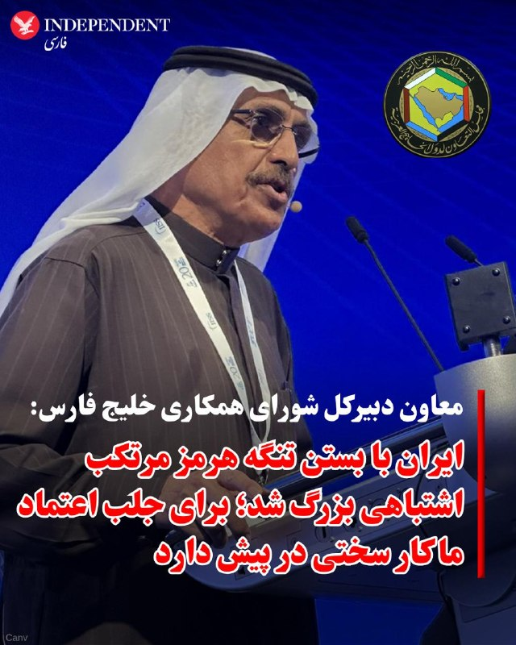
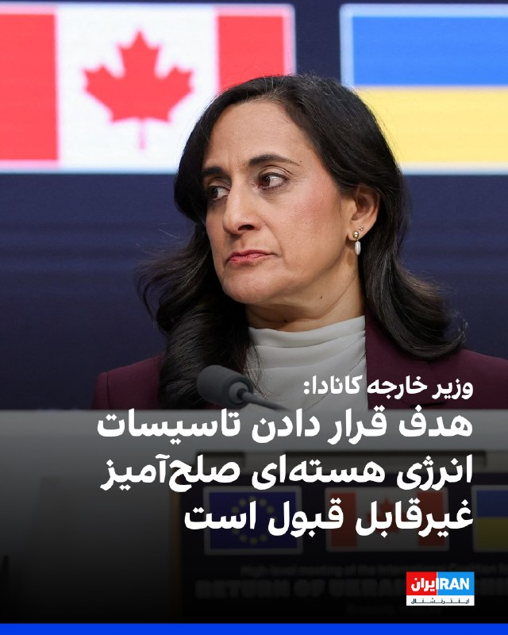
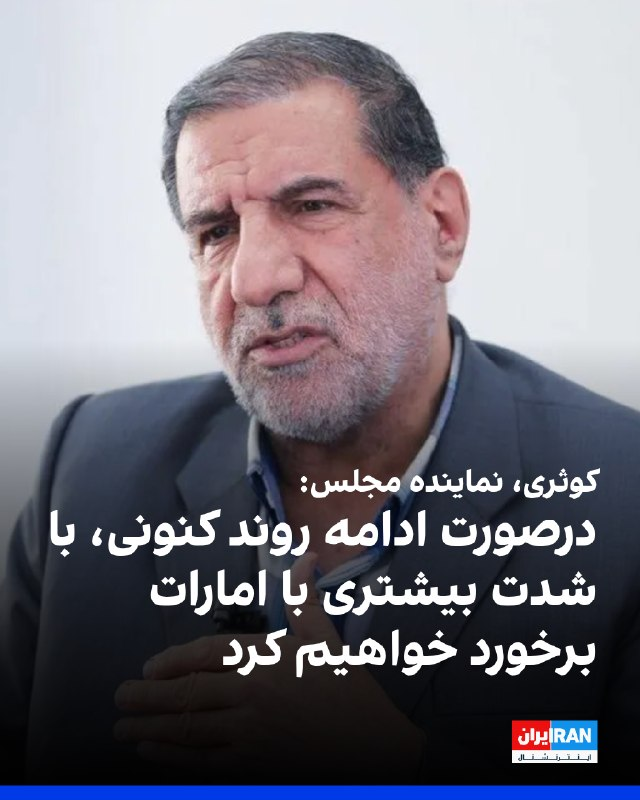
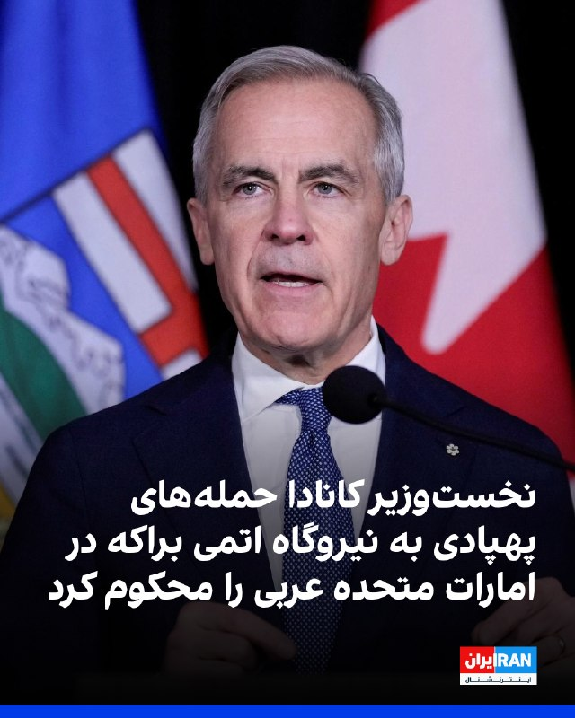

# خواننده تلگرام

<!-- TOP_NAV START -->

<a href="https://github.com/morii86/aio-downloader/blob/main/telegram/content/archive_1.md" style="display:inline-block; padding:6px 12px; margin:0 4px; background-color:#2ea44f; color:white; text-decoration:none; border-radius:4px; font-weight:bold;">صفحه بعد</a>

<!-- TOP_NAV END -->

<!-- MSG START -->

---
📅 بروزرسانی: 1405/02/28 08:20
---

## VahidOOnLine — post 240737

  

محسن رضایی، مشاور نظامی مجتبی خامنه‌ای، گفت: «آمریکا پس از شکست سختی که از جمهوری اسلامی خورد، در حال سقوط است.» او به ارتش ایالات‌متحده هشدار داد: «قبل از اینکه دریای عمان به گورستانی برای ناوهای شما تبدیل شود، خودتان عقب بکشید.»
محسن رضایی گفت: «یکی از سه ناو آمریکایی که از دریای عمان وارد خلیج فارس شده بود، با موشک‌های ما آسیب دید، اما آمریکا صدایش را درنمی‌آورد.»
او تاکید کرد: تنگه هرمز برای تجارت باز است، اما برای لشکرکشی و ناامنی بسته خواهد بود.

‌🏁 🇬🇧 IranintlTV

🤖 @VahidOOnLine

## VahidOOnLine — post 240736

♦️خبرگزاری رویترز بامداد دوشنبه ۲۸ اردیبهشت با انتشار ویدیویی گزارش داد یک هواپیمای آب‌نشین متعلق به دوران جنگ جهانی دوم پس از بروز نقص فنی، در یکی از خیابان‌های شهر فینیکس در ایالت آریزونا فرود اضطراری انجام داد.
این ویدیو که با دوربین نصب‌شده روی بال هواپیما ضبط شده، لحظه کاهش ارتفاع و فرود سخت هواپیما را نشان می‌دهد. بر اساس این گزارش، پس از شنیده شدن صدایی از موتور، دود وارد کابین خلبان شد و خلبان پس از جست‌وجو برای یافتن محل مناسب، یک خیابان خلوت را برای فرود انتخاب کرد.
رویترز گزارش داد هر سه سرنشین هواپیما سالم نجات پیدا کردند و تحقیقات هیئت ملی ایمنی حمل‌ونقل آمریکا درباره علت حادثه ادامه دارد.
‌🇸🇦 Indypersian

🤖 @VahidOOnLine

## VahidOOnLine — post 240735

  

♦️به گزارش العربیه، کشورهای حوزه خلیج فارس درنظر دارند پیش‌نویس یک قطعنامه‌ درباره آزادی کشتیرانی در تنگه هرمز و حفاظت از گذرگاه‌های آبی بین‌المللی را بار دیگر به شورای امنیت ارائه کنند و روسیه و چین را متقاعد کنند از حق «وتو» استفاده نکرده و پیشنهاد تصویب شود. این پیش‌نویس از ایران می‌خواهد حمله به کشتی‌ها را متوقف کند. عبدالعزیز العویشق، معاون دبیرکل شورای همکاری خلیج فارس در امور سیاسی و مذاکرات به العربیه گفت: «ایران با استفاده از تنگه هرمز به‌عنوان ابزار فشار در مذاکرات با آمریکا اشتباه بزرگی مرتکب شد، چرا که این اقدام ناقض قوانین بین‌المللی است.» او افزود: «کشورهای حوزه خلیج فارس پیش از جنگ ارتباطات خود را با ایران حفظ کرده بودند و امیدوار بودیم پایه‌ای جدید برای روابط شکل بگیرد، اما حملات ایران علیه کشورهای خلیج فارس، که چند برابر عملیاتش علیه اسرائیل بود، باعث شده تهران در پی نقض تفاهم‌ها اکنون با بار سنگینی برای بازسازی پل اعتمادروبه‌رو شود.» العویشق همزمان ابراز امیدواری کرد در آینده توافقی با ایران حاصل شود که برنامه هسته‌ای، موشک‌های بالستیک و دخالت‌های منطقه‌ای ایران را در بر بگیرد. او گفت: «جغرافیا ما را ناگزیر می‌کند که چه بخواهیم چه نخواهیم، با ایران تعامل داشته باشیم.» به نوشته العربیه، حملات ایران علیه کشورهای خلیج فارس و بستن تنگه هرمز تغییر قابل توجهی در چارچوب همکاری مشترک این کشورها ایجاد کرده است. کشورهای شورای همکاری اکنون تلاش‌های مشترک خود را برای تقویت همگرایی اقتصادی و توسعه‌ای، گسترش گزینه‌های دفاعی در چارچوب تقویت فرماندهی نظامی مشترک، تقویت توافق دفاع مشترک، ارتقای سطح امنیتی و اطلاعاتی و ادامه فعالیت برای دستیابی به سامانه دفاع هوایی مشترک افزایش داده‌اند. این کشورها همچنین در نظر دارند یک سامانه هشدار زودهنگام برای مقابله با تهدیدها ایجاد کنند.
‌🇸🇦 Indypersian

🤖 @VahidOOnLine

## VahidOOnLine — post 240734

  

مارک کارنی، نخست‌وزیر کانادا، در ایکس نوشت کشورش در همراهی با آژانس بین‌المللی انرژی اتمی حمله‌های پهپادی به نیروگاه هسته‌ای براکه در امارات متحده عربی را محکوم می‌کند و در کنار دوستان خود در امارات متحده عربی می‌ایستد.
کارنی با هشدار درباره اینکه هدف قرار دادن تاسیسات هسته‌ای صلح‌آمیز خطرات جدی برای جان انسان‌ها و محیط زیست به همراه دارد، بر ضرورت فوری خویشتنداری و کاهش تنش در منطقه تاکید کرد.

‌🏁 🇬🇧 IranintlTV

🤖 @VahidOOnLine

## VahidOOnLine — post 240733

♦️اردلان الیاسین‌فر، که در برنامه «به وقت ایران» صداوسیما به‌عنوان «پژوهشگر حوزه تکنولوژی و هوش مصنوعی» معرفی شده است، یکشنبه‌شب ۲۷ اردیبهشت‌ماه از ایجاد اختلال و بحران در مدار پایینی زمین به‌عنوان راهی برای مقابله با آمریکا و آسیب به ماهواره‌هایی مانند استارلینک سخن گفت.

او مدعی شد آمریکا با در اختیار داشتن ماهواره‌های مستقر در مدار LEO، امکان «اقدام پیش‌دستانه» و رصد تحرکات در نقاط مختلف جهان را دارد و افزود ایجاد بحران و زباله‌های فضایی در این مدار می‌تواند به ماهواره‌های مستقر در آن آسیب وارد کند.

در این برنامه، مجری نیز احتمال هدف قرار گرفتن ماهواره‌های مرتبط با جنگ را مطرح کرد و الیاسین‌فر گفت وقوع یک بحران در مدار پایین زمین می‌تواند زنجیره‌ای از مشکلات و اختلال‌های فضایی ایجاد کند.
‌🇸🇦 Indypersian

🤖 @VahidOOnLine

## VahidOOnLine — post 240732

  <a href="telegram/content/VahidOOnLine_240732_1779079804.mp4" target="_blank">🎬 Download video</a>

♦️به دنبال برگزاری دادگاه برای صادق ساعدی‌نیا، مدیر کافه‌های زنجیره‌ای ساعدی‌نیا که در جریان انقلاب ملی در کنار مردم ایران ایستاد، دادستان فهرستی از اتهامات ادعایی برای او را قرائت کرد که در آن «تعطیل کردن کافه‌های خودش» هم یک جرم عنوان شده است. حکومت ایران همه اموال ساعدی‌نیا را نیز توقیف کرده است.
‌🇸🇦 Indypersian

🤖 @VahidOOnLine

## VahidOOnLine — post 240731

  

♦️بامداد دوشنبه، همزمان با بازگشایی بازارها و ساعاتی پس از گزارش رهگیری حمله پهپادی بر فراز عربستان سعودی، بهای هر بشکه نفت برنت با حدود یک دلار افزایش به ۱۱۱ دلار و ۴۹ سنت رسید. بهای نفت آمریکا (وست تگزاس) نیز با ۱ دلار و ۲۲ سنت به ۱۰۶ دلار و ۶۴ سنت رسیده است.
‌🇸🇦 Indypersian

🤖 @VahidOOnLine

## VahidOOnLine — post 240730

  

آنیتا آناند، ‌وزیر خارجه کانادا، اقدام جمهوری اسلامی در هدف قرار دادن تاسیسات انرژی هسته‌ای صلح‌آمیز را غیرقابل قبول دانست و بر همبستگی کشورش با امارات متحده عربی در ارتباط با حملات پهپادی به نیروگاه هسته‌ای براکه در این کشور تاکید کرد.
او نوشت: «قطعنامه‌های آژانس بین‌المللی انرژی اتمی و قوانین بین‌المللی هر دو تاکید می‌کنند که هدف قرار دادن تأسیسات انرژی هسته‌ای صلح‌آمیز غیرقابل قبول است.»
آناند اشاره کرد که در تماس با همتای خود در امارات متحده عربی حمایت کامل خود را از این کشور ابراز داشته است، و نوشت: «کانادا از تحقیقات کامل در مورد این حملات حمایت می‌کند و از جامعه بین‌المللی می‌خواهد که آنها را به طور مشابه محکوم کند.»

‌🏁 🇬🇧 IranintlTV

🤖 @VahidOOnLine

## VahidOOnLine — post 240729

  

قیمت نفت برنت در آغاز معاملات روز دوشنبه با ۱.۲ درصد افزایش به ۱۱۰.۶۳ دلار در هر بشکه و قیمت نفت خام آمریکا با یک درصد افزایش به ۱۰۶.۴۲ دلار در هر بشکه رسید. به گزارش رویترز حملات پهپادی جدید در خلیج فارس، قیمت نفت و بازدهی اوراق قرضه را افزایش داد.
رویترز با اشاره به حملات پهپادی به امارات متحده عربی و عربستان سعودی همراه با هشدار رییس‌جمهوری آمریکا به جمهوری اسلامی و مسدود ماندن تنگه هرمز نوشت تحلیلگران کپیتال اکونومیکس هشدار دادند: «ادامه مسدود ماندن تنگه هرمز به سرعت به تحلیل رفتن ذخایر جهانی نفت منجر خواهد شد. وضعیت ذخایر می‌تواند تا پایان ژوئن سال جاری به سطح بحرانی برسد و زمینه‌ساز افزایش قیمت برنت به ۱۳۰ تا ۱۴۰ دلار در هر بشکه، اگر نه بیشتر، شود.»

‌🏁 🇬🇧 IranintlTV

🤖 @VahidOOnLine

## VahidOOnLine — post 240728

  

♦️جیمی دایمن، رئیس و مدیرعامل بانک جی‌پی‌مورگان چیس، در گفتگو با فرانسین لاکوا در برنامه «بلومبرگ اوپن اینترست» با اشاره به جنگ آمریکا و اسرائیل با جمهوری اسلامی گفت از شنیدن این ادعا که تهران تهدید فوری نبوده، خشمگین می‌شود.

دایمن گفت: «آن‌ها ۴۷ سال است که تجاوز، کشتار و قتل انجام می‌دهند.» او افزود جهان غرب نباید اجازه می‌داد جنگ‌های نیابتی ادامه پیدا کند و «باید سال‌ها پیش سر مار را می‌زد.»

رئیس جی‌پی‌مورگان با اشاره به ادامه بحران خاورمیانه گفت اکنون ریسک بیشتری وجود دارد، اما شاید فرصت بیشتری هم برای صلح ایجاد شده باشد، زیرا «مردم خواهان صلح هستند.»
‌🇸🇦 Indypersian

🤖 @VahidOOnLine

## VahidOOnLine — post 240727

  

اسماعیل کوثری، عضو کمیسیون امنیت ملی و سیاست خارجی مجلس، گفت: «اگر امارات متحده عربی به همکاری با آمریکا و اسرائیل علیه ما ادامه دهد، با شدت بیشتری با آنها برخورد خواهیم کرد.»
کوثری اضافه کرد: «امارات متحده عربی به خودی خود عددی نیست و تنها به پشتوانه آمریکا و اسرائیل توانسته است توطئه‌هایی را علیه جمهوری اسلامی رقم بزند.»
عضو کمیسیون امنیت ملی و سیاست خارجی مجلس گفت: «این‌ها همسایگان ما هستند، همیشه رعایت حال آن‌ها را کرده‌ایم و می‌خواهیم آن‌ها را از دامن اسرائیل نجات دهیم.»

‌🏁 🇬🇧 IranintlTV

🤖 @VahidOOnLine

## VahidOOnLine — post 240726

  

♦️سایت آوش در گفتگو با مهکامه شریف‌زاده، رئیس هیات مدیره «انجمن بلاکچین ایران» گزارش داده است که خسارت قطع اینترنت خطی نیست و صعودی است و با این وضعیت راه‌‌سودجویی و کلاهبرداری از تجارت‌ها هم هموار‌تر شده است. به گزارش آوش، مستندات انجمن بلاکچین ایران فاش می‌کند که چگونه رقمی نزدیک به ۷۰۰ هزار میلیارد تومان سرمایه ملی در غبار اختلالات سیستماتیک ناپدید شد. آوش می‌نویسد، در حالی که جهان بر لبه خیره‌کننده انقلاب هوش مصنوعی، وب ۳ و اقتصادهای غیرمتمرکز ایستاده است، اقتصاد دیجیتال ایران تاریک‌ترین دوران خود را سپری می‌کند.طبق برآوردهای کارشناسی در طی ۷۴ روز اختلال کمرشکن و قطعی‌های پراکنده اما هدفمند، رقمی معادل بودجه عمرانی چندین استان بزرگ کشور به سادگی دود شده و به هوا رفته است.خسارت ۷۰۰ هزار میلیارد تومانی تنها یک عدد نیست؛ این عدد یعنی نابودی فرصت‌های شغلی برای بیش از ۲ میلیون جوان متخصص که در حوزه‌های برنامه‌نویسی، بازاریابی دیجیتال و بلاکچین فعالیت می‌کردند. گزارش انجمن بلاکچین به صراحت بیان می‌کند که اینترنت یک اکوسیستم زنده است و یک لوله‌کشی خصوصی نیست. نمی‌توان به فروشنده و تولیدکننده اینترنت با پهنای باند آزاد داد، اما خریدار و مصرف‌کننده را در پشت سد فیلترینگ و کندی عمدی نگه داشت.گزارش نشان می‌دهد که گردش مالی بازار سیاه وی‌پی‌ان (فیلترشکن) در سال ۱۴۰۵ به ارقام نجومی رسیده و بودجه خانواده‌های ایرانی به جای صرف شدن در آموزش، سلامت یا کالاهای اساسی به جیب سوداگرانی می‌رود که فیلترشکن‌های بی‌کیفیت و ناامن می‌فروشند.استفاده همگانی از فیلترشکن‌ها امنیت ملی داده‌ها را به صفر رسانده است. وقتی میلیون‌ها کاربر از درگاه‌های غیررسمی برای دور زدن محدودیت‌ها استفاده می‌کنند، عملا تمام داده‌های حساس بانکی و شخصی خود را در معرض شنود و سرقت قرار می‌دهند. گزارش تاب‌آوری هشدار می‌دهد که این وضعیت، ایران را به بهشت هکرها و کلاهبرداران اینترنتی تبدیل کرده است. این گزارش هشدار می‌دهد که در صورت ادامه روند فعلی، با تبدیل شدن ایران به یک جزیره دیجیتال متروکه و قطع کامل پیوند با اقتصاد جهانی، اقتصاد دیجیتال به یک فعالیت زیرزمینی و غیررسمی تبدیل خواهد شد. این گزارش همچنین می‌گوید که حتی اگر اصلاحات قطره‌چکانی برای باز کردن مقعطی برخی پلتفرم‌ها برای فرونشاندن خشم عمومی انجام شود هم، بدون تغییر در زیرساخت‌های قانونی، فقط زوال به تاخیر می‌اندازد.
‌🇸🇦 Indypersian

🤖 @VahidOOnLine

## VahidOOnLine — post 240725

  

♦️به گزارش سایت فوتبالی، طبق قانون، فیفا به ازای هر بازیکنی که نامش در فهرست نهایی جام جهانی باشد، به باشگاهش مبلغی می‌پردازد. این در حالی است که باشگاه‌های بزرگ فوتبال ایران عمدتا در اختیار نهادهای حکومتی، شبه‌دولتی یا شرکت‌های وابسته به حکومت و سپاه هستند.
براساس این گزارش، البته هنوز فهرست تیم ملی ایران نهایی نشده و با خط خوردن چند بازیکن دیگر، درآمد باشگاه‌های آنها کمتر خواهد شد اما با در نظر گرفتن فهرست فعلی، می‌توان علی الحساب درآمد باشگاه‌ها را محاسبه کرد. با اعلام فیفا، این نهاد از یک هفته مانده به شروع جام جهانی، یعنی از ۱۵ خرداد، برای هر بازیکنی که نامش در فهرست نهایی تیم ملی کشورش قرار بگیرد، به ازای هر روز ۱۱ هزار دلار در نظر می‌گیرد.
به گزارش سایت فوتبالی: با این فرض محتمل که تیم ایران از گروه خود صعود نخواهد کرد، حضور این تیم در جام جانی در تاریخ ۶ تیر به پایان خواهد رسید. و هر یک از بازیکنان در این ۲۳ روز ۲۵۳ هزار دلار درآمد خواهند داشت.
فوتبالی می‌افزاید: در حال حاضر پرسپولیس تحت مالکیت شرکت فولاد مبارکه اصفهان که روابط نزدیکی با سپاه دارد، با پیام نیازمند، حسین کنعانی، میلاد محمدی، امیرحسین محمودی و علی علیپور پنج بازیکن در اردوی تیم دارد و با این بازیکنان، در پایان مرحله گروهی جام جهانی یک میلیون و ۲۵۰ هزار دلار درآمد خواهد داشت. از سوی دیگر اوستون اورونوف، الکسیس گندوز و ایگور سرگیف هم با حضور در فهرست تیم‌های ملی ازبکستان و الجزایر، می‌توانند تقریبا ۷۶۰ هزار دلار دیگر برای پرسپولیس درآمدزایی کنند که به این ترتیب درآمد پرسپولیس در پایان مرحله گروهی جام جهانی به حدود دو میلیون دلار خواهد رسید.
فوتبالی درباره باشگاه استقلال که تحت مالکیت «هلدینگ خلیج فارس» است که به دلیل روابط با سپاه پاسداران در فهرست تحریم‌های آمریکا قرار دارد، می‌نویسد: این تیم صالح حردانی، روزبه چشمی و امیرمحمد رزاقی‌نیا را در فهرست تیم ملی دارد اما داکنز نازون در فهرست تیم ملی هائیتی و رستم آشورماتوف و جلال‌الدین ماشاریپوف در فهرست تیم ملی ازبکستان هم هستند که تعداد ملی‌پوشان این تیم را به عدد شش می‌رسانند. با این حساب، استقلال در پایان مرحله گروهی جام جهانی بیشتر از یک و نیم میلیون دلار درآمد خواهد داشت.
تراکتور با چهار بازیکن ایرانی به نام‌های علیرضا بیرانوند، شجاع خلیل‌زاده، امیرحسین حسین‌زاده و مهدی ترابی و اودیل خامکروبکوف را در تیم ملی ازبکستان دارد. مجموع درآمد این پنج بازیکن برای تراکتور تا پایان مرحله گروهی حدود یک میلیون و ۲۵۰ هزار دلار خواهد بود.
سپاهان اصفهان در تیم ملی سیدحسین حسین‌زاده، احسان حاج‌صفی، امید نورافکن و آریا یوسفی را دارد که این تیم را صاحب درآمدی حدود یک میلیون دلاری خواهد کرد.
‌🇸🇦 Indypersian

🤖 @VahidOOnLine

## IranIntlTV — post 337719

  <a href="telegram/content/IranIntlTV_337719_1779079811.mp4" target="_blank">🎬 Download video</a>

جاویدنامان انقلاب ملی ایرانیان
«رها بهلولی‌پور» در ۱۸ دی‌ماه در جریان اعتراضات در میدان فاطمی تهران، مورد اصابت گلوله نیروهای سرکوب جمهوری اسلامی قرار گرفت و در ۱۹ دی‌ماه جان باخت. نامش در حافظه‌ی این سرزمین می‌ماند و یادش چراغ راه آزادی‌خواهان است.

@iranintltv

## IranIntlTV — post 337718

  <a href="telegram/content/IranIntlTV_337718_1779079813.mp4" target="_blank">🎬 Download video</a>

سرخط خبرهای دوشنبه ۲۸ اردیبهشت
@iranintltv

## IranIntlTV — post 337717

  

محسن رضایی، مشاور نظامی مجتبی خامنه‌ای، گفت: «آمریکا پس از شکست سختی که از جمهوری اسلامی خورد، در حال سقوط است.» او به ارتش ایالات‌متحده هشدار داد: «قبل از اینکه دریای عمان به گورستانی برای ناوهای شما تبدیل شود، خودتان عقب بکشید.»
محسن رضایی گفت: «یکی از سه ناو آمریکایی که از دریای عمان وارد خلیج فارس شده بود، با موشک‌های ما آسیب دید، اما آمریکا صدایش را درنمی‌آورد.»
او تاکید کرد: تنگه هرمز برای تجارت باز است، اما برای لشکرکشی و ناامنی بسته خواهد بود.

https://iranintl.com/202605182971

## IranIntlTV — post 337716

  

مارک کارنی، نخست‌وزیر کانادا، در ایکس نوشت کشورش در همراهی با آژانس بین‌المللی انرژی اتمی حمله‌های پهپادی به نیروگاه هسته‌ای براکه در امارات متحده عربی را محکوم می‌کند و در کنار دوستان خود در امارات متحده عربی می‌ایستد.
کارنی با هشدار درباره اینکه هدف قرار دادن تاسیسات هسته‌ای صلح‌آمیز خطرات جدی برای جان انسان‌ها و محیط زیست به همراه دارد، بر ضرورت فوری خویشتنداری و کاهش تنش در منطقه تاکید کرد.

https://iranintl.com/202605180232

## IranIntlTV — post 337715

  

آنیتا آناند، ‌وزیر خارجه کانادا، هدف قرار دادن تاسیسات انرژی هسته‌ای صلح‌آمیز را غیرقابل قبول دانست و بر همبستگی کشورش با امارات متحده عربی در ارتباط با حملات پهپادی به نیروگاه هسته‌ای براکه در این کشور تاکید کرد.
او نوشت: «قطعنامه‌های آژانس بین‌المللی انرژی اتمی و قوانین بین‌المللی هر دو تاکید می‌کنند که هدف قرار دادن تأسیسات انرژی هسته‌ای صلح‌آمیز غیرقابل قبول است.»
آناند اشاره کرد که در تماس با همتای خود در امارات متحده عربی حمایت کامل خود را از این کشور ابراز داشته است، و نوشت: «کانادا از تحقیقات کامل در مورد این حملات حمایت می‌کند و از جامعه بین‌المللی می‌خواهد که آنها را به طور مشابه محکوم کند.»

https://iranintl.com/202605188323

## IranIntlTV — post 337714

  

قیمت نفت برنت در آغاز معاملات روز دوشنبه با ۱.۲ درصد افزایش به ۱۱۰.۶۳ دلار در هر بشکه و قیمت نفت خام آمریکا با یک درصد افزایش به ۱۰۶.۴۲ دلار در هر بشکه رسید. به گزارش رویترز حملات پهپادی جدید در خلیج فارس، قیمت نفت و بازدهی اوراق قرضه را افزایش داد.
رویترز با اشاره به حملات پهپادی به امارات متحده عربی و عربستان سعودی همراه با هشدار رییس‌جمهوری آمریکا به جمهوری اسلامی و مسدود ماندن تنگه هرمز نوشت تحلیلگران کپیتال اکونومیکس هشدار دادند: «ادامه مسدود ماندن تنگه هرمز به سرعت به تحلیل رفتن ذخایر جهانی نفت منجر خواهد شد. وضعیت ذخایر می‌تواند تا پایان ژوئن سال جاری به سطح بحرانی برسد و زمینه‌ساز افزایش قیمت برنت به ۱۳۰ تا ۱۴۰ دلار در هر بشکه، اگر نه بیشتر، شود.»

https://iranintl.com/202605186706

## IranIntlTV — post 337713

  

اسماعیل کوثری، عضو کمیسیون امنیت ملی و سیاست خارجی مجلس، گفت: «اگر امارات متحده عربی به همکاری با آمریکا و اسرائیل علیه ما ادامه دهد، با شدت بیشتری با آنها برخورد خواهیم کرد.»
کوثری اضافه کرد: «امارات متحده عربی به خودی خود عددی نیست و تنها به پشتوانه آمریکا و اسرائیل توانسته است توطئه‌هایی را علیه جمهوری اسلامی رقم بزند.»
عضو کمیسیون امنیت ملی و سیاست خارجی مجلس گفت: «این‌ها همسایگان ما هستند، همیشه رعایت حال آن‌ها را کرده‌ایم و می‌خواهیم آن‌ها را از دامن اسرائیل نجات دهیم.»

https://iranintl.com/202605184852

## FarsiVOA — post 218026

  

بلومبرگ گزارش داد کاهش شدید واردات نفت خام چین، پالایشگاه‌های این کشور را به کاهش تولید وادار کرده و فعالیت پالایشگاه‌های دولتی را به پایین‌ترین سطح چند سال اخیر رسانده است.

بر اساس این گزارش، چین در ماه آوریل ۵۴ میلیون و ۶۵۰ هزار تن نفت پالایش کرد؛ رقمی که ۱۱ درصد کمتر از ماه مارس و ۵.۸ درصد پایین‌تر از مدت مشابه سال گذشته است. نرخ فعالیت پالایشگاه‌های دولتی نیز به حدود ۶۷ درصد کاهش یافته است.

این کاهش از آن جهت مهم است که بخش اصلی پالایش نفت چین در کنترل شرکت‌های دولتی قرار دارد و افت تولید در این بخش، نشانه فشار مستقیم اختلال در مسیرهای تأمین نفت بر امنیت انرژی پکن است. بلومبرگ علت اصلی این وضعیت را کاهش واردات نفت، در پی اختلال در عبور محموله‌ها از تنگه هرمز دانست.

رویترز نیز پیش‌تر نوشته بود پالایشگاه‌های مستقل چین به دلیل قیمت بالای نفت، ضعف تقاضای داخلی و زیان سنگین عملیاتی، تولید خود را کاهش داده‌اند. به نوشته رویترز این نشانه‌ای از سرایت جنگ و اختلال هرمز به زنجیره انرژی چین است.
@FarsiVOA

## FarsiVOA — post 218025

🔺گزارش کاخ سفید از دستاوردهای سفر ترامپ به پکن؛ چین و آمریکا توافق کردند جمهوری اسلامی نباید در تنگه هرمز عوارض بگیرد

▪️کاخ سفید، توضیحاتی درباره دستاوردهای سفر دونالد ترامپ، رئيس‌جمهوری آمریکا به چین و دیدارش با شی جین‌پینگ، رئيس‌جمهوری این کشور، منتشر کرد.

⬇️ بیشتر بخوانید:
https://ir.voanews.com/a/8151170.html
@FarsiVOA

## FarsiVOA — post 218024

🔺هزاران نفر در مراسم نیایش «تجدید پیمان کشور ما به‌عنوان یک ملت واحد زیر نظر خدا» در واشنگتن شرکت کردند

▪️هزاران نفر روز یک‌شنبه ۲۷ اردیبهشت در محدود «نشنال مال» در واشنگتن دی‌سی، پایتخت آمریکا گرد هم آمدند تا در یک گردهمایی دعای یک‌روزه برای آمریکا شرکت کنند. این رویداد با عنوان «تجدید پیمان کشور ما به‌عنوان یک ملت واحد زیر نظر خدا» برگزار شد.

⬇️ بیشتر بخوانید:
https://ir.voanews.com/a/8151169.html
@FarsiVOA

## Persian_Trend_Official — post 14373

کانال رسمی پرشین ترند pinned «♨️ دوستان عزیز، با توجه به شرایط پیش‌رو، بهتر است از همین حالا برای سناریوهای اضطراری آماده باشیم. آمادگی یعنی آرامش بیشتر و آسیب کمتر برای خودمان و خانواده‌مان. 🧭 ⚠️ چند مورد مهم را جدی بگیرید: • برای دست‌کم ۱ ماه، آذوقه‌ی غذایی فاسد نشدنی و آب آشامیدنی…»

## Persian_Trend_Official — post 14372

  

🔴علیرضا دبیر 💢نوید افکاری رو ما میخاستیم بیاریم بیرون نجات بدیم اما ضد انقلاب نذاشت ! ! ! 🫆:Tony 📌 @persian_trend_official پرشین ترند | متفاوت‌ترین کانال نظامی

## Persian_Trend_Official — post 14370

  <a href="telegram/content/Persian_Trend_Official_14370_1779079822.mp4" target="_blank">🎬 Download video</a>

🔴علیرضا دبیر

💢نوید افکاری رو ما میخاستیم بیاریم بیرون نجات بدیم اما ضد انقلاب نذاشت ! ! !
🫆:Tony

📌 @persian_trend_official
پرشین ترند | متفاوت‌ترین کانال نظامی

## Persian_Trend_Official — post 14369

♨️ دوستان عزیز، با توجه به شرایط پیش‌رو، بهتر است از همین حالا برای سناریوهای اضطراری آماده باشیم. آمادگی یعنی آرامش بیشتر و آسیب کمتر برای خودمان و خانواده‌مان. 🧭 ⚠️ چند مورد مهم را جدی بگیرید: • برای دست‌کم ۱ ماه، آذوقه‌ی غذایی فاسد نشدنی و آب آشامیدنی…

## RadioFarda — post 157297

  

🔸در پی افزایش تنش‌های ژئوپولیتیک در خلیج فارس و نگرانی از تداوم فشارهای تورمی، قیمت نفت در بازار جهانی انرژی افزایش یافت.

🔸قیمت نفت برنت در روز دوشنبه ۲۸ اردیبهشت با رشد ۱.۲ درصدی به بیش از ۱۱۱ دلار در هر بشکه رسید و نفت خام وست تکزاس اینترمدیت آمریکا نیز با افزایش یک درصدی بیش از ۱۰۸ دلار معامله شد.

🔸تحلیلگران نسبت به محدود ماندن عرضه جهانی نفت در پی اختلال در آبراهه استراتژیک هرمز هشدار می‌دهند.

🔸با ادامه محدودیت در مسیر تنگه هرمز که حدود ۲۰ درصد تجارت جهانی نفت از آن عبور می‌کند، قیمت نفت می‌تواند به سطوح ۱۳۰ تا ۱۴۰ دلار در هر بشکه و حتی بالاتر برسد و تورم جهانی را به سطوح نزدیک به ۱۰ درصد در اروپا و بریتانیا افزایش دهد.

@RadioFarda

## RadioFarda — post 157296

  

🔸عربستان سعودی روز یکشنبه ۲۷ اردیبهشت اعلام کرد سه پهپاد را که از حریم هوایی عراق وارد این کشور شده بودند، رهگیری و منهدم کرده است.

🔸ترکی مالکی، سخنگوی وزارت دفاع عربستان، گفت این پهپادها روز یکشنبه وارد حریم هوایی عربستان شدند که نیروی دفاعی این کشور موفق به رهگیری و نابودی آن‌ها شد.

🔸سخنگوی وزارت دفاع عربستان تأکید کرد وزارت دفاع این‌ کشور حق پاسخ‌گویی در زمان و مکان مناسب را برای خود محفوظ می‌داند.

🔸در همین حال مقام‌های امارات متحده عربی نیز یکشنبه اعلام کردند در پی یک حمله پهپادی به نیروگاه هسته‌ای «براکه»، آتش‌سوزی محدودی در این تأسیسات رخ داد اما منجر به‌آسیب جدی و خطرناک نشد.

🔸وزارت دفاع امارات اعلام کرد دو پهپاد دیگر نیز پس از رهگیری، منهدم شده‌اند.

🔸امارات می‌گوید پهپادها از مرزهای غربی وارد حریم هوایی این کشور شدند اما جزئیات بیشتری درباره منشأ دقیق آن‌ها ارائه نشده است.

🔸این رویدادها در شرایطی رخ می‌دهد که تنش‌های امنیتی در منطقه خلیج فارس و خاورمیانه افزایش یافته و نگرانی‌ها درباره تهدید زیرساخت‌های حیاتی منطقه نیز بیشتر شده است.

@RadioFarda

## RadioFarda — post 157295

  <a href="https://t.me/radiofarda/157295" target="_blank">📎 Download file</a>

📻بشنوید: خبرهای ساعت ۲۱ با رادیوفردا، ۲۸ اردیبهشت ۱۴۰۵‌

@RadioFarda

## BBCPersian — post 281358

  

‌ ‌ ‌ ‌
دادستان‌های پاریس می‌گویند که در حال بررسی بیش از صد مهدکودک و مدرسه ابتدایی به اتهام سوءاستفاده جسمی و جنسی هستند.

این اتهامات بیشتر شامل کسانی است که سرپرست غیرآموزشی بوده‌اند و مسئول مراقبت از کودکان قبل و بعد از مدرسه و در زمان زنگ تفریح ​​هستند.

تاکنون ۷۸ نفر از آنها از کار تعلیق شده‌اند، در حالی که یک مرد به اتهام تجاوز جنسی به سه دختر و آزار و اذیت ۹ دختر دیگر در حال محاکمه است.

امانوئل گرگوار، شهردار جدید پایتخت فرانسه، قول داده است که بررسی صلاحیت افرادی که برای سرپرستی درخواست می‌دهند را بهتر انجام دهد و آموزش‌های بهتری در مورد نحوه گزارش موارد مشکوک به بدرفتاری ارائه دهد.

📷EPA/Shutterstock
@BBCPersian

## BBCPersian — post 281357

🔻 ترامپ برای بررسی وضعیت جنگ با ایران به اتاق وضعیت کاخ‌سفید می‌رود

شبکه فاکس نوشته دونالد ترامپ برای وضعیت آخرین تحولات مرتبط با ایران روز سه‌شنبه با مشاوران امنیتی و نظامی کابینه خود در اتاق وضعیت کاخ‌سفید جلسه خواهد گذاشت.

اتاق وضعیت کاخ سفید محل جلسات بسیار مهم و معمولا مرتبط با جنگ و تحولات امنیتی در کاخ سفید است.

گزارش برنامه‌ریزی برای این جلسه را روز یکشنبه ابتدا نشریه اکسیوس گزارش کرد.

آقای ترامپ در چند روز گذشته با اظهار نارضایتی از پاسخ ایران به پیشنهادهای او، تهران را تهدید کرده که در «اسرع وقت» برای رسیدن به توافق با واشنگتن تلاش کند و گرنه به گفته آقای ترامپ ممکن است «چیزی برایش باقی نماند».

در برابر، ایران هم با پافشاری بر مواضع خود گفته «برای هر سناریویی آماده» است و به دولت آمریکا توصیه کرده که با پذیرش پیشنهادهای تهران، زمینه برای توافق و توقف جنگ را فراهم کند.

https://bbc.in/4dwYaSb
@BBCPersian

## BBCPersian — post 281356

  

‌ ‌ ‌ ‌
رواندا اعلام کرده که در بحبوحه شیوع مرگبار ویروس ابولا در جمهوری دموکراتیک کنگو، غربالگری را در مرز این کشور تشدید می‌کند.

برخی از ساکنان شهر گوما در شرق کنگو به بی‌بی‌سی گفته‌اند که فقط به رواندایی‌ها اجازه داده می‌شود که به رواندا برگردند و شهروندان کنگو اجازه ورود نمی‌یابند.

ساکنان شهر گوما نگران هستند که وضعیت اضطراری بهداشتی بر معیشت مردم نیز تأثیر بگذارد.

مقامات بهداشتی کنگو در حالی که تلاش‌ها برای مهار ابولا را افزایش داده‌اند، از استان ایتوری که مرکز شیوع این بیماری است، بازدید کرده‌اند.

سازمان بهداشت جهانی پس از شناسایی یک مورد در اوگاندا، شیوع این بیماری را یک وضعیت اضطراری بهداشت عمومی با نگرانی بین‌المللی اعلام کرده است.

📷TONY KARUMBA/AFP via Getty Images
@BBCPersian

## BBCPersian — post 281355

🔻 حوثی‌های یمن پس از کشته شدن عزالدین حداد، حمایت مجدد خود را از حماس اعلام کردند

رهبری نظامی حوثی‌های یمن، پس از کشته شدن عزالدین حداد، فرمانده ارشد واحد نظامی حماس، حمایت خود را از گروه‌های مسلح فلسطینی در غزه را مجددا اعلام کرده و متعهد به ادامه حمایت از آنها شده است.

یوسف حسن المدنی در پیام تسلیتی در تلگرام، مرگ عزالدین الحداد را ضایعه‌ای بزرگ برای جنبش فلسطین و منطقه توصیف کرد.

آقای المدنی گفت حوثی‌ها به تلاش‌های مشترک خود با حماس و گروه‌های متحد آن «تا زمان دستیابی به پیروزی» ادامه خواهند داد.

https://bbc.in/42K1LHt
@BBCPersian

## BBCPersian — post 281354

  

‌ ‌ ‌ ‌
به گزارش رسانه‌های ترکیه، پلیس استانبول یک مرد را به ظن قتل فجیع یک زن ایرانی به نام فرخنده قائم مقامی، شناسایی و بازداشت کرده است. بنابر گزارش‌ها، دو مظنون دیگر هم به ظن همکاری در این قتل بازداشت شده‌اند.

نشریه حریت ترکیه روز یکشنبه ۱۷ مه / ۲۷ اردیبهشت ضمن انتشار این خبر نوشت: «جسد تکه‌تکه‌شده فرخنده قائم‌مقامی، شهروند ایرانی که در استانبول ناپدید شده بود، در شهر کرشهیر پیدا شد. بر اساس تحقیقات، مشخص شد فرخنده قائم‌مقامی پس از مشاجره با (مرد مظنون)، با قلاده سگ خودش خفه شده و سپس جسد او داخل یک خودرو تکه‌تکه و در زمینی در منطقه موجورِ کرشهیر دفن شده است.»

آن طور که رسانه‌های ترکیه نوشته‌اند فرخنده قائم مقامی - ۶۸ ساله - با مظنون به قتل آشنا بوده و در روز حادثه به اتفاق او برای غذا خوردن بیرون رفته بودند.

حریت نوشته مرد بازداشت شده در بازجویی پلیس اعتراف کرده است که پس از مشاجره‌ای که در آخرین دیدارشان داخل خودرو رخ داد، «فرخنده قائم‌مقامی را با بند قلاده سگ او خفه کرده است».

https://bbc.in/3PIdpjb
📷hurriyet.com.tr
@BBCPersian

## BBCPersian — post 281353

🔻 افزایش بهای نفت در بازارهای صبح دوشنبه شرق آسیا

همزمان با بالا گرفتن مجدد تنش لفظی میان دونالد ترامپ و ایران، بهای نفت در بازارهای صبح دوشنبه شرق آسیا بالا رفت.

قیمت هر بشکه نفت برنت شمال صبح دوشنبه به وقت شرق آسیا به ۱۱۰ دلار رسید.

@BBCPersian

## BBCPersian — post 281343

‌ ‌ ‌
بیش از سه دهه پس از بسته شدن مرز میان آن‌ها، ترکیه و ارمنستان بار دیگر در میان تغییرات پویای منطقه‌ای به‌تدریج به سمت نزدیکی حرکت می‌کنند.

گام‌های اعتمادساز در سال‌های اخیر امیدهای محتاطانه‌ای برای عادی‌سازی ایجاد کرده است. اما پیشرفت‌های بزرگ، از جمله بازگشایی مرز زمینی و برقراری روابط دیپلماتیک، همچنان محدود باقی مانده است.

سیگنال‌های رسمی و رسانه‌ای کم ‌سر و صدای ترکیه درباره نزدیکی با ارمنستان بازتاب‌دهنده حساسیت این موضوع است.

با توجه به اینکه این روند همچنان به توافق صلح میان جمهوری آذربایجان و ارمنستان گره خورده است، باید دید آیا آنکارا و ایروان می‌توانند به‌طور مستقل پیش بروند و ژست‌های نمادین را به تغییرات پایدار تبدیل کنند یا نه.

https://bbc.in/4dhcZcH
📸GettyImages/EPA/Shutterstock/ ullstein bild via Getty Images/ Handout/Anadolu via Getty Images/ AFP via Getty Images
@BBCPersian

## BBCPersian — post 281336

‌ ‌ ‌ ‌
حسن پایکر، مفسر سیاسی ۳۴ ساله‌ای است که تابعیت آمریکا و ترکیه را دارد و خود را یک «سوسیالیست» معرفی می‌کند.

در ماه‌های اخیر، او در ویدیوهای پخش‌ زنده‌ خود از خانه‌اش در لس‌آنجلس، با لحنی تند از سیاست داخلی و خارجی آمریکا انتقاد کرده است.

حسن پایکر از سال ۲۰۱۶ با برنامه‌هایی که صریح و گاه «بی‌پروا» اما در عین حال «سرگرم‌کننده» توصیف می‌شوند، به تدریج مخاطبان بیشتری جذب کرده است.

او در پلتفرم توییچ با نام «حسن‌ابی» (برادر بزرگتر در ترکی) شناخته می‌شود و اکنون در مجموع شبکه‌های اجتماعی مختلف حدود ۱۰ میلیون دنبال‌کننده دارد.

https://bbc.in/4eRVS2j
📸Getty Images/Reuters/ portsfile for Web Summit Qatar via Getty Images/ Bloomberg via Getty Images
@BBCPersian

## alonews — post 120728

  <a href="telegram/content/alonews_120728_1779079829.webm" target="_blank">🎬 Download video</a>

👈وضعیت عجیب صدا و سیما

✅ @AloNews خبر جنگ

## alonews — post 120727

  <a href="telegram/content/alonews_120727_1779079829.webm" target="_blank">🎬 Download video</a>

👈تحلیلگرا عرب:

احمد خلیفه: داره اتفاق میوفته!
امجد طه‌: ⏳

✅ @AloNews خبر جنگ

## alonews — post 120726

  <a href="telegram/content/alonews_120726_1779079830.webm" target="_blank">🎬 Download video</a>

👈مترو هم پرو می‌شود / مترو تهران برای برخی افراد رایگان می‌شود

🔴در طرح پیشنهادی شورای شهر، گروه‌هایی مانند اصحاب رسانه، خبرنگاران، پیشکسوتان ورزشی، بازنشستگان لشکری و کشوری، امدادگران و داوطلبان جمعیت هلال‌احمر، افراد تحت پوشش کمیته امداد و دهک‌های درآمدی یک تا سه مشمول استفاده رایگان از حمل و نقل عمومی می شوند.

✅ @AloNews خبر جنگ

<!-- MSG END -->

<!-- NAV START -->

<a href="https://github.com/morii86/aio-downloader/blob/main/telegram/content/archive_1.md" style="display:inline-block; padding:6px 12px; margin:0 4px; background-color:#2ea44f; color:white; text-decoration:none; border-radius:4px; font-weight:bold;">صفحه بعد</a>

<!-- NAV END -->
