# خواننده تلگرام

<!-- TOP_NAV START -->

<a href="https://github.com/morii86/aio-downloader/blob/main/telegram/content/archive_1.md" style="display:inline-block; padding:6px 12px; margin:0 4px; background-color:#2ea44f; color:white; text-decoration:none; border-radius:4px; font-weight:bold;">صفحه بعد</a>

<!-- TOP_NAV END -->

<!-- MSG START -->

---
📅 بروزرسانی: 1405/02/26 12:02
---

## VahidOOnLine — post 240432

  

حسین شریعتمداری، نماینده رهبر جمهوری اسلامی در روزنامه کیهان، نوشت کشورهای عربستان سعودی، امارات متحده عربی، کویت، قطر، بحرین و اردن در جنگ اخیر «حضور و شرکت مستقیم داشتند» و به همین دلیل، باید «بخشی از اهداف نشاندار» حکومت ایران در انتقام خون علی خامنه‌ای باشند.

او افزود مذاکره با آمریکا و این کشور‌های عربی «بخشی از سازوکار تعریف‌شده نظام» است، اما «جنگ نباید و نمی‌تواند بدون انتقام سخت از قاتلان امام شهیدمان به نقطه پایان برسد».
‌🏁 🇬🇧 IranintlTV

🤖 @VahidOOnLine

## VahidOOnLine — post 240431

  <a href="telegram/content/VahidOOnLine_240431_1778920371.mp4" target="_blank">🎬 Download video</a>

گروه ناظر اینترنتی نت‌بلاکس اعلام کرد خاموشی دیجیتال در ایران اکنون وارد دوازدهمین هفته و هفتادوهشتمین روز خود شده است.
نت‌بلاکس می‌گوید این قطع اینترنت که یک کشور ۹۰ میلیونی را برای مدتی بی‌سابقه تا حد زیادی از دسترسی به اینترنت جهانی محروم کرده، همچنان در حال تضعیف حقوق بشر، اقتصاد و آزادی‌های اساسی در ایران است.
‌🏁 🇬🇧 ManotoTV

🤖 @VahidOOnLine

## VahidOOnLine — post 240430

  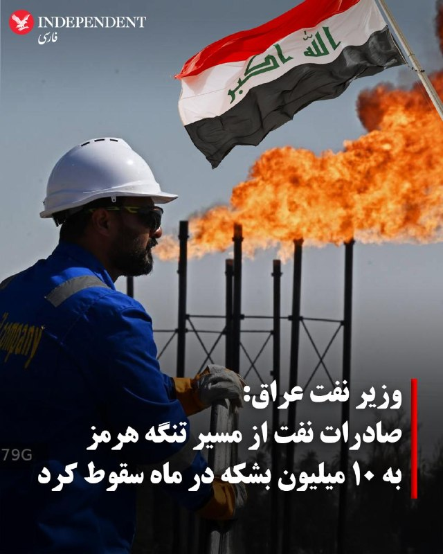

♦️وزیر نفت جدید عراق، روز شنبه ۲۶ اردیهشت ماه اعلام کرد این کشور در اپریل گذشته تنها ۱۰ میلیون بشکه نفت از طریق تنگه هرمز صادر کرده است، رقمی که پیش از آغاز جنگ ایران حدود ۹۳ میلیون بشکه در ماه بود.
باسم محمد، وزیر نفت عراق، روز شنبه در یک نشست خبری گفت بسته شدن تنگه هرمز در پی جنگ ایران باعث کاهش شدید صادرات نفت کشورهای عربستان سعودی، امارات، کویت و عراق شده و همزمان قیمت نفت را به‌طور قابل توجهی افزایش داده است.
او همچنین گفت صادرات نفت خام عراق از طریق خط لوله کرکوک–جیهان از ماه مارس از سر گرفته شده، اقدامی که پس از توافق بغداد و دولت اقلیم کردستان عراق برای آغاز مجدد انتقال نفت انجام شد.
وزیر نفت عراق افزود: «در حال حاضر روزانه ۲۰۰ هزار بشکه از طریق بندر جیهان صادر می‌کنیم و برنامه داریم این رقم را به ۵۰۰ هزار بشکه افزایش دهیم.»
محمد همچنین با اعلام آنکه بغداد تولید پنج میلیون بشکه نفت در روز را هدف‌گذاری کرده است گفت، کشورش قصد دارد با اوپک برای افزایش ظرفیت تولید و صادرات خود همکاری کند.
‌🇸🇦 Indypersian

🤖 @VahidOOnLine

## VahidOOnLine — post 240429

  

نت‌بلاکس اعلام کرد خاموشی دیجیتال در ایران وارد دوازدهمین هفته خود شده و اکنون به هفتاد و هشتمین روز رسیده است؛ وضعیتی که به گفته این نهاد، یک قطعی بی‌سابقه در مقیاس ملی به شمار می‌رود.

بر اساس این گزارش، قطع اینترنت که کشوری با ۹۰ میلیون جمعیت را تا حد زیادی آفلاین کرده، همچنان به تضعیف گسترده حقوق بشر، اقتصاد و آزادی‌های اساسی ادامه می‌دهد.
‌🏁 🇬🇧 IranintlTV

🤖 @VahidOOnLine

## VahidOOnLine — post 240428

  <a href="telegram/content/VahidOOnLine_240428_1778920373.mp4" target="_blank">🎬 Download video</a>

رسانه‌های عراقی گزارش دادند صدای انفجارهایی که روز شنبه در بغداد، پایتخت عراق شنیده شد، ناشی از شلیک گلوله‌های توپخانه به مناسبت تشکیل دولت جدید بوده است.
یک منبع امنیتی به خبرگزاری فرانسه گفت این شلیک‌ها همزمان با آغاز به کار دولت به ریاست نخست‌وزیر جدید عراق، علی الزیدی، انجام شده است.
پیش‌تر برخی رسانه‌ها از شنیده شدن چند انفجار در مرکز بغداد خبر دادند.
‌🏁 🇬🇧 ManotoTV

🤖 @VahidOOnLine

## VahidOOnLine — post 240427

  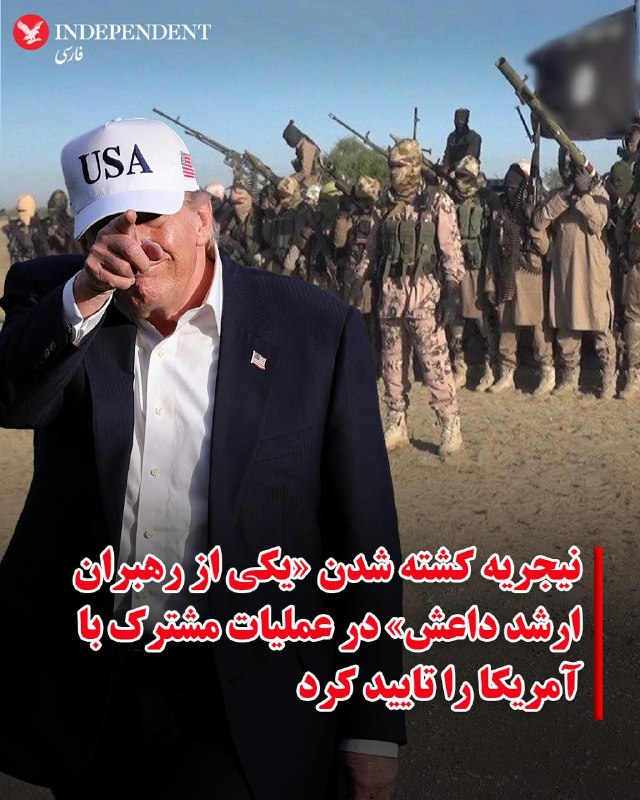

♦️رئیس‌جمهوری نیجریه و ارتش این کشور روز شنبه تایید کردند یکی از رهبران ارشد داعش در جریان یک عملیات مشترک با نیروهای آمریکایی در نیجریه کشته شده است.
بولا تینوبو، رئیس‌جمهوری نیجریه، در بیانیه‌ای پس از اعلام اولیه این خبر از سوی دونالد ترامپ گفت: «نیروهای مسلح مصمم نیجریه در همکاری نزدیک با نیروهای مسلح ایالات متحده، عملیاتی جسورانه انجام دادند که ضربه سنگینی به صفوف داعش وارد کرد.»
نیروهای دفاعی نیجریه اعلام کردند فرد کشته‌شده «ابوبلال المنوکی» بوده است. فردی که به گفته آن‌ها از رهبران ارشد داعش و «یکی از فعال‌ترین تروریست‌های جهان» به شمار می‌رفت.
دونالد ترامپ، رئیس‌جمهوری آمریکا، شنبه ۲۶ اردیبهشت با انتشار پیامی در «تروث سوشال» اعلام کرد نیروهای آمریکایی با همکاری ارتش نیجریه، در جریان یک عملیات پیچیده و دقیق، «ابوبلال المینوکی» مرد شماره دو و فعال‌ترین عضو ارشد داعش در جهان را از پای درآورده‌اند.
‌🇸🇦 Indypersian

🤖 @VahidOOnLine

## VahidOOnLine — post 240426

  

♦️خبرگزاری فارس، روز شنبه ۲۶ اردیبهشت ماه گزارش داد، وزارت اقتصاد در حال پیگیری طرحی است که با استفاده از سازوکار بیمه، «مدیریت تنگه هرمز را امکان‌پذیر کند». طرحی که به گفته فارس، می‌تواند در شرایط غیرجنگی از سوی کشورها نیز پذیرفته شود و در عین حال امکان مدیریت عبور و مرور دریایی را برای ایران فراهم کند.
فارس بر اساس سندی که به دست این رسانه رسیده است گزارش کرد، در قالب طرح موسوم به «بیمه هرمز»، امکان اشراف اطلاعاتی ایران بر تردد کشتی‌ها و همچنین تفکیک و شناسایی شناورهای متعلق به کشورهای مختلف فراهم خواهد شد.
به ادعای این رسانه حکومتی، جمهوری اسلامی در شرایط پس از جنگ می‌تواند تا دو میلیارد دلار از این روش درامدزایی کند. با این حال، این گزارش می‌افزاید محدودیت‌های زیرساختی ایران ظرفیت چنین درآمدی را نیز محدود می‌کند.
به نوشته فارس، مزیت این طرح آن است که «مدیریت تنگه از طریق بیمه» ماهیتی غیرنظامی و مدنی دارد و برخلاف اخذ عوارض، احتمال پذیرش آن از سوی کشورها بیشتر است.
جمهوری اسلامی از زمان آغاز جنگ با آمریکا در اسفندماه گذشته، تنگه هرمز را بسته و بارها بر کنترل و مدیریت این آبراه راهبردی تاکید کرده است. پیش‌تر نیز مجلس ایران طرح‌هایی درباره دریافت عوارض از کشتی‌های عبوری را مطرح کرده بود، موضوعی که همزمان با اعتراض گسترده جامعه جهانی، بحث‌های حقوقی و سیاسی گسترده‌ای درباره آینده تردد در تنگه هرمز ایجاد کرده است.
‌🇸🇦 Indypersian

🤖 @VahidOOnLine

## VahidOOnLine — post 240425

  

کرملین در بیانیه‌ای اعلام کرد ولادیمیر پوتین، رییس‌جمهوری روسیه، به‌زودی راهی چین خواهد شد و در روزهای سه‌شنبه و چهارشنبه، ۲۹ و ۳۰ اردیبهشت، با مقام‎‌های این کشور دیدار خواهد کرد.

بر اساس این بیانیه، پوتین و شی جین‌پینگ، رییس‌جمهوری چین، قرار است درباره «روابط دوجانبه» و «مسائل کلیدی بین‌المللی و منطقه‌ای» گفت‌وگو کنند.

پوتین در حالی به چین سفر خواهد کرد که دونالد ترامپ، رییس‌جمهوری آمریکا، سفر دوروزه خود به پکن را ۲۵ اردیبهشت به پایان رساند.
‌🏁 🇬🇧 IranintlTV

🤖 @VahidOOnLine

## VahidOOnLine — post 240424

  <a href="telegram/content/VahidOOnLine_240424_1778920375.mp4" target="_blank">🎬 Download video</a>

⭕️ پارک ملی توران سمنان؛
ثبت زادآوری گونه نادر گورخر آسیایی در ۱۴۰۵

♦️اداره‌کل حفاظت محیط زیست استان سمنان از ثبت نخستین زادآوری گورخر آسیایی در پارک ملی توران طی سال ۱۴۰۵ خبر داد.
گورخر آسیایی یا گور ایرانی، از گونه‌های در معرض خطر انقراض است که بخش مهمی از جمعیت باقی‌مانده آن در پارک ملی توران زندگی می‌کنند.
پارک ملی توران در استان سمنان که به «آفریقای ایران» شهرت دارد، یکی از مهم‌ترین زیستگاه‌های حیات‌وحش کشور محسوب می‌شود و گونه‌های نادری مانند یوزپلنگ آسیایی، جبیر و گورخر ایرانی را در خود جای داده است. فعالان محیط زیست امیدوارند ادامه روند زادآوری این گونه، به افزایش جمعیت و کاهش خطر انقراض گورخر آسیایی در ایران کمک کند.
‌🇸🇦 Indypersian

🤖 @VahidOOnLine

## VahidOOnLine — post 240423

  

مسعود پزشکیان، رییس دولت جمهوری اسلامی، در پیامی به پاپ لئو، رهبر کاتولیک‌های جهان، از آنچه «موضع اخلاقی و منطقی» او در قبال جنگ ایران خواند، قدردانی کرد.

در این پیام آمده است: «حملات آمریکا و اسرائیل صرفا علیه ایران نیست، بلکه علیه حاکمیت قانون و ارزش‌های انسانی است.»

پزشکیان افزود جمهوری اسلامی «در چارچوب دفاع مشروع، اهداف و منافع متجاوزین را مورد هدف قرار داد».

او همچنین خواستار واکنش «مسئولانه» جامعه جهانی به «اقدامات غیرقانونی» ایالات متحده شد.
‌🏁 🇬🇧 IranintlTV

🤖 @VahidOOnLine

## VahidOOnLine — post 240422

  <a href="telegram/content/VahidOOnLine_240422_1778920377.mp4" target="_blank">🎬 Download video</a>

ارتش اسرائیل اعلام کرد در پی فعال شدن هشدار نفوذ پهپاد در منطقه میرون، یک هدف هوایی مشکوک شناسایی شده است.
ارتش اسرائیل همچنین اعلام کرد جزئیات این رویداد در حال بررسی است و این حادثه بدون تلفات پایان یافته اس
‌🏁 🇬🇧 ManotoTV

🤖 @VahidOOnLine

## VahidOOnLine — post 240421

🗣روایت شما از زندگی در آتش‌بس- شنبه ۲۶ اردیبهشت ۱۴۰۵

🔹از قزوین ۲۶ اردیبهشت؛ از ساعت ۶ صبح یه‌سری صدا از آسمون می‌شنوم که مثل صدای جنگنده‌ست و رد می‌شه.

🔹بامداد ۲۶ اردیبهشت صدای جنگنده می‌اومد در ارومیه.

🔹اینجا اوضاع واقعاً خرابه، من ۴ ماه پیش تخم‌مرغ خریدم ۲۵۰ یه شونه، الان ۶۷۰ تومن یه شونه تخم‌مرغ.

🔹سیستم آموزشی بسیار ضعیفه و معلم‌ها فقط با روزی ۲ تا کلیپ از اینترنت کتاب رو تموم کردن، حالا بچه‌ی اول دبستانی رو می‌گن باید بیاد حضوری مدرسه در اهواز.

🔹بنزین در استان بوشهر تقریباً نایاب شده. دکه‌های کنار جاده لیتری ۱۰ هزار تومان، در بشکه‌های پنج لیتری می‌فروشن.

🔹هر شب آب ولنجک و محمودیه رو تا صبح قطع می‌کنن. روزها هم فشار آب اون‌قدر کم شده که ورودی منبع مدام قطع‌و‌وصل می‌شه. به نظر می‌رسه قطعی آب رو هم دارن عادی‌سازی می‌کنن.

🔹از اصفهان دانش‌آموز پایه نهمی‌ام. درس خوندنم با اینترنت و کلیپ‌های معلم‌ها بود. از هوش مصنوعی استفاده زیادی برای درس‌ها داشتم. الان دسترسی ندارم. قیمت VPN اومده پایین تا ۲۸۰ هزار تومن. ولی ما دانش‌آموزان... هی آقایون فروشنده VPN، خدا رو همه رو وصل کنید. #وی‌پی‌ان‌‌برای‌همه

🔹از ملارد استان تهران؛ از ساعت ۱۲ شب تا ۵ صبح آب اینجا قطع بود. با این وجود، به‌تازگی از ساعت ۲ بعدازظهر تا ۶ عصر هم قطع می‌کنن.
‌🏁 🇬🇧 IranintlTV

🤖 @VahidOOnLine

## VahidOOnLine — post 240420

  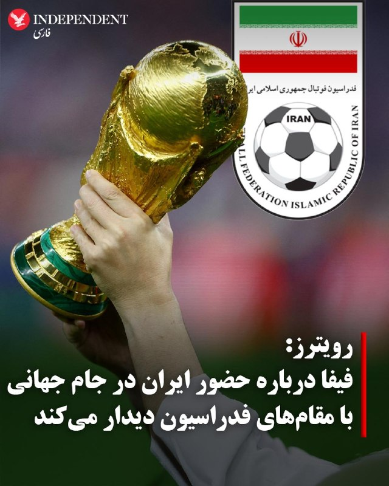

♦️خبرگزاری رویترز به نقل از یک منبع آگاه گزارش داد که ماتیاس گرافستروم، دبیرکل فیفا، روز شنبه در استانبول با مقام‌های فدراسیون فوتبال ایران دیدار خواهد کرد تا درباره حضور تیم ملی ایران در جام جهانی با آنها گفتگو کند.
ایران قرار است هر سه بازی مرحله گروهی خود در جام جهانی را در ایالات متحده برگزار کند، اما از زمان حملات آمریکا و اسرائیل به ایران در اسفندماه گذشته، حضور تیم ملی ایران در این رقابت‌‌ها با ابهام‌هایی روبه‌رو شده است.
به گزارش رویترز، انتظار می‌رود مقام‌های فیفا در این دیدار درباره وضعیت حضور ایران در این مسابقات توضیح داده و پیام‌هایی «با هدف کاهش نگرانی‌ها» ارائه کنند.
پیشتر مهدی تاج، رئیس فدراسیون فوتبال ایران در اظهاراتی متناقض، با اعلام حضور «قطعی» تیم‌ ملی در جام‌جهانی، برای شرکت دراین رقابت‌ها شروط تعیین کرده بود.
‌🇸🇦 Indypersian

🤖 @VahidOOnLine

## VahidOOnLine — post 240419

  

⭕️ ثبت بیش از ۲۵۰ زمین‌لرزه در ایران طی سه هفته اخیر

♦️بر اساس گزارش موسسه ژئوفیزیک دانشگاه تهران، از ۲۹ فروردین تا ۱۸ اردیبهشت‌ماه امسال بیش از ۲۵۰ زمین‌لرزه در نقاط مختلف کشور به ثبت رسیده است.
شدیدترین زمین‌لرزه این بازه، زلزله ۵.۱ ریشتری سفیدآبه در استان سیستان و بلوچستان اعلام شده، رخدادی که بار دیگر توجه‌ها را به وضعیت لرزه‌خیزی ایران و ضرورت آمادگی در برابر حوادث طبیعی جلب کرده است.
ایران به‌دلیل قرار گرفتن روی کمربند زلزله آلپ-هیمالیا، از جمله کشورهای زلزله‌خیز جهان به شمار می‌رود و کارشناسان همواره بر مقاوم‌سازی ساختمان‌ها، آموزش عمومی و آمادگی مدیریت بحران تاکید دارند.
‌🇸🇦 Indypersian

🤖 @VahidOOnLine

## pm_afshaa — post 90832

وزارت دادگستری آمریکا با صدور بیانیه‌ای، مدعی شد «محمد باقر سعد داوود السعدی»، شهروند عراقی و از اعضای شاخص کتائب حزب‌الله دستگیر شده و به ایالات متحده منتقل شده

💧 Rainbet.com the #1 Non-KYC Crypto Casino & Sportsbook @rainbetcom

😁 @Pm_Afshaa

## iaghapour — post 2614

⭕️ بحران در زیرساخت فناوری؛ سقوط درآمدها و خطر عقب‌ماندگی ۱۰ ساله!

اختلالات اینترنتی دیگر فقط یک مشکل ساده برای کاربران عادی نیست؛ بلکه به گفته رئیس کمیسیون شبکه سازمان نصر، تیشه به ریشه‌ی زیرساخت‌های فناوری کشور زده است. این وضعیت نه تنها درآمد شرکت‌ها را تا ۷۰ درصد کاهش داده، بلکه باعث فرار متخصصان کلیدی و فرسودگی شدید تجهیزات شده است.

🔹 سقوط درآمد و انفجار هزینه‌ها: شرکت‌های حوزه شبکه با کاهش درآمد ۳۰ تا ۷۰ درصدی روبرو هستند. از سوی دیگر، به دلیل اختلال در مسیریابی و افت کیفیت، این شرکت‌ها مجبور به پرداخت جریمه‌های سنگین ناشی از نقض توافق‌نامه سطح خدمات (SLA) شده‌اند.

🔸 تهدید امنیت سایبری: محدودیت دسترسی به مخازن اصلی و سرورهای به‌روزرسانی جهانی، ریسک نفوذ و حملات سایبری را تا ۴۰ درصد افزایش داده است. در واقع، امنیت سایبری قربانی ناپایداری شبکه شده است.

🔹 تخلیه ژنتیکی تخصص: صنعت شبکه با بحران خروج نیروهای کلیدی مواجه است. تربیت یک متخصص ارشد سال‌ها زمان و هزینه‌ی ارزی سنگین می‌طلبد که با مهاجرت این افراد، سرمایه‌های انسانی چند میلیاردی کشور به راحتی از دست می‌رود.

🔸 عقب‌ماندگی ۱۰ ساله: ادامه این وضعیت، ایران را با شکاف تکنولوژیک ۱۰ ساله نسبت به کشورهای منطقه مواجه می‌کند؛ شکافی که در فضای پرشتاب فناوری، جبران آن تقریباً غیرممکن خواهد بود.

زیرساخت شبکه کشور به جای اتصال طبیعی به اینترنت جهانی، در حال حرکت به سمت یک ساختار جزیره‌ای و فرسوده است. اگر ثبات پیش‌بینی‌پذیر به این فضا بازنگردد، شرکت‌های بزرگ فناوری به اپراتورهای ساده تجهیزات قدیمی تنزل پیدا خواهند کرد. / دیجیاتو

🆔 @iaghapour

## mamlekate — post 103533

  

دیشب کانال «چشم عقاب» رفت روی ماهواره. مدتی بود روی این پروژه کار می‌کردم.

روش کار ساده است: کانال ماهواره را روی تلویزیون باز می‌کنی، کیوآر کدها پشت سر هم روی صفحه می‌آیند، اپ چشم عقاب روی گوشی اندروید با دوربین آن‌ها را می‌خواند، خبر روی گوشی ذخیره می‌شود. کاملاً آفلاین. گوشی حتی مجوز اینترنت هم ندارد. هر پخش امضای دیجیتال دارد، اپ پخش‌های جعلی را رد می‌کند.

داخل اپ خبر از چند رسانه فارسی و خارجی، توییت‌های اکانت‌های اضافه شده به سیستم، پیام‌های کانال‌های تلگرامی، و کانفیگ فیلترشکن می‌رسد، تا هرکسی توانست به اینترنت وصل شود راهی داشته باشد. توجه داشته باشید از سایت چشم عقاب میتونید کانال تلگرام یا اکانت ایکس مورد علاقه خودتون رو که فکر می‌کنید برای مردم مناسب است را پیشنهاد بدین.

الان بیش از ۷۰ روز از یکی از طولانی‌ترین قطعی‌های اینترنت در تاریخ ایران می‌گذرد. این یکی از روش‌هایی است که برای رساندن خبر به‌طور مطمئن به دست مردم می‌بینم.

هزینه اجاره کانال برای یک ماه تأمین شده است. بعدش اگر کسی نباشد که کمک کند، قطع می‌شود. فعلا نه فاند دولتی برای این پروژه گرفته‌ام، نه از رسانه‌ای پول، هیچ. تنها راه ادامه‌اش حمایت مستقیم مردمی است.

اگر اندرویدی هستید، نصبش کنید و برای کسانی که به اینترنت دسترسی ندارند یکطوری اپلیکیشن رو بهشون برسون اگر باهاش حال کردی. اگر نمی‌توانید نصب کنید، حداقل همرسانی کنید. و اگر می‌توانید حمایت مالی هم کنید، الان از هر چیز دیگری مهم‌تر است.

https://x.com/NarimanGharib/status/2052054823025942545
https://cheshmehoghab.app/

دانلود اپلیکیشن اندروید:

https://t.me/CheshmehOghabApp/11

## mamlekate — post 103532

📝 نیویورک‌تایمز: آمریکا و اسرائیل برای جنگ جدید آماده می‌شوند

به گزارش نیویورک‌تایمز، دونالد ترامپ پس از بازگشت از چین با تصمیمی تعیین‌کننده درباره ایران روبه‌رو شده است؛ در حالی که مذاکرات برای کاهش تنش متوقف مانده، آمریکا و اسرائیل آماده‌سازی‌های گسترده‌ای را برای احتمال ازسرگیری حملات نظامی علیه جمهوری اسلامی آغاز کرده‌اند.

📝 ترامپ به آمریکایی‌ها: فشار اقتصادی را تحمل کنید؛ باید جلوی «گروهی دیوانه» را بگیریم

ترامپ در گفت‌وگو با فاکس‌نیوز با اشاره به افزایش هزینه‌های اقتصادی ناشی از تقابل با جمهوری اسلامی، از آمریکایی‌ها خواست این فشار کوتاه‌مدت را تحمل کنند و گفت جلوگیری از تهدید حکومت ایران اولویتی بالاتر از پیامدهای کوتاه‌مدت اقتصادی دارد.

@mamlekate

## mamlekate — post 103531

  <a href="telegram/content/mamlekate_103531_1778920380.mp4" target="_blank">🎬 Download video</a>

علی موسوی، پسر عبدالرحیم موسوی، رئیس پیشن ستاد کل نیروهای مسلح جمهوری اسلامی، گفت که جنازه پدرش که در نخستین روز حملات اسرائیل و آمریکا به بیت رهبر کشته شد نزدیک به ۳۰ روز در زیر آوار ماند و یک ماه در جستجوی جنازه اش بودند.

موسوی پس از کشته شدن محمد باقری در جنگ ۱۲ روزه، به‌عنوان رییس ستاد کل نیروهای مسلح منصوب شده بود.

indypersian
@mamlekate

## IranIntlTV — post 337429

  

حسین شریعتمداری، نماینده رهبر جمهوری اسلامی در روزنامه کیهان، نوشت کشورهای عربستان سعودی، امارات متحده عربی، کویت، قطر، بحرین و اردن در جنگ اخیر «حضور و شرکت مستقیم داشتند» و به همین دلیل، باید «بخشی از اهداف نشاندار» حکومت ایران در انتقام خون علی خامنه‌ای باشند.

او افزود مذاکره با آمریکا و این کشور‌های عربی «بخشی از سازوکار تعریف‌شده نظام» است، اما «جنگ نباید و نمی‌تواند بدون انتقام سخت از قاتلان امام شهیدمان به نقطه پایان برسد».
https://iranintl.com/202605169925

## IranIntlTV — post 337428

  

🔻رویترز به نقل از یک منبع آگاه گزارش داد که متیاس گرافستروم، دبیرکل فیفا، روز شنبه در استانبول با مقام‌های فدراسیون فوتبال ایران دیدار می‌کند و درباره حضور تیم ملی در جام جهانی ۲۰۲۶ «اطمینان خاطر» خواهد داد. این درحالی است که مهدی تاج پیش از این خواستار تضمین‌هایی از فیفا شده بود.

🔹به گفته این منبع، «فیفا با مقام‌های ذی‌ربط همکاری نزدیک دارد تا همه تیم‌های حاضر در جام جهانی بتوانند در محیطی امن و مطمئن رقابت کنند.»

🔹فدراسیون فوتبال در فاصله کمتر از یک ماه تا آغاز جام‌جهانی با بحران ویزا و چالش مالی دست‌به‌گریبان است. امیر قلعه‌نویی هنوز نمی‌داند کدام بازیکن ویزا خواهد گرفت و کدام بازیکن را در آمریکا در اختیار خواهد داشت.

🔹احتمال دارد برای برخی اعضای کاروان ایران به دلیل سوابق فعالیت یا ارتباط با سپاه پاسداران، ویزا صادر نشود.

🔹مهدی تاج، رییس فدراسیون فوتبال، پنج‌شنبه ۲۴ اردیبهشت گفت: «در ترکیه جلسه‌ای سرنوشت‌سازی با فیفا داریم، چون باید به ما گارانتی بدهند. مساله ویزا حل نشده و هنوز هیچ ویزایی ندادند. منتظریم ببینیم رفتار طرف مقابل چیست.»

🔹جزییات بیشتر را در سایت بخوانید

@iranintltvsport

## IranIntlTV — post 337427

  

نت‌بلاکس اعلام کرد خاموشی دیجیتال در ایران وارد دوازدهمین هفته خود شده و اکنون به هفتاد و هشتمین روز رسیده است؛ وضعیتی که به گفته این نهاد، یک قطعی بی‌سابقه در مقیاس ملی به شمار می‌رود.

بر اساس این گزارش، قطع اینترنت که کشوری با ۹۰ میلیون جمعیت را تا حد زیادی آفلاین کرده، همچنان به تضعیف گسترده حقوق بشر، اقتصاد و آزادی‌های اساسی ادامه می‌دهد.
https://iranintl.com/202605169641

## IranIntlTV — post 337426

  <a href="telegram/content/IranIntlTV_337426_1778920382.mp4" target="_blank">🎬 Download video</a>

یک کشاورز با ارسال پیامی به ایران‌اینترنشنال درباره نصف شدن سهمیه کود نسبت به سال گذشته می‌گوید: «وقتی همین سهمیه کم می‌آید، فقط دو سه روز مهلت برای خرید داریم. اگر کسی توانایی خرید نداشته باشد سهمش می‌سوزد. دولت هم سهم کود دولتی آن فرد را به صورت آزاد می‌فروشد.»

## IranIntlTV — post 337425

  <a href="telegram/content/IranIntlTV_337425_1778920384.mp4" target="_blank">🎬 Download video</a>

نشست دو روزه بریکس در دهلی‌نو بدون صدور بیانیه مشترک درباره بحران خاورمیانه پایان یافت. هند، رییس دوره‌ای نشست، اعلام کرد اختلاف‌نظر عمیق میان اعضا مانع دستیابی به موضع مشترک شده است.

گزارش راضیه دانش، خبرنگار ایران‌اینترنشنال
@iranintltv

## IranIntlTV — post 337424

  <a href="telegram/content/IranIntlTV_337424_1778920385.mp4" target="_blank">🎬 Download video</a>

اسرائیل از هدف قرار گرفتن عزالدین حداد، فرمانده شاخه نظامی حماس و از طراحان حمله ۷ اکتبر، در حمله هوایی به غزه خبر داد. او ارشدترین مقام حماس است که پس از توافق آتش‌بس در غزه هدف حمله قرار گرفته است.

اشکان صفایی، خبرنگار ایران‌اینترنشنال، گزارش می‌دهد
@iranintltv

## IranIntlTV — post 337423

  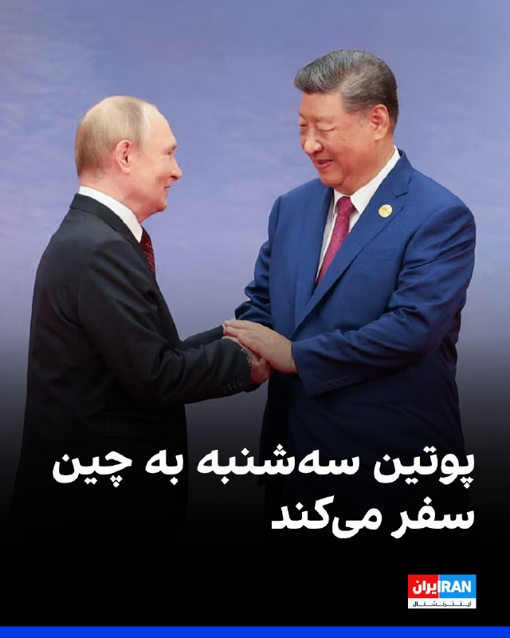

کرملین در بیانیه‌ای اعلام کرد ولادیمیر پوتین، رییس‌جمهوری روسیه، به‌زودی راهی چین خواهد شد و در روزهای سه‌شنبه و چهارشنبه، ۲۹ و ۳۰ اردیبهشت، با مقام‎‌های این کشور دیدار خواهد کرد.

بر اساس این بیانیه، پوتین و شی جین‌پینگ، رییس‌جمهوری چین، قرار است درباره «روابط دوجانبه» و «مسائل کلیدی بین‌المللی و منطقه‌ای» گفت‌وگو کنند.

پوتین در حالی به چین سفر خواهد کرد که دونالد ترامپ، رییس‌جمهوری آمریکا، سفر دوروزه خود به پکن را ۲۵ اردیبهشت به پایان رساند.
https://iranintl.com/202605160617

## IranIntlTV — post 337422

  <a href="telegram/content/IranIntlTV_337422_1778920387.mp4" target="_blank">🎬 Download video</a>

🔻در فاصله یک ماه تا شروع جام جهانی، تیم ملی فوتبال در پی انزوای سیاسی جمهوری اسلامی نتوانست با حریفان تدارکاتی مناسب دیدار کند و درباره بازی‌های تدارکاتی تناقض‌گویی در صحبت‌های مدیران فدراسیون فوتبال جمهوری اسلامی دیده می‌شود.

🔹توضیحات رها پوربخش، ایران‌اینترنشنال در برنامه هت‌تریک

🔹تماشای نشخه کامل هت‌تریک؛👇
https://youtu.be/v5Exyf8Nyes

@iranintltvsport

## IranIntlTV — post 337421

  

مسعود پزشکیان، رییس دولت جمهوری اسلامی، در پیامی به پاپ لئو، رهبر کاتولیک‌های جهان، از آنچه «موضع اخلاقی و منطقی» او در قبال جنگ ایران خواند، قدردانی کرد.

در این پیام آمده است: «حملات آمریکا و اسرائیل صرفا علیه ایران نیست، بلکه علیه حاکمیت قانون و ارزش‌های انسانی است.»

پزشکیان افزود جمهوری اسلامی «در چارچوب دفاع مشروع، اهداف و منافع متجاوزین را مورد هدف قرار داد».

او همچنین خواستار واکنش «مسئولانه» جامعه جهانی به «اقدامات غیرقانونی» ایالات متحده شد.
https://iranintl.com/202605167385

## IranIntlTV — post 337420

  <a href="telegram/content/IranIntlTV_337420_1778920389.mp4" target="_blank">🎬 Download video</a>

یک شهروند با ارسال پیامی از تهران به ایران‌اینترنشنال می‌گوید: «انسولین نوراپید دانه‌ای ۹۰۰ هزار تومان شده و قرص مُداسین هم کلا پیدا نمی‌شود. داروخانه می‌گوید از داروهای گیاهی استفاده کنید. لعنت بر جمهوری اسلامی که ما را به این روز انداخته و نیم قرن ما به عقب برگردانده.»

## IranIntlTV — post 337419

  <a href="telegram/content/IranIntlTV_337419_1778920390.mp4" target="_blank">🎬 Download video</a>

روح‌الله رحیم‌پور، روزنامه‌نگار و تحلیل‌گر سیاسی، گفت احتمال حمله به زیرساخت‌های انرژی و بنادر ایران برای افزایش فشار بر جمهوری اسلامی بسیار بالاست. او تاکید کرد احتمال گسترش جنگ در شرایط کنونی بسیار جدی است.
@iranintltv

## IranIntlTV — post 337418

  <a href="telegram/content/IranIntlTV_337418_1778920391.mp4" target="_blank">🎬 Download video</a>

جاویدنامان انقلاب ملی ایرانیان
«سورنا گلگون» در شهر شهسوار (تنکابن) از پشت هدف گلوله نیروهای سرکوب جمهوری اسلامی قرار گرفت و با اصابت گلوگه به قلبش کشته شد. نامش در حافظه‌ این سرزمین می‌ماند و یادش چراغ راه آزادی‌خواهان است.
@iranintltv

## IranIntlTV — post 337417

  <a href="telegram/content/IranIntlTV_337417_1778920393.mp4" target="_blank">🎬 Download video</a>

🔻محمد تقوی، ایران اینترنشنال در برنامه هت‌تریک درباره خواندن ترانه تیم ملی از سوی پرواز همای گفت: «همان‌طور که در ورزش می‌‎بینیم آدم‌ها سقوط اخلاقی می‌کنند، این شخص هم سقوط کرد. این افراد هسته‌های پنهانی هستند که حکومت آنها را برای چنین روزهایی آماده کرده و از آنها استفاده می‌کند.»

@iranintltvsport

## IranIntlTV — post 337416

🗣روایت شما از زندگی در آتش‌بس- شنبه ۲۶ اردیبهشت ۱۴۰۵

🔹از قزوین ۲۶ اردیبهشت؛ از ساعت ۶ صبح یه‌سری صدا از آسمون می‌شنوم که مثل صدای جنگنده‌ست و رد می‌شه.

🔹بامداد ۲۶ اردیبهشت صدای جنگنده می‌اومد در ارومیه.

🔹اینجا اوضاع واقعاً خرابه، من ۴ ماه پیش تخم‌مرغ خریدم ۲۵۰ یه شونه، الان ۶۷۰ تومن یه شونه تخم‌مرغ.

🔹سیستم آموزشی بسیار ضعیفه و معلم‌ها فقط با روزی ۲ تا کلیپ از اینترنت کتاب رو تموم کردن، حالا بچه‌ی اول دبستانی رو می‌گن باید بیاد حضوری مدرسه در اهواز.

🔹بنزین در استان بوشهر تقریباً نایاب شده. دکه‌های کنار جاده لیتری ۱۰ هزار تومان، در بشکه‌های پنج لیتری می‌فروشن.

🔹هر شب آب ولنجک و محمودیه رو تا صبح قطع می‌کنن. روزها هم فشار آب اون‌قدر کم شده که ورودی منبع مدام قطع‌و‌وصل می‌شه. به نظر می‌رسه قطعی آب رو هم دارن عادی‌سازی می‌کنن.

🔹از اصفهان دانش‌آموز پایه نهمی‌ام. درس خوندنم با اینترنت و کلیپ‌های معلم‌ها بود. از هوش مصنوعی استفاده زیادی برای درس‌ها داشتم. الان دسترسی ندارم. قیمت VPN اومده پایین تا ۲۸۰ هزار تومن. ولی ما دانش‌آموزان... هی آقایون فروشنده VPN، خدا رو همه رو وصل کنید. #وی‌پی‌ان‌‌برای‌همه

🔹از ملارد استان تهران؛ از ساعت ۱۲ شب تا ۵ صبح آب اینجا قطع بود. با این وجود، به‌تازگی از ساعت ۲ بعدازظهر تا ۶ عصر هم قطع می‌کنن.

## Shin_Persian — post 6026

↩️ Quoted tweet: سكاي نيوز عربية-عاجل ✓ @SkyNewsArabia_B Sat, 16 May 2026 06:21:13 UTC أ ف ب: دوي انفجارات في بغداد ↩️ Quoted tweet — see the post below for the reply. English AFP: Sounds of explosions in Baghdad 𝕏 · @shin_persian

## Shin_Persian — post 6025

↩️ Quoted tweet:
سكاي نيوز عربية-عاجل ✓ @SkyNewsArabia_B
Sat, 16 May 2026 06:21:13 UTC

أ ف ب: دوي انفجارات في بغداد

↩️ Quoted tweet — see the post below for the reply.

English

AFP: Sounds of explosions in Baghdad

𝕏 · @shin_persian

## ManotoTV — post 105508

  <a href="telegram/content/ManotoTV_105508_1778920394.mp4" target="_blank">🎬 Download video</a>

گروه ناظر اینترنتی نت‌بلاکس اعلام کرد خاموشی دیجیتال در ایران اکنون وارد دوازدهمین هفته و هفتادوهشتمین روز خود شده است.
نت‌بلاکس می‌گوید این قطع اینترنت که یک کشور ۹۰ میلیونی را برای مدتی بی‌سابقه تا حد زیادی از دسترسی به اینترنت جهانی محروم کرده، همچنان در حال تضعیف حقوق بشر، اقتصاد و آزادی‌های اساسی در ایران است.

## ManotoTV — post 105507

  <a href="telegram/content/ManotoTV_105507_1778920394.mp4" target="_blank">🎬 Download video</a>

رسانه‌های عراقی گزارش دادند صدای انفجارهایی که روز شنبه در بغداد، پایتخت عراق شنیده شد، ناشی از شلیک گلوله‌های توپخانه به مناسبت تشکیل دولت جدید بوده است.
یک منبع امنیتی به خبرگزاری فرانسه گفت این شلیک‌ها همزمان با آغاز به کار دولت به ریاست نخست‌وزیر جدید عراق، علی الزیدی، انجام شده است.
پیش‌تر برخی رسانه‌ها از شنیده شدن چند انفجار در مرکز بغداد خبر دادند.

## ManotoTV — post 105506

  <a href="telegram/content/ManotoTV_105506_1778920395.mp4" target="_blank">🎬 Download video</a>

ارتش اسرائیل اعلام کرد در پی فعال شدن هشدار نفوذ پهپاد در منطقه میرون، یک هدف هوایی مشکوک شناسایی شده است.
ارتش اسرائیل همچنین اعلام کرد جزئیات این رویداد در حال بررسی است و این حادثه بدون تلفات پایان یافته اس

## FarsiVOA — post 217876

  

ارتش اسرائیل اعلام کرد پیش از آغاز حملات هوایی علیه مواضع حزب‌الله در جنوب لبنان، برای ساکنان ۹ روستا هشدار تخلیه صادر کرده است.

بر اساس این هشدار، ساکنان قعقعیه الصنوبر، کوثریه السیاد، مروانیه، غسانیه، تفاحتا، ارزی، بابلیه، انصار و بیصاریه باید دست‌کم یک کیلومتر از محل سکونت خود فاصله بگیرند.

سخنگوی ارتش اسرائیل گفت این اقدام در پی نقض توافق آتش‌بس از سوی حزب‌الله انجام می‌شود و ارتش اسرائیل قصد آسیب‌زدن به غیرنظامیان را ندارد.
@FarsiVOA

## FarsiVOA — post 217875

  

آمارهای اداره تنظیم بازار انرژی ترکیه از جهش ۸۲ درصدی صادرات گاز ایران به ترکیه در اولین ماه آغاز عملیات نظامی مشترک اسرائیل و آمریکا علیه جمهوری اسلامی خبر داد.

ایران در ماه مارس بیش از ۸۲۳ میلیون متر مکعب گاز تحویل ترکیه داده و سهمی بالای ۱۳ درصدی در کل واردات گاز ترکیه داشته است. واردات گاز ترکیه از ایران در سه ماهه ابتدایی ۲۰۲۶ نیز بیش از دو برابر شده و به یک میلیارد و ۷۵۶ میلیون متر مکعب اوج گرفته است.

این در حالی است که ایران با کسری شدید گاز در داخل کشور مواجه است و قرارداد ۲۵ ساله صادرات گاز ایران به ترکیه نیز در هفته‌های پیش رو به اتمام می‌رسد. پیشتر وزیر انرژی ترکیه گفته بود که مذاکراتی برای تمدید این قرارداد در جریان نیست.
@FarsiVOA

## FarsiVOA — post 217874

  

خبرگزاری رویترز از قول یک منبع آگاه گزارش داده که دبیر کل فیفا با مقامات فدراسیون فوتبال ایران در استانبول دیدار خواهد کرد.

این منبع که نامی از او برده نشده گفته است ماتیاس گرافستروم درباره حضور ایران در جام جهانی به مقامات فدراسیون ایران «اطمینان خاطر» خواهد داد.

پس از آنکه مهدی تاج، رئیس فدراسیون فوتبال ایران، به دلیل ارتباط با سپاه پاسداران از ورود به کانادا برای شرکت در کنگره فیفا در ونکوور در اوایل ماه جاری منع شد، پرسش‌های بیشتری درباره وضعیت حضور ایران مطرح شد.

آمریکا و کانادا که همراه با مکزیک میزبان جام جهانی هستند، سپاه پاسداران را «سازمان تروریستی» طبقه‌بندی کرده‌ و گفته‌اند افرادی را که با سپاه ارتباط دارند، نخواهند پذیرفت.
@FarsiVOA

## FarsiVOA — post 217873

🔺نیویورک‌تایمز: آمریکا و اسرائیل آماده شروع حملات به جمهوری اسلامی می‌شوند

◾️نیویورک‌تایمز به نقل از دو مقام خاورمیانه‌ای گزارش داد که آمریکا و اسرائیل در حال انجام فشرده‌ترین آماده‌سازی‌ها از زمان آتش‌بس ماه گذشته برای ازسرگیری احتمالی حملات علیه ایران هستند؛ حملاتی که ممکن است از اوایل هفته آینده در دستور کار قرار گیرد.

◾️بر اساس این گزارش، یکی از گزینه‌های مورد بررسی آمریکا، اعزام نیروهای ویژه به خاک ایران برای خارج‌کردن مواد هسته‌ای مدفون زیر آوار تأسیسات بمباران‌شده است.

◾️این گزارش در شرایطی منتشر شده که دونالد ترامپ، رئیس جمهوری آمریکا، به تازگی در گفت‌وگویی با فاکس‌نیوز گفت: «خیلی بیشتر از این صبر نخواهم کرد» و افزود که تهران باید با آمریکا به توافق برسد.

⬇️ بیشتر بخوانید:
https://ir.voanews.com/a/8150653.html

## FarsiVOA — post 217872

  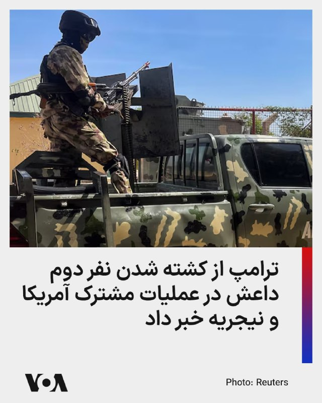

دونالد ترامپ، رئیس جمهوری آمریکا، اعلام کرد نیروهای آمریکایی و ارتش نیجریه در عملیاتی مشترک، ابوبلال المینوکی، از فرماندهان ارشد داعش را کشته‌اند؛ فردی که ترامپ او را «نفر دوم داعش در سطح جهانی» و «فعال‌ترین تروریست جهان» توصیف کرد.

ترامپ در پیامی در شبکه اجتماعی تروث‌سوشال گفت این عملیات «به دستور» او و با اجرای نیروهای آمریکایی و نیجریه‌ای انجام شده و هدف آن حذف المینوکی از میدان نبرد بوده است. او نوشت المینوکی تصور می‌کرد می‌تواند در آفریقا پنهان شود، اما منابع اطلاعاتی آمریکا تحرکات او را زیر نظر داشتند.

ترامپ محل دقیق این عملیات را اعلام نکرد، اما از دولت نیجریه برای همکاری در این مأموریت قدردانی کرد. آسوشیتدپرس نیز به نقل از یک مقام آمریکایی گزارش داد که واشنگتن، المینوکی را چهره‌ای کلیدی در سازمان‌دهی و تأمین مالی داعش می‌دانست و معتقد بود او در طراحی حملات علیه آمریکا و منافع این کشور نقش داشته است.

بر اساس گزارش رویترز، المینوکی تبعه نیجریه بود و در سال ۲۰۲۳، در فهرست «تروریست‌های جهانی به‌طور ویژه تحریم‌شده» قرار گرفته بود.
@FarsiVOA

## DW_Farsi — post 124750

  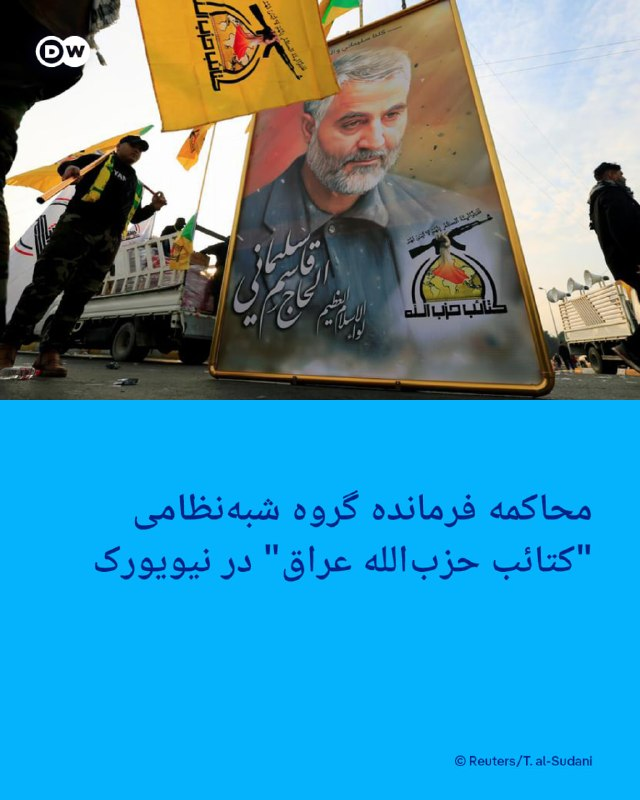

🔶 محاکمه فرمانده گروه شبه‌نظامی "کتائب حزب‌الله عراق" در نیویورک

محمد باقر سعد داوود ساعدی، فرمانده شبه‌نظامی عراق به "دست داشتن در چندین حمله علیه منافع آمریکا در اروپا" متهم شده است.

وزارت دادگستری آمریکا روز جمعه ۲۵ اردیبهشت (۱۵ مه) اعلام کرد این فرمانده نظامی پس از بازداشت و برای پاسخ به شش اتهام مرتبط با "تروریسم" به ایالات متحده منتقل شده است.

مقام‌های قضایی آمریکا گفتند ساعدی عضو ارشد گروه شبه‌نظامی "کتائب حزب‌الله" مورد حمایت ایران بوده و به حمایت مادی از یک سازمان تروریستی خارجی متهم است.

ایالات متحده کتائب حزب‌الله عراق را به عنوان یک گروه ترویستی می‌شناسد.

دادستان نیویورک می‌گوید ساعدی متهم است که در هماهنگی یا حمایت از نزدیک به ۲۰ حمله و اقدام به حمله در سراسر اروپا و ایالات متحده نقش داشته است.

دولت آمریکا و کارشناسان مستقل می‌گویند کتائب حزب‌الله تحت هدایت نیروی قدس سپاه پاسداران فعالیت می‌کند.

@dw_farsi

## DW_Farsi — post 124749

  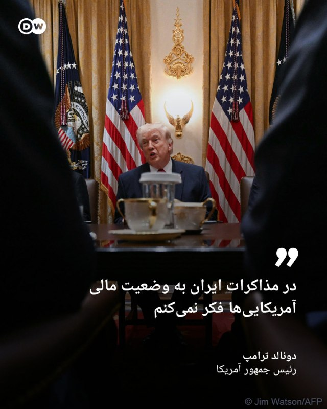

🔶 ترامپ: در مذاکرات ایران به وضعیت مالی آمریکایی‌ها فکر نمی‌کنم

دونالد ترامپ، رئیس‌ جمهور آمریکا روز جمعه ۲۵ اردیبهشت (۱۵ مه) در مصاحبه با "فاکس‌نیوز" گفت که پیامدهای سیاسی جنگ ایران بر انتخابات میان‌دوره‌ای را در نظر نمی‌گیرد؛ انتخاباتی که جمهوری‌خواهان باید در آن اکثریت شکننده خود را در هر دو مجلس حفظ کنند.

او افزود: «وقتی درباره ایران صحبت می‌کنم، فقط یک چیز مهم است؛ آنها نباید سلاح هسته‌ای داشته باشند. من به وضعیت مالی آمریکایی‌ها فکر نمی‌کنم، به هیچ‌کس فکر نمی‌کنم؛ فقط به این فکر می‌کنم که ایران نباید سلاح هسته‌ای داشته باشد.»

ترامپ روز سه‌شنبه ۱۲ مه نیز تاکید کرده بود که عدم دستیابی به سلاح هسته‌ای از سوی ایران را مهم‌تر از وضعیت مالی آمریکایی‌ها می‌داند. این اظهارات با انتقاد گسترده دموکرات‌ها روبه‌رو شد، در حالی که شماری از جمهوری‌خواهان از او دفاع کردند.

ترامپ در گفت‌وگو با فاکس‌نیوز که در جریان سفرش به چین ضبط شده بود، خاطرنشان کرد که در جریان مذاکرات برای پایان دادن به جنگ ایران و بازگشایی تنگه هرمز، ممکن است "مشکلات کوتاه‌مدت" از جمله افزایش قیمت انرژی رخ دهد. ترامپ تاکید کرد که با افزایش قیمت بنزین مشکلی ندارد، اگر این موضوع به تحقق اهداف آمریکا در قبال ایران کمک کند.

ترامپ همچنین گفت: «اگر به مردم گفته شود که قرار است برای مدتی کوتاه بهای بیشتری برای بنزین بپردازند، چون هدف جلوگیری از دستیابی یک دیوانه به سلاح هسته‌ای است، همه خواهند گفت مشکلی نیست.»

از زمان آغاز حملات آمریکا و اسرائیل به ایران، قیمت بنزین در آمریکا افزایش یافته است، اما به گفته ترامپ این قیمت پس از پایان بحران و بازگشایی تنگه هرمز کاهش خواهد یافت.

@dw_farsi

## DW_Farsi — post 124748

🔶 آیا فاصله ایران با بمب اتمی واقعا کوتاه است؟

🔻 گزارشی از مراد رحمتی

اینکه گفته می‌شود جمهوری اسلامی به ساخت بمب اتمی نزدیک‌تر شده، موضوع تازه‌ای نیست. پیش از جنگ ائتلاف آمریکا و اسرائیل علیه ایران رافائل گروسی، مدیرکل آژانس بین‌المللی انرژی اتمی، اعلام کرده بود که ایران "فاصله زیادی تا دستیابی به سلاح هسته‌ای ندارد".

گروسی توسعه سلاح هسته‌ای را به حل یک پازل تشبیه کرده و گفته بود که ایران "قطعات این پازل را دارد و ممکن است روزی بتواند آن‌ها را کنار هم بگذارد".

استیو ویتکاف، نماینده ترامپ در مذاکرات با جمهوری اسلامی هم گفته بود که مذاکره‌کنندگان ارشد ایران در دور نخست گفت‌وگوهای خود با آمریکا گفته‌ بودند ۴۶۰ کیلوگرم اورانیوم با غنای ۶۰ درصد در اختیار دارند و می‌دانند که از این مقدار می‌توان ۱۱ بمب هسته‌ای ساخت.

اما این اظهارنظر پیش از جنگ ائتلاف آمریکا و اسرائیل علیه ایران بیان شده است.

حال کریس رایت، وزیر انرژی آمریکا روز پنجشنبه ۲۴ اردیبهشت (۱۴ مه) سه ماه بعد از جنگ در جلسه کمیته نیروهای مسلح سنا گفت که "ایران به غنای ۶۰ درصد رسیده و ۹۰ درصد راه را طی کرده است". به گفته این مقام دولت ترامپ جمهوری اسلامی تنها "چند هفته" با دستیابی به مواد لازم برای ساخت سلاح هسته‌ای فاصله دارد.

آیا این ارزیابی‌ها یک واقعیت فنی را نشان می‌دهند یا بیشتر بازتاب نگاه سیاسی به پرونده هسته‌ای ایران هستند و آیا فاصله میان "تولید مواد لازم" و "ساخت سلاح هسته‌ای" واقعا در حد چند هفته است؟

@dw_farsi

## RadioFarda — post 157250

  

🔸وزیر نفت جدید عراق، روز شنبه ۲۶ اردیبهشت در یک کنفرانس مطبوعاتی اعلام کرد که این کشور در ماه آوریل (۱۲ فروردین تا ۱۰ اردیبهشت) ۱۰ میلیون بشکه نفت از طریق تنگه هرمز صادر کرده است.

🔸باسم محمد هم‌چنین گفت که کشورش قصد دارد برای افزایش ظرفیت تولید و صادرات کشور با اوپک همکاری کند و افزود که بغداد قصد دارد به ظرفیت تولید پنج میلیون بشکه در روز برسد.

🔸بغداد پیش از این اعلام کرده بود که با ایالات متحده و ایران به «تفاهماتی» مبنی بر کاهش پیامدهای محاصره تنگه هرمز بر صادرات نفت عراق دست یافته است.

🔸مقامات عراقی اوایل ماه آوریل اعلام کرده بودند که این کشور با از سرگیری صادرات نفت ۲۵۰ هزار بشکه در روز از طریق بندر جیحان ترکیه، صادرات نفت خام را با استفاده از کامیون‌های نفتکش از طریق سوریه آغاز کرده است.

@RadioFarda

## RadioFarda — post 157249

  

🔸دونالد ترامپ، رئیس جمهور آمریکا، در مصاحبه‌ای تازه با شبکه فاکس‌نیوز گفت که در پی آتش‌بس حکومت ایران «پنج بار» تا آستانه توافق کامل با آمریکا آمده، اما در لحظه آخر عقب کشیده است.

🔸او در این مصاحبه تأکید می‌کند: «هر بار که توافق می‌کنند، روز بعد انگار نه انگار که با هم حرف زده‌ایم. و این پنج بار اتفاق افتاده است. یک جای کارشان ایراد دارد. راستش دیوانه‌اند.»

🔸او چنین ادامه می‌دهد: «و چون دیوانه‌اند، نباید به سلاح هسته‌ای دست پیدا کنند.»

🔸آن طور که رئیس جمهور آمریکا در این مصاحبه نقل می‌کند، حکومت ایران در مذاکرات اخیر حتی پذیرفته است که کل اورانیوم غنی‌شده‌اش را تحویل دهد.

🔸ترامپ گفت: «هسته‌ای خلاص. قرار بود غبار هسته‌ای را به ما بدهند. هر چه که ما خواسته بودیم.»

🔸این‌ها نکاتی است که دونالد ترامپ پیش از سفرش به چین هم با خبرنگاران در میان گذاشته بود.

🔸این در حالی است که مقام‌های جمهوری اسلامی از جمله عباس عراقچی، وزیر خارجه، تکذیب می‌کنند که شرایط آمریکا را پذیرفته‌اند.

@RadioFarda

## RadioFarda — post 157248

  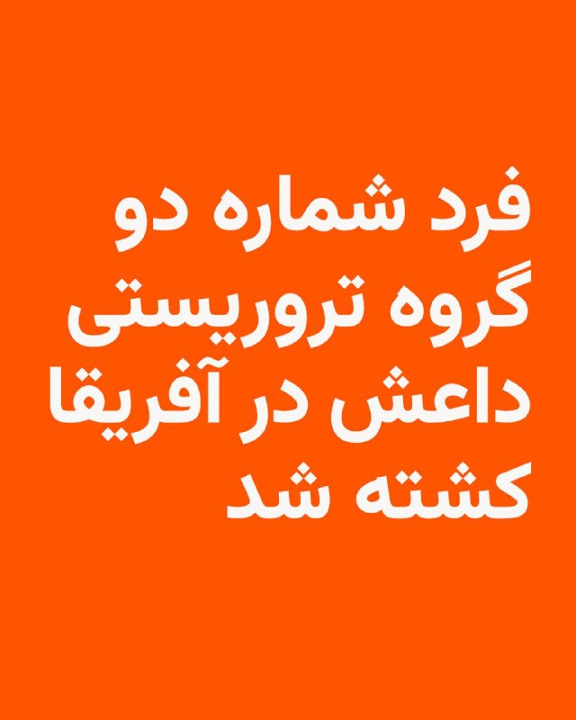

🔸دونالد ترامپ، رئیس جمهور آمریکا، بامداد شنبه در شبکه اجتماعی خود اعلام کرد که فرد شماره دو گروه تروریستی داعش، حکومت اسلامی، در عملیات مشترک ارتش آمریکا و ارتش نیجریه کشته شده است.

🔸ترامپ این فرد را «ابو بلال المینوکی» معرفی کرده است.

🔸به گفته رئیس جمهور آمریکا، با حذف این عضو ارشد داعش به عملیات این گروه در سطح جهان لطمه بزرگی وارد شده است.

🔸گروه امارت یا حکومت اسلامی، معروف به داعش، بیش از یک دهه پیش از دل هرج و مرجی ظهور کرد که در پی بروز جنگ داخلی در سوریه پیش آمد. این گروه در سال‌های اول به‌سرعت پیشروی کرد و در سوریه و عراق مناطق وسیعی را به تصرف درآورد.

🔸با این حال پس از آن گروه داعش در هر دو کشور متحمل شکست‌های سنگین شد و اکنون گفته می‌شود که جز هسته‌هایی کوچک از آن باقی نمانده است. اما ارتش آمریکا هرازگاهی اعلام می‌کند که یک فرمانده محلی یا سردسته یک گروه داعش را از پا درآورده است.

@RadioFarda

## IranianMinds — post 20228

  <a href="telegram/content/IranianMinds_20228_1778920400.mp4" target="_blank">🎬 Download video</a>

🔴 تروریستارو

صداوسیما اومده اسلحه داده دست تمام مجریاش که بیان تو پخش زنده رجز‌ بخونن و تهدید کنن

@IranianMinds

## IranianMinds — post 20227

  <a href="telegram/content/IranianMinds_20227_1778920400.webm" target="_blank">🎬 Download video</a>

🎉 ۵۰۰٬۰۰۰ تومان رایگان-بونوس ویژه ثبت‌نام

🔥 با هر ثبت نام ۵۰۰ هزار تومن جایزه بگیرید

⬅️ شرط‌بندی کنید و بونوس را به موجودی واقعی تبدیل کنید

🔥 وقتشه بازی رو یه جور دیگه ببینی
⚽️  پوشش کامل مسابقات ورزشی 

📊  پیش‌بینی با بهترین ضرایب 

⚡️  تجربه سریع و حرفه‌ای

😀 پرداخت مستقیم و سریع بدون واسطه، بدون دردسر، واریز و برداشت در سریع‌ترین زمان ممکن 

😀 کانال تلگرام: 

🔴 @winro_io  

😀 هدیه خود را با ثبت نام در سایت دریافت کنید: 

🔴 Winro.io
r26
سایت اصلی در روزهای آینده بازگشایی خواهد شد 
✅

## IranianMinds — post 20225

بعضیا انگار‌ تو یه ایران دیگه زندگی‌ میکنن

@IranianMinds

## BBCPersian — post 281202

🔻وزیر نفت عراق: در ماه قبل ۱۰ میلیون بشکه نفت از طریق تنگه هرمز صادر کردیم

وزیر جدید نفت عراق امروز اعلام کرد که این کشور در ماه آوریل ۱۰ میلیون بشکه نفت از طریق تنگه هرمز صادر کرده است.

باسم محمد که در یک نشست خبری صحبت می‌کرد، همچنین گفت که عراق قصد دارد برای افزایش ظرفیت تولید و صادرات نفت خود با اوپک همکاری و رایزنی کند.

به گفته آقای محمد، بغداد در تلاش است تا ظرفیت تولید نفت عراق را به روزانه ۵ میلیون بشکه برساند.

@BBCPersian

## BBCPersian — post 281201

  

🔻کرملین روز شنبه اعلام کرد که ولادیمیر پوتین، رئیس‌جمهور روسیه ۱۹ مه /۲۹ اردیبهشت برای یک سفر دو روزه به چین خواهد رفت. این سفر در پی سفر دونالد ترامپ، رئیس‌جمهور آمریکا به پکن انجام می‌شود.

بر اساس بیانیه کرملین آقای پوتین در این سفر با شی جین‌پینگ، همتای چینی خود، درباره «مشارکت‌ همه‌جانبه و همکاری راهبردی» مسکو و پکن گفت‌وگو خواهد کرد.

به گفته کرملین رهبران دو کشور همچنین درباره «موضوعات مهم بین‌المللی و منطقه‌ای تبادل نظر خواهند کرد» و در پایان مذاکرات، یک بیانیه مشترک امضا خواهند کرد.

در جریان این سفر، آقای پوتین قرار است درباره همکاری‌های اقتصادی و تجاری با لی چیانگ، نخست‌وزیر چین، هم گفت‌وگو کند.

اعلام این سفر در حالی صورت گرفته است که آقای ترامپ دیروز سفر خود به چین را به پایان رساند و به آمریکا بازگشت.

چین که بزرگ‌ترین خریدار سوخت‌های فسیلی روسیه است، پس از اعمال تحریم‌های غرب علیه نفت و گاز روسیه، به مهم‌ترین شریک اقتصادی مسکو تبدیل شده است.

📷Getty Images
@BBCPersian

## BBCPersian — post 281200

🔻دونالد ترامپ، رئیس جمهور آمریکا گفته است که نیروهای آمریکا و نیجریه در یک عملیات مشترک، نفر دوم گروه دولت اسلامی (داعش) را کشته‌اند. آقای ترامپ در پستی در تروث سوشال گفت که ابوبلال المینوکی دیگر به مردم آفریقا آسیب نخواهد زد و نمی‌تواند برای هدف قرار دادن…

## BBCPersian — post 281193

🖊سوفیا بتیزا, بی‌بی‌سی در کی‌یف

کارینا شش‌ ماهه باردار است، اما جنینی که در رحم اوست متعلق به خودش نیست.

این زن ۲۲ ساله اهل شرق اوکراین، یک مادر جایگزین است که رویانی حاصل از تخمک و اسپرم یک زوج چینی را در شکم دارد.

زمانی که کارینا تنها ۱۷ سال داشت، خانه‌اش ویران شد؛ در آن هنگام شهر او، باخموت، در اولین مراحل تهاجم تمام‌عیار روسیه، به یکی از پرکشمکش‌ترین میدان‌های نبرد تبدیل شده بود.

در حالی که بخش اعظم شهر به تلی از آوار و خاکستر بدل شده بود، او و شریک زندگی‌اش راهی کی‌یف شدند، اما در آنجا برای یافتن شغلی پایدار با دشواری روبه‌رو گشتند.

یک روز، وقتی کارینا در فروشگاهی بود و پولش به‌زحمت به خرید نان و پوشک برای دختر یک‌ و نیم‌ ساله‌شان می‌رسید، تصمیم گرفت برای تامین معاش، رحمش را اجاره دهد.

او می‌گوید اگر به خاطر جنگ نبود، هرگز یک مادر جایگزین نمی‌شد؛ جنگی که باعث بیکاری میلیون‌ها نفر و نابودی کسب‌وکارها شده و تورم فزاینده و سقوط شدید تولید ناخالص داخلی اوکراین را به همراه داشته است.

برای خواندن مطلب کامل:
https://bbc.in/4wDd7Le
📷BBC/ Getty/ BioTexCom
@BBCPersian

## Dirty_Kids — post 389542

  

کجای دنیا دیدید کلاشینکف ببرند توی استودیو تلوزیون آموزش بدن اونهم با تیر واقعی و شلیک کنند به سقف استودیو،جز طویله صداوسیمای رژیمی که صدای نفسهای سقوط رو میشنوه @Dirty_Kids 👻

## Dirty_Kids — post 389541

  <a href="telegram/content/Dirty_Kids_389541_1778920401.mp4" target="_blank">🎬 Download video</a>

کجای دنیا دیدید کلاشینکف ببرند توی استودیو تلوزیون آموزش بدن اونهم با تیر واقعی و شلیک کنند به سقف استودیو،جز طویله صداوسیمای رژیمی که صدای نفسهای سقوط رو میشنوه

@Dirty_Kids 👻

## Dirty_Kids — post 389539

  <a href="telegram/content/Dirty_Kids_389539_1778920402.mp4" target="_blank">🎬 Download video</a>

🔴 دیشب صداوسیما اسلحه داده بود دست مجریاش تا برای دشمن رجز بخونن و تهدید کنن!

+ بوی سقوط و ضعف مساویس با دست‌وپای بیشتر

@Dirty_Kids 👻

## Hranews — post 112963

گزارشی از بازداشت یک شهروند در ارومیه

❗️
❗️
❗️
❗️
❗️– فروزان نوجوان (اسلامی)، مدرس زبان انگلیسی و اهل ارومیه، روز چهارشنبه ۲۳ اردیبهشت ماه، توسط نیروهای امنیتی در این شهرستان بازداشت و به مکان نامعلومی منتقل شد.

#فروزان_نوجوان
#فروزان_اسلامی

ادامه مطلب

↘️
@hranews_bot تماس ✉️ -  @Hranews  کانال هرانا 🆑

## Hranews — post 112962

  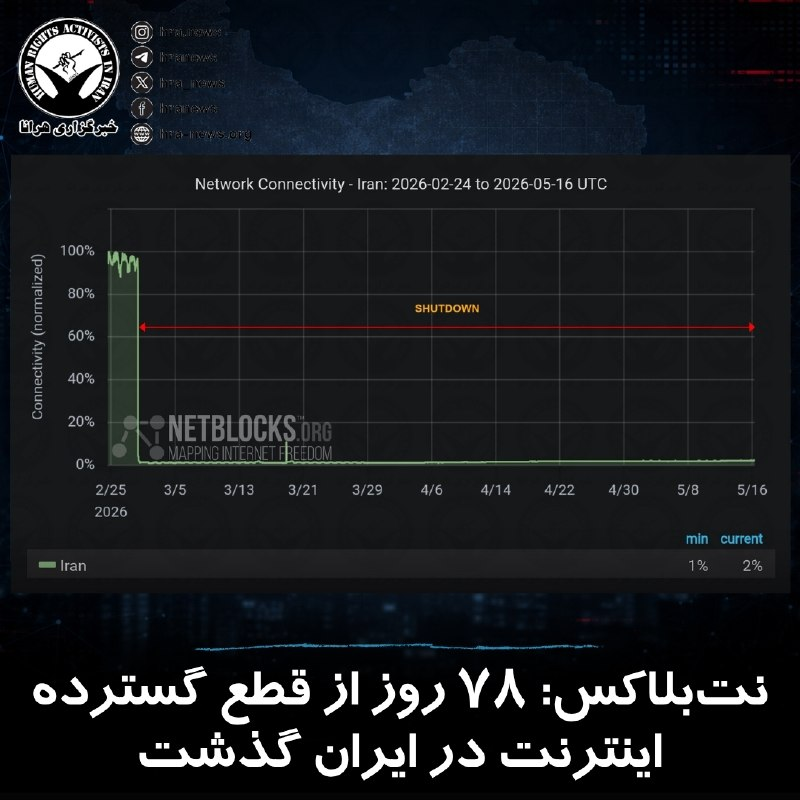

بر اساس آخرین داده‌های نت‌بلاکس، قطع #اینترنت در ایران وارد هفتادوهشتمین روز خود شده و اکنون دوازدهمین هفته از این اختلال گسترده سپری می‌شود. این نهاد ناظر بر وضعیت دسترسی به اینترنت در جهان اعلام کرد که تداوم این وضعیت، بخش عمده‌ای از جمعیت حدود ۹۰ میلیونی کشور را برای مدتی بی‌سابقه از دسترسی به اینترنت جهانی محروم کرده است.

نت‌بلاکس همچنین تاکید کرده است که ادامه این محدودیت‌ها به‌طور گسترده حقوق بشر، آزادی‌های اساسی و وضعیت اقتصادی شهروندان را تحت تاثیر قرار داده و پیامدهای آن در ابعاد مختلف همچنان رو به گسترش است.

↘️
@hranews_bot تماس ✉️ -  @Hranews  کانال هرانا 🆑

## Hranews — post 112961

یک شهروند توسط نیروهای امنیتی در سرابله بازداشت شد

❗️
❗️
❗️
❗️
❗️– محمدرضا فریادی، شهروند اهل سرابله روز چهارشنبه ۲۳ اردیبهشت ماه، توسط نیروهای امنیتی در این شهرستان بازداشت و به مکان نامعلومی منتقل شده است.

#محمدرضا_فریادی

ادامه مطلب

↘️
@hranews_bot تماس ✉️ -  @Hranews  کانال هرانا 🆑

## Hranews — post 112960

مجید درویش‌نژاد با تودیع وثیقه آزاد شد

❗️
❗️
❗️
❗️
❗️– مجید درویش‌نژاد، شهروند اهل ارومیه، با تودیع وثیقه از یکی از بازداشتگاه‌های امنیتی این شهر آزاد شد.

#مجید_درویش_‌نژاد

ادامه مطلب

↘️
@hranews_bot تماس ✉️ -  @Hranews  کانال هرانا 🆑

## manototv — post 105508

  <a href="telegram/content/manototv_105508_1778920403.mp4" target="_blank">🎬 Download video</a>

گروه ناظر اینترنتی نت‌بلاکس اعلام کرد خاموشی دیجیتال در ایران اکنون وارد دوازدهمین هفته و هفتادوهشتمین روز خود شده است.
نت‌بلاکس می‌گوید این قطع اینترنت که یک کشور ۹۰ میلیونی را برای مدتی بی‌سابقه تا حد زیادی از دسترسی به اینترنت جهانی محروم کرده، همچنان در حال تضعیف حقوق بشر، اقتصاد و آزادی‌های اساسی در ایران است.

## manototv — post 105507

  <a href="telegram/content/manototv_105507_1778920404.mp4" target="_blank">🎬 Download video</a>

رسانه‌های عراقی گزارش دادند صدای انفجارهایی که روز شنبه در بغداد، پایتخت عراق شنیده شد، ناشی از شلیک گلوله‌های توپخانه به مناسبت تشکیل دولت جدید بوده است.
یک منبع امنیتی به خبرگزاری فرانسه گفت این شلیک‌ها همزمان با آغاز به کار دولت به ریاست نخست‌وزیر جدید عراق، علی الزیدی، انجام شده است.
پیش‌تر برخی رسانه‌ها از شنیده شدن چند انفجار در مرکز بغداد خبر دادند.

## manototv — post 105506

  <a href="telegram/content/manototv_105506_1778920404.mp4" target="_blank">🎬 Download video</a>

ارتش اسرائیل اعلام کرد در پی فعال شدن هشدار نفوذ پهپاد در منطقه میرون، یک هدف هوایی مشکوک شناسایی شده است.
ارتش اسرائیل همچنین اعلام کرد جزئیات این رویداد در حال بررسی است و این حادثه بدون تلفات پایان یافته اس

## alonews — post 120343

  <a href="telegram/content/alonews_120343_1778920405.mp4" target="_blank">🎬 Download video</a>

👈ترامپ: نام افرادی را که در نزدیکی اورانیوم های غنی‌شده ایران هستند، می‌دانیم. پنجاه درصدشان اسمشان محمد است!

✅ @AloNews خبر جنگ

## alonews — post 120342

  <a href="telegram/content/alonews_120342_1778920405.webm" target="_blank">🎬 Download video</a>

👈پراید هم رویا شد ...

✅ @AloNews خبر جنگ

## alonews — post 120340

  <a href="telegram/content/alonews_120340_1778920406.webm" target="_blank">🎬 Download video</a>

👈ارتش اوکراین بامداد امروز با استفاده از پهپاد های خود حمله‌ای به یک کارخانه شیمیایی در منطقه نوینومیسک انجام داد که این کارخانه به طور فعال مواد منفجره را برای صنایع نظامی روسیه تولید می‌کرد و همچنین کارخانه صنایع فلزی متالیست پلاس در نابورژنیه چلنی روسیه نیز مورد حمله قرار گرفت.

✅ @AloNews خبر جنگ

## alonews — post 120339

  <a href="telegram/content/alonews_120339_1778920406.webm" target="_blank">🎬 Download video</a>

👈تایوان به ترامپ و چین پاسخ داد: ما تابع پکن نیستیم

🔴پس از آنکه ترامپ بعد از دیدار با شی جین پینگ گفت دنبال استقلال تایوان نیست، تایپه پاسخ داد: «تایوان یک کشور دموکراتیک، مستقل و دارای حاکمیت است و تابع جمهوری خلق چین نیست.»

🔴این پاسخ نشان میدهد تایوان نمیخواهد در معامله بزرگ واشنگتن و پکن، فقط به یک کارت مذاکره تبدیل شود. ترامپ با احتیاط حرف میزند تا با چین وارد درگیری تازه نشود، اما تایپه هم میخواهد روشن کند که هویتش را با سکوت دیپلماتیک دیگران تعریف نمیکند.

🔴برای پکن، این جمله تحریک‌آمیز است. برای واشنگتن، یادآوری دردسرساز است. چون هرچه ترامپ بخواهد پرونده تایوان را آرام نگه دارد، خود تایوان نشان میدهد حاضر نیست استقلال عملی‌اش زیر سایه توافق‌های پشت پرده کم‌رنگ شود

✅ @AloNews خبر جنگ

## alonews — post 120338

قیمت استثنایی گیگی 
2️⃣
2️⃣
2️⃣ تحویل زیر یک دقیقه
✅ دارای لینک سابسکریشن جهت دیدن حجم و کنترل مصرف
✅ بدون قطعی 
✅ بدون محدودیت کاربر و زمان
✅ جمینایو چت جی بی تی و... کامل اوکیه با سرورامون
✅ 
🏪پشتیبانی کامل
✅ شروع فعالیت از سال 2022 
✅ پرداخت ریالی
✅ ضریب و این چیزا…

## alonews — post 120337

اخبار جنگ الونیوز AloNews pinned a photo

## alonews — post 120336

  <a href="telegram/content/alonews_120336_1778920406.webm" target="_blank">🎬 Download video</a>

👈دوستان این تبلیغاتی که پائین کانال نمایش داده میشه کلاهبرداری هست و توسط خود تلگرام انجام میشه و از دست ما خارجه

🔴به هیچ عنوان اعتماد نکنید چون سرمایتون میره

✅ @AloNews خبر جنگ

## alonews — post 120335

  <a href="telegram/content/alonews_120335_1778920406.webm" target="_blank">🎬 Download video</a>

👈 انفجار ناشی از امحای مهمات در دزفول

✅ @AloNews خبر جنگ

## alonews — post 120334

  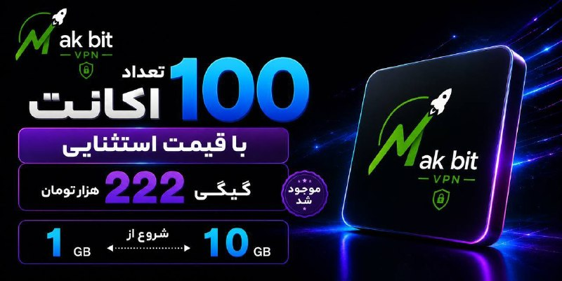

قیمت استثنایی گیگی 
2️⃣
2️⃣
2️⃣

تحویل زیر یک دقیقه
✅
دارای لینک سابسکریشن جهت دیدن حجم و کنترل مصرف
✅
بدون قطعی 
✅
بدون محدودیت کاربر و زمان
✅
جمینایو چت جی بی تی و... کامل اوکیه با سرورامون
✅

🏪پشتیبانی کامل
✅
شروع فعالیت از سال 2022 
✅
پرداخت ریالی
✅

ضریب و این چیزا ندارن و تا آخرین مگابایت برای پشتیبانیش درختمتیم
🥂

⭐️ @Napsternetiran_bot
〰️〰️〰️〰️〰️〰️〰️

🔶 @Napsternetvirani

## alonews — post 120333

  <a href="telegram/content/alonews_120333_1778920406.webm" target="_blank">🎬 Download video</a>

👈ارگان رسانه ای وابسته به سپاه نوشت: وزارت اقتصاد طرح مدیریت تنگه هرمز از طریق بیمه را پیگیری می‌کند تا امکان مدیریت بر تنگه در پساجنگ مطابق حقوق بین‌الملل فراهم شود و برای ایران آورده اقتصادی نیز داشته باش

✅ @AloNews خبر جنگ

## alonews — post 120332

  <a href="telegram/content/alonews_120332_1778920407.webm" target="_blank">🎬 Download video</a>

👈الجزیره: برق کوبا پس از خاموشی گسترده دوباره وصل شد، اما بحران انرژی همچنان ادامه دارد

🔴برق در سراسر کوبا روز جمعه پس از خاموشی‌های گسترده دوباره برقرار شد، اما بحران انرژی این کشور با کاهش شدید ذخایر نفتی همچنان ادامه دارد.

🔴شرکت ملی برق کوبا اعلام کرد که پس از قطعی برق در ۷ استان از ۱۵ استان، «سیستم برق ملی دوباره برقرار شده است»، با این حال قطعی‌های برنامه‌ریزی‌شده ادامه دارد و نیروگاه‌های قدیمی هنوز در دست تعمیر هستند.

🔴 وزیر انرژی، روز چهارشنبه اعلام کرد که ذخایر نفت کشور «تمام شده است». کمبود انرژی خشم عمومی را برانگیخته و شهروندان هاوانا با کوبیدن قابلمه و ماهیتابه اعتراض خود را نشان دادند.

🔴کوبا کاهش انرژی را ناشی از تحریم‌های آمریکا می‌داند

✅ @AloNews خبر جنگ

## alonews — post 120331

  <a href="telegram/content/alonews_120331_1778920407.webm" target="_blank">🎬 Download video</a>

👈آسوشیتدپرس: بازگشت ناو هواپیمابر جرالد فورد به پایگاه پس از ۱۱ ماه مأموریت

🔴وزارت جنگ آمریکا اعلام کرد پیت هگست، وزیر جنگ، روز شنبه در پایگاه دریایی نورفولک در ویرجینیا از ناو هواپیمابر جرالد فورد و ۴۵۰۰ ملوان آن پس از ۱۱ ماه مأموریت استقبال می‌کند.

🔴این ناو ۳۲۶ روز در دریا بوده که طولانی‌ترین استقرار یک ناو هواپیمابر آمریکایی در ۵۰ سال گذشته و سومین رکورد از زمان جنگ ویتنام است

✅ @AloNews خبر جنگ

## alonews — post 120330

  <a href="telegram/content/alonews_120330_1778920407.webm" target="_blank">🎬 Download video</a>

👈کپیتال اکونومیست: قیمت نفت به ۱۵۰ دلار در هر بشکه خواهد رسید

✅ @AloNews خبر جنگ

## alonews — post 120329

  <a href="telegram/content/alonews_120329_1778920407.webm" target="_blank">🎬 Download video</a>

👈نیروی هوایی اوکراین اعلام کرد: 269 پهپاد از 294 پهپاد پرتاب شده توسط ارتش روسیه را شب گذشته سرنگون کرده است

✅ @AloNews خبر جنگ

## alonews — post 120328

  <a href="telegram/content/alonews_120328_1778920407.webm" target="_blank">🎬 Download video</a>

👈نیویورک تایمز گزارش می‌دهد که نیروهای نظامی آمریکا "در حال آماده‌سازی برای دور دیگری از حملات هستند... این بار با شدت بیشتر. این حملات ممکن است از روز دوشنبه آغاز شود. اهداف نظامی بیشتری از ایران در نظر گرفته شده است که شامل زیرساخت‌ها نیز می‌شود."

✅ @AloNews خبر جنگ

## alonews — post 120325

  <a href="telegram/content/alonews_120325_1778920408.webm" target="_blank">🎬 Download video</a>

👈شب گذشته در بسیاری از برنامه های صداوسیما، مجریان با تفنگ حاضر شدند!

✅ @AloNews خبر جنگ

## alonews — post 120324

  <a href="telegram/content/alonews_120324_1778920408.mp4" target="_blank">🎬 Download video</a>

👈مارکو روبیو: چین کاری را انجام می‌دهد که من اگر رهبر چینی بودم انجام می‌دادم. آن‌ها تلاش می‌کنند در تمام این صنایع کلیدی آینده بر جهان مسلط شوند.

🔴 شاید ما از آن خوشمان نیاید، اما این همان کاری است که آن‌ها انجام خواهند داد زیرا به نفع بهترین منافع خود عمل می‌کنند. ما نیز باید به نفع بهترین منافع خود عمل کنیم.

✅ @AloNews خبر جنگ

---
📅 بروزرسانی: 1405/02/26 10:09
---

## VahidOOnLine — post 240418

  

کانال ۱۲ اسرائیل گزارش داد انتظار می‌رود دونالد ترامپ، رییس‌جمهوری آمریکا، طی ۲۴ ساعت آینده تیم مشاوران نزدیک خود را تشکیل دهد تا درباره ایران تصمیم نهایی بگیرد. برآوردها در اسرائیل حاکی است تصمیم درباره اقدام نظامی ممکن است بسیار به‌زودی اتخاذ شود.

برنامه تلویزیونی «اولپن شیشی» به نقل از یک مقام ارشد اسرائیلی گزارش داد که «ازسرگیری درگیری نزدیک است» و اسرائیل خود را برای احتمال «چند روز تا چند هفته جنگ» آماده می‌کند.

این مقام گفت آمریکایی‌ها دریافته‌اند که مذاکرات به سمت پیشرفت تعیین‌کننده پیش نمی‌رود و در اورشلیم در انتظار تصمیم ترامپ هستند. بر اساس این ارزیابی، تصویر کلی تحولات طی حدود ۲۴ ساعت آینده روشن‌تر خواهد شد.
‌🏁 🇬🇧 IranintlTV

🤖 @VahidOOnLine

## VahidOOnLine — post 240417

  <a href="telegram/content/VahidOOnLine_240417_1778913583.mp4" target="_blank">🎬 Download video</a>

رسانه‌های اسرائیلی گزارش داده‌اند با بازگشت دونالد ترامپ، رئیس‌جمهوری آمریکا، از سفر چین، کاخ سفید به مرحله‌ای تعیین‌کننده در پرونده ایران نزدیک شده و احتمال تصمیم‌گیری درباره اقدام نظامی در روزهای آینده افزایش یافته است.
کانال ۱۲ اسرائیل گزارش داد در اسرائیل برآورد می‌شود دونالد ترامپ طی ۲۴ ساعت آینده درباره اقدام نظامی علیه جمهوری اسلامی تصمیم‌گیری کند. این شبکه به نقل از یک مقام ارشد اسرائیلی گزارش داد «ازسرگیری درگیری‌ها نزدیک است» و اسرائیل خود را برای «روزها تا هفته‌ها درگیری» آماده می‌کند.
بر اساس این گزارش، مقام‌های اسرائیلی معتقدند آمریکا به این جمع‌بندی رسیده که مذاکرات با ایران به سمت پیشرفت جدی حرکت نمی‌کند و انتظار می‌رود تصویر روشن‌تری از تصمیم واشنگتن طی ساعات آینده مشخص شود.
‌🏁 🇬🇧 ManotoTV

🤖 @VahidOOnLine

## VahidOOnLine — post 240416

  <a href="telegram/content/VahidOOnLine_240416_1778913584.mp4" target="_blank">🎬 Download video</a>

دونالد ترامپ، رئیس‌جمهوری آمریکا، در تروث سوشیال اعلام کرد نیروهای آمریکایی و ارتش نیجریه در عملیاتی مشترک، «ابوبلال المنوکی» از فرماندهان ارشد داعش را کشته‌اند.
ترامپ گفت این عملیات به دستور او و با برنامه‌ریزی دقیق انجام شده و «ابوبلال المنوکی» که به گفته او نفر دوم داعش در سطح جهانی بوده، در آفریقا مخفی شده بود.
او افزود با کشته شدن این فرمانده داعش، توان عملیاتی جهانی این گروه به‌شدت تضعیف شده است.
‌🏁 🇬🇧 ManotoTV

🤖 @VahidOOnLine

## VahidOOnLine — post 240415

  

♦️مسعود پزشکیان، در پیامی به پاپ لئو چهاردهم از «مواضع اخلاقی و منطقی» او در قبال حملات اخیر به ایران قدردانی کرد.
پزشکیان در این نامه نوشت: «از موضع اخلاقی و منطقی شما در قبال تجاوزات نظامی اخیر به ایران قدردانی می‌کنم.»
او همچنین حملات آمریکا و اسرائیل را فراتر از رویارویی با ایران توصیف کرد و گفت این اقدامات «صرفا علیه ایران نیست، بلکه علیه حاکمیت قانون و ارزش‌های انسانی» انجام شده است.
رئیس‌جمهوری ایران تاکید کرد جمهوری اسلامی در چارچوب «دفاع مشروع» اهداف و منافع «متجاوزان» را هدف قرار داده است.
پزشکیان در ادامه با تاکید بر آنکه جمهوری اسلامی ایران همچنان به دیپلماسی و راه‌حل‌های مسالمت‌آمیز پایبند است نوشت: «از جامعه بین‌المللی انتظار می‌رود با اتخاذ رویکردی واقع‌بینانه و منصفانه، با مطالبات غیرقانونی و سیاست‌های ماجراجویانه و خطرناک آمریکا مقابله نماید.»
‌🇸🇦 Indypersian

🤖 @VahidOOnLine

## VahidOOnLine — post 240414

  

♦️شبکه سی‌ان‌ان به نقل از چند مقام امنیتی گزارش داد مقام‌های آمریکایی گمان می‌کنند هکرهای مرتبط با جمهوری اسلامی ایران پشت مجموعه‌ای از نفوذهای سایبری به سامانه‌هایی هستند که میزان سوخت مخازن جایگاه‌های بنزین را در چند ایالت آمریکا رصد می‌کنند.
بر اساس این گزارش، مهاجمان سامانه‌های پایش میزان سوخت مخازن موسوم به ATG را هدف قرار داده‌اند. هکرها در بعضی موارد توانسته‌اند داده‌های نمایش‌داده‌شده را دستکاری کنند، اما سطح واقعی سوخت در مخازن تغییری نکرده است.
به گفته مقام‌های آمریکایی، این نفوذها تاکنون خسارت فیزیکی ایجاد نکرده‌اند، اما کارشناسان هشدار داده‌اند که دسترسی به چنین سامانه‌هایی می‌تواند از نظر تئوری به پنهان ماندن نشت سوخت یا ایجاد اختلال در زیرساخت‌های حساس منجر شود.
به گزارش سی‌ان‌ان، یکی از دلایلی که ایران به‌عنوان مظنون اصلی مطرح شده، سابقه گروه‌های وابسته به تهران در هدف قرار دادن سامانه‌های مشابه است؛ هرچند منابع تاکید کرده‌اند کمبود ردپای دیجیتال می‌تواند شناسایی قطعی عاملان را دشوار کند. همچنین از زمان آغاز جنگ با ایران در اواخر زمستان، هکرهای مرتبط با تهران به ایجاد اختلال در تاسیسات نفت، گاز و آب آمریکا نیز متهم شده‌اند.
‌🇸🇦 Indypersian

🤖 @VahidOOnLine

## VahidOOnLine — post 240413

  <a href="telegram/content/VahidOOnLine_240413_1778913585.mp4" target="_blank">🎬 Download video</a>

♦️دلسی رودریگز، رئیس‌جمهور موقت ونزوئلا، در کاراکاس با سوزانا کوردیرو گوئرا، معاون بانک جهانی در امور آمریکای لاتین و کارائیب و هیئت همراه دیدار و گفتگو کرد، نشستی که در ادامه ازسرگیری رسمی روابط ونزوئلا با نهادهای مالی بین‌المللی برگزار شده است.
بر اساس بیانیه دولت ونزوئلا، این دیدار با محوریت همکاری‌های اقتصادی، توسعه سرمایه‌گذاری، بازسازی زیرساخت‌ها و بازگشت تدریجی کاراکاس به بازارهای مالی جهانی انجام شد. دولت ونزوئلا اعلام کرده است که با احیای کانال‌های همکاری چندجانبه، به‌دنبال حرکت به سمت اقتصادی متنوع، جذب سرمایه خارجی و بهبود وضعیت معیشتی شهروندان است.
روابط ونزوئلا با بانک جهانی و صندوق بین‌المللی پول از سال ۲۰۱۹ به‌دلیل اختلافات سیاسی و بحران مشروعیت دولت این کشور متوقف شده بود، اما در ماه فروردین امسال، دو طرف رسما از آغاز دوباره همکاری‌ها خبر دادند.
این نشست در حالی برگزار می‌شود که دولت ونزوئلا همزمان روند بازسازی ساختار بدهی‌های خارجی خود را آغاز کرده و مقام‌های اقتصادی این کشور از برنامه سفر هیئتی رسمی به واشنگتن برای مذاکره با صندوق بین‌المللی پول در هفته‌های آینده خبر داده‌اند.
‌🇸🇦 Indypersian

🤖 @VahidOOnLine

## VahidOOnLine — post 240412

♦️رویدادی در لندن با نام «بالد فس» (Bald Fest) با اهدای آبجوی رایگان به افراد طاس یا کسانی که حاضرند موهای خود را بتراشند، به تجلیل از افراد بی‌مو پرداخت.
در این جشن، افرادی که سر کاملا تراشیده دارند یا در محل حاضر می‌شوند موهای خود را بتراشند، می‌توانند یک نوشیدنی رایگان دریافت کنند. برگزارکنندگان می‌گویند هدف از این رویداد، ایجاد فضایی سرگرم‌کننده و مثبت برای تغییر نگاه به طاسی و بزرگداشت افراد کم‌مو یا بی‌مو است.
این رویداد با فضایی طنزآمیز و جشن‌گونه برگزار شد و توجه بسیاری را در شبکه‌های اجتماعی به خود جلب کرد.
‌🇸🇦 Indypersian

🤖 @VahidOOnLine

## VahidOOnLine — post 240411

  <a href="telegram/content/VahidOOnLine_240411_1778913587.mp4" target="_blank">🎬 Download video</a>

شبکه سی‌ان‌ان به نقل از چند منبع گزارش داده هکرهای مظنون به ارتباط با ایران موفق شده‌اند به سامانه‌های پایش مخازن سوخت در آمریکا نفوذ کنند و نمایشگر میزان سوخت را تغییر دهند.
بر اساس این گزارش، سامانه‌های «اندازه‌گیری خودکار مخازن» بدون رمز عبور و متصل به اینترنت بوده‌اند. منابع آگاه می‌گویند هکرها توانسته‌اند ارقام نمایش‌داده‌شده را دستکاری کنند، اما امکان تغییر واقعی میزان سوخت در مخازن را نداشته‌اند و هیچ خسارت فیزیکی گزارش نشده است.
سی‌ان‌ان همچنین گزارش داده این حملات تنها به سامانه‌های سوخت محدود نبوده و زیرساخت‌های نظامی و شبکه‌های آب آمریکا را نیز هدف قرار گرفته‌اند.
‌🏁 🇬🇧 ManotoTV

🤖 @VahidOOnLine

## VahidOOnLine — post 240410

  

ترامپ در تروث‌سوشال اعلام کرد ابو بلال المینوکی، نفر دوم داعش در جهان، در عملیاتی که از سوی نیروهای آمریکا و نیجریه انجام شد، کشته شده است.
او در پیامی نوشت: «امشب به دستور من، نیروهای شجاع آمریکایی و نیروهای مسلح نیجریه یک ماموریت بسیار دقیق و پیچیده را به‌طور بی‌نقص اجرا کردند تا فعال‌ترین تروریست جهان را از میدان نبرد حذف کنند. ابو بلال المینوکی، نفر دوم داعش در سطح جهانی، فکر می‌کرد می‌تواند در آفریقا پنهان شود، اما نمی‌دانست ما منابعی داریم که ما را از آنچه انجام می‌داد آگاه می‌کردند.»
ترامپ همچنین از دولت نیجریه برای همکاری در این عملیات قدردانی کرد.

‌🏁 🇬🇧 IranintlTV

🤖 @VahidOOnLine

## VahidOOnLine — post 240409

  

♦️دونالد ترامپ، رئیس‌جمهوری ایالات متحده، در مصاحبه اخیر با شبکه فاکس‌نیوز گفت «آستانه درد» و تاب‌آوری ایران را دست‌کم نگرفته است. ترامپ با اشاره به سیاست خویشتن‌داری واشنگتن تاکید کرد ایالات متحده عامدانه از هدف قرار دادن زیرساخت‌های حیاتی و غیرنظامی نظیر پل‌ها و تأسیسات تولید برق خودداری کرده است.
رئیس جمهوری آمریکا با یادآوری میزان خسارات وارد شده به ایران گفت: «ما به شکل باورنکردنی و بسیار سخت به آن‌ها ضربه زدیم. ببینید، ما پل‌ها و ظرفیت برق آن‌ها را رها کردیم؛ در حالی که می‌توانیم همه این‌ها را ظرف دو روز از بین ببریم. ظرف دو روز، همه چیز را.»
او در پاسخ به این سوال که آیا تاب‌آوری رژیم ایران در برابر آسیب‌ها را دست‌کم گرفته است، گفت: «من هیچ چیز را دست‌کم نگرفتم. ما به جز شیرهای خروجی نفت، به بقیه بخش‌ها ضربه زدیم.»
‌🇸🇦 Indypersian

🤖 @VahidOOnLine

## VahidOOnLine — post 240408

  

نیویورک‌تایمز به نقل از دو مقام خاورمیانه‌ای گزارش داد آمریکا و اسرائیل در حال تدارکات فشرده برای از سرگیری احتمالی حملات علیه جمهوری اسلامی در اوایل هفته آینده هستند و این گزینه‌ها شامل بمباران‌های تهاجمی‌تر علیه اهداف نظامی و زیرساختی و عملیات ویژه زمینی برای یافتن مواد هسته‌ای خواهد بود.
طبق این گزارش، نیروهای عملیات ویژه اعزام شده به منطقه می‌توانند در این ماموریت مورد استفاده قرار گیرند، اما چنین عملیاتی به هزاران نیروی پشتیبانی نیاز دارد.
این روزنامه افزود به گفته دستیاران ترامپ، او هنوز در مورد گام‌های بعدی خود تصمیمی نگرفته است.
بر اساس این گزارش، مقام‌های آمریکایی گفتند که حدود پنج هزار تفنگدار دریایی و حدود دو هزار چترباز از لشکر ۸۲ هوابرد ویژه ارتش ایالات متحده در منطقه منتظر دستورالعمل‌ هستند.
مقام‌های نظامی نیز گفتند که این نیروها می‌توانند برای دستیابی به مواد هسته‌ای ایران در سایت اتمی اصفهان، از جمله ایمن‌سازی محیط برای محافظت از اپراتورهای ویژه‌ای که وظیفه ورود به آنجا را دارند، مورد استفاده قرار گیرند.
‌🏁 🇬🇧 IranintlTV

🤖 @VahidOOnLine

## mwarmonitor — post 9149

🔴«گزارش نیویورک تایمز: اسرائیل و ایالات متحده در حال آماده‌سازی برای از سرگیری حملات علیه ایران در هفته آینده هستند.»

@mwarmonitor

## mwarmonitor — post 9148

  

✈️🇦🇿«یک فروند هواپیمای باری Il-76TD-90VD متعلق به شرکت Azerbaijan Silk Way Airlines دیروز در فرودگاه ایلات در جنوب اسرائیل مشاهده شد.

🔸این یک اتفاق نادر است، زیرا این هواپیماهای آذربایجانی معمولاً در فرودگاه بن‌گوریون فرود می‌آیند.

✈️همچنین در ایلات مشاهده شدند: ۷ فروند هواپیمای سوخت‌رسان نیروی هوایی آمریکا و هواپیمایی که به نظر می‌رسید یک هواپیمای گشت دریایی P-8A Poseidon باشد.»

@mwarmonitor

## mwarmonitor — post 9147

🇺🇸امشب با دستور من، نیروهای شجاع آمریکایی و نیروهای مسلح نیجریه، ماموریتی به‌دقت برنامه‌ریزی‌شده و بسیار پیچیده را برای حذف فعال‌ترین تروریست جهان از صحنه نبرد، به‌طور بی‌نقصی اجرا کردند.
«ابوبلال المینوکی»، شخص دوم در فرماندهی جهانی داعش، فکر می‌کرد که می‌تواند در آفریقا پنهان شود، اما روحش هم خبر نداشت که ما منابعی داشتیم که ما را از کارهایی که انجام می‌داد مطلع نگه می‌داشتند. او دیگر مردم آفریقا را وحشت‌زده نخواهد کرد و در برنامه‌ریزی عملیات‌ها برای هدف قرار دادن آمریکایی‌ها نقشی نخواهد داشت. با حذف او، عملیات جهانی داعش به شدت کاهش یافته و ضعیف شده است.
از دولت نیجریه بابت همکاری‌شان در این عملیات سپاسگزارم. خدا آمریکا را حفظ کند!

رئیس‌جمهور دونالد جی. ترامپ

@mwarmonitor

## pm_afshaa — post 90831

🔴رویترز: آمریکا ممکن است از اسرائیل بخواهد میلیاردها دلار از وجوه مالیاتی فلسطینیان که مسدود شده است را به حمایت از طرح بازسازی غزه توسط ترامپ اختصاص دهد

💧 Rainbet.com the #1 Non-KYC Crypto Casino & Sportsbook @rainbetcom

😁 @Pm_Afshaa

## pm_afshaa — post 90830

امروز از دنده چپ پا شدم میخام همه رو فحش بدم کیرم تو ناموس سپاهی و بسیجی خار مادر همتونو با هم گاییدم با اون رهبر چلاق مقواییتون

## pm_afshaa — post 90829

امروز از دنده چپ پا شدم میخام همه رو فحش بدم

کیرم تو ناموس سپاهی و بسیجی خار مادر همتونو با هم گاییدم با اون رهبر چلاق مقواییتون

## pm_afshaa — post 90828

سازمان ملل: نگرانیم، چون ممکنه منطقه بازم دچار تنش و درگیری بشه 
💧 Rainbet.com the #1 Non-KYC Crypto Casino & Sportsbook @rainbetcom 
😁 @Pm_Afshaa

## pm_afshaa — post 90827

سازمان ملل: نگرانیم، چون ممکنه منطقه بازم دچار تنش و درگیری بشه

💧 Rainbet.com the #1 Non-KYC Crypto Casino & Sportsbook @rainbetcom

😁 @Pm_Afshaa

## pm_afshaa — post 90826

اینایی که تو اپای ایرانی به اسم ما فعالیت میکنن به زودی یه کپی رایت میزنم دهن همتونو میگام خسارت بد نام کردنم رو هم ازتون میگیرم کونتونو پاره میکنم

## mamlekate — post 103530

📝 الو یکی از علت‌هایی که در تهران مدارس را حضوری نمی‌کنند، بخاطر حضور نیروها و بعضی از سازمان‌های نظامی و حیاتی مثل فرمانداری در داخل بعضی مدارس است. مدارسی که تخلیه نشده‌اند هنوز اجازه برگزاری کلاس حضوری ندارند.

@mamlekate

## mamlekate — post 103529

  <a href="telegram/content/mamlekate_103529_1778913589.mp4" target="_blank">🎬 Download video</a>

📺 جمهوری اسلامی به جایی رسیده که نفر آورده با ماسک آموزش کلاشینکف تو برنامه زنده صداوسیما میده

📝 توان جنگیدن با آمریکا که ندارن (در صورت جنگ زمینی)، این برای کشتار مردم بی‌سلاح ایران در اعتراضات آینده ست.

📝 اسلحه بیاد بین مردم، فرصت انتقام تعدادی از ده‌ها هزار نفری که توی دی‌ماه کشتند هم بوجود میاد اما ابعاد این احتمال بزرگ نیست. ابعاد احتمالی مسلح شدن، اختلافات بین باندهای مختلف مافیای اشغالگره که با تنگ‌تر شدن محاصره اقتصادی، از خشونت سیاسی به خشونت فیزیکی دست خواهند زد. برای پول راحت‌تره آدمکشی تا برای عقیده.

@mamlekate

## kianmeli1 — post 87425

  <a href="telegram/content/kianmeli1_87425_1778913591.mp4" target="_blank">🎬 Download video</a>

🔴برت بایر از فاکس: آیا تاب آوری ایران را دست کم گرفتید ؟

ترامپ: چیزی را دست کم نگرفتم ما می توانیم پل ها و ظرفیت برق آنها را در دو روز از بین ببریم.
https://t.me/kianmeli1

## kianmeli1 — post 87424

  

🔴به گزارش نیویورک تایمز، به نقل از دو مقام خاورمیانه، ایالات متحده و اسرائیل در حال آماده شدن برای از سرگیری احتمالی عملیات جنگی علیه ایران، احتمالاً با نامی جدید، از اوایل هفته آینده هستند. طبق این گزارش، گزینه‌های هدف‌گیری شامل حملات تهاجمی‌تر علیه اهداف نظامی و زیرساختی است که یکی از مقامات آن را حملات تهاجمی‌تر نامیده است. علاوه بر این، گزینه دیگری که روی میز است، استفاده از نیروهای ویژه برای ورود و استخراج اورانیوم غنی‌شده با غلظت بالا از داخل ایران است. با این حال، طبق این گزارش، این امر برای موفقیت به هزاران نیروی پشتیبانی و عناصر پشتیبانی متعدد دیگری نیاز دارد و خطرات چنین عملیاتی بسیار زیاد است
https://t.me/kianmeli1

## IranIntlTV — post 337415

  

کانال ۱۲ اسرائیل گزارش داد انتظار می‌رود دونالد ترامپ، رییس‌جمهوری آمریکا، طی ۲۴ ساعت آینده تیم مشاوران نزدیک خود را تشکیل دهد تا درباره ایران تصمیم نهایی بگیرد. برآوردها در اسرائیل حاکی است تصمیم درباره اقدام نظامی ممکن است بسیار به‌زودی اتخاذ شود.

برنامه تلویزیونی «اولپن شیشی» به نقل از یک مقام ارشد اسرائیلی گزارش داد که «ازسرگیری درگیری نزدیک است» و اسرائیل خود را برای احتمال «چند روز تا چند هفته جنگ» آماده می‌کند.

این مقام گفت آمریکایی‌ها دریافته‌اند که مذاکرات به سمت پیشرفت تعیین‌کننده پیش نمی‌رود و در اورشلیم در انتظار تصمیم ترامپ هستند. بر اساس این ارزیابی، تصویر کلی تحولات طی حدود ۲۴ ساعت آینده روشن‌تر خواهد شد.
https://iranintl.com/202605166935

## IranIntlTV — post 337414

  <a href="telegram/content/IranIntlTV_337414_1778913594.mp4" target="_blank">🎬 Download video</a>

سی‌ان‌ان به نقل از مقام‌های آمریکایی گزارش داد «هکرهایی که گمان می‌رود با جمهوری اسلامی مرتبط باشند»، سامانه‌های پایش سوخت در جایگاه‌های بنزین در چند ایالت آمریکا را هدف حملات سایبری قرار دادند.

گفت‌وگو با مهدی صارمی‌فر، روزنامه‌نگار علم و تکنولوژی
@iranintltv

## IranIntlTV — post 337413

  <a href="telegram/content/IranIntlTV_337413_1778913595.mp4" target="_blank">🎬 Download video</a>

دولت لبنان در اقدامی کم‌سابقه، با ارسال نامه‌ای به سازمان ملل متحد، جمهوری اسلامی را به «سوءاستفاده از مصونیت دیپلماتیک، دخالت در امور داخلی لبنان و انتقال نیروهای سپاه پاسداران به این کشور تحت پوشش فعالیت دیپلماتیک» متهم کرده است.

جزییات بیشتر در گفت‌وگو با امیر گیتی، عضو تحریریه ایران‌اینترنشنال

@iranintltv

## IranIntlTV — post 337412

  <a href="telegram/content/IranIntlTV_337412_1778913596.mp4" target="_blank">🎬 Download video</a>

امید معماریان، تحلیل‌گر سیاسی در موسسه دان، گفت همه نشانه‌ها حاکی از آن است که اگر تهران و واشینگتن انعطاف نشان ندهند، درگیری و رویارویی دوباره غیرقابل اجتناب خواهد بود.
@iranintltv

## IranIntlTV — post 337411

  <a href="telegram/content/IranIntlTV_337411_1778913598.mp4" target="_blank">🎬 Download video</a>

شاهزاده رضا پهلوی با انتشار پیامی ویدیویی به نیروهای حکومتی هشدار داد همکاری آگاهانه با ساختارهای سرکوبگر در جمهوری اسلامی، از جمله مشارکت در ایست‌های بازرسی و همکاری در سرکوب و خرید و فروش اموال مصادره‌شده معترضان، می‌تواند مصداق یاری‌رسانی به «جنایت علیه بشریت» باشد و مسئولیت کیفری ایجاد کند.

گفت‌وگو با نازلی صدقی، حقوقدان و عضو شبکه وکلای «یک‌ کلمه»
@iranintltv

## IranIntlTV — post 337410

  <a href="telegram/content/IranIntlTV_337410_1778913599.mp4" target="_blank">🎬 Download video</a>

سرخط خبرهای شنبه ۲۶ اردیبهشت
@iranintltv

## IranIntlTV — post 337409

  

ترامپ در تروث‌سوشال اعلام کرد ابو بلال المینوکی، نفر دوم داعش در جهان، در عملیاتی که از سوی نیروهای آمریکا و نیجریه انجام شد، کشته شده است.
او در پیامی نوشت: «امشب به دستور من، نیروهای شجاع آمریکایی و نیروهای مسلح نیجریه یک ماموریت بسیار دقیق و پیچیده را به‌طور بی‌نقص اجرا کردند تا فعال‌ترین تروریست جهان را از میدان نبرد حذف کنند. ابو بلال المینوکی، نفر دوم داعش در سطح جهانی، فکر می‌کرد می‌تواند در آفریقا پنهان شود، اما نمی‌دانست ما منابعی داریم که ما را از آنچه انجام می‌داد آگاه می‌کردند.»
ترامپ همچنین از دولت نیجریه برای همکاری در این عملیات قدردانی کرد.

https://iranintl.com/202605165314

## IranIntlTV — post 337408

  

نیویورک‌تایمز به نقل از دو مقام خاورمیانه‌ای گزارش داد آمریکا و اسرائیل در حال تدارکات فشرده برای از سرگیری احتمالی حملات علیه جمهوری اسلامی در اوایل هفته آینده هستند و این گزینه‌ها شامل بمباران‌های تهاجمی‌تر علیه اهداف نظامی و زیرساختی و عملیات ویژه زمینی برای یافتن مواد هسته‌ای خواهد بود.
طبق این گزارش، نیروهای عملیات ویژه اعزام شده به منطقه می‌توانند در این ماموریت مورد استفاده قرار گیرند، اما چنین عملیاتی به هزاران نیروی پشتیبانی نیاز دارد.
این روزنامه افزود به گفته دستیاران ترامپ، او هنوز در مورد گام‌های بعدی خود تصمیمی نگرفته است.
بر اساس این گزارش، مقام‌های آمریکایی گفتند که حدود پنج هزار تفنگدار دریایی و حدود دو هزار چترباز از لشکر ۸۲ هوابرد ویژه ارتش ایالات متحده در منطقه منتظر دستورالعمل‌ هستند.
مقام‌های نظامی نیز گفتند که این نیروها می‌توانند برای دستیابی به مواد هسته‌ای ایران در سایت اتمی اصفهان، از جمله ایمن‌سازی محیط برای محافظت از اپراتورهای ویژه‌ای که وظیفه ورود به آنجا را دارند، مورد استفاده قرار گیرند.
https://iranintl.com/202605169621

## ManotoTV — post 105505

  <a href="telegram/content/ManotoTV_105505_1778913601.mp4" target="_blank">🎬 Download video</a>

رسانه‌های اسرائیلی گزارش داده‌اند با بازگشت دونالد ترامپ، رئیس‌جمهوری آمریکا، از سفر چین، کاخ سفید به مرحله‌ای تعیین‌کننده در پرونده ایران نزدیک شده و احتمال تصمیم‌گیری درباره اقدام نظامی در روزهای آینده افزایش یافته است.
کانال ۱۲ اسرائیل گزارش داد در اسرائیل برآورد می‌شود دونالد ترامپ طی ۲۴ ساعت آینده درباره اقدام نظامی علیه جمهوری اسلامی تصمیم‌گیری کند. این شبکه به نقل از یک مقام ارشد اسرائیلی گزارش داد «ازسرگیری درگیری‌ها نزدیک است» و اسرائیل خود را برای «روزها تا هفته‌ها درگیری» آماده می‌کند.
بر اساس این گزارش، مقام‌های اسرائیلی معتقدند آمریکا به این جمع‌بندی رسیده که مذاکرات با ایران به سمت پیشرفت جدی حرکت نمی‌کند و انتظار می‌رود تصویر روشن‌تری از تصمیم واشنگتن طی ساعات آینده مشخص شود.

## ManotoTV — post 105504

  <a href="telegram/content/ManotoTV_105504_1778913601.mp4" target="_blank">🎬 Download video</a>

دونالد ترامپ، رئیس‌جمهوری آمریکا، در تروث سوشیال اعلام کرد نیروهای آمریکایی و ارتش نیجریه در عملیاتی مشترک، «ابوبلال المنوکی» از فرماندهان ارشد داعش را کشته‌اند.
ترامپ گفت این عملیات به دستور او و با برنامه‌ریزی دقیق انجام شده و «ابوبلال المنوکی» که به گفته او نفر دوم داعش در سطح جهانی بوده، در آفریقا مخفی شده بود.
او افزود با کشته شدن این فرمانده داعش، توان عملیاتی جهانی این گروه به‌شدت تضعیف شده است.

## ManotoTV — post 105503

  <a href="telegram/content/ManotoTV_105503_1778913602.mp4" target="_blank">🎬 Download video</a>

شبکه سی‌ان‌ان به نقل از چند منبع گزارش داده هکرهای مظنون به ارتباط با ایران موفق شده‌اند به سامانه‌های پایش مخازن سوخت در آمریکا نفوذ کنند و نمایشگر میزان سوخت را تغییر دهند.
بر اساس این گزارش، سامانه‌های «اندازه‌گیری خودکار مخازن» بدون رمز عبور و متصل به اینترنت بوده‌اند. منابع آگاه می‌گویند هکرها توانسته‌اند ارقام نمایش‌داده‌شده را دستکاری کنند، اما امکان تغییر واقعی میزان سوخت در مخازن را نداشته‌اند و هیچ خسارت فیزیکی گزارش نشده است.
سی‌ان‌ان همچنین گزارش داده این حملات تنها به سامانه‌های سوخت محدود نبوده و زیرساخت‌های نظامی و شبکه‌های آب آمریکا را نیز هدف قرار گرفته‌اند.

## FarsiVOA — post 217871

🔺فاکس‌نیوز: لبنان جمهوری اسلامی را به انتقال «تروریست‌های سپاه» در پوشش دیپلماتیک متهم کرد

◾️فاکس‌نیوز با افشای نامه‌ای کم‌سابقه از دولت لبنان به سازمان ملل گزارش داد که بیروت، در بحبوحه درگیری‌های نظامی در منطقه، جمهوری اسلامی را به کشاندن لبنان به جنگ، دخالت آشکار در امور داخلی، سوءاستفاده از مصونیت دیپلماتیک، و انتقال «تروریست‌های سپاه» در پوشش فعالیت دیپلماتیک متهم کرده است.

◾️نامه لبنان به سازمان ملل که تاریخ آن ۲۱ آوریل است، رفتار جمهوری اسلامی «دخالت مستقیم و آشکار» در امور داخلی لبنان توصیف کرده است.

◾️لبنان در نامه خود تأکید کرده که استقرار نیروهای سپاه پاسداران در خاک این کشور «در پوشش فعالیت دیپلماتیک»، نقض اصل حسن نیت میان دولت‌ها و نقض کنوانسیون وین درباره روابط دیپلماتیک است.

⬇️ بیشتر بخوانید:
https://ir.voanews.com/a/8150650.html

## FarsiVOA — post 217870

  

وزارت خارجه امارات می‌گوید همه اقدامات این کشور علیه جمهوری اسلامی در چارچوب تدابیر دفاعی با هدف حفاظت از حاکمیت، شهروندان و زیرساخت‌های حیاتی کشور صورت گرفته است.

پیشتر روزنامه وال‌استریت ژورنال به نقل از افراد آگاه گزارش داده بود که امارات به‌طور مخفیانه حملاتی نظامی علیه جمهوری اسلامی، از جمله پالایشگاه نفت جزیره لاوان، انجام داده است.

در بیانیه وزارت خارجه امارات که روز شنبه در سایت رسمی آن منتشر شده، اشاره‌ای به این گزارش نشده است.

جمهوری اسلامی بارها به امارات حملات موشکی و پهپادی کرد و در عین حال به امارات علیه اقدام نظامی هشدار داده بود.
@FarsiVOA

## DW_Farsi — post 124746

  

🔶 عبدالحمید خواستار توقف اعدام‌های سیاسی در کشور شد

مولانا عبدالحمید، امام‌جمعه اهل‌سنت زاهدان در خطبه‌های نماز جمعه در روز ۲۵ اردیبهشت (۱۵ مه) با انتقاد از افزایش اعدام‌ها در کشور تاکید کرد که "اعدام‌های سیاسی" به زیان کشور، حاکمیت و مردم است و باید متوقف شود.

این روحانی اهل سنت تاکید کرد "اعدام‌های سیاسی در زمان پیامبر اسلام و خلفای راشدین وجود نداشته و با سیره آنان همخوانی ندارد".

امام جمعه اهل سنت زاهدان همچنین هشدار داد که ادامه این روند می‌تواند وجهه ایران را در سطح بین‌المللی مخدوش کند.

مولانا عبدالحمید در ادامه "اعترافات اجباری" را نیز مغایر با شریعت اسلام، قانون اساسی و قوانین بین‌المللی دانست و تاکید کرد که این اعترافات نمی‌تواند مبنای صدور حکم قضایی قرار گیرد.

@dw_farsi

## DW_Farsi — post 124745

  

🔶 وزارت خارجه امارات: حق داریم از حاکمیت خود دفاع کنیم

وزارت امور خارجه امارات متحده عربی روز شنبه ۲۶ اردیبهشت (۱۶ مه) در بیانیه‌ای اقدامات نظامی علیه ایران را به‌عنوان "تدابیری کاملا دفاعی برای حفظ حاکمیت خود" توصیف کرد.

وزارت خارجه این کشور اعلام کرد همه اقدامات انجام‌شده با هدف "حفاظت از غیرنظامیان و زیرساخت‌های حیاتی" صورت گرفته است.

امارات متحده حملات ایران به خاک خود را محکوم کرده و گفت که حق دارد در برابر هرگونه تهدید یا اقدام خصمانه از خود دفاع کند.

جمهوری اسلامی ایران در میان کشورهای حوزه خلیج فارس، بیشترین حملات را علیه امارات انجام داده است.

روزنامه "وال‌استریت ژورنال" روز دوشنبه ۱۸ مه گزارش داده بود که امارات در اوایل آوریل عملیات نظامی علیه ایران انجام داده است. با این وجود، در بیانیه وزارت خارجه امارات هیچ اشاره مستقیمی به این "حملات احتمالی" نشده است.

@dw_farsi

## DW_Farsi — post 124744

  

🔶 نیویورک‌تایمز: آمریکا و اسرائیل برای جنگ با ایران آماده‌اند

روزنامه نیویورک‌تایمز روز جمعه ۲۵ اردیبهشت (۱۵ مه) گزارش داد دونالد ترامپ، رئیس جمهور آمریکا پس از بازگشت از سفر چین با تصمیم‌های مهمی درباره ایران روبه‌رو است و مشاوران ارشد او طرح‌هایی برای ازسرگیریعملیات نظامی در صورت شکست روند مذاکرات و ادامه بن‌بست آماده کرده‌اند.

بر اساس این گزارش ترامپ هنوز درباره گام‌های بعدی خود تصمیم نگرفته است.

به گفته مقام‌های آگاه، برخی کشورها در تلاش‌ هستند میانجی‌گری کنند تا به نوعی توافق دست یابند که بر اساس آن ایران تنگه هرمز را دوباره برای تردد کشتی‌ها باز کند و ترامپ بتواند پایان درگیری را "پیروزی" اعلام کرده و افکار عمومی آمریکا را نسبت به موفقیت این عملیات نظامی پرهزینه و مرگبار قانع کند.

ترامپ در حین بازگشت از سفر چین در گفت‌وگو با خبرنگاران در هواپیمای ریاست‌جمهوری آمریکا تاکید کرد که تازه‌ترین پیشنهاد صلح ایران "قابل قبول نیست". او افزود: «من آن را نگاه کردم و اگر از همان جمله اول خوشم نیاید، آن را کنار می‌گذارم.»

نیویورک‌تایمز در بخشی از گزارش خود به نقل از مقام‌های آگاه و دو مقام خاورمیانه‌ای نوشته است که ایالات متحده و اسرائیل در حال انجام گسترده‌ترین سطح آماده‌سازی نظامی از زمان آتش‌بس اخیر هستند و احتمال ازسرگیری حملات علیه ایران در هفته‌های آینده مطرح شده است.

در همین حال، مقام‌های آمریکایی از تدوین گزینه‌های نظامی جدید از جمله حملات هوایی گسترده‌تر و حتی عملیات نیروهای ویژه خبر داده‌اند؛ گزینه‌هایی که به گفته پنتاگون با خطر بالای تلفات همراه خواهد بود.

پیت هگست، وزیر دفاع آمریکا (وزیر جنگ) نیز در کنگره اعلام کرده است که پنتاگون "طرح‌هایی برای تشدید درگیری در صورت لزوم" در اختیار دارد.

@dw_farsi

## Persian_Trend_Official — post 14227

📍بولتن خبری ۲۵ اردیبهشت ۱۴۰۵

گردآوری تحریریه‌پرشین ترند

🇮🇷 ایران

◾️ ایران پنج شرط خود را برای مذاکره با آمریکا از طریق میانجی پاکستانی اعلام کرد؛ واشنگتن در انتظار بررسی شروط است

◾️ تهران تایمز: آمریکا پیشنهاد ۱۴ ماده‌ای ایران را رد کرد؛ واشنگتن مواضع خود به‌ویژه در بحث هسته‌ای را تکرار کرده است

◾️ عراقچی: پیام‌های متناقض از سوی واشنگتن روند مذاکرات را پیچیده کرده؛ پس از رد پیشنهاد ایران، پیام‌های جدیدی از آمریکا مبنی بر تمایل به ادامه گفت‌وگو دریافت شده است

◾️ عراقچی: تنگه هرمز برای تمامی کشتی‌های تجاری باز است به شرط همکاری با نیروی دریایی ایران؛ این آمریکاست که محاصره ایجاد کرده

◾️ صداوسیما: از شب گذشته تاکنون ۳۰ کشتی با هماهنگی ایران از تنگه هرمز عبور کردند؛ از جمله کشتی‌های چینی و یک کشتی ژاپنی

◾️ بریتانیا: یک کشتی در حال پهلوگیری در الفجیره توقیف و به سمت آب‌های ایران حرکت کرده است

◾️ وال استریت ژورنال: یک کشتی با پرچم هند پس از حمله در نزدیکی سواحل عمان غرق شد؛ تمام خدمه نجات یافتند

◾️ کمیسیون امنیت ملی مجلس: پیشنهاد پرداخت ۵۰ میلیون یورو جایزه دولتی به هرکس که ترامپ را بکشد

◾️ سی‌ان‌ان: هکرهای وابسته به جمهوری اسلامی سامانه‌های پمپ‌بنزین در چند ایالت آمریکا را هدف قرار دادند

◾️ سازمان بورس: آمادگی برای بازگشایی بازار سهام از اواسط هفته آینده؛ زمان دقیق به‌زودی اعلام می‌شود

◾️ خاموشی اینترنت در ایران وارد روز ۷۷ام شد و از ۱۸۰۰ ساعت گذشت

---

🇮🇱 اسرائیل و خاورمیانه

◾️ اسرائیل مدعی ترور عزالدین الحداد، فرمانده نظامی حماس در غزه شد؛ ارتش اسرائیل در تمامی جبهه‌ها اعلام آماده‌باش کرده است

◾️ گزارش‌ها از بمباران شدید و غیرعادی در جنوب لبنان

◾️ رئیس ستاد کل ارتش اسرائیل در جریان جنگ مخفیانه به امارات سفر و با شیخ محمد بن زاید دیدار کرد؛ امارات این دیدارها را انکار می‌کند

◾️ امارات تا ۲۰۲۷ ظرفیت صادرات نفت بدون عبور از تنگه هرمز را از طریق خط لوله جدید به بندر فجیره دو برابر می‌کند

◾️ بحرین، امارات، عربستان، قطر، کویت و اردن در بیانیه مشترک ادعاهای ایران درباره مدیریت تنگه هرمز را محکوم کردند

◾️ عراقچی در واکنش: امارات در این جنگ در کنار آمریکا بوده و نمی‌تواند مظلوم‌نمایی کند

◾️ فایننشال تایمز: عربستان سعودی پیشنهاد پیمان عدم تعرض میان کشورهای خاورمیانه و ایران را مطرح کرده است

◾️ در خبری[FBI] مدعی شدهدرهبر حزب‌الله عراق، محمدباقر السعدی را بازداشت کرد؛ او متهم حداقل ۲۰ حمله تروریستی در اروپا و کانادا می‌باشد

---

🌍 آمریکا و جهان

◾️ ترامپ: صبر زیادی نخواهم داشت؛ ایران باید توافق را امضا کند؛ آمریکا آماده پذیرش توقف ۲۰ ساله فعالیت هسته‌ای ایران است

◾️ ترامپ: تأسیسات هسته‌ای ایران زیر نظر ۹ دوربین ۲۴ ساعته است؛ هرگونه تحرک داخلی با واکنش نظامی مستقیم مواجه خواهد شد

◾️ اکسیوس: تیم ترامپ گزینه‌های تشدید نظامی برای شکستن بن‌بست با ایران را بررسی می‌کند

◾️ فرمانده سنتکام در کنگره: مذاکرات حساسی با ایران در جریان است؛ ما آماده‌ایم

◾️ ترامپ پس از دیدار با شی جین‌پینگ پکن را ترک کرد؛ چین آمادگی کمک برای توافق با ایران را اعلام و قول داد تجهیزات نظامی به تهران منتقل نکند

◾️ کاخ سفید: آمریکا و چین بر لزوم باز ماندن تنگه هرمز و مخالفت با هسته‌ای شدن ایران توافق کردند

◾️ الجزیره: مذاکرات شی و ترامپ نقش میانجیگری پاکستان در بحران را تقویت کرده نه تضعیف

◾️ پاکستان: آتش‌بس میان ایران و آمریکا همچنان برقرار است

◾️ مدیر سرویس اطلاعات خارجی روسیه: هیچ نشانه‌ای از پایان درگیری نظامی وجود ندارد؛ آمریکا و اسرائیل برای پیروزی آسان بر ایران شرط‌بندی کردند اما نتیجه نگرفتند

📌 @persian_trend_official
پرشین ترند | متفاوت‌ترین کانال نظامی
💻

## RadioFarda — post 157244

🔸 به گزارش رسانه‌های ایران یحیی دهقان‌پور، از عکاسان برجسته و مدرسان عکاسی ایران، روز جمعه ۲۵ اردیبهشت در سن ۸۶ سالگی درگذشت.

🔸آقای دهقان‌پور متولد ۱۳۱۹ در تهران بود. تدریس در مدرسه‌ عالی تلویزیون در سال‌ ۱۳۵۷ سرآغاز دوران تدریس او در رشته‌ عکاسی بود؛ دورانی که در دانشگاه‌های متعدد و تا اوایل دهه‌ ۱۳۹۰ و بیش از ۳۰ سال طول کشید.

🔸این استاد برجسته از سال ۱۳۵۷ به بعد، علاوه‌ بر تدریس، برگزاری چندین نمایشگاه انفرادی برگزار و در نمایشگاه‌های گروهی متعدد شرکت کرد.

🔸از معروف‌ترین آثار آقای دهقان‌پور تصاویر تشییع فروغ فرخزاد، شاعر برجسته و جوان، در قبرستان ظهیرالدوله تهران است. او این عکس‌ها را در تاریخ ۲۵ بهمن ۱۳۴۵ با دوربین مدیوم فرمت برداشته شده بود.

🔸یحیی دهقان‌پور در زمان ثبت این عکس‌ها ۲۶ ساله و دانشجوی رشته ادبیات بود و سال‌ها بعد در نمایشی با عنوان «آن روز فروغ را در باغچه کاشتند» مجموعه خود را ارائه کرد.

🔸 از این عکاس برجسته و استاد پیشکسوت چند کتاب عکس نیز به یادگار مانده است.

@RadioFarda

## RadioFarda — post 157243

  

🔸خبرگزاری بلومبرگ روز جمعه ۲۵ اردیبهشت خبر داد که دولت دونالد ترامپ در حال بررسی تعلیق تحریم‌های چین در ارتباط با خرید نفت ایران است.

🔸این خبر ساعاتی پس از آن منتشر شد که هواپیمای ترامپ از پکن عازم سفر بازگشت به آمریکا شد.

🔸به نوشته بلومبرگ، دونالد ترامپ در حال بررسی آن است که تحریم‌های شرکت‌های نفتی چین که مواد اولیه خود را از ایران خریداری می‌کنند بردارد یا به حال تعلیق درآورد.

🔸به گفته رئیس جمهور آمریکا، این مسئله در دیدار رسمی‌اش با شی جین‌پینگ، همتای چینی‌اش،‌ در پکن مطرح شده است.

🔸هفته گذشته وزارت امور خارجه و وزارت خزانه‌داری آمریکا اعلام کردند که چند شرکت از جمله یک کارگزار تخلیه صادرات نفتی ایران مستقر در چین با نام شرکت «چینگدائو هایه» و مدیر چینی آن را تحریم کرده‌اند.

🔸در صورت تعلیق این گونه تحریم‌ها علیه چین، علاوه بر شرکت‌های چینی که به نفت می‌رسند، جمهوری اسلامی هم به میلیاردها دلار درآمدی می‌رسد که به دلیل تحریم‌ها از آن محروم شده است.

@RadioFarda

## RadioFarda — post 157242

  

🔸اف‌بی‌آی، اداره پلیس فدرال آمریکا، روز جمعه ۲۵ اردیبهشت خبر داد که یک عضو ارشد گروه عراقی کتائب حزب‌الله، از گروه‌های نیابتی اصلی جمهوری اسلامی، به نام محمدباقر سعد داوود السعدی، بازداشت و برای محاکمه به ایالات متحده منتقل شده است.

🔸دادستانی ایالت نیویورک در حساب شبکه ایکس خود عکسی از این عضو کتائب در کنار قاسم سلیمانی، فرمانده سابق سپاه قدس، منتشر کرده است که در حمله آمریکا در دوره اول ریاست جمهوری دونالد ترامپ کشته شد.

🔸آمریکا گروه کتائب حزب‌الله را گروهی تروریستی قلمداد می‌کند. این گروه پیش از جنگ ایران اعلام کرده بود که در صورت آغاز هر جنگی به نفع جمهوری اسلامی وارد نبرد خواهد شد.

🔸محمدباقر سعد داوود السعدی به دلیل فعالیتش به عنوان یک عضو کتائب و همکاری با سپاه قدس، شاخه برون‌مرزی سپاه پاسداران، با شش اتهام مرتبط با تروریسم روبه‌روست.

@RadioFarda

## RadioFarda — post 157240

  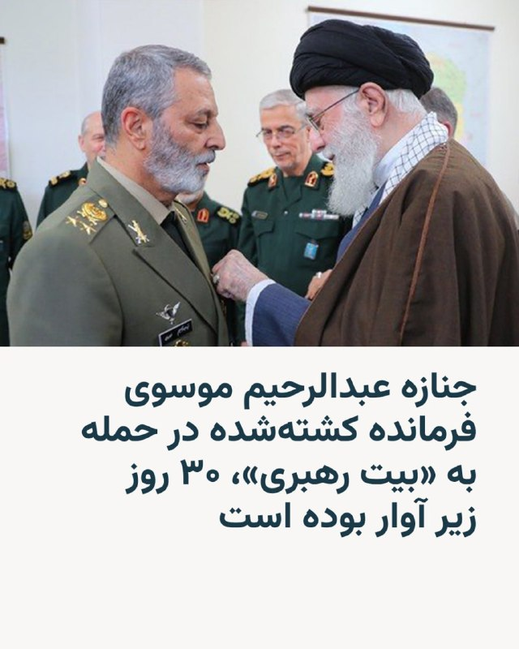

🔸پسر عبدالرحیم موسوی، فرمانده پیشین نیروهای مسلح، که در جریان حمله به «بیت رهبری» کشته شده بود، در یک گفت‌وگوی تلویزیونی اعلام کرد که جنازه پدرش ۳۰ روز زیر آوار بوده است.

🔸فرزند آقای موسوی گفت که حوالی ساعت ۹ صبح روز نهم اسفند ۱۴۰۴ قطعی شد که پدرش باید به جلسه برود و پس از حمله هوایی به بیت رهبری حدود ۳۰ روز گروه تفحص و او به دنبال پیکر پدرش می‌گشتند.

🔸در جریان حمله نهم اسفند به مقر علی‌خامنه‌ای، رهبر پیشین جمهوری اسلامی، علاوه بر او ده‌ها مقام بلندپایه حکومت کشته شدند.

@RadioFarda

## RadioFarda — post 157239

  <a href="https://t.me/radiofarda/157239" target="_blank">📎 Download file</a>

📻بشنوید: سرخط خبرها با رادیوفردا، ۲۶ اردیبهشت ۱۴۰۵‌

@RadioFarda

## IranianMinds — post 20224

  

کاش یه روزی بیاد که تنها دغدغه و اخبارای مهم مام این چیزا باشه:)

@IranianMinds

## IranianMinds — post 20223

  

۱۸ و ۱۹ دی ، میلیونها ایرانی بند کفششون رو بستند که ایرانو از بند جمهوری اسلامی آزاد کنند. بیش از پنجاه هزار نفرشون دیگه برنگشتند. ما تا روز دادخواهی، به زندگی عادی برنخواهیم گشت.
آخرین عکس از جاویدنام محسن جبارزاده

@IranianMinds

## IranianMinds — post 20222

🔴 ترامپ در گفت‌وگو با فاکس‌نیوز:

می‌دونم مردم آمریکا فشار اقتصادی رو تحمل می‌کنن، اما باید جلوی این گروهِ واقعا دیوانه(جمهوری اسلامی) رو بگیریم.

جمهوری اسلامی از نظر نظامی «شدیدا ضربه خورده» و «دیگه نه نیروی دریایی دارن، نه نیروی هوایی؛ همه‌چیزشون نابود شده.»

هر بار توافق می‌کنن، فرداش انگار نه انگار همچین حرفی زده شده. واقعا دیوانه‌ان و به همین خاطر نمی‌تونن سلاح هسته‌ای داشته باشن.

آمریکا عمدا بعضی زیرساخت‌های ایران رو هدف نگرفته، اما «اگر بخواهیم، می‌توانیم ظرف دو روز همه‌چیز رو نابود کنیم.»

@IranianMinds

## IranianMinds — post 20221

🔴 طبق برخی گزارشات

مهدی طارمی، شجاع خلیل زاده، دانیال اسماعیلی فر و احسان حاج صفی

به علت گذراندن خدمت سربازی در سپاه ویزا براشون صادر نشد

@IranianMinds

## IranianMinds — post 20220

  

ترامپ:

امشب به دستور من، نیروهای شجاع آمریکایی و نیروهای مسلح نیجریه یک ماموریت با برنامه ریزی دقیق و بسیار پیچیده را برای از بین بردن فعال ترین تروریست جهان از میدان نبرد، بدون نقص اجرا کردند.

ابوبلال المنوکی، دومین فرمانده داعش در سطح جهان، فکر می‌کرد که می‌تواند در آفریقا مخفی شود، اما او نمی‌دانست که ما منابعی داریم که ما را در جریان کارهای او قرار می‌دهند. او دیگر مردم آفریقا را به وحشت نخواهد انداخت، یا به برنامه ریزی عملیات برای هدف قرار دادن آمریکایی ها کمک نخواهد کرد.

با برکناری او، عملیات جهانی داعش تا حد زیادی کاهش یافته است. با تشکر از دولت نیجریه برای مشارکت شما در این عملیات. خدا برکت آمریکا را بدهد!

@IranianMinds

## BBCPersian — post 281192

🔻انفجار کنترل شده بمب‌های عمل نکرده در شیراز و حومه به مدت سه روز

محمد فرهادی، رئیس ستاد ارشد نظامی ارتش در استان‌های فارس و کهگیلویه و بویراحمد از انفجار کنترل شده بمب‌های عمل نکرده در شیراز طی سه روز خبر داد.

او گفته است که عملیات خنثی سازی و انفجار کنترل شده بمب‌های عمل نکرده جنگ در شیراز و حومه این شهر از امروز به مدت سه روز انجام می شود.

روابط عمومی ستاد ارتش در این استان‌ها هم گفته است که شنیده شدن صدا هر گونه انفجاری مربوط به این عملیات است.
https://bbc.in/3RJvbmB
@BBCPersian

## BBCPersian — post 281191

🔻واکنش اولیانوف به پیشنهاد تعلیق ۲۰ ساله برنامه هسته‌ای ایران: موضع آمریکا فاقد استدلال است

میخائیل اولیانوف، نماینده روسیه در آژانس بین‌المللی انرژی اتمی در وین به پیشنهاد دونالد ترامپ در مورد تعلیق ۲۰ ساله برنامه هسته‌ای ایران واکنش نشان داده و گفته است: «چرا ۲۰ سال و نه ۱۵ یا ۲۵ سال؟»

آقای اولیانوف در پستی در شبکه اجتماعی ایکس موضع آمریکا را «فاقد هر گونه استدلال» و صرفا براساس «ملاحظات ایدئولوژیک» دانسته و افزوده است: «اگر چنین رویکردی برای آمریکا قابل قبول است، لطفا در صورت بی نتیجه بودن آن شکایت نکنید.»

دونالد ترامپ ساعاتی پیش، پس از بازگشت از پکن گفته بود که تعلیق ۲۰ ساله برنامه هسته‌ای ایران را می‌پذیرد.

پیشتر، او از ایران خواسته بود که غنی‌سازی اورانیوم را به طور دائم متوقف کند و از دستیابی به سلاح‌های هسته‌ای برای همیشه جلوگیری شود.

اخیرا ایران پیشنهاد‌های آمریکا برای رسیدن به توافق را رد کرده بود و پس آن هم واشنگتن پیشنهاد‌های تهران را قابل قبول ندانست.

@BBCPersian

## BBCPersian — post 281183

🖊عمر دراز ننگیانه, بی‌بی‌سی اردو،‌ اسلام‌آباد

در حالی که در روزهای اخیر برخی محافل در آمریکا نسبت به نقش پاکستان به عنوان میانجی مذاکرات ایران و آمریکا ابراز تردید کرده‌اند، واشنگتن و تهران بار دیگر بر اعتماد خود به نقش اسلام‌آباد تاکید کرده‌اند.

با این حال، به نظر می‌آید روند میانجی‌گری در بن‌بست قرار گرفته است. ایران چند روز پیش پیشنهادهای خود درباره آتش‌بس را از طریق پاکستان برای آمریکا فرستاد، اما دونالد ترامپ، رئیس‌جمهور آمریکا، این پیشنهادها را «غیرقابل قبول» خواند و رد کرد.

از آن زمان تاکنون، تحول مهمی در این فرایند رخ نداده است.

اما تنها یک روز پیش از آغاز سفر دونالد ترامپ، رئیس‌جمهور آمریکا، به پکن، چین از طریق خبرگزاری رسمی خود پیامی منتشر کرد و از پاکستان خواست «روند میانجی‌گری میان آمریکا و ایران را تسریع کند».

اکنون پرسش اصلی این است که اسلام‌آباد چگونه می‌تواند روند میانجی‌گری را که ظاهرا در بن‌بست قرار گرفته و فعلا بیشتر به انتقال پیام محدود شده، تسریع کند؟

برای خواندن مطلب کامل:
https://bbc.in/4dtS7xK
📸GettyImages/ AFP/ White House/VCG
@BBCPersian

## BBCPersian — post 281182

  

🔻دونالد ترامپ، رئیس جمهور آمریکا گفته است که نیروهای آمریکا و نیجریه در یک عملیات مشترک، نفر دوم گروه دولت اسلامی (داعش) را کشته‌اند.

آقای ترامپ در پستی در تروث سوشال گفت که ابوبلال المینوکی دیگر به مردم آفریقا آسیب نخواهد زد و نمی‌تواند برای هدف قرار دادن آمریکایی‌ها عملیات برنامه‌ریزی کند.

او المینوکی را «فعال‌ترین تروریست جهان» توصیف کرد و گفت که با کشته شدن او، عملیات جهانی این گروه به‌شدت تضعیف شده است.

المینوکی در سال ۲۰۲۳ به دلیل ارتباط با گروه داعش تحت تحریم‌های ایالات متحده قرار گرفته بود.

📷Getty Images
@BBCPersian

## BBCPersian — post 281181

  

‌ ‌ ‌
آژانس بهداشتی آفریقا شیوع ابولا را در استان شرقی ایتوری جمهوری دموکراتیک کنگو اعلام کرد.

مرکز کنترل و پیشگیری از بیماری‌های آفریقا اعلام کرد که حدود ۲۴۶ مورد ابتلا و ۶۵ مورد مرگ گزارش شده است که عمدتا در شهرهای معدن طلا در مونگوالو و روآمپارا اتفاق افتاده است.

مقامات اوگاندا روز جمعه یک مورد ابتلا به ابولا از جمهوری دموکراتیک کنگو را تایید کردند و وزارت بهداشت آن کشور اعلام کرد که آزمایش یک مرد ۵۹ ساله که روز پنجشنبه درگذشت، مثبت بوده است.

ابولا اولین بار در سال ۱۹۷۶ در جایی که اکنون جمهوری دموکراتیک کنگو است، کشف شد و تصور می‌شود که از خفاش‌ها شیوع یافته باشد. این هفدهمین شیوع این بیماری ویروسی کشنده در آن کشور است.

این بیماری از طریق تماس مستقیم با مایعات بدن و از طریق پوست آسیب دیده منتقل می‌شود و باعث خونریزی شدید و نارسایی اندام می‌شود.

https://bbc.in/4nwKU4t
📷Reuters
@BBCPersian

## BBCPersian — post 281180

  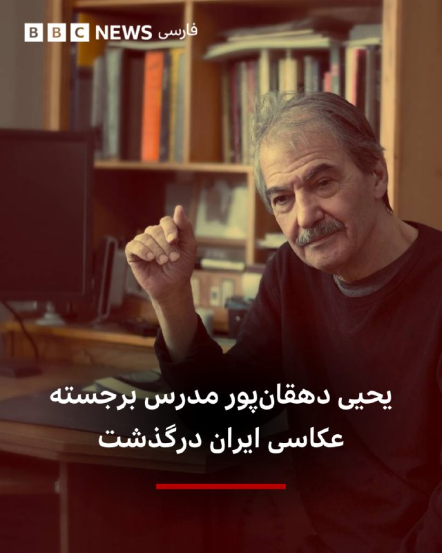

‌ ‌ ‌
رسانه‌های ایران خبر از درگذشت یحیی دهقان‌پور عکاس پیشکسوت و مدرس رشته عکاسی داده‌اند.

آقای دهقان‌پور متولد سال ۱۳۱۹ خورشیدی بود و در خصوص او نوشته‌اند که «نه‌ تنها به عنوان یک عکاس صاحب‌سبک شناخته می‌شد، بلکه با سال‌ها تدریس در مراکز آموزشی، نسل‌های متعددی از عکاسان را تربیت کرد» و «او در میان شاگردانش به عنوان یکی از پایه‌گذاران نگاه معاصر به آموزش عکاسی شناخته شود.»
از مهم‌ترین آثار او می‌توان به مجموعه تصاویر از مراسم خاکسپاری فروغ فرخزاد در سال ۱۳۴۵ اشاره کرد.

📷Masoud Momenha
@BBCPersian

## manototv — post 105505

  <a href="telegram/content/manototv_105505_1778913609.mp4" target="_blank">🎬 Download video</a>

رسانه‌های اسرائیلی گزارش داده‌اند با بازگشت دونالد ترامپ، رئیس‌جمهوری آمریکا، از سفر چین، کاخ سفید به مرحله‌ای تعیین‌کننده در پرونده ایران نزدیک شده و احتمال تصمیم‌گیری درباره اقدام نظامی در روزهای آینده افزایش یافته است.
کانال ۱۲ اسرائیل گزارش داد در اسرائیل برآورد می‌شود دونالد ترامپ طی ۲۴ ساعت آینده درباره اقدام نظامی علیه جمهوری اسلامی تصمیم‌گیری کند. این شبکه به نقل از یک مقام ارشد اسرائیلی گزارش داد «ازسرگیری درگیری‌ها نزدیک است» و اسرائیل خود را برای «روزها تا هفته‌ها درگیری» آماده می‌کند.
بر اساس این گزارش، مقام‌های اسرائیلی معتقدند آمریکا به این جمع‌بندی رسیده که مذاکرات با ایران به سمت پیشرفت جدی حرکت نمی‌کند و انتظار می‌رود تصویر روشن‌تری از تصمیم واشنگتن طی ساعات آینده مشخص شود.

## manototv — post 105504

  <a href="telegram/content/manototv_105504_1778913609.mp4" target="_blank">🎬 Download video</a>

دونالد ترامپ، رئیس‌جمهوری آمریکا، در تروث سوشیال اعلام کرد نیروهای آمریکایی و ارتش نیجریه در عملیاتی مشترک، «ابوبلال المنوکی» از فرماندهان ارشد داعش را کشته‌اند.
ترامپ گفت این عملیات به دستور او و با برنامه‌ریزی دقیق انجام شده و «ابوبلال المنوکی» که به گفته او نفر دوم داعش در سطح جهانی بوده، در آفریقا مخفی شده بود.
او افزود با کشته شدن این فرمانده داعش، توان عملیاتی جهانی این گروه به‌شدت تضعیف شده است.

## manototv — post 105503

  <a href="telegram/content/manototv_105503_1778913610.mp4" target="_blank">🎬 Download video</a>

شبکه سی‌ان‌ان به نقل از چند منبع گزارش داده هکرهای مظنون به ارتباط با ایران موفق شده‌اند به سامانه‌های پایش مخازن سوخت در آمریکا نفوذ کنند و نمایشگر میزان سوخت را تغییر دهند.
بر اساس این گزارش، سامانه‌های «اندازه‌گیری خودکار مخازن» بدون رمز عبور و متصل به اینترنت بوده‌اند. منابع آگاه می‌گویند هکرها توانسته‌اند ارقام نمایش‌داده‌شده را دستکاری کنند، اما امکان تغییر واقعی میزان سوخت در مخازن را نداشته‌اند و هیچ خسارت فیزیکی گزارش نشده است.
سی‌ان‌ان همچنین گزارش داده این حملات تنها به سامانه‌های سوخت محدود نبوده و زیرساخت‌های نظامی و شبکه‌های آب آمریکا را نیز هدف قرار گرفته‌اند.

## alonews — post 120316

  <a href="telegram/content/alonews_120316_1778913610.webm" target="_blank">🎬 Download video</a>

👈رسانه‌های عراقی از شنیده‌شدن صدای انفجار در منطقه الکراده بغداد خبر دادند

✅ @AloNews خبر جنگ

## alonews — post 120315

  <a href="telegram/content/alonews_120315_1778913610.webm" target="_blank">🎬 Download video</a>

👈پیام پزشکیان به رهبر کاتولیک‌های جهان: از موضع اخلاقی و منطقی شما در قبال تجاوزات نظامی اخیر به ایران قدردانی می‌کنم

🔴حملات آمریکا و اسرائیل صرفاً علیه ایران نیست، بلکه علیه حاکمیت قانون و ارزش‌های انسانی است

✅ @AloNews خبر جنگ

## alonews — post 120314

  <a href="telegram/content/alonews_120314_1778913611.webm" target="_blank">🎬 Download video</a>

🔴فوووری / منابع روسی: یک جنگنده سوخو-35 نیروی هوایی روسیه، یک جنگنده F-16 فایتینگ فالکون ناتو را سرنگون کرده است

✅ @AloNews خبر جنگ

## alonews — post 120313

  <a href="telegram/content/alonews_120313_1778913611.webm" target="_blank">🎬 Download video</a>

👈هشدار نارنجی هواشناسی: بارش‌های شدید و وزش باد در شمال کشور

✅ @AloNews خبر جنگ

## alonews — post 120312

  <a href="telegram/content/alonews_120312_1778913611.webm" target="_blank">🎬 Download video</a>

👈کوبا: آماده دفاع از خود در مقابل تهاجم احتمالی آمریکا هستیم

✅ @AloNews خبر جنگ

## alonews — post 120311

  <a href="telegram/content/alonews_120311_1778913611.webm" target="_blank">🎬 Download video</a>

👈مدیرکل مدیریت بحران استانداری اصفهان گفت: در ساعات بعدازظهر امروز تا روز دوشنبه وزش باد شدید و تندبادهای لحظه‌ای همراه با گردوغبار در استان پیش‌بینی می‌شود و سرعت باد به ۹۰ کیلومتر می‌رسد.

✅ @AloNews خبر جنگ

## alonews — post 120310

  <a href="telegram/content/alonews_120310_1778913611.webm" target="_blank">🎬 Download video</a>

👈انفجار کنترل‌شده بمب‌های عمل‌نکرده در شیراز 

✅ @AloNews خبر جنگ

## alonews — post 120309

  <a href="telegram/content/alonews_120309_1778913611.webm" target="_blank">🎬 Download video</a>

👈رویترز: ایالات متحده ممکن است از اسرائیل بخواهد میلیاردها دلار از وجوه مالیاتی فلسطینیان که مسدود شده است را به حمایت از طرح بازسازی غزه توسط ترامپ اختصاص دهد.

✅ @AloNews خبر جنگ

## alonews — post 120308

  <a href="telegram/content/alonews_120308_1778913611.mp4" target="_blank">🎬 Download video</a>

👈ویدئوهای منتشر شده در شبکه‌های اجتماعی از یک انفجار مهیب در مکزیک خبر می‌دهند که یک جشن مردمی را به تراژدی تبدیل کرد.

🔴 این حادثه در ایالت «خالیسکو» رخ داد؛ جایی که پرتاب جرقه ناشی از آتش‌بازی به مخازن گاز، باعث ایجاد یک انفجار قدرتمند شد.

🔴 در پی این انفجار، دست‌کم یک نفر کشته و بیش از ۲۰ تن دیگر مجروح شدند.

✅ @AloNews خبر جنگ

## alonews — post 120307

  <a href="telegram/content/alonews_120307_1778913613.mp4" target="_blank">🎬 Download video</a>

👈بن گویر وزیر امنیت ملی اسرائیل:
ما در دوره نصرت الهی هستیم.

🔴ما در دوره ای از آغاز رستگاری هستیم و فقط باید به راه خود ادامه دهیم و بدون توقف ادامه دهیم

🔴در لبنان، غزه، و یهودیه و سامره (کرانه باختری) توقف نکنید

✅ @AloNews خبر جنگ

## alonews — post 120306

  <a href="telegram/content/alonews_120306_1778913615.mp4" target="_blank">🎬 Download video</a>

👈به دستور ممدانی شهردار نیویورک، ۴۰۰ موتور سیکلت این شهر که رانندگان آن ها از کلاه ایمنی استفاده نمی‌کردند منهدم شدند

🔴به گفته وی، این کار در راستای تقویت فرهنگ استفاده از کلاه ایمنی انجام شده است

✅ @AloNews خبر جنگ

## alonews — post 120305

  <a href="telegram/content/alonews_120305_1778913615.webm" target="_blank">🎬 Download video</a>

👈رئیس‌جمهور فنلاند: آمریکا از ناتو خارج نخواهد شد

✅ @AloNews خبر جنگ

## alonews — post 120304

  <a href="telegram/content/alonews_120304_1778913615.webm" target="_blank">🎬 Download video</a>

👈رئیس سازمان اداری و استخدامی: ساعت کاری جدید اداره‌ها از امروز اجرایی می‌شود و تا نیمه شهریور ادامه دارد

✅ @AloNews خبر جنگ

## alonews — post 120303

  <a href="telegram/content/alonews_120303_1778913616.webm" target="_blank">🎬 Download video</a>

👈روزنامه دیلی تلگراف گزارش داد، احتمال آن که کر استارمر نخست وزیر انگلیس از سمت خود به نقل شهردار منچستر کناره گیری کند وجود دارد.

✅ @AloNews خبر جنگ

## alonews — post 120302

  <a href="telegram/content/alonews_120302_1778913616.webm" target="_blank">🎬 Download video</a>

👈 دونالد ترامپ، مدعی شد در جریان یک عملیات مشترک میان نیروهای آمریکایی و نیجریه‌ای، «ابوبلال المنوکی»، مرد شماره دو  داعش را از پای درآوردیم.

✅ @AloNews خبر جنگ

## alonews — post 120301

  <a href="telegram/content/alonews_120301_1778913616.webm" target="_blank">🎬 Download video</a>

👈سفیر چین در سازمان ملل، از پیش‌نویس قطعنامه پیشنهادی آمریکا و بحرین دربارۀ تنگه هرمز انتقاد و تاکید کرد که محتوا و زمان آن مناسب نیست و تصویب آن کمک‌کننده نخواهد بود

✅ @AloNews خبر جنگ

<!-- MSG END -->

<!-- NAV START -->

<a href="https://github.com/morii86/aio-downloader/blob/main/telegram/content/archive_1.md" style="display:inline-block; padding:6px 12px; margin:0 4px; background-color:#2ea44f; color:white; text-decoration:none; border-radius:4px; font-weight:bold;">صفحه بعد</a>

<!-- NAV END -->
